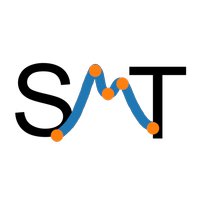

# Surrogate Modeling Toolbox

[](https://github.com/SMTorg/smt/actions?query=workflow%3ATests)
[](https://coveralls.io/github/SMTorg/smt?branch=master)
[](https://smt.readthedocs.io/en/latest/?badge=latest)
[](https://github.com/astral-sh/ruff)

The surrogate modeling toolbox (SMT) is a Python package that contains a collection of surrogate modeling methods, sampling techniques, and benchmarking functions. This package provides a library of surrogate models that is simple to use and facilitates the implementation of additional methods.

SMT is different from existing surrogate modeling libraries because of its emphasis on derivatives, including training derivatives used for gradient-enhanced modeling, prediction derivatives, and derivatives with respect to the training data.

It also includes new surrogate models that are not available elsewhere: kriging by partial-least squares reduction and energy-minimizing spline interpolation.
SMT is documented using custom tools for embedding automatically-tested code and dynamically-generated plots to produce high-quality user guides with minimal effort from contributors.

SMT is distributed under the New BSD license.

To cite SMT 2.0: P. Saves and R. Lafage and N. Bartoli and Y. Diouane and J. H. Bussemaker and T. Lefebvre and J. T. Hwang and J. Morlier and J. R. R. A. Martins. SMT 2.0: A Surrogate Modeling Toolbox with a focus on Hierarchical and Mixed Variables Gaussian Processes. Advances in Engineering Software, 2024.

```latex
@article{saves2024smt,
         author = {P. Saves and R. Lafage and N. Bartoli and Y. Diouane and J. Bussemaker and T. Lefebvre and J. T. Hwang and J. Morlier and J. R. R. A. Martins},
         title = {{SMT 2.0: A} Surrogate Modeling Toolbox with a focus on Hierarchical and Mixed Variables Gaussian Processes},
         journal = {Advances in Engineering Sofware},
         year = {2024},
         volume = {188}, 
         pages = {103571},
         doi = {https://doi.org/10.1016/j.advengsoft.2023.103571}}
```

To cite SMT legacy: M. A. Bouhlel and J. T. Hwang and N. Bartoli and R. Lafage and J. Morlier and J. R. R. A. Martins. A Python surrogate modeling framework with derivatives. Advances in Engineering Software, 2019.

```latex
@article{SMT2019,
        Author = {Mohamed Amine Bouhlel and John T. Hwang and Nathalie Bartoli and Rémi Lafage and Joseph Morlier and Joaquim R. R. A. Martins},
        Journal = {Advances in Engineering Software},
        Title = {A Python surrogate modeling framework with derivatives},
        pages = {102662},
        issn = {0965-9978},
        doi = {https://doi.org/10.1016/j.advengsoft.2019.03.005},
        Year = {2019}}
```

# Required packages

SMT depends on the following modules: numpy, scipy, scikit-learn, pyDOE3 and Cython.

# Installation

If you want to install the latest release

```bash
pip install smt
```

or else if you want to install from the current master branch

```bash
pip install git+https://github.com/SMTOrg/smt.git@master
```

# Usage

For examples demonstrating how to use SMT, you can take a look at the [tutorial notebooks](https://github.com/SMTorg/smt/tree/master/tutorial#readme) or go to the 'smt/examples' folder.

# Documentation

[Documentation of Surrogate Modeling Toolbox](http://smt.readthedocs.io/en/stable).

# Contributing

To contribute to SMT refer to the [contributing section](https://smt.readthedocs.io/en/latest/_src_docs/dev_docs.html#contributing-to-smt)  of the documentation.

## Associated Scientific production
Bouhlel, Mohamed A., and Joaquim RRA Martins. "Gradient-enhanced kriging for high-dimensional problems." Engineering with Computers 35.1 (2019): 157-173.
Bouhlel, Mohamed Amine, Sicheng He, and Joaquim RRA Martins. "Scalable gradient–enhanced artificial neural networks for airfoil shape design in the subsonic and transonic regimes." Structural and Multidisciplinary Optimization 61.4 (2020): 1363-1376.
Bouhlel, M. A., Bartoli, N., Otsmane, A., and Morlier, J., An Improved Approach for Estimating the Hyperparameters of the Kriging Model for High-Dimensional Problems through the Partial Least Squares Method,” Mathematical Problems in Engineering, vol. 2016, Article ID 6723410, 2016.
Berguin, Steven H. "Jacobian-Enhanced Neural Networks." arXiv preprint arXiv:2406.09132 (2024).
Valayer, H., Bartoli, N., Castaño-Aguirre, M., Lafage, R., Lefebvre, T., Lopez-Lopera, A. F., & Mouton, S. (2024). A Python Toolbox for Data-Driven Aerodynamic Modeling Using Sparse Gaussian Processes. Aerospace, 11(4), 260.
Saves, P., Hallé-Hannan, E., Bussemaker, J., Diouane, Y., & Bartoli, N. (2026). Modeling hierarchical spaces: a review and unified framework for surrogate-based architecture design. Structural and Multidisciplinary Optimization, 69(3), 65.
Robani, M. D., Palar, P. S., Zuhal, L. R., Saves, P., & Morlier, J. (2025). SMT-EX: An explainable surrogate modeling toolbox for mixed-variables design exploration. In AIAA SCITECH 2025 Forum (p. 0777).
Gonel, Nicolas, Paul Saves, and Joseph Morlier. "Frequency-aware Surrogate Modeling With SMT Kernels For Advanced Data Forecasting." ECCOMAS AeroBest (2025).
Hwang, J. T., & Martins, J. R. (2018). A fast-prediction surrogate model for large datasets. Aerospace Science and Technology, 75, 74-87.
Dimitri Bettebghor, Nathalie Bartoli, Stephane Grihon, Joseph Morlier, and Manuel Samuelides. Surrogate modeling approximation using a mixture of experts based on EM joint estimation. Structural and Multidisciplinary Optimization, 43(2) :243–259, 2011. 10.1007/s00158-010-0554-2.
Castano-Aguirre, M., López-Lopera, F. A., Bartoli, N., Massa, F., & Lefebvre, T. Scalable Sparse Co-Kriging for Multi-Fidelity Data Fusion: An Application to Aerodynamics. Reliability Engineering & System Safety, 112485, 2026


