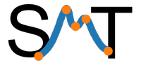

# Surrogate Modeling Toolbox

[](https://github.com/SMTorg/smt/actions?query=workflow%3ATests)
[](https://coveralls.io/github/SMTorg/smt?branch=master) 
[](https://smt.readthedocs.io/en/latest/?badge=latest)
[](https://github.com/astral-sh/ruff)

The surrogate modeling toolbox (SMT) is a Python package that contains a collection of surrogate modeling methods, sampling techniques, and benchmarking functions. This package provides a library of surrogate models that is simple to use and facilitates the implementation of additional methods.

SMT is different from existing surrogate modeling libraries because of its emphasis on derivatives, including training derivatives used for gradient-enhanced modeling, prediction derivatives, and derivatives with respect to the training data.

It also includes new surrogate models that are not available elsewhere: kriging by partial-least squares reduction and energy-minimizing spline interpolation.
SMT is documented using custom tools for embedding automatically-tested code and dynamically-generated plots to produce high-quality user guides with minimal effort from contributors.

SMT is distributed under the New BSD license.

To cite SMT 2.0: P. Saves and R. Lafage and N. Bartoli and Y. Diouane and J. H. Bussemaker and T. Lefebvre and J. T. Hwang and J. Morlier and J. R. R. A. Martins. SMT 2.0: A Surrogate Modeling Toolbox with a focus on Hierarchical and Mixed Variables Gaussian Processes. Advances in Engineering Software, 2024.

```
@article{saves2024smt,
         author = {P. Saves and R. Lafage and N. Bartoli and Y. Diouane and J. Bussemaker and T. Lefebvre and J. T. Hwang and J. Morlier and J. R. R. A. Martins},
         title = {{SMT 2.0: A} Surrogate Modeling Toolbox with a focus on Hierarchical and Mixed Variables Gaussian Processes},
         journal = {Advances in Engineering Sofware},
         year = {2024},
         volume = {188}, 
         pages = {103571},
         doi = {https://doi.org/10.1016/j.advengsoft.2023.103571}}
```

To cite SMT legacy: M. A. Bouhlel and J. T. Hwang and N. Bartoli and R. Lafage and J. Morlier and J. R. R. A. Martins. A Python surrogate modeling framework with derivatives. Advances in Engineering Software, 2019.

```
@article{SMT2019,
	Author = {Mohamed Amine Bouhlel and John T. Hwang and Nathalie Bartoli and Rémi Lafage and Joseph Morlier and Joaquim R. R. A. Martins},
	Journal = {Advances in Engineering Software},
	Title = {A Python surrogate modeling framework with derivatives},
	pages = {102662},
	issn = {0965-9978},
	doi = {https://doi.org/10.1016/j.advengsoft.2019.03.005},
	Year = {2019}}
```

# Required packages
SMT depends on the following modules: numpy, scipy, scikit-learn, pyDOE3 and Cython. 

# Installation
If you want to install the latest release

```
pip install smt
```

or else if you want to install from the current master branch

```
pip install git+https://github.com/SMTOrg/smt.git@master
```

# Usage
For examples demonstrating how to use SMT, you can take a look at the [tutorial notebooks](https://github.com/SMTorg/smt/tree/master/tutorial#readme) or go to the 'smt/examples' folder.

# Documentation
[Documentation of Surrogate Modeling Toolbox](http://smt.readthedocs.io/en/stable).

# Contributing
To contribute to SMT refer to the [contributing section](https://smt.readthedocs.io/en/latest/_src_docs/dev_docs.html#contributing-to-smt)  of the documentation.
