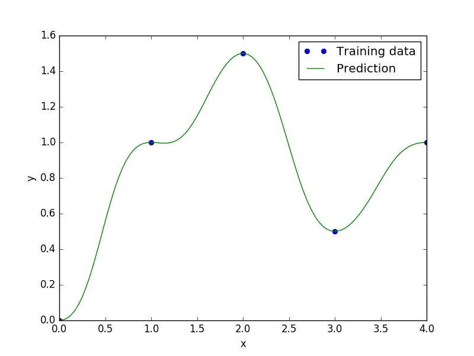

Inverse-distance weighting
==========================

The inverse distance weighting [1]_ model is an interpolating method and the unknown points are calculated with a weighted average of the sampling points.

The prediction value :math:`\hat{y}` at a given unknown point :math:`\bf x` using the samples :math:`{\bf y}` is given by

.. math ::
  \hat{y}=
  \left\{
  \begin{array}{ll}
  \frac{\sum\limits_{i=1}^n\beta_iy_i}{\sum\limits_{i=1}^n\beta_i},&\text{if}\quad d({\bf x},{\bf x}^{(i)})\neq 0 \quad \forall i\\
  y_i&\text{if}\quad d({\bf x},{\bf x}^{(i)})= 0
  \end{array}
  \right.

where :math:`\beta_i = \frac{1}{d({\bf x},{{\bf x}^{(i)}})^p}` with :math:`p` a positive real number, called the power parameter.

.. [1] Shepard, D., A Two-dimensional Interpolation Function for Irregularly-spaced Data, Proceedings of the 1968 23rd ACM National Conference, 1968, pp. 517--524.

Usage
-----

.. code-block:: python

  import numpy as np
  import matplotlib.pyplot as plt
  
  from smt.methods import IDW
  
  xt = np.array([0., 1., 2., 3., 4.])
  yt = np.array([0., 1., 1.5, 0.5, 1.0])
  
  sm = IDW(p=2)
  sm.set_training_values(xt, yt)
  sm.train()
  
  num = 100
  x = np.linspace(0., 4., num)
  y = sm.predict_values(x)
  
  plt.plot(xt, yt, 'o')
  plt.plot(x, y)
  plt.xlabel('x')
  plt.ylabel('y')
  plt.legend(['Training data', 'Prediction'])
  plt.show()
  
::

  ___________________________________________________________________________
     
                                      IDW
  ___________________________________________________________________________
     
   Problem size
     
        # training points.        : 5
     
  ___________________________________________________________________________
     
   Training
     
     Training ...
     Training - done. Time (sec):  0.0001521
  ___________________________________________________________________________
     
   Evaluation
     
        # eval points. : 100
     
     Predicting ...
     Predicting - done. Time (sec):  0.0000420
     
     Prediction time/pt. (sec) :  0.0000004
     
  

Options
-------

.. list-table:: List of options
  :header-rows: 1
  :widths: 15, 10, 20, 20, 30
  :stub-columns: 0

  *  -  Option
     -  Default
     -  Acceptable values
     -  Acceptable types
     -  Description
  *  -  print_global
     -  True
     -  None
     -  ['bool']
     -  Global print toggle. If False, all printing is suppressed
  *  -  print_training
     -  True
     -  None
     -  ['bool']
     -  Whether to print training information
  *  -  print_prediction
     -  True
     -  None
     -  ['bool']
     -  Whether to print prediction information
  *  -  print_problem
     -  True
     -  None
     -  ['bool']
     -  Whether to print problem information
  *  -  print_solver
     -  True
     -  None
     -  ['bool']
     -  Whether to print solver information
  *  -  p
     -  2.5
     -  None
     -  ['int', 'float']
     -  order of distance norm
  *  -  data_dir
     -  None
     -  None
     -  ['str']
     -  Directory for loading / saving cached data; None means do not save or load
