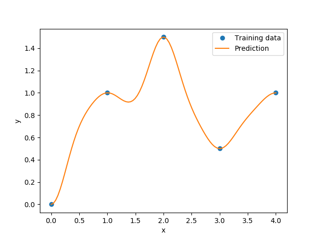

KPLSK
=====

KPLSK is a KPLS-based model and is basically built in two steps.
The first step consists in running KPLS and giving the estimate hyperparameters expressed in the reduced space with a number of dimensions equals to :math:`h`.
The second step consists in expressing the estimate hyperparameters in the original space with a number of dimensions equals to :math:`d`, and then using it as a starting point to locally optimizing the likelihood function of a standard kriging.
The idea here is guessing a "good" initial hyperparameters and applying a gradient-based optimization using a classic kriging-kernels.
The "good" guess will be provided by KPLS: the solutions :math:`\left(\theta_1^*,\dots,\theta_h^*\right)` and the PLS-coefficients :math:`\left(w_1^{(k)},\dots,w_d^{(k)}\right)` for :math:`k=1,\dots,h`.
By a change of variables :math:`\eta_l=\sum_{k=1}^h\theta_k^*{w^{(k)}_l}^2`, for :math:`l=1,\dots,d`, we can express the initial hyperparameters point in the original space.
In the following example, a KPLS-Gaussian kernel function :math:`k_{\text{KPLS}}` is used for the demonstration (More details are given in [1]_):

.. math ::
  k_{\text{KPLS}}({\bf x}^{(i)},{\bf x}^{(j)}) &=&\sigma\prod\limits_{k=1}^h\prod\limits_{l=1}^d\exp{\left(-\theta_k {w_l^{(k)}}^2\left(x_l^{(i)}-x_l^{(j)}\right)^2\right)}\\
  &=&\sigma\exp\left(\sum\limits_{l=1}^d\sum\limits_{k=1}^h-\theta_k{w_l^{(k)}}^2\left(x_l^{(i)}-x_l^{(j)}\right)^2\right)\qquad \text{Change of variables}\\
  &=&\sigma\exp\left(\sum\limits_{l=1}^d-\eta_l\left(x_l^{(i)}-x_l^{(j)}\right)^2\right)\\
  &=&\sigma\prod\limits_{l=1}^d\exp\left(-\eta_l\left(x_l^{(i)}-x_l^{(j)}\right)^2\right).\\

:math:`\prod\limits_{l=1}^d\exp\left(-\eta_l\left(x_l^{(i)}-x_l^{(j)}\right)^2\right)` is a standard Gaussian kernel function.

Subsequently, the hyperparameters point :math:`\left(\eta_1=\sum_{k=1}^h\theta_k^*{w^{(k)}_1}^2,\dots,\eta_d=\sum_{k=1}^h\theta_k^*{w^{(k)}_d}^2\right)` is used as a starting point for a gradient-based optimization applied on a standard kriging method.

.. [1] Bouhlel, M. A., Bartoli, N., Otsmane, A., and Morlier, J., An Improved Approach for Estimating the Hyperparameters of the Kriging Model for High-Dimensional Problems through the Partial Least Squares Method," Mathematical Problems in Engineering, vol. 2016, Article ID 6723410, 2016.

Usage
-----

.. code-block:: python

  import numpy as np
  import matplotlib.pyplot as plt
  
  from smt.methods import KPLSK
  
  xt = np.array([0., 1., 2., 3., 4.])
  yt = np.array([0., 1., 1.5, 0.5, 1.0])
  
  sm = KPLSK(theta0=[1e-2])
  sm.set_training_values(xt, yt)
  sm.train()
  
  num = 100
  x = np.linspace(0., 4., num)
  y = sm.predict_values(x)
  yy = sm.predict_derivatives(xt,0)        
  plt.plot(xt, yt, 'o')
  plt.plot(x, y)
  plt.xlabel('x')
  plt.ylabel('y')
  plt.legend(['Training data', 'Prediction'])
  plt.show()
  
::

  ___________________________________________________________________________
     
                                     KPLSK
  ___________________________________________________________________________
     
   Problem size
     
        # training points.        : 5
     
  ___________________________________________________________________________
     
   Training
     
     Training ...
     Training - done. Time (sec):  0.0116217
  ___________________________________________________________________________
     
   Evaluation
     
        # eval points. : 100
     
     Predicting ...
     Predicting - done. Time (sec):  0.0001647
     
     Prediction time/pt. (sec) :  0.0000016
     
  ___________________________________________________________________________
     
   Evaluation
     
        # eval points. : 5
     
     Predicting ...
     Predicting - done. Time (sec):  0.0001242
     
     Prediction time/pt. (sec) :  0.0000248
     
  

Options
-------

.. list-table:: List of options
  :header-rows: 1
  :widths: 15, 10, 20, 20, 30
  :stub-columns: 0

  *  -  Option
     -  Default
     -  Acceptable values
     -  Acceptable types
     -  Description
  *  -  print_global
     -  True
     -  None
     -  ['bool']
     -  Global print toggle. If False, all printing is suppressed
  *  -  print_training
     -  True
     -  None
     -  ['bool']
     -  Whether to print training information
  *  -  print_prediction
     -  True
     -  None
     -  ['bool']
     -  Whether to print prediction information
  *  -  print_problem
     -  True
     -  None
     -  ['bool']
     -  Whether to print problem information
  *  -  print_solver
     -  True
     -  None
     -  ['bool']
     -  Whether to print solver information
  *  -  poly
     -  constant
     -  ['constant', 'linear', 'quadratic']
     -  ['function']
     -  regr. term
  *  -  corr
     -  squar_exp
     -  ['abs_exp', 'squar_exp']
     -  ['function']
     -  type of corr. func.
  *  -  data_dir
     -  None
     -  None
     -  ['str']
     -  Directory for loading / saving cached data; None means do not save or load
  *  -  n_comp
     -  1
     -  None
     -  ['int']
     -  Number of principal components
  *  -  theta0
     -  [0.01]
     -  None
     -  ['list', 'ndarray']
     -  Initial hyperparameters
