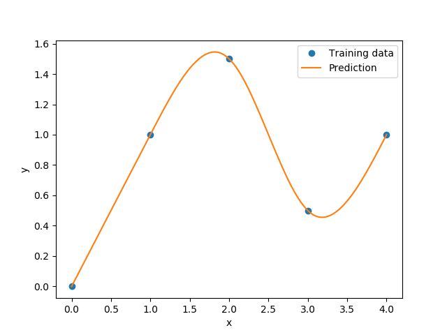

Regularized minimal-energy tensor-product B-splines
===================================================

Usage
-----

.. code-block:: python

  import numpy as np
  import matplotlib.pyplot as plt
  
  from smt.methods import RMTB
  
  xt = np.array([0., 1., 2., 3., 4.])
  yt = np.array([0., 1., 1.5, 0.5, 1.0])
  
  xlimits = np.array([[0., 4.]])
  
  sm = RMTB(xlimits=xlimits, order=4, num_ctrl_pts=20, reg_dv=1e-15, reg_cons=1e-15)
  sm.set_training_values(xt, yt)
  sm.train()
  
  num = 100
  x = np.linspace(0., 4., num)
  y = sm.predict_values(x)
  
  plt.plot(xt, yt, 'o')
  plt.plot(x, y)
  plt.xlabel('x')
  plt.ylabel('y')
  plt.legend(['Training data', 'Prediction'])
  plt.show()
  
::

  ___________________________________________________________________________
     
                                     RMTB
  ___________________________________________________________________________
     
   Problem size
     
        # training points.        : 5
     
  ___________________________________________________________________________
     
   Training
     
     Training ...
        Pre-computing matrices ...
           Computing dof2coeff ...
           Computing dof2coeff - done. Time (sec):  0.0000029
           Initializing Hessian ...
           Initializing Hessian - done. Time (sec):  0.0003579
           Computing energy terms ...
           Computing energy terms - done. Time (sec):  0.0010941
           Computing approximation terms ...
           Computing approximation terms - done. Time (sec):  0.0003972
        Pre-computing matrices - done. Time (sec):  0.0019121
        Solving for degrees of freedom ...
           Solving initial linear problem (n=20) ...
              Assembling linear system ...
              Assembling linear system - done. Time (sec):  0.0004537
              Initializing linear solver ...
              Initializing linear solver - done. Time (sec):  0.0000229
              Solving linear system (col. 0) ...
                 Running cg Krylov solver (20 x 20 mtx) ...
                 Running cg Krylov solver (20 x 20 mtx) - done. Time (sec):  0.0019271
              Solving linear system (col. 0) - done. Time (sec):  0.0019491
           Solving initial linear problem (n=20) - done. Time (sec):  0.0024538
           Solving nonlinear problem (col. 0) ...
              Nonlinear (itn, iy, grad. norm, func.) :   0   0 2.646068513e-15 1.135672323e-15
                 Assembling linear system ...
                 Assembling linear system - done. Time (sec):  0.0007591
                 Initializing linear solver ...
                 Initializing linear solver - done. Time (sec):  0.0000153
                 Solving linear system ...
                 Solving linear system - done. Time (sec):  0.0061779
                 Performing line search ...
                 Performing line search - done. Time (sec):  0.0010850
              Nonlinear (itn, iy, grad. norm, func.) :   1   0 2.646086053e-15 1.135672321e-15
                 Assembling linear system ...
                 Assembling linear system - done. Time (sec):  0.0008349
                 Initializing linear solver ...
                 Initializing linear solver - done. Time (sec):  0.0000279
                 Solving linear system ...
                 Solving linear system - done. Time (sec):  0.0019660
                 Performing line search ...
                 Performing line search - done. Time (sec):  0.0002279
              Nonlinear (itn, iy, grad. norm, func.) :   2   0 2.945795907e-14 1.135663464e-15
                 Assembling linear system ...
                 Assembling linear system - done. Time (sec):  0.0007470
                 Initializing linear solver ...
                 Initializing linear solver - done. Time (sec):  0.0000188
                 Solving linear system ...
                 Solving linear system - done. Time (sec):  0.0019748
                 Performing line search ...
                 Performing line search - done. Time (sec):  0.0000398
              Nonlinear (itn, iy, grad. norm, func.) :   3   0 9.225368607e-14 1.121276602e-15
                 Assembling linear system ...
                 Assembling linear system - done. Time (sec):  0.0007300
                 Initializing linear solver ...
                 Initializing linear solver - done. Time (sec):  0.0000169
                 Solving linear system ...
                 Solving linear system - done. Time (sec):  0.0024831
                 Performing line search ...
                 Performing line search - done. Time (sec):  0.0000401
              Nonlinear (itn, iy, grad. norm, func.) :   4   0 2.711738359e-14 1.119908145e-15
                 Assembling linear system ...
                 Assembling linear system - done. Time (sec):  0.0007610
                 Initializing linear solver ...
                 Initializing linear solver - done. Time (sec):  0.0000210
                 Solving linear system ...
                 Solving linear system - done. Time (sec):  0.0021682
                 Performing line search ...
                 Performing line search - done. Time (sec):  0.0000389
              Nonlinear (itn, iy, grad. norm, func.) :   5   0 7.833904678e-15 1.119647315e-15
           Solving nonlinear problem (col. 0) - done. Time (sec):  0.0228388
        Solving for degrees of freedom - done. Time (sec):  0.0253513
     Training - done. Time (sec):  0.0276370
  ___________________________________________________________________________
     
   Evaluation
     
        # eval points. : 100
     
     Predicting ...
     Predicting - done. Time (sec):  0.0003352
     
     Prediction time/pt. (sec) :  0.0000034
     
  

Options
-------

.. list-table:: List of options
  :header-rows: 1
  :widths: 15, 10, 20, 20, 30
  :stub-columns: 0

  *  -  Option
     -  Default
     -  Acceptable values
     -  Acceptable types
     -  Description
  *  -  print_global
     -  True
     -  None
     -  ['bool']
     -  Global print toggle. If False, all printing is suppressed
  *  -  print_training
     -  True
     -  None
     -  ['bool']
     -  Whether to print training information
  *  -  print_prediction
     -  True
     -  None
     -  ['bool']
     -  Whether to print prediction information
  *  -  print_problem
     -  True
     -  None
     -  ['bool']
     -  Whether to print problem information
  *  -  print_solver
     -  True
     -  None
     -  ['bool']
     -  Whether to print solver information
  *  -  xlimits
     -  None
     -  None
     -  ['ndarray']
     -  Lower/upper bounds in each dimension - ndarray [nx, 2]
  *  -  smoothness
     -  1.0
     -  None
     -  ['Integral', 'float', 'tuple', 'list', 'ndarray']
     -  Smoothness parameter in each dimension - length nx. None implies uniform
  *  -  reg_dv
     -  1e-10
     -  None
     -  ['Integral', 'float']
     -  Regularization coeff. for system degrees of freedom. This ensures there is always a unique solution
  *  -  reg_cons
     -  0.0001
     -  None
     -  ['Integral', 'float']
     -  Negative of the regularization coeff. of the Lagrange mult. block The weight of the energy terms (and reg_dv) relative to the approx terms
  *  -  extrapolate
     -  False
     -  None
     -  ['bool']
     -  Whether to perform linear extrapolation for external evaluation points
  *  -  min_energy
     -  True
     -  None
     -  ['bool']
     -  Whether to perform energy minimization
  *  -  approx_order
     -  4
     -  None
     -  ['Integral']
     -  Exponent in the approximation term
  *  -  mtx_free
     -  False
     -  None
     -  ['bool']
     -  Whether to solve the linear system in a matrix-free way
  *  -  solver
     -  krylov
     -  ['krylov-dense', 'dense-lu', 'dense-chol', 'lu', 'ilu', 'krylov', 'krylov-lu', 'krylov-mg', 'gs', 'jacobi', 'mg', 'null']
     -  ['LinearSolver']
     -  Linear solver
  *  -  grad_weight
     -  0.5
     -  None
     -  ['Integral', 'float']
     -  Weight on gradient training data
  *  -  nln_max_iter
     -  5
     -  None
     -  ['Integral']
     -  maximum number of nonlinear iterations
  *  -  line_search
     -  backtracking
     -  ['backtracking', 'bracketed', 'quadratic', 'cubic', 'null']
     -  ['LineSearch']
     -  Line search algorithm
  *  -  save_energy_terms
     -  False
     -  None
     -  ['bool']
     -  Whether to cache energy terms in the data_dir directory
  *  -  data_dir
     -  None
     -  [None]
     -  ['str']
     -  Directory for loading / saving cached data; None means do not save or load
  *  -  max_print_depth
     -  5
     -  None
     -  ['Integral']
     -  Maximum depth (level of nesting) to print operation descriptions and times
  *  -  order
     -  3
     -  None
     -  ['Integral', 'tuple', 'list', 'ndarray']
     -  B-spline order in each dimension - length [nx]
  *  -  num_ctrl_pts
     -  15
     -  None
     -  ['Integral', 'tuple', 'list', 'ndarray']
     -  # B-spline control points in each dimension - length [nx]
