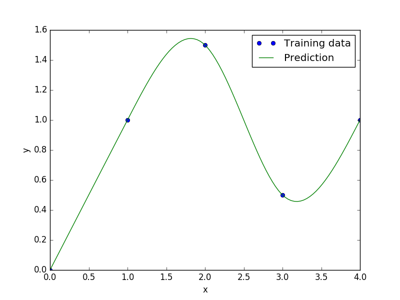

Regularized minimal-energy tensor-product splines
=================================================

Regularized minimal-energy tensor-product splines (RMTS) is a type of surrogate model for
low-dimensional problems with large datasets and where fast prediction is desired.
The underlying mathematical functions are tensor-product splines,
which limits RMTS to up to 4-D problems, or 5-D problems in certain cases.
On the other hand, tensor-product splines enable a very fast prediction time
that does not increase with the number of training points.
Unlike other methods like Kriging and radial basis functions,
RMTS is not susceptible to numerical issues when there is a large number of training points
or when there are points that are too close together.

The prediction equation for RMTS is

.. math ::

  \newcommand\w{\mathbf{w}}
  \newcommand\H{\mathbf{H}}
  \newcommand\F{\mathbf{F}}
  \newcommand\y{\mathbf{y}}
  \newcommand\x{\mathbf{x}}
  \newcommand\yt{\mathbf{yt}}
  \newcommand\xt{\mathbf{xt}}
  \y = \F(\x) \w
  ,

where
:math:`\x` is the vector of prediction inputs,
:math:`\y` is the vector of prediction outputs,
:math:`\w` is the vector of spline coefficients,
and
:math:`\F(\x)` is the matrix mapping the spline coefficients to the prediction outputs.

RMTS computes the coefficients of the splines, :math:`\w`, by solving an energy minimization problem
subject to the conditions that the splines pass through the training points.
This is formulated as an unconstrained optimization problem
where the objective function consists of a term containing the second derivatives of the splines,
another term representing the approximation error for the training points,
and another term for regularization:

.. math ::

  \begin{array}{r l}
    \underset{\w}{\min} & \frac{1}{2} \w^T \H \w
    + \frac{1}{2} \beta \w^T \w
    \\
    &
    + \frac{1}{2} \frac{1}{\alpha}
    \left[ \F(\xt) \w - \yt \right]^T
    \left[ \F(\xt) \w - \yt \right]
  \end{array}
  ,

where
:math:`\xt` is the vector of training inputs,
:math:`\yt` is the vector of training outputs,
:math:`\H` is the matrix containing the second derivatives,
:math:`\F(\xt)` is the matrix mapping the spline coefficients to the training outputs,
and :math:`\alpha` and :math:`\beta` are regularization coefficients.

In problems with a large number of training points relative to the number of spline coefficients,
the energy minimization term is not necessary;
this term can be zero-ed by setting the reg_cons option to zero.
In problems with a small dataset, the energy minimization is necessary.
When the true function has high curvature, the energy minimization can be counterproductive
in the regions of high curvature.
This can be addressed by increasing the quadratic approximation term to one of higher order,
and using Newton's method to solve the nonlinear system that results.
The nonlinear formulation is given by

.. math::

  \begin{array}{r l}
    \underset{\w}{\min} & \frac{1}{2} \w^T \H \w
    + \frac{1}{2} \beta \w^T \w
    \\
    &
    + \frac{1}{2} \frac{1}{\alpha}
    \sum_i \left[ \F(\xt) \w - \yt \right] ^ p_i
  \end{array}
  ,

where :math:`p_i` is the order given by the approx_order option.
The number of Newton iterations can be specified via the :code:`nln_max_iter` option.

RMTS is implemented in SMT with two choices of splines:

1. B-splines (RMTB): RMTB uses B-splines with a uniform knot vector in each dimension.
The number of B-spline control points and the B-spline order in each dimension are options
that trade off efficiency and precision of the interpolant.

2. Cubic Hermite splines (RMTC): RMTC divides the domain into tensor-product cubic elements.
For adjacent elements, the values and derivatives are continuous.
The number of elements in each dimension is an option that trades off efficiency and precision.

In general, RMTB is the better choice when training time is the most important,
while RMTC is the better choice when accuracy of the interpolant is the most important.

Usage (RMTB)
------------

.. code-block:: python

  import numpy as np
  import matplotlib.pyplot as plt
  
  from smt.methods import RMTB
  
  xt = np.array([0., 1., 2., 3., 4.])
  yt = np.array([0., 1., 1.5, 0.5, 1.0])
  
  xlimits = np.array([[0., 4.]])
  
  sm = RMTB(xlimits=xlimits, order=4, num_ctrl_pts=20, reg_dv=1e-15, reg_cons=1e-15)
  sm.set_training_values(xt, yt)
  sm.train()
  
  num = 100
  x = np.linspace(0., 4., num)
  y = sm.predict_values(x)
  
  plt.plot(xt, yt, 'o')
  plt.plot(x, y)
  plt.xlabel('x')
  plt.ylabel('y')
  plt.legend(['Training data', 'Prediction'])
  plt.show()
  
::

  ___________________________________________________________________________
     
                                     RMTB
  ___________________________________________________________________________
     
   Problem size
     
        # training points.        : 5
     
  ___________________________________________________________________________
     
   Training
     
     Training ...
        Pre-computing matrices ...
           Computing dof2coeff ...
           Computing dof2coeff - done. Time (sec):  0.0000019
           Initializing Hessian ...
           Initializing Hessian - done. Time (sec):  0.0003347
           Computing energy terms ...
           Computing energy terms - done. Time (sec):  0.0010221
           Computing approximation terms ...
           Computing approximation terms - done. Time (sec):  0.0003972
        Pre-computing matrices - done. Time (sec):  0.0018160
        Solving for degrees of freedom ...
           Solving initial linear problem (n=20) ...
              Assembling linear system ...
              Assembling linear system - done. Time (sec):  0.0004430
              Initializing linear solver ...
              Initializing linear solver - done. Time (sec):  0.0000200
              Solving linear system (col. 0) ...
                 Running cg Krylov solver (20 x 20 mtx) ...
                 Running cg Krylov solver (20 x 20 mtx) - done. Time (sec):  0.0018849
              Solving linear system (col. 0) - done. Time (sec):  0.0019069
           Solving initial linear problem (n=20) - done. Time (sec):  0.0023990
           Solving nonlinear problem (col. 0) ...
              Nonlinear (itn, iy, grad. norm, func.) :   0   0 2.646068513e-15 1.135672323e-15
                 Assembling linear system ...
                 Assembling linear system - done. Time (sec):  0.0007558
                 Initializing linear solver ...
                 Initializing linear solver - done. Time (sec):  0.0000148
                 Solving linear system ...
                 Solving linear system - done. Time (sec):  0.0061898
                 Performing line search ...
                 Performing line search - done. Time (sec):  0.0005798
              Nonlinear (itn, iy, grad. norm, func.) :   1   0 2.958916346e-15 1.135667790e-15
                 Assembling linear system ...
                 Assembling linear system - done. Time (sec):  0.0008099
                 Initializing linear solver ...
                 Initializing linear solver - done. Time (sec):  0.0000298
                 Solving linear system ...
                 Solving linear system - done. Time (sec):  0.0025580
                 Performing line search ...
                 Performing line search - done. Time (sec):  0.0000949
              Nonlinear (itn, iy, grad. norm, func.) :   2   0 1.124756199e-13 1.130347200e-15
                 Assembling linear system ...
                 Assembling linear system - done. Time (sec):  0.0009153
                 Initializing linear solver ...
                 Initializing linear solver - done. Time (sec):  0.0000253
                 Solving linear system ...
                 Solving linear system - done. Time (sec):  0.0022731
                 Performing line search ...
                 Performing line search - done. Time (sec):  0.0000398
              Nonlinear (itn, iy, grad. norm, func.) :   3   0 3.301153444e-14 1.119917820e-15
                 Assembling linear system ...
                 Assembling linear system - done. Time (sec):  0.0007453
                 Initializing linear solver ...
                 Initializing linear solver - done. Time (sec):  0.0000169
                 Solving linear system ...
                 Solving linear system - done. Time (sec):  0.0022330
                 Performing line search ...
                 Performing line search - done. Time (sec):  0.0000393
              Nonlinear (itn, iy, grad. norm, func.) :   4   0 9.406540080e-15 1.119646967e-15
                 Assembling linear system ...
                 Assembling linear system - done. Time (sec):  0.0007310
                 Initializing linear solver ...
                 Initializing linear solver - done. Time (sec):  0.0000184
                 Solving linear system ...
                 Solving linear system - done. Time (sec):  0.0020940
                 Performing line search ...
                 Performing line search - done. Time (sec):  0.0000670
              Nonlinear (itn, iy, grad. norm, func.) :   5   0 7.257840806e-15 1.119637838e-15
           Solving nonlinear problem (col. 0) - done. Time (sec):  0.0228581
        Solving for degrees of freedom - done. Time (sec):  0.0253141
     Training - done. Time (sec):  0.0274532
  ___________________________________________________________________________
     
   Evaluation
     
        # eval points. : 100
     
     Predicting ...
     Predicting - done. Time (sec):  0.0003400
     
     Prediction time/pt. (sec) :  0.0000034
     
  

Usage (RMTC)
------------

.. code-block:: python

  import numpy as np
  import matplotlib.pyplot as plt
  
  from smt.methods import RMTC
  
  xt = np.array([0., 1., 2., 3., 4.])
  yt = np.array([0., 1., 1.5, 0.5, 1.0])
  
  xlimits = np.array([[0., 4.]])
  
  sm = RMTC(xlimits=xlimits, num_elements=20, reg_dv=1e-15, reg_cons=1e-15)
  sm.set_training_values(xt, yt)
  sm.train()
  
  num = 100
  x = np.linspace(0., 4., num)
  y = sm.predict_values(x)
  
  plt.plot(xt, yt, 'o')
  plt.plot(x, y)
  plt.xlabel('x')
  plt.ylabel('y')
  plt.legend(['Training data', 'Prediction'])
  plt.show()
  
::

  ___________________________________________________________________________
     
                                     RMTC
  ___________________________________________________________________________
     
   Problem size
     
        # training points.        : 5
     
  ___________________________________________________________________________
     
   Training
     
     Training ...
        Pre-computing matrices ...
           Computing dof2coeff ...
           Computing dof2coeff - done. Time (sec):  0.0007989
           Initializing Hessian ...
           Initializing Hessian - done. Time (sec):  0.0003872
           Computing energy terms ...
           Computing energy terms - done. Time (sec):  0.0011239
           Computing approximation terms ...
           Computing approximation terms - done. Time (sec):  0.0005031
        Pre-computing matrices - done. Time (sec):  0.0028827
        Solving for degrees of freedom ...
           Solving initial linear problem (n=42) ...
              Assembling linear system ...
              Assembling linear system - done. Time (sec):  0.0004439
              Initializing linear solver ...
              Initializing linear solver - done. Time (sec):  0.0000198
              Solving linear system (col. 0) ...
                 Running cg Krylov solver (42 x 42 mtx) ...
                 Running cg Krylov solver (42 x 42 mtx) - done. Time (sec):  0.0022821
              Solving linear system (col. 0) - done. Time (sec):  0.0023031
           Solving initial linear problem (n=42) - done. Time (sec):  0.0027981
           Solving nonlinear problem (col. 0) ...
              Nonlinear (itn, iy, grad. norm, func.) :   0   0 3.799115482e-15 1.133573309e-15
                 Assembling linear system ...
                 Assembling linear system - done. Time (sec):  0.0007589
                 Initializing linear solver ...
                 Initializing linear solver - done. Time (sec):  0.0000153
                 Solving linear system ...
                 Solving linear system - done. Time (sec):  0.0062158
                 Performing line search ...
                 Performing line search - done. Time (sec):  0.0005889
              Nonlinear (itn, iy, grad. norm, func.) :   1   0 3.630563558e-15 1.133570797e-15
                 Assembling linear system ...
                 Assembling linear system - done. Time (sec):  0.0008447
                 Initializing linear solver ...
                 Initializing linear solver - done. Time (sec):  0.0000253
                 Solving linear system ...
                 Solving linear system - done. Time (sec):  0.0048752
                 Performing line search ...
                 Performing line search - done. Time (sec):  0.0000429
              Nonlinear (itn, iy, grad. norm, func.) :   2   0 1.695886087e-14 1.117611568e-15
                 Assembling linear system ...
                 Assembling linear system - done. Time (sec):  0.0007381
                 Initializing linear solver ...
                 Initializing linear solver - done. Time (sec):  0.0000179
                 Solving linear system ...
                 Solving linear system - done. Time (sec):  0.0060651
                 Performing line search ...
                 Performing line search - done. Time (sec):  0.0000439
              Nonlinear (itn, iy, grad. norm, func.) :   3   0 4.514073631e-15 1.117528217e-15
                 Assembling linear system ...
                 Assembling linear system - done. Time (sec):  0.0008299
                 Initializing linear solver ...
                 Initializing linear solver - done. Time (sec):  0.0000191
                 Solving linear system ...
                 Solving linear system - done. Time (sec):  0.0041389
                 Performing line search ...
                 Performing line search - done. Time (sec):  0.0000451
              Nonlinear (itn, iy, grad. norm, func.) :   4   0 1.009913860e-15 1.117516752e-15
                 Assembling linear system ...
                 Assembling linear system - done. Time (sec):  0.0008199
                 Initializing linear solver ...
                 Initializing linear solver - done. Time (sec):  0.0000210
                 Solving linear system ...
                 Solving linear system - done. Time (sec):  0.0038741
                 Performing line search ...
                 Performing line search - done. Time (sec):  0.0000420
              Nonlinear (itn, iy, grad. norm, func.) :   5   0 1.587034176e-16 1.117515739e-15
           Solving nonlinear problem (col. 0) - done. Time (sec):  0.0326569
        Solving for degrees of freedom - done. Time (sec):  0.0355172
     Training - done. Time (sec):  0.0387249
  ___________________________________________________________________________
     
   Evaluation
     
        # eval points. : 100
     
     Predicting ...
     Predicting - done. Time (sec):  0.0003159
     
     Prediction time/pt. (sec) :  0.0000032
     
  

Options (RMTB)
--------------

.. list-table:: List of options
  :header-rows: 1
  :widths: 15, 10, 20, 20, 30
  :stub-columns: 0

  *  -  Option
     -  Default
     -  Acceptable values
     -  Acceptable types
     -  Description
  *  -  print_global
     -  True
     -  None
     -  ['bool']
     -  Global print toggle. If False, all printing is suppressed
  *  -  print_training
     -  True
     -  None
     -  ['bool']
     -  Whether to print training information
  *  -  print_prediction
     -  True
     -  None
     -  ['bool']
     -  Whether to print prediction information
  *  -  print_problem
     -  True
     -  None
     -  ['bool']
     -  Whether to print problem information
  *  -  print_solver
     -  True
     -  None
     -  ['bool']
     -  Whether to print solver information
  *  -  xlimits
     -  None
     -  None
     -  ['ndarray']
     -  Lower/upper bounds in each dimension - ndarray [nx, 2]
  *  -  smoothness
     -  1.0
     -  None
     -  ['Integral', 'float', 'tuple', 'list', 'ndarray']
     -  Smoothness parameter in each dimension - length nx. None implies uniform
  *  -  reg_dv
     -  1e-10
     -  None
     -  ['Integral', 'float']
     -  Regularization coeff. for system degrees of freedom. This ensures there is always a unique solution
  *  -  reg_cons
     -  0.0001
     -  None
     -  ['Integral', 'float']
     -  Negative of the regularization coeff. of the Lagrange mult. block The weight of the energy terms (and reg_dv) relative to the approx terms
  *  -  extrapolate
     -  False
     -  None
     -  ['bool']
     -  Whether to perform linear extrapolation for external evaluation points
  *  -  min_energy
     -  True
     -  None
     -  ['bool']
     -  Whether to perform energy minimization
  *  -  approx_order
     -  4
     -  None
     -  ['Integral']
     -  Exponent in the approximation term
  *  -  mtx_free
     -  False
     -  None
     -  ['bool']
     -  Whether to solve the linear system in a matrix-free way
  *  -  solver
     -  krylov
     -  ['krylov-dense', 'dense-lu', 'dense-chol', 'lu', 'ilu', 'krylov', 'krylov-lu', 'krylov-mg', 'gs', 'jacobi', 'mg', 'null']
     -  ['LinearSolver']
     -  Linear solver
  *  -  grad_weight
     -  0.5
     -  None
     -  ['Integral', 'float']
     -  Weight on gradient training data
  *  -  nln_max_iter
     -  5
     -  None
     -  ['Integral']
     -  maximum number of nonlinear iterations
  *  -  line_search
     -  backtracking
     -  ['backtracking', 'bracketed', 'quadratic', 'cubic', 'null']
     -  ['LineSearch']
     -  Line search algorithm
  *  -  save_energy_terms
     -  False
     -  None
     -  ['bool']
     -  Whether to cache energy terms in the data_dir directory
  *  -  data_dir
     -  None
     -  [None]
     -  ['str']
     -  Directory for loading / saving cached data; None means do not save or load
  *  -  max_print_depth
     -  5
     -  None
     -  ['Integral']
     -  Maximum depth (level of nesting) to print operation descriptions and times
  *  -  order
     -  3
     -  None
     -  ['Integral', 'tuple', 'list', 'ndarray']
     -  B-spline order in each dimension - length [nx]
  *  -  num_ctrl_pts
     -  15
     -  None
     -  ['Integral', 'tuple', 'list', 'ndarray']
     -  # B-spline control points in each dimension - length [nx]

Options (RMTC)
--------------

.. list-table:: List of options
  :header-rows: 1
  :widths: 15, 10, 20, 20, 30
  :stub-columns: 0

  *  -  Option
     -  Default
     -  Acceptable values
     -  Acceptable types
     -  Description
  *  -  print_global
     -  True
     -  None
     -  ['bool']
     -  Global print toggle. If False, all printing is suppressed
  *  -  print_training
     -  True
     -  None
     -  ['bool']
     -  Whether to print training information
  *  -  print_prediction
     -  True
     -  None
     -  ['bool']
     -  Whether to print prediction information
  *  -  print_problem
     -  True
     -  None
     -  ['bool']
     -  Whether to print problem information
  *  -  print_solver
     -  True
     -  None
     -  ['bool']
     -  Whether to print solver information
  *  -  xlimits
     -  None
     -  None
     -  ['ndarray']
     -  Lower/upper bounds in each dimension - ndarray [nx, 2]
  *  -  smoothness
     -  1.0
     -  None
     -  ['Integral', 'float', 'tuple', 'list', 'ndarray']
     -  Smoothness parameter in each dimension - length nx. None implies uniform
  *  -  reg_dv
     -  1e-10
     -  None
     -  ['Integral', 'float']
     -  Regularization coeff. for system degrees of freedom. This ensures there is always a unique solution
  *  -  reg_cons
     -  0.0001
     -  None
     -  ['Integral', 'float']
     -  Negative of the regularization coeff. of the Lagrange mult. block The weight of the energy terms (and reg_dv) relative to the approx terms
  *  -  extrapolate
     -  False
     -  None
     -  ['bool']
     -  Whether to perform linear extrapolation for external evaluation points
  *  -  min_energy
     -  True
     -  None
     -  ['bool']
     -  Whether to perform energy minimization
  *  -  approx_order
     -  4
     -  None
     -  ['Integral']
     -  Exponent in the approximation term
  *  -  mtx_free
     -  False
     -  None
     -  ['bool']
     -  Whether to solve the linear system in a matrix-free way
  *  -  solver
     -  krylov
     -  ['krylov-dense', 'dense-lu', 'dense-chol', 'lu', 'ilu', 'krylov', 'krylov-lu', 'krylov-mg', 'gs', 'jacobi', 'mg', 'null']
     -  ['LinearSolver']
     -  Linear solver
  *  -  grad_weight
     -  0.5
     -  None
     -  ['Integral', 'float']
     -  Weight on gradient training data
  *  -  nln_max_iter
     -  5
     -  None
     -  ['Integral']
     -  maximum number of nonlinear iterations
  *  -  line_search
     -  backtracking
     -  ['backtracking', 'bracketed', 'quadratic', 'cubic', 'null']
     -  ['LineSearch']
     -  Line search algorithm
  *  -  save_energy_terms
     -  False
     -  None
     -  ['bool']
     -  Whether to cache energy terms in the data_dir directory
  *  -  data_dir
     -  None
     -  [None]
     -  ['str']
     -  Directory for loading / saving cached data; None means do not save or load
  *  -  max_print_depth
     -  5
     -  None
     -  ['Integral']
     -  Maximum depth (level of nesting) to print operation descriptions and times
  *  -  num_elements
     -  4
     -  None
     -  ['Integral', 'list', 'ndarray']
     -  # elements in each dimension - ndarray [nx]
