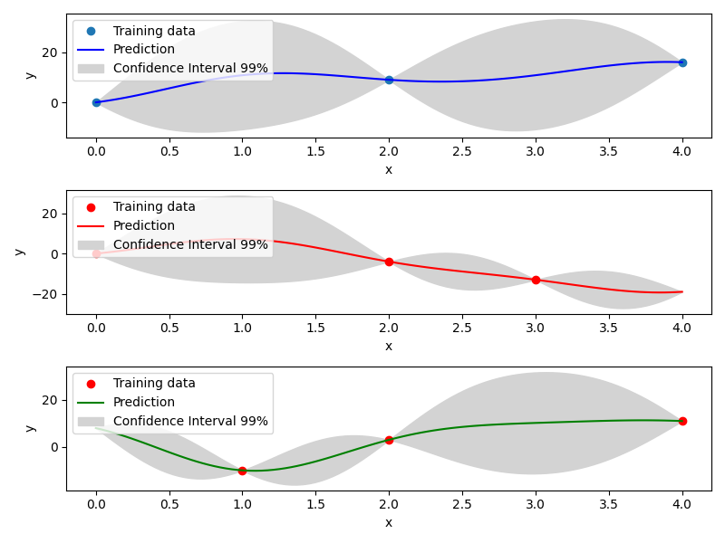
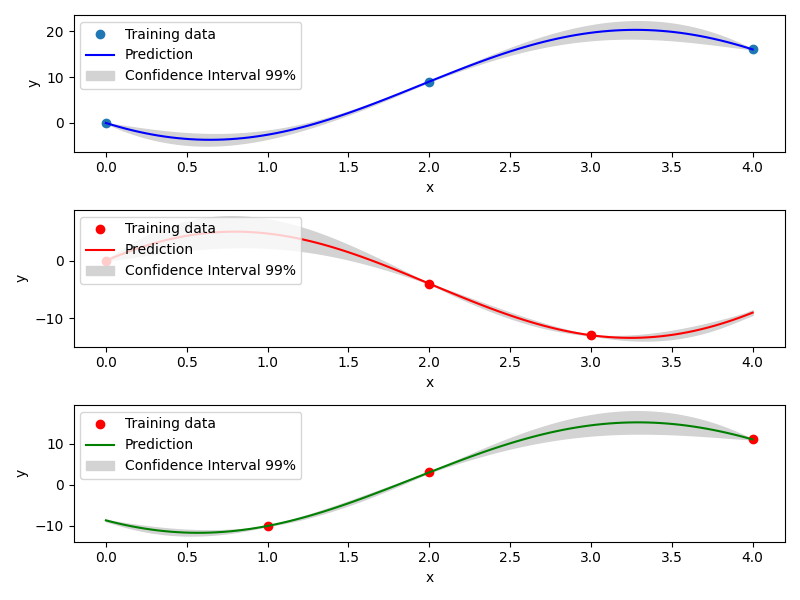
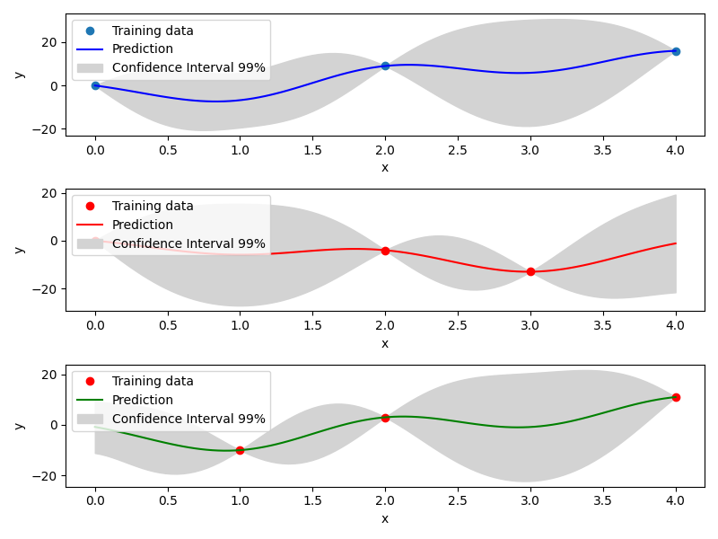

.. _Mixed Integer and hierarchical Surrogates:

Mixed integer surrogate
=======================

To use a surrogate with mixed integer constraints, the user instantiates a ``MixedIntegerSurrogateModel`` with the given surrogate.
The ``MixedIntegerSurrogateModel`` implements the ``SurrogateModel`` interface  and decorates the given surrogate while respecting integer and categorical types.
They are various surrogate models implemented that are described below.

For Kriging models, several methods to construct the mixed categorical correlation kernel are implemented. As a consequence, the user can instantiate a ``MixedIntegerKrigingModel`` with the given kernel for Kriging. Currently, 4 methods (CR, GD, EHH and  HH) are implemented that are described hereafter.

Mixed Integer Surrogate with Continuous Relaxation (CR)
-------------------------------------------------------
For categorical variables, as many x features are added as there are levels for the variables. These new dimensions have [0, 1] bounds and the max of these feature float values will correspond to the choice of one the enum value: this is the so-called "one-hot encoding".
For instance, for a categorical variable (one feature of x) with three levels ["blue", "red", "green"], 3 continuous float features x0, x1, x2 are created. Thereafter, the value max(x0, x1, x2), for instance, x1, will give "red" as the value for the original categorical feature. Details can be found in [1]_ .

Example of mixed integer Polynomial (QP) surrogate
^^^^^^^^^^^^^^^^^^^^^^^^^^^^^^^^^^^^^^^^^^^^^^^^^^

.. code-block:: python

  import numpy as np
  import matplotlib.pyplot as plt
  
  from smt.surrogate_models import QP
  from smt.applications.mixed_integer import MixedIntegerSurrogateModel
  from smt.utils.design_space import DesignSpace, IntegerVariable
  
  xt = np.array([0.0, 1.0, 2.0, 3.0, 4.0])
  yt = np.array([0.0, 1.0, 1.5, 0.5, 1.0])
  
  # Specify the design space using the DesignSpace
  # class and various available variable types
  design_space = DesignSpace(
      [
          IntegerVariable(0, 4),
      ]
  )
  sm = MixedIntegerSurrogateModel(design_space=design_space, surrogate=QP())
  sm.set_training_values(xt, yt)
  sm.train()
  
  num = 100
  x = np.linspace(0.0, 4.0, num)
  y = sm.predict_values(x)
  
  plt.plot(xt, yt, "o")
  plt.plot(x, y)
  plt.xlabel("x")
  plt.ylabel("y")
  plt.legend(["Training data", "Prediction"])
  plt.show()
  
::

  ___________________________________________________________________________
     
   Evaluation
     
        # eval points. : 100
     
     Predicting ...
     Predicting - done. Time (sec):  0.0000162
     
     Prediction time/pt. (sec) :  0.0000002
     
  

Mixed Integer Kriging with Gower Distance (GD)
----------------------------------------------

Another implemented method to tackle mixed integer with Kriging is using a basic mixed integer kernel based on the Gower distance between two points.
When constructing the correlation kernel, the distance is redefined as :math:`\Delta= \Delta_{cont} + \Delta_{cat}`, with :math:`\Delta_{cont}` the continuous distance as usual and :math:`\Delta_ {cat}` the categorical distance defined as the number of categorical variables that differs from one point to another.

For example, the Gower Distance between ``[1,'red', 'medium']`` and ``[1.2,'red', 'large']`` is :math:`\Delta= 0.2+ (0` ``'red'`` :math:`=` ``'red'`` :math:`+ 1` ``'medium'`` :math:`\neq` ``'large'``  ) :math:`=1.2`.
With this distance, a mixed integer kernel can be build. Details can be found in [1]_ .

Example of mixed integer Gower Distance model
^^^^^^^^^^^^^^^^^^^^^^^^^^^^^^^^^^^^^^^^^^^^^

.. code-block:: python

  import numpy as np
  import matplotlib.pyplot as plt
  
  from smt.surrogate_models import KRG, MixIntKernelType
  from smt.applications.mixed_integer import (
      MixedIntegerKrigingModel,
      MixedIntegerSamplingMethod,
  )
  from smt.utils.design_space import (
      DesignSpace,
      CategoricalVariable,
      FloatVariable,
  )
  
  xt1 = np.array([[0, 0.0], [0, 2.0], [0, 4.0]])
  xt2 = np.array([[1, 0.0], [1, 2.0], [1, 3.0]])
  xt3 = np.array([[2, 1.0], [2, 2.0], [2, 4.0]])
  
  xt = np.concatenate((xt1, xt2, xt3), axis=0)
  xt[:, 1] = xt[:, 1].astype(np.float64)
  yt1 = np.array([0.0, 9.0, 16.0])
  yt2 = np.array([0.0, -4, -13.0])
  yt3 = np.array([-10, 3, 11.0])
  yt = np.concatenate((yt1, yt2, yt3), axis=0)
  
  design_space = DesignSpace(
      [
          CategoricalVariable(["Blue", "Red", "Green"]),
          FloatVariable(0, 4),
      ]
  )
  
  # Surrogate
  sm = MixedIntegerKrigingModel(
      surrogate=KRG(
          design_space=design_space,
          categorical_kernel=MixIntKernelType.GOWER,
          theta0=[1e-1],
          corr="squar_exp",
          n_start=20,
      ),
  )
  sm.set_training_values(xt, yt)
  sm.train()
  
  # DOE for validation
  n = 100
  x_cat1 = []
  x_cat2 = []
  x_cat3 = []
  
  for i in range(n):
      x_cat1.append(0)
      x_cat2.append(1)
      x_cat3.append(2)
  
  x_cont = np.linspace(0.0, 4.0, n)
  x1 = np.concatenate(
      (np.asarray(x_cat1).reshape(-1, 1), x_cont.reshape(-1, 1)), axis=1
  )
  x2 = np.concatenate(
      (np.asarray(x_cat2).reshape(-1, 1), x_cont.reshape(-1, 1)), axis=1
  )
  x3 = np.concatenate(
      (np.asarray(x_cat3).reshape(-1, 1), x_cont.reshape(-1, 1)), axis=1
  )
  
  y1 = sm.predict_values(x1)
  y2 = sm.predict_values(x2)
  y3 = sm.predict_values(x3)
  
  # estimated variance
  s2_1 = sm.predict_variances(x1)
  s2_2 = sm.predict_variances(x2)
  s2_3 = sm.predict_variances(x3)
  
  fig, axs = plt.subplots(3, figsize=(8, 6))
  
  axs[0].plot(xt1[:, 1].astype(np.float64), yt1, "o", linestyle="None")
  axs[0].plot(x_cont, y1, color="Blue")
  axs[0].fill_between(
      np.ravel(x_cont),
      np.ravel(y1 - 3 * np.sqrt(s2_1)),
      np.ravel(y1 + 3 * np.sqrt(s2_1)),
      color="lightgrey",
  )
  axs[0].set_xlabel("x")
  axs[0].set_ylabel("y")
  axs[0].legend(
      ["Training data", "Prediction", "Confidence Interval 99%"],
      loc="upper left",
      bbox_to_anchor=[0, 1],
  )
  axs[1].plot(
      xt2[:, 1].astype(np.float64), yt2, marker="o", color="r", linestyle="None"
  )
  axs[1].plot(x_cont, y2, color="Red")
  axs[1].fill_between(
      np.ravel(x_cont),
      np.ravel(y2 - 3 * np.sqrt(s2_2)),
      np.ravel(y2 + 3 * np.sqrt(s2_2)),
      color="lightgrey",
  )
  axs[1].set_xlabel("x")
  axs[1].set_ylabel("y")
  axs[1].legend(
      ["Training data", "Prediction", "Confidence Interval 99%"],
      loc="upper left",
      bbox_to_anchor=[0, 1],
  )
  axs[2].plot(
      xt3[:, 1].astype(np.float64), yt3, marker="o", color="r", linestyle="None"
  )
  axs[2].plot(x_cont, y3, color="Green")
  axs[2].fill_between(
      np.ravel(x_cont),
      np.ravel(y3 - 3 * np.sqrt(s2_3)),
      np.ravel(y3 + 3 * np.sqrt(s2_3)),
      color="lightgrey",
  )
  axs[2].set_xlabel("x")
  axs[2].set_ylabel("y")
  axs[2].legend(
      ["Training data", "Prediction", "Confidence Interval 99%"],
      loc="upper left",
      bbox_to_anchor=[0, 1],
  )
  plt.tight_layout()
  plt.show()
  
::

  ___________________________________________________________________________
     
   Evaluation
     
        # eval points. : 100
     
     Predicting ...
     Predicting - done. Time (sec):  0.0029662
     
     Prediction time/pt. (sec) :  0.0000297
     
  ___________________________________________________________________________
     
   Evaluation
     
        # eval points. : 100
     
     Predicting ...
     Predicting - done. Time (sec):  0.0029068
     
     Prediction time/pt. (sec) :  0.0000291
     
  ___________________________________________________________________________
     
   Evaluation
     
        # eval points. : 100
     
     Predicting ...
     Predicting - done. Time (sec):  0.0029440
     
     Prediction time/pt. (sec) :  0.0000294
     
  

Mixed Integer Kriging with Compound Symmetry (CS)
-------------------------------------------------

Compound Symmetry is similar to Gower Distance but allow to model negative correlations. Details can be found in [2]_ .

Example of mixed integer Compound Symmetry model
^^^^^^^^^^^^^^^^^^^^^^^^^^^^^^^^^^^^^^^^^^^^^^^^

.. code-block:: python

  import numpy as np
  import matplotlib.pyplot as plt
  
  from smt.surrogate_models import KRG, MixIntKernelType
  from smt.applications.mixed_integer import (
      MixedIntegerKrigingModel,
      MixedIntegerSamplingMethod,
  )
  from smt.utils.design_space import (
      DesignSpace,
      CategoricalVariable,
      FloatVariable,
  )
  
  xt1 = np.array([[0, 0.0], [0, 2.0], [0, 4.0]])
  xt2 = np.array([[1, 0.0], [1, 2.0], [1, 3.0]])
  xt3 = np.array([[2, 1.0], [2, 2.0], [2, 4.0]])
  
  xt = np.concatenate((xt1, xt2, xt3), axis=0)
  xt[:, 1] = xt[:, 1].astype(np.float64)
  yt1 = np.array([0.0, 9.0, 16.0])
  yt2 = np.array([0.0, -4, -13.0])
  yt3 = np.array([-10, 3, 11.0])
  yt = np.concatenate((yt1, yt2, yt3), axis=0)
  
  design_space = DesignSpace(
      [
          CategoricalVariable(["Blue", "Red", "Green"]),
          FloatVariable(0, 4),
      ]
  )
  
  # Surrogate
  sm = MixedIntegerKrigingModel(
      surrogate=KRG(
          design_space=design_space,
          categorical_kernel=MixIntKernelType.COMPOUND_SYMMETRY,
          theta0=[1e-1],
          corr="squar_exp",
          n_start=20,
      ),
  )
  sm.set_training_values(xt, yt)
  sm.train()
  
  # DOE for validation
  n = 100
  x_cat1 = []
  x_cat2 = []
  x_cat3 = []
  
  for i in range(n):
      x_cat1.append(0)
      x_cat2.append(1)
      x_cat3.append(2)
  
  x_cont = np.linspace(0.0, 4.0, n)
  x1 = np.concatenate(
      (np.asarray(x_cat1).reshape(-1, 1), x_cont.reshape(-1, 1)), axis=1
  )
  x2 = np.concatenate(
      (np.asarray(x_cat2).reshape(-1, 1), x_cont.reshape(-1, 1)), axis=1
  )
  x3 = np.concatenate(
      (np.asarray(x_cat3).reshape(-1, 1), x_cont.reshape(-1, 1)), axis=1
  )
  
  y1 = sm.predict_values(x1)
  y2 = sm.predict_values(x2)
  y3 = sm.predict_values(x3)
  
  # estimated variance
  s2_1 = sm.predict_variances(x1)
  s2_2 = sm.predict_variances(x2)
  s2_3 = sm.predict_variances(x3)
  
  fig, axs = plt.subplots(3, figsize=(8, 6))
  
  axs[0].plot(xt1[:, 1].astype(np.float64), yt1, "o", linestyle="None")
  axs[0].plot(x_cont, y1, color="Blue")
  axs[0].fill_between(
      np.ravel(x_cont),
      np.ravel(y1 - 3 * np.sqrt(s2_1)),
      np.ravel(y1 + 3 * np.sqrt(s2_1)),
      color="lightgrey",
  )
  axs[0].set_xlabel("x")
  axs[0].set_ylabel("y")
  axs[0].legend(
      ["Training data", "Prediction", "Confidence Interval 99%"],
      loc="upper left",
      bbox_to_anchor=[0, 1],
  )
  axs[1].plot(
      xt2[:, 1].astype(np.float64), yt2, marker="o", color="r", linestyle="None"
  )
  axs[1].plot(x_cont, y2, color="Red")
  axs[1].fill_between(
      np.ravel(x_cont),
      np.ravel(y2 - 3 * np.sqrt(s2_2)),
      np.ravel(y2 + 3 * np.sqrt(s2_2)),
      color="lightgrey",
  )
  axs[1].set_xlabel("x")
  axs[1].set_ylabel("y")
  axs[1].legend(
      ["Training data", "Prediction", "Confidence Interval 99%"],
      loc="upper left",
      bbox_to_anchor=[0, 1],
  )
  axs[2].plot(
      xt3[:, 1].astype(np.float64), yt3, marker="o", color="r", linestyle="None"
  )
  axs[2].plot(x_cont, y3, color="Green")
  axs[2].fill_between(
      np.ravel(x_cont),
      np.ravel(y3 - 3 * np.sqrt(s2_3)),
      np.ravel(y3 + 3 * np.sqrt(s2_3)),
      color="lightgrey",
  )
  axs[2].set_xlabel("x")
  axs[2].set_ylabel("y")
  axs[2].legend(
      ["Training data", "Prediction", "Confidence Interval 99%"],
      loc="upper left",
      bbox_to_anchor=[0, 1],
  )
  plt.tight_layout()
  plt.show()
  
::

  exception :  4-th leading minor of the array is not positive definite
  [ 3.28121902e+01 -1.19061651e+01 -1.19062304e+01  7.34202209e-04
   -3.09582545e-04 -2.19341599e-04  3.49847394e-09 -1.67389467e-09
   -7.15698170e-10]
  exception :  4-th leading minor of the array is not positive definite
  [ 9.09297095e+00 -4.69851668e-02 -4.69502417e-02  9.74106925e-04
   -5.62905232e-06 -4.04511718e-06  2.47447277e-08 -1.26347080e-10
   -6.20962350e-11]
  ___________________________________________________________________________
     
   Evaluation
     
        # eval points. : 100
     
     Predicting ...
     Predicting - done. Time (sec):  0.0034580
     
     Prediction time/pt. (sec) :  0.0000346
     
  ___________________________________________________________________________
     
   Evaluation
     
        # eval points. : 100
     
     Predicting ...
     Predicting - done. Time (sec):  0.0036581
     
     Prediction time/pt. (sec) :  0.0000366
     
  ___________________________________________________________________________
     
   Evaluation
     
        # eval points. : 100
     
     Predicting ...
     Predicting - done. Time (sec):  0.0035532
     
     Prediction time/pt. (sec) :  0.0000355
     
  

Mixed Integer Kriging with Homoscedastic Hypersphere (HH) 
---------------------------------------------------------

This surrogate model assumes that the correlation kernel between the levels of a given variable is a symmetric positive definite matrix. The latter matrix is estimated through an hypersphere parametrization depending on several hyperparameters. To finish with, the data correlation matrix is build as the product of the correlation matrices over the various variables. Details can be found in [1]_ . Note that this model is the only one to consider negative correlations between levels ("blue" can be correlated negatively to "red").

Example of mixed integer Homoscedastic Hypersphere model
^^^^^^^^^^^^^^^^^^^^^^^^^^^^^^^^^^^^^^^^^^^^^^^^^^^^^^^^

.. code-block:: python

  import numpy as np
  import matplotlib.pyplot as plt
  
  from smt.surrogate_models import KRG, MixIntKernelType
  from smt.applications.mixed_integer import (
      MixedIntegerKrigingModel,
      MixedIntegerSamplingMethod,
  )
  from smt.utils.design_space import (
      DesignSpace,
      CategoricalVariable,
      FloatVariable,
  )
  
  xt1 = np.array([[0, 0.0], [0, 2.0], [0, 4.0]])
  xt2 = np.array([[1, 0.0], [1, 2.0], [1, 3.0]])
  xt3 = np.array([[2, 1.0], [2, 2.0], [2, 4.0]])
  
  xt = np.concatenate((xt1, xt2, xt3), axis=0)
  xt[:, 1] = xt[:, 1].astype(np.float64)
  yt1 = np.array([0.0, 9.0, 16.0])
  yt2 = np.array([0.0, -4, -13.0])
  yt3 = np.array([-10, 3, 11.0])
  yt = np.concatenate((yt1, yt2, yt3), axis=0)
  
  design_space = DesignSpace(
      [
          CategoricalVariable(["Blue", "Red", "Green"]),
          FloatVariable(0, 4),
      ]
  )
  
  # Surrogate
  sm = MixedIntegerKrigingModel(
      surrogate=KRG(
          design_space=design_space,
          categorical_kernel=MixIntKernelType.HOMO_HSPHERE,
          theta0=[1e-1],
          corr="squar_exp",
          n_start=20,
      ),
  )
  sm.set_training_values(xt, yt)
  sm.train()
  
  # DOE for validation
  n = 100
  x_cat1 = []
  x_cat2 = []
  x_cat3 = []
  
  for i in range(n):
      x_cat1.append(0)
      x_cat2.append(1)
      x_cat3.append(2)
  
  x_cont = np.linspace(0.0, 4.0, n)
  x1 = np.concatenate(
      (np.asarray(x_cat1).reshape(-1, 1), x_cont.reshape(-1, 1)), axis=1
  )
  x2 = np.concatenate(
      (np.asarray(x_cat2).reshape(-1, 1), x_cont.reshape(-1, 1)), axis=1
  )
  x3 = np.concatenate(
      (np.asarray(x_cat3).reshape(-1, 1), x_cont.reshape(-1, 1)), axis=1
  )
  
  y1 = sm.predict_values(x1)
  y2 = sm.predict_values(x2)
  y3 = sm.predict_values(x3)
  
  # estimated variance
  s2_1 = sm.predict_variances(x1)
  s2_2 = sm.predict_variances(x2)
  s2_3 = sm.predict_variances(x3)
  
  fig, axs = plt.subplots(3, figsize=(8, 6))
  
  axs[0].plot(xt1[:, 1].astype(np.float64), yt1, "o", linestyle="None")
  axs[0].plot(x_cont, y1, color="Blue")
  axs[0].fill_between(
      np.ravel(x_cont),
      np.ravel(y1 - 3 * np.sqrt(s2_1)),
      np.ravel(y1 + 3 * np.sqrt(s2_1)),
      color="lightgrey",
  )
  axs[0].set_xlabel("x")
  axs[0].set_ylabel("y")
  axs[0].legend(
      ["Training data", "Prediction", "Confidence Interval 99%"],
      loc="upper left",
      bbox_to_anchor=[0, 1],
  )
  axs[1].plot(
      xt2[:, 1].astype(np.float64), yt2, marker="o", color="r", linestyle="None"
  )
  axs[1].plot(x_cont, y2, color="Red")
  axs[1].fill_between(
      np.ravel(x_cont),
      np.ravel(y2 - 3 * np.sqrt(s2_2)),
      np.ravel(y2 + 3 * np.sqrt(s2_2)),
      color="lightgrey",
  )
  axs[1].set_xlabel("x")
  axs[1].set_ylabel("y")
  axs[1].legend(
      ["Training data", "Prediction", "Confidence Interval 99%"],
      loc="upper left",
      bbox_to_anchor=[0, 1],
  )
  axs[2].plot(
      xt3[:, 1].astype(np.float64), yt3, marker="o", color="r", linestyle="None"
  )
  axs[2].plot(x_cont, y3, color="Green")
  axs[2].fill_between(
      np.ravel(x_cont),
      np.ravel(y3 - 3 * np.sqrt(s2_3)),
      np.ravel(y3 + 3 * np.sqrt(s2_3)),
      color="lightgrey",
  )
  axs[2].set_xlabel("x")
  axs[2].set_ylabel("y")
  axs[2].legend(
      ["Training data", "Prediction", "Confidence Interval 99%"],
      loc="upper left",
      bbox_to_anchor=[0, 1],
  )
  plt.tight_layout()
  plt.show()
  
::

  ___________________________________________________________________________
     
   Evaluation
     
        # eval points. : 100
     
     Predicting ...
     Predicting - done. Time (sec):  0.0035062
     
     Prediction time/pt. (sec) :  0.0000351
     
  ___________________________________________________________________________
     
   Evaluation
     
        # eval points. : 100
     
     Predicting ...
     Predicting - done. Time (sec):  0.0034261
     
     Prediction time/pt. (sec) :  0.0000343
     
  ___________________________________________________________________________
     
   Evaluation
     
        # eval points. : 100
     
     Predicting ...
     Predicting - done. Time (sec):  0.0034037
     
     Prediction time/pt. (sec) :  0.0000340
     
  

 	

Mixed Integer Kriging with Exponential Homoscedastic Hypersphere (EHH)
----------------------------------------------------------------------

This surrogate model also considers that the correlation kernel between the levels of a given variable is a symmetric positive definite matrix. The latter matrix is estimated through an hypersphere parametrization depending on several hyperparameters. Thereafter, an exponential kernel is applied to the matrix. To finish with, the data correlation matrix is build as the product of the correlation matrices over the various variables. Therefore, this model could not model negative correlation and only works with absolute exponential and Gaussian kernels. Details can be found in [1]_ .

Example of mixed integer Exponential Homoscedastic Hypersphere model
^^^^^^^^^^^^^^^^^^^^^^^^^^^^^^^^^^^^^^^^^^^^^^^^^^^^^^^^^^^^^^^^^^^^

.. code-block:: python

  import numpy as np
  import matplotlib.pyplot as plt
  
  from smt.surrogate_models import KRG, MixIntKernelType
  from smt.applications.mixed_integer import (
      MixedIntegerKrigingModel,
      MixedIntegerSamplingMethod,
  )
  from smt.utils.design_space import (
      DesignSpace,
      CategoricalVariable,
      FloatVariable,
  )
  
  xt1 = np.array([[0, 0.0], [0, 2.0], [0, 4.0]])
  xt2 = np.array([[1, 0.0], [1, 2.0], [1, 3.0]])
  xt3 = np.array([[2, 1.0], [2, 2.0], [2, 4.0]])
  
  xt = np.concatenate((xt1, xt2, xt3), axis=0)
  xt[:, 1] = xt[:, 1].astype(np.float64)
  yt1 = np.array([0.0, 9.0, 16.0])
  yt2 = np.array([0.0, -4, -13.0])
  yt3 = np.array([-10, 3, 11.0])
  yt = np.concatenate((yt1, yt2, yt3), axis=0)
  
  design_space = DesignSpace(
      [
          CategoricalVariable(["Blue", "Red", "Green"]),
          FloatVariable(0, 4),
      ]
  )
  
  # Surrogate
  sm = MixedIntegerKrigingModel(
      surrogate=KRG(
          design_space=design_space,
          theta0=[1e-1],
          corr="squar_exp",
          n_start=20,
          categorical_kernel=MixIntKernelType.EXP_HOMO_HSPHERE,
      ),
  )
  sm.set_training_values(xt, yt)
  sm.train()
  
  # DOE for validation
  n = 100
  x_cat1 = []
  x_cat2 = []
  x_cat3 = []
  
  for i in range(n):
      x_cat1.append(0)
      x_cat2.append(1)
      x_cat3.append(2)
  
  x_cont = np.linspace(0.0, 4.0, n)
  x1 = np.concatenate(
      (np.asarray(x_cat1).reshape(-1, 1), x_cont.reshape(-1, 1)), axis=1
  )
  x2 = np.concatenate(
      (np.asarray(x_cat2).reshape(-1, 1), x_cont.reshape(-1, 1)), axis=1
  )
  x3 = np.concatenate(
      (np.asarray(x_cat3).reshape(-1, 1), x_cont.reshape(-1, 1)), axis=1
  )
  
  y1 = sm.predict_values(x1)
  y2 = sm.predict_values(x2)
  y3 = sm.predict_values(x3)
  
  # estimated variance
  s2_1 = sm.predict_variances(x1)
  s2_2 = sm.predict_variances(x2)
  s2_3 = sm.predict_variances(x3)
  
  fig, axs = plt.subplots(3, figsize=(8, 6))
  
  axs[0].plot(xt1[:, 1].astype(np.float64), yt1, "o", linestyle="None")
  axs[0].plot(x_cont, y1, color="Blue")
  axs[0].fill_between(
      np.ravel(x_cont),
      np.ravel(y1 - 3 * np.sqrt(s2_1)),
      np.ravel(y1 + 3 * np.sqrt(s2_1)),
      color="lightgrey",
  )
  axs[0].set_xlabel("x")
  axs[0].set_ylabel("y")
  axs[0].legend(
      ["Training data", "Prediction", "Confidence Interval 99%"],
      loc="upper left",
      bbox_to_anchor=[0, 1],
  )
  axs[1].plot(
      xt2[:, 1].astype(np.float64), yt2, marker="o", color="r", linestyle="None"
  )
  axs[1].plot(x_cont, y2, color="Red")
  axs[1].fill_between(
      np.ravel(x_cont),
      np.ravel(y2 - 3 * np.sqrt(s2_2)),
      np.ravel(y2 + 3 * np.sqrt(s2_2)),
      color="lightgrey",
  )
  axs[1].set_xlabel("x")
  axs[1].set_ylabel("y")
  axs[1].legend(
      ["Training data", "Prediction", "Confidence Interval 99%"],
      loc="upper left",
      bbox_to_anchor=[0, 1],
  )
  axs[2].plot(
      xt3[:, 1].astype(np.float64), yt3, marker="o", color="r", linestyle="None"
  )
  axs[2].plot(x_cont, y3, color="Green")
  axs[2].fill_between(
      np.ravel(x_cont),
      np.ravel(y3 - 3 * np.sqrt(s2_3)),
      np.ravel(y3 + 3 * np.sqrt(s2_3)),
      color="lightgrey",
  )
  axs[2].set_xlabel("x")
  axs[2].set_ylabel("y")
  axs[2].legend(
      ["Training data", "Prediction", "Confidence Interval 99%"],
      loc="upper left",
      bbox_to_anchor=[0, 1],
  )
  plt.tight_layout()
  plt.show()
  
::

  ___________________________________________________________________________
     
   Evaluation
     
        # eval points. : 100
     
     Predicting ...
     Predicting - done. Time (sec):  0.0034950
     
     Prediction time/pt. (sec) :  0.0000349
     
  ___________________________________________________________________________
     
   Evaluation
     
        # eval points. : 100
     
     Predicting ...
     Predicting - done. Time (sec):  0.0033770
     
     Prediction time/pt. (sec) :  0.0000338
     
  ___________________________________________________________________________
     
   Evaluation
     
        # eval points. : 100
     
     Predicting ...
     Predicting - done. Time (sec):  0.0033979
     
     Prediction time/pt. (sec) :  0.0000340
     
  

Mixed Integer Kriging with hierarchical variables
-------------------------------------------------

The ``DesignSpace`` class can be used to model design variable hierarchy: conditionally active design variables and value constraints.
A ``MixedIntegerKrigingModel`` with both Hierarchical and Mixed-categorical variables can be build using this.
Two kernels for hierarchical variables are available, namely ``Arc-Kernel`` and ``Alg-Kernel``. More details are given in the usage section.

Example of mixed integer Kriging with hierarchical variables
^^^^^^^^^^^^^^^^^^^^^^^^^^^^^^^^^^^^^^^^^^^^^^^^^^^^^^^^^^^^

.. code-block:: python

  import numpy as np
  from smt.utils.design_space import (
      DesignSpace,
      CategoricalVariable,
      IntegerVariable,
      FloatVariable,
  )
  from smt.applications.mixed_integer import (
      MixedIntegerKrigingModel,
      MixedIntegerSamplingMethod,
  )
  from smt.surrogate_models import MixIntKernelType, MixHrcKernelType, KRG
  from smt.sampling_methods import LHS
  
  def f_hv(X):
      import numpy as np
  
      def H(x1, x2, x3, x4, z3, z4, x5, cos_term):
          import numpy as np
  
          h = (
              53.3108
              + 0.184901 * x1
              - 5.02914 * x1**3 * 10 ** (-6)
              + 7.72522 * x1**z3 * 10 ** (-8)
              - 0.0870775 * x2
              - 0.106959 * x3
              + 7.98772 * x3**z4 * 10 ** (-6)
              + 0.00242482 * x4
              + 1.32851 * x4**3 * 10 ** (-6)
              - 0.00146393 * x1 * x2
              - 0.00301588 * x1 * x3
              - 0.00272291 * x1 * x4
              + 0.0017004 * x2 * x3
              + 0.0038428 * x2 * x4
              - 0.000198969 * x3 * x4
              + 1.86025 * x1 * x2 * x3 * 10 ** (-5)
              - 1.88719 * x1 * x2 * x4 * 10 ** (-6)
              + 2.50923 * x1 * x3 * x4 * 10 ** (-5)
              - 5.62199 * x2 * x3 * x4 * 10 ** (-5)
          )
          if cos_term:
              h += 5.0 * np.cos(2.0 * np.pi * (x5 / 100.0)) - 2.0
          return h
  
      def f1(x1, x2, z1, z2, z3, z4, x5, cos_term):
          c1 = z2 == 0
          c2 = z2 == 1
          c3 = z2 == 2
  
          c4 = z3 == 0
          c5 = z3 == 1
          c6 = z3 == 2
  
          y = (
              c4
              * (
                  c1 * H(x1, x2, 20, 20, z3, z4, x5, cos_term)
                  + c2 * H(x1, x2, 50, 20, z3, z4, x5, cos_term)
                  + c3 * H(x1, x2, 80, 20, z3, z4, x5, cos_term)
              )
              + c5
              * (
                  c1 * H(x1, x2, 20, 50, z3, z4, x5, cos_term)
                  + c2 * H(x1, x2, 50, 50, z3, z4, x5, cos_term)
                  + c3 * H(x1, x2, 80, 50, z3, z4, x5, cos_term)
              )
              + c6
              * (
                  c1 * H(x1, x2, 20, 80, z3, z4, x5, cos_term)
                  + c2 * H(x1, x2, 50, 80, z3, z4, x5, cos_term)
                  + c3 * H(x1, x2, 80, 80, z3, z4, x5, cos_term)
              )
          )
          return y
  
      def f2(x1, x2, x3, z2, z3, z4, x5, cos_term):
          c1 = z2 == 0
          c2 = z2 == 1
          c3 = z2 == 2
  
          y = (
              c1 * H(x1, x2, x3, 20, z3, z4, x5, cos_term)
              + c2 * H(x1, x2, x3, 50, z3, z4, x5, cos_term)
              + c3 * H(x1, x2, x3, 80, z3, z4, x5, cos_term)
          )
          return y
  
      def f3(x1, x2, x4, z1, z3, z4, x5, cos_term):
          c1 = z1 == 0
          c2 = z1 == 1
          c3 = z1 == 2
  
          y = (
              c1 * H(x1, x2, 20, x4, z3, z4, x5, cos_term)
              + c2 * H(x1, x2, 50, x4, z3, z4, x5, cos_term)
              + c3 * H(x1, x2, 80, x4, z3, z4, x5, cos_term)
          )
          return y
  
      y = []
      for x in X:
          if x[0] == 0:
              y.append(
                  f1(x[2], x[3], x[7], x[8], x[9], x[10], x[6], cos_term=x[1])
              )
          elif x[0] == 1:
              y.append(
                  f2(x[2], x[3], x[4], x[8], x[9], x[10], x[6], cos_term=x[1])
              )
          elif x[0] == 2:
              y.append(
                  f3(x[2], x[3], x[5], x[7], x[9], x[10], x[6], cos_term=x[1])
              )
          elif x[0] == 3:
              y.append(
                  H(x[2], x[3], x[4], x[5], x[9], x[10], x[6], cos_term=x[1])
              )
      return np.array(y)
  
  design_space = DesignSpace(
      [
          CategoricalVariable(values=[0, 1, 2, 3]),  # meta
          IntegerVariable(0, 1),  # x1
          FloatVariable(0, 100),  # x2
          FloatVariable(0, 100),
          FloatVariable(0, 100),
          FloatVariable(0, 100),
          FloatVariable(0, 100),
          IntegerVariable(0, 2),  # x7
          IntegerVariable(0, 2),
          IntegerVariable(0, 2),
          IntegerVariable(0, 2),
      ]
  )
  
  # x4 is acting if meta == 1, 3
  design_space.declare_decreed_var(decreed_var=4, meta_var=0, meta_value=[1, 3])
  # x5 is acting if meta == 2, 3
  design_space.declare_decreed_var(decreed_var=5, meta_var=0, meta_value=[2, 3])
  # x7 is acting if meta == 0, 2
  design_space.declare_decreed_var(decreed_var=7, meta_var=0, meta_value=[0, 2])
  # x8 is acting if meta == 0, 1
  design_space.declare_decreed_var(decreed_var=8, meta_var=0, meta_value=[0, 1])
  
  # Sample from the design spaces, correctly considering hierarchy
  n_doe = 15
  design_space.seed = 42
  samp = MixedIntegerSamplingMethod(
      LHS, design_space, criterion="ese", random_state=design_space.seed
  )
  Xt, Xt_is_acting = samp(n_doe, return_is_acting=True)
  
  Yt = f_hv(Xt)
  
  sm = MixedIntegerKrigingModel(
      surrogate=KRG(
          design_space=design_space,
          categorical_kernel=MixIntKernelType.HOMO_HSPHERE,
          hierarchical_kernel=MixHrcKernelType.ALG_KERNEL,  # ALG or ARC
          theta0=[1e-2],
          corr="abs_exp",
          n_start=5,
      ),
  )
  sm.set_training_values(Xt, Yt, is_acting=Xt_is_acting)
  sm.train()
  y_s = sm.predict_values(Xt)[:, 0]
  pred_RMSE = np.linalg.norm(y_s - Yt) / len(Yt)
  
  y_sv = sm.predict_variances(Xt)[:, 0]
  var_RMSE = np.linalg.norm(y_sv) / len(Yt)
  
::

  ___________________________________________________________________________
     
   Evaluation
     
        # eval points. : 15
     
     Predicting ...
     Predicting - done. Time (sec):  0.0030160
     
     Prediction time/pt. (sec) :  0.0002011
     
  

References
----------

.. [1] Saves, P. and Diouane, Y. and Bartoli, N. and Lefebvre, T. and Morlier, J. (2022). A general square exponential kernel to handle mixed-categorical variables for Gaussian process. AIAA Aviation 2022 Forum. 

.. [2] Pelamatti, J. "Mixed-variable Bayesian optimization: application to aerospace system design", PhD thesis, Université de Lille, Lille, 2020.
