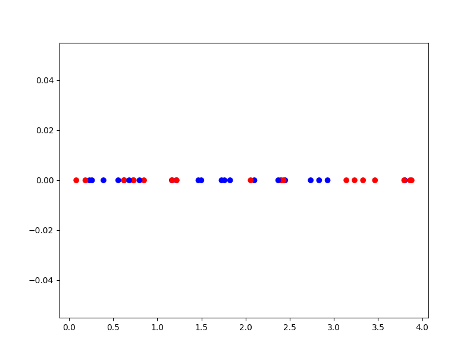
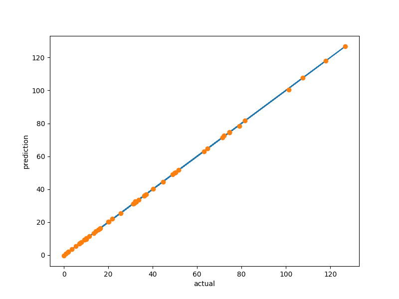

.. _Mixed Integer and Hierarchical Variables Types Specifications: 

Mixed Integer and Hierarchical Design Spaces (Variables, Sampling and Context)
==============================================================================

Mixed-discrete surrogate models need detailed information about the behavior of the design space (the input space),
which you can specify using the ``design_space`` module. The design space definition module also supports specifying
design space hierarchy including conditionally active design variables.

Design variables types
----------------------

The following variable types are supported:

- Float: the variable can assume any real/continuous value between two bounds (inclusive)
- Integer: the variable can assume any integer value between two bounds (inclusive)
- Ordinal: the variable can assume any value from some set, order is relevant
- Categorical: the variable can assume any value from some set, order is not relevant

Integer, ordinal and categorical variables are all *discrete* variables, as they can only assume specific values from
some set. The main differences between these types is the question whether distance and whether ordering matters:

- Integer: distance and order matters, e.g. the number of engines on an aircraft
- Ordinal: only order matters, e.g. steps in a process
- Categorical: neither distance nor order matters, e.g. different means for providing some functionality

More details can be found in [1]_ .

Variables are specified using the ``DesignVariable`` classes in ``smt.utils.design_space``:
- ``FloatVariable(lower_bound, upper_bound)``, upper should be greater than lower bound
- ``IntegerVariable(lower_bound, upper_bound)``, bounds should be integers
- ``OrdinalVariable(values)``, values is a list of int, float or str, encoded as integers from 0 to len(values)-1
- ``CategoricalVariable(values)``, same specification and encoding as ordinal

The design space is then defined from a list of design variables and implements sampling and correction interfaces:

.. code-block:: python

  import numpy as np
  from smt.utils.design_space import DesignSpace, FloatVariable, IntegerVariable, OrdinalVariable, CategoricalVariable
  
  ds = DesignSpace([
      CategoricalVariable(['A', 'B']),  # x0 categorical: A or B; order is not relevant
      OrdinalVariable(['C', 'D', 'E']),  # x1 ordinal: C, D or E; order is relevant
      IntegerVariable(0, 2),  # x2 integer between 0 and 2 (inclusive): 0, 1, 2
      FloatVariable(0, 1),  # c3 continuous between 0 and 1
  ])
  
  # Sample the design space
  # Note: is_acting_sampled specifies for each design variable whether it is acting or not
  x_sampled, is_acting_sampled = ds.sample_valid_x(100)
  
  # Correct design vectors: round discrete variables, correct hierarchical variables
  x_corr, is_acting = ds.correct_get_acting(np.array([
      [0, 0, 2, .25],
      [0, 2, 1, .75],
  ]))
  print(is_acting)
  
::

  [[ True  True  True  True]
   [ True  True  True  True]]

Hierarchical variables
----------------------

The design space definition uses the framework of Audet et al. [2]_ to manage both mixed-discrete variables and
hierarchical variables. We distinguish dimensional (or meta) variables which are a special type of variables that may
affect the dimension of the problem and decide if some other decreed variables are acting or non-acting.

The hierarchy relationships are specified after instantiating the design space:

.. code-block:: python

  import numpy as np
  from smt.utils.design_space import DesignSpace, FloatVariable, IntegerVariable, OrdinalVariable, CategoricalVariable
  
  ds = DesignSpace([
      CategoricalVariable(['A', 'B']),  # x0 categorical: A or B; order is not relevant
      OrdinalVariable(['C', 'D', 'E']),  # x1 ordinal: C, D or E; order is relevant
      IntegerVariable(0, 2),  # x2 integer between 0 and 2 (inclusive): 0, 1, 2
      FloatVariable(0, 1),  # c3 continuous between 0 and 1
  ])
  
  # Declare that x1 is acting if x0 == A
  ds.declare_decreed_var(decreed_var=1, meta_var=0, meta_value='A')
  
  # Sample the design space
  # Note: is_acting_sampled specifies for each design variable whether it is acting or not
  x_sampled, is_acting_sampled = ds.sample_valid_x(100)
  
  # Correct design vectors: round discrete variables, correct hierarchical variables
  x_corr, is_acting = ds.correct_get_acting(np.array([
      [0, 0, 2, .25],
      [1, 2, 1, .66],
  ]))
  
  # Observe the hierarchical behavior:
  assert np.all(is_acting == np.array([
      [True, True, True, True],
      [True, False, True, True],  # x1 is not acting if x0 != A
  ]))
  assert np.all(x_corr == np.array([
      [0, 0, 2, .25],
      # x1 is not acting, so it is corrected ("imputed") to its non-acting value (0 for discrete vars)
      [1, 0, 1, .66],
  ]))

Design space and variable class references
------------------------------------------

The ``DesignSpace`` class and design variable classes implement the relevant functionality.

  .. autoclass:: smt.utils.design_space.FloatVariable
     :exclude-members: get_type, get_limits

  .. autoclass:: smt.utils.design_space.IntegerVariable
     :exclude-members: get_type, get_limits

  .. autoclass:: smt.utils.design_space.OrdinalVariable
     :exclude-members: get_type, get_limits

  .. autoclass:: smt.utils.design_space.CategoricalVariable
     :exclude-members: get_type, get_limits

  .. autoclass:: smt.utils.design_space.DesignSpace
     :members:
     :inherited-members:
     :exclude-members: get_unfolded_num_bounds, fold_x, unfold_x, get_num_bounds, get_x_limits, get_x_types

Example of sampling a mixed-discrete design space
^^^^^^^^^^^^^^^^^^^^^^^^^^^^^^^^^^^^^^^^^^^^^^^^^

.. code-block:: python

  import numpy as np
  import matplotlib.pyplot as plt
  from matplotlib import colors
  
  from smt.utils.design_space import DesignSpace, FloatVariable, CategoricalVariable
  
  float_var = FloatVariable(0, 4)
  cat_var = CategoricalVariable(['blue', 'red'])
  
  design_space = DesignSpace([
      float_var,
      cat_var,
  ])
  
  num = 40
  x, x_is_acting = design_space.sample_valid_x(num)
  
  cmap = colors.ListedColormap(cat_var.values)
  plt.scatter(x[:, 0], np.zeros(num), c=x[:, 1], cmap=cmap)
  plt.show()
  

Mixed integer context
---------------------

The ``MixedIntegerContext`` class helps the user to use mixed integer sampling methods and surrogate models consistently
by acting as a factory for those objects given a x specification: (xtypes, xlimits).

  .. autoclass:: smt.applications.mixed_integer.MixedIntegerContext

  .. automethod:: smt.applications.mixed_integer.MixedIntegerContext.__init__

  .. automethod:: smt.applications.mixed_integer.MixedIntegerContext.build_sampling_method

  .. automethod:: smt.applications.mixed_integer.MixedIntegerContext.build_surrogate_model

Example of mixed integer context usage
^^^^^^^^^^^^^^^^^^^^^^^^^^^^^^^^^^^^^^

.. code-block:: python

  import matplotlib.pyplot as plt
  from smt.surrogate_models import KRG
  from smt.applications.mixed_integer import MixedIntegerContext
  from smt.utils.design_space import DesignSpace, FloatVariable, IntegerVariable, CategoricalVariable
  
  design_space = DesignSpace([
      IntegerVariable(0, 5),
      FloatVariable(0., 4.),
      CategoricalVariable(["blue", "red", "green", "yellow"]),
  ])
  
  def ftest(x):
      return (x[:, 0] * x[:, 0] + x[:, 1] * x[:, 1]) * (x[:, 2] + 1)
  
  # Helper class for creating surrogate models
  mi_context = MixedIntegerContext(design_space)
  
  # DOE for training
  sampler = mi_context.build_sampling_method()
  
  num = mi_context.get_unfolded_dimension() * 5
  print("DOE point nb = {}".format(num))
  xt = sampler(num)
  yt = ftest(xt)
  
  # Surrogate
  sm = mi_context.build_kriging_model(KRG())
  sm.set_training_values(xt, yt)
  sm.train()
  
  # DOE for validation
  xv = sampler(50)
  yv = ftest(xv)
  yp = sm.predict_values(xv)
  
  plt.plot(yv, yv)
  plt.plot(yv, yp, "o")
  plt.xlabel("actual")
  plt.ylabel("prediction")
  
  plt.show()
  
::

  DOE point nb = 30
  ___________________________________________________________________________
     
   Evaluation
     
        # eval points. : 50
     
     Predicting ...
     Predicting - done. Time (sec):  0.0192678
     
     Prediction time/pt. (sec) :  0.0003854
     
  

References
----------

.. [1] Saves, P. and Diouane, Y. and Bartoli, N. and Lefebvre, T. and Morlier, J. (2022). A general square exponential kernel to handle mixed-categorical variables for Gaussian process. AIAA Aviation 2022 Forum. 

.. [2] Audet, C., Hallé-Hannan, E. and Le Digabel, S. A General Mathematical Framework for Constrained Mixed-variable Blackbox Optimization Problems with Meta and Categorical Variables. Oper. Res. Forum 4, 12 (2023). 
