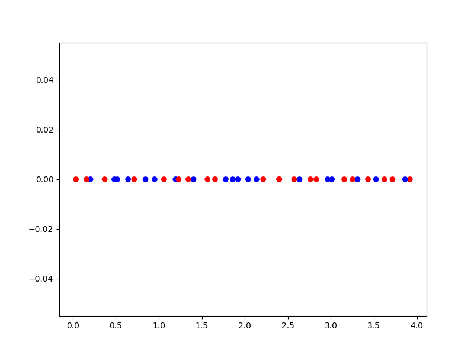
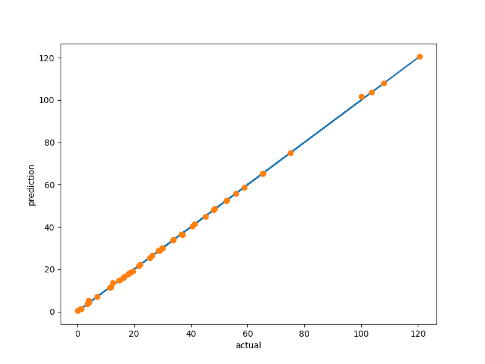

.. _Mixed Integer and Hierarchical Variables Types Specifications: 

Mixed Integer and Hierarchical Design Spaces (Variables, Sampling and Context)
==============================================================================

Mixed-discrete surrogate models need detailed information about the behavior of the design space (the input space),
which you can specify using the ``design_space`` module. The design space definition module also supports specifying
design space hierarchy including conditionally active design variables.

Design variables types
----------------------

The following variable types are supported:

- Float: the variable can assume any real/continuous value between two bounds (inclusive)
- Integer: the variable can assume any integer value between two bounds (inclusive)
- Ordinal: the variable can assume any value from some set, order is relevant
- Categorical: the variable can assume any value from some set, order is not relevant

Integer, ordinal and categorical variables are all *discrete* variables, as they can only assume specific values from
some set. The main differences between these types is the question whether distance and whether ordering matters:

- Integer: distance and order matters, e.g. the number of engines on an aircraft
- Ordinal: only order matters, e.g. steps in a process
- Categorical: neither distance nor order matters, e.g. different means for providing some functionality

More details can be found in [1]_ .

Variables are specified using the ``DesignVariable`` classes in ``smt.design_space``:
- ``FloatVariable(lower_bound, upper_bound)``, upper should be greater than lower bound
- ``IntegerVariable(lower_bound, upper_bound)``, bounds should be integers
- ``OrdinalVariable(values)``, values is a list of int, float or str, encoded as integers from 0 to len(values)-1
- ``CategoricalVariable(values)``, same specification and encoding as ordinal

The design space is then defined from a list of design variables and implements sampling and correction interfaces:

.. code-block:: python

  import numpy as np
  
  from smt.applications.mixed_integer import MixedIntegerSamplingMethod
  from smt.design_space import (
      CategoricalVariable,
      DesignSpace,
      FloatVariable,
      IntegerVariable,
      OrdinalVariable,
  )
  from smt.sampling_methods import LHS
  
  ds = DesignSpace(
      [
          CategoricalVariable(
              ["A", "B"]
          ),  # x0 categorical: A or B; order is not relevant
          OrdinalVariable(
              ["C", "D", "E"]
          ),  # x1 ordinal: C, D or E; order is relevant
          IntegerVariable(
              0, 2
          ),  # x2 integer between 0 and 2 (inclusive): 0, 1, 2
          FloatVariable(0, 1),  # c3 continuous between 0 and 1
      ]
  )
  
  # Sample the design space
  # Note: is_acting_sampled specifies for each design variable whether it is acting or not
  ds.seed = 42
  samp = MixedIntegerSamplingMethod(
      LHS, ds, criterion="ese", random_state=ds.seed
  )
  x_sampled, is_acting_sampled = samp(100, return_is_acting=True)
  
  # Correct design vectors: round discrete variables, correct hierarchical variables
  x_corr, is_acting = ds.correct_get_acting(
      np.array(
          [
              [0, 0, 2, 0.25],
              [0, 2, 1, 0.75],
          ]
      )
  )
  print(is_acting)
  
::

  [[ True  True  True  True]
   [ True  True  True  True]]
  

Hierarchical variables
----------------------

The design space definition uses the framework of [2]_ to manage both mixed-discrete variables and
hierarchical variables. We distinguish dimensional (or meta) variables which are a special type of variables that may
affect the dimension of the problem and decide if some other decreed variables are acting or non-acting.

Additionally, it is also possible to define value constraints that explicitly forbid two variables from having some
values simultaneously or for a continuous variable to be greater than another. 
This can be useful for modeling incompatibility relationships: for example, engines can't be 
installed on the back of the fuselage (vs on the wings) if a normal tail (vs T-tail) is selected.

Note: this feature is only available if smt_design_space_ext has been installed: `pip install smt-design-space-ext` [3]_ and also rely on `ADSG` and `ConfigSpace`. 

The hierarchy relationships are specified after instantiating the design space:

.. code-block:: python

  import numpy as np
  from smt_design_space_ext import ConfigSpaceDesignSpaceImpl
  
  from smt.applications.mixed_integer import (
      MixedIntegerKrigingModel,
      MixedIntegerSamplingMethod,
  )
  from smt.design_space import (
      CategoricalVariable,
      FloatVariable,
      IntegerVariable,
      OrdinalVariable,
  )
  from smt.sampling_methods import LHS
  from smt.surrogate_models import KRG, MixHrcKernelType, MixIntKernelType
  
  ds = ConfigSpaceDesignSpaceImpl(
      [
          CategoricalVariable(
              ["A", "B"]
          ),  # x0 categorical: A or B; order is not relevant
          OrdinalVariable(
              ["C", "D", "E"]
          ),  # x1 ordinal: C, D or E; order is relevant
          IntegerVariable(
              0, 2
          ),  # x2 integer between 0 and 2 (inclusive): 0, 1, 2
          FloatVariable(0, 1),  # c3 continuous between 0 and 1
      ]
  )
  
  # Declare that x1 is acting if x0 == A
  ds.declare_decreed_var(decreed_var=1, meta_var=0, meta_value="A")
  
  # Nested hierarchy is possible: activate x2 if x1 == C or D
  # Note: only if ConfigSpace is installed! pip install smt[cs]
  ds.declare_decreed_var(decreed_var=2, meta_var=1, meta_value=["C", "D"])
  
  # It is also possible to explicitly forbid two values from occurring simultaneously
  # Note: only if ConfigSpace is installed! pip install smt[cs]
  ds.add_value_constraint(
      var1=0, value1="A", var2=2, value2=[0, 1]
  )  # Forbid x0 == A && x2 == 0 or 1
  
  # For quantitative variables, it is possible to specify order relation
  ds.add_value_constraint(
      var1=2, value1="<", var2=3, value2=">"
  )  # Prevent x2 < x3
  
  # Sample the design space
  # Note: is_acting_sampled specifies for each design variable whether it is acting or not
  ds.seed = 42
  samp = MixedIntegerSamplingMethod(
      LHS, ds, criterion="ese", random_state=ds.seed
  )
  Xt, is_acting_sampled = samp(100, return_is_acting=True)
  
  rng = np.random.default_rng(42)
  Yt = 4 * rng.random(100) - 2 + Xt[:, 0] + Xt[:, 1] - Xt[:, 2] - Xt[:, 3]
  # Correct design vectors: round discrete variables, correct hierarchical variables
  x_corr, is_acting = ds.correct_get_acting(
      np.array(
          [
              [0, 0, 2, 0.25],
              [0, 2, 1, 0.75],
              [1, 2, 1, 0.66],
          ]
      )
  )
  
  # Observe the hierarchical behavior:
  assert np.all(
      is_acting
      == np.array(
          [
              [True, True, True, True],
              [
                  True,
                  True,
                  False,
                  True,
              ],  # x2 is not acting if x1 != C or D (0 or 1)
              [
                  True,
                  False,
                  False,
                  True,
              ],  # x1 is not acting if x0 != A, and x2 is not acting because x1 is not acting
          ]
      )
  )
  assert np.all(
      x_corr
      == np.array(
          [
              [0, 0, 2, 0.25],
              [0, 2, 0, 0.75],
              # x2 is not acting, so it is corrected ("imputed") to its non-acting value (0 for discrete vars)
              [1, 0, 0, 0.66],  # x1 and x2 are imputed
          ]
      )
  )
  
  sm = MixedIntegerKrigingModel(
      surrogate=KRG(
          design_space=ds,
          categorical_kernel=MixIntKernelType.HOMO_HSPHERE,
          hierarchical_kernel=MixHrcKernelType.ALG_KERNEL,
          theta0=[1e-2],
          hyper_opt="Cobyla",
          corr="abs_exp",
          n_start=5,
      ),
  )
  sm.set_training_values(Xt, Yt)
  sm.train()
  y_s = sm.predict_values(Xt)[:, 0]
  pred_RMSE = np.linalg.norm(y_s - Yt) / len(Yt)
  
  y_sv = sm.predict_variances(Xt)[:, 0]
  _var_RMSE = np.linalg.norm(y_sv) / len(Yt)
  assert pred_RMSE < 1e-7
  print("Pred_RMSE", pred_RMSE)
  
  self._sm = sm  # to be ignored: just used for automated test
  
::

  ___________________________________________________________________________
     
                              MixedIntegerKriging
  ___________________________________________________________________________
     
   Problem size
     
        # training points.        : 100
     
  ___________________________________________________________________________
     
   Training
     
     Training ...
     Training - done. Time (sec):  5.8195512
  ___________________________________________________________________________
     
   Evaluation
     
        # eval points. : 100
     
     Predicting ...
     Predicting - done. Time (sec):  0.7199609
     
     Prediction time/pt. (sec) :  0.0071996
     
  Pred_RMSE 4.034606181104147e-13
  

Design space and variable class references
------------------------------------------

The ``DesignSpace`` class and design variable classes implement the relevant functionality.

  .. autoclass:: smt.design_space.FloatVariable
     :exclude-members: get_limits

  .. autoclass:: smt.design_space.IntegerVariable
     :exclude-members: get_limits

  .. autoclass:: smt.design_space.OrdinalVariable
     :exclude-members: get_limits

  .. autoclass:: smt.design_space.CategoricalVariable
     :exclude-members: get_limits

  .. autoclass:: smt.design_space.DesignSpace
     :members:
     :inherited-members:
     :exclude-members: get_unfolded_num_bounds, fold_x, unfold_x, get_num_bounds, get_x_limits

Example of sampling a mixed-discrete design space
^^^^^^^^^^^^^^^^^^^^^^^^^^^^^^^^^^^^^^^^^^^^^^^^^

.. code-block:: python

  import matplotlib.pyplot as plt
  import numpy as np
  from matplotlib import colors
  
  from smt.applications.mixed_integer import MixedIntegerSamplingMethod
  from smt.design_space import (
      CategoricalVariable,
      DesignSpace,
      FloatVariable,
  )
  from smt.sampling_methods import LHS
  
  float_var = FloatVariable(0, 4)
  cat_var = CategoricalVariable(["blue", "red"])
  
  design_space = DesignSpace(
      [
          float_var,
          cat_var,
      ]
  )
  
  num = 40
  design_space.seed = 42
  samp = MixedIntegerSamplingMethod(
      LHS, design_space, criterion="ese", random_state=design_space.seed
  )
  x, x_is_acting = samp(num, return_is_acting=True)
  
  cmap = colors.ListedColormap(cat_var.values)
  plt.scatter(x[:, 0], np.zeros(num), c=x[:, 1], cmap=cmap)
  plt.show()
  

Mixed integer context
---------------------

The ``MixedIntegerContext`` class helps the user to use mixed integer sampling methods and surrogate models consistently
by acting as a factory for those objects given a x specification: (xtypes, xlimits).

  .. autoclass:: smt.applications.mixed_integer.MixedIntegerContext

  .. automethod:: smt.applications.mixed_integer.MixedIntegerContext.__init__

  .. automethod:: smt.applications.mixed_integer.MixedIntegerContext.build_sampling_method

  .. automethod:: smt.applications.mixed_integer.MixedIntegerContext.build_surrogate_model

Example of mixed integer context usage
^^^^^^^^^^^^^^^^^^^^^^^^^^^^^^^^^^^^^^

.. code-block:: python

  import matplotlib.pyplot as plt
  
  from smt.applications.mixed_integer import MixedIntegerContext
  from smt.design_space import (
      CategoricalVariable,
      DesignSpace,
      FloatVariable,
      IntegerVariable,
  )
  from smt.surrogate_models import KRG
  
  design_space = DesignSpace(
      [
          IntegerVariable(0, 5),
          FloatVariable(0.0, 4.0),
          CategoricalVariable(["blue", "red", "green", "yellow"]),
      ]
  )
  
  def ftest(x):
      return (x[:, 0] * x[:, 0] + x[:, 1] * x[:, 1]) * (x[:, 2] + 1)
  
  # Helper class for creating surrogate models
  mi_context = MixedIntegerContext(design_space)
  
  # DOE for training
  sampler = mi_context.build_sampling_method()
  
  num = mi_context.get_unfolded_dimension() * 5
  print("DOE point nb = {}".format(num))
  xt = sampler(num)
  yt = ftest(xt)
  
  # Surrogate
  sm = mi_context.build_kriging_model(KRG(hyper_opt="Cobyla"))
  sm.set_training_values(xt, yt)
  sm.train()
  
  # DOE for validation
  xv = sampler(50)
  yv = ftest(xv)
  yp = sm.predict_values(xv)
  
  plt.plot(yv, yv)
  plt.plot(yv, yp, "o")
  plt.xlabel("actual")
  plt.ylabel("prediction")
  
  plt.show()
  
::

  DOE point nb = 30
  ___________________________________________________________________________
     
                              MixedIntegerKriging
  ___________________________________________________________________________
     
   Problem size
     
        # training points.        : 30
     
  ___________________________________________________________________________
     
   Training
     
     Training ...
     Training - done. Time (sec):  0.7409899
  ___________________________________________________________________________
     
   Evaluation
     
        # eval points. : 50
     
     Predicting ...
     Predicting - done. Time (sec):  0.0248973
     
     Prediction time/pt. (sec) :  0.0004979
     
  

References
----------

.. [1] Saves, P. and Lafage, R. and Bartoli, N. and Diouane, Y. and Bussemaker, J. and Lefebvre, T. and Hwang, J. and Morlier, J. and Martins, J. (2024). SMT 2.0: A Surrogate Modeling Toolbox with a focus on Hierarchical and Mixed Variables Gaussian Processes. Advances in Engineering Sofware.

.. [2] Hallé-Hannan, E. and  Audet, C., and Diouane, Y. and  Le Digabel, S. and Saves, P. (2024). A graph-structured distance for heterogeneous datasets with meta variable, Neurocomputing.

.. [3] Saves, P., Hallé‑Hannan, E., Bussemaker, J., Diouane, Y., Bartoli, N. (2025). “Hierarchical Modeling and Architecture Optimization: Review and Unified Framework”, arXiv:2506.22621.

