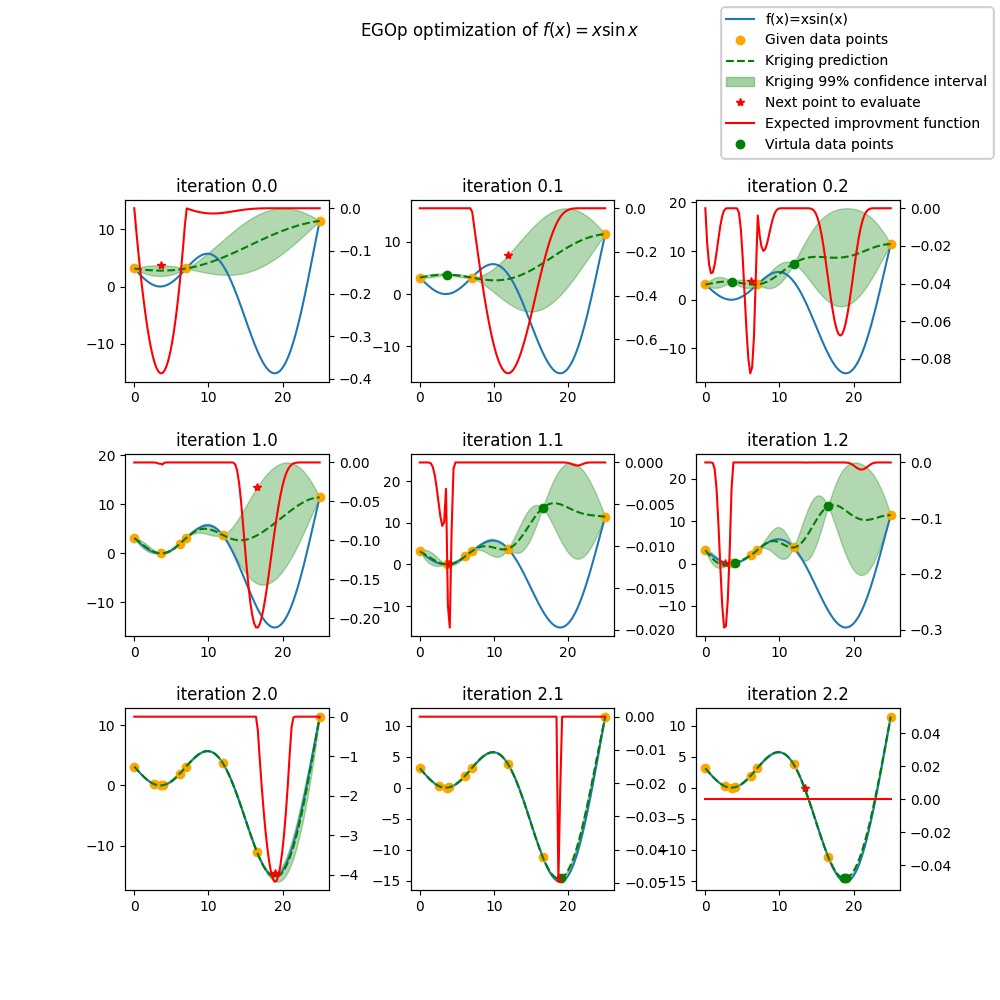
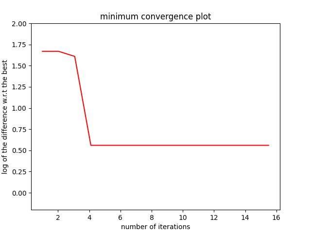

Efficient Global Optimization (EGO)
===================================

Bayesian Optimization
---------------------

Bayesian optimization is defined by Jonas Mockus in [1]_ as an optimization technique 
based upon the minimization of the expected deviation from the extremum of the studied function. 

The objective function is treated as a black-box function. A Bayesian strategy sees the objective 
as a random function and places a prior over it. The prior captures our beliefs about the behavior 
of the function. After gathering the function evaluations, which are treated as data, the prior is 
updated to form the posterior distribution over the objective function. The posterior distribution, 
in turn, is used to construct an acquisition function (often also referred to as infill sampling 
criterion) that determines what the next query point should be.

One of the earliest bodies of work on Bayesian optimisation that we are aware 
of are [2]_ and [3]_. Kushner used Wiener processes for one-dimensional problems.
Kushner’s decision model was based on maximizing the probability of improvement, and included a 
parameter that controlled the trade-off between ‘more global’ and ‘more local’ optimization, in 
the same spirit as the Exploration/Exploitation trade-off.

Meanwhile, in the former Soviet Union, Mockus and colleagues developed a multidimensional 
Bayesian optimization method using linear combinations of Wiener fields, some of which was 
published in English in [1]_. This paper also describes an acquisition function that 
is based on myopic expected improvement of the posterior, which has been widely adopted in 
Bayesian optimization as the Expected Improvement function.

In 1998, Jones used Gaussian processes together with the expected improvement function to 
successfully perform derivative-free optimization and experimental design through an algorithm 
called  Efficient  Global  Optimization, or EGO.

EGO
---

In what follows, we describe the Efficient Global Optimization (EGO) algorithm, 
as published in [4]_.

Let :math:`F` be an expensive black-box function to be minimized. We sample :math:`F` at the 
different locations :math:`X = \{x_1, x_2,\ldots,x_n\}` yielding the responses 
:math:`Y = \{y_1, y_2,\ldots,y_n\}`. We build a Kriging model (also called Gaussian process) 
with a mean function :math:`\mu` and a variance function :math:`\sigma^{2}`.

The next step is to compute the criterion EI. To do this, let us denote:

.. math::
	\begin{equation}
	f_{min} = \min \{y_1, y_2,\ldots,y_n\}.
	\end{equation}

The Expected Improvement function (EI) can be expressed:

.. math::
	\begin{equation}	
	E[I(x)] = E[\max(f_{min}-Y, 0)]
	\end{equation}

where :math:`Y` is the random variable following the distribution :math:`\mathcal{N}(\mu(x), \sigma^{2}(x))`.
By expressing the right-hand side of EI expression as an integral, and applying some tedious 
integration by parts, one can express the expected improvement in closed form: 

.. math::
  \begin{equation}	
  E[I(x)] = (f_{min} - \mu(x))\Phi\left(\frac{f_{min} - \mu(x)}{\sigma(x)}\right) + \sigma(x) \phi\left(\frac{f_{min} - \mu(x)}{\sigma(x)}\right)
  \end{equation}

where :math:`\Phi(\cdot)` and :math:`\phi(\cdot)` are respectively the cumulative and probability 
density functions of :math:`\mathcal{N}(0,1)`.

Next, we determine our next sampling point as :

.. math::
	\begin{equation}
	x_{n+1} = \arg \max_{x} \left(E[I(x)]\right)
	\end{equation}

We then test the response :math:`y_{n+1}` of our black-box function :math:`F` at :math:`x_{n+1}`, 
rebuild the model taking into account the new information gained, and research 
the point of maximum expected improvement again.

We summarize here the EGO algorithm:

EGO(F, :math:`n_{iter}`) \# Find the best minimum of :math:`\operatorname{F}` 
in :math:`n_{iter}` iterations  

For (:math:`i=0:n_{iter}`)  

* :math:`mod = {model}(X, Y)`  \# surrogate model based on sample vectors :math:`X` and :math:`Y`  
* :math:`f_{min} = \min Y`  
* :math:`x_{i+1} = \arg \max {EI}(mod, f_{min})` \# choose :math:`x` that maximizes EI  
* :math:`y_{i+1} = {F}(x_{i+1})` \# Probe the function at most promising point :math:`x_{i+1}`  
* :math:`X = [X,x_{i+1}]`  
* :math:`Y = [Y,y_{i+1}]`   
* :math:`i = i+1`  

:math:`f_{min} = \min Y`  

Return : :math:`f_{min}` \# This is the best known solution after :math:`n_{iter}` iterations.

More details can be found in [4]_.

EGO parallel (EGO with qEI criterion)
-------------------------------------

The goal is to be able to run batch optimization. At each iteration of the algorithm, multiple new sampling points are extracted 
from the know ones. These new sampling points are then evaluated using a parallel computing environment. 

The parallel version of this algorithm has been presented by Ginsbourger et al. [5]_ in 2010. 
The Expected improvement (`EI`) is extended to proposed q new sampling points instead of one, 
they called this criterion the `qEI` criterion. As the exact evaluation is not straightforward 
they proposed different ways to approximate this criterion.

Details of the implementation can be found in [6]_ [7]_.

Differents approximation strategy of the `qEI` criterion
^^^^^^^^^^^^^^^^^^^^^^^^^^^^^^^^^^^^^^^^^^^^^^^^^^^^^^^^^

The basic idea is to run :math:`q` iterations of the `EGO` algorithm and to set temporally the response :math:`\hat y_q`  of the :math:`q` new sampling points to a virtual value. 
When the :math:`q` new sampling points are defined the real evaluation of the response :math:`y_q` of these points is done in parallel.
The efficiency of the methods lies in the strategy to set the virtual values. 

Let assume that the new sampling point is at :math:`x_q`. The virtual response :math:`y_q` is set according to one of those strategies: 

The minimum constant liar (`CLmin`) strategy 
""""""""""""""""""""""""""""""""""""""""""""

:math:`\hat y_q = \min (Y)`

The Kriging believer (`KB`) strategy 
""""""""""""""""""""""""""""""""""""

The Kriging model gives a mean function  :math:`\mu` and a variance function :math:`\sigma^2` based on sample vectors :math:`X` and :math:`Y`. 

The virtual values are set according to the model prediction:

:math:`\hat y_q = \mu (x_q)`

Some variants are proposed to introduce an optimistic or pessimistic part :

    * the Kriging Believer Upper Bound (KBUB) : :math:`\hat y_q = \mu (x_q) + 3 \sigma` 
    * the Kriging Believer Lower Bound (KBLB) : :math:`\hat y_q = \mu (x_q) - 3 \sigma`

Tips for an efficient use
^^^^^^^^^^^^^^^^^^^^^^^^^

* the `n_parallel` parameter is set by the user, a real improvement of the efficiency is observed for relatively low values of the parameter (<8) [3]_
* Since the maximization of the `EI` is a highly multimodal optimization problem, it could be necessary to increase the `n_start` parameter of the algorithm. 

Implementation Notes
--------------------

Beside the Expected Improvement, the implementation here offers two other infill criteria:

* SBO (Surrogate Based Optimization): directly using the prediction of the surrogate model (:math:`\mu`)
* LCB (Lower Confidence Bound): using the 99% confidence interval :math:`\mu -3 \times \sigma`

Regarding the parallel execution, one can implement specific multiprocessing by deriving the _Evaluator_ interface
and overriding the default implementation of the _run(fun, x)_ method. The default implementation simply runs _fun(x)_.

Regardless the others parameters, you can specify a mixed surrogate model to make mixed optimization. See [8]_ .
The expected improvement is continuously computed and optimized so that can lead to an infill point that will be projected, in the mixed case, to an already evaluated point.
To avoid the re-evaluation of a point, you can penalize the Expected Improvement via tunneling which decrease the EI in the neighbourhood of the known DOE points.
However, this is not recommanded for high dimensional problems because the re-evaluation is uncommon. Tunneling evaluation can be slow with a lot of point.

When considering a mixed integer optimization, the function to be optimized by EGO
has to handle categorical variables as indexes in the given enumaration type. For instance, 
with a categorical enumeration ``["red", "green", "blue"]``,  passing ``"blue"`` to the 
function should be handled by passing the value ``2`` which is the index of ``"blue"`` 
in the enumeration list. This choice was made to keep on using a numerical ndarray as interface
of the function to be optimized ``f: [n_samples, n_features] -> [n_eval, 1]`` allowing parallel
evaluations.

References
----------

.. [1] Mockus, J. (1975). On Bayesian methods for seeking the extremum. In Optimization Techniques IFIP Technical Conference (pp. 400-404). Springer, Berlin, Heidelberg.

.. [2] Kushner, H. J. (1962). A versatile stochastic model of a function of unknown and time varying form. Journal of Mathematical Analysis and Applications, 5(1), 150-167.

.. [3] Kushner, H. J. (1964). A new method of locating the maximum point of an arbitrary multipeak curve in the presence of noise. Journal of Basic Engineering, 86(1), 97-106.

.. [4] Jones, D. R., Schonlau, M., & Welch, W. J. (1998). Efficient global optimization of expensive black-box functions. Journal of Global optimization, 13(4), 455-492.

.. [5] Ginsbourger, D., Le Riche, R., & Carraro, L. (2010). Kriging is well-suited to parallelize optimization. In Computational intelligence in expensive optimization problems (pp. 131-162). Springer, Berlin, Heidelberg.

.. [6] Roux, E. , Tillier, Y. , Kraria, S., & Bouchard, P.-O. (2020). An efficient parallel global optimization strategy based on Kriging properties suitable for material parameter identification.In AME, accepted for publication. 

.. [7] Roux, E. (2011). Assemblage mécanique: stratégies d'optimisation des procédés et d'identification des comportements mécaniques des matériaux (Doctoral dissertation).

.. [8] Saves, P. and Diouane, Y. and Bartoli, N. and Lefebvre, T. and Morlier, J., A general square exponential kernel to handle mixed-categorical variables for Gaussian process, AIAA Aviation 2022 Forum, pp. 3870. 

Usage
-----

.. code-block:: python

  import numpy as np
  from smt.applications import EGO
  import matplotlib.pyplot as plt
  
  def function_test_1d(x):
      # function xsinx
      import numpy as np
  
      x = np.reshape(x, (-1,))
      y = np.zeros(x.shape)
      y = (x - 3.5) * np.sin((x - 3.5) / (np.pi))
      return y.reshape((-1, 1))
  
  n_iter = 6
  xlimits = np.array([[0.0, 25.0]])
  xdoe = np.atleast_2d([0, 7, 25]).T
  n_doe = xdoe.size
  
  criterion = "EI"  #'EI' or 'SBO' or 'LCB'
  
  ego = EGO(n_iter=n_iter, criterion=criterion, xdoe=xdoe, xlimits=xlimits)
  
  x_opt, y_opt, _, x_data, y_data = ego.optimize(fun=function_test_1d)
  print("Minimum in x={:.1f} with f(x)={:.1f}".format(float(x_opt), float(y_opt)))
  
  x_plot = np.atleast_2d(np.linspace(0, 25, 100)).T
  y_plot = function_test_1d(x_plot)
  
  fig = plt.figure(figsize=[10, 10])
  for i in range(n_iter):
      k = n_doe + i
      x_data_k = x_data[0:k]
      y_data_k = y_data[0:k]
      ego.gpr.set_training_values(x_data_k, y_data_k)
      ego.gpr.train()
  
      y_gp_plot = ego.gpr.predict_values(x_plot)
      y_gp_plot_var = ego.gpr.predict_variances(x_plot)
      y_ei_plot = -ego.EI(x_plot)
  
      ax = fig.add_subplot((n_iter + 1) // 2, 2, i + 1)
      ax1 = ax.twinx()
      (ei,) = ax1.plot(x_plot, y_ei_plot, color="red")
  
      (true_fun,) = ax.plot(x_plot, y_plot)
      (data,) = ax.plot(
          x_data_k, y_data_k, linestyle="", marker="o", color="orange"
      )
      if i < n_iter - 1:
          (opt,) = ax.plot(
              x_data[k], y_data[k], linestyle="", marker="*", color="r"
          )
      (gp,) = ax.plot(x_plot, y_gp_plot, linestyle="--", color="g")
      sig_plus = y_gp_plot + 3 * np.sqrt(y_gp_plot_var)
      sig_moins = y_gp_plot - 3 * np.sqrt(y_gp_plot_var)
      un_gp = ax.fill_between(
          x_plot.T[0], sig_plus.T[0], sig_moins.T[0], alpha=0.3, color="g"
      )
      lines = [true_fun, data, gp, un_gp, opt, ei]
      fig.suptitle("EGO optimization of $f(x) = x \sin{x}$")
      fig.subplots_adjust(hspace=0.4, wspace=0.4, top=0.8)
      ax.set_title("iteration {}".format(i + 1))
      fig.legend(
          lines,
          [
              "f(x)=xsin(x)",
              "Given data points",
              "Kriging prediction",
              "Kriging 99% confidence interval",
              "Next point to evaluate",
              "Expected improvment function",
          ],
      )
  plt.show()
  
::

  Minimum in x=18.9 with f(x)=-15.1
  
.. figure:: ego_TestEGO_run_ego_example.png
  :scale: 80 %
  :align: center

Usage with parallel options
^^^^^^^^^^^^^^^^^^^^^^^^^^^

.. code-block:: python

  import numpy as np
  from smt.applications import EGO
  from smt.applications.ego import EGO, Evaluator
  from smt.sampling_methods import FullFactorial
  
  import sklearn
  import matplotlib.pyplot as plt
  from matplotlib import colors
  from mpl_toolkits.mplot3d import Axes3D
  from scipy.stats import norm
  
  def function_test_1d(x):
      # function xsinx
      import numpy as np
  
      x = np.reshape(x, (-1,))
      y = np.zeros(x.shape)
      y = (x - 3.5) * np.sin((x - 3.5) / (np.pi))
      return y.reshape((-1, 1))
  
  n_iter = 3
  n_parallel = 3
  n_start = 50
  xlimits = np.array([[0.0, 25.0]])
  xdoe = np.atleast_2d([0, 7, 25]).T
  n_doe = xdoe.size
  
  class ParallelEvaluator(Evaluator):
      """
      Implement Evaluator interface using multiprocessing ThreadPool object (Python 3 only).
      """
  
      def run(self, fun, x):
          n_thread = 5
          # Caveat: import are made here due to SMT documentation building process
          import numpy as np
          from sys import version_info
          from multiprocessing.pool import ThreadPool
  
          if version_info.major == 2:
              return fun(x)
          # Python 3 only
          with ThreadPool(n_thread) as p:
              return np.array(
                  [
                      y[0]
                      for y in p.map(
                          fun, [np.atleast_2d(x[i]) for i in range(len(x))]
                      )
                  ]
              )
  
  criterion = "EI"  #'EI' or 'SBO' or 'LCB'
  qEI = "KBUB"  # "KB", "KBLB", "KBUB", "KBRand"
  ego = EGO(
      n_iter=n_iter,
      criterion=criterion,
      xdoe=xdoe,
      xlimits=xlimits,
      n_parallel=n_parallel,
      qEI=qEI,
      n_start=n_start,
      evaluator=ParallelEvaluator(),
      random_state=42,
  )
  
  x_opt, y_opt, _, x_data, y_data = ego.optimize(fun=function_test_1d)
  print("Minimum in x={:.1f} with f(x)={:.1f}".format(float(x_opt), float(y_opt)))
  
  x_plot = np.atleast_2d(np.linspace(0, 25, 100)).T
  y_plot = function_test_1d(x_plot)
  
  fig = plt.figure(figsize=[10, 10])
  for i in range(n_iter):
      k = n_doe + (i) * (n_parallel)
      x_data_k = x_data[0:k]
      y_data_k = y_data[0:k]
      x_data_sub = x_data_k.copy()
      y_data_sub = y_data_k.copy()
      for p in range(n_parallel):
          ego.gpr.set_training_values(x_data_sub, y_data_sub)
          ego.gpr.train()
  
          y_ei_plot = -ego.EI(x_plot)
          y_gp_plot = ego.gpr.predict_values(x_plot)
          y_gp_plot_var = ego.gpr.predict_variances(x_plot)
  
          x_data_sub = np.append(x_data_sub, x_data[k + p])
          y_KB = ego._get_virtual_point(np.atleast_2d(x_data[k + p]), y_data_sub)
  
          y_data_sub = np.append(y_data_sub, y_KB)
  
          ax = fig.add_subplot(n_iter, n_parallel, i * (n_parallel) + p + 1)
          ax1 = ax.twinx()
          (ei,) = ax1.plot(x_plot, y_ei_plot, color="red")
  
          (true_fun,) = ax.plot(x_plot, y_plot)
          (data,) = ax.plot(
              x_data_sub[: -1 - p],
              y_data_sub[: -1 - p],
              linestyle="",
              marker="o",
              color="orange",
          )
          (virt_data,) = ax.plot(
              x_data_sub[-p - 1 : -1],
              y_data_sub[-p - 1 : -1],
              linestyle="",
              marker="o",
              color="g",
          )
  
          (opt,) = ax.plot(
              x_data_sub[-1], y_data_sub[-1], linestyle="", marker="*", color="r"
          )
          (gp,) = ax.plot(x_plot, y_gp_plot, linestyle="--", color="g")
          sig_plus = y_gp_plot + 3.0 * np.sqrt(y_gp_plot_var)
          sig_moins = y_gp_plot - 3.0 * np.sqrt(y_gp_plot_var)
          un_gp = ax.fill_between(
              x_plot.T[0], sig_plus.T[0], sig_moins.T[0], alpha=0.3, color="g"
          )
          lines = [true_fun, data, gp, un_gp, opt, ei, virt_data]
          fig.suptitle("EGOp optimization of $f(x) = x \sin{x}$")
          fig.subplots_adjust(hspace=0.4, wspace=0.4, top=0.8)
          ax.set_title("iteration {}.{}".format(i, p))
          fig.legend(
              lines,
              [
                  "f(x)=xsin(x)",
                  "Given data points",
                  "Kriging prediction",
                  "Kriging 99% confidence interval",
                  "Next point to evaluate",
                  "Expected improvment function",
                  "Virtula data points",
              ],
          )
  plt.show()
  
::

  Minimum in x=19.0 with f(x)=-15.1
  

Usage with mixed variable
^^^^^^^^^^^^^^^^^^^^^^^^^^^
.. code-block:: python

  import numpy as np
  from smt.applications import EGO
  from smt.applications.mixed_integer import (
      MixedIntegerContext,
      FLOAT,
      ENUM,
      ORD,
  )
  import matplotlib.pyplot as plt
  from smt.surrogate_models import KRG
  from smt.sampling_methods import LHS
  
  # Regarding the interface, the function to be optimized should handle
  # categorical values as index values in the enumeration type specification.
  # For instance, here "blue" will be passed to the function as the index value 2.
  # This allows to keep the numpy ndarray X handling numerical values.
  def function_test_mixed_integer(X):
      # float
      x1 = X[:, 0]
      #  enum 1
      c1 = X[:, 1]
      x2 = c1 == 0
      x3 = c1 == 1
      x4 = c1 == 2
      #  enum 2
      c2 = X[:, 2]
      x5 = c2 == 0
      x6 = c2 == 1
      # int
      i = X[:, 3]
  
      y = (
          (x2 + 2 * x3 + 3 * x4) * x5 * x1
          + (x2 + 2 * x3 + 3 * x4) * x6 * 0.95 * x1
          + i
      )
      return y
  
  n_iter = 15
  xtypes = [FLOAT, (ENUM, 3), (ENUM, 2), ORD]
  xlimits = np.array(
      [[-5, 5], ["red", "green", "blue"], ["square", "circle"], [0, 2]]
  )
  criterion = "EI"  #'EI' or 'SBO' or 'LCB'
  qEI = "KB"
  sm = KRG(print_global=False)
  mixint = MixedIntegerContext(xtypes, xlimits)
  n_doe = 3
  sampling = mixint.build_sampling_method(LHS, criterion="ese", random_state=42)
  xdoe = sampling(n_doe)
  ydoe = function_test_mixed_integer(xdoe)
  
  ego = EGO(
      n_iter=n_iter,
      criterion=criterion,
      xdoe=xdoe,
      ydoe=ydoe,
      xtypes=xtypes,
      xlimits=xlimits,
      surrogate=sm,
      qEI=qEI,
      random_state=42,
  )
  
  x_opt, y_opt, _, _, y_data = ego.optimize(fun=function_test_mixed_integer)
  print("Minimum in x={} with f(x)={:.1f}".format(x_opt, float(y_opt)))
  print("Minimum in typed x={}".format(ego.mixint.cast_to_mixed_integer(x_opt)))
  
  min_ref = -15
  mini = np.zeros(n_iter)
  for k in range(n_iter):
      mini[k] = np.log(np.abs(np.min(y_data[0 : k + n_doe - 1]) - min_ref))
  x_plot = np.linspace(1, n_iter + 0.5, n_iter)
  u = max(np.floor(max(mini)) + 1, -100)
  l = max(np.floor(min(mini)) - 0.2, -10)
  fig = plt.figure()
  axes = fig.add_axes([0.1, 0.1, 0.8, 0.8])
  axes.plot(x_plot, mini, color="r")
  axes.set_ylim([l, u])
  plt.title("minimum convergence plot", loc="center")
  plt.xlabel("number of iterations")
  plt.ylabel("log of the difference w.r.t the best")
  plt.show()
  
::

  Minimum in x=[-5.  2.  1.  1.] with f(x)=-13.2
  Minimum in typed x=[-5.0, 'blue', 'circle', 1]
  

Options
-------

.. list-table:: List of options
  :header-rows: 1
  :widths: 15, 10, 20, 20, 30
  :stub-columns: 0

  *  -  Option
     -  Default
     -  Acceptable values
     -  Acceptable types
     -  Description
  *  -  fun
     -  None
     -  None
     -  ['function']
     -  Function to minimize
  *  -  criterion
     -  EI
     -  ['EI', 'SBO', 'LCB']
     -  ['str']
     -  criterion for next evaluation point determination: Expected Improvement,             Surrogate-Based Optimization or Lower Confidence Bound
  *  -  n_iter
     -  None
     -  None
     -  ['int']
     -  Number of optimizer steps
  *  -  n_max_optim
     -  20
     -  None
     -  ['int']
     -  Maximum number of internal optimizations
  *  -  n_start
     -  20
     -  None
     -  ['int']
     -  Number of optimization start points
  *  -  n_parallel
     -  1
     -  None
     -  ['int']
     -  Number of parallel samples to compute using qEI criterion
  *  -  qEI
     -  KBLB
     -  ['KB', 'KBLB', 'KBUB', 'KBRand', 'CLmin']
     -  ['str']
     -  Approximated q-EI maximization strategy
  *  -  evaluator
     -  <smt.applications.ego.Evaluator object at 0x000001638A08E430>
     -  None
     -  ['Evaluator']
     -  Object used to run function fun to optimize at x points (nsamples, nxdim)
  *  -  n_doe
     -  None
     -  None
     -  ['int']
     -  Number of points of the initial LHS doe, only used if xdoe is not given
  *  -  xdoe
     -  None
     -  None
     -  ['ndarray']
     -  Initial doe inputs
  *  -  ydoe
     -  None
     -  None
     -  ['ndarray']
     -  Initial doe outputs
  *  -  xlimits
     -  None
     -  None
     -  ['ndarray']
     -  Bounds of function fun inputs
  *  -  verbose
     -  False
     -  None
     -  ['bool']
     -  Print computation information
  *  -  enable_tunneling
     -  False
     -  None
     -  ['bool']
     -  Enable the penalization of points that have been already evaluated in EI criterion
  *  -  categorical_kernel
     -  None
     -  ['gower_matrix_kernel', 'exponential_homoscedastic_matrix_kernel', 'homoscedastic_matrix_kernel', 'continuous_relaxation_matrix_kernel']
     -  None
     -  The kernel to use for categorical inputs. Only for non continuous Kriging.
  *  -  surrogate
     -  <smt.surrogate_models.krg.KRG object at 0x000001638A0A1490>
     -  None
     -  ['KRG', 'KPLS', 'KPLSK', 'GEKPLS', 'MGP']
     -  SMT kriging-based surrogate model used internaly
  *  -  xtypes
     -  None
     -  None
     -  ['list']
     -  x type specifications: either FLOAT for continuous, INT for integer or (ENUM n) for categorical doimension with n levels
  *  -  random_state
     -  None
     -  None
     -  ['NoneType', 'int', 'RandomState']
     -  Numpy RandomState object or seed number which controls random draws
