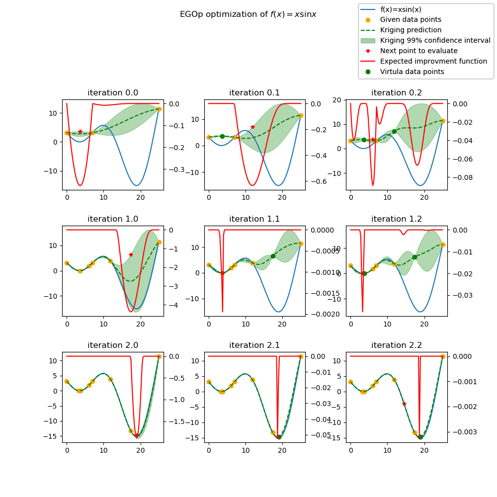

Efficient Global Optimization parallel version (EGOp)
=====================================================

The parallel version is an extension of the :doc:`ego` proposed by Jones in 1998 [1]_.

The goal is to be able to run batch optimization. At each iteration of the algorithm, multiple new sampling points are extracted from the know ones. These new sampling points are then evaluated using a parallel computing environment. 

The parallel version of this algorithm has been presented by Ginsbourger et al. [2]_ in 2010. The Expected improvement (`EI`) is extended to proposed q new sampling points instead of one, they called this criterion the `qEI` criterion. As the exact evaluation is not straightforward they proposed different ways to approximate this criterion.

Details of the implementation can be found in [3]_ [4]_.

Differents approximation strategy of the  `qEI` criterion
---------------------------------------------------------

The basic idea is to run :math:`q` iterations of the `EGO` algorithm and to set temporally the response :math:`\hat y_q`  of the :math:`q` new sampling points to a virtual value. 
When the :math:`q` new sampling points are defined the real evaluation of the response :math:`y_q` of these points is done in parallel.
The efficiency of the methods lies in the strategy to set the virtual values. 

Let assume that the new sampling point is at :math:`x_q`. The virtual response :math:`y_q` is set according to one of those strategies: 

The minimum constant liar (`CLmin`) strategy : 
^^^^^^^^^^^^^^^^^^^^^^^^^^^^^^^^^^^^^^^^^^^^^^
:math:`\hat y_q = \min (Y)`

The Kriging believer (`KB`) strategy : 
^^^^^^^^^^^^^^^^^^^^^^^^^^^^^^^^^^^^^^
The Kriging model gives a mean function  :math:`\mu` and a variance function :math:`\sigma^2` based on sample vectors :math:`X` and :math:`Y`. 

The virtual values are set according to the model prediction:

:math:`\hat y_q = \mu (x_q)`

Some variants are proposed to introduce an optimistic or pessimistic part :

    * the Kringin Believer Upper Bound (KBUB) : :math:`\hat y_q = \mu (x_q) + 3 \sigma` 
    * the Kringin Believer Lower Bound (KBLB) : :math:`\hat y_q = \mu (x_q) - 3 \sigma`

Tips for an efficient use
-------------------------
* the `n_par` parameter is set by the user, a real improvement of the efficiency is observed for relatively low values of the parameter (<8) [3]_
* Since the maximization of the `EI` is a highly multimodal optimization problem, it could be necessary to increase the `n_start` parameter of the algorithm. 

Implementation Note
-------------------

Beside the theory is based on the q-Expected Improvement, the implementation works also with other infill criteria:

* SBO (Surrogate Based Optimization): directly using the prediction of the surrogate model (:math:`\mu`)
* UCB (Upper Confidence bound): using the 99% confidence interval :math:`\mu -3 \times \sigma`

References
----------

.. [1] Jones, D. R., Schonlau, M., & Welch, W. J. (1998). Efficient global optimization of expensive black-box functions. Journal of Global optimization, 13(4), 455-492.

.. [2] Ginsbourger, D., Le Riche, R., & Carraro, L. (2010). Kriging is well-suited to parallelize optimization. In Computational intelligence in expensive optimization problems (pp. 131-162). Springer, Berlin, Heidelberg.

.. [3] Roux, E. , Tillier, Y. , Kraria, S., & Bouchard, P.-O. (2020). An efficient parallel global optimization strategy based on Kriging properties suitable for material parameter identification.In AME, accepted for publication. 

.. [4] Roux, E. (2011). Assemblage mécanique: stratégies d'optimisation des procédés et d'identification des comportements mécaniques des matériaux (Doctoral dissertation). 

Usage
-----

.. code-block:: python

  import numpy as np
  import six
  from smt.applications import EGO_para
  from smt.sampling_methods import FullFactorial
  
  import sklearn
  import matplotlib.pyplot as plt
  from matplotlib import colors
  from mpl_toolkits.mplot3d import Axes3D
  from scipy.stats import norm
  
  def function_test_1d(x):
      # function xsinx
      import numpy as np
  
      x = np.reshape(x, (-1,))
      y = np.zeros(x.shape)
      y = (x - 3.5) * np.sin((x - 3.5) / (np.pi))
      return y.reshape((-1, 1))
  
  n_iter = 3
  n_par = 3
  n_start = 50
  xlimits = np.array([[0.0, 25.0]])
  xdoe = np.atleast_2d([0,7,  25]).T
  n_doe = xdoe.size
  
  criterion = "EI"  #'EI' or 'SBO' or 'UCB'
  qEIAproxCrit = 'KBUB' #"KB", "KBLB", "KBUB", "KBRand"
  ego = EGO_para(n_iter=n_iter,
                 criterion=criterion,
                 xdoe=xdoe,
                 xlimits=xlimits,
                 n_par=n_par,
                 qEIAproxCrit=qEIAproxCrit,
                 n_start=n_start)
  
  x_opt, y_opt, ind_best, x_data, y_data, x_doe, y_doe = ego.optimize(
      fun=function_test_1d
  )
  print("Minimum in x={:.1f} with f(x)={:.1f}".format(float(x_opt), float(y_opt)))
  
  x_plot = np.atleast_2d(np.linspace(0, 25, 100)).T
  y_plot = function_test_1d(x_plot)
  
  fig = plt.figure(figsize=[10, 10])
  for i in range(n_iter):
      k = n_doe + (i)*(n_par)
      x_data_k = x_data[0:k]
      y_data_k = y_data[0:k]
      x_data_sub = x_data_k.copy()
      y_data_sub = y_data_k.copy()
      for p in range(n_par):     
          ego.gpr.set_training_values(x_data_sub, y_data_sub)
          ego.gpr.train()
          
          y_ei_plot = -ego.EI(x_plot, y_data_sub)
          y_gp_plot = ego.gpr.predict_values(x_plot)
          y_gp_plot_var = ego.gpr.predict_variances(x_plot)
  
          
          x_data_sub = np.append(x_data_sub, x_data[k+p])        
          y_KB = ego.set_virtual_point(np.atleast_2d(x_data[k+p]),
                                       y_data_sub)
  
          y_data_sub = np.append(y_data_sub, y_KB)
          
      
  
          
      
          ax = fig.add_subplot(n_iter, n_par, i*(n_par) + p + 1)
          ax1 = ax.twinx()
          ei, = ax1.plot(x_plot, y_ei_plot, color="red")
      
          true_fun, = ax.plot(x_plot, y_plot)
          data, = ax.plot(
              x_data_sub[:-1-p], y_data_sub[:-1-p], linestyle="", marker="o", color="orange"
          )
          virt_data, = ax.plot(
              x_data_sub[-p-1:-1], y_data_sub[-p-1:-1], linestyle="", marker="o", color="g"
          )
  
          opt, = ax.plot(
              x_data_sub[-1], y_data_sub[-1], linestyle="", marker="*", color="r"
          )
          gp, = ax.plot(x_plot, y_gp_plot, linestyle="--", color="g")
          sig_plus  = y_gp_plot + 3. * np.sqrt(y_gp_plot_var)
          sig_moins = y_gp_plot - 3. * np.sqrt(y_gp_plot_var)
          un_gp = ax.fill_between(
              x_plot.T[0], sig_plus.T[0], sig_moins.T[0], alpha=0.3, color="g"
          )
          lines = [true_fun, data, gp, un_gp, opt, ei, virt_data]
          fig.suptitle("EGOp optimization of $f(x) = x \sin{x}$")
          fig.subplots_adjust(hspace=0.4, wspace=0.4, top=0.8)
          ax.set_title("iteration {}.{}".format(i ,p ))
          fig.legend(
              lines,
              [
                  "f(x)=xsin(x)",
                  "Given data points",
                  "Kriging prediction",
                  "Kriging 99% confidence interval",
                  "Next point to evaluate",
                  "Expected improvment function",
                  "Virtula data points"
              ],
          )
  plt.show()
  
::

  Minimum in x=19.0 with f(x)=-15.1
  

Options
-------

.. list-table:: List of options
  :header-rows: 1
  :widths: 15, 10, 20, 20, 30
  :stub-columns: 0

  *  -  Option
     -  Default
     -  Acceptable values
     -  Acceptable types
     -  Description
  *  -  fun
     -  None
     -  None
     -  ['function']
     -  Function to minimize
  *  -  criterion
     -  EI
     -  ['EI', 'SBO', 'UCB']
     -  ['str']
     -  criterion for next evaluation point determination: Expected Improvement,             Surrogate-Based Optimization or Upper Confidence Bound
  *  -  n_iter
     -  None
     -  None
     -  ['int']
     -  Number of optimizer steps
  *  -  n_max_optim
     -  20
     -  None
     -  ['int']
     -  Maximum number of internal optimizations
  *  -  n_start
     -  20
     -  None
     -  ['int']
     -  Number of optimization start points
  *  -  n_doe
     -  None
     -  None
     -  ['int']
     -  Number of points of the initial LHS doe, only used if xdoe is not given
  *  -  xdoe
     -  None
     -  None
     -  ['ndarray']
     -  Initial doe inputs
  *  -  ydoe
     -  None
     -  None
     -  ['ndarray']
     -  Initial doe outputs
  *  -  xlimits
     -  None
     -  None
     -  ['ndarray']
     -  Bounds of function fun inputs
  *  -  verbose
     -  False
     -  None
     -  ['bool']
     -  Print computation information
  *  -  n_par
     -  1
     -  None
     -  ['int']
     -  Number parallel sample the compute using the qEI 
  *  -  qEIAproxCrit
     -  KBLB
     -  ['KB', 'KBLB', 'KBUB', 'KBRand', 'CLmin']
     -  ['str']
     -  Approximated q-EI maximization strategy 
