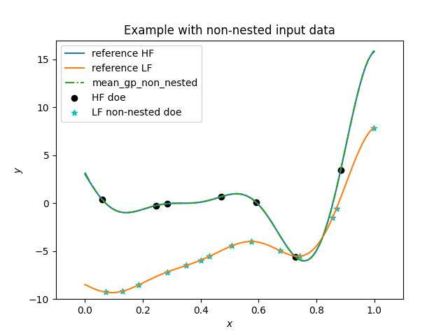

.. _mfck-ref-label:

Multi-Fidelity Co-Kriging (MFCK)
================================

MFCK is a multi-fidelity modeling method similar to MFK which uses an autoregressive model of order 1 (AR1).

.. math ::
        y_\text{high}({\bf x})=\rho(x) \cdot y_\text{low}({\bf x}) + \delta({\bf x})

where :math:`\rho(x)`
is a scaling/correlation factor (constant for MFCK) and :math:`\delta(\cdot)` is a discrepancy function.

The additive AR1 formulation was first introduced by Kennedy and O'Hagan [1]_.
While MFK follows the recursive formulation of Le Gratiet [2]_. MFCK uses ab block-wise matrix construction for :math:`n` levels of fidelity offering freedom in terms of data input assumptions.

References
----------
.. [1] Kennedy, M.C. and O'Hagan, A., Bayesian calibration of computer models. Journal of the Royal Statistical Society. 2001
.. [2] Le Gratiet, L., Multi-fidelity Gaussian process regression for computer experiments. PhD Thesis. 2013

Usage
-----

.. code-block:: python

  import matplotlib.pyplot as plt
  import numpy as np
  
  from smt.applications.mfck import MFCK
  from smt.sampling_methods import LHS
  
  # low fidelity model
  def lf_function(x):
      import numpy as np
  
      return (
          0.5 * ((x * 6 - 2) ** 2) * np.sin((x * 6 - 2) * 2)
          + (x - 0.5) * 10.0
          - 5
      )
  
      # high fidelity model
  
  def hf_function(x):
      import numpy as np
  
      return ((x * 6 - 2) ** 2) * np.sin((x * 6 - 2) * 2)
  
  rnd_state = 1
  
  # Problem set up
  xlimits = np.array([[0.0, 1.0]])
  
  # Example with non-nested input data
  Obs_HF = 7  # Number of observations of HF
  Obs_LF = 14  # Number of observations of LF
  
  # Creation of LHS for non-nested LF data
  sampling = LHS(
      xlimits=xlimits,
      criterion="ese",
      seed=rnd_state,
  )
  
  xt_e_non = sampling(Obs_HF)
  xt_c_non = sampling(Obs_LF)
  
  # Evaluate the LF function
  yt_e_non = hf_function(xt_e_non)
  yt_c_non = lf_function(xt_c_non)
  
  sm_non_nested = MFCK(
      theta0=xt_e_non.shape[1] * [0.5],
      theta_bounds=[1e-2, 100],
      corr="squar_exp",
      eval_noise=False,
  )
  sm_non_nested.options["lambda"] = 0.0  # Without regularization
  
  # low-fidelity dataset names being integers from 0 to level-1
  sm_non_nested.set_training_values(xt_c_non, yt_c_non, name=0)
  # high-fidelity dataset without name
  sm_non_nested.set_training_values(xt_e_non, yt_e_non)
  
  # train the model
  sm_non_nested.train()
  
  x = np.linspace(0, 1, 101, endpoint=True).reshape(-1, 1)
  
  m_non_nested, c_non_nested = sm_non_nested.predict_all_levels(x)
  
  plt.figure()
  plt.title("Example with non-nested input data")
  plt.plot(x, hf_function(x), label="reference HF")
  plt.plot(x, lf_function(x), label="reference LF")
  plt.plot(x, m_non_nested[1], linestyle="-.", label="mean_gp_non_nested")
  plt.scatter(xt_e_non, yt_e_non, marker="o", color="k", label="HF doe")
  plt.scatter(
      xt_c_non, yt_c_non, marker="*", color="c", label="LF non-nested doe"
  )
  
  plt.legend(loc=0)
  plt.ylim(-10, 17)
  plt.xlim(-0.1, 1.1)
  plt.xlabel(r"$x$")
  plt.ylabel(r"$y$")
  
  plt.show()
  

Options
-------

.. list-table:: List of options
  :header-rows: 1
  :widths: 15, 10, 20, 20, 30
  :stub-columns: 0

  *  -  Option
     -  Default
     -  Acceptable values
     -  Acceptable types
     -  Description
  *  -  print_global
     -  True
     -  None
     -  ['bool']
     -  Global print toggle. If False, all printing is suppressed
  *  -  print_training
     -  True
     -  None
     -  ['bool']
     -  Whether to print training information
  *  -  print_prediction
     -  True
     -  None
     -  ['bool']
     -  Whether to print prediction information
  *  -  print_problem
     -  True
     -  None
     -  ['bool']
     -  Whether to print problem information
  *  -  print_solver
     -  True
     -  None
     -  ['bool']
     -  Whether to print solver information
  *  -  poly
     -  constant
     -  ['constant', 'linear', 'quadratic']
     -  ['str']
     -  Regression function type
  *  -  corr
     -  squar_exp
     -  ['pow_exp', 'abs_exp', 'squar_exp', 'act_exp', 'matern52', 'matern32']
     -  ['str', 'Kernel']
     -  Correlation function type
  *  -  pow_exp_power
     -  1.9
     -  None
     -  ['float']
     -  Power for the pow_exp kernel function (valid values in (0.0, 2.0]).                 This option is set automatically when corr option is squar, abs, or matern.
  *  -  categorical_kernel
     -  MixIntKernelType.CONT_RELAX
     -  [<MixIntKernelType.CONT_RELAX: 'CONT_RELAX'>, <MixIntKernelType.GOWER: 'GOWER'>, <MixIntKernelType.EXP_HOMO_HSPHERE: 'EXP_HOMO_HSPHERE'>, <MixIntKernelType.HOMO_HSPHERE: 'HOMO_HSPHERE'>, <MixIntKernelType.COMPOUND_SYMMETRY: 'COMPOUND_SYMMETRY'>]
     -  None
     -  The kernel to use for categorical inputs. Only for non continuous Kriging
  *  -  hierarchical_kernel
     -  MixHrcKernelType.ALG_KERNEL
     -  [<MixHrcKernelType.ALG_KERNEL: 'ALG_KERNEL'>, <MixHrcKernelType.ARC_KERNEL: 'ARC_KERNEL'>]
     -  None
     -  The kernel to use for mixed hierarchical inputs. Only for non continuous Kriging
  *  -  nugget
     -  2.220446049250313e-14
     -  None
     -  ['float']
     -  a jitter for numerical stability
  *  -  theta0
     -  [0.01]
     -  None
     -  ['list', 'ndarray']
     -  Initial hyperparameters
  *  -  theta_bounds
     -  [1e-06, 20.0]
     -  None
     -  ['list', 'ndarray']
     -  bounds for hyperparameters
  *  -  hyper_opt
     -  Cobyla
     -  ['Cobyla', 'Cobyla-nlopt']
     -  None
     -  Optimiser for hyperparameters optimisation
  *  -  eval_noise
     -  False
     -  [True, False]
     -  ['bool']
     -  noise evaluation flag
  *  -  noise0
     -  [0.0]
     -  None
     -  ['list', 'ndarray']
     -  Initial noise hyperparameters
  *  -  noise_bounds
     -  [2.220446049250313e-14, 10000000000.0]
     -  None
     -  ['list', 'ndarray']
     -  bounds for noise hyperparameters
  *  -  use_het_noise
     -  False
     -  [True, False]
     -  ['bool']
     -  heteroscedastic noise evaluation flag
  *  -  n_start
     -  10
     -  None
     -  ['int']
     -  number of optimizer runs (multistart method)
  *  -  xlimits
     -  None
     -  None
     -  ['list', 'ndarray']
     -  definition of a design space of float (continuous) variables: array-like of size nx x 2 (lower, upper bounds)
  *  -  design_space
     -  None
     -  None
     -  ['BaseDesignSpace', 'list', 'ndarray']
     -  definition of the (hierarchical) design space: use `smt.design_space.DesignSpace` as the main API. Also accepts list of float variable bounds
  *  -  is_ri
     -  False
     -  None
     -  ['bool']
     -  activate reinterpolation for noisy cases
  *  -  seed
     -  41
     -  None
     -  ['NoneType', 'int', 'Generator']
     -  Numpy Generator object or seed number which controls random draws                 for internal optim (set by default to get reproductibility)
  *  -  random_state
     -  None
     -  None
     -  ['NoneType', 'int', 'RandomState']
     -  DEPRECATED (use seed instead): Numpy RandomState object or seed number which controls random draws                 for internal optim (set by default to get reproductibility)
  *  -  rho0
     -  1.0
     -  None
     -  ['float']
     -  Initial rho for the autoregressive model ,                   (scalar factor between two consecutive fidelities,                     e.g., Y_HF = (Rho) * Y_LF + Gamma
  *  -  rho_bounds
     -  [-5.0, 5.0]
     -  None
     -  ['list', 'ndarray']
     -  Bounds for the rho parameter used in the autoregressive model
  *  -  sigma0
     -  1.0
     -  None
     -  ['float']
     -  Initial variance parameter
  *  -  sigma_bounds
     -  [0.01, 100]
     -  None
     -  ['list', 'ndarray']
     -  Bounds for the variance parameter
  *  -  lambda
     -  0.0
     -  None
     -  ['float']
     -  Regularization parameter
