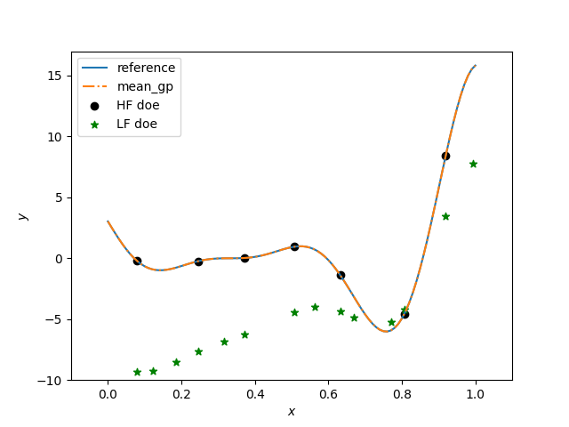

.. _mfk-ref-label:

Multi-Fidelity Kriging (MFK)
================================

MFK is a multi-fidelity modeling method which uses an autoregressive model of order 1 (AR1).

.. math ::
        y_\text{high}({\bf x})=\rho(x) \cdot y_\text{low}({\bf x}) + \delta({\bf x})

where :math:`\rho(x)`
is a scaling/correlation factor (constant, linear or quadratic) and :math:`\delta(\cdot)` is a discrepancy function.

The additive AR1 formulation was first introduced by Kennedy and O'Hagan [1]_.
The implementation here follows the one proposed by Le Gratiet [2]_. It offers the advantage of being recursive, easily extended to :math:`n` levels of fidelity and offers better scaling for high numbers of samples.
This method only uses nested sampling training points as described by Le Gratiet [2]_.

References
----------
.. [1] Kennedy, M.C. and O'Hagan, A., Bayesian calibration of computer models. Journal of the Royal Statistical Society. 2001
.. [2] Le Gratiet, L., Multi-fidelity Gaussian process regression for computer experiments. PhD Thesis. 2013

Usage
-----

.. code-block:: python

  import numpy as np
  import matplotlib.pyplot as plt
  from smt.applications.mfk import MFK, NestedLHS
  
  # low fidelity model
  def lf_function(x):
      import numpy as np
  
      return (
          0.5 * ((x * 6 - 2) ** 2) * np.sin((x * 6 - 2) * 2)
          + (x - 0.5) * 10.0
          - 5
      )
  
  # high fidelity model
  def hf_function(x):
      import numpy as np
  
      return ((x * 6 - 2) ** 2) * np.sin((x * 6 - 2) * 2)
  
  # Problem set up
  xlimits = np.array([[0.0, 1.0]])
  xdoes = NestedLHS(nlevel=2, xlimits=xlimits)
  xt_c, xt_e = xdoes(7)
  
  # Evaluate the HF and LF functions
  yt_e = hf_function(xt_e)
  yt_c = lf_function(xt_c)
  
  sm = MFK(theta0=xt_e.shape[1] * [1.0])
  
  # low-fidelity dataset names being integers from 0 to level-1
  sm.set_training_values(xt_c, yt_c, name=0)
  # high-fidelity dataset without name
  sm.set_training_values(xt_e, yt_e)
  
  # train the model
  sm.train()
  
  x = np.linspace(0, 1, 101, endpoint=True).reshape(-1, 1)
  
  # query the outputs
  y = sm.predict_values(x)
  mse = sm.predict_variances(x)
  derivs = sm.predict_derivatives(x, kx=0)
  
  plt.figure()
  
  plt.plot(x, hf_function(x), label="reference")
  plt.plot(x, y, linestyle="-.", label="mean_gp")
  plt.scatter(xt_e, yt_e, marker="o", color="k", label="HF doe")
  plt.scatter(xt_c, yt_c, marker="*", color="g", label="LF doe")
  
  plt.legend(loc=0)
  plt.ylim(-10, 17)
  plt.xlim(-0.1, 1.1)
  plt.xlabel(r"$x$")
  plt.ylabel(r"$y$")
  
  plt.show()
  
::

  ___________________________________________________________________________
     
                                      MFK
  ___________________________________________________________________________
     
   Problem size
     
        # training points.        : 7
     
  ___________________________________________________________________________
     
   Training
     
     Training ...
     Training - done. Time (sec):  0.0100002
  ___________________________________________________________________________
     
   Evaluation
     
        # eval points. : 101
     
     Predicting ...
     Predicting - done. Time (sec):  0.0000000
     
     Prediction time/pt. (sec) :  0.0000000
     
  ___________________________________________________________________________
     
   Evaluation
     
        # eval points. : 101
     
     Predicting ...
     Predicting - done. Time (sec):  0.0000000
     
     Prediction time/pt. (sec) :  0.0000000
     
  

Options
-------

.. list-table:: List of options
  :header-rows: 1
  :widths: 15, 10, 20, 20, 30
  :stub-columns: 0

  *  -  Option
     -  Default
     -  Acceptable values
     -  Acceptable types
     -  Description
  *  -  print_global
     -  True
     -  None
     -  ['bool']
     -  Global print toggle. If False, all printing is suppressed
  *  -  print_training
     -  True
     -  None
     -  ['bool']
     -  Whether to print training information
  *  -  print_prediction
     -  True
     -  None
     -  ['bool']
     -  Whether to print prediction information
  *  -  print_problem
     -  True
     -  None
     -  ['bool']
     -  Whether to print problem information
  *  -  print_solver
     -  True
     -  None
     -  ['bool']
     -  Whether to print solver information
  *  -  poly
     -  constant
     -  ['constant', 'linear', 'quadratic']
     -  ['str']
     -  Regression function type
  *  -  corr
     -  squar_exp
     -  ['abs_exp', 'squar_exp', 'act_exp', 'matern52', 'matern32']
     -  ['str']
     -  Correlation function type
  *  -  theta0
     -  [0.01]
     -  None
     -  ['list', 'ndarray']
     -  Initial hyperparameters
  *  -  hyper_opt
     -  Cobyla
     -  ['Cobyla', 'TNC']
     -  ['str']
     -  Optimiser for hyperparameters optimisation
  *  -  eval_noise
     -  False
     -  [True, False]
     -  ['bool']
     -  noise evaluation flag
  *  -  noise0
     -  1e-06
     -  None
     -  ['float', 'list']
     -  Initial noise hyperparameters
  *  -  rho_regr
     -  constant
     -  ['constant', 'linear', 'quadratic']
     -  None
     -  Regression function type for rho
  *  -  optim_var
     -  False
     -  [True, False]
     -  ['bool']
     -  Turning this option to True, forces variance to zero at HF samples 
