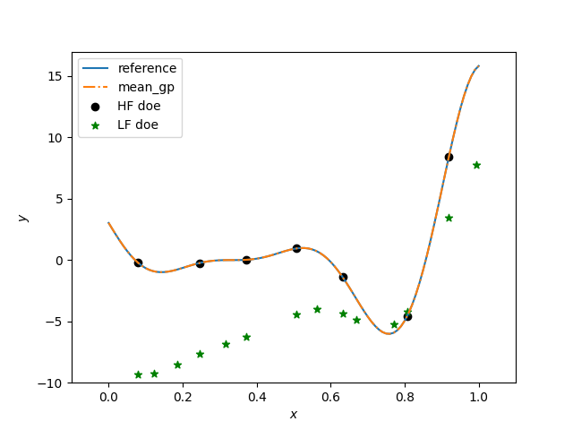

Multi-Fidelity Kriging KPLSK (MFKPLSK)
======================================

Partial Least Squares (PLS) is a statistical method to analyze the variations of a quantity of
interest w.r.t underlying variables. PLS method gives directions (principal compoenents) that
maximize the variation of the quantity of interest.

These principal components define rotations that can be applied to define bases changes.
The principal components can be truncated at any number (called n_comp) to explain a
’majority’ of the data variations.
[1]_ used the PLS to define subspaces to make high-dimensional Kriging
more efficient. 

We apply the same idea to :ref:`mfk-ref-label`. The only difference is that we do
not apply the PLS analysis step on all datasets. We apply the PLS analysis step on the
high-fidelity to preserve the robustness to poor correlations between fidelity levels.
A hyperparameter optimization is then performed in the subspace that maximizes the
variations of HF data.

MFKPLSK is a combination of :ref:`mfk-ref-label` and :ref:`kplsk-ref-label` techniques.

References
----------
.. [1] Bouhlel, M. A., Bartoli, N., Otsmane, A., & Morlier, J. (2016). An improved approach for estimating the hyperparameters of the kriging model for high-dimensional problems through the partial least squares method. Mathematical Problems in Engineering, 2016.

Usage
-----

.. code-block:: python

  import numpy as np
  import matplotlib.pyplot as plt
  from smt.applications.mfk import MFK, NestedLHS
  from smt.applications.mfkplsk import MFKPLSK
  
  # low fidelity modelk
  def lf_function(x):
      import numpy as np
  
      return (
          0.5 * ((x * 6 - 2) ** 2) * np.sin((x * 6 - 2) * 2)
          + (x - 0.5) * 10.0
          - 5
      )
  
  # high fidelity model
  def hf_function(x):
      import numpy as np
  
      return ((x * 6 - 2) ** 2) * np.sin((x * 6 - 2) * 2)
  
  # Problem set up
  xlimits = np.array([[0.0, 1.0]])
  xdoes = NestedLHS(nlevel=2, xlimits=xlimits)
  xt_c, xt_e = xdoes(7)
  
  # Evaluate the HF and LF functions
  yt_e = hf_function(xt_e)
  yt_c = lf_function(xt_c)
  
  # choice of number of PLS components
  ncomp = 1
  sm = MFKPLSK(n_comp=ncomp, theta0=np.array(ncomp * [1.0]))
  
  # low-fidelity dataset names being integers from 0 to level-1
  sm.set_training_values(xt_c, yt_c, name=0)
  # high-fidelity dataset without name
  sm.set_training_values(xt_e, yt_e)
  
  # train the model
  sm.train()
  
  x = np.linspace(0, 1, 101, endpoint=True).reshape(-1, 1)
  
  # query the outputs
  y = sm.predict_values(x)
  mse = sm.predict_variances(x)
  derivs = sm.predict_derivatives(x, kx=0)
  
  plt.figure()
  
  plt.plot(x, hf_function(x), label="reference")
  plt.plot(x, y, linestyle="-.", label="mean_gp")
  plt.scatter(xt_e, yt_e, marker="o", color="k", label="HF doe")
  plt.scatter(xt_c, yt_c, marker="*", color="g", label="LF doe")
  
  plt.legend(loc=0)
  plt.ylim(-10, 17)
  plt.xlim(-0.1, 1.1)
  plt.xlabel(r"$x$")
  plt.ylabel(r"$y$")
  
  plt.show()
  
::

  ___________________________________________________________________________
     
                                    MFKPLSK
  ___________________________________________________________________________
     
   Problem size
     
        # training points.        : 7
     
  ___________________________________________________________________________
     
   Training
     
     Training ...
     Training - done. Time (sec):  0.0100000
  ___________________________________________________________________________
     
   Evaluation
     
        # eval points. : 101
     
     Predicting ...
     Predicting - done. Time (sec):  0.0000000
     
     Prediction time/pt. (sec) :  0.0000000
     
  ___________________________________________________________________________
     
   Evaluation
     
        # eval points. : 101
     
     Predicting ...
     Predicting - done. Time (sec):  0.0100000
     
     Prediction time/pt. (sec) :  0.0000990
     
  

Options
-------

.. list-table:: List of options
  :header-rows: 1
  :widths: 15, 10, 20, 20, 30
  :stub-columns: 0

  *  -  Option
     -  Default
     -  Acceptable values
     -  Acceptable types
     -  Description
  *  -  print_global
     -  True
     -  None
     -  ['bool']
     -  Global print toggle. If False, all printing is suppressed
  *  -  print_training
     -  True
     -  None
     -  ['bool']
     -  Whether to print training information
  *  -  print_prediction
     -  True
     -  None
     -  ['bool']
     -  Whether to print prediction information
  *  -  print_problem
     -  True
     -  None
     -  ['bool']
     -  Whether to print problem information
  *  -  print_solver
     -  True
     -  None
     -  ['bool']
     -  Whether to print solver information
  *  -  poly
     -  constant
     -  ['constant', 'linear', 'quadratic']
     -  ['str']
     -  Regression function type
  *  -  corr
     -  squar_exp
     -  ['abs_exp', 'squar_exp', 'act_exp', 'matern52', 'matern32']
     -  ['str']
     -  Correlation function type
  *  -  theta0
     -  None
     -  None
     -  ['list', 'ndarray']
     -  Initial hyperparameters
  *  -  hyper_opt
     -  Cobyla
     -  ['Cobyla', 'TNC']
     -  ['str']
     -  Optimiser for hyperparameters optimisation
  *  -  eval_noise
     -  False
     -  [True, False]
     -  ['bool']
     -  noise evaluation flag
  *  -  noise0
     -  1e-06
     -  None
     -  ['float']
     -  Initial noise hyperparameter
  *  -  n_comp
     -  1
     -  None
     -  ['int']
     -  Number of principal components
  *  -  rho_regr
     -  constant
     -  ['constant', 'linear', 'quadratic']
     -  None
     -  Regression function type for rho
  *  -  optim_var
     -  False
     -  [True, False]
     -  ['bool']
     -  Turning this option to True, forces variance to zero at HF samples 
