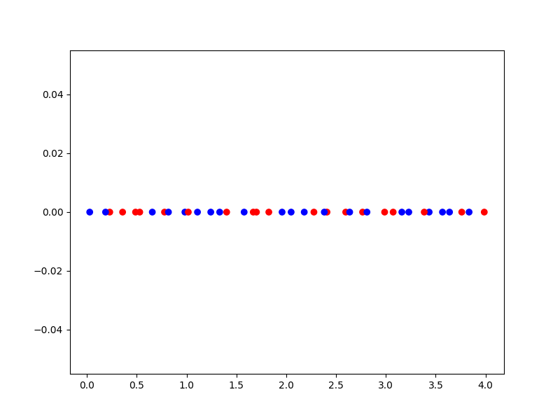
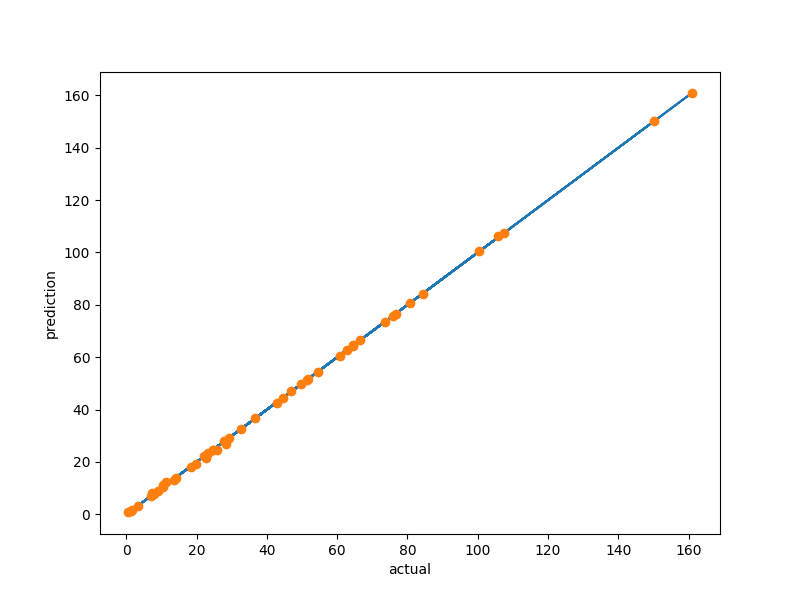
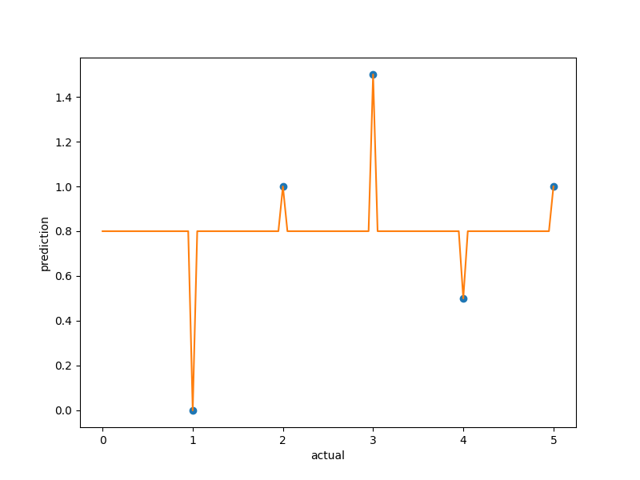
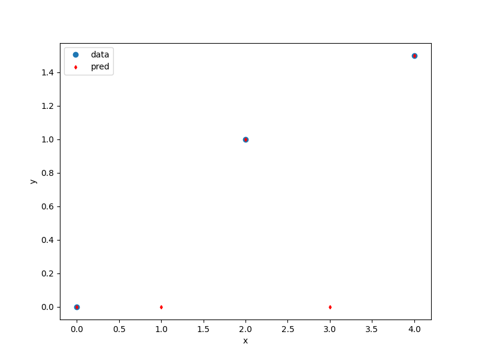

.. _Mixed-Integer Sampling and and Variables Types Specifications: 

Mixed-Integer usage (Variables, Sampling and Context)
=====================================================

SMT provides the ``mixed_integer`` module to adapt existing surrogates to deal with categorical (or enumerate) and ordered variables using continuous relaxation.
For ordered variables, the values are rounded to the nearest values from a provided list. If, instead, bounds are provided, the list will consist of all integers between those bounds.

The user specifies x feature types through a list of types to be either:

- ``FLOAT``: a continuous feature,
- ``ORD``: an ordered valued feature,
- or a tuple ``(ENUM, n)`` where n is the number of levels of the catagorical feature (i.e. an enumerate with n values)

In the case of mixed integer sampling, bounds of each x feature have to be adapted to take into account feature types. While ``FLOAT`` and ``ORD`` feature still have an interval [lower bound, upper bound], the ``ENUM`` features bounds is defined by giving the enumeration/list of possible values (levels). 

For instance, if we have the following ``xtypes``: ``[FLOAT, ORD, (ENUM, 2), (ENUM, 3)]``, a compatible ``xlimits`` could be ``[[0., 4], [-10, 10], ["blue", "red"], ["short", "medium",  "long"]]``.

However, the functioning of ``ORD`` is twofold. As previously mentioned, it can be used like [lower bound, upper bound], in this case [0,5] will corresponds to [0,1,2,3,4,5]. But, on the other hand, ``ORD`` can be used as an enumeration/list of possible values (levels), in this case ["0","5","6"] will corresponds to [0,5,6].

Mixed integer sampling method
-----------------------------

To use a sampling method with mixed integer typed features, the user instanciates a ``MixedIntegerSamplingMethod`` with a given sampling method.
The ``MixedIntegerSamplingMethod`` implements the ``SamplingMethod`` interface and decorates the original sampling method to provide a DOE while conforming to integer and categorical types.

Example of mixed-integer LHS sampling method
^^^^^^^^^^^^^^^^^^^^^^^^^^^^^^^^^^^^^^^^^^^^

.. code-block:: python

  import numpy as np
  import matplotlib.pyplot as plt
  from matplotlib import colors
  
  from smt.sampling_methods import LHS
  from smt.applications.mixed_integer import (
      FLOAT,
      ORD,
      ENUM,
      MixedIntegerSamplingMethod,
  )
  
  xtypes = [FLOAT, (ENUM, 2)]
  xlimits = [[0.0, 4.0], ["blue", "red"]]
  sampling = MixedIntegerSamplingMethod(xtypes, xlimits, LHS, criterion="ese")
  
  num = 40
  x = sampling(num)
  
  cmap = colors.ListedColormap(xlimits[1])
  plt.scatter(x[:, 0], np.zeros(num), c=x[:, 1], cmap=cmap)
  plt.show()
  

Mixed integer context
---------------------

the ``MixedIntegerContext`` class helps the user to use mixed integer sampling methods and surrogate models consistently by acting as a factory for those objects given a x specification: (xtypes, xlimits). 

  .. autoclass:: smt.applications.mixed_integer.MixedIntegerContext

  .. automethod:: smt.applications.mixed_integer.MixedIntegerContext.__init__

  .. automethod:: smt.applications.mixed_integer.MixedIntegerContext.build_sampling_method

  .. automethod:: smt.applications.mixed_integer.MixedIntegerContext.build_surrogate_model

  .. automethod:: smt.applications.mixed_integer.MixedIntegerContext.cast_to_discrete_values

  .. automethod:: smt.applications.mixed_integer.MixedIntegerContext.fold_with_enum_index

  .. automethod:: smt.applications.mixed_integer.MixedIntegerContext.unfold_with_enum_mask

  .. automethod:: smt.applications.mixed_integer.MixedIntegerContext.cast_to_mixed_integer

  .. automethod:: smt.applications.mixed_integer.MixedIntegerContext.cast_to_enum_value

Example of mixed-integer context usage
^^^^^^^^^^^^^^^^^^^^^^^^^^^^^^^^^^^^^^

.. code-block:: python

  import numpy as np
  import matplotlib.pyplot as plt
  from matplotlib import colors
  from mpl_toolkits.mplot3d import Axes3D
  
  from smt.surrogate_models import KRG
  from smt.sampling_methods import LHS, Random
  from smt.applications.mixed_integer import MixedIntegerContext, FLOAT, ORD, ENUM
  
  xtypes = [ORD, FLOAT, (ENUM, 4)]
  xlimits = [[0, 5], [0.0, 4.0], ["blue", "red", "green", "yellow"]]
  
  def ftest(x):
      return (x[:, 0] * x[:, 0] + x[:, 1] * x[:, 1]) * (x[:, 2] + 1)
  
  # context to create consistent DOEs and surrogate
  mixint = MixedIntegerContext(xtypes, xlimits)
  
  # DOE for training
  lhs = mixint.build_sampling_method(LHS, criterion="ese")
  
  num = mixint.get_unfolded_dimension() * 5
  print("DOE point nb = {}".format(num))
  xt = lhs(num)
  yt = ftest(xt)
  
  # Surrogate
  sm = mixint.build_surrogate_model(KRG())
  sm.set_training_values(xt, yt)
  sm.train()
  
  # DOE for validation
  rand = mixint.build_sampling_method(Random)
  xv = rand(50)
  yv = ftest(xv)
  yp = sm.predict_values(xv)
  
  plt.plot(yv, yv)
  plt.plot(yv, yp, "o")
  plt.xlabel("actual")
  plt.ylabel("prediction")
  
  plt.show()
  
::

  DOE point nb = 30
  ___________________________________________________________________________
     
   Evaluation
     
        # eval points. : 50
     
     Predicting ...
     Predicting - done. Time (sec):  0.0000000
     
     Prediction time/pt. (sec) :  0.0000000
     
  

.. _Mixed-Integer Surrogates:

Mixed integer surrogate
=======================

To use a surrogate with mixed integer constraints, the user instanciates a ``MixedIntegerSurrogateModel`` with the given surrogate.
The ``MixedIntegerSurrogateModel`` implements the ``SurrogateModel`` interface  and decorates the given surrogate while respecting integer and categorical types.
They are various surrogate models implemented that are described below.

Mixed-Integer Surrogate with Continuous Relaxation
--------------------------------------------------

For enum variables, as many x features are added as there is enumerated levels for the variables. These new dimensions have [0, 1] bounds and the max of these feature float values will correspond to the choice of one the enum value: this is the so-called "one-hot encoding".
For instance, for a categorical variable (one feature of x) with three levels ["blue", "red", "green"], 3 continuous float features x0, x1, x2 are created. Thereafter, the value max(x0, x1, x2), for instance, x1, will give "red" as the value for the original categorical feature. Details can be found in [1]_ .

Example of mixed-integer Polynomial (QP) surrogate
^^^^^^^^^^^^^^^^^^^^^^^^^^^^^^^^^^^^^^^^^^^^^^^^^^

.. code-block:: python

  import numpy as np
  import matplotlib.pyplot as plt
  
  from smt.surrogate_models import QP
  from smt.applications.mixed_integer import MixedIntegerSurrogateModel, ORD
  
  xt = np.array([0.0, 1.0, 2.0, 3.0, 4.0])
  yt = np.array([0.0, 1.0, 1.5, 0.5, 1.0])
  
  # xtypes = [FLOAT, ORD, (ENUM, 3), (ENUM, 2)]
  # FLOAT means x1 continuous
  # ORD means x2 ordered
  # (ENUM, 3) means x3, x4 & x5 are 3 levels of the same categorical variable
  # (ENUM, 2) means x6 & x7 are 2 levels of the same categorical variable
  
  sm = MixedIntegerSurrogateModel(xtypes=[ORD], xlimits=[[0, 4]], surrogate=QP())
  sm.set_training_values(xt, yt)
  sm.train()
  
  num = 100
  x = np.linspace(0.0, 4.0, num)
  y = sm.predict_values(x)
  
  plt.plot(xt, yt, "o")
  plt.plot(x, y)
  plt.xlabel("x")
  plt.ylabel("y")
  plt.legend(["Training data", "Prediction"])
  plt.show()
  
::

  ___________________________________________________________________________
     
   Evaluation
     
        # eval points. : 100
     
     Predicting ...
     Predicting - done. Time (sec):  0.0000000
     
     Prediction time/pt. (sec) :  0.0000000
     
  

Mixed-Integer Surrogate with Gower Distance
-------------------------------------------

Another implemented method is using a basic mixed integer kernel based on the Gower distance between two points.
When constructing the correlation kernel, the distance is redefined as :math:`\Delta= \Delta_{cont} + \Delta_{cat}`, with :math:`\Delta_{cont}` the continuous distance as usual and :math:`\Delta_ {cat}` the categorical distance defined as the number of categorical variables that differs from one point to another.

For example, the Gower Distance between ``[1,'red', 'medium']`` and ``[1.2,'red', 'large']`` is :math:`\Delta= 0.2+ (0` ``'red'`` :math:`=` ``'red'`` :math:`+ 1` ``'medium'`` :math:`\neq` ``'large'``  ) :math:`=1.2`.
With this distance, a mixed integer kernel can be build. Details can be found in [1]_ .

Example of mixed-integer Gower Distance model
^^^^^^^^^^^^^^^^^^^^^^^^^^^^^^^^^^^^^^^^^^^^^

.. code-block:: python

  import numpy as np
  import matplotlib.pyplot as plt
  
  from smt.surrogate_models import KRG, KPLS
  from smt.applications.mixed_integer import (
      MixedIntegerSurrogateModel,
      ENUM,
      ORD,
      FLOAT,
      GOWER_KERNEL,
  )
  
  xt1 = np.array([[0, 0.0], [0, 2.0], [0, 4.0]])
  xt2 = np.array([[1, 0.0], [1, 2.0], [1, 3.0]])
  xt3 = np.array([[2, 1.0], [2, 2.0], [2, 4.0]])
  
  xt = np.concatenate((xt1, xt2, xt3), axis=0)
  xt[:, 1] = xt[:, 1].astype(np.float)
  yt1 = np.array([0.0, 9.0, 16.0])
  yt2 = np.array([0.0, -4, -13.0])
  yt3 = np.array([-10, 3, 11.0])
  
  yt = np.concatenate((yt1, yt2, yt3), axis=0)
  xlimits = [["Blue", "Red", "Green"], [0.0, 4.0]]
  xtypes = [(ENUM, 3), FLOAT]
  # Surrogate
  sm = MixedIntegerSurrogateModel(
      categorical_kernel=GOWER_KERNEL,
      xtypes=xtypes,
      xlimits=xlimits,
      surrogate=KRG(theta0=[1e-1], corr="squar_exp", n_start=20),
  )
  sm.set_training_values(xt, yt)
  sm.train()
  
  # DOE for validation
  n = 100
  x_cat1 = []
  x_cat2 = []
  x_cat3 = []
  
  for i in range(n):
      x_cat1.append(0)
      x_cat2.append(1)
      x_cat3.append(2)
  
  x_cont = np.linspace(0.0, 4.0, n)
  x1 = np.concatenate(
      (np.asarray(x_cat1).reshape(-1, 1), x_cont.reshape(-1, 1)), axis=1
  )
  x2 = np.concatenate(
      (np.asarray(x_cat2).reshape(-1, 1), x_cont.reshape(-1, 1)), axis=1
  )
  x3 = np.concatenate(
      (np.asarray(x_cat3).reshape(-1, 1), x_cont.reshape(-1, 1)), axis=1
  )
  
  y1 = sm.predict_values(x1)
  y2 = sm.predict_values(x2)
  y3 = sm.predict_values(x3)
  
  # estimated variance
  s2_1 = sm.predict_variances(x1)
  s2_2 = sm.predict_variances(x2)
  s2_3 = sm.predict_variances(x3)
  
  fig, axs = plt.subplots(3, figsize=(8, 6))
  
  axs[0].plot(xt1[:, 1].astype(np.float), yt1, "o", linestyle="None")
  axs[0].plot(x_cont, y1, color="Blue")
  axs[0].fill_between(
      np.ravel(x_cont),
      np.ravel(y1 - 3 * np.sqrt(s2_1)),
      np.ravel(y1 + 3 * np.sqrt(s2_1)),
      color="lightgrey",
  )
  axs[0].set_xlabel("x")
  axs[0].set_ylabel("y")
  axs[0].legend(
      ["Training data", "Prediction", "Confidence Interval 99%"],
      loc="upper left",
      bbox_to_anchor=[0, 1],
  )
  axs[1].plot(
      xt2[:, 1].astype(np.float), yt2, marker="o", color="r", linestyle="None"
  )
  axs[1].plot(x_cont, y2, color="Red")
  axs[1].fill_between(
      np.ravel(x_cont),
      np.ravel(y2 - 3 * np.sqrt(s2_2)),
      np.ravel(y2 + 3 * np.sqrt(s2_2)),
      color="lightgrey",
  )
  axs[1].set_xlabel("x")
  axs[1].set_ylabel("y")
  axs[1].legend(
      ["Training data", "Prediction", "Confidence Interval 99%"],
      loc="upper left",
      bbox_to_anchor=[0, 1],
  )
  axs[2].plot(
      xt3[:, 1].astype(np.float), yt3, marker="o", color="r", linestyle="None"
  )
  axs[2].plot(x_cont, y3, color="Green")
  axs[2].fill_between(
      np.ravel(x_cont),
      np.ravel(y3 - 3 * np.sqrt(s2_3)),
      np.ravel(y3 + 3 * np.sqrt(s2_3)),
      color="lightgrey",
  )
  axs[2].set_xlabel("x")
  axs[2].set_ylabel("y")
  axs[2].legend(
      ["Training data", "Prediction", "Confidence Interval 99%"],
      loc="upper left",
      bbox_to_anchor=[0, 1],
  )
  plt.tight_layout()
  plt.show()
  
::

  ___________________________________________________________________________
     
   Evaluation
     
        # eval points. : 100
     
     Predicting ...
     Predicting - done. Time (sec):  0.0059862
     
     Prediction time/pt. (sec) :  0.0000599
     
  ___________________________________________________________________________
     
   Evaluation
     
        # eval points. : 100
     
     Predicting ...
     Predicting - done. Time (sec):  0.0049839
     
     Prediction time/pt. (sec) :  0.0000498
     
  ___________________________________________________________________________
     
   Evaluation
     
        # eval points. : 100
     
     Predicting ...
     Predicting - done. Time (sec):  0.0049872
     
     Prediction time/pt. (sec) :  0.0000499
     
  

Mixed-Integer Surrogate with Group Kernel (Homoscedastic Hypersphere)
---------------------------------------------------------------------

This surrogate model consider that the correlation kernel between the levels of a given variable is a symmetric positive definite matrix. The latter matrix is estimated through an hypersphere parametrization depending on several hyperparameters. To finish with, the data correlation matrix is build as the product of the correlation matrices over the various variables. Details can be found in [1]_ . Note that this model is the only one to consider negative correlations between levels ("blue" can be correlated negatively to "red").

Example of mixed-integer Homoscedastic Hypersphere model
^^^^^^^^^^^^^^^^^^^^^^^^^^^^^^^^^^^^^^^^^^^^^^^^^^^^^^^

.. code-block:: python

  import numpy as np
  import matplotlib.pyplot as plt
  
  from smt.surrogate_models import KRG, KPLS
  from smt.applications.mixed_integer import (
      MixedIntegerSurrogateModel,
      ENUM,
      ORD,
      FLOAT,
      HOMO_HSPHERE_KERNEL,
  )
  
  xt1 = np.array([[0, 0.0], [0, 2.0], [0, 4.0]])
  xt2 = np.array([[1, 0.0], [1, 2.0], [1, 3.0]])
  xt3 = np.array([[2, 1.0], [2, 2.0], [2, 4.0]])
  
  xt = np.concatenate((xt1, xt2, xt3), axis=0)
  xt[:, 1] = xt[:, 1].astype(np.float)
  yt1 = np.array([0.0, 9.0, 16.0])
  yt2 = np.array([0.0, -4, -13.0])
  yt3 = np.array([-10, 3, 11.0])
  
  yt = np.concatenate((yt1, yt2, yt3), axis=0)
  xlimits = [["Blue", "Red", "Green"], [0.0, 4.0]]
  xtypes = [(ENUM, 3), FLOAT]
  # Surrogate
  sm = MixedIntegerSurrogateModel(
      categorical_kernel=HOMO_HSPHERE_KERNEL,
      xtypes=xtypes,
      xlimits=xlimits,
      surrogate=KRG(theta0=[1e-1], corr="squar_exp", n_start=20),
  )
  sm.set_training_values(xt, yt)
  sm.train()
  
  # DOE for validation
  n = 100
  x_cat1 = []
  x_cat2 = []
  x_cat3 = []
  
  for i in range(n):
      x_cat1.append(0)
      x_cat2.append(1)
      x_cat3.append(2)
  
  x_cont = np.linspace(0.0, 4.0, n)
  x1 = np.concatenate(
      (np.asarray(x_cat1).reshape(-1, 1), x_cont.reshape(-1, 1)), axis=1
  )
  x2 = np.concatenate(
      (np.asarray(x_cat2).reshape(-1, 1), x_cont.reshape(-1, 1)), axis=1
  )
  x3 = np.concatenate(
      (np.asarray(x_cat3).reshape(-1, 1), x_cont.reshape(-1, 1)), axis=1
  )
  
  y1 = sm.predict_values(x1)
  y2 = sm.predict_values(x2)
  y3 = sm.predict_values(x3)
  
  # estimated variance
  s2_1 = sm.predict_variances(x1)
  s2_2 = sm.predict_variances(x2)
  s2_3 = sm.predict_variances(x3)
  
  fig, axs = plt.subplots(3, figsize=(8, 6))
  
  axs[0].plot(xt1[:, 1].astype(np.float), yt1, "o", linestyle="None")
  axs[0].plot(x_cont, y1, color="Blue")
  axs[0].fill_between(
      np.ravel(x_cont),
      np.ravel(y1 - 3 * np.sqrt(s2_1)),
      np.ravel(y1 + 3 * np.sqrt(s2_1)),
      color="lightgrey",
  )
  axs[0].set_xlabel("x")
  axs[0].set_ylabel("y")
  axs[0].legend(
      ["Training data", "Prediction", "Confidence Interval 99%"],
      loc="upper left",
      bbox_to_anchor=[0, 1],
  )
  axs[1].plot(
      xt2[:, 1].astype(np.float), yt2, marker="o", color="r", linestyle="None"
  )
  axs[1].plot(x_cont, y2, color="Red")
  axs[1].fill_between(
      np.ravel(x_cont),
      np.ravel(y2 - 3 * np.sqrt(s2_2)),
      np.ravel(y2 + 3 * np.sqrt(s2_2)),
      color="lightgrey",
  )
  axs[1].set_xlabel("x")
  axs[1].set_ylabel("y")
  axs[1].legend(
      ["Training data", "Prediction", "Confidence Interval 99%"],
      loc="upper left",
      bbox_to_anchor=[0, 1],
  )
  axs[2].plot(
      xt3[:, 1].astype(np.float), yt3, marker="o", color="r", linestyle="None"
  )
  axs[2].plot(x_cont, y3, color="Green")
  axs[2].fill_between(
      np.ravel(x_cont),
      np.ravel(y3 - 3 * np.sqrt(s2_3)),
      np.ravel(y3 + 3 * np.sqrt(s2_3)),
      color="lightgrey",
  )
  axs[2].set_xlabel("x")
  axs[2].set_ylabel("y")
  axs[2].legend(
      ["Training data", "Prediction", "Confidence Interval 99%"],
      loc="upper left",
      bbox_to_anchor=[0, 1],
  )
  plt.tight_layout()
  plt.show()
  
::

  ___________________________________________________________________________
     
   Evaluation
     
        # eval points. : 100
     
     Predicting ...
     Predicting - done. Time (sec):  0.0069799
     
     Prediction time/pt. (sec) :  0.0000698
     
  ___________________________________________________________________________
     
   Evaluation
     
        # eval points. : 100
     
     Predicting ...
     Predicting - done. Time (sec):  0.0059888
     
     Prediction time/pt. (sec) :  0.0000599
     
  ___________________________________________________________________________
     
   Evaluation
     
        # eval points. : 100
     
     Predicting ...
     Predicting - done. Time (sec):  0.0069888
     
     Prediction time/pt. (sec) :  0.0000699
     
  

 	

Mixed-Integer Surrogate with Exponential Homoscedastic Hypersphere
------------------------------------------------------------------

This surrogate model also consider that the correlation kernel between the levels of a given variable is a symmetric positive definite matrix. The latter matrix is estimated through an hypersphere parametrization depending on several hyperparameters. Thereafter, an exponential kernel is applied to the matrix. To finish with, the data correlation matrix is build as the product of the correlation matrices over the various variables. Therefore, this model could not model negative correlation and only works with absolute exponential and Gaussian kernels. Details can be found in [1]_ .

Example of mixed-integer Exponential Homoscedastic Hypersphere model
^^^^^^^^^^^^^^^^^^^^^^^^^^^^^^^^^^^^^^^^^^^^^^^^^^^^^^^^^^^^^^^^^^^^

.. code-block:: python

  import numpy as np
  import matplotlib.pyplot as plt
  
  from smt.surrogate_models import KRG, KPLS
  from smt.applications.mixed_integer import (
      MixedIntegerSurrogateModel,
      ENUM,
      ORD,
      FLOAT,
      EXP_HOMO_HSPHERE_KERNEL,
  )
  
  xt1 = np.array([[0, 0.0], [0, 2.0], [0, 4.0]])
  xt2 = np.array([[1, 0.0], [1, 2.0], [1, 3.0]])
  xt3 = np.array([[2, 1.0], [2, 2.0], [2, 4.0]])
  
  xt = np.concatenate((xt1, xt2, xt3), axis=0)
  xt[:, 1] = xt[:, 1].astype(np.float)
  yt1 = np.array([0.0, 9.0, 16.0])
  yt2 = np.array([0.0, -4, -13.0])
  yt3 = np.array([-10, 3, 11.0])
  
  yt = np.concatenate((yt1, yt2, yt3), axis=0)
  xlimits = [["Blue", "Red", "Green"], [0.0, 4.0]]
  xtypes = [(ENUM, 3), FLOAT]
  # Surrogate
  sm = MixedIntegerSurrogateModel(
      categorical_kernel=EXP_HOMO_HSPHERE_KERNEL,
      xtypes=xtypes,
      xlimits=xlimits,
      surrogate=KRG(theta0=[1e-1], corr="squar_exp", n_start=20),
  )
  sm.set_training_values(xt, yt)
  sm.train()
  
  # DOE for validation
  n = 100
  x_cat1 = []
  x_cat2 = []
  x_cat3 = []
  
  for i in range(n):
      x_cat1.append(0)
      x_cat2.append(1)
      x_cat3.append(2)
  
  x_cont = np.linspace(0.0, 4.0, n)
  x1 = np.concatenate(
      (np.asarray(x_cat1).reshape(-1, 1), x_cont.reshape(-1, 1)), axis=1
  )
  x2 = np.concatenate(
      (np.asarray(x_cat2).reshape(-1, 1), x_cont.reshape(-1, 1)), axis=1
  )
  x3 = np.concatenate(
      (np.asarray(x_cat3).reshape(-1, 1), x_cont.reshape(-1, 1)), axis=1
  )
  
  y1 = sm.predict_values(x1)
  y2 = sm.predict_values(x2)
  y3 = sm.predict_values(x3)
  
  # estimated variance
  s2_1 = sm.predict_variances(x1)
  s2_2 = sm.predict_variances(x2)
  s2_3 = sm.predict_variances(x3)
  
  fig, axs = plt.subplots(3, figsize=(8, 6))
  
  axs[0].plot(xt1[:, 1].astype(np.float), yt1, "o", linestyle="None")
  axs[0].plot(x_cont, y1, color="Blue")
  axs[0].fill_between(
      np.ravel(x_cont),
      np.ravel(y1 - 3 * np.sqrt(s2_1)),
      np.ravel(y1 + 3 * np.sqrt(s2_1)),
      color="lightgrey",
  )
  axs[0].set_xlabel("x")
  axs[0].set_ylabel("y")
  axs[0].legend(
      ["Training data", "Prediction", "Confidence Interval 99%"],
      loc="upper left",
      bbox_to_anchor=[0, 1],
  )
  axs[1].plot(
      xt2[:, 1].astype(np.float), yt2, marker="o", color="r", linestyle="None"
  )
  axs[1].plot(x_cont, y2, color="Red")
  axs[1].fill_between(
      np.ravel(x_cont),
      np.ravel(y2 - 3 * np.sqrt(s2_2)),
      np.ravel(y2 + 3 * np.sqrt(s2_2)),
      color="lightgrey",
  )
  axs[1].set_xlabel("x")
  axs[1].set_ylabel("y")
  axs[1].legend(
      ["Training data", "Prediction", "Confidence Interval 99%"],
      loc="upper left",
      bbox_to_anchor=[0, 1],
  )
  axs[2].plot(
      xt3[:, 1].astype(np.float), yt3, marker="o", color="r", linestyle="None"
  )
  axs[2].plot(x_cont, y3, color="Green")
  axs[2].fill_between(
      np.ravel(x_cont),
      np.ravel(y3 - 3 * np.sqrt(s2_3)),
      np.ravel(y3 + 3 * np.sqrt(s2_3)),
      color="lightgrey",
  )
  axs[2].set_xlabel("x")
  axs[2].set_ylabel("y")
  axs[2].legend(
      ["Training data", "Prediction", "Confidence Interval 99%"],
      loc="upper left",
      bbox_to_anchor=[0, 1],
  )
  plt.tight_layout()
  plt.show()
  
::

  ___________________________________________________________________________
     
   Evaluation
     
        # eval points. : 100
     
     Predicting ...
     Predicting - done. Time (sec):  0.0063519
     
     Prediction time/pt. (sec) :  0.0000635
     
  ___________________________________________________________________________
     
   Evaluation
     
        # eval points. : 100
     
     Predicting ...
     Predicting - done. Time (sec):  0.0069222
     
     Prediction time/pt. (sec) :  0.0000692
     
  ___________________________________________________________________________
     
   Evaluation
     
        # eval points. : 100
     
     Predicting ...
     Predicting - done. Time (sec):  0.0060115
     
     Prediction time/pt. (sec) :  0.0000601
     
  
.. figure:: mixed_integer_TestMixedInteger_test_mixed_homo_gaussian.png
  :scale: 80	 %
  :align: center

References
----------

.. [1] Saves, P. and Diouane, Y. and Bartoli, N. and Lefebvre, T. and Morlier, J. (2022). A general square exponential kernel to handle mixed-categorical variables for Gaussian process. AIAA Aviation 2022 Forum. 
