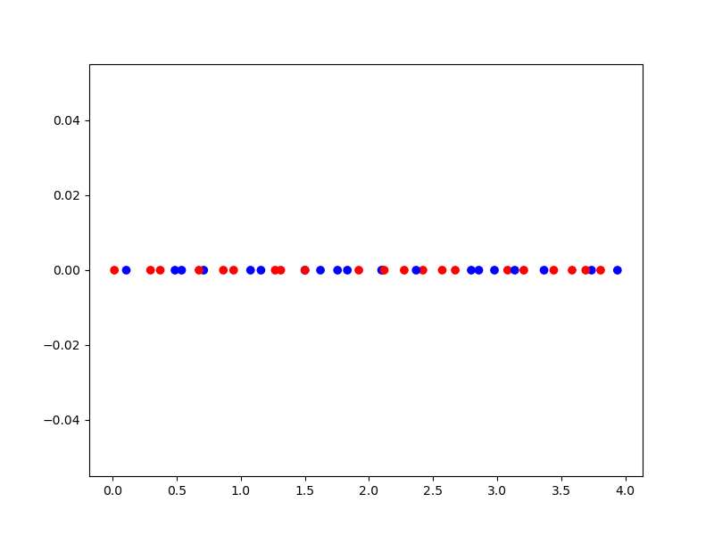

.. _Mixed-Integer Sampling and Surrogate:

Mixed-Integer Sampling and Surrogate (Continuous Relaxation)
============================================================

SMT provides the ``mixed_integer`` module to adapt existing surrogates to deal with
categorical (or enumerate) and integer variables using continuous relaxation.

For integer variables, values are rounded to the closer integer.
For enum variables, as many x features as enumerated levels are created with [0, 1] bounds 
and the max of these feature float values will correspond to the choice of one the enum value. 

For instance, for a categorical variable (one feature of x) with three levels ["blue", "red", "green"],
3 continuous float features x0, x1, x2 are created, the max(x0, x1, x2), 
let say x1, will give "red" as the value for the original categorical feature. 

The user specifies x feature types through a list of types to be either:

- ``FLOAT``: a continuous feature,
- ``INT``: an integer valued feature,
- or a tuple ``(ENUM, n)`` where n is the number of levels of the catagorical feature (i.e. an enumerate with n values)

In the case of mixed integer sampling, bounds of each x feature have to be adapted 
to take into account feature types. While FLOAT and INT feature still have an interval
[lower bound, upper bound], the ENUM features bounds is defined by giving the enumeration/list
of possible values (levels). 

For instance, if we have the following ``xtypes``: ``[FLOAT, INT, (ENUM, 2), (ENUM, 3)]``, 
a compatible ``xlimits`` could be ``[[0., 4], [-10, 10], ["blue", "red"], ["short", "medium", "long"]]``

Mixed integer sampling method
-----------------------------

To use a sampling method with mixed integer typed features, the user instanciates
a ``MixedIntegerSamplingMethod`` with a given sampling method.
The ``MixedIntegerSamplingMethod`` implements the ``SamplingMethod`` interface 
and decorates the original sampling method to provide a DOE while conforming to integer 
and categorical types.

Example of mixed-integer LHS sampling method
^^^^^^^^^^^^^^^^^^^^^^^^^^^^^^^^^^^^^^^^^^^^

.. code-block:: python

  import numpy as np
  import matplotlib.pyplot as plt
  from matplotlib import colors
  
  from smt.sampling_methods import LHS
  from smt.applications.mixed_integer import (
      FLOAT,
      INT,
      ENUM,
      MixedIntegerSamplingMethod,
  )
  
  xtypes = [(ENUM, 2), FLOAT]
  xlimits = [["blue", "red"], [0.0, 4.0]]
  sampling = MixedIntegerSamplingMethod(xtypes, xlimits, LHS, criterion="ese")
  
  num = 40
  x = sampling(num)
  
  print(x.shape)
  
  cmap = colors.ListedColormap(["blue", "red"])
  plt.scatter(x[:, 1], np.zeros(num), c=x[:, 0], cmap=cmap)
  plt.show()
  
::

  (40, 2)
  

Mixed integer surrogate
-----------------------

To use a surrogate with mixed integer constraints, the user instanciates
a ``MixedIntegerSurrogate`` with the given surrogate.
The ``MixedIntegerSurrogate`` implements the ``SurrogateModel`` interface 
and decorates the given surrogate while respecting integer and categorical types.

Example of mixed-integer Polynomial (QP) surrogate
^^^^^^^^^^^^^^^^^^^^^^^^^^^^^^^^^^^^^^^^^^^^^^^^^^

.. code-block:: python

  import numpy as np
  import matplotlib.pyplot as plt
  
  from smt.surrogate_models import QP
  from smt.applications.mixed_integer import MixedIntegerSurrogate, INT
  
  xt = np.array([0.0, 1.0, 2.0, 3.0, 4.0])
  yt = np.array([0.0, 1.0, 1.5, 0.5, 1.0])
  
  # xtypes = [FLOAT, INT, (ENUM, 3), (ENUM, 2)]
  # FLOAT means x1 continuous
  # INT means x2 integer
  # (ENUM, 3) means x3, x4 & x5 are 3 levels of the same categorical variable
  # (ENUM, 2) means x6 & x7 are 2 levels of the same categorical variable
  
  sm = MixedIntegerSurrogate(xtypes=[INT], xlimits=[[0, 4]], surrogate=QP())
  sm.set_training_values(xt, yt)
  sm.train()
  
  num = 100
  x = np.linspace(0.0, 4.0, num)
  y = sm.predict_values(x)
  
  plt.plot(xt, yt, "o")
  plt.plot(x, y)
  plt.xlabel("x")
  plt.ylabel("y")
  plt.legend(["Training data", "Prediction"])
  plt.show()
  
::

  ___________________________________________________________________________
     
   Evaluation
     
        # eval points. : 100
     
     Predicting ...
     Predicting - done. Time (sec):  0.0000000
     
     Prediction time/pt. (sec) :  0.0000000
     
  

