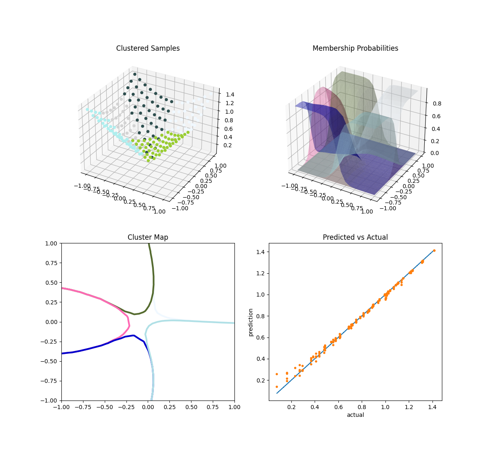

Mixture of experts (MOE)
========================

Mixture of experts aims at increasing the accuracy of a function approximation by replacing a single global model by a weighted sum of local models (experts). It is based on a partition of the problem domain into several subdomains via clustering algorithms followed by a local expert training on each subdomain.

A general introduction about the mixture of experts can be found in [1]_ and a first application with generalized linear models in [2]_.

SMT MOE combines surrogate models implemented in SMT to build a new surrogate model. The method is expected to improve the accuracy for functions with some of the following characteristics: heterogeneous behaviour depending on the region of the input space, flat and steep regions, first and zero order discontinuities. 

The MOE method strongly relies on the Expectation-Maximization (EM) algorithm for Gaussian mixture models (GMM). With an aim of regression, the different steps are the following:

    1. Clustering: the inputs are clustered together with their output values by means of parameter estimation of the joint distribution.
    2. Local expert training: A local expert is then built (linear, quadratic, cubic, radial basis functions, or different forms of kriging) on each cluster 
    3. Recombination: all the local experts are finally combined using the Gaussian mixture model parameters found by the EM algorithm to get a global model.

When local models :math:`y_i` are known, the global model would be:

.. math ::
	\begin{equation}\label{e:globalMOE}
	\hat{y}({\bf x})=\sum_{i=1}^{K} \mathbb{P}(\kappa=i|X={\bf x}) \hat{y_i}({\bf x})
	\end{equation}

which is the classical probability expression of mixture of experts.

In this equation, :math:`K` is the number of Gaussian components, :math:`\mathbb{P}(\kappa=i|X= {\bf x})`, denoted by gating network,  is the probability to lie in cluster :math:`i` knowing that :math:`X = {\bf x}` and :math:`\hat{y_i}` is the local expert built on cluster :math:`i`.

This equation leads to two different approximation models depending on the computation of :math:`\mathbb{P}(\kappa=i|X={\bf x})`. 

	* When choosing the Gaussian laws to compute this quantity, the equation leads to a *smooth model* that smoothly recombine different local experts.
	* If :math:`\mathbb{P}(\kappa=i|X= {\bf x})` is computed as characteristic functions of clusters (being equal to 0 or 1) this leads to a *discontinuous approximation model*.

More details can be found in [3]_ and [4]_.

References
----------

.. [1] Jerome Friedman, Trevor Hastie, and Robert Tibshirani. The elements of statistical learning, volume 1. Springer series in statistics Springer, Berlin, 2008.

.. [2] Michael I Jordan and Robert A Jacobs. Hierarchical mixtures of experts and the em algorithm. Neural computation, 6(2) :181–214, 1994.

.. [3] Dimitri Bettebghor, Nathalie Bartoli, Stephane Grihon, Joseph Morlier, and Manuel Samuelides.  Surrogate modeling approximation using a mixture of experts based on EM joint estimation. Structural  and Multidisciplinary Optimization, 43(2) :243–259, 2011. 10.1007/s00158-010-0554-2.

.. [4] Rhea P. Liem, Charles A. Mader, and Joaquim R. R. A. Martins. Surrogate models and mixtures of experts in aerodynamic performance prediction for mission analysis. Aerospace Science and Technology, 43 :126–151, 2015.

Usage
-----

.. code-block:: python

  import numpy as np
  from smt.applications import MOE
  from smt.problems import LpNorm
  from smt.sampling_methods import FullFactorial
  
  import sklearn
  import matplotlib.pyplot as plt
  from matplotlib import colors
  from mpl_toolkits.mplot3d import Axes3D
  
  ndim = 2
  nt = 200
  ne = 200
  
  # Problem: L1 norm (dimension 2)
  prob = LpNorm(ndim=ndim)
  
  # Training data
  sampling = FullFactorial(xlimits=prob.xlimits, clip=True)
  np.random.seed(0)
  xt = sampling(nt)
  yt = prob(xt)
  
  # Mixture of experts
  moe = MOE(smooth_recombination=True, n_clusters=5)
  moe.set_training_values(xt, yt)
  moe.train()
  
  # Validation data
  np.random.seed(1)
  xe = sampling(ne)
  ye = prob(xe)
  
  # Prediction
  y = moe.predict_values(xe)
  fig = plt.figure(1)
  fig.set_size_inches(12, 11)
  
  # Cluster display
  colors_ = list(colors.cnames.items())
  GMM = moe.cluster
  weight = GMM.weights_
  mean = GMM.means_
  if sklearn.__version__ < "0.20.0":
      cov = GMM.covars_
  else:
      cov = GMM.covariances_
  prob_ = moe._proba_cluster(xt)
  sort = np.apply_along_axis(np.argmax, 1, prob_)
  
  xlim = prob.xlimits
  x0 = np.linspace(xlim[0, 0], xlim[0, 1], 20)
  x1 = np.linspace(xlim[1, 0], xlim[1, 1], 20)
  xv, yv = np.meshgrid(x0, x1)
  x = np.array(list(zip(xv.reshape((-1,)), yv.reshape((-1,)))))
  prob = moe._proba_cluster(x)
  
  plt.subplot(221, projection="3d")
  ax = plt.gca()
  for i in range(len(sort)):
      color = colors_[int(((len(colors_) - 1) / sort.max()) * sort[i])][0]
      ax.scatter(xt[i][0], xt[i][1], yt[i], c=color)
  plt.title("Clustered Samples")
  
  plt.subplot(222, projection="3d")
  ax = plt.gca()
  for i in range(len(weight)):
      color = colors_[int(((len(colors_) - 1) / len(weight)) * i)][0]
      ax.plot_trisurf(
          x[:, 0], x[:, 1], prob[:, i], alpha=0.4, linewidth=0, color=color
      )
  plt.title("Membership Probabilities")
  
  plt.subplot(223)
  for i in range(len(weight)):
      color = colors_[int(((len(colors_) - 1) / len(weight)) * i)][0]
      plt.tricontour(x[:, 0], x[:, 1], prob[:, i], 1, colors=color, linewidths=3)
  plt.title("Cluster Map")
  
  plt.subplot(224)
  plt.plot(ye, ye, "-.")
  plt.plot(ye, y, ".")
  plt.xlabel("actual")
  plt.ylabel("prediction")
  plt.title("Predicted vs Actual")
  
  plt.show()
  
::

  Kriging 1.4939526401173537
  LS 1.5077303443623018
  QP 1.4974720846880432
  KPLS 1.497281595275926
  KPLSK 1.4982294954777828
  RBF 1.4947551149539662
  RMTC 1.4902689705256866
  RMTB 1.4907700936815724
  IDW 1.4902351945725305
  Best expert = IDW
  Kriging 1.090837533802392
  LS 1.0982899770653345
  QP 1.0962913775994076
  KPLS 1.0911903088598254
  KPLSK 1.0913626329301334
  RBF 1.090776908574041
  RMTC 1.0906577972762475
  RMTB 1.0906909207839806
  IDW 1.13172398181558
  Best expert = RMTC
  Kriging 1.0172725320297562
  LS 1.045161267941499
  QP 1.021870693299516
  KPLS 1.0209631381521445
  KPLSK 1.0164927499254057
  RBF 1.0170431268336242
  RMTC 1.0309538596868766
  RMTB 1.0306441658810204
  IDW 1.0163947834915366
  Best expert = IDW
  Kriging 1.418566060596039
  LS 1.4418735729979626
  QP 1.4542641515658834
  KPLS 1.4186236511833195
  KPLSK 1.41842908379877
  RBF 1.4178300357638867
  RMTC 1.4350437448979296
  RMTB 1.4302165562005202
  IDW 1.418813491280452
  Best expert = RBF
  Kriging 1.526976761650065
  LS 1.5210714809779227
  QP 1.5434778008314782
  KPLS 1.5517720032937021
  KPLSK 1.5598997653341768
  RBF 1.4938116408632143
  RMTC 1.5370111046658117
  RMTB 1.5370751183991895
  IDW 1.4918365835244007
  Best expert = IDW
  

Options
-------

.. list-table:: List of options
  :header-rows: 1
  :widths: 15, 10, 20, 20, 30
  :stub-columns: 0

  *  -  Option
     -  Default
     -  Acceptable values
     -  Acceptable types
     -  Description
  *  -  xt
     -  None
     -  None
     -  ['ndarray']
     -  Training inputs
  *  -  yt
     -  None
     -  None
     -  ['ndarray']
     -  Training outputs
  *  -  ct
     -  None
     -  None
     -  ['ndarray']
     -  Training derivative outputs used for clustering
  *  -  xtest
     -  None
     -  None
     -  ['ndarray']
     -  Test inputs
  *  -  ytest
     -  None
     -  None
     -  ['ndarray']
     -  Test outputs
  *  -  n_clusters
     -  2
     -  None
     -  ['int']
     -  Number of clusters
  *  -  smooth_recombination
     -  True
     -  None
     -  ['bool']
     -  Continuous cluster transition
  *  -  heaviside_optimization
     -  False
     -  None
     -  ['bool']
     -  Optimize Heaviside scaling factor when smooth recombination is used
  *  -  derivatives_support
     -  False
     -  None
     -  ['bool']
     -  Use only experts that support derivatives prediction
  *  -  variances_support
     -  False
     -  None
     -  ['bool']
     -  Use only experts that support variance prediction
