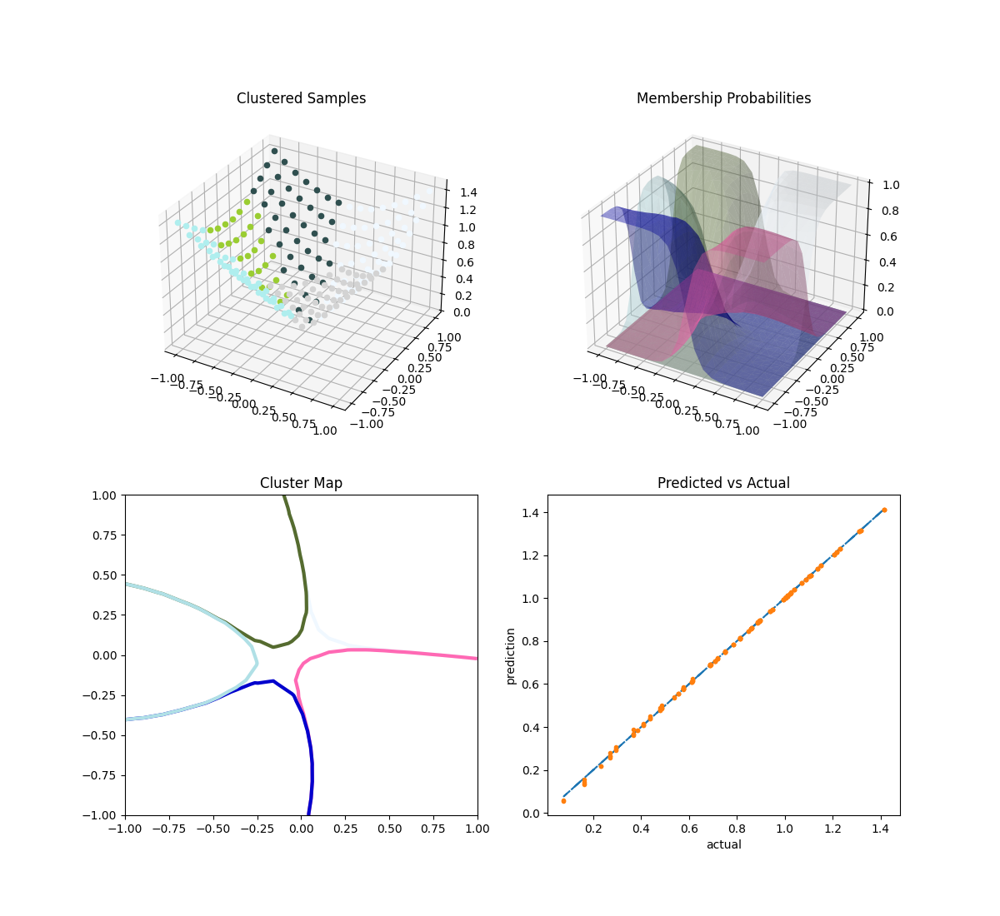

Mixture of experts (MOE)
========================

Mixture of experts aims at increasing the accuracy of a function approximation by replacing a single global model by a weighted sum of local models (experts). It is based on a partition of the problem domain into several subdomains via clustering algorithms followed by a local expert training on each subdomain.

A general introduction about the mixture of experts can be found in [1]_ and a first application with generalized linear models in [2]_.

SMT MOE combines surrogate models implemented in SMT to build a new surrogate model. The method is expected to improve the accuracy for functions with some of the following characteristics: heterogeneous behaviour depending on the region of the input space, flat and steep regions, first and zero order discontinuities. 

The MOE method strongly relies on the Expectation-Maximization (EM) algorithm for Gaussian mixture models (GMM). With an aim of regression, the different steps are the following:

    1. Clustering: the inputs are clustered together with their output values by means of parameter estimation of the joint distribution.
    2. Local expert training: A local expert is then built (linear, quadratic, cubic, radial basis functions, or different forms of kriging) on each cluster 
    3. Recombination: all the local experts are finally combined using the Gaussian mixture model parameters found by the EM algorithm to get a global model.

When local models :math:`y_i` are known, the global model would be:

.. math ::
	\begin{equation}\label{e:globalMOE}
	\hat{y}({\bf x})=\sum_{i=1}^{K} \mathbb{P}(\kappa=i|X={\bf x}) \hat{y_i}({\bf x})
	\end{equation}

which is the classical probability expression of mixture of experts.

In this equation, :math:`K` is the number of Gaussian components, :math:`\mathbb{P}(\kappa=i|X= {\bf x})`, denoted by gating network,  is the probability to lie in cluster :math:`i` knowing that :math:`X = {\bf x}` and :math:`\hat{y_i}` is the local expert built on cluster :math:`i`.

This equation leads to two different approximation models depending on the computation of :math:`\mathbb{P}(\kappa=i|X={\bf x})`. 

	* When choosing the Gaussian laws to compute this quantity, the equation leads to a *smooth model* that smoothly recombine different local experts.
	* If :math:`\mathbb{P}(\kappa=i|X= {\bf x})` is computed as characteristic functions of clusters (being equal to 0 or 1) this leads to a *discontinuous approximation model*.

More details can be found in [3]_ and [4]_.

References
----------

.. [1] Jerome Friedman, Trevor Hastie, and Robert Tibshirani. The elements of statistical learning, volume 1. Springer series in statistics Springer, Berlin, 2008.

.. [2] Michael I Jordan and Robert A Jacobs. Hierarchical mixtures of experts and the em algorithm. Neural computation, 6(2) :181–214, 1994.

.. [3] Dimitri Bettebghor, Nathalie Bartoli, Stephane Grihon, Joseph Morlier, and Manuel Samuelides.  Surrogate modeling approximation using a mixture of experts based on EM joint estimation. Structural  and Multidisciplinary Optimization, 43(2) :243–259, 2011. 10.1007/s00158-010-0554-2.

.. [4] Rhea P. Liem, Charles A. Mader, and Joaquim R. R. A. Martins. Surrogate models and mixtures of experts in aerodynamic performance prediction for mission analysis. Aerospace Science and Technology, 43 :126–151, 2015.

Implementation Notes
--------------------

Beside the main class `MOE`, one can also use the `MOESurrogateModel` class which adapts MOE as a `SurrogateModel` 
implementing the Surrogate Model API (see :ref:`Surrogate Model API <surrogate-model-dev-api>`). 

Usage
-----

Example 1
^^^^^^^^^

.. code-block:: python

  import numpy as np
  from smt.applications import MOE
  from smt.sampling_methods import FullFactorial
  import matplotlib.pyplot as plt
  
  ndim = 1
  nt = 35
  
  def function_test_1d(x):
      import numpy as np  # Note: only required by SMT doc testing toolchain
  
      x = np.reshape(x, (-1,))
      y = np.zeros(x.shape)
      y[x < 0.4] = x[x < 0.4] ** 2
      y[(x >= 0.4) & (x < 0.8)] = 3 * x[(x >= 0.4) & (x < 0.8)] + 1
      y[x >= 0.8] = np.sin(10 * x[x >= 0.8])
      return y.reshape((-1, 1))
  
  x = np.linspace(0, 1, 100)
  ytrue = function_test_1d(x)
  
  # Training data
  sampling = FullFactorial(xlimits=np.array([[0, 1]]), clip=True)
  np.random.seed(0)
  xt = sampling(nt)
  yt = function_test_1d(xt)
  
  # Mixture of experts
  print("MOE Experts: ", MOE.AVAILABLE_EXPERTS)
  
  # MOE1: Find the best surrogate model on the whole domain
  moe1 = MOE(n_clusters=1)
  print("MOE1 enabled experts: ", moe1.enabled_experts)
  moe1.set_training_values(xt, yt)
  moe1.train()
  y_moe1 = moe1.predict_values(x)
  
  # MOE2: Set nb of cluster with just KRG, LS and IDW surrogate models
  moe2 = MOE(smooth_recombination=False, n_clusters=3, allow=["KRG", "LS", "IDW"])
  print("MOE2 enabled experts: ", moe2.enabled_experts)
  moe2.set_training_values(xt, yt)
  moe2.train()
  y_moe2 = moe2.predict_values(x)
  
  fig, axs = plt.subplots(1)
  axs.plot(x, ytrue, ".", color="black")
  axs.plot(x, y_moe1)
  axs.plot(x, y_moe2)
  axs.set_xlabel("x")
  axs.set_ylabel("y")
  axs.legend(["Training data", "MOE 1 Prediction", "MOE 2 Prediction"])
  
  plt.show()
  
::

  MOE Experts:  ['KRG', 'KPLS', 'KPLSK', 'LS', 'QP', 'RBF', 'IDW', 'RMTB', 'RMTC']
  MOE1 enabled experts:  ['KRG', 'LS', 'QP', 'KPLS', 'KPLSK', 'RBF', 'RMTC', 'RMTB', 'IDW']
  Kriging 7.020950581043185
  LS 6.3661184651960365
  QP 6.271258707217198
  KPLS 7.020950581043185
  KPLSK 7.0108905151353484
  RBF 6.525795283100557
  RMTC 6.5274955736753055
  RMTB 6.601266321769173
  IDW 5.755443263320035
  Best expert = IDW
  MOE2 enabled experts:  ['KRG', 'LS', 'IDW']
  Kriging 0.003446474575061642
  LS 0.14196607571546527
  IDW 0.22651705336130568
  Best expert = Kriging
  Kriging 0.9705884312084047
  LS 0.9705882352941173
  IDW 0.9909963502468125
  Best expert = LS
  Kriging 0.12370332951754266
  LS 0.1521071464184328
  IDW 0.12378599723225117
  Best expert = Kriging
  

Example 2
^^^^^^^^^

.. code-block:: python

  import numpy as np
  from smt.applications import MOE
  from smt.problems import LpNorm
  from smt.sampling_methods import FullFactorial
  
  import sklearn
  import matplotlib.pyplot as plt
  from matplotlib import colors
  from mpl_toolkits.mplot3d import Axes3D
  
  ndim = 2
  nt = 200
  ne = 200
  
  # Problem: L1 norm (dimension 2)
  prob = LpNorm(ndim=ndim)
  
  # Training data
  sampling = FullFactorial(xlimits=prob.xlimits, clip=True)
  np.random.seed(0)
  xt = sampling(nt)
  yt = prob(xt)
  
  # Mixture of experts
  print("MOE Experts: ", MOE.AVAILABLE_EXPERTS)
  
  moe = MOE(smooth_recombination=True, n_clusters=5, deny=["RMTB", "KPLSK"])
  print("Enabled Experts: ", moe.enabled_experts)
  moe.set_training_values(xt, yt)
  moe.train()
  
  # Validation data
  np.random.seed(1)
  xe = sampling(ne)
  ye = prob(xe)
  
  # Prediction
  y = moe.predict_values(xe)
  fig = plt.figure(1)
  fig.set_size_inches(12, 11)
  
  # Cluster display
  colors_ = list(colors.cnames.items())
  GMM = moe.cluster
  weight = GMM.weights_
  mean = GMM.means_
  if sklearn.__version__ < "0.20.0":
      cov = GMM.covars_
  else:
      cov = GMM.covariances_
  prob_ = moe._proba_cluster(xt)
  sort = np.apply_along_axis(np.argmax, 1, prob_)
  
  xlim = prob.xlimits
  x0 = np.linspace(xlim[0, 0], xlim[0, 1], 20)
  x1 = np.linspace(xlim[1, 0], xlim[1, 1], 20)
  xv, yv = np.meshgrid(x0, x1)
  x = np.array(list(zip(xv.reshape((-1,)), yv.reshape((-1,)))))
  prob = moe._proba_cluster(x)
  
  plt.subplot(221, projection="3d")
  ax = plt.gca()
  for i in range(len(sort)):
      color = colors_[int(((len(colors_) - 1) / sort.max()) * sort[i])][0]
      ax.scatter(xt[i][0], xt[i][1], yt[i], c=color)
  plt.title("Clustered Samples")
  
  plt.subplot(222, projection="3d")
  ax = plt.gca()
  for i in range(len(weight)):
      color = colors_[int(((len(colors_) - 1) / len(weight)) * i)][0]
      ax.plot_trisurf(
          x[:, 0], x[:, 1], prob[:, i], alpha=0.4, linewidth=0, color=color
      )
  plt.title("Membership Probabilities")
  
  plt.subplot(223)
  for i in range(len(weight)):
      color = colors_[int(((len(colors_) - 1) / len(weight)) * i)][0]
      plt.tricontour(x[:, 0], x[:, 1], prob[:, i], 1, colors=color, linewidths=3)
  plt.title("Cluster Map")
  
  plt.subplot(224)
  plt.plot(ye, ye, "-.")
  plt.plot(ye, y, ".")
  plt.xlabel("actual")
  plt.ylabel("prediction")
  plt.title("Predicted vs Actual")
  
  plt.show()
  
::

  MOE Experts:  ['KRG', 'KPLS', 'KPLSK', 'LS', 'QP', 'RBF', 'IDW', 'RMTB', 'RMTC']
  Enabled Experts:  ['KRG', 'LS', 'QP', 'KPLS', 'RBF', 'RMTC', 'IDW']
  Kriging 1.493918889431987
  LS 1.5077303443623014
  QP 1.497472084687915
  KPLS 1.4973020945620643
  RBF 1.4947551160130281
  RMTC 1.4902690042419398
  IDW 1.4902351945725307
  Best expert = IDW
  Kriging 1.0908371872520195
  LS 1.098289977065335
  QP 1.0962913775992766
  KPLS 1.0911562866900417
  RBF 1.090776908707379
  RMTC 1.0906560204480358
  IDW 1.13172398181558
  Best expert = RMTC
  Kriging 1.0172725317546631
  LS 1.045161267941499
  QP 1.021870693299392
  KPLS 1.0209466301318373
  RBF 1.017043126837439
  RMTC 1.030672304756457
  IDW 1.0163947834915366
  Best expert = IDW
  Kriging 1.4185781931623493
  LS 1.4418735729979624
  QP 1.4542641515660801
  KPLS 1.4186236508382706
  RBF 1.4178300358901577
  RMTC 1.4351250866581635
  IDW 1.4188134912804515
  Best expert = RBF
  Kriging 1.5266898050928612
  LS 1.521071480977923
  QP 1.5434778008314816
  KPLS 1.5520610825580914
  RBF 1.4938116417082332
  RMTC 1.5370353146277413
  IDW 1.4918365835244014
  Best expert = IDW
  

Options
-------

.. list-table:: List of options
  :header-rows: 1
  :widths: 15, 10, 20, 20, 30
  :stub-columns: 0

  *  -  Option
     -  Default
     -  Acceptable values
     -  Acceptable types
     -  Description
  *  -  xt
     -  None
     -  None
     -  ['ndarray']
     -  Training inputs
  *  -  yt
     -  None
     -  None
     -  ['ndarray']
     -  Training outputs
  *  -  ct
     -  None
     -  None
     -  ['ndarray']
     -  Training derivative outputs used for clustering
  *  -  xtest
     -  None
     -  None
     -  ['ndarray']
     -  Test inputs
  *  -  ytest
     -  None
     -  None
     -  ['ndarray']
     -  Test outputs
  *  -  n_clusters
     -  2
     -  None
     -  ['int']
     -  Number of clusters
  *  -  smooth_recombination
     -  True
     -  None
     -  ['bool']
     -  Continuous cluster transition
  *  -  heaviside_optimization
     -  False
     -  None
     -  ['bool']
     -  Optimize Heaviside scaling factor when smooth recombination is used
  *  -  derivatives_support
     -  False
     -  None
     -  ['bool']
     -  Use only experts that support derivatives prediction
  *  -  variances_support
     -  False
     -  None
     -  ['bool']
     -  Use only experts that support variance prediction
  *  -  allow
     -  []
     -  None
     -  None
     -  Names of allowed experts to be possibly part of the mixture. Empty list corresponds to all surrogates allowed.
  *  -  deny
     -  []
     -  None
     -  None
     -  Names of forbidden experts
