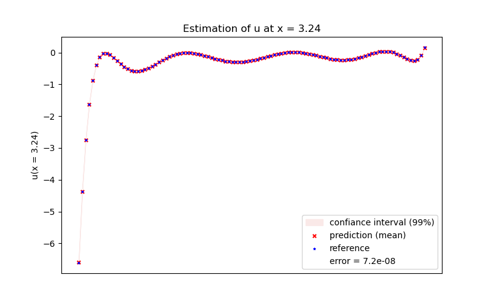

Proper Orthogonal Decomposition + Interpolation (PODI)
======================================================

PODI is an application used to predict vectorial measures.
It combines Proper Orthogonal Decomposition (POD) and kriging based surrogate models to perform the estimations.

Context
-------

We consider a problem in which the estimation of a measure :math:`u` is desired along a mesh of :math:`p` points.
The data containing the values of :math:`u` in a specific configuration of the problem is called a **snapshot**.
With :math:`k \in [\![1,N]\!]`, the caracteristics of the :math:`k`-th configuration are represented by :math:`\mathbf{x}_k`.

The :math:`N` snapshots are gathered in a database called the **snapshot matrix**:

.. math ::
	S=
	\begin{bmatrix}
		u( \mathbf{x}_1)_1 & \dots & u( \mathbf{x}_N)_1 \\
		\vdots & \ddots & \vdots \\
		u( \mathbf{x}_1)_p & \dots & u( \mathbf{x}_N)_p \\
	\end{bmatrix}
	\in \mathbb{R}^{p \times N}

Each column of the matrix corresponds to a snapshot, while each row corresponds to a point of the problem's mesh.

Proper Orthogonal Decomposition (POD)
-------------------------------------

The measure :math:`u` is a vector of dimension :math:`p`. Its POD is this decomposition:

.. math ::
	\begin{equation}\label{e:pod}
	u({\mathbf x})=u_0 + \sum_{i=1}^{M} \alpha_i(\mathbf x)\phi_i
	\end{equation}

* :math:`u` is decomposed as a sum of :math:`M` modes and :math:`u_0` corresponds to the mean value of :math:`u`.

* each mode :math:`i` is defined by a scalar coefficient :math:`\alpha_i` and  a vector :math:`\phi_{i}` of dimension :math:`p`.

* the :math:`\phi_i` vectors are orthogonal and form the **POD basis**. The POD basis is **global** here because it doesn't depend of :math:`\mathbf{x}`.

We can also define the matricial POD equation:

.. math ::
	\begin{equation}\label{e:matrixPOD}
	S=U_0+\Phi A
	\end{equation}

where :math:`U_0` is composed of the :math:`u_0` vector on each column,

.. math ::
	A=
	\begin{bmatrix}
		\alpha_1( \mathbf{x}_1) & \dots & \alpha_1( \mathbf{x}_N) \\
		\vdots & \ddots & \vdots \\
		\alpha_M( \mathbf{x}_1) & \dots & \alpha_M( \mathbf{x}_N) \\
	\end{bmatrix}
	\text{, } \Phi=
	\begin{bmatrix}
		(\phi_1)_1 & \dots & (\phi_M)_1 \\
		\vdots & \ddots & \vdots \\
		(\phi_1)_p & \dots & (\phi_M)_p \\
	\end{bmatrix}

Singular Values Decomposition (SVD)
-------------------------------------
To perform the POD, the SVD of the snapshot matrix :math:`S` is used:

.. math ::
	\begin{equation}\label{e:svd}
	S=U\Sigma{V}^{T}
	\end{equation}

The :math:`(p \times p)` :math:`U` and :math:`(N \times N)` :math:`{V}^{T}` matrices are orthogonal and contain the **singular vectors**.
These vectors are the directions of maximum variance in the data and are ranked by decreasing order of importance.
Each vector corresponds to a mode of :math:`u`. The total number of available modes is limited by the number of snapshots:

.. math ::
	\begin{equation}\label{e:M<=N}
	M \le N
	\end{equation}

The importance of each mode is represented by the diagonal values of the :math:`(p \times N)` :math:`\Sigma` matrix. They are known as the *singular values* :math:`\sigma_i` and are positive numbers ranked by decreasing value.
It is then needed to filter the modes to keep those that represent most of the data structure.
To do this, we use the **explained variance**. It represents the data variance that we keep when filtering the modes.

If :math:`m` modes are kept, their explained variance :math:`EV_m` is:

.. math ::
	\begin{equation}\label{e:ev_m}
	EV_m=\frac{\sum_{i=1}^{m} \sigma_i}{\sum_{i=1}^{N} \sigma_i}
	\end{equation}

The number of kept modes is defined by a tolerance :math:`\eta \in ]0,1]` that represents the minimum variance we desire to explain during the SVD:

.. math ::
	\begin{equation}\label{e:M_def}
	M = \min\{m \in [\![1,N]\!]: EV_m \ge \eta\}
	\end{equation}

Then, the first :math:`M` singular vectors of the :math:`U` matrix correspond to the :math:`\phi_i` vectors in the POD.
The :math:`\alpha_i` coefficients of the :math:`A` matrix can be deduced:

.. math ::
	\begin{equation}\label{e:A}
	A={\Phi}^{T}(S-U_0)
	\end{equation}

Use of Surrogate models
---------------------------------

To compute :math:`u` at a new value :math:`\mathbf{x}_*`, the values of :math:`\alpha_i(\mathbf{x}_*)` at each mode :math:`i` are needed.

To estimate them, **kriging based surrogate models** are used:

.. math ::
	\mathbf{x}=(\mathbf{x}_1,\dots,\mathbf{x}_k,\dots,\mathbf{x}_N)
	\longrightarrow
	\begin{cases}
		\alpha_1(\mathbf{x}) \longrightarrow \text{model 1} \\
		\vdots \\
		\alpha_i(\mathbf{x}) \longrightarrow \text{model i} \\
		\vdots \\
		\alpha_M(\mathbf{x}) \longrightarrow \text{model M} \\
	\end{cases}

For each kept mode :math:`i`, we use a surrogate model that is trained with the inputs :math:`\mathbf{x}_k` and outputs :math:`\alpha_i(\mathbf{x}_k)`.

These models are able to compute an estimation denoted :math:`\hat\alpha_i(\mathbf{x}_*)`. It is normally distributed:

.. math ::
	\hat\alpha_i(\mathbf{x}_*) \hookrightarrow \mathcal{N}(\mu_i(\mathbf{x}_*),\sigma_i^{2}(\mathbf{x}_*))

The mean and variance of :math:`u(\mathbf{x}_*)` can be deduced:

.. math ::
	\begin{cases}
		\mathbb{E}[u(\mathbf{x}_*)]=u_0+\sum_{i=1}^{M} \mu_i(\mathbf{x}_*)\phi_i \\
		\mathbb{V}[u(\mathbf{x}_*)]=\sum_{i=1}^{M} \sigma_i^{2}(\mathbf{x}_*)\phi_i^{2}
	\end{cases}

NB: These equations take in consideration that:

- the POD basis is global: the :math:`\phi_i` are independent of :math:`\mathbf{x}`.

- the models are pairwise independent, so are the coefficients :math:`\hat\alpha_i(\mathbf{x}_*)`.

Usage
-----

.. code-block:: python

  import numpy as np
  from smt.sampling_methods import LHS
  from smt.applications import PODI
  import matplotlib.pyplot as plt
  
  light_pink = np.array((250, 233, 232)) / 255
  
  ny = 100
  mesh = np.linspace(-1, 1, ny)
  n_modes_test = 10
  
  def function_test_1d(x, mesh, n_modes_test, ny):
      import numpy as np  # Note: only required by SMT doc testing toolchain
  
      def cos_coef(i: int, x: np.ndarray):
          a = 2 * i % 2 - 1
          return a * x[:, 0] * np.cos(i * x[:, 0])
  
      def Legendre(i: int, mesh: np.ndarray):
          from scipy import special
  
          return special.legendre(i)(mesh)
  
      def gram_schmidt(input_array: np.ndarray) -> np.ndarray:
          """To perform the  Gram-Schmidt's algorithm."""
  
          basis = np.zeros_like(input_array)
          for i in range(len(input_array)):
              basis[i] = input_array[i]
              for j in range(i):
                  basis[i] -= (
                      np.dot(input_array[i], basis[j])
                      / np.dot(basis[j], basis[j])
                      * basis[j]
                  )
              basis[i] /= np.linalg.norm(basis[i])
          return basis
  
      u0 = np.zeros((ny, 1))
  
      alpha = np.zeros((x.shape[0], n_modes_test))
      for i in range(n_modes_test):
          alpha[:, i] = cos_coef(i, x)
  
      V_init = np.zeros((ny, n_modes_test))
      for i in range(n_modes_test):
          V_init[:, i] = Legendre(i, mesh)
  
      V = gram_schmidt(V_init.T).T
      database = u0 + np.dot(V, alpha.T)
  
      return database
  
  seed = 42
  nt = 40
  xlimits = np.array([[0, 4]])
  sampling = LHS(xlimits=xlimits, random_state=seed)
  xt = sampling(nt)
  
  nv = 400
  xv = sampling(nv)
  
  x = np.concatenate((xt, xv))
  dbtrue = function_test_1d(x, mesh, n_modes_test, ny)
  
  # Training data
  dbt = dbtrue[:, :nt]
  
  podi = PODI()
  podi.compute_pod(dbt, tol=0.9999, seed=seed)
  podi.set_training_values(xt)
  podi.train()
  
  values = podi.predict_values(x)
  variances = podi.predict_variances(x)
  
  i = nt + nv // 2
  
  diff = dbtrue[:, i] - values[:, i]
  rms_error = np.sqrt(np.mean(diff**2))
  plt.figure(figsize=(8, 5))
  plt.fill_between(
      np.ravel(np.linspace(-1, 1, ny)),
      np.ravel(values[:, i] - 3 * np.sqrt(variances[:, i])),
      np.ravel(values[:, i] + 3 * np.sqrt(variances[:, i])),
      color=light_pink,
      label="confiance interval (99%)",
  )
  plt.scatter(
      mesh,
      values[:, i],
      color="r",
      marker="x",
      s=15,
      alpha=1.0,
      label="prediction (mean)",
  )
  plt.scatter(
      mesh,
      dbtrue[:, i],
      color="b",
      marker="*",
      s=5,
      alpha=1.0,
      label="reference",
  )
  plt.plot([], [], color="w", label="error = " + str(round(rms_error, 9)))
  
  ax = plt.gca()
  ax.axes.xaxis.set_visible(False)
  
  plt.ylabel("u(x = " + str(x[i, 0])[:4] + ")")
  plt.title("Estimation of u at x = " + str(x[i, 0])[:4])
  plt.legend()
  plt.show()
  

PODI class API
--------------

.. autoclass:: smt.applications.podi.PODI

  	.. automethod:: smt.applications.podi.PODI.compute_pod

    .. automethod:: smt.applications.podi.PODI.get_singular_vectors

	.. automethod:: smt.applications.podi.PODI.get_singular_values

	.. automethod:: smt.applications.podi.PODI.get_ev_ratio

	.. automethod:: smt.applications.podi.PODI.get_n_modes

	.. automethod:: smt.applications.podi.PODI.set_interp_options

	.. automethod:: smt.applications.podi.PODI.compute_pod

	.. automethod:: smt.applications.podi.PODI.set_training_values

	.. automethod:: smt.applications.podi.PODI.train

	.. automethod:: smt.applications.podi.PODI.get_interp_coef

	.. automethod:: smt.applications.podi.PODI.predict_values

	.. automethod:: smt.applications.podi.PODI.predict_variances

	.. automethod:: smt.applications.podi.PODI.predict_derivatives