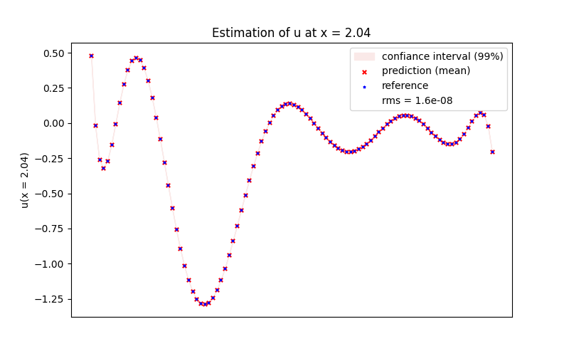
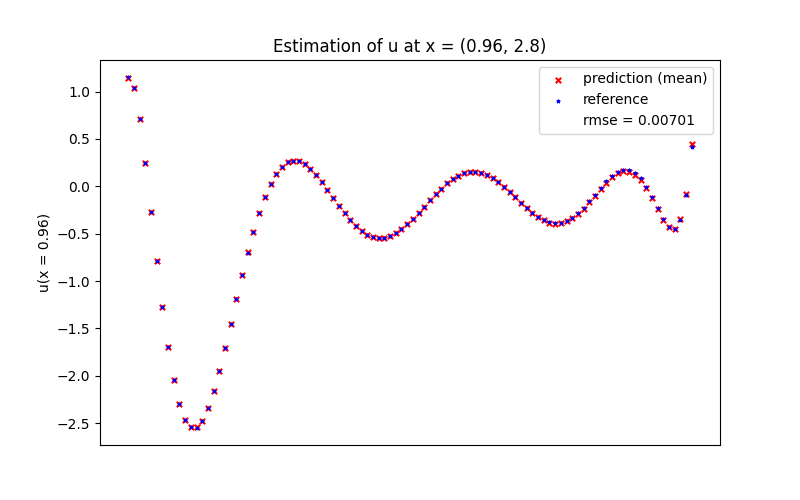

Proper Orthogonal Decomposition + Interpolation (PODI)
======================================================

PODI is an application used to predict vectorial outputs.
It combines Proper Orthogonal Decomposition (POD) and Kriging based surrogate models to perform the estimations.

Context
-------

We seek for an approximation of a vector :math:`u(\mathbf{x}) \in \mathbb{R}^p`, with :math:`p>>1` and :math:`\mathbf{x}= \in \mathcal{X} \subset \mathbb{R}^d` an input vector. 
PODI being a supervised learning approach we assume that a Design of Experiments of size :math:`N` is available, i.e. :math:`u(\mathbf{x_k})` for  :math:`k \in [\![1,N]\!]`.    
In the model order reduction, a vector :math:`u(\mathbf{x_k})` is called a **snapshot**.
The PODI application aims at building an approximation :math:`\hat{u}(\mathbf{x})` of :math:`u(\mathbf{x})` for any :math:`\mathbf{x}\in\mathcal{X}`. 

To construct this approximation, the :math:`N` snapshots are first gathered in a database called the **snapshot matrix**:

.. math ::
	S=
	\begin{bmatrix}
		u( \mathbf{x}_1)_1 & \dots & u( \mathbf{x}_N)_1 \\
		\vdots & \ddots & \vdots \\
		u( \mathbf{x}_1)_p & \dots & u( \mathbf{x}_N)_p \\
	\end{bmatrix}
	\in \mathbb{R}^{p \times N}

Each column of the matrix corresponds to a snapshot output :math:`u(\mathbf{x_k})`.

Proper Orthogonal Decomposition (POD)
-------------------------------------
Global POD
----------
The Proper Orthogonal Decomposition of :math:`u` reads, 

.. math ::
	\begin{equation}\label{e:pod}
	u({\mathbf x})\approx \hat{u}({\mathbf{x}}) =u_0 + \sum_{i=1}^{M} \alpha_i(\mathbf x)\phi_i
	\end{equation}

* :math:`u` is decomposed as a sum of :math:`M` modes and :math:`u_0` corresponds to the mean value of :math:`u`.

* each mode :math:`i` is defined by a scalar coefficient :math:`\alpha_i`, called generalized coordinate, and  a vector :math:`\phi_{i}` of dimension :math:`p`.

* the :math:`\phi_i` vectors are orthogonal and form the **POD basis** :math:`\Phi`. Note that they are independent of :math:`x`, hence the name "global" POD basis. 

In practice, the mean value :math:`u_0` of :math:`u` is not available and will be estimated by the mean value of the :math:`N` snapshots. It can be shown that the basis :math:`\Phi` that leads to the best approximation in the mean square error sense is the singular vector of the matrix :math:`S-u_0`.
The generalized coordinates :math:`\alpha_i(\mathbf{x}), i = 1,\cdots,M` will be interpolated by GP.  

Local POD
---------

Local POD starts by assuming that the input vector :math:`\mathbf{x}` can be splitted into two subsets of variables i.e. :math:`\mathbf{x}=\left\lbrace \mathbf{x_1},\mathbf{x_2}\right\rbrace`. The spliting is not automatic and left to the user.
Then, the local POD approximation reads

.. math ::
	\begin{equation}\label{e:local_pod}
	u({\mathbf x})\approx u_0 + \sum_{i=1}^{M} \alpha_i(\mathbf{x_1},\mathbf{x_2})\phi_i(\mathbf{x_1})
	\end{equation}

where :math:`\phi_i` is the local POD basis at input point :math:`\mathbf{x_1}`. In practice this POD basis must be approximated by interpolation on the Grassmann manifold of a database of local POD bases. Hence this approach further assumes that a DoE of local POD bases is provided. More information on this interpolation can be found in ref [1]. The generalized coordinates :math:`\alpha_i(\mathbf{x_1},\mathbf{x_2})` are interpolated by GPs as for the global POD case. 

[1] Porrello, C., Dubreuil, S., and Farhat, C. Bayesian framework with projection-based model order reduction for efficient global optimization. In AIAA AVIATION FORUM AND ASCEND 2024 (2024)

Singular Values Decomposition (SVD)
-----------------------------------
To perform the POD, the SVD of the snapshot matrix :math:`S` is used:

.. math ::
	\begin{equation}\label{e:svd}
	S=U\Sigma{V}^{T}
	\end{equation}

The :math:`(p \times p)` :math:`U` and :math:`(N \times N)` :math:`{V}^{T}` matrices are orthogonal and contain the **singular vectors**.
These vectors are the directions of maximum variance in the data and are ranked by decreasing order of importance.
Each vector corresponds to a mode of :math:`u`. The total number of available modes is limited by the number of snapshots:

.. math ::
	\begin{equation}\label{e:M<=N}
	M \le N
	\end{equation}

The importance of each mode is represented by the diagonal values of the :math:`(p \times N)` :math:`\Sigma` matrix. They are known as the *singular values* :math:`\sigma_i` and are positive numbers ranked by decreasing value.
It is then needed to filter the modes to keep those that represent most of the data structure.
To do this, we use the **explained variance**. It represents the data variance that we keep when filtering the modes.

If :math:`m` modes are kept, their explained variance :math:`EV_m` is:

.. math ::
	\begin{equation}\label{e:ev_m}
	EV_m=\frac{\sum_{i=1}^{m} \sigma_i^2}{\sum_{i=1}^{N} \sigma_i^2}
	\end{equation}

The number of kept modes is defined by a tolerance :math:`\eta \in ]0,1]` that represents the minimum variance we desire to explain during the SVD:

.. math ::
	\begin{equation}\label{e:M_def}
	M = \min\{m \in [\![1,N]\!]: EV_m \ge \eta\}
	\end{equation}

Then, the first :math:`M` singular vectors of the :math:`U` matrix correspond to the :math:`\phi_i` vectors in the POD.
The :math:`\alpha_i` coefficients of the :math:`A` matrix can be deduced:

.. math ::
	\begin{equation}\label{e:A}
	A={\Phi}^{T}(S-U_0)
	\end{equation}

Use of Surrogate models
-----------------------

To compute :math:`u` at a new value :math:`\mathbf{x}_*`, the values of :math:`\alpha_i(\mathbf{x}_*)` at each mode :math:`i` are needed.

To estimate them, **Kriging based surrogate models** are used:

.. math ::
	\mathbf{x}=(\mathbf{x}_1,\dots,\mathbf{x}_k,\dots,\mathbf{x}_N)
	\longrightarrow
	\begin{cases}
		\alpha_1(\mathbf{x}) \longrightarrow \text{model 1} \\
		\vdots \\
		\alpha_i(\mathbf{x}) \longrightarrow \text{model i} \\
		\vdots \\
		\alpha_M(\mathbf{x}) \longrightarrow \text{model M} \\
	\end{cases}

For each kept mode :math:`i`, we use a surrogate model that is trained with the inputs :math:`\mathbf{x}_k` and outputs :math:`\alpha_i(\mathbf{x}_k)`.

These models are able to compute an estimation denoted :math:`\hat\alpha_i(\mathbf{x}_*)`. It is normally distributed:

.. math ::
	\hat\alpha_i(\mathbf{x}_*) \hookrightarrow \mathcal{N}(\mu_i(\mathbf{x}_*),\sigma_i^{2}(\mathbf{x}_*))

The mean, variance and derivative of :math:`u(\mathbf{x}_*)` can be deduced:

.. math ::
	\begin{cases}
		\mathbb{E}[u(\mathbf{x}_*)]=u_0+\sum_{i=1}^{M} \mu_i(\mathbf{x}_*)\phi_i \\
		\mathbb{V}[u(\mathbf{x}_*)]=\sum_{i=1}^{M} \sigma_i^{2}(\mathbf{x}_*)\phi_i^{2} \\
		u'(\mathbf{x}_*)=\sum_{i=1}^{M} \hat\alpha_i'(\mathbf{x}_*)\phi_i
	\end{cases}

NB: The variance equation takes in consideration that:

- the models are pairwise independent, so are the coefficients :math:`\hat\alpha_i(\mathbf{x}_*)`.

Usage
-----
Example 1: global POD case for 1D function
^^^^^^^^^^^^^^^^^^^^^^^^^^^^^^^^^^^^^^^^^^
.. code-block:: python

  import matplotlib.pyplot as plt
  import numpy as np
  from smt.applications import PODI
  from smt.sampling_methods import LHS
  
  light_pink = np.array((250, 233, 232)) / 255
  
  p = 100
  t = np.linspace(-1, 1, p)
  n_modes_test = 10
  
  def function_test_1d(x, t, n_modes_test, p):
      import numpy as np  # Note: only required by SMT doc testing toolchain
  
      def cos_coeff(i: int, x: np.ndarray):
          a = 2 * i % 2 - 1
          return a * x[:, 0] * np.cos(i * x[:, 0])
  
      def Legendre(i: int, t: np.ndarray):
          from scipy import special
  
          return special.legendre(i)(t)
  
      def gram_schmidt(input_array: np.ndarray) -> np.ndarray:
          """To perform the  Gram-Schmidt's algorithm."""
  
          basis = np.zeros_like(input_array)
          for i in range(len(input_array)):
              basis[i] = input_array[i]
              for j in range(i):
                  basis[i] -= (
                      np.dot(input_array[i], basis[j])
                      / np.dot(basis[j], basis[j])
                      * basis[j]
                  )
              basis[i] /= np.linalg.norm(basis[i])
          return basis
  
      u0 = np.zeros((p, 1))
  
      alpha = np.zeros((x.shape[0], n_modes_test))
      for i in range(n_modes_test):
          alpha[:, i] = cos_coeff(i, x)
  
      V_init = np.zeros((p, n_modes_test))
      for i in range(n_modes_test):
          V_init[:, i] = Legendre(i, t)
  
      V = gram_schmidt(V_init.T).T
      database = u0 + np.dot(V, alpha.T)
  
      return database
  
  seed_sampling = 42
  xlimits = np.array([[0, 4]])
  sampling = LHS(xlimits=xlimits, random_state=seed_sampling)
  
  nt = 40
  xt = sampling(nt)
  
  nv = 50
  xv = sampling(nv)
  
  x = np.concatenate((xt, xv))
  dbfull = function_test_1d(x, t, n_modes_test, p)
  
  # Training data
  dbt = dbfull[:, :nt]
  
  # Validation data
  dbv = dbfull[:, nt:]
  
  podi = PODI()
  seed_pod = 42
  podi.compute_pod(dbt, tol=0.9999, seed=seed_pod)
  podi.set_training_values(xt)
  podi.train()
  
  values = podi.predict_values(xv)
  variances = podi.predict_variances(xv)
  
  # computing the POD errors:
  # [max_interp_error, max_proj_error, max_total_error] = PODI.compute_pod_errors(xt = xt, database = dbt)
  # print("interpolation error: ", max_interp_error)
  # print("projection error: ", max_proj_error)
  # print("total error: ", max_total_error)
  
  # Choosing a value from the validation inputs
  i = nv // 2
  
  diff = dbv[:, i] - values[:, i]
  rms_error = np.sqrt(np.mean(diff**2))
  plt.figure(figsize=(8, 5))
  light_pink = np.array((250, 233, 232)) / 255
  plt.fill_between(
      np.ravel(t),
      np.ravel(values[:, i] - 3 * np.sqrt(variances[:, i])),
      np.ravel(values[:, i] + 3 * np.sqrt(variances[:, i])),
      color=light_pink,
      label="confiance interval (99%)",
  )
  plt.scatter(
      t,
      values[:, i],
      color="r",
      marker="x",
      s=15,
      alpha=1.0,
      label="prediction (mean)",
  )
  plt.scatter(
      t,
      dbv[:, i],
      color="b",
      marker="*",
      s=5,
      alpha=1.0,
      label="reference",
  )
  plt.plot([], [], color="w", label="rms = " + str(round(rms_error, 9)))
  
  ax = plt.gca()
  ax.axes.xaxis.set_visible(False)
  
  plt.ylabel("u(x = " + str(xv[i, 0])[:4] + ")")
  plt.title("Estimation of u at x = " + str(xv[i, 0])[:4])
  plt.legend()
  plt.show()
  

Example 2: local POD case for 2D function
^^^^^^^^^^^^^^^^^^^^^^^^^^^^^^^^^^^^^^^^^
.. code-block:: python

  import matplotlib.pyplot as plt
  import numpy as np
  from smt.applications import PODI
  from smt.sampling_methods import LHS
  
  p = 100
  y = np.linspace(-1, 1, p)
  n_modes_test = 10
  
  def function_test_2d_local(x, y, n_modes_test, p):
      import numpy as np  # Note: only required by SMT doc testing toolchain
  
      def cos_coeff_nd(i: int, x: np.ndarray):
          a = 2 * i % 2 - 1
          return a * sum(x.T) * np.cos(i * sum(x.T))
  
      def Legendre(i: int, y: np.ndarray):
          from scipy import special
  
          return special.legendre(i)(y)
  
      def gram_schmidt(input_array: np.ndarray) -> np.ndarray:
          """To perform the  Gram-Schmidt's algorithm."""
  
          basis = np.zeros_like(input_array)
          for i in range(len(input_array)):
              basis[i] = input_array[i]
              for j in range(i):
                  basis[i] -= (
                      np.dot(input_array[i], basis[j])
                      / np.dot(basis[j], basis[j])
                      * basis[j]
                  )
              basis[i] /= np.linalg.norm(basis[i])
          return basis
  
      u0 = np.zeros((p, 1))
  
      alpha = np.zeros((x.shape[0], n_modes_test))
      for i in range(n_modes_test):
          alpha[:, i] = cos_coeff_nd(i, x)
  
      V_init = np.zeros((p, n_modes_test))
      for i in range(n_modes_test):
          V_init[:, i] = Legendre(i, y)
  
      V = gram_schmidt(V_init.T).T
      database = u0 + np.dot(V, alpha.T)
  
      return database
  
  seed = 42
  xlimits = [[0, 1], [0, 4]]
  sampling_x1 = LHS(xlimits=np.array([xlimits[0]]), random_state=seed)
  sampling_x2 = LHS(xlimits=np.array([xlimits[1]]), random_state=seed + 1)
  
  nt1 = 25
  nt2 = 10
  nt = nt1 * nt2
  xt1 = sampling_x1(nt1)
  xt2 = sampling_x2(nt)
  xt = np.zeros((nt, 2))
  xt[:, 1] = xt2[:, 0]
  for i, elt in enumerate(xt1):
      xt[i * nt2 : (i + 1) * nt2, 0] = elt
  
  sampling_new = LHS(xlimits=np.array(xlimits), random_state=seed)
  
  nv = 15
  xv = sampling_new(nv)
  xv1 = np.atleast_2d(xv[:, 0]).T
  x = np.concatenate((xt, xv))
  
  dbfull = function_test_2d_local(x, y, n_modes_test, p)
  
  # Training data
  dbt = dbfull[:, :nt]
  
  # Validation data
  dbv = dbfull[:, nt:]
  
  plt.figure(figsize=(8, 5))
  axes = plt.gca()
  axes.tick_params(axis="x", labelsize=14)
  axes.tick_params(axis="y", labelsize=14)
  plt.scatter(xt[:, 1], xt[:, 0], marker="x", label="Training points", color="g")
  plt.scatter(
      xv[:, 1], xv[:, 0], marker="*", label="Validation points", color="r"
  )
  plt.xlabel(r"$x^{(2)}$", fontsize=18)
  plt.ylabel(r"$x^{(1)}$", fontsize=18)
  plt.legend(loc="lower left", fontsize=14)
  
  tol = 0.9999  # SVD tolerance for each line's POD basis
  local_pod_bases = []  # list of each line's POD bases
  n_modes_list = []
  
  podi = PODI()
  for i in range(nt1):
      db_loc = dbt[:, i * nt2 : (i + 1) * nt2]
      podi.compute_pod(
          db_loc, pod_type="global", n_modes=min(db_loc.shape), seed=i
      )
      ev_list = podi.get_ev_list()
  
      n_modes = PODI.choice_n_modes_tol(ev_list, tol)
      n_modes_list.append(n_modes)
  
      local_basis = podi.get_basis()
      local_pod_bases.append(local_basis)
  
  # Function that choose the 'n_bases' closest bases (closest value of x^(1))
  # and use 'interp_subspaces' to estimate a new basis
  n_bases = 10
  
  def choose_local_bases(local_pod_bases, n_bases, modes_list, xt1, xv1):
      import numpy as np
      from smt.applications import PODI
  
      interpolated_bases = []
      keep_index_list = []
      max_modes_list = []
  
      for value in xv1:
          sorted_ind = sorted(
              range(xt1.shape[0]), key=lambda k: abs(xt1[:, 0] - value)[k]
          )
          keep_index = sorted_ind[:n_bases]
          keep_index_list.append(keep_index)
          input_matrices = []
          keep_xt1 = []
          max_modes = max(modes_list[keep_index])
          max_modes_list.append(max_modes)
          for i in keep_index:
              input_matrices.append(local_pod_bases[i][:, :max_modes])
              keep_xt1.append(xt1[i, 0])
          basis = PODI.interp_subspaces(
              xt1=np.atleast_2d(keep_xt1).T,
              input_matrices=input_matrices,
              xn1=np.atleast_2d(value),
              frechet=True,
              print_global=False,
          )
          interpolated_bases.append(basis[0])
      return interpolated_bases, keep_index_list
  
  interpolated_bases, keep_index_list = choose_local_bases(
      local_pod_bases,
      n_bases=n_bases,
      modes_list=np.array(n_modes_list),
      xt1=xt1,
      xv1=xv1,
  )
  
  # Choosing a value from the validation inputs
  i = 0
  
  podi = PODI()
  j = []
  for ind in keep_index_list[i]:
      j += list(range(ind * nt2, (ind + 1) * nt2))
  podi.compute_pod(
      database=dbt[:, j], pod_type="local", local_basis=interpolated_bases[i]
  )
  n_modes = podi.get_n_modes()
  print(f"{n_modes} modes were kept.")
  
  # Choosing the default interp options
  # Setting the training values
  podi.set_training_values(xt=np.atleast_2d(xt[j]))
  
  # Training the models
  podi.train()
  
  # predicting the desired values with inputs
  values = podi.predict_values(np.atleast_2d(xv[i]))
  
  diff = dbv[:, i] - values[:, 0]
  
  rms_error = np.sqrt(np.mean(diff**2))
  plt.figure(figsize=(8, 5))
  plt.scatter(
      y,
      values,
      color="r",
      marker="x",
      s=15,
      alpha=1.0,
      label="prediction (mean)",
  )
  plt.scatter(
      y,
      dbv[:, i],
      color="b",
      marker="*",
      s=5,
      alpha=1.0,
      label="reference",
  )
  plt.plot([], [], color="w", label="rmse = " + str(round(rms_error, 5)))
  
  ax = plt.gca()
  ax.axes.xaxis.set_visible(False)
  
  plt.ylabel("u(x = " + str(xv[i, 0])[:4] + ")")
  plt.title(f"Estimation of u at x = ({str(xv[i, 0])[:4]}, {str(xv[i, 1])[:4]})")
  plt.legend()
  plt.show()
  
::

  8 modes were kept.
  

PODI class API
--------------

.. autoclass:: smt.applications.podi.PODI

	.. automethod:: smt.applications.podi.PODI.interp_subspaces

  	.. automethod:: smt.applications.podi.PODI.compute_pod

	.. automethod:: smt.application.podi.PODI.compute_pod_errors

    .. automethod:: smt.applications.podi.PODI.get_singular_vectors

	.. automethod:: smt.applications.podi.PODI.get_basis

	.. automethod:: smt.applications.podi.PODI.get_singular_values

	.. automethod:: smt.applications.podi.PODI.get_ev_list

	.. automethod:: smt.applications.podi.PODI.get_ev_ratio

	.. automethod:: smt.applications.podi.PODI.get_n_modes

	.. automethod:: smt.applications.podi.PODI.set_interp_options

	.. automethod:: smt.applications.podi.PODI.set_training_values

	.. automethod:: smt.applications.podi.PODI.train

	.. automethod:: smt.applications.podi.PODI.get_interp_coeff

	.. automethod:: smt.applications.podi.PODI.predict_values

	.. automethod:: smt.applications.podi.PODI.predict_variances

	.. automethod:: smt.applications.podi.PODI.predict_derivatives

	.. automethod:: smt.applications.podi.PODI.predict_variance_derivatives