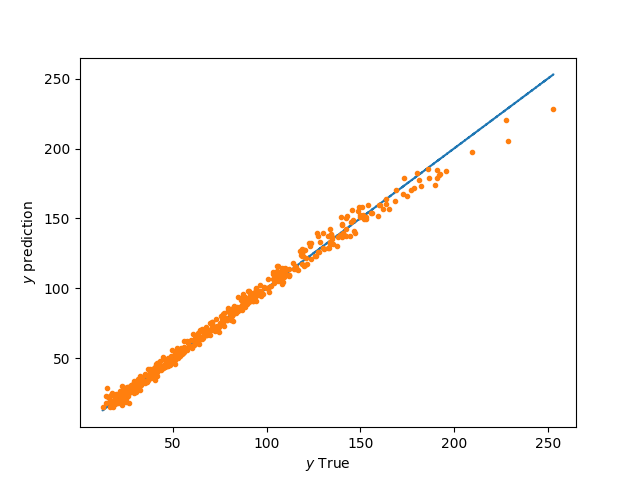

Variable-fidelity modeling (VFM)
================================

VFM is a variable-fidelity modeling method which can use additive, multiplicative, or hybride bridge functions.
SMT proposes only additive and multiplicative options.

In the additive method, high- and low-fidelity models, :math:`y_{\text{high}}({\bf x})` and :math:`y_{\text{low}}({\bf x})`, are calibrated by adding the low-fidelity model to a function :math:`\gamma({\bf x})`, also called bridge function

.. math ::
        y_\text{high}({\bf x})=y_\text{low}({\bf x}) + \gamma({\bf x})
 
The additive bridge function was developed by Lewis and Nash [1]_.

In the same way, the multiplicative bridge function is defined by

.. math ::
        \gamma({\bf x})=\frac{y_\text{high}({\bf x})}{y_\text{low}({\bf x})}
  
However, the multiplicative bridge function may cause problems when one of the sampled values of the low-fidelity model is close to zero.

After the unknown bridge function :math:`\gamma` and low-fidelity model :math:`y_\text{low}` have been approximated with :math:`\hat{\gamma}` and :math:`\hat{y}_\text{low}`, respectively, the response of the high-fidelity model is obtained

.. [1] Lewis, R. M. and Nash, S. G., A multigrid approach to the optimization of systems governed by differential equations. AIAA Paper 2000-4890, 2000.

Usage
-----

.. code-block:: python

  import matplotlib.pyplot as plt
  import numpy as np
  from scipy import linalg
  from smt.utils import compute_rms_error
  
  from smt.problems import WaterFlowLFidelity, WaterFlow
  from smt.sampling_methods import LHS
  from smt.applications import VFM
  
  # Problem set up
  ndim = 8
  ntest = 500
  ndoeLF = int(10 * ndim)
  ndoeHF = int(3)
  funLF = WaterFlowLFidelity(ndim=ndim)
  funHF = WaterFlow(ndim=ndim)
  deriv1 = True
  deriv2 = True
  LF_candidate = "QP"
  Bridge_candidate = "KRG"
  type_bridge = "Multiplicative"
  optionsLF = {}
  optionsB = {"theta0": [1e-2] * ndim, "print_prediction": False, "deriv": False}
  
  # Construct low/high fidelity data and validation points
  sampling = LHS(xlimits=funLF.xlimits, criterion="m")
  xLF = sampling(ndoeLF)
  yLF = funLF(xLF)
  if deriv1:
      dy_LF = np.zeros((ndoeLF, 1))
      for i in range(ndim):
          yd = funLF(xLF, kx=i)
          dy_LF = np.concatenate((dy_LF, yd), axis=1)
  
  sampling = LHS(xlimits=funHF.xlimits, criterion="m")
  xHF = sampling(ndoeHF)
  yHF = funHF(xHF)
  if deriv2:
      dy_HF = np.zeros((ndoeHF, 1))
      for i in range(ndim):
          yd = funHF(xHF, kx=i)
          dy_HF = np.concatenate((dy_HF, yd), axis=1)
  
  xtest = sampling(ntest)
  ytest = funHF(xtest)
  dytest = np.zeros((ntest, ndim))
  for i in range(ndim):
      dytest[:, i] = funHF(xtest, kx=i).T
  
  # Initialize the extension VFM
  M = VFM(
      type_bridge=type_bridge,
      name_model_LF=LF_candidate,
      name_model_bridge=Bridge_candidate,
      X_LF=xLF,
      y_LF=yLF,
      X_HF=xHF,
      y_HF=yHF,
      options_LF=optionsLF,
      options_bridge=optionsB,
      dy_LF=dy_LF,
      dy_HF=dy_HF,
  )
  
  # Prediction of the validation points
  y = M.predict_values(x=xtest)
  
  plt.figure()
  plt.plot(ytest, ytest, "-.")
  plt.plot(ytest, y, ".")
  plt.xlabel(r"$y$ True")
  plt.ylabel(r"$y$ prediction")
  plt.show()
  
::

  ___________________________________________________________________________
     
                                    Kriging
  ___________________________________________________________________________
     
   Problem size
     
        # training points.        : 3
     
  ___________________________________________________________________________
     
   Training
     
     Training ...
     Training - done. Time (sec):  0.2912970
  

Options
-------

.. list-table:: List of options
  :header-rows: 1
  :widths: 15, 10, 20, 20, 30
  :stub-columns: 0

  *  -  Option
     -  Default
     -  Acceptable values
     -  Acceptable types
     -  Description
  *  -  name_model_LF
     -  None
     -  ['KRG', 'LS', 'QP', 'KPLS', 'KPLSK', 'GEKPLS', 'RBF', 'RMTC', 'RMTB', 'IDW']
     -  ['object']
     -  Name of the low-fidelity model
  *  -  options_LF
     -  {}
     -  None
     -  ['dict']
     -  Options for the low-fidelity model
  *  -  name_model_bridge
     -  None
     -  ['KRG', 'LS', 'QP', 'KPLS', 'KPLSK', 'GEKPLS', 'RBF', 'RMTC', 'RMTB', 'IDW']
     -  ['object']
     -  Name of the bridge model
  *  -  options_bridge
     -  {}
     -  None
     -  ['dict']
     -  Options for the bridge model
  *  -  type_bridge
     -  Additive
     -  ['Additive', 'Multiplicative']
     -  ['str']
     -  Bridge function type
  *  -  X_LF
     -  None
     -  None
     -  ['ndarray']
     -  Low-fidelity inputs
  *  -  y_LF
     -  None
     -  None
     -  ['ndarray']
     -  Low-fidelity output
  *  -  X_HF
     -  None
     -  None
     -  ['ndarray']
     -  High-fidelity inputs
  *  -  y_HF
     -  None
     -  None
     -  ['ndarray']
     -  High-fidelity output
  *  -  dy_LF
     -  None
     -  None
     -  ['ndarray']
     -  Low-fidelity derivatives
  *  -  dy_HF
     -  None
     -  None
     -  ['ndarray']
     -  High-fidelity derivatives
