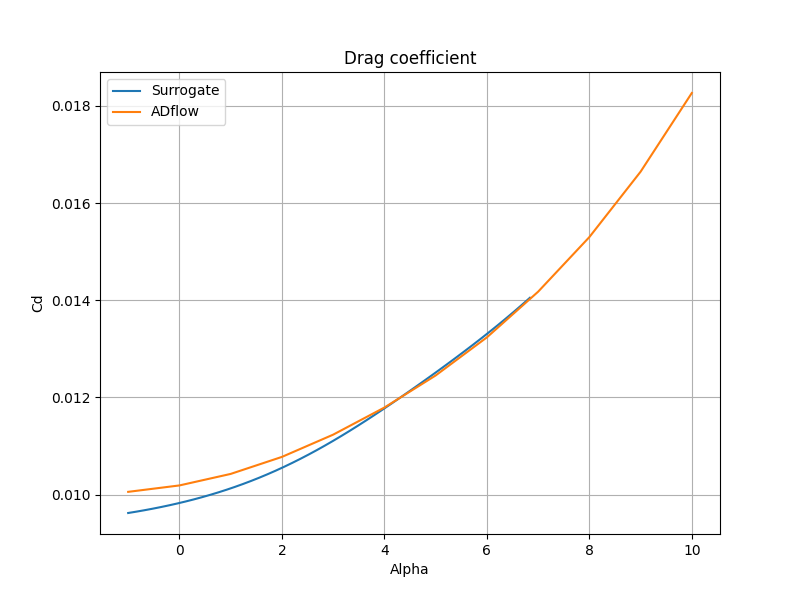

Learning Airfoil Parameters
===========================

This is a tutorial to determine the aerodynamic coefficients of a given airfoil using GENN in SMT (other models could be used as well). 
The obtained surrogate model can be used to give predictions for certain Mach numbers, angles of attack and the aerodynamic coefficients. 
These calculations can be really useful in case of an airfoil shape optimization. The input parameters uses the airfoil Camber and Thickness mode shapes.

* Inputs: Airfoil Camber and Thickness mode shapes, Mach, alpha
* Outputs (options): cd, cl, cm

In this test case, we will be predicting only the Cd coefficient. However, the other databases for the prediction of the 
other terms are available in the same repository. Bouhlels mSANN uses the information contained in the paper [1]_ to determine 
the airfoil's mode shapes. Moreover, in mSANN a deep neural network is used to predict the Cd parameter of a given parametrized
airfoil. Therefore, in this tutorial, we reproduce the paper [2]_ using the Gradient-Enhanced Neural Networks (GENN) from SMT. 

Briefly explaining how mSANN generates the mode shapes of a given airfoil:

#. Using inverse distance weighting (IDW) to interpolate the surface function of each airfoil.
#. Then applying singular value decomposition (SVD) to reduce the number of variables that define the airfoil geometry. It includes a total of 14 airfoil modes (seven for camber and seven for thickness).
#. Totally 16 input variables, two flow conditions of Mach number (0.3 to 0.6) and the angle of attack (2 degrees to 6 degrees) plus 14 shape coefficients.
#. The output airfoil aerodynamic force coefficients and their respective gradients are computed using ADflow, which solves the RANS equations with a Spalart-Allmaras turbulence model.

References
----------

.. [1] Bouhlel, M. A., He, S., & Martins, J. R. (2020). Scalable gradient–enhanced artificial neural networks for airfoil shape design in the subsonic and transonic regimes. Structural and Multidisciplinary Optimization, 61(4), 1363-1376.
.. [2] Bouhlel, M. A., He, S., and Martins, J. R. R. A., mSANN Model Benchmarks, Mendeley Data, 2019. https://doi.org/10. 17632/ngpd634smf.1.
.. [3] Li, J., Bouhlel, M. A., & Martins, J. R. (2019). Data-based approach for fast airfoil analysis and optimization. AIAA Journal, 57(2), 581-596.
.. [4] Bouhlel, M. A., & Martins, J. R. (2019). Gradient-enhanced kriging for high-dimensional problems. Engineering with Computers, 35(1), 157-173.
.. [5] Du, X., He, P., & Martins, J. R. (2021). Rapid airfoil design optimization via neural networks-based parameterization and surrogate modeling. Aerospace Science and Technology, 113, 106701.
.. [6] University of Michigan, Webfoil, 2021. URL http://webfoil.engin.umich.edu/, online accessed on 16 of June 2021.

Implementation
--------------

Utilities
^^^^^^^^^

.. code-block:: python

  import os
  import numpy as np
  import csv
  
  WORKDIR = os.path.dirname(os.path.abspath(__file__))
  
  
  def load_NACA4412_modeshapes():
      return np.loadtxt(open(os.path.join(WORKDIR, "modes_NACA4412_ct.txt")))
  
  
  def load_cd_training_data():
      with open(os.path.join(WORKDIR, "cd_x_y.csv")) as file:
          reader = csv.reader(file, delimiter=";")
          values = np.array(list(reader), dtype=np.float32)
          dim_values = values.shape
          x = values[:, : dim_values[1] - 1]
          y = values[:, -1]
      with open(os.path.join(WORKDIR, "cd_dy.csv")) as file:
          reader = csv.reader(file, delimiter=";")
          dy = np.array(list(reader), dtype=np.float32)
      return x, y, dy
  
  
  def plot_predictions(airfoil_modeshapes, Ma, cd_model):
      import matplotlib
  
      matplotlib.use("Agg")
      import matplotlib.pyplot as plt
  
      # alpha is linearily distributed over the range of -1 to 7 degrees
      # while Ma is kept constant
      inputs = np.zeros(shape=(1, 15))
      inputs[0, :14] = airfoil_modeshapes
      inputs[0, -1] = Ma
      inputs = np.tile(inputs, (50, 1))
  
      alpha = np.atleast_2d([-1 + 0.16 * i for i in range(50)]).T
  
      inputs = np.concatenate((inputs, alpha), axis=1)
  
      # Predict Cd
      cd_pred = cd_model.predict_values(inputs)
  
      # Load ADflow Cd reference
      with open(os.path.join(WORKDIR, "NACA4412-ADflow-alpha-cd.csv")) as file:
          reader = csv.reader(file, delimiter=" ")
          cd_adflow = np.array(list(reader)[1:], dtype=np.float32)
  
      plt.plot(alpha, cd_pred)
      plt.plot(cd_adflow[:, 0], cd_adflow[:, 1])
      plt.grid(True)
      plt.legend(["Surrogate", "ADflow"])
      plt.title("Drag coefficient")
      plt.xlabel("Alpha")
      plt.ylabel("Cd")
      plt.show()
  

Main
^^^^

.. code-block:: python

  """
  Predicting Airfoil Aerodynamics through data by Raul Carreira Rufato and Prof. Joseph Morlier
  """
  
  import os
  import numpy as np
  import csv
  
  from smt.examples.airfoil_parameters.learning_airfoil_parameters import (
      load_cd_training_data,
      load_NACA4412_modeshapes,
      plot_predictions,
  )
  from sklearn.model_selection import train_test_split
  from smt.surrogate_models.genn import GENN, load_smt_data
  
  x, y, dy = load_cd_training_data()
  
  # splitting the dataset
  x_train, x_test, y_train, y_test, dy_train, dy_test = train_test_split(
      x, y, dy, train_size=0.8
  )
  # building and training the GENN
  genn = GENN(print_global=False)
  # learning rate that controls optimizer step size
  genn.options["alpha"] = 0.001
  # lambd = 0. = no regularization, lambd > 0 = regularization
  genn.options["lambd"] = 0.1
  # gamma = 0. = no grad-enhancement, gamma > 0 = grad-enhancement
  genn.options["gamma"] = 1.0
  # number of hidden layers
  genn.options["deep"] = 2
  # number of nodes per hidden layer
  genn.options["wide"] = 6
  # used to divide data into training batches (use for large data sets)
  genn.options["mini_batch_size"] = 256
  # number of passes through data
  genn.options["num_epochs"] = 5
  # number of optimizer iterations per mini-batch
  genn.options["num_iterations"] = 10
  # print output (or not)
  genn.options["is_print"] = False
  # convenience function to read in data that is in SMT format
  load_smt_data(genn, x_train, y_train, dy_train)
  
  genn.train()
  
  ## non-API function to plot training history (to check convergence)
  # genn.plot_training_history()
  ## non-API function to check accuracy of regression
  # genn.goodness_of_fit(x_test, y_test, dy_test)
  
  # API function to predict values at new (unseen) points
  y_pred = genn.predict_values(x_test)
  
  # Now we will use the trained model to make a prediction with a not-learned form.
  # Example Prediction for NACA4412.
  # Airfoil mode shapes should be determined according to Bouhlel, M.A., He, S., and Martins,
  # J.R.R.A., mSANN Model Benchmarks, Mendeley Data, 2019. https://doi.org/10.17632/ngpd634smf.1
  # Comparison of results with Adflow software for an alpha range from -1 to 7 degrees. Re = 3000000
  airfoil_modeshapes = load_NACA4412_modeshapes()
  Ma = 0.3
  alpha = 0
  
  # input in neural network is created out of airfoil mode shapes, Mach number and alpha
  # airfoil_modeshapes: computed mode_shapes of random airfol geometry with parameterise_airfoil
  # Ma: desired Mach number for evaluation in range [0.3,0.6]
  # alpha: scalar in range [-1, 6]
  input = np.zeros(shape=(1, 16))
  input[0, :14] = airfoil_modeshapes
  input[0, 14] = Ma
  input[0, -1] = alpha
  
  # prediction
  cd_pred = genn.predict_values(input)
  print("Drag coefficient prediction (cd): ", cd_pred[0, 0])
  
  plot_predictions(airfoil_modeshapes, Ma, genn)
  
::

  Drag coefficient prediction (cd):  0.01019668488197359
  

