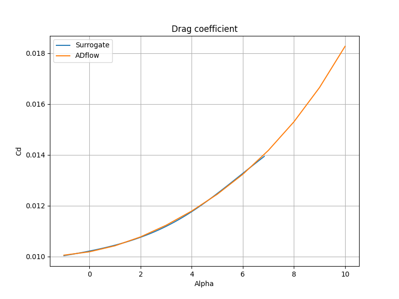

Learning Airfoil Parameters
===========================

This is a tutorial to determine the aerodynamic coefficients of a given airfoil using GENN in SMT (other models could be used as well). 
The obtained surrogate model can be used to give predictions for certain Mach numbers, angles of attack and the aerodynamic coefficients. 
These calculations can be really useful in case of an airfoil shape optimization. The input parameters uses the airfoil Camber and Thickness mode shapes.

* Inputs: Airfoil Camber and Thickness mode shapes, Mach, alpha
* Outputs (options): cd, cl, cm

In this test case, we will be predicting only the Cd coefficient. However, the other databases for the prediction of the 
other terms are available in the same repository. Bouhlels mSANN uses the information contained in the paper [1]_ to determine 
the airfoil's mode shapes. Moreover, in mSANN a deep neural network is used to predict the Cd parameter of a given parametrized
airfoil. Therefore, in this tutorial, we reproduce the paper [2]_ using the Gradient-Enhanced Neural Networks (GENN) from SMT. 

Briefly explaining how mSANN generates the mode shapes of a given airfoil:

#. Using inverse distance weighting (IDW) to interpolate the surface function of each airfoil.
#. Then applying singular value decomposition (SVD) to reduce the number of variables that define the airfoil geometry. It includes a total of 14 airfoil modes (seven for camber and seven for thickness).
#. Totally 16 input variables, two flow conditions of Mach number (0.3 to 0.6) and the angle of attack (2 degrees to 6 degrees) plus 14 shape coefficients.
#. The output airfoil aerodynamic force coefficients and their respective gradients are computed using ADflow, which solves the RANS equations with a Spalart-Allmaras turbulence model.

References
----------

.. [1] Bouhlel, M. A., He, S., & Martins, J. R. (2020). Scalable gradient–enhanced artificial neural networks for airfoil shape design in the subsonic and transonic regimes. Structural and Multidisciplinary Optimization, 61(4), 1363-1376.
.. [2] Bouhlel, M. A., He, S., & Martins, J. R. (2019). mSANN Model Benchmarks, Mendeley Data, https://doi.org/10.17632/ngpd634smf.1.
.. [3] Li, J., Bouhlel, M. A., & Martins, J. R. (2019). Data-based approach for fast airfoil analysis and optimization. AIAA Journal, 57(2), 581-596.
.. [4] Bouhlel, M. A., & Martins, J. R. (2019). Gradient-enhanced kriging for high-dimensional problems. Engineering with Computers, 35(1), 157-173.
.. [5] Du, X., He, P., & Martins, J. R. (2021). Rapid airfoil design optimization via neural networks-based parameterization and surrogate modeling. Aerospace Science and Technology, 113, 106701.
.. [6] University of Michigan, Webfoil, 2021. URL http://webfoil.engin.umich.edu/, online accessed on 16 of June 2021.

Implementation
--------------

Utilities
^^^^^^^^^

.. code-block:: python

  import os
  import numpy as np
  import csv
  
  WORKDIR = os.path.dirname(os.path.abspath(__file__))
  
  
  def load_NACA4412_modeshapes():
      return np.loadtxt(open(os.path.join(WORKDIR, "modes_NACA4412_ct.txt")))
  
  
  def load_cd_training_data():
      with open(os.path.join(WORKDIR, "cd_x_y.csv")) as file:
          reader = csv.reader(file, delimiter=";")
          values = np.array(list(reader), dtype=np.float32)
          dim_values = values.shape
          x = values[:, : dim_values[1] - 1]
          y = values[:, -1]
      with open(os.path.join(WORKDIR, "cd_dy.csv")) as file:
          reader = csv.reader(file, delimiter=";")
          dy = np.array(list(reader), dtype=np.float32)
      return x, y, dy
  
  
  def plot_predictions(airfoil_modeshapes, Ma, cd_model):
      import matplotlib
  
      matplotlib.use("Agg")
      import matplotlib.pyplot as plt
  
      # alpha is linearily distributed over the range of -1 to 7 degrees
      # while Ma is kept constant
      inputs = np.zeros(shape=(1, 15))
      inputs[0, :14] = airfoil_modeshapes
      inputs[0, -1] = Ma
      inputs = np.tile(inputs, (50, 1))
  
      alpha = np.atleast_2d([-1 + 0.16 * i for i in range(50)]).T
  
      inputs = np.concatenate((inputs, alpha), axis=1)
  
      # Predict Cd
      cd_pred = cd_model.predict_values(inputs)
  
      # Load ADflow Cd reference
      with open(os.path.join(WORKDIR, "NACA4412-ADflow-alpha-cd.csv")) as file:
          reader = csv.reader(file, delimiter=" ")
          cd_adflow = np.array(list(reader)[1:], dtype=np.float32)
  
      plt.plot(alpha, cd_pred)
      plt.plot(cd_adflow[:, 0], cd_adflow[:, 1])
      plt.grid(True)
      plt.legend(["Surrogate", "ADflow"])
      plt.title("Drag coefficient")
      plt.xlabel("Alpha")
      plt.ylabel("Cd")
      plt.show()
  

Main
^^^^

.. code-block:: python

  """
  Predicting Airfoil Aerodynamics through data by Raul Carreira Rufato and Prof. Joseph Morlier
  """
  
  import numpy as np
  
  from smt.examples.airfoil_parameters.learning_airfoil_parameters import (
      load_cd_training_data,
      load_NACA4412_modeshapes,
      plot_predictions,
  )
  from sklearn.model_selection import train_test_split
  from smt.surrogate_models.genn import GENN
  
  x, y, dy = load_cd_training_data()
  
  # splitting the dataset
  x_train, x_test, y_train, y_test, dy_train, dy_test = train_test_split(
      x, y, dy, train_size=0.8
  )
  
  # building and training the GENN
  n_x = x_train.shape[-1]
  n_y = 1 
  
  genn = GENN(
      layer_sizes=(
          n_x,  
          12, 12,         
          n_y,  
      ), 
      print_global=False,
  )
  
  # learning rate that controls optimizer step size
  genn.options["alpha"] = 0.05
  # lambd = 0. = no regularization, lambd > 0 = regularization
  genn.options["lambd"] = 0.1
  # gamma = 0. = no grad-enhancement, gamma > 0 = grad-enhancement
  genn.options["gamma"] = 1.0
  # number of hidden layers
  # used to divide data into training batches (use for large data sets)
  genn.options["mini_batch_size"] = 256
  # number of passes through data
  genn.options["num_epochs"] = 5
  # number of optimizer iterations per mini-batch
  genn.options["num_iterations"] = 10
  # print output (or not)
  genn.options["is_print"] = True
  # convenience function to read in data that is in SMT format
  
  genn.load_data(x_train, y_train, dy_train)
  
  genn.train()
  
  ## non-API function to plot training history (to check convergence)
  # genn.plot_training_history()
  ## non-API function to check accuracy of regression
  # genn.goodness_of_fit(x_test, y_test, dy_test)
  
  # API function to predict values at new (unseen) points
  y_pred = genn.predict_values(x_test)
  
  # Now we will use the trained model to make a prediction with a not-learned form.
  # Example Prediction for NACA4412.
  # Airfoil mode shapes should be determined according to Bouhlel, M.A., He, S., and Martins,
  # J.R.R.A., mSANN Model Benchmarks, Mendeley Data, 2019. https://doi.org/10.17632/ngpd634smf.1
  # Comparison of results with Adflow software for an alpha range from -1 to 7 degrees. Re = 3000000
  airfoil_modeshapes = load_NACA4412_modeshapes()
  Ma = 0.3
  alpha = 0
  
  # input in neural network is created out of airfoil mode shapes, Mach number and alpha
  # airfoil_modeshapes: computed mode_shapes of random airfol geometry with parameterise_airfoil
  # Ma: desired Mach number for evaluation in range [0.3,0.6]
  # alpha: scalar in range [-1, 6]
  input = np.zeros(shape=(1, 16))
  input[0, :14] = airfoil_modeshapes
  input[0, 14] = Ma
  input[0, -1] = alpha
  
  # prediction
  cd_pred = genn.predict_values(input)
  print("Drag coefficient prediction (cd): ", cd_pred[0, 0])
  
  plot_predictions(airfoil_modeshapes, Ma, genn)
  
::

  epoch = 0, batch = 0, iter = 0, cost =  0.085
  epoch = 0, batch = 0, iter = 1, cost =  0.053
  epoch = 0, batch = 0, iter = 2, cost =  0.054
  epoch = 0, batch = 0, iter = 3, cost =  0.065
  epoch = 0, batch = 0, iter = 4, cost =  0.040
  epoch = 0, batch = 0, iter = 5, cost =  0.036
  epoch = 0, batch = 0, iter = 6, cost =  0.028
  epoch = 0, batch = 0, iter = 7, cost =  0.027
  epoch = 0, batch = 0, iter = 8, cost =  0.026
  epoch = 0, batch = 0, iter = 9, cost =  0.026
  epoch = 0, batch = 1, iter = 0, cost =  0.086
  epoch = 0, batch = 1, iter = 1, cost =  0.038
  epoch = 0, batch = 1, iter = 2, cost =  0.031
  epoch = 0, batch = 1, iter = 3, cost =  0.027
  epoch = 0, batch = 1, iter = 4, cost =  0.026
  epoch = 0, batch = 1, iter = 5, cost =  0.027
  epoch = 0, batch = 1, iter = 6, cost =  0.025
  epoch = 0, batch = 1, iter = 7, cost =  0.024
  epoch = 0, batch = 1, iter = 8, cost =  0.023
  epoch = 0, batch = 1, iter = 9, cost =  0.023
  epoch = 0, batch = 2, iter = 0, cost =  0.084
  epoch = 0, batch = 2, iter = 1, cost =  0.036
  epoch = 0, batch = 2, iter = 2, cost =  0.029
  epoch = 0, batch = 2, iter = 3, cost =  0.024
  epoch = 0, batch = 2, iter = 4, cost =  0.024
  epoch = 0, batch = 2, iter = 5, cost =  0.024
  epoch = 0, batch = 2, iter = 6, cost =  0.023
  epoch = 0, batch = 2, iter = 7, cost =  0.023
  epoch = 0, batch = 2, iter = 8, cost =  0.022
  epoch = 0, batch = 2, iter = 9, cost =  0.022
  epoch = 0, batch = 3, iter = 0, cost =  0.081
  epoch = 0, batch = 3, iter = 1, cost =  0.033
  epoch = 0, batch = 3, iter = 2, cost =  0.031
  epoch = 0, batch = 3, iter = 3, cost =  0.023
  epoch = 0, batch = 3, iter = 4, cost =  0.022
  epoch = 0, batch = 3, iter = 5, cost =  0.021
  epoch = 0, batch = 3, iter = 6, cost =  0.021
  epoch = 0, batch = 3, iter = 7, cost =  0.020
  epoch = 0, batch = 3, iter = 8, cost =  0.020
  epoch = 0, batch = 3, iter = 9, cost =  0.020
  epoch = 0, batch = 4, iter = 0, cost =  0.077
  epoch = 0, batch = 4, iter = 1, cost =  0.031
  epoch = 0, batch = 4, iter = 2, cost =  0.028
  epoch = 0, batch = 4, iter = 3, cost =  0.018
  epoch = 0, batch = 4, iter = 4, cost =  0.017
  epoch = 0, batch = 4, iter = 5, cost =  0.017
  epoch = 0, batch = 4, iter = 6, cost =  0.016
  epoch = 0, batch = 4, iter = 7, cost =  0.016
  epoch = 0, batch = 4, iter = 8, cost =  0.015
  epoch = 0, batch = 4, iter = 9, cost =  0.015
  epoch = 0, batch = 5, iter = 0, cost =  0.077
  epoch = 0, batch = 5, iter = 1, cost =  0.030
  epoch = 0, batch = 5, iter = 2, cost =  0.026
  epoch = 0, batch = 5, iter = 3, cost =  0.017
  epoch = 0, batch = 5, iter = 4, cost =  0.017
  epoch = 0, batch = 5, iter = 5, cost =  0.016
  epoch = 0, batch = 5, iter = 6, cost =  0.016
  epoch = 0, batch = 5, iter = 7, cost =  0.014
  epoch = 0, batch = 5, iter = 8, cost =  0.014
  epoch = 0, batch = 5, iter = 9, cost =  0.014
  epoch = 0, batch = 6, iter = 0, cost =  0.084
  epoch = 0, batch = 6, iter = 1, cost =  0.037
  epoch = 0, batch = 6, iter = 2, cost =  0.034
  epoch = 0, batch = 6, iter = 3, cost =  0.026
  epoch = 0, batch = 6, iter = 4, cost =  0.025
  epoch = 0, batch = 6, iter = 5, cost =  0.025
  epoch = 0, batch = 6, iter = 6, cost =  0.024
  epoch = 0, batch = 6, iter = 7, cost =  0.023
  epoch = 0, batch = 6, iter = 8, cost =  0.023
  epoch = 0, batch = 6, iter = 9, cost =  0.022
  epoch = 0, batch = 7, iter = 0, cost =  0.080
  epoch = 0, batch = 7, iter = 1, cost =  0.033
  epoch = 0, batch = 7, iter = 2, cost =  0.026
  epoch = 0, batch = 7, iter = 3, cost =  0.020
  epoch = 0, batch = 7, iter = 4, cost =  0.019
  epoch = 0, batch = 7, iter = 5, cost =  0.018
  epoch = 0, batch = 7, iter = 6, cost =  0.018
  epoch = 0, batch = 7, iter = 7, cost =  0.017
  epoch = 0, batch = 7, iter = 8, cost =  0.017
  epoch = 0, batch = 7, iter = 9, cost =  0.017
  epoch = 0, batch = 8, iter = 0, cost =  0.080
  epoch = 0, batch = 8, iter = 1, cost =  0.032
  epoch = 0, batch = 8, iter = 2, cost =  0.027
  epoch = 0, batch = 8, iter = 3, cost =  0.020
  epoch = 0, batch = 8, iter = 4, cost =  0.020
  epoch = 0, batch = 8, iter = 5, cost =  0.019
  epoch = 0, batch = 8, iter = 6, cost =  0.019
  epoch = 0, batch = 8, iter = 7, cost =  0.018
  epoch = 0, batch = 8, iter = 8, cost =  0.018
  epoch = 0, batch = 8, iter = 9, cost =  0.017
  epoch = 0, batch = 9, iter = 0, cost =  0.087
  epoch = 0, batch = 9, iter = 1, cost =  0.041
  epoch = 0, batch = 9, iter = 2, cost =  0.037
  epoch = 0, batch = 9, iter = 3, cost =  0.029
  epoch = 0, batch = 9, iter = 4, cost =  0.028
  epoch = 0, batch = 9, iter = 5, cost =  0.027
  epoch = 0, batch = 9, iter = 6, cost =  0.026
  epoch = 0, batch = 9, iter = 7, cost =  0.025
  epoch = 0, batch = 9, iter = 8, cost =  0.025
  epoch = 0, batch = 9, iter = 9, cost =  0.025
  epoch = 0, batch = 10, iter = 0, cost =  0.080
  epoch = 0, batch = 10, iter = 1, cost =  0.036
  epoch = 0, batch = 10, iter = 2, cost =  0.030
  epoch = 0, batch = 10, iter = 3, cost =  0.021
  epoch = 0, batch = 10, iter = 4, cost =  0.021
  epoch = 0, batch = 10, iter = 5, cost =  0.020
  epoch = 0, batch = 10, iter = 6, cost =  0.020
  epoch = 0, batch = 10, iter = 7, cost =  0.018
  epoch = 0, batch = 10, iter = 8, cost =  0.018
  epoch = 0, batch = 10, iter = 9, cost =  0.018
  epoch = 0, batch = 11, iter = 0, cost =  0.080
  epoch = 0, batch = 11, iter = 1, cost =  0.033
  epoch = 0, batch = 11, iter = 2, cost =  0.029
  epoch = 0, batch = 11, iter = 3, cost =  0.020
  epoch = 0, batch = 11, iter = 4, cost =  0.019
  epoch = 0, batch = 11, iter = 5, cost =  0.018
  epoch = 0, batch = 11, iter = 6, cost =  0.018
  epoch = 0, batch = 11, iter = 7, cost =  0.017
  epoch = 0, batch = 11, iter = 8, cost =  0.017
  epoch = 0, batch = 11, iter = 9, cost =  0.017
  epoch = 0, batch = 12, iter = 0, cost =  0.078
  epoch = 0, batch = 12, iter = 1, cost =  0.033
  epoch = 0, batch = 12, iter = 2, cost =  0.029
  epoch = 0, batch = 12, iter = 3, cost =  0.019
  epoch = 0, batch = 12, iter = 4, cost =  0.019
  epoch = 0, batch = 12, iter = 5, cost =  0.018
  epoch = 0, batch = 12, iter = 6, cost =  0.017
  epoch = 0, batch = 12, iter = 7, cost =  0.017
  epoch = 0, batch = 12, iter = 8, cost =  0.016
  epoch = 0, batch = 12, iter = 9, cost =  0.016
  epoch = 0, batch = 13, iter = 0, cost =  0.082
  epoch = 0, batch = 13, iter = 1, cost =  0.036
  epoch = 0, batch = 13, iter = 2, cost =  0.031
  epoch = 0, batch = 13, iter = 3, cost =  0.023
  epoch = 0, batch = 13, iter = 4, cost =  0.022
  epoch = 0, batch = 13, iter = 5, cost =  0.022
  epoch = 0, batch = 13, iter = 6, cost =  0.022
  epoch = 0, batch = 13, iter = 7, cost =  0.021
  epoch = 0, batch = 13, iter = 8, cost =  0.021
  epoch = 0, batch = 13, iter = 9, cost =  0.020
  epoch = 0, batch = 14, iter = 0, cost =  0.077
  epoch = 0, batch = 14, iter = 1, cost =  0.030
  epoch = 0, batch = 14, iter = 2, cost =  0.022
  epoch = 0, batch = 14, iter = 3, cost =  0.018
  epoch = 0, batch = 14, iter = 4, cost =  0.018
  epoch = 0, batch = 14, iter = 5, cost =  0.017
  epoch = 0, batch = 14, iter = 6, cost =  0.016
  epoch = 0, batch = 14, iter = 7, cost =  0.015
  epoch = 0, batch = 14, iter = 8, cost =  0.015
  epoch = 0, batch = 14, iter = 9, cost =  0.014
  epoch = 0, batch = 15, iter = 0, cost =  0.088
  epoch = 0, batch = 15, iter = 1, cost =  0.041
  epoch = 0, batch = 15, iter = 2, cost =  0.032
  epoch = 0, batch = 15, iter = 3, cost =  0.029
  epoch = 0, batch = 15, iter = 4, cost =  0.028
  epoch = 0, batch = 15, iter = 5, cost =  0.026
  epoch = 0, batch = 15, iter = 6, cost =  0.026
  epoch = 0, batch = 15, iter = 7, cost =  0.025
  epoch = 0, batch = 15, iter = 8, cost =  0.024
  epoch = 0, batch = 15, iter = 9, cost =  0.024
  epoch = 0, batch = 16, iter = 0, cost =  0.087
  epoch = 0, batch = 16, iter = 1, cost =  0.041
  epoch = 0, batch = 16, iter = 2, cost =  0.035
  epoch = 0, batch = 16, iter = 3, cost =  0.028
  epoch = 0, batch = 16, iter = 4, cost =  0.027
  epoch = 0, batch = 16, iter = 5, cost =  0.027
  epoch = 0, batch = 16, iter = 6, cost =  0.027
  epoch = 0, batch = 16, iter = 7, cost =  0.025
  epoch = 0, batch = 16, iter = 8, cost =  0.025
  epoch = 0, batch = 16, iter = 9, cost =  0.025
  epoch = 0, batch = 17, iter = 0, cost =  0.078
  epoch = 0, batch = 17, iter = 1, cost =  0.034
  epoch = 0, batch = 17, iter = 2, cost =  0.027
  epoch = 0, batch = 17, iter = 3, cost =  0.020
  epoch = 0, batch = 17, iter = 4, cost =  0.019
  epoch = 0, batch = 17, iter = 5, cost =  0.018
  epoch = 0, batch = 17, iter = 6, cost =  0.018
  epoch = 0, batch = 17, iter = 7, cost =  0.016
  epoch = 0, batch = 17, iter = 8, cost =  0.016
  epoch = 0, batch = 17, iter = 9, cost =  0.016
  epoch = 0, batch = 18, iter = 0, cost =  0.079
  epoch = 0, batch = 18, iter = 1, cost =  0.034
  epoch = 0, batch = 18, iter = 2, cost =  0.028
  epoch = 0, batch = 18, iter = 3, cost =  0.020
  epoch = 0, batch = 18, iter = 4, cost =  0.019
  epoch = 0, batch = 18, iter = 5, cost =  0.019
  epoch = 0, batch = 18, iter = 6, cost =  0.019
  epoch = 0, batch = 18, iter = 7, cost =  0.018
  epoch = 0, batch = 18, iter = 8, cost =  0.018
  epoch = 0, batch = 18, iter = 9, cost =  0.017
  epoch = 0, batch = 19, iter = 0, cost =  0.083
  epoch = 0, batch = 19, iter = 1, cost =  0.038
  epoch = 0, batch = 19, iter = 2, cost =  0.033
  epoch = 0, batch = 19, iter = 3, cost =  0.024
  epoch = 0, batch = 19, iter = 4, cost =  0.022
  epoch = 0, batch = 19, iter = 5, cost =  0.022
  epoch = 0, batch = 19, iter = 6, cost =  0.021
  epoch = 0, batch = 19, iter = 7, cost =  0.020
  epoch = 0, batch = 19, iter = 8, cost =  0.020
  epoch = 0, batch = 19, iter = 9, cost =  0.020
  epoch = 0, batch = 20, iter = 0, cost =  0.078
  epoch = 0, batch = 20, iter = 1, cost =  0.033
  epoch = 0, batch = 20, iter = 2, cost =  0.027
  epoch = 0, batch = 20, iter = 3, cost =  0.019
  epoch = 0, batch = 20, iter = 4, cost =  0.018
  epoch = 0, batch = 20, iter = 5, cost =  0.017
  epoch = 0, batch = 20, iter = 6, cost =  0.017
  epoch = 0, batch = 20, iter = 7, cost =  0.016
  epoch = 0, batch = 20, iter = 8, cost =  0.016
  epoch = 0, batch = 20, iter = 9, cost =  0.015
  epoch = 0, batch = 21, iter = 0, cost =  0.076
  epoch = 0, batch = 21, iter = 1, cost =  0.031
  epoch = 0, batch = 21, iter = 2, cost =  0.025
  epoch = 0, batch = 21, iter = 3, cost =  0.017
  epoch = 0, batch = 21, iter = 4, cost =  0.016
  epoch = 0, batch = 21, iter = 5, cost =  0.015
  epoch = 0, batch = 21, iter = 6, cost =  0.015
  epoch = 0, batch = 21, iter = 7, cost =  0.014
  epoch = 0, batch = 21, iter = 8, cost =  0.014
  epoch = 0, batch = 21, iter = 9, cost =  0.014
  epoch = 0, batch = 22, iter = 0, cost =  0.083
  epoch = 0, batch = 22, iter = 1, cost =  0.038
  epoch = 0, batch = 22, iter = 2, cost =  0.033
  epoch = 0, batch = 22, iter = 3, cost =  0.025
  epoch = 0, batch = 22, iter = 4, cost =  0.024
  epoch = 0, batch = 22, iter = 5, cost =  0.023
  epoch = 0, batch = 22, iter = 6, cost =  0.023
  epoch = 0, batch = 22, iter = 7, cost =  0.022
  epoch = 0, batch = 22, iter = 8, cost =  0.022
  epoch = 0, batch = 22, iter = 9, cost =  0.021
  epoch = 0, batch = 23, iter = 0, cost =  0.082
  epoch = 0, batch = 23, iter = 1, cost =  0.037
  epoch = 0, batch = 23, iter = 2, cost =  0.032
  epoch = 0, batch = 23, iter = 3, cost =  0.023
  epoch = 0, batch = 23, iter = 4, cost =  0.022
  epoch = 0, batch = 23, iter = 5, cost =  0.021
  epoch = 0, batch = 23, iter = 6, cost =  0.021
  epoch = 0, batch = 23, iter = 7, cost =  0.020
  epoch = 0, batch = 23, iter = 8, cost =  0.019
  epoch = 0, batch = 23, iter = 9, cost =  0.019
  epoch = 0, batch = 24, iter = 0, cost =  0.083
  epoch = 0, batch = 24, iter = 1, cost =  0.038
  epoch = 0, batch = 24, iter = 2, cost =  0.034
  epoch = 0, batch = 24, iter = 3, cost =  0.025
  epoch = 0, batch = 24, iter = 4, cost =  0.024
  epoch = 0, batch = 24, iter = 5, cost =  0.023
  epoch = 0, batch = 24, iter = 6, cost =  0.023
  epoch = 0, batch = 24, iter = 7, cost =  0.022
  epoch = 0, batch = 24, iter = 8, cost =  0.022
  epoch = 0, batch = 24, iter = 9, cost =  0.021
  epoch = 0, batch = 25, iter = 0, cost =  0.077
  epoch = 0, batch = 25, iter = 1, cost =  0.033
  epoch = 0, batch = 25, iter = 2, cost =  0.028
  epoch = 0, batch = 25, iter = 3, cost =  0.018
  epoch = 0, batch = 25, iter = 4, cost =  0.017
  epoch = 0, batch = 25, iter = 5, cost =  0.016
  epoch = 0, batch = 25, iter = 6, cost =  0.016
  epoch = 0, batch = 25, iter = 7, cost =  0.015
  epoch = 0, batch = 25, iter = 8, cost =  0.015
  epoch = 0, batch = 25, iter = 9, cost =  0.014
  epoch = 0, batch = 26, iter = 0, cost =  0.088
  epoch = 0, batch = 26, iter = 1, cost =  0.043
  epoch = 0, batch = 26, iter = 2, cost =  0.037
  epoch = 0, batch = 26, iter = 3, cost =  0.030
  epoch = 0, batch = 26, iter = 4, cost =  0.028
  epoch = 0, batch = 26, iter = 5, cost =  0.028
  epoch = 0, batch = 26, iter = 6, cost =  0.027
  epoch = 0, batch = 26, iter = 7, cost =  0.027
  epoch = 0, batch = 26, iter = 8, cost =  0.026
  epoch = 0, batch = 26, iter = 9, cost =  0.026
  epoch = 0, batch = 27, iter = 0, cost =  0.084
  epoch = 0, batch = 27, iter = 1, cost =  0.038
  epoch = 0, batch = 27, iter = 2, cost =  0.033
  epoch = 0, batch = 27, iter = 3, cost =  0.025
  epoch = 0, batch = 27, iter = 4, cost =  0.024
  epoch = 0, batch = 27, iter = 5, cost =  0.023
  epoch = 0, batch = 27, iter = 6, cost =  0.023
  epoch = 0, batch = 27, iter = 7, cost =  0.022
  epoch = 0, batch = 27, iter = 8, cost =  0.022
  epoch = 0, batch = 27, iter = 9, cost =  0.021
  epoch = 0, batch = 28, iter = 0, cost =  0.085
  epoch = 0, batch = 28, iter = 1, cost =  0.039
  epoch = 0, batch = 28, iter = 2, cost =  0.032
  epoch = 0, batch = 28, iter = 3, cost =  0.025
  epoch = 0, batch = 28, iter = 4, cost =  0.024
  epoch = 0, batch = 28, iter = 5, cost =  0.023
  epoch = 0, batch = 28, iter = 6, cost =  0.023
  epoch = 0, batch = 28, iter = 7, cost =  0.022
  epoch = 0, batch = 28, iter = 8, cost =  0.022
  epoch = 0, batch = 28, iter = 9, cost =  0.021
  epoch = 0, batch = 29, iter = 0, cost =  0.078
  epoch = 0, batch = 29, iter = 1, cost =  0.031
  epoch = 0, batch = 29, iter = 2, cost =  0.026
  epoch = 0, batch = 29, iter = 3, cost =  0.018
  epoch = 0, batch = 29, iter = 4, cost =  0.017
  epoch = 0, batch = 29, iter = 5, cost =  0.016
  epoch = 0, batch = 29, iter = 6, cost =  0.016
  epoch = 0, batch = 29, iter = 7, cost =  0.015
  epoch = 0, batch = 29, iter = 8, cost =  0.015
  epoch = 0, batch = 29, iter = 9, cost =  0.014
  epoch = 0, batch = 30, iter = 0, cost =  0.083
  epoch = 0, batch = 30, iter = 1, cost =  0.038
  epoch = 0, batch = 30, iter = 2, cost =  0.034
  epoch = 0, batch = 30, iter = 3, cost =  0.024
  epoch = 0, batch = 30, iter = 4, cost =  0.023
  epoch = 0, batch = 30, iter = 5, cost =  0.022
  epoch = 0, batch = 30, iter = 6, cost =  0.022
  epoch = 0, batch = 30, iter = 7, cost =  0.021
  epoch = 0, batch = 30, iter = 8, cost =  0.021
  epoch = 0, batch = 30, iter = 9, cost =  0.020
  epoch = 0, batch = 31, iter = 0, cost =  0.088
  epoch = 0, batch = 31, iter = 1, cost =  0.044
  epoch = 0, batch = 31, iter = 2, cost =  0.040
  epoch = 0, batch = 31, iter = 3, cost =  0.031
  epoch = 0, batch = 31, iter = 4, cost =  0.030
  epoch = 0, batch = 31, iter = 5, cost =  0.029
  epoch = 0, batch = 31, iter = 6, cost =  0.028
  epoch = 0, batch = 31, iter = 7, cost =  0.027
  epoch = 0, batch = 31, iter = 8, cost =  0.027
  epoch = 0, batch = 31, iter = 9, cost =  0.026
  epoch = 0, batch = 32, iter = 0, cost =  0.081
  epoch = 0, batch = 32, iter = 1, cost =  0.037
  epoch = 0, batch = 32, iter = 2, cost =  0.031
  epoch = 0, batch = 32, iter = 3, cost =  0.023
  epoch = 0, batch = 32, iter = 4, cost =  0.022
  epoch = 0, batch = 32, iter = 5, cost =  0.021
  epoch = 0, batch = 32, iter = 6, cost =  0.021
  epoch = 0, batch = 32, iter = 7, cost =  0.020
  epoch = 0, batch = 32, iter = 8, cost =  0.020
  epoch = 0, batch = 32, iter = 9, cost =  0.019
  epoch = 0, batch = 33, iter = 0, cost =  0.088
  epoch = 0, batch = 33, iter = 1, cost =  0.043
  epoch = 0, batch = 33, iter = 2, cost =  0.039
  epoch = 0, batch = 33, iter = 3, cost =  0.030
  epoch = 0, batch = 33, iter = 4, cost =  0.030
  epoch = 0, batch = 33, iter = 5, cost =  0.029
  epoch = 0, batch = 33, iter = 6, cost =  0.029
  epoch = 0, batch = 33, iter = 7, cost =  0.027
  epoch = 0, batch = 33, iter = 8, cost =  0.027
  epoch = 0, batch = 33, iter = 9, cost =  0.027
  epoch = 0, batch = 34, iter = 0, cost =  0.081
  epoch = 0, batch = 34, iter = 1, cost =  0.038
  epoch = 0, batch = 34, iter = 2, cost =  0.029
  epoch = 0, batch = 34, iter = 3, cost =  0.023
  epoch = 0, batch = 34, iter = 4, cost =  0.021
  epoch = 0, batch = 34, iter = 5, cost =  0.021
  epoch = 0, batch = 34, iter = 6, cost =  0.020
  epoch = 0, batch = 34, iter = 7, cost =  0.019
  epoch = 0, batch = 34, iter = 8, cost =  0.019
  epoch = 0, batch = 34, iter = 9, cost =  0.018
  epoch = 0, batch = 35, iter = 0, cost =  0.078
  epoch = 0, batch = 35, iter = 1, cost =  0.033
  epoch = 0, batch = 35, iter = 2, cost =  0.027
  epoch = 0, batch = 35, iter = 3, cost =  0.020
  epoch = 0, batch = 35, iter = 4, cost =  0.019
  epoch = 0, batch = 35, iter = 5, cost =  0.019
  epoch = 0, batch = 35, iter = 6, cost =  0.018
  epoch = 0, batch = 35, iter = 7, cost =  0.017
  epoch = 0, batch = 35, iter = 8, cost =  0.017
  epoch = 0, batch = 35, iter = 9, cost =  0.017
  epoch = 0, batch = 36, iter = 0, cost =  0.082
  epoch = 0, batch = 36, iter = 1, cost =  0.036
  epoch = 0, batch = 36, iter = 2, cost =  0.030
  epoch = 0, batch = 36, iter = 3, cost =  0.022
  epoch = 0, batch = 36, iter = 4, cost =  0.020
  epoch = 0, batch = 36, iter = 5, cost =  0.020
  epoch = 0, batch = 36, iter = 6, cost =  0.019
  epoch = 0, batch = 36, iter = 7, cost =  0.019
  epoch = 0, batch = 36, iter = 8, cost =  0.018
  epoch = 0, batch = 36, iter = 9, cost =  0.018
  epoch = 0, batch = 37, iter = 0, cost =  0.081
  epoch = 0, batch = 37, iter = 1, cost =  0.035
  epoch = 0, batch = 37, iter = 2, cost =  0.029
  epoch = 0, batch = 37, iter = 3, cost =  0.022
  epoch = 0, batch = 37, iter = 4, cost =  0.021
  epoch = 0, batch = 37, iter = 5, cost =  0.020
  epoch = 0, batch = 37, iter = 6, cost =  0.019
  epoch = 0, batch = 37, iter = 7, cost =  0.019
  epoch = 0, batch = 37, iter = 8, cost =  0.018
  epoch = 0, batch = 37, iter = 9, cost =  0.018
  epoch = 0, batch = 38, iter = 0, cost =  0.076
  epoch = 0, batch = 38, iter = 1, cost =  0.030
  epoch = 0, batch = 38, iter = 2, cost =  0.024
  epoch = 0, batch = 38, iter = 3, cost =  0.017
  epoch = 0, batch = 38, iter = 4, cost =  0.016
  epoch = 0, batch = 38, iter = 5, cost =  0.015
  epoch = 0, batch = 38, iter = 6, cost =  0.015
  epoch = 0, batch = 38, iter = 7, cost =  0.014
  epoch = 0, batch = 38, iter = 8, cost =  0.014
  epoch = 0, batch = 38, iter = 9, cost =  0.014
  epoch = 0, batch = 39, iter = 0, cost =  0.088
  epoch = 0, batch = 39, iter = 1, cost =  0.043
  epoch = 0, batch = 39, iter = 2, cost =  0.037
  epoch = 0, batch = 39, iter = 3, cost =  0.029
  epoch = 0, batch = 39, iter = 4, cost =  0.028
  epoch = 0, batch = 39, iter = 5, cost =  0.027
  epoch = 0, batch = 39, iter = 6, cost =  0.026
  epoch = 0, batch = 39, iter = 7, cost =  0.025
  epoch = 0, batch = 39, iter = 8, cost =  0.025
  epoch = 0, batch = 39, iter = 9, cost =  0.024
  epoch = 0, batch = 40, iter = 0, cost =  0.086
  epoch = 0, batch = 40, iter = 1, cost =  0.040
  epoch = 0, batch = 40, iter = 2, cost =  0.039
  epoch = 0, batch = 40, iter = 3, cost =  0.028
  epoch = 0, batch = 40, iter = 4, cost =  0.026
  epoch = 0, batch = 40, iter = 5, cost =  0.026
  epoch = 0, batch = 40, iter = 6, cost =  0.025
  epoch = 0, batch = 40, iter = 7, cost =  0.025
  epoch = 0, batch = 40, iter = 8, cost =  0.024
  epoch = 0, batch = 40, iter = 9, cost =  0.024
  epoch = 0, batch = 41, iter = 0, cost =  0.082
  epoch = 0, batch = 41, iter = 1, cost =  0.039
  epoch = 0, batch = 41, iter = 2, cost =  0.031
  epoch = 0, batch = 41, iter = 3, cost =  0.023
  epoch = 0, batch = 41, iter = 4, cost =  0.022
  epoch = 0, batch = 41, iter = 5, cost =  0.021
  epoch = 0, batch = 41, iter = 6, cost =  0.021
  epoch = 0, batch = 41, iter = 7, cost =  0.020
  epoch = 0, batch = 41, iter = 8, cost =  0.020
  epoch = 0, batch = 41, iter = 9, cost =  0.020
  epoch = 0, batch = 42, iter = 0, cost =  0.082
  epoch = 0, batch = 42, iter = 1, cost =  0.035
  epoch = 0, batch = 42, iter = 2, cost =  0.029
  epoch = 0, batch = 42, iter = 3, cost =  0.022
  epoch = 0, batch = 42, iter = 4, cost =  0.021
  epoch = 0, batch = 42, iter = 5, cost =  0.021
  epoch = 0, batch = 42, iter = 6, cost =  0.020
  epoch = 0, batch = 42, iter = 7, cost =  0.019
  epoch = 0, batch = 42, iter = 8, cost =  0.019
  epoch = 0, batch = 42, iter = 9, cost =  0.019
  epoch = 0, batch = 43, iter = 0, cost =  0.079
  epoch = 0, batch = 43, iter = 1, cost =  0.033
  epoch = 0, batch = 43, iter = 2, cost =  0.029
  epoch = 0, batch = 43, iter = 3, cost =  0.020
  epoch = 0, batch = 43, iter = 4, cost =  0.019
  epoch = 0, batch = 43, iter = 5, cost =  0.018
  epoch = 0, batch = 43, iter = 6, cost =  0.018
  epoch = 0, batch = 43, iter = 7, cost =  0.017
  epoch = 0, batch = 43, iter = 8, cost =  0.017
  epoch = 0, batch = 43, iter = 9, cost =  0.016
  epoch = 0, batch = 44, iter = 0, cost =  0.084
  epoch = 0, batch = 44, iter = 1, cost =  0.040
  epoch = 0, batch = 44, iter = 2, cost =  0.037
  epoch = 0, batch = 44, iter = 3, cost =  0.027
  epoch = 0, batch = 44, iter = 4, cost =  0.026
  epoch = 0, batch = 44, iter = 5, cost =  0.025
  epoch = 0, batch = 44, iter = 6, cost =  0.025
  epoch = 0, batch = 44, iter = 7, cost =  0.024
  epoch = 0, batch = 44, iter = 8, cost =  0.024
  epoch = 0, batch = 44, iter = 9, cost =  0.024
  epoch = 0, batch = 45, iter = 0, cost =  0.083
  epoch = 0, batch = 45, iter = 1, cost =  0.039
  epoch = 0, batch = 45, iter = 2, cost =  0.034
  epoch = 0, batch = 45, iter = 3, cost =  0.024
  epoch = 0, batch = 45, iter = 4, cost =  0.023
  epoch = 0, batch = 45, iter = 5, cost =  0.023
  epoch = 0, batch = 45, iter = 6, cost =  0.022
  epoch = 0, batch = 45, iter = 7, cost =  0.021
  epoch = 0, batch = 45, iter = 8, cost =  0.021
  epoch = 0, batch = 45, iter = 9, cost =  0.020
  epoch = 0, batch = 46, iter = 0, cost =  0.086
  epoch = 0, batch = 46, iter = 1, cost =  0.042
  epoch = 0, batch = 46, iter = 2, cost =  0.036
  epoch = 0, batch = 46, iter = 3, cost =  0.029
  epoch = 0, batch = 46, iter = 4, cost =  0.029
  epoch = 0, batch = 46, iter = 5, cost =  0.028
  epoch = 0, batch = 46, iter = 6, cost =  0.028
  epoch = 0, batch = 46, iter = 7, cost =  0.026
  epoch = 0, batch = 46, iter = 8, cost =  0.026
  epoch = 0, batch = 46, iter = 9, cost =  0.025
  epoch = 0, batch = 47, iter = 0, cost =  0.076
  epoch = 0, batch = 47, iter = 1, cost =  0.030
  epoch = 0, batch = 47, iter = 2, cost =  0.023
  epoch = 0, batch = 47, iter = 3, cost =  0.017
  epoch = 0, batch = 47, iter = 4, cost =  0.016
  epoch = 0, batch = 47, iter = 5, cost =  0.015
  epoch = 0, batch = 47, iter = 6, cost =  0.014
  epoch = 0, batch = 47, iter = 7, cost =  0.014
  epoch = 0, batch = 47, iter = 8, cost =  0.014
  epoch = 0, batch = 47, iter = 9, cost =  0.013
  epoch = 0, batch = 48, iter = 0, cost =  0.077
  epoch = 0, batch = 48, iter = 1, cost =  0.029
  epoch = 0, batch = 48, iter = 2, cost =  0.022
  epoch = 0, batch = 48, iter = 3, cost =  0.016
  epoch = 0, batch = 48, iter = 4, cost =  0.015
  epoch = 0, batch = 48, iter = 5, cost =  0.014
  epoch = 0, batch = 48, iter = 6, cost =  0.014
  epoch = 0, batch = 48, iter = 7, cost =  0.013
  epoch = 0, batch = 48, iter = 8, cost =  0.013
  epoch = 0, batch = 48, iter = 9, cost =  0.013
  epoch = 0, batch = 49, iter = 0, cost =  0.077
  epoch = 0, batch = 49, iter = 1, cost =  0.032
  epoch = 0, batch = 49, iter = 2, cost =  0.026
  epoch = 0, batch = 49, iter = 3, cost =  0.019
  epoch = 0, batch = 49, iter = 4, cost =  0.017
  epoch = 0, batch = 49, iter = 5, cost =  0.016
  epoch = 0, batch = 49, iter = 6, cost =  0.016
  epoch = 0, batch = 49, iter = 7, cost =  0.015
  epoch = 0, batch = 49, iter = 8, cost =  0.015
  epoch = 0, batch = 49, iter = 9, cost =  0.014
  epoch = 0, batch = 50, iter = 0, cost =  0.083
  epoch = 0, batch = 50, iter = 1, cost =  0.037
  epoch = 0, batch = 50, iter = 2, cost =  0.032
  epoch = 0, batch = 50, iter = 3, cost =  0.024
  epoch = 0, batch = 50, iter = 4, cost =  0.023
  epoch = 0, batch = 50, iter = 5, cost =  0.022
  epoch = 0, batch = 50, iter = 6, cost =  0.022
  epoch = 0, batch = 50, iter = 7, cost =  0.021
  epoch = 0, batch = 50, iter = 8, cost =  0.021
  epoch = 0, batch = 50, iter = 9, cost =  0.020
  epoch = 0, batch = 51, iter = 0, cost =  0.080
  epoch = 0, batch = 51, iter = 1, cost =  0.037
  epoch = 0, batch = 51, iter = 2, cost =  0.031
  epoch = 0, batch = 51, iter = 3, cost =  0.022
  epoch = 0, batch = 51, iter = 4, cost =  0.021
  epoch = 0, batch = 51, iter = 5, cost =  0.020
  epoch = 0, batch = 51, iter = 6, cost =  0.019
  epoch = 0, batch = 51, iter = 7, cost =  0.018
  epoch = 0, batch = 51, iter = 8, cost =  0.018
  epoch = 0, batch = 51, iter = 9, cost =  0.018
  epoch = 0, batch = 52, iter = 0, cost =  0.080
  epoch = 0, batch = 52, iter = 1, cost =  0.033
  epoch = 0, batch = 52, iter = 2, cost =  0.026
  epoch = 0, batch = 52, iter = 3, cost =  0.020
  epoch = 0, batch = 52, iter = 4, cost =  0.020
  epoch = 0, batch = 52, iter = 5, cost =  0.019
  epoch = 0, batch = 52, iter = 6, cost =  0.018
  epoch = 0, batch = 52, iter = 7, cost =  0.018
  epoch = 0, batch = 52, iter = 8, cost =  0.017
  epoch = 0, batch = 52, iter = 9, cost =  0.017
  epoch = 0, batch = 53, iter = 0, cost =  0.076
  epoch = 0, batch = 53, iter = 1, cost =  0.029
  epoch = 0, batch = 53, iter = 2, cost =  0.020
  epoch = 0, batch = 53, iter = 3, cost =  0.017
  epoch = 0, batch = 53, iter = 4, cost =  0.016
  epoch = 0, batch = 53, iter = 5, cost =  0.014
  epoch = 0, batch = 53, iter = 6, cost =  0.013
  epoch = 0, batch = 53, iter = 7, cost =  0.013
  epoch = 0, batch = 53, iter = 8, cost =  0.012
  epoch = 0, batch = 53, iter = 9, cost =  0.012
  epoch = 0, batch = 54, iter = 0, cost =  0.083
  epoch = 0, batch = 54, iter = 1, cost =  0.037
  epoch = 0, batch = 54, iter = 2, cost =  0.032
  epoch = 0, batch = 54, iter = 3, cost =  0.024
  epoch = 0, batch = 54, iter = 4, cost =  0.023
  epoch = 0, batch = 54, iter = 5, cost =  0.022
  epoch = 0, batch = 54, iter = 6, cost =  0.022
  epoch = 0, batch = 54, iter = 7, cost =  0.021
  epoch = 0, batch = 54, iter = 8, cost =  0.021
  epoch = 0, batch = 54, iter = 9, cost =  0.021
  epoch = 0, batch = 55, iter = 0, cost =  0.084
  epoch = 0, batch = 55, iter = 1, cost =  0.040
  epoch = 0, batch = 55, iter = 2, cost =  0.035
  epoch = 0, batch = 55, iter = 3, cost =  0.025
  epoch = 0, batch = 55, iter = 4, cost =  0.024
  epoch = 0, batch = 55, iter = 5, cost =  0.023
  epoch = 0, batch = 55, iter = 6, cost =  0.023
  epoch = 0, batch = 55, iter = 7, cost =  0.022
  epoch = 0, batch = 55, iter = 8, cost =  0.022
  epoch = 0, batch = 55, iter = 9, cost =  0.022
  epoch = 0, batch = 56, iter = 0, cost =  0.085
  epoch = 0, batch = 56, iter = 1, cost =  0.039
  epoch = 0, batch = 56, iter = 2, cost =  0.035
  epoch = 0, batch = 56, iter = 3, cost =  0.025
  epoch = 0, batch = 56, iter = 4, cost =  0.024
  epoch = 0, batch = 56, iter = 5, cost =  0.023
  epoch = 0, batch = 56, iter = 6, cost =  0.022
  epoch = 0, batch = 56, iter = 7, cost =  0.022
  epoch = 0, batch = 56, iter = 8, cost =  0.022
  epoch = 0, batch = 56, iter = 9, cost =  0.021
  epoch = 0, batch = 57, iter = 0, cost =  0.083
  epoch = 0, batch = 57, iter = 1, cost =  0.036
  epoch = 0, batch = 57, iter = 2, cost =  0.030
  epoch = 0, batch = 57, iter = 3, cost =  0.024
  epoch = 0, batch = 57, iter = 4, cost =  0.022
  epoch = 0, batch = 57, iter = 5, cost =  0.022
  epoch = 0, batch = 57, iter = 6, cost =  0.021
  epoch = 0, batch = 57, iter = 7, cost =  0.021
  epoch = 0, batch = 57, iter = 8, cost =  0.020
  epoch = 0, batch = 57, iter = 9, cost =  0.020
  epoch = 0, batch = 58, iter = 0, cost =  0.083
  epoch = 0, batch = 58, iter = 1, cost =  0.039
  epoch = 0, batch = 58, iter = 2, cost =  0.035
  epoch = 0, batch = 58, iter = 3, cost =  0.027
  epoch = 0, batch = 58, iter = 4, cost =  0.025
  epoch = 0, batch = 58, iter = 5, cost =  0.025
  epoch = 0, batch = 58, iter = 6, cost =  0.024
  epoch = 0, batch = 58, iter = 7, cost =  0.023
  epoch = 0, batch = 58, iter = 8, cost =  0.023
  epoch = 0, batch = 58, iter = 9, cost =  0.023
  epoch = 0, batch = 59, iter = 0, cost =  0.081
  epoch = 0, batch = 59, iter = 1, cost =  0.038
  epoch = 0, batch = 59, iter = 2, cost =  0.030
  epoch = 0, batch = 59, iter = 3, cost =  0.023
  epoch = 0, batch = 59, iter = 4, cost =  0.022
  epoch = 0, batch = 59, iter = 5, cost =  0.022
  epoch = 0, batch = 59, iter = 6, cost =  0.021
  epoch = 0, batch = 59, iter = 7, cost =  0.020
  epoch = 0, batch = 59, iter = 8, cost =  0.020
  epoch = 0, batch = 59, iter = 9, cost =  0.020
  epoch = 0, batch = 60, iter = 0, cost =  0.080
  epoch = 0, batch = 60, iter = 1, cost =  0.035
  epoch = 0, batch = 60, iter = 2, cost =  0.031
  epoch = 0, batch = 60, iter = 3, cost =  0.021
  epoch = 0, batch = 60, iter = 4, cost =  0.019
  epoch = 0, batch = 60, iter = 5, cost =  0.019
  epoch = 0, batch = 60, iter = 6, cost =  0.018
  epoch = 0, batch = 60, iter = 7, cost =  0.017
  epoch = 0, batch = 60, iter = 8, cost =  0.017
  epoch = 0, batch = 60, iter = 9, cost =  0.017
  epoch = 0, batch = 61, iter = 0, cost =  0.088
  epoch = 0, batch = 61, iter = 1, cost =  0.044
  epoch = 0, batch = 61, iter = 2, cost =  0.039
  epoch = 0, batch = 61, iter = 3, cost =  0.030
  epoch = 0, batch = 61, iter = 4, cost =  0.029
  epoch = 0, batch = 61, iter = 5, cost =  0.028
  epoch = 0, batch = 61, iter = 6, cost =  0.028
  epoch = 0, batch = 61, iter = 7, cost =  0.027
  epoch = 0, batch = 61, iter = 8, cost =  0.027
  epoch = 0, batch = 61, iter = 9, cost =  0.026
  epoch = 0, batch = 62, iter = 0, cost =  0.077
  epoch = 0, batch = 62, iter = 1, cost =  0.031
  epoch = 0, batch = 62, iter = 2, cost =  0.025
  epoch = 0, batch = 62, iter = 3, cost =  0.018
  epoch = 0, batch = 62, iter = 4, cost =  0.017
  epoch = 0, batch = 62, iter = 5, cost =  0.017
  epoch = 0, batch = 62, iter = 6, cost =  0.016
  epoch = 0, batch = 62, iter = 7, cost =  0.016
  epoch = 0, batch = 62, iter = 8, cost =  0.015
  epoch = 0, batch = 62, iter = 9, cost =  0.015
  epoch = 0, batch = 63, iter = 0, cost =  0.083
  epoch = 0, batch = 63, iter = 1, cost =  0.036
  epoch = 0, batch = 63, iter = 2, cost =  0.031
  epoch = 0, batch = 63, iter = 3, cost =  0.023
  epoch = 0, batch = 63, iter = 4, cost =  0.021
  epoch = 0, batch = 63, iter = 5, cost =  0.021
  epoch = 0, batch = 63, iter = 6, cost =  0.020
  epoch = 0, batch = 63, iter = 7, cost =  0.019
  epoch = 0, batch = 63, iter = 8, cost =  0.019
  epoch = 0, batch = 63, iter = 9, cost =  0.019
  epoch = 0, batch = 64, iter = 0, cost =  0.078
  epoch = 0, batch = 64, iter = 1, cost =  0.033
  epoch = 0, batch = 64, iter = 2, cost =  0.026
  epoch = 0, batch = 64, iter = 3, cost =  0.019
  epoch = 0, batch = 64, iter = 4, cost =  0.018
  epoch = 0, batch = 64, iter = 5, cost =  0.017
  epoch = 0, batch = 64, iter = 6, cost =  0.017
  epoch = 0, batch = 64, iter = 7, cost =  0.016
  epoch = 0, batch = 64, iter = 8, cost =  0.016
  epoch = 0, batch = 64, iter = 9, cost =  0.016
  epoch = 0, batch = 65, iter = 0, cost =  0.078
  epoch = 0, batch = 65, iter = 1, cost =  0.032
  epoch = 0, batch = 65, iter = 2, cost =  0.027
  epoch = 0, batch = 65, iter = 3, cost =  0.019
  epoch = 0, batch = 65, iter = 4, cost =  0.017
  epoch = 0, batch = 65, iter = 5, cost =  0.017
  epoch = 0, batch = 65, iter = 6, cost =  0.016
  epoch = 0, batch = 65, iter = 7, cost =  0.016
  epoch = 0, batch = 65, iter = 8, cost =  0.016
  epoch = 0, batch = 65, iter = 9, cost =  0.015
  epoch = 0, batch = 66, iter = 0, cost =  0.089
  epoch = 0, batch = 66, iter = 1, cost =  0.045
  epoch = 0, batch = 66, iter = 2, cost =  0.040
  epoch = 0, batch = 66, iter = 3, cost =  0.030
  epoch = 0, batch = 66, iter = 4, cost =  0.030
  epoch = 0, batch = 66, iter = 5, cost =  0.029
  epoch = 0, batch = 66, iter = 6, cost =  0.028
  epoch = 0, batch = 66, iter = 7, cost =  0.027
  epoch = 0, batch = 66, iter = 8, cost =  0.027
  epoch = 0, batch = 66, iter = 9, cost =  0.026
  epoch = 0, batch = 67, iter = 0, cost =  0.089
  epoch = 0, batch = 67, iter = 1, cost =  0.044
  epoch = 0, batch = 67, iter = 2, cost =  0.041
  epoch = 0, batch = 67, iter = 3, cost =  0.030
  epoch = 0, batch = 67, iter = 4, cost =  0.030
  epoch = 0, batch = 67, iter = 5, cost =  0.029
  epoch = 0, batch = 67, iter = 6, cost =  0.029
  epoch = 0, batch = 67, iter = 7, cost =  0.027
  epoch = 0, batch = 67, iter = 8, cost =  0.027
  epoch = 0, batch = 67, iter = 9, cost =  0.027
  epoch = 0, batch = 68, iter = 0, cost =  0.085
  epoch = 0, batch = 68, iter = 1, cost =  0.040
  epoch = 0, batch = 68, iter = 2, cost =  0.032
  epoch = 0, batch = 68, iter = 3, cost =  0.026
  epoch = 0, batch = 68, iter = 4, cost =  0.025
  epoch = 0, batch = 68, iter = 5, cost =  0.024
  epoch = 0, batch = 68, iter = 6, cost =  0.024
  epoch = 0, batch = 68, iter = 7, cost =  0.023
  epoch = 0, batch = 68, iter = 8, cost =  0.023
  epoch = 0, batch = 68, iter = 9, cost =  0.022
  epoch = 0, batch = 69, iter = 0, cost =  0.078
  epoch = 0, batch = 69, iter = 1, cost =  0.031
  epoch = 0, batch = 69, iter = 2, cost =  0.023
  epoch = 0, batch = 69, iter = 3, cost =  0.017
  epoch = 0, batch = 69, iter = 4, cost =  0.016
  epoch = 0, batch = 69, iter = 5, cost =  0.016
  epoch = 0, batch = 69, iter = 6, cost =  0.015
  epoch = 0, batch = 69, iter = 7, cost =  0.015
  epoch = 0, batch = 69, iter = 8, cost =  0.014
  epoch = 0, batch = 69, iter = 9, cost =  0.014
  epoch = 0, batch = 70, iter = 0, cost =  0.084
  epoch = 0, batch = 70, iter = 1, cost =  0.038
  epoch = 0, batch = 70, iter = 2, cost =  0.033
  epoch = 0, batch = 70, iter = 3, cost =  0.025
  epoch = 0, batch = 70, iter = 4, cost =  0.024
  epoch = 0, batch = 70, iter = 5, cost =  0.023
  epoch = 0, batch = 70, iter = 6, cost =  0.022
  epoch = 0, batch = 70, iter = 7, cost =  0.021
  epoch = 0, batch = 70, iter = 8, cost =  0.021
  epoch = 0, batch = 70, iter = 9, cost =  0.020
  epoch = 0, batch = 71, iter = 0, cost =  0.082
  epoch = 0, batch = 71, iter = 1, cost =  0.038
  epoch = 0, batch = 71, iter = 2, cost =  0.032
  epoch = 0, batch = 71, iter = 3, cost =  0.023
  epoch = 0, batch = 71, iter = 4, cost =  0.022
  epoch = 0, batch = 71, iter = 5, cost =  0.021
  epoch = 0, batch = 71, iter = 6, cost =  0.021
  epoch = 0, batch = 71, iter = 7, cost =  0.020
  epoch = 0, batch = 71, iter = 8, cost =  0.020
  epoch = 0, batch = 71, iter = 9, cost =  0.020
  epoch = 0, batch = 72, iter = 0, cost =  0.088
  epoch = 0, batch = 72, iter = 1, cost =  0.043
  epoch = 0, batch = 72, iter = 2, cost =  0.038
  epoch = 0, batch = 72, iter = 3, cost =  0.030
  epoch = 0, batch = 72, iter = 4, cost =  0.029
  epoch = 0, batch = 72, iter = 5, cost =  0.028
  epoch = 0, batch = 72, iter = 6, cost =  0.028
  epoch = 0, batch = 72, iter = 7, cost =  0.027
  epoch = 0, batch = 72, iter = 8, cost =  0.027
  epoch = 0, batch = 72, iter = 9, cost =  0.026
  epoch = 0, batch = 73, iter = 0, cost =  0.082
  epoch = 0, batch = 73, iter = 1, cost =  0.037
  epoch = 0, batch = 73, iter = 2, cost =  0.031
  epoch = 0, batch = 73, iter = 3, cost =  0.022
  epoch = 0, batch = 73, iter = 4, cost =  0.021
  epoch = 0, batch = 73, iter = 5, cost =  0.020
  epoch = 0, batch = 73, iter = 6, cost =  0.019
  epoch = 0, batch = 73, iter = 7, cost =  0.018
  epoch = 0, batch = 73, iter = 8, cost =  0.018
  epoch = 0, batch = 73, iter = 9, cost =  0.018
  epoch = 0, batch = 74, iter = 0, cost =  0.086
  epoch = 0, batch = 74, iter = 1, cost =  0.039
  epoch = 0, batch = 74, iter = 2, cost =  0.033
  epoch = 0, batch = 74, iter = 3, cost =  0.026
  epoch = 0, batch = 74, iter = 4, cost =  0.025
  epoch = 0, batch = 74, iter = 5, cost =  0.024
  epoch = 0, batch = 74, iter = 6, cost =  0.024
  epoch = 0, batch = 74, iter = 7, cost =  0.023
  epoch = 0, batch = 74, iter = 8, cost =  0.023
  epoch = 0, batch = 74, iter = 9, cost =  0.022
  epoch = 0, batch = 75, iter = 0, cost =  0.077
  epoch = 0, batch = 75, iter = 1, cost =  0.033
  epoch = 0, batch = 75, iter = 2, cost =  0.023
  epoch = 0, batch = 75, iter = 3, cost =  0.018
  epoch = 0, batch = 75, iter = 4, cost =  0.016
  epoch = 0, batch = 75, iter = 5, cost =  0.016
  epoch = 0, batch = 75, iter = 6, cost =  0.015
  epoch = 0, batch = 75, iter = 7, cost =  0.014
  epoch = 0, batch = 75, iter = 8, cost =  0.014
  epoch = 0, batch = 75, iter = 9, cost =  0.014
  epoch = 0, batch = 76, iter = 0, cost =  0.077
  epoch = 0, batch = 76, iter = 1, cost =  0.031
  epoch = 0, batch = 76, iter = 2, cost =  0.026
  epoch = 0, batch = 76, iter = 3, cost =  0.019
  epoch = 0, batch = 76, iter = 4, cost =  0.018
  epoch = 0, batch = 76, iter = 5, cost =  0.017
  epoch = 0, batch = 76, iter = 6, cost =  0.017
  epoch = 0, batch = 76, iter = 7, cost =  0.016
  epoch = 0, batch = 76, iter = 8, cost =  0.016
  epoch = 0, batch = 76, iter = 9, cost =  0.015
  epoch = 0, batch = 77, iter = 0, cost =  0.083
  epoch = 0, batch = 77, iter = 1, cost =  0.038
  epoch = 0, batch = 77, iter = 2, cost =  0.033
  epoch = 0, batch = 77, iter = 3, cost =  0.024
  epoch = 0, batch = 77, iter = 4, cost =  0.023
  epoch = 0, batch = 77, iter = 5, cost =  0.022
  epoch = 0, batch = 77, iter = 6, cost =  0.022
  epoch = 0, batch = 77, iter = 7, cost =  0.021
  epoch = 0, batch = 77, iter = 8, cost =  0.021
  epoch = 0, batch = 77, iter = 9, cost =  0.020
  epoch = 0, batch = 78, iter = 0, cost =  0.084
  epoch = 0, batch = 78, iter = 1, cost =  0.039
  epoch = 0, batch = 78, iter = 2, cost =  0.032
  epoch = 0, batch = 78, iter = 3, cost =  0.025
  epoch = 0, batch = 78, iter = 4, cost =  0.023
  epoch = 0, batch = 78, iter = 5, cost =  0.023
  epoch = 0, batch = 78, iter = 6, cost =  0.022
  epoch = 0, batch = 78, iter = 7, cost =  0.021
  epoch = 0, batch = 78, iter = 8, cost =  0.021
  epoch = 0, batch = 78, iter = 9, cost =  0.021
  epoch = 0, batch = 79, iter = 0, cost =  0.081
  epoch = 0, batch = 79, iter = 1, cost =  0.036
  epoch = 0, batch = 79, iter = 2, cost =  0.032
  epoch = 0, batch = 79, iter = 3, cost =  0.024
  epoch = 0, batch = 79, iter = 4, cost =  0.024
  epoch = 0, batch = 79, iter = 5, cost =  0.024
  epoch = 0, batch = 79, iter = 6, cost =  0.021
  epoch = 0, batch = 79, iter = 7, cost =  0.021
  epoch = 0, batch = 79, iter = 8, cost =  0.020
  epoch = 0, batch = 79, iter = 9, cost =  0.020
  epoch = 0, batch = 80, iter = 0, cost =  0.081
  epoch = 0, batch = 80, iter = 1, cost =  0.037
  epoch = 0, batch = 80, iter = 2, cost =  0.032
  epoch = 0, batch = 80, iter = 3, cost =  0.024
  epoch = 0, batch = 80, iter = 4, cost =  0.023
  epoch = 0, batch = 80, iter = 5, cost =  0.022
  epoch = 0, batch = 80, iter = 6, cost =  0.022
  epoch = 0, batch = 80, iter = 7, cost =  0.021
  epoch = 0, batch = 80, iter = 8, cost =  0.021
  epoch = 0, batch = 80, iter = 9, cost =  0.020
  epoch = 0, batch = 81, iter = 0, cost =  0.083
  epoch = 0, batch = 81, iter = 1, cost =  0.037
  epoch = 0, batch = 81, iter = 2, cost =  0.031
  epoch = 0, batch = 81, iter = 3, cost =  0.022
  epoch = 0, batch = 81, iter = 4, cost =  0.021
  epoch = 0, batch = 81, iter = 5, cost =  0.021
  epoch = 0, batch = 81, iter = 6, cost =  0.021
  epoch = 0, batch = 81, iter = 7, cost =  0.020
  epoch = 0, batch = 81, iter = 8, cost =  0.019
  epoch = 0, batch = 81, iter = 9, cost =  0.018
  epoch = 0, batch = 82, iter = 0, cost =  0.085
  epoch = 0, batch = 82, iter = 1, cost =  0.038
  epoch = 0, batch = 82, iter = 2, cost =  0.034
  epoch = 0, batch = 82, iter = 3, cost =  0.027
  epoch = 0, batch = 82, iter = 4, cost =  0.026
  epoch = 0, batch = 82, iter = 5, cost =  0.025
  epoch = 0, batch = 82, iter = 6, cost =  0.025
  epoch = 0, batch = 82, iter = 7, cost =  0.024
  epoch = 0, batch = 82, iter = 8, cost =  0.024
  epoch = 0, batch = 82, iter = 9, cost =  0.023
  epoch = 0, batch = 83, iter = 0, cost =  0.091
  epoch = 0, batch = 83, iter = 1, cost =  0.047
  epoch = 0, batch = 83, iter = 2, cost =  0.043
  epoch = 0, batch = 83, iter = 3, cost =  0.034
  epoch = 0, batch = 83, iter = 4, cost =  0.034
  epoch = 0, batch = 83, iter = 5, cost =  0.033
  epoch = 0, batch = 83, iter = 6, cost =  0.033
  epoch = 0, batch = 83, iter = 7, cost =  0.032
  epoch = 0, batch = 83, iter = 8, cost =  0.032
  epoch = 0, batch = 83, iter = 9, cost =  0.031
  epoch = 0, batch = 84, iter = 0, cost =  0.083
  epoch = 0, batch = 84, iter = 1, cost =  0.039
  epoch = 0, batch = 84, iter = 2, cost =  0.030
  epoch = 0, batch = 84, iter = 3, cost =  0.025
  epoch = 0, batch = 84, iter = 4, cost =  0.024
  epoch = 0, batch = 84, iter = 5, cost =  0.023
  epoch = 0, batch = 84, iter = 6, cost =  0.022
  epoch = 0, batch = 84, iter = 7, cost =  0.022
  epoch = 0, batch = 84, iter = 8, cost =  0.021
  epoch = 0, batch = 84, iter = 9, cost =  0.021
  epoch = 0, batch = 85, iter = 0, cost =  0.087
  epoch = 0, batch = 85, iter = 1, cost =  0.041
  epoch = 0, batch = 85, iter = 2, cost =  0.036
  epoch = 0, batch = 85, iter = 3, cost =  0.029
  epoch = 0, batch = 85, iter = 4, cost =  0.028
  epoch = 0, batch = 85, iter = 5, cost =  0.027
  epoch = 0, batch = 85, iter = 6, cost =  0.027
  epoch = 0, batch = 85, iter = 7, cost =  0.026
  epoch = 0, batch = 85, iter = 8, cost =  0.025
  epoch = 0, batch = 85, iter = 9, cost =  0.025
  epoch = 0, batch = 86, iter = 0, cost =  0.084
  epoch = 0, batch = 86, iter = 1, cost =  0.040
  epoch = 0, batch = 86, iter = 2, cost =  0.034
  epoch = 0, batch = 86, iter = 3, cost =  0.026
  epoch = 0, batch = 86, iter = 4, cost =  0.025
  epoch = 0, batch = 86, iter = 5, cost =  0.024
  epoch = 0, batch = 86, iter = 6, cost =  0.024
  epoch = 0, batch = 86, iter = 7, cost =  0.022
  epoch = 0, batch = 86, iter = 8, cost =  0.022
  epoch = 0, batch = 86, iter = 9, cost =  0.022
  epoch = 0, batch = 87, iter = 0, cost =  0.081
  epoch = 0, batch = 87, iter = 1, cost =  0.036
  epoch = 0, batch = 87, iter = 2, cost =  0.028
  epoch = 0, batch = 87, iter = 3, cost =  0.023
  epoch = 0, batch = 87, iter = 4, cost =  0.021
  epoch = 0, batch = 87, iter = 5, cost =  0.021
  epoch = 0, batch = 87, iter = 6, cost =  0.020
  epoch = 0, batch = 87, iter = 7, cost =  0.019
  epoch = 0, batch = 87, iter = 8, cost =  0.019
  epoch = 0, batch = 87, iter = 9, cost =  0.019
  epoch = 0, batch = 88, iter = 0, cost =  0.080
  epoch = 0, batch = 88, iter = 1, cost =  0.034
  epoch = 0, batch = 88, iter = 2, cost =  0.027
  epoch = 0, batch = 88, iter = 3, cost =  0.019
  epoch = 0, batch = 88, iter = 4, cost =  0.018
  epoch = 0, batch = 88, iter = 5, cost =  0.017
  epoch = 0, batch = 88, iter = 6, cost =  0.017
  epoch = 0, batch = 88, iter = 7, cost =  0.016
  epoch = 0, batch = 88, iter = 8, cost =  0.016
  epoch = 0, batch = 88, iter = 9, cost =  0.015
  epoch = 0, batch = 89, iter = 0, cost =  0.086
  epoch = 0, batch = 89, iter = 1, cost =  0.040
  epoch = 0, batch = 89, iter = 2, cost =  0.036
  epoch = 0, batch = 89, iter = 3, cost =  0.027
  epoch = 0, batch = 89, iter = 4, cost =  0.026
  epoch = 0, batch = 89, iter = 5, cost =  0.025
  epoch = 0, batch = 89, iter = 6, cost =  0.025
  epoch = 0, batch = 89, iter = 7, cost =  0.024
  epoch = 0, batch = 89, iter = 8, cost =  0.024
  epoch = 0, batch = 89, iter = 9, cost =  0.023
  epoch = 0, batch = 90, iter = 0, cost =  0.092
  epoch = 0, batch = 90, iter = 1, cost =  0.049
  epoch = 0, batch = 90, iter = 2, cost =  0.044
  epoch = 0, batch = 90, iter = 3, cost =  0.033
  epoch = 0, batch = 90, iter = 4, cost =  0.032
  epoch = 0, batch = 90, iter = 5, cost =  0.031
  epoch = 0, batch = 90, iter = 6, cost =  0.031
  epoch = 0, batch = 90, iter = 7, cost =  0.030
  epoch = 0, batch = 90, iter = 8, cost =  0.029
  epoch = 0, batch = 90, iter = 9, cost =  0.029
  epoch = 0, batch = 91, iter = 0, cost =  0.082
  epoch = 0, batch = 91, iter = 1, cost =  0.036
  epoch = 0, batch = 91, iter = 2, cost =  0.032
  epoch = 0, batch = 91, iter = 3, cost =  0.023
  epoch = 0, batch = 91, iter = 4, cost =  0.022
  epoch = 0, batch = 91, iter = 5, cost =  0.021
  epoch = 0, batch = 91, iter = 6, cost =  0.021
  epoch = 0, batch = 91, iter = 7, cost =  0.021
  epoch = 0, batch = 91, iter = 8, cost =  0.020
  epoch = 0, batch = 91, iter = 9, cost =  0.020
  epoch = 0, batch = 92, iter = 0, cost =  0.078
  epoch = 0, batch = 92, iter = 1, cost =  0.031
  epoch = 0, batch = 92, iter = 2, cost =  0.024
  epoch = 0, batch = 92, iter = 3, cost =  0.017
  epoch = 0, batch = 92, iter = 4, cost =  0.015
  epoch = 0, batch = 92, iter = 5, cost =  0.014
  epoch = 0, batch = 92, iter = 6, cost =  0.014
  epoch = 0, batch = 92, iter = 7, cost =  0.014
  epoch = 0, batch = 92, iter = 8, cost =  0.013
  epoch = 0, batch = 92, iter = 9, cost =  0.013
  epoch = 0, batch = 93, iter = 0, cost =  0.080
  epoch = 0, batch = 93, iter = 1, cost =  0.034
  epoch = 0, batch = 93, iter = 2, cost =  0.029
  epoch = 0, batch = 93, iter = 3, cost =  0.022
  epoch = 0, batch = 93, iter = 4, cost =  0.020
  epoch = 0, batch = 93, iter = 5, cost =  0.019
  epoch = 0, batch = 93, iter = 6, cost =  0.019
  epoch = 0, batch = 93, iter = 7, cost =  0.018
  epoch = 0, batch = 93, iter = 8, cost =  0.018
  epoch = 0, batch = 93, iter = 9, cost =  0.017
  epoch = 0, batch = 94, iter = 0, cost =  0.086
  epoch = 0, batch = 94, iter = 1, cost =  0.040
  epoch = 0, batch = 94, iter = 2, cost =  0.036
  epoch = 0, batch = 94, iter = 3, cost =  0.027
  epoch = 0, batch = 94, iter = 4, cost =  0.026
  epoch = 0, batch = 94, iter = 5, cost =  0.025
  epoch = 0, batch = 94, iter = 6, cost =  0.025
  epoch = 0, batch = 94, iter = 7, cost =  0.024
  epoch = 0, batch = 94, iter = 8, cost =  0.024
  epoch = 0, batch = 94, iter = 9, cost =  0.023
  epoch = 0, batch = 95, iter = 0, cost =  0.078
  epoch = 0, batch = 95, iter = 1, cost =  0.033
  epoch = 0, batch = 95, iter = 2, cost =  0.027
  epoch = 0, batch = 95, iter = 3, cost =  0.018
  epoch = 0, batch = 95, iter = 4, cost =  0.017
  epoch = 0, batch = 95, iter = 5, cost =  0.016
  epoch = 0, batch = 95, iter = 6, cost =  0.016
  epoch = 0, batch = 95, iter = 7, cost =  0.015
  epoch = 0, batch = 95, iter = 8, cost =  0.015
  epoch = 0, batch = 95, iter = 9, cost =  0.015
  epoch = 0, batch = 96, iter = 0, cost =  0.080
  epoch = 0, batch = 96, iter = 1, cost =  0.033
  epoch = 0, batch = 96, iter = 2, cost =  0.029
  epoch = 0, batch = 96, iter = 3, cost =  0.020
  epoch = 0, batch = 96, iter = 4, cost =  0.019
  epoch = 0, batch = 96, iter = 5, cost =  0.018
  epoch = 0, batch = 96, iter = 6, cost =  0.018
  epoch = 0, batch = 96, iter = 7, cost =  0.017
  epoch = 0, batch = 96, iter = 8, cost =  0.017
  epoch = 0, batch = 96, iter = 9, cost =  0.016
  epoch = 0, batch = 97, iter = 0, cost =  0.082
  epoch = 0, batch = 97, iter = 1, cost =  0.035
  epoch = 0, batch = 97, iter = 2, cost =  0.031
  epoch = 0, batch = 97, iter = 3, cost =  0.022
  epoch = 0, batch = 97, iter = 4, cost =  0.021
  epoch = 0, batch = 97, iter = 5, cost =  0.020
  epoch = 0, batch = 97, iter = 6, cost =  0.020
  epoch = 0, batch = 97, iter = 7, cost =  0.019
  epoch = 0, batch = 97, iter = 8, cost =  0.019
  epoch = 0, batch = 97, iter = 9, cost =  0.018
  epoch = 0, batch = 98, iter = 0, cost =  0.083
  epoch = 0, batch = 98, iter = 1, cost =  0.039
  epoch = 0, batch = 98, iter = 2, cost =  0.033
  epoch = 0, batch = 98, iter = 3, cost =  0.026
  epoch = 0, batch = 98, iter = 4, cost =  0.024
  epoch = 0, batch = 98, iter = 5, cost =  0.023
  epoch = 0, batch = 98, iter = 6, cost =  0.023
  epoch = 0, batch = 98, iter = 7, cost =  0.022
  epoch = 0, batch = 98, iter = 8, cost =  0.022
  epoch = 0, batch = 98, iter = 9, cost =  0.022
  epoch = 0, batch = 99, iter = 0, cost =  0.087
  epoch = 0, batch = 99, iter = 1, cost =  0.042
  epoch = 0, batch = 99, iter = 2, cost =  0.037
  epoch = 0, batch = 99, iter = 3, cost =  0.030
  epoch = 0, batch = 99, iter = 4, cost =  0.029
  epoch = 0, batch = 99, iter = 5, cost =  0.028
  epoch = 0, batch = 99, iter = 6, cost =  0.027
  epoch = 0, batch = 99, iter = 7, cost =  0.026
  epoch = 0, batch = 99, iter = 8, cost =  0.026
  epoch = 0, batch = 99, iter = 9, cost =  0.025
  epoch = 0, batch = 100, iter = 0, cost =  0.086
  epoch = 0, batch = 100, iter = 1, cost =  0.042
  epoch = 0, batch = 100, iter = 2, cost =  0.033
  epoch = 0, batch = 100, iter = 3, cost =  0.028
  epoch = 0, batch = 100, iter = 4, cost =  0.026
  epoch = 0, batch = 100, iter = 5, cost =  0.026
  epoch = 0, batch = 100, iter = 6, cost =  0.025
  epoch = 0, batch = 100, iter = 7, cost =  0.024
  epoch = 0, batch = 100, iter = 8, cost =  0.024
  epoch = 0, batch = 100, iter = 9, cost =  0.023
  epoch = 0, batch = 101, iter = 0, cost =  0.084
  epoch = 0, batch = 101, iter = 1, cost =  0.037
  epoch = 0, batch = 101, iter = 2, cost =  0.033
  epoch = 0, batch = 101, iter = 3, cost =  0.024
  epoch = 0, batch = 101, iter = 4, cost =  0.023
  epoch = 0, batch = 101, iter = 5, cost =  0.022
  epoch = 0, batch = 101, iter = 6, cost =  0.022
  epoch = 0, batch = 101, iter = 7, cost =  0.021
  epoch = 0, batch = 101, iter = 8, cost =  0.021
  epoch = 0, batch = 101, iter = 9, cost =  0.020
  epoch = 0, batch = 102, iter = 0, cost =  0.082
  epoch = 0, batch = 102, iter = 1, cost =  0.039
  epoch = 0, batch = 102, iter = 2, cost =  0.032
  epoch = 0, batch = 102, iter = 3, cost =  0.025
  epoch = 0, batch = 102, iter = 4, cost =  0.023
  epoch = 0, batch = 102, iter = 5, cost =  0.022
  epoch = 0, batch = 102, iter = 6, cost =  0.022
  epoch = 0, batch = 102, iter = 7, cost =  0.021
  epoch = 0, batch = 102, iter = 8, cost =  0.021
  epoch = 0, batch = 102, iter = 9, cost =  0.021
  epoch = 0, batch = 103, iter = 0, cost =  0.086
  epoch = 0, batch = 103, iter = 1, cost =  0.041
  epoch = 0, batch = 103, iter = 2, cost =  0.038
  epoch = 0, batch = 103, iter = 3, cost =  0.028
  epoch = 0, batch = 103, iter = 4, cost =  0.027
  epoch = 0, batch = 103, iter = 5, cost =  0.026
  epoch = 0, batch = 103, iter = 6, cost =  0.026
  epoch = 0, batch = 103, iter = 7, cost =  0.024
  epoch = 0, batch = 103, iter = 8, cost =  0.024
  epoch = 0, batch = 103, iter = 9, cost =  0.024
  epoch = 0, batch = 104, iter = 0, cost =  0.077
  epoch = 0, batch = 104, iter = 1, cost =  0.033
  epoch = 0, batch = 104, iter = 2, cost =  0.027
  epoch = 0, batch = 104, iter = 3, cost =  0.017
  epoch = 0, batch = 104, iter = 4, cost =  0.016
  epoch = 0, batch = 104, iter = 5, cost =  0.015
  epoch = 0, batch = 104, iter = 6, cost =  0.015
  epoch = 0, batch = 104, iter = 7, cost =  0.014
  epoch = 0, batch = 104, iter = 8, cost =  0.014
  epoch = 0, batch = 104, iter = 9, cost =  0.014
  epoch = 0, batch = 105, iter = 0, cost =  0.081
  epoch = 0, batch = 105, iter = 1, cost =  0.035
  epoch = 0, batch = 105, iter = 2, cost =  0.029
  epoch = 0, batch = 105, iter = 3, cost =  0.022
  epoch = 0, batch = 105, iter = 4, cost =  0.021
  epoch = 0, batch = 105, iter = 5, cost =  0.020
  epoch = 0, batch = 105, iter = 6, cost =  0.020
  epoch = 0, batch = 105, iter = 7, cost =  0.019
  epoch = 0, batch = 105, iter = 8, cost =  0.019
  epoch = 0, batch = 105, iter = 9, cost =  0.018
  epoch = 0, batch = 106, iter = 0, cost =  0.079
  epoch = 0, batch = 106, iter = 1, cost =  0.032
  epoch = 0, batch = 106, iter = 2, cost =  0.025
  epoch = 0, batch = 106, iter = 3, cost =  0.019
  epoch = 0, batch = 106, iter = 4, cost =  0.017
  epoch = 0, batch = 106, iter = 5, cost =  0.016
  epoch = 0, batch = 106, iter = 6, cost =  0.016
  epoch = 0, batch = 106, iter = 7, cost =  0.015
  epoch = 0, batch = 106, iter = 8, cost =  0.015
  epoch = 0, batch = 106, iter = 9, cost =  0.015
  epoch = 0, batch = 107, iter = 0, cost =  0.083
  epoch = 0, batch = 107, iter = 1, cost =  0.037
  epoch = 0, batch = 107, iter = 2, cost =  0.031
  epoch = 0, batch = 107, iter = 3, cost =  0.025
  epoch = 0, batch = 107, iter = 4, cost =  0.023
  epoch = 0, batch = 107, iter = 5, cost =  0.023
  epoch = 0, batch = 107, iter = 6, cost =  0.022
  epoch = 0, batch = 107, iter = 7, cost =  0.021
  epoch = 0, batch = 107, iter = 8, cost =  0.021
  epoch = 0, batch = 107, iter = 9, cost =  0.020
  epoch = 0, batch = 108, iter = 0, cost =  0.079
  epoch = 0, batch = 108, iter = 1, cost =  0.035
  epoch = 0, batch = 108, iter = 2, cost =  0.030
  epoch = 0, batch = 108, iter = 3, cost =  0.020
  epoch = 0, batch = 108, iter = 4, cost =  0.019
  epoch = 0, batch = 108, iter = 5, cost =  0.018
  epoch = 0, batch = 108, iter = 6, cost =  0.018
  epoch = 0, batch = 108, iter = 7, cost =  0.017
  epoch = 0, batch = 108, iter = 8, cost =  0.017
  epoch = 0, batch = 108, iter = 9, cost =  0.016
  epoch = 0, batch = 109, iter = 0, cost =  0.085
  epoch = 0, batch = 109, iter = 1, cost =  0.039
  epoch = 0, batch = 109, iter = 2, cost =  0.032
  epoch = 0, batch = 109, iter = 3, cost =  0.025
  epoch = 0, batch = 109, iter = 4, cost =  0.024
  epoch = 0, batch = 109, iter = 5, cost =  0.024
  epoch = 0, batch = 109, iter = 6, cost =  0.023
  epoch = 0, batch = 109, iter = 7, cost =  0.022
  epoch = 0, batch = 109, iter = 8, cost =  0.022
  epoch = 0, batch = 109, iter = 9, cost =  0.022
  epoch = 0, batch = 110, iter = 0, cost =  0.079
  epoch = 0, batch = 110, iter = 1, cost =  0.035
  epoch = 0, batch = 110, iter = 2, cost =  0.030
  epoch = 0, batch = 110, iter = 3, cost =  0.021
  epoch = 0, batch = 110, iter = 4, cost =  0.020
  epoch = 0, batch = 110, iter = 5, cost =  0.019
  epoch = 0, batch = 110, iter = 6, cost =  0.019
  epoch = 0, batch = 110, iter = 7, cost =  0.017
  epoch = 0, batch = 110, iter = 8, cost =  0.017
  epoch = 0, batch = 110, iter = 9, cost =  0.017
  epoch = 0, batch = 111, iter = 0, cost =  0.090
  epoch = 0, batch = 111, iter = 1, cost =  0.047
  epoch = 0, batch = 111, iter = 2, cost =  0.043
  epoch = 0, batch = 111, iter = 3, cost =  0.032
  epoch = 0, batch = 111, iter = 4, cost =  0.031
  epoch = 0, batch = 111, iter = 5, cost =  0.030
  epoch = 0, batch = 111, iter = 6, cost =  0.030
  epoch = 0, batch = 111, iter = 7, cost =  0.028
  epoch = 0, batch = 111, iter = 8, cost =  0.028
  epoch = 0, batch = 111, iter = 9, cost =  0.028
  epoch = 0, batch = 112, iter = 0, cost =  0.079
  epoch = 0, batch = 112, iter = 1, cost =  0.033
  epoch = 0, batch = 112, iter = 2, cost =  0.027
  epoch = 0, batch = 112, iter = 3, cost =  0.020
  epoch = 0, batch = 112, iter = 4, cost =  0.019
  epoch = 0, batch = 112, iter = 5, cost =  0.018
  epoch = 0, batch = 112, iter = 6, cost =  0.018
  epoch = 0, batch = 112, iter = 7, cost =  0.016
  epoch = 0, batch = 112, iter = 8, cost =  0.016
  epoch = 0, batch = 112, iter = 9, cost =  0.016
  epoch = 0, batch = 113, iter = 0, cost =  0.080
  epoch = 0, batch = 113, iter = 1, cost =  0.033
  epoch = 0, batch = 113, iter = 2, cost =  0.028
  epoch = 0, batch = 113, iter = 3, cost =  0.020
  epoch = 0, batch = 113, iter = 4, cost =  0.019
  epoch = 0, batch = 113, iter = 5, cost =  0.018
  epoch = 0, batch = 113, iter = 6, cost =  0.018
  epoch = 0, batch = 113, iter = 7, cost =  0.017
  epoch = 0, batch = 113, iter = 8, cost =  0.016
  epoch = 0, batch = 113, iter = 9, cost =  0.016
  epoch = 0, batch = 114, iter = 0, cost =  0.085
  epoch = 0, batch = 114, iter = 1, cost =  0.039
  epoch = 0, batch = 114, iter = 2, cost =  0.034
  epoch = 0, batch = 114, iter = 3, cost =  0.027
  epoch = 0, batch = 114, iter = 4, cost =  0.026
  epoch = 0, batch = 114, iter = 5, cost =  0.025
  epoch = 0, batch = 114, iter = 6, cost =  0.025
  epoch = 0, batch = 114, iter = 7, cost =  0.024
  epoch = 0, batch = 114, iter = 8, cost =  0.023
  epoch = 0, batch = 114, iter = 9, cost =  0.023
  epoch = 0, batch = 115, iter = 0, cost =  0.083
  epoch = 0, batch = 115, iter = 1, cost =  0.040
  epoch = 0, batch = 115, iter = 2, cost =  0.036
  epoch = 0, batch = 115, iter = 3, cost =  0.026
  epoch = 0, batch = 115, iter = 4, cost =  0.025
  epoch = 0, batch = 115, iter = 5, cost =  0.024
  epoch = 0, batch = 115, iter = 6, cost =  0.024
  epoch = 0, batch = 115, iter = 7, cost =  0.022
  epoch = 0, batch = 115, iter = 8, cost =  0.022
  epoch = 0, batch = 115, iter = 9, cost =  0.022
  epoch = 0, batch = 116, iter = 0, cost =  0.085
  epoch = 0, batch = 116, iter = 1, cost =  0.042
  epoch = 0, batch = 116, iter = 2, cost =  0.035
  epoch = 0, batch = 116, iter = 3, cost =  0.026
  epoch = 0, batch = 116, iter = 4, cost =  0.025
  epoch = 0, batch = 116, iter = 5, cost =  0.025
  epoch = 0, batch = 116, iter = 6, cost =  0.024
  epoch = 0, batch = 116, iter = 7, cost =  0.023
  epoch = 0, batch = 116, iter = 8, cost =  0.023
  epoch = 0, batch = 116, iter = 9, cost =  0.023
  epoch = 0, batch = 117, iter = 0, cost =  0.085
  epoch = 0, batch = 117, iter = 1, cost =  0.038
  epoch = 0, batch = 117, iter = 2, cost =  0.032
  epoch = 0, batch = 117, iter = 3, cost =  0.025
  epoch = 0, batch = 117, iter = 4, cost =  0.024
  epoch = 0, batch = 117, iter = 5, cost =  0.023
  epoch = 0, batch = 117, iter = 6, cost =  0.022
  epoch = 0, batch = 117, iter = 7, cost =  0.021
  epoch = 0, batch = 117, iter = 8, cost =  0.021
  epoch = 0, batch = 117, iter = 9, cost =  0.021
  epoch = 0, batch = 118, iter = 0, cost =  0.078
  epoch = 0, batch = 118, iter = 1, cost =  0.034
  epoch = 0, batch = 118, iter = 2, cost =  0.028
  epoch = 0, batch = 118, iter = 3, cost =  0.021
  epoch = 0, batch = 118, iter = 4, cost =  0.020
  epoch = 0, batch = 118, iter = 5, cost =  0.019
  epoch = 0, batch = 118, iter = 6, cost =  0.019
  epoch = 0, batch = 118, iter = 7, cost =  0.018
  epoch = 0, batch = 118, iter = 8, cost =  0.017
  epoch = 0, batch = 118, iter = 9, cost =  0.017
  epoch = 0, batch = 119, iter = 0, cost =  0.083
  epoch = 0, batch = 119, iter = 1, cost =  0.038
  epoch = 0, batch = 119, iter = 2, cost =  0.035
  epoch = 0, batch = 119, iter = 3, cost =  0.024
  epoch = 0, batch = 119, iter = 4, cost =  0.023
  epoch = 0, batch = 119, iter = 5, cost =  0.022
  epoch = 0, batch = 119, iter = 6, cost =  0.022
  epoch = 0, batch = 119, iter = 7, cost =  0.021
  epoch = 0, batch = 119, iter = 8, cost =  0.021
  epoch = 0, batch = 119, iter = 9, cost =  0.020
  epoch = 0, batch = 120, iter = 0, cost =  0.079
  epoch = 0, batch = 120, iter = 1, cost =  0.034
  epoch = 0, batch = 120, iter = 2, cost =  0.027
  epoch = 0, batch = 120, iter = 3, cost =  0.019
  epoch = 0, batch = 120, iter = 4, cost =  0.018
  epoch = 0, batch = 120, iter = 5, cost =  0.017
  epoch = 0, batch = 120, iter = 6, cost =  0.017
  epoch = 0, batch = 120, iter = 7, cost =  0.016
  epoch = 0, batch = 120, iter = 8, cost =  0.016
  epoch = 0, batch = 120, iter = 9, cost =  0.016
  epoch = 0, batch = 121, iter = 0, cost =  0.081
  epoch = 0, batch = 121, iter = 1, cost =  0.035
  epoch = 0, batch = 121, iter = 2, cost =  0.031
  epoch = 0, batch = 121, iter = 3, cost =  0.022
  epoch = 0, batch = 121, iter = 4, cost =  0.021
  epoch = 0, batch = 121, iter = 5, cost =  0.021
  epoch = 0, batch = 121, iter = 6, cost =  0.021
  epoch = 0, batch = 121, iter = 7, cost =  0.020
  epoch = 0, batch = 121, iter = 8, cost =  0.020
  epoch = 0, batch = 121, iter = 9, cost =  0.019
  epoch = 0, batch = 122, iter = 0, cost =  0.082
  epoch = 0, batch = 122, iter = 1, cost =  0.036
  epoch = 0, batch = 122, iter = 2, cost =  0.029
  epoch = 0, batch = 122, iter = 3, cost =  0.022
  epoch = 0, batch = 122, iter = 4, cost =  0.021
  epoch = 0, batch = 122, iter = 5, cost =  0.020
  epoch = 0, batch = 122, iter = 6, cost =  0.020
  epoch = 0, batch = 122, iter = 7, cost =  0.019
  epoch = 0, batch = 122, iter = 8, cost =  0.019
  epoch = 0, batch = 122, iter = 9, cost =  0.019
  epoch = 0, batch = 123, iter = 0, cost =  0.084
  epoch = 0, batch = 123, iter = 1, cost =  0.038
  epoch = 0, batch = 123, iter = 2, cost =  0.036
  epoch = 0, batch = 123, iter = 3, cost =  0.027
  epoch = 0, batch = 123, iter = 4, cost =  0.025
  epoch = 0, batch = 123, iter = 5, cost =  0.024
  epoch = 0, batch = 123, iter = 6, cost =  0.024
  epoch = 0, batch = 123, iter = 7, cost =  0.023
  epoch = 0, batch = 123, iter = 8, cost =  0.023
  epoch = 0, batch = 123, iter = 9, cost =  0.022
  epoch = 0, batch = 124, iter = 0, cost =  0.081
  epoch = 0, batch = 124, iter = 1, cost =  0.039
  epoch = 0, batch = 124, iter = 2, cost =  0.032
  epoch = 0, batch = 124, iter = 3, cost =  0.022
  epoch = 0, batch = 124, iter = 4, cost =  0.022
  epoch = 0, batch = 124, iter = 5, cost =  0.020
  epoch = 0, batch = 124, iter = 6, cost =  0.020
  epoch = 0, batch = 124, iter = 7, cost =  0.020
  epoch = 0, batch = 124, iter = 8, cost =  0.020
  epoch = 0, batch = 124, iter = 9, cost =  0.019
  epoch = 0, batch = 125, iter = 0, cost =  0.093
  epoch = 0, batch = 125, iter = 1, cost =  0.047
  epoch = 0, batch = 125, iter = 2, cost =  0.041
  epoch = 0, batch = 125, iter = 3, cost =  0.034
  epoch = 0, batch = 125, iter = 4, cost =  0.033
  epoch = 0, batch = 125, iter = 5, cost =  0.032
  epoch = 0, batch = 125, iter = 6, cost =  0.031
  epoch = 0, batch = 125, iter = 7, cost =  0.030
  epoch = 0, batch = 125, iter = 8, cost =  0.030
  epoch = 0, batch = 125, iter = 9, cost =  0.029
  epoch = 0, batch = 126, iter = 0, cost =  0.081
  epoch = 0, batch = 126, iter = 1, cost =  0.036
  epoch = 0, batch = 126, iter = 2, cost =  0.031
  epoch = 0, batch = 126, iter = 3, cost =  0.023
  epoch = 0, batch = 126, iter = 4, cost =  0.022
  epoch = 0, batch = 126, iter = 5, cost =  0.021
  epoch = 0, batch = 126, iter = 6, cost =  0.020
  epoch = 0, batch = 126, iter = 7, cost =  0.019
  epoch = 0, batch = 126, iter = 8, cost =  0.019
  epoch = 0, batch = 126, iter = 9, cost =  0.019
  epoch = 0, batch = 127, iter = 0, cost =  0.085
  epoch = 0, batch = 127, iter = 1, cost =  0.040
  epoch = 0, batch = 127, iter = 2, cost =  0.032
  epoch = 0, batch = 127, iter = 3, cost =  0.025
  epoch = 0, batch = 127, iter = 4, cost =  0.024
  epoch = 0, batch = 127, iter = 5, cost =  0.023
  epoch = 0, batch = 127, iter = 6, cost =  0.022
  epoch = 0, batch = 127, iter = 7, cost =  0.021
  epoch = 0, batch = 127, iter = 8, cost =  0.021
  epoch = 0, batch = 127, iter = 9, cost =  0.021
  epoch = 0, batch = 128, iter = 0, cost =  0.085
  epoch = 0, batch = 128, iter = 1, cost =  0.039
  epoch = 0, batch = 128, iter = 2, cost =  0.035
  epoch = 0, batch = 128, iter = 3, cost =  0.027
  epoch = 0, batch = 128, iter = 4, cost =  0.026
  epoch = 0, batch = 128, iter = 5, cost =  0.026
  epoch = 0, batch = 128, iter = 6, cost =  0.025
  epoch = 0, batch = 128, iter = 7, cost =  0.024
  epoch = 0, batch = 128, iter = 8, cost =  0.024
  epoch = 0, batch = 128, iter = 9, cost =  0.023
  epoch = 0, batch = 129, iter = 0, cost =  0.081
  epoch = 0, batch = 129, iter = 1, cost =  0.038
  epoch = 0, batch = 129, iter = 2, cost =  0.032
  epoch = 0, batch = 129, iter = 3, cost =  0.022
  epoch = 0, batch = 129, iter = 4, cost =  0.021
  epoch = 0, batch = 129, iter = 5, cost =  0.020
  epoch = 0, batch = 129, iter = 6, cost =  0.020
  epoch = 0, batch = 129, iter = 7, cost =  0.019
  epoch = 0, batch = 129, iter = 8, cost =  0.019
  epoch = 0, batch = 129, iter = 9, cost =  0.018
  epoch = 0, batch = 130, iter = 0, cost =  0.080
  epoch = 0, batch = 130, iter = 1, cost =  0.034
  epoch = 0, batch = 130, iter = 2, cost =  0.028
  epoch = 0, batch = 130, iter = 3, cost =  0.021
  epoch = 0, batch = 130, iter = 4, cost =  0.019
  epoch = 0, batch = 130, iter = 5, cost =  0.018
  epoch = 0, batch = 130, iter = 6, cost =  0.018
  epoch = 0, batch = 130, iter = 7, cost =  0.017
  epoch = 0, batch = 130, iter = 8, cost =  0.017
  epoch = 0, batch = 130, iter = 9, cost =  0.017
  epoch = 1, batch = 0, iter = 0, cost =  0.079
  epoch = 1, batch = 0, iter = 1, cost =  0.033
  epoch = 1, batch = 0, iter = 2, cost =  0.025
  epoch = 1, batch = 0, iter = 3, cost =  0.019
  epoch = 1, batch = 0, iter = 4, cost =  0.018
  epoch = 1, batch = 0, iter = 5, cost =  0.017
  epoch = 1, batch = 0, iter = 6, cost =  0.017
  epoch = 1, batch = 0, iter = 7, cost =  0.016
  epoch = 1, batch = 0, iter = 8, cost =  0.016
  epoch = 1, batch = 0, iter = 9, cost =  0.015
  epoch = 1, batch = 1, iter = 0, cost =  0.079
  epoch = 1, batch = 1, iter = 1, cost =  0.033
  epoch = 1, batch = 1, iter = 2, cost =  0.026
  epoch = 1, batch = 1, iter = 3, cost =  0.021
  epoch = 1, batch = 1, iter = 4, cost =  0.021
  epoch = 1, batch = 1, iter = 5, cost =  0.020
  epoch = 1, batch = 1, iter = 6, cost =  0.017
  epoch = 1, batch = 1, iter = 7, cost =  0.017
  epoch = 1, batch = 1, iter = 8, cost =  0.017
  epoch = 1, batch = 1, iter = 9, cost =  0.017
  epoch = 1, batch = 2, iter = 0, cost =  0.085
  epoch = 1, batch = 2, iter = 1, cost =  0.040
  epoch = 1, batch = 2, iter = 2, cost =  0.034
  epoch = 1, batch = 2, iter = 3, cost =  0.026
  epoch = 1, batch = 2, iter = 4, cost =  0.026
  epoch = 1, batch = 2, iter = 5, cost =  0.025
  epoch = 1, batch = 2, iter = 6, cost =  0.025
  epoch = 1, batch = 2, iter = 7, cost =  0.023
  epoch = 1, batch = 2, iter = 8, cost =  0.023
  epoch = 1, batch = 2, iter = 9, cost =  0.022
  epoch = 1, batch = 3, iter = 0, cost =  0.086
  epoch = 1, batch = 3, iter = 1, cost =  0.039
  epoch = 1, batch = 3, iter = 2, cost =  0.034
  epoch = 1, batch = 3, iter = 3, cost =  0.027
  epoch = 1, batch = 3, iter = 4, cost =  0.026
  epoch = 1, batch = 3, iter = 5, cost =  0.025
  epoch = 1, batch = 3, iter = 6, cost =  0.024
  epoch = 1, batch = 3, iter = 7, cost =  0.024
  epoch = 1, batch = 3, iter = 8, cost =  0.024
  epoch = 1, batch = 3, iter = 9, cost =  0.023
  epoch = 1, batch = 4, iter = 0, cost =  0.084
  epoch = 1, batch = 4, iter = 1, cost =  0.037
  epoch = 1, batch = 4, iter = 2, cost =  0.033
  epoch = 1, batch = 4, iter = 3, cost =  0.023
  epoch = 1, batch = 4, iter = 4, cost =  0.022
  epoch = 1, batch = 4, iter = 5, cost =  0.021
  epoch = 1, batch = 4, iter = 6, cost =  0.021
  epoch = 1, batch = 4, iter = 7, cost =  0.020
  epoch = 1, batch = 4, iter = 8, cost =  0.020
  epoch = 1, batch = 4, iter = 9, cost =  0.019
  epoch = 1, batch = 5, iter = 0, cost =  0.083
  epoch = 1, batch = 5, iter = 1, cost =  0.038
  epoch = 1, batch = 5, iter = 2, cost =  0.032
  epoch = 1, batch = 5, iter = 3, cost =  0.024
  epoch = 1, batch = 5, iter = 4, cost =  0.023
  epoch = 1, batch = 5, iter = 5, cost =  0.022
  epoch = 1, batch = 5, iter = 6, cost =  0.022
  epoch = 1, batch = 5, iter = 7, cost =  0.021
  epoch = 1, batch = 5, iter = 8, cost =  0.021
  epoch = 1, batch = 5, iter = 9, cost =  0.020
  epoch = 1, batch = 6, iter = 0, cost =  0.083
  epoch = 1, batch = 6, iter = 1, cost =  0.038
  epoch = 1, batch = 6, iter = 2, cost =  0.035
  epoch = 1, batch = 6, iter = 3, cost =  0.025
  epoch = 1, batch = 6, iter = 4, cost =  0.024
  epoch = 1, batch = 6, iter = 5, cost =  0.023
  epoch = 1, batch = 6, iter = 6, cost =  0.023
  epoch = 1, batch = 6, iter = 7, cost =  0.022
  epoch = 1, batch = 6, iter = 8, cost =  0.022
  epoch = 1, batch = 6, iter = 9, cost =  0.021
  epoch = 1, batch = 7, iter = 0, cost =  0.077
  epoch = 1, batch = 7, iter = 1, cost =  0.033
  epoch = 1, batch = 7, iter = 2, cost =  0.027
  epoch = 1, batch = 7, iter = 3, cost =  0.018
  epoch = 1, batch = 7, iter = 4, cost =  0.017
  epoch = 1, batch = 7, iter = 5, cost =  0.016
  epoch = 1, batch = 7, iter = 6, cost =  0.016
  epoch = 1, batch = 7, iter = 7, cost =  0.016
  epoch = 1, batch = 7, iter = 8, cost =  0.015
  epoch = 1, batch = 7, iter = 9, cost =  0.015
  epoch = 1, batch = 8, iter = 0, cost =  0.090
  epoch = 1, batch = 8, iter = 1, cost =  0.044
  epoch = 1, batch = 8, iter = 2, cost =  0.038
  epoch = 1, batch = 8, iter = 3, cost =  0.032
  epoch = 1, batch = 8, iter = 4, cost =  0.031
  epoch = 1, batch = 8, iter = 5, cost =  0.030
  epoch = 1, batch = 8, iter = 6, cost =  0.029
  epoch = 1, batch = 8, iter = 7, cost =  0.028
  epoch = 1, batch = 8, iter = 8, cost =  0.028
  epoch = 1, batch = 8, iter = 9, cost =  0.028
  epoch = 1, batch = 9, iter = 0, cost =  0.087
  epoch = 1, batch = 9, iter = 1, cost =  0.042
  epoch = 1, batch = 9, iter = 2, cost =  0.040
  epoch = 1, batch = 9, iter = 3, cost =  0.029
  epoch = 1, batch = 9, iter = 4, cost =  0.028
  epoch = 1, batch = 9, iter = 5, cost =  0.027
  epoch = 1, batch = 9, iter = 6, cost =  0.026
  epoch = 1, batch = 9, iter = 7, cost =  0.025
  epoch = 1, batch = 9, iter = 8, cost =  0.025
  epoch = 1, batch = 9, iter = 9, cost =  0.024
  epoch = 1, batch = 10, iter = 0, cost =  0.082
  epoch = 1, batch = 10, iter = 1, cost =  0.037
  epoch = 1, batch = 10, iter = 2, cost =  0.027
  epoch = 1, batch = 10, iter = 3, cost =  0.021
  epoch = 1, batch = 10, iter = 4, cost =  0.020
  epoch = 1, batch = 10, iter = 5, cost =  0.019
  epoch = 1, batch = 10, iter = 6, cost =  0.019
  epoch = 1, batch = 10, iter = 7, cost =  0.018
  epoch = 1, batch = 10, iter = 8, cost =  0.018
  epoch = 1, batch = 10, iter = 9, cost =  0.018
  epoch = 1, batch = 11, iter = 0, cost =  0.078
  epoch = 1, batch = 11, iter = 1, cost =  0.032
  epoch = 1, batch = 11, iter = 2, cost =  0.025
  epoch = 1, batch = 11, iter = 3, cost =  0.020
  epoch = 1, batch = 11, iter = 4, cost =  0.019
  epoch = 1, batch = 11, iter = 5, cost =  0.018
  epoch = 1, batch = 11, iter = 6, cost =  0.018
  epoch = 1, batch = 11, iter = 7, cost =  0.017
  epoch = 1, batch = 11, iter = 8, cost =  0.017
  epoch = 1, batch = 11, iter = 9, cost =  0.016
  epoch = 1, batch = 12, iter = 0, cost =  0.082
  epoch = 1, batch = 12, iter = 1, cost =  0.037
  epoch = 1, batch = 12, iter = 2, cost =  0.029
  epoch = 1, batch = 12, iter = 3, cost =  0.024
  epoch = 1, batch = 12, iter = 4, cost =  0.022
  epoch = 1, batch = 12, iter = 5, cost =  0.022
  epoch = 1, batch = 12, iter = 6, cost =  0.021
  epoch = 1, batch = 12, iter = 7, cost =  0.020
  epoch = 1, batch = 12, iter = 8, cost =  0.020
  epoch = 1, batch = 12, iter = 9, cost =  0.019
  epoch = 1, batch = 13, iter = 0, cost =  0.080
  epoch = 1, batch = 13, iter = 1, cost =  0.035
  epoch = 1, batch = 13, iter = 2, cost =  0.032
  epoch = 1, batch = 13, iter = 3, cost =  0.022
  epoch = 1, batch = 13, iter = 4, cost =  0.020
  epoch = 1, batch = 13, iter = 5, cost =  0.019
  epoch = 1, batch = 13, iter = 6, cost =  0.019
  epoch = 1, batch = 13, iter = 7, cost =  0.018
  epoch = 1, batch = 13, iter = 8, cost =  0.018
  epoch = 1, batch = 13, iter = 9, cost =  0.018
  epoch = 1, batch = 14, iter = 0, cost =  0.083
  epoch = 1, batch = 14, iter = 1, cost =  0.039
  epoch = 1, batch = 14, iter = 2, cost =  0.031
  epoch = 1, batch = 14, iter = 3, cost =  0.023
  epoch = 1, batch = 14, iter = 4, cost =  0.022
  epoch = 1, batch = 14, iter = 5, cost =  0.021
  epoch = 1, batch = 14, iter = 6, cost =  0.021
  epoch = 1, batch = 14, iter = 7, cost =  0.020
  epoch = 1, batch = 14, iter = 8, cost =  0.020
  epoch = 1, batch = 14, iter = 9, cost =  0.019
  epoch = 1, batch = 15, iter = 0, cost =  0.087
  epoch = 1, batch = 15, iter = 1, cost =  0.039
  epoch = 1, batch = 15, iter = 2, cost =  0.033
  epoch = 1, batch = 15, iter = 3, cost =  0.026
  epoch = 1, batch = 15, iter = 4, cost =  0.025
  epoch = 1, batch = 15, iter = 5, cost =  0.024
  epoch = 1, batch = 15, iter = 6, cost =  0.024
  epoch = 1, batch = 15, iter = 7, cost =  0.023
  epoch = 1, batch = 15, iter = 8, cost =  0.023
  epoch = 1, batch = 15, iter = 9, cost =  0.022
  epoch = 1, batch = 16, iter = 0, cost =  0.080
  epoch = 1, batch = 16, iter = 1, cost =  0.034
  epoch = 1, batch = 16, iter = 2, cost =  0.029
  epoch = 1, batch = 16, iter = 3, cost =  0.021
  epoch = 1, batch = 16, iter = 4, cost =  0.019
  epoch = 1, batch = 16, iter = 5, cost =  0.018
  epoch = 1, batch = 16, iter = 6, cost =  0.018
  epoch = 1, batch = 16, iter = 7, cost =  0.017
  epoch = 1, batch = 16, iter = 8, cost =  0.017
  epoch = 1, batch = 16, iter = 9, cost =  0.017
  epoch = 1, batch = 17, iter = 0, cost =  0.083
  epoch = 1, batch = 17, iter = 1, cost =  0.039
  epoch = 1, batch = 17, iter = 2, cost =  0.036
  epoch = 1, batch = 17, iter = 3, cost =  0.025
  epoch = 1, batch = 17, iter = 4, cost =  0.024
  epoch = 1, batch = 17, iter = 5, cost =  0.023
  epoch = 1, batch = 17, iter = 6, cost =  0.023
  epoch = 1, batch = 17, iter = 7, cost =  0.022
  epoch = 1, batch = 17, iter = 8, cost =  0.022
  epoch = 1, batch = 17, iter = 9, cost =  0.022
  epoch = 1, batch = 18, iter = 0, cost =  0.081
  epoch = 1, batch = 18, iter = 1, cost =  0.036
  epoch = 1, batch = 18, iter = 2, cost =  0.029
  epoch = 1, batch = 18, iter = 3, cost =  0.020
  epoch = 1, batch = 18, iter = 4, cost =  0.019
  epoch = 1, batch = 18, iter = 5, cost =  0.018
  epoch = 1, batch = 18, iter = 6, cost =  0.018
  epoch = 1, batch = 18, iter = 7, cost =  0.018
  epoch = 1, batch = 18, iter = 8, cost =  0.018
  epoch = 1, batch = 18, iter = 9, cost =  0.017
  epoch = 1, batch = 19, iter = 0, cost =  0.078
  epoch = 1, batch = 19, iter = 1, cost =  0.031
  epoch = 1, batch = 19, iter = 2, cost =  0.025
  epoch = 1, batch = 19, iter = 3, cost =  0.019
  epoch = 1, batch = 19, iter = 4, cost =  0.018
  epoch = 1, batch = 19, iter = 5, cost =  0.017
  epoch = 1, batch = 19, iter = 6, cost =  0.017
  epoch = 1, batch = 19, iter = 7, cost =  0.016
  epoch = 1, batch = 19, iter = 8, cost =  0.016
  epoch = 1, batch = 19, iter = 9, cost =  0.016
  epoch = 1, batch = 20, iter = 0, cost =  0.085
  epoch = 1, batch = 20, iter = 1, cost =  0.038
  epoch = 1, batch = 20, iter = 2, cost =  0.031
  epoch = 1, batch = 20, iter = 3, cost =  0.025
  epoch = 1, batch = 20, iter = 4, cost =  0.024
  epoch = 1, batch = 20, iter = 5, cost =  0.023
  epoch = 1, batch = 20, iter = 6, cost =  0.022
  epoch = 1, batch = 20, iter = 7, cost =  0.022
  epoch = 1, batch = 20, iter = 8, cost =  0.021
  epoch = 1, batch = 20, iter = 9, cost =  0.021
  epoch = 1, batch = 21, iter = 0, cost =  0.084
  epoch = 1, batch = 21, iter = 1, cost =  0.039
  epoch = 1, batch = 21, iter = 2, cost =  0.033
  epoch = 1, batch = 21, iter = 3, cost =  0.026
  epoch = 1, batch = 21, iter = 4, cost =  0.024
  epoch = 1, batch = 21, iter = 5, cost =  0.024
  epoch = 1, batch = 21, iter = 6, cost =  0.023
  epoch = 1, batch = 21, iter = 7, cost =  0.022
  epoch = 1, batch = 21, iter = 8, cost =  0.022
  epoch = 1, batch = 21, iter = 9, cost =  0.021
  epoch = 1, batch = 22, iter = 0, cost =  0.076
  epoch = 1, batch = 22, iter = 1, cost =  0.031
  epoch = 1, batch = 22, iter = 2, cost =  0.023
  epoch = 1, batch = 22, iter = 3, cost =  0.015
  epoch = 1, batch = 22, iter = 4, cost =  0.014
  epoch = 1, batch = 22, iter = 5, cost =  0.013
  epoch = 1, batch = 22, iter = 6, cost =  0.013
  epoch = 1, batch = 22, iter = 7, cost =  0.012
  epoch = 1, batch = 22, iter = 8, cost =  0.012
  epoch = 1, batch = 22, iter = 9, cost =  0.012
  epoch = 1, batch = 23, iter = 0, cost =  0.083
  epoch = 1, batch = 23, iter = 1, cost =  0.036
  epoch = 1, batch = 23, iter = 2, cost =  0.031
  epoch = 1, batch = 23, iter = 3, cost =  0.024
  epoch = 1, batch = 23, iter = 4, cost =  0.023
  epoch = 1, batch = 23, iter = 5, cost =  0.023
  epoch = 1, batch = 23, iter = 6, cost =  0.021
  epoch = 1, batch = 23, iter = 7, cost =  0.020
  epoch = 1, batch = 23, iter = 8, cost =  0.020
  epoch = 1, batch = 23, iter = 9, cost =  0.019
  epoch = 1, batch = 24, iter = 0, cost =  0.084
  epoch = 1, batch = 24, iter = 1, cost =  0.038
  epoch = 1, batch = 24, iter = 2, cost =  0.030
  epoch = 1, batch = 24, iter = 3, cost =  0.025
  epoch = 1, batch = 24, iter = 4, cost =  0.023
  epoch = 1, batch = 24, iter = 5, cost =  0.022
  epoch = 1, batch = 24, iter = 6, cost =  0.021
  epoch = 1, batch = 24, iter = 7, cost =  0.021
  epoch = 1, batch = 24, iter = 8, cost =  0.021
  epoch = 1, batch = 24, iter = 9, cost =  0.020
  epoch = 1, batch = 25, iter = 0, cost =  0.092
  epoch = 1, batch = 25, iter = 1, cost =  0.047
  epoch = 1, batch = 25, iter = 2, cost =  0.040
  epoch = 1, batch = 25, iter = 3, cost =  0.034
  epoch = 1, batch = 25, iter = 4, cost =  0.032
  epoch = 1, batch = 25, iter = 5, cost =  0.032
  epoch = 1, batch = 25, iter = 6, cost =  0.031
  epoch = 1, batch = 25, iter = 7, cost =  0.030
  epoch = 1, batch = 25, iter = 8, cost =  0.030
  epoch = 1, batch = 25, iter = 9, cost =  0.029
  epoch = 1, batch = 26, iter = 0, cost =  0.081
  epoch = 1, batch = 26, iter = 1, cost =  0.037
  epoch = 1, batch = 26, iter = 2, cost =  0.036
  epoch = 1, batch = 26, iter = 3, cost =  0.023
  epoch = 1, batch = 26, iter = 4, cost =  0.022
  epoch = 1, batch = 26, iter = 5, cost =  0.021
  epoch = 1, batch = 26, iter = 6, cost =  0.021
  epoch = 1, batch = 26, iter = 7, cost =  0.020
  epoch = 1, batch = 26, iter = 8, cost =  0.019
  epoch = 1, batch = 26, iter = 9, cost =  0.019
  epoch = 1, batch = 27, iter = 0, cost =  0.088
  epoch = 1, batch = 27, iter = 1, cost =  0.045
  epoch = 1, batch = 27, iter = 2, cost =  0.037
  epoch = 1, batch = 27, iter = 3, cost =  0.030
  epoch = 1, batch = 27, iter = 4, cost =  0.029
  epoch = 1, batch = 27, iter = 5, cost =  0.028
  epoch = 1, batch = 27, iter = 6, cost =  0.028
  epoch = 1, batch = 27, iter = 7, cost =  0.027
  epoch = 1, batch = 27, iter = 8, cost =  0.027
  epoch = 1, batch = 27, iter = 9, cost =  0.027
  epoch = 1, batch = 28, iter = 0, cost =  0.087
  epoch = 1, batch = 28, iter = 1, cost =  0.040
  epoch = 1, batch = 28, iter = 2, cost =  0.034
  epoch = 1, batch = 28, iter = 3, cost =  0.026
  epoch = 1, batch = 28, iter = 4, cost =  0.025
  epoch = 1, batch = 28, iter = 5, cost =  0.025
  epoch = 1, batch = 28, iter = 6, cost =  0.024
  epoch = 1, batch = 28, iter = 7, cost =  0.023
  epoch = 1, batch = 28, iter = 8, cost =  0.023
  epoch = 1, batch = 28, iter = 9, cost =  0.022
  epoch = 1, batch = 29, iter = 0, cost =  0.076
  epoch = 1, batch = 29, iter = 1, cost =  0.029
  epoch = 1, batch = 29, iter = 2, cost =  0.022
  epoch = 1, batch = 29, iter = 3, cost =  0.015
  epoch = 1, batch = 29, iter = 4, cost =  0.014
  epoch = 1, batch = 29, iter = 5, cost =  0.013
  epoch = 1, batch = 29, iter = 6, cost =  0.013
  epoch = 1, batch = 29, iter = 7, cost =  0.012
  epoch = 1, batch = 29, iter = 8, cost =  0.012
  epoch = 1, batch = 29, iter = 9, cost =  0.011
  epoch = 1, batch = 30, iter = 0, cost =  0.081
  epoch = 1, batch = 30, iter = 1, cost =  0.035
  epoch = 1, batch = 30, iter = 2, cost =  0.032
  epoch = 1, batch = 30, iter = 3, cost =  0.023
  epoch = 1, batch = 30, iter = 4, cost =  0.021
  epoch = 1, batch = 30, iter = 5, cost =  0.020
  epoch = 1, batch = 30, iter = 6, cost =  0.020
  epoch = 1, batch = 30, iter = 7, cost =  0.019
  epoch = 1, batch = 30, iter = 8, cost =  0.019
  epoch = 1, batch = 30, iter = 9, cost =  0.019
  epoch = 1, batch = 31, iter = 0, cost =  0.087
  epoch = 1, batch = 31, iter = 1, cost =  0.043
  epoch = 1, batch = 31, iter = 2, cost =  0.037
  epoch = 1, batch = 31, iter = 3, cost =  0.028
  epoch = 1, batch = 31, iter = 4, cost =  0.028
  epoch = 1, batch = 31, iter = 5, cost =  0.026
  epoch = 1, batch = 31, iter = 6, cost =  0.026
  epoch = 1, batch = 31, iter = 7, cost =  0.025
  epoch = 1, batch = 31, iter = 8, cost =  0.025
  epoch = 1, batch = 31, iter = 9, cost =  0.025
  epoch = 1, batch = 32, iter = 0, cost =  0.087
  epoch = 1, batch = 32, iter = 1, cost =  0.041
  epoch = 1, batch = 32, iter = 2, cost =  0.034
  epoch = 1, batch = 32, iter = 3, cost =  0.028
  epoch = 1, batch = 32, iter = 4, cost =  0.027
  epoch = 1, batch = 32, iter = 5, cost =  0.026
  epoch = 1, batch = 32, iter = 6, cost =  0.026
  epoch = 1, batch = 32, iter = 7, cost =  0.025
  epoch = 1, batch = 32, iter = 8, cost =  0.024
  epoch = 1, batch = 32, iter = 9, cost =  0.024
  epoch = 1, batch = 33, iter = 0, cost =  0.078
  epoch = 1, batch = 33, iter = 1, cost =  0.032
  epoch = 1, batch = 33, iter = 2, cost =  0.025
  epoch = 1, batch = 33, iter = 3, cost =  0.019
  epoch = 1, batch = 33, iter = 4, cost =  0.018
  epoch = 1, batch = 33, iter = 5, cost =  0.018
  epoch = 1, batch = 33, iter = 6, cost =  0.017
  epoch = 1, batch = 33, iter = 7, cost =  0.016
  epoch = 1, batch = 33, iter = 8, cost =  0.015
  epoch = 1, batch = 33, iter = 9, cost =  0.015
  epoch = 1, batch = 34, iter = 0, cost =  0.077
  epoch = 1, batch = 34, iter = 1, cost =  0.030
  epoch = 1, batch = 34, iter = 2, cost =  0.026
  epoch = 1, batch = 34, iter = 3, cost =  0.017
  epoch = 1, batch = 34, iter = 4, cost =  0.016
  epoch = 1, batch = 34, iter = 5, cost =  0.015
  epoch = 1, batch = 34, iter = 6, cost =  0.015
  epoch = 1, batch = 34, iter = 7, cost =  0.014
  epoch = 1, batch = 34, iter = 8, cost =  0.014
  epoch = 1, batch = 34, iter = 9, cost =  0.014
  epoch = 1, batch = 35, iter = 0, cost =  0.078
  epoch = 1, batch = 35, iter = 1, cost =  0.033
  epoch = 1, batch = 35, iter = 2, cost =  0.026
  epoch = 1, batch = 35, iter = 3, cost =  0.018
  epoch = 1, batch = 35, iter = 4, cost =  0.017
  epoch = 1, batch = 35, iter = 5, cost =  0.016
  epoch = 1, batch = 35, iter = 6, cost =  0.015
  epoch = 1, batch = 35, iter = 7, cost =  0.015
  epoch = 1, batch = 35, iter = 8, cost =  0.014
  epoch = 1, batch = 35, iter = 9, cost =  0.014
  epoch = 1, batch = 36, iter = 0, cost =  0.083
  epoch = 1, batch = 36, iter = 1, cost =  0.037
  epoch = 1, batch = 36, iter = 2, cost =  0.031
  epoch = 1, batch = 36, iter = 3, cost =  0.024
  epoch = 1, batch = 36, iter = 4, cost =  0.023
  epoch = 1, batch = 36, iter = 5, cost =  0.022
  epoch = 1, batch = 36, iter = 6, cost =  0.021
  epoch = 1, batch = 36, iter = 7, cost =  0.020
  epoch = 1, batch = 36, iter = 8, cost =  0.020
  epoch = 1, batch = 36, iter = 9, cost =  0.020
  epoch = 1, batch = 37, iter = 0, cost =  0.080
  epoch = 1, batch = 37, iter = 1, cost =  0.036
  epoch = 1, batch = 37, iter = 2, cost =  0.032
  epoch = 1, batch = 37, iter = 3, cost =  0.022
  epoch = 1, batch = 37, iter = 4, cost =  0.021
  epoch = 1, batch = 37, iter = 5, cost =  0.020
  epoch = 1, batch = 37, iter = 6, cost =  0.020
  epoch = 1, batch = 37, iter = 7, cost =  0.019
  epoch = 1, batch = 37, iter = 8, cost =  0.019
  epoch = 1, batch = 37, iter = 9, cost =  0.018
  epoch = 1, batch = 38, iter = 0, cost =  0.086
  epoch = 1, batch = 38, iter = 1, cost =  0.041
  epoch = 1, batch = 38, iter = 2, cost =  0.037
  epoch = 1, batch = 38, iter = 3, cost =  0.027
  epoch = 1, batch = 38, iter = 4, cost =  0.026
  epoch = 1, batch = 38, iter = 5, cost =  0.025
  epoch = 1, batch = 38, iter = 6, cost =  0.025
  epoch = 1, batch = 38, iter = 7, cost =  0.024
  epoch = 1, batch = 38, iter = 8, cost =  0.024
  epoch = 1, batch = 38, iter = 9, cost =  0.024
  epoch = 1, batch = 39, iter = 0, cost =  0.080
  epoch = 1, batch = 39, iter = 1, cost =  0.034
  epoch = 1, batch = 39, iter = 2, cost =  0.026
  epoch = 1, batch = 39, iter = 3, cost =  0.021
  epoch = 1, batch = 39, iter = 4, cost =  0.019
  epoch = 1, batch = 39, iter = 5, cost =  0.018
  epoch = 1, batch = 39, iter = 6, cost =  0.018
  epoch = 1, batch = 39, iter = 7, cost =  0.017
  epoch = 1, batch = 39, iter = 8, cost =  0.017
  epoch = 1, batch = 39, iter = 9, cost =  0.017
  epoch = 1, batch = 40, iter = 0, cost =  0.081
  epoch = 1, batch = 40, iter = 1, cost =  0.035
  epoch = 1, batch = 40, iter = 2, cost =  0.030
  epoch = 1, batch = 40, iter = 3, cost =  0.022
  epoch = 1, batch = 40, iter = 4, cost =  0.021
  epoch = 1, batch = 40, iter = 5, cost =  0.020
  epoch = 1, batch = 40, iter = 6, cost =  0.020
  epoch = 1, batch = 40, iter = 7, cost =  0.019
  epoch = 1, batch = 40, iter = 8, cost =  0.019
  epoch = 1, batch = 40, iter = 9, cost =  0.018
  epoch = 1, batch = 41, iter = 0, cost =  0.080
  epoch = 1, batch = 41, iter = 1, cost =  0.036
  epoch = 1, batch = 41, iter = 2, cost =  0.030
  epoch = 1, batch = 41, iter = 3, cost =  0.022
  epoch = 1, batch = 41, iter = 4, cost =  0.021
  epoch = 1, batch = 41, iter = 5, cost =  0.020
  epoch = 1, batch = 41, iter = 6, cost =  0.020
  epoch = 1, batch = 41, iter = 7, cost =  0.019
  epoch = 1, batch = 41, iter = 8, cost =  0.019
  epoch = 1, batch = 41, iter = 9, cost =  0.018
  epoch = 1, batch = 42, iter = 0, cost =  0.082
  epoch = 1, batch = 42, iter = 1, cost =  0.038
  epoch = 1, batch = 42, iter = 2, cost =  0.032
  epoch = 1, batch = 42, iter = 3, cost =  0.025
  epoch = 1, batch = 42, iter = 4, cost =  0.023
  epoch = 1, batch = 42, iter = 5, cost =  0.023
  epoch = 1, batch = 42, iter = 6, cost =  0.022
  epoch = 1, batch = 42, iter = 7, cost =  0.021
  epoch = 1, batch = 42, iter = 8, cost =  0.021
  epoch = 1, batch = 42, iter = 9, cost =  0.021
  epoch = 1, batch = 43, iter = 0, cost =  0.077
  epoch = 1, batch = 43, iter = 1, cost =  0.031
  epoch = 1, batch = 43, iter = 2, cost =  0.023
  epoch = 1, batch = 43, iter = 3, cost =  0.016
  epoch = 1, batch = 43, iter = 4, cost =  0.015
  epoch = 1, batch = 43, iter = 5, cost =  0.014
  epoch = 1, batch = 43, iter = 6, cost =  0.013
  epoch = 1, batch = 43, iter = 7, cost =  0.013
  epoch = 1, batch = 43, iter = 8, cost =  0.012
  epoch = 1, batch = 43, iter = 9, cost =  0.012
  epoch = 1, batch = 44, iter = 0, cost =  0.085
  epoch = 1, batch = 44, iter = 1, cost =  0.039
  epoch = 1, batch = 44, iter = 2, cost =  0.036
  epoch = 1, batch = 44, iter = 3, cost =  0.027
  epoch = 1, batch = 44, iter = 4, cost =  0.025
  epoch = 1, batch = 44, iter = 5, cost =  0.024
  epoch = 1, batch = 44, iter = 6, cost =  0.024
  epoch = 1, batch = 44, iter = 7, cost =  0.023
  epoch = 1, batch = 44, iter = 8, cost =  0.023
  epoch = 1, batch = 44, iter = 9, cost =  0.022
  epoch = 1, batch = 45, iter = 0, cost =  0.086
  epoch = 1, batch = 45, iter = 1, cost =  0.043
  epoch = 1, batch = 45, iter = 2, cost =  0.036
  epoch = 1, batch = 45, iter = 3, cost =  0.027
  epoch = 1, batch = 45, iter = 4, cost =  0.026
  epoch = 1, batch = 45, iter = 5, cost =  0.025
  epoch = 1, batch = 45, iter = 6, cost =  0.025
  epoch = 1, batch = 45, iter = 7, cost =  0.024
  epoch = 1, batch = 45, iter = 8, cost =  0.024
  epoch = 1, batch = 45, iter = 9, cost =  0.024
  epoch = 1, batch = 46, iter = 0, cost =  0.082
  epoch = 1, batch = 46, iter = 1, cost =  0.037
  epoch = 1, batch = 46, iter = 2, cost =  0.032
  epoch = 1, batch = 46, iter = 3, cost =  0.025
  epoch = 1, batch = 46, iter = 4, cost =  0.024
  epoch = 1, batch = 46, iter = 5, cost =  0.023
  epoch = 1, batch = 46, iter = 6, cost =  0.022
  epoch = 1, batch = 46, iter = 7, cost =  0.021
  epoch = 1, batch = 46, iter = 8, cost =  0.021
  epoch = 1, batch = 46, iter = 9, cost =  0.020
  epoch = 1, batch = 47, iter = 0, cost =  0.086
  epoch = 1, batch = 47, iter = 1, cost =  0.043
  epoch = 1, batch = 47, iter = 2, cost =  0.038
  epoch = 1, batch = 47, iter = 3, cost =  0.028
  epoch = 1, batch = 47, iter = 4, cost =  0.027
  epoch = 1, batch = 47, iter = 5, cost =  0.027
  epoch = 1, batch = 47, iter = 6, cost =  0.026
  epoch = 1, batch = 47, iter = 7, cost =  0.025
  epoch = 1, batch = 47, iter = 8, cost =  0.025
  epoch = 1, batch = 47, iter = 9, cost =  0.024
  epoch = 1, batch = 48, iter = 0, cost =  0.082
  epoch = 1, batch = 48, iter = 1, cost =  0.036
  epoch = 1, batch = 48, iter = 2, cost =  0.029
  epoch = 1, batch = 48, iter = 3, cost =  0.021
  epoch = 1, batch = 48, iter = 4, cost =  0.020
  epoch = 1, batch = 48, iter = 5, cost =  0.019
  epoch = 1, batch = 48, iter = 6, cost =  0.018
  epoch = 1, batch = 48, iter = 7, cost =  0.018
  epoch = 1, batch = 48, iter = 8, cost =  0.017
  epoch = 1, batch = 48, iter = 9, cost =  0.017
  epoch = 1, batch = 49, iter = 0, cost =  0.086
  epoch = 1, batch = 49, iter = 1, cost =  0.040
  epoch = 1, batch = 49, iter = 2, cost =  0.034
  epoch = 1, batch = 49, iter = 3, cost =  0.028
  epoch = 1, batch = 49, iter = 4, cost =  0.027
  epoch = 1, batch = 49, iter = 5, cost =  0.026
  epoch = 1, batch = 49, iter = 6, cost =  0.026
  epoch = 1, batch = 49, iter = 7, cost =  0.025
  epoch = 1, batch = 49, iter = 8, cost =  0.025
  epoch = 1, batch = 49, iter = 9, cost =  0.024
  epoch = 1, batch = 50, iter = 0, cost =  0.079
  epoch = 1, batch = 50, iter = 1, cost =  0.034
  epoch = 1, batch = 50, iter = 2, cost =  0.030
  epoch = 1, batch = 50, iter = 3, cost =  0.018
  epoch = 1, batch = 50, iter = 4, cost =  0.017
  epoch = 1, batch = 50, iter = 5, cost =  0.016
  epoch = 1, batch = 50, iter = 6, cost =  0.016
  epoch = 1, batch = 50, iter = 7, cost =  0.015
  epoch = 1, batch = 50, iter = 8, cost =  0.015
  epoch = 1, batch = 50, iter = 9, cost =  0.014
  epoch = 1, batch = 51, iter = 0, cost =  0.079
  epoch = 1, batch = 51, iter = 1, cost =  0.034
  epoch = 1, batch = 51, iter = 2, cost =  0.030
  epoch = 1, batch = 51, iter = 3, cost =  0.021
  epoch = 1, batch = 51, iter = 4, cost =  0.020
  epoch = 1, batch = 51, iter = 5, cost =  0.020
  epoch = 1, batch = 51, iter = 6, cost =  0.020
  epoch = 1, batch = 51, iter = 7, cost =  0.019
  epoch = 1, batch = 51, iter = 8, cost =  0.018
  epoch = 1, batch = 51, iter = 9, cost =  0.018
  epoch = 1, batch = 52, iter = 0, cost =  0.087
  epoch = 1, batch = 52, iter = 1, cost =  0.043
  epoch = 1, batch = 52, iter = 2, cost =  0.039
  epoch = 1, batch = 52, iter = 3, cost =  0.030
  epoch = 1, batch = 52, iter = 4, cost =  0.030
  epoch = 1, batch = 52, iter = 5, cost =  0.029
  epoch = 1, batch = 52, iter = 6, cost =  0.028
  epoch = 1, batch = 52, iter = 7, cost =  0.027
  epoch = 1, batch = 52, iter = 8, cost =  0.027
  epoch = 1, batch = 52, iter = 9, cost =  0.026
  epoch = 1, batch = 53, iter = 0, cost =  0.084
  epoch = 1, batch = 53, iter = 1, cost =  0.039
  epoch = 1, batch = 53, iter = 2, cost =  0.032
  epoch = 1, batch = 53, iter = 3, cost =  0.025
  epoch = 1, batch = 53, iter = 4, cost =  0.024
  epoch = 1, batch = 53, iter = 5, cost =  0.023
  epoch = 1, batch = 53, iter = 6, cost =  0.023
  epoch = 1, batch = 53, iter = 7, cost =  0.022
  epoch = 1, batch = 53, iter = 8, cost =  0.022
  epoch = 1, batch = 53, iter = 9, cost =  0.021
  epoch = 1, batch = 54, iter = 0, cost =  0.082
  epoch = 1, batch = 54, iter = 1, cost =  0.035
  epoch = 1, batch = 54, iter = 2, cost =  0.030
  epoch = 1, batch = 54, iter = 3, cost =  0.023
  epoch = 1, batch = 54, iter = 4, cost =  0.022
  epoch = 1, batch = 54, iter = 5, cost =  0.021
  epoch = 1, batch = 54, iter = 6, cost =  0.021
  epoch = 1, batch = 54, iter = 7, cost =  0.020
  epoch = 1, batch = 54, iter = 8, cost =  0.020
  epoch = 1, batch = 54, iter = 9, cost =  0.019
  epoch = 1, batch = 55, iter = 0, cost =  0.077
  epoch = 1, batch = 55, iter = 1, cost =  0.033
  epoch = 1, batch = 55, iter = 2, cost =  0.025
  epoch = 1, batch = 55, iter = 3, cost =  0.019
  epoch = 1, batch = 55, iter = 4, cost =  0.018
  epoch = 1, batch = 55, iter = 5, cost =  0.017
  epoch = 1, batch = 55, iter = 6, cost =  0.016
  epoch = 1, batch = 55, iter = 7, cost =  0.015
  epoch = 1, batch = 55, iter = 8, cost =  0.015
  epoch = 1, batch = 55, iter = 9, cost =  0.015
  epoch = 1, batch = 56, iter = 0, cost =  0.083
  epoch = 1, batch = 56, iter = 1, cost =  0.038
  epoch = 1, batch = 56, iter = 2, cost =  0.032
  epoch = 1, batch = 56, iter = 3, cost =  0.024
  epoch = 1, batch = 56, iter = 4, cost =  0.023
  epoch = 1, batch = 56, iter = 5, cost =  0.022
  epoch = 1, batch = 56, iter = 6, cost =  0.022
  epoch = 1, batch = 56, iter = 7, cost =  0.021
  epoch = 1, batch = 56, iter = 8, cost =  0.021
  epoch = 1, batch = 56, iter = 9, cost =  0.020
  epoch = 1, batch = 57, iter = 0, cost =  0.081
  epoch = 1, batch = 57, iter = 1, cost =  0.036
  epoch = 1, batch = 57, iter = 2, cost =  0.030
  epoch = 1, batch = 57, iter = 3, cost =  0.022
  epoch = 1, batch = 57, iter = 4, cost =  0.020
  epoch = 1, batch = 57, iter = 5, cost =  0.019
  epoch = 1, batch = 57, iter = 6, cost =  0.019
  epoch = 1, batch = 57, iter = 7, cost =  0.018
  epoch = 1, batch = 57, iter = 8, cost =  0.018
  epoch = 1, batch = 57, iter = 9, cost =  0.018
  epoch = 1, batch = 58, iter = 0, cost =  0.081
  epoch = 1, batch = 58, iter = 1, cost =  0.036
  epoch = 1, batch = 58, iter = 2, cost =  0.030
  epoch = 1, batch = 58, iter = 3, cost =  0.023
  epoch = 1, batch = 58, iter = 4, cost =  0.022
  epoch = 1, batch = 58, iter = 5, cost =  0.021
  epoch = 1, batch = 58, iter = 6, cost =  0.021
  epoch = 1, batch = 58, iter = 7, cost =  0.020
  epoch = 1, batch = 58, iter = 8, cost =  0.020
  epoch = 1, batch = 58, iter = 9, cost =  0.019
  epoch = 1, batch = 59, iter = 0, cost =  0.080
  epoch = 1, batch = 59, iter = 1, cost =  0.034
  epoch = 1, batch = 59, iter = 2, cost =  0.029
  epoch = 1, batch = 59, iter = 3, cost =  0.020
  epoch = 1, batch = 59, iter = 4, cost =  0.019
  epoch = 1, batch = 59, iter = 5, cost =  0.018
  epoch = 1, batch = 59, iter = 6, cost =  0.018
  epoch = 1, batch = 59, iter = 7, cost =  0.017
  epoch = 1, batch = 59, iter = 8, cost =  0.016
  epoch = 1, batch = 59, iter = 9, cost =  0.016
  epoch = 1, batch = 60, iter = 0, cost =  0.084
  epoch = 1, batch = 60, iter = 1, cost =  0.040
  epoch = 1, batch = 60, iter = 2, cost =  0.035
  epoch = 1, batch = 60, iter = 3, cost =  0.027
  epoch = 1, batch = 60, iter = 4, cost =  0.026
  epoch = 1, batch = 60, iter = 5, cost =  0.025
  epoch = 1, batch = 60, iter = 6, cost =  0.024
  epoch = 1, batch = 60, iter = 7, cost =  0.023
  epoch = 1, batch = 60, iter = 8, cost =  0.023
  epoch = 1, batch = 60, iter = 9, cost =  0.022
  epoch = 1, batch = 61, iter = 0, cost =  0.090
  epoch = 1, batch = 61, iter = 1, cost =  0.047
  epoch = 1, batch = 61, iter = 2, cost =  0.039
  epoch = 1, batch = 61, iter = 3, cost =  0.032
  epoch = 1, batch = 61, iter = 4, cost =  0.033
  epoch = 1, batch = 61, iter = 5, cost =  0.031
  epoch = 1, batch = 61, iter = 6, cost =  0.031
  epoch = 1, batch = 61, iter = 7, cost =  0.031
  epoch = 1, batch = 61, iter = 8, cost =  0.031
  epoch = 1, batch = 61, iter = 9, cost =  0.029
  epoch = 1, batch = 62, iter = 0, cost =  0.084
  epoch = 1, batch = 62, iter = 1, cost =  0.039
  epoch = 1, batch = 62, iter = 2, cost =  0.029
  epoch = 1, batch = 62, iter = 3, cost =  0.026
  epoch = 1, batch = 62, iter = 4, cost =  0.025
  epoch = 1, batch = 62, iter = 5, cost =  0.024
  epoch = 1, batch = 62, iter = 6, cost =  0.023
  epoch = 1, batch = 62, iter = 7, cost =  0.022
  epoch = 1, batch = 62, iter = 8, cost =  0.022
  epoch = 1, batch = 62, iter = 9, cost =  0.022
  epoch = 1, batch = 63, iter = 0, cost =  0.094
  epoch = 1, batch = 63, iter = 1, cost =  0.049
  epoch = 1, batch = 63, iter = 2, cost =  0.044
  epoch = 1, batch = 63, iter = 3, cost =  0.035
  epoch = 1, batch = 63, iter = 4, cost =  0.035
  epoch = 1, batch = 63, iter = 5, cost =  0.035
  epoch = 1, batch = 63, iter = 6, cost =  0.033
  epoch = 1, batch = 63, iter = 7, cost =  0.032
  epoch = 1, batch = 63, iter = 8, cost =  0.031
  epoch = 1, batch = 63, iter = 9, cost =  0.031
  epoch = 1, batch = 64, iter = 0, cost =  0.100
  epoch = 1, batch = 64, iter = 1, cost =  0.055
  epoch = 1, batch = 64, iter = 2, cost =  0.049
  epoch = 1, batch = 64, iter = 3, cost =  0.041
  epoch = 1, batch = 64, iter = 4, cost =  0.040
  epoch = 1, batch = 64, iter = 5, cost =  0.040
  epoch = 1, batch = 64, iter = 6, cost =  0.039
  epoch = 1, batch = 64, iter = 7, cost =  0.038
  epoch = 1, batch = 64, iter = 8, cost =  0.038
  epoch = 1, batch = 64, iter = 9, cost =  0.037
  epoch = 1, batch = 65, iter = 0, cost =  0.082
  epoch = 1, batch = 65, iter = 1, cost =  0.036
  epoch = 1, batch = 65, iter = 2, cost =  0.029
  epoch = 1, batch = 65, iter = 3, cost =  0.023
  epoch = 1, batch = 65, iter = 4, cost =  0.022
  epoch = 1, batch = 65, iter = 5, cost =  0.022
  epoch = 1, batch = 65, iter = 6, cost =  0.021
  epoch = 1, batch = 65, iter = 7, cost =  0.020
  epoch = 1, batch = 65, iter = 8, cost =  0.020
  epoch = 1, batch = 65, iter = 9, cost =  0.020
  epoch = 1, batch = 66, iter = 0, cost =  0.080
  epoch = 1, batch = 66, iter = 1, cost =  0.035
  epoch = 1, batch = 66, iter = 2, cost =  0.029
  epoch = 1, batch = 66, iter = 3, cost =  0.023
  epoch = 1, batch = 66, iter = 4, cost =  0.022
  epoch = 1, batch = 66, iter = 5, cost =  0.021
  epoch = 1, batch = 66, iter = 6, cost =  0.020
  epoch = 1, batch = 66, iter = 7, cost =  0.019
  epoch = 1, batch = 66, iter = 8, cost =  0.019
  epoch = 1, batch = 66, iter = 9, cost =  0.019
  epoch = 1, batch = 67, iter = 0, cost =  0.080
  epoch = 1, batch = 67, iter = 1, cost =  0.035
  epoch = 1, batch = 67, iter = 2, cost =  0.027
  epoch = 1, batch = 67, iter = 3, cost =  0.021
  epoch = 1, batch = 67, iter = 4, cost =  0.020
  epoch = 1, batch = 67, iter = 5, cost =  0.020
  epoch = 1, batch = 67, iter = 6, cost =  0.019
  epoch = 1, batch = 67, iter = 7, cost =  0.018
  epoch = 1, batch = 67, iter = 8, cost =  0.018
  epoch = 1, batch = 67, iter = 9, cost =  0.018
  epoch = 1, batch = 68, iter = 0, cost =  0.083
  epoch = 1, batch = 68, iter = 1, cost =  0.037
  epoch = 1, batch = 68, iter = 2, cost =  0.033
  epoch = 1, batch = 68, iter = 3, cost =  0.024
  epoch = 1, batch = 68, iter = 4, cost =  0.023
  epoch = 1, batch = 68, iter = 5, cost =  0.022
  epoch = 1, batch = 68, iter = 6, cost =  0.022
  epoch = 1, batch = 68, iter = 7, cost =  0.021
  epoch = 1, batch = 68, iter = 8, cost =  0.020
  epoch = 1, batch = 68, iter = 9, cost =  0.020
  epoch = 1, batch = 69, iter = 0, cost =  0.091
  epoch = 1, batch = 69, iter = 1, cost =  0.047
  epoch = 1, batch = 69, iter = 2, cost =  0.040
  epoch = 1, batch = 69, iter = 3, cost =  0.033
  epoch = 1, batch = 69, iter = 4, cost =  0.031
  epoch = 1, batch = 69, iter = 5, cost =  0.030
  epoch = 1, batch = 69, iter = 6, cost =  0.030
  epoch = 1, batch = 69, iter = 7, cost =  0.028
  epoch = 1, batch = 69, iter = 8, cost =  0.028
  epoch = 1, batch = 69, iter = 9, cost =  0.028
  epoch = 1, batch = 70, iter = 0, cost =  0.080
  epoch = 1, batch = 70, iter = 1, cost =  0.034
  epoch = 1, batch = 70, iter = 2, cost =  0.028
  epoch = 1, batch = 70, iter = 3, cost =  0.020
  epoch = 1, batch = 70, iter = 4, cost =  0.019
  epoch = 1, batch = 70, iter = 5, cost =  0.018
  epoch = 1, batch = 70, iter = 6, cost =  0.018
  epoch = 1, batch = 70, iter = 7, cost =  0.017
  epoch = 1, batch = 70, iter = 8, cost =  0.017
  epoch = 1, batch = 70, iter = 9, cost =  0.016
  epoch = 1, batch = 71, iter = 0, cost =  0.081
  epoch = 1, batch = 71, iter = 1, cost =  0.035
  epoch = 1, batch = 71, iter = 2, cost =  0.030
  epoch = 1, batch = 71, iter = 3, cost =  0.022
  epoch = 1, batch = 71, iter = 4, cost =  0.021
  epoch = 1, batch = 71, iter = 5, cost =  0.021
  epoch = 1, batch = 71, iter = 6, cost =  0.020
  epoch = 1, batch = 71, iter = 7, cost =  0.019
  epoch = 1, batch = 71, iter = 8, cost =  0.019
  epoch = 1, batch = 71, iter = 9, cost =  0.019
  epoch = 1, batch = 72, iter = 0, cost =  0.081
  epoch = 1, batch = 72, iter = 1, cost =  0.037
  epoch = 1, batch = 72, iter = 2, cost =  0.031
  epoch = 1, batch = 72, iter = 3, cost =  0.023
  epoch = 1, batch = 72, iter = 4, cost =  0.021
  epoch = 1, batch = 72, iter = 5, cost =  0.021
  epoch = 1, batch = 72, iter = 6, cost =  0.020
  epoch = 1, batch = 72, iter = 7, cost =  0.019
  epoch = 1, batch = 72, iter = 8, cost =  0.019
  epoch = 1, batch = 72, iter = 9, cost =  0.019
  epoch = 1, batch = 73, iter = 0, cost =  0.079
  epoch = 1, batch = 73, iter = 1, cost =  0.034
  epoch = 1, batch = 73, iter = 2, cost =  0.028
  epoch = 1, batch = 73, iter = 3, cost =  0.021
  epoch = 1, batch = 73, iter = 4, cost =  0.019
  epoch = 1, batch = 73, iter = 5, cost =  0.019
  epoch = 1, batch = 73, iter = 6, cost =  0.018
  epoch = 1, batch = 73, iter = 7, cost =  0.017
  epoch = 1, batch = 73, iter = 8, cost =  0.017
  epoch = 1, batch = 73, iter = 9, cost =  0.017
  epoch = 1, batch = 74, iter = 0, cost =  0.098
  epoch = 1, batch = 74, iter = 1, cost =  0.054
  epoch = 1, batch = 74, iter = 2, cost =  0.049
  epoch = 1, batch = 74, iter = 3, cost =  0.039
  epoch = 1, batch = 74, iter = 4, cost =  0.038
  epoch = 1, batch = 74, iter = 5, cost =  0.037
  epoch = 1, batch = 74, iter = 6, cost =  0.037
  epoch = 1, batch = 74, iter = 7, cost =  0.035
  epoch = 1, batch = 74, iter = 8, cost =  0.035
  epoch = 1, batch = 74, iter = 9, cost =  0.035
  epoch = 1, batch = 75, iter = 0, cost =  0.083
  epoch = 1, batch = 75, iter = 1, cost =  0.039
  epoch = 1, batch = 75, iter = 2, cost =  0.031
  epoch = 1, batch = 75, iter = 3, cost =  0.024
  epoch = 1, batch = 75, iter = 4, cost =  0.022
  epoch = 1, batch = 75, iter = 5, cost =  0.021
  epoch = 1, batch = 75, iter = 6, cost =  0.021
  epoch = 1, batch = 75, iter = 7, cost =  0.020
  epoch = 1, batch = 75, iter = 8, cost =  0.020
  epoch = 1, batch = 75, iter = 9, cost =  0.019
  epoch = 1, batch = 76, iter = 0, cost =  0.081
  epoch = 1, batch = 76, iter = 1, cost =  0.035
  epoch = 1, batch = 76, iter = 2, cost =  0.029
  epoch = 1, batch = 76, iter = 3, cost =  0.021
  epoch = 1, batch = 76, iter = 4, cost =  0.021
  epoch = 1, batch = 76, iter = 5, cost =  0.020
  epoch = 1, batch = 76, iter = 6, cost =  0.020
  epoch = 1, batch = 76, iter = 7, cost =  0.019
  epoch = 1, batch = 76, iter = 8, cost =  0.019
  epoch = 1, batch = 76, iter = 9, cost =  0.018
  epoch = 1, batch = 77, iter = 0, cost =  0.082
  epoch = 1, batch = 77, iter = 1, cost =  0.037
  epoch = 1, batch = 77, iter = 2, cost =  0.033
  epoch = 1, batch = 77, iter = 3, cost =  0.024
  epoch = 1, batch = 77, iter = 4, cost =  0.022
  epoch = 1, batch = 77, iter = 5, cost =  0.022
  epoch = 1, batch = 77, iter = 6, cost =  0.021
  epoch = 1, batch = 77, iter = 7, cost =  0.020
  epoch = 1, batch = 77, iter = 8, cost =  0.020
  epoch = 1, batch = 77, iter = 9, cost =  0.020
  epoch = 1, batch = 78, iter = 0, cost =  0.082
  epoch = 1, batch = 78, iter = 1, cost =  0.037
  epoch = 1, batch = 78, iter = 2, cost =  0.034
  epoch = 1, batch = 78, iter = 3, cost =  0.023
  epoch = 1, batch = 78, iter = 4, cost =  0.022
  epoch = 1, batch = 78, iter = 5, cost =  0.021
  epoch = 1, batch = 78, iter = 6, cost =  0.021
  epoch = 1, batch = 78, iter = 7, cost =  0.020
  epoch = 1, batch = 78, iter = 8, cost =  0.020
  epoch = 1, batch = 78, iter = 9, cost =  0.019
  epoch = 1, batch = 79, iter = 0, cost =  0.088
  epoch = 1, batch = 79, iter = 1, cost =  0.043
  epoch = 1, batch = 79, iter = 2, cost =  0.038
  epoch = 1, batch = 79, iter = 3, cost =  0.030
  epoch = 1, batch = 79, iter = 4, cost =  0.029
  epoch = 1, batch = 79, iter = 5, cost =  0.028
  epoch = 1, batch = 79, iter = 6, cost =  0.028
  epoch = 1, batch = 79, iter = 7, cost =  0.027
  epoch = 1, batch = 79, iter = 8, cost =  0.027
  epoch = 1, batch = 79, iter = 9, cost =  0.026
  epoch = 1, batch = 80, iter = 0, cost =  0.079
  epoch = 1, batch = 80, iter = 1, cost =  0.033
  epoch = 1, batch = 80, iter = 2, cost =  0.027
  epoch = 1, batch = 80, iter = 3, cost =  0.020
  epoch = 1, batch = 80, iter = 4, cost =  0.019
  epoch = 1, batch = 80, iter = 5, cost =  0.018
  epoch = 1, batch = 80, iter = 6, cost =  0.017
  epoch = 1, batch = 80, iter = 7, cost =  0.016
  epoch = 1, batch = 80, iter = 8, cost =  0.016
  epoch = 1, batch = 80, iter = 9, cost =  0.016
  epoch = 1, batch = 81, iter = 0, cost =  0.076
  epoch = 1, batch = 81, iter = 1, cost =  0.032
  epoch = 1, batch = 81, iter = 2, cost =  0.027
  epoch = 1, batch = 81, iter = 3, cost =  0.019
  epoch = 1, batch = 81, iter = 4, cost =  0.018
  epoch = 1, batch = 81, iter = 5, cost =  0.017
  epoch = 1, batch = 81, iter = 6, cost =  0.016
  epoch = 1, batch = 81, iter = 7, cost =  0.016
  epoch = 1, batch = 81, iter = 8, cost =  0.016
  epoch = 1, batch = 81, iter = 9, cost =  0.015
  epoch = 1, batch = 82, iter = 0, cost =  0.078
  epoch = 1, batch = 82, iter = 1, cost =  0.035
  epoch = 1, batch = 82, iter = 2, cost =  0.034
  epoch = 1, batch = 82, iter = 3, cost =  0.020
  epoch = 1, batch = 82, iter = 4, cost =  0.019
  epoch = 1, batch = 82, iter = 5, cost =  0.019
  epoch = 1, batch = 82, iter = 6, cost =  0.018
  epoch = 1, batch = 82, iter = 7, cost =  0.017
  epoch = 1, batch = 82, iter = 8, cost =  0.017
  epoch = 1, batch = 82, iter = 9, cost =  0.016
  epoch = 1, batch = 83, iter = 0, cost =  0.077
  epoch = 1, batch = 83, iter = 1, cost =  0.031
  epoch = 1, batch = 83, iter = 2, cost =  0.024
  epoch = 1, batch = 83, iter = 3, cost =  0.018
  epoch = 1, batch = 83, iter = 4, cost =  0.017
  epoch = 1, batch = 83, iter = 5, cost =  0.016
  epoch = 1, batch = 83, iter = 6, cost =  0.016
  epoch = 1, batch = 83, iter = 7, cost =  0.015
  epoch = 1, batch = 83, iter = 8, cost =  0.015
  epoch = 1, batch = 83, iter = 9, cost =  0.015
  epoch = 1, batch = 84, iter = 0, cost =  0.083
  epoch = 1, batch = 84, iter = 1, cost =  0.036
  epoch = 1, batch = 84, iter = 2, cost =  0.030
  epoch = 1, batch = 84, iter = 3, cost =  0.023
  epoch = 1, batch = 84, iter = 4, cost =  0.022
  epoch = 1, batch = 84, iter = 5, cost =  0.022
  epoch = 1, batch = 84, iter = 6, cost =  0.021
  epoch = 1, batch = 84, iter = 7, cost =  0.021
  epoch = 1, batch = 84, iter = 8, cost =  0.021
  epoch = 1, batch = 84, iter = 9, cost =  0.020
  epoch = 1, batch = 85, iter = 0, cost =  0.075
  epoch = 1, batch = 85, iter = 1, cost =  0.030
  epoch = 1, batch = 85, iter = 2, cost =  0.025
  epoch = 1, batch = 85, iter = 3, cost =  0.017
  epoch = 1, batch = 85, iter = 4, cost =  0.016
  epoch = 1, batch = 85, iter = 5, cost =  0.015
  epoch = 1, batch = 85, iter = 6, cost =  0.015
  epoch = 1, batch = 85, iter = 7, cost =  0.014
  epoch = 1, batch = 85, iter = 8, cost =  0.014
  epoch = 1, batch = 85, iter = 9, cost =  0.013
  epoch = 1, batch = 86, iter = 0, cost =  0.079
  epoch = 1, batch = 86, iter = 1, cost =  0.033
  epoch = 1, batch = 86, iter = 2, cost =  0.028
  epoch = 1, batch = 86, iter = 3, cost =  0.019
  epoch = 1, batch = 86, iter = 4, cost =  0.018
  epoch = 1, batch = 86, iter = 5, cost =  0.017
  epoch = 1, batch = 86, iter = 6, cost =  0.017
  epoch = 1, batch = 86, iter = 7, cost =  0.016
  epoch = 1, batch = 86, iter = 8, cost =  0.016
  epoch = 1, batch = 86, iter = 9, cost =  0.016
  epoch = 1, batch = 87, iter = 0, cost =  0.074
  epoch = 1, batch = 87, iter = 1, cost =  0.027
  epoch = 1, batch = 87, iter = 2, cost =  0.022
  epoch = 1, batch = 87, iter = 3, cost =  0.015
  epoch = 1, batch = 87, iter = 4, cost =  0.013
  epoch = 1, batch = 87, iter = 5, cost =  0.012
  epoch = 1, batch = 87, iter = 6, cost =  0.012
  epoch = 1, batch = 87, iter = 7, cost =  0.011
  epoch = 1, batch = 87, iter = 8, cost =  0.011
  epoch = 1, batch = 87, iter = 9, cost =  0.011
  epoch = 1, batch = 88, iter = 0, cost =  0.083
  epoch = 1, batch = 88, iter = 1, cost =  0.036
  epoch = 1, batch = 88, iter = 2, cost =  0.029
  epoch = 1, batch = 88, iter = 3, cost =  0.024
  epoch = 1, batch = 88, iter = 4, cost =  0.022
  epoch = 1, batch = 88, iter = 5, cost =  0.022
  epoch = 1, batch = 88, iter = 6, cost =  0.021
  epoch = 1, batch = 88, iter = 7, cost =  0.021
  epoch = 1, batch = 88, iter = 8, cost =  0.021
  epoch = 1, batch = 88, iter = 9, cost =  0.020
  epoch = 1, batch = 89, iter = 0, cost =  0.083
  epoch = 1, batch = 89, iter = 1, cost =  0.038
  epoch = 1, batch = 89, iter = 2, cost =  0.031
  epoch = 1, batch = 89, iter = 3, cost =  0.026
  epoch = 1, batch = 89, iter = 4, cost =  0.024
  epoch = 1, batch = 89, iter = 5, cost =  0.023
  epoch = 1, batch = 89, iter = 6, cost =  0.023
  epoch = 1, batch = 89, iter = 7, cost =  0.022
  epoch = 1, batch = 89, iter = 8, cost =  0.021
  epoch = 1, batch = 89, iter = 9, cost =  0.021
  epoch = 1, batch = 90, iter = 0, cost =  0.080
  epoch = 1, batch = 90, iter = 1, cost =  0.036
  epoch = 1, batch = 90, iter = 2, cost =  0.031
  epoch = 1, batch = 90, iter = 3, cost =  0.022
  epoch = 1, batch = 90, iter = 4, cost =  0.021
  epoch = 1, batch = 90, iter = 5, cost =  0.020
  epoch = 1, batch = 90, iter = 6, cost =  0.020
  epoch = 1, batch = 90, iter = 7, cost =  0.019
  epoch = 1, batch = 90, iter = 8, cost =  0.019
  epoch = 1, batch = 90, iter = 9, cost =  0.018
  epoch = 1, batch = 91, iter = 0, cost =  0.084
  epoch = 1, batch = 91, iter = 1, cost =  0.041
  epoch = 1, batch = 91, iter = 2, cost =  0.036
  epoch = 1, batch = 91, iter = 3, cost =  0.025
  epoch = 1, batch = 91, iter = 4, cost =  0.025
  epoch = 1, batch = 91, iter = 5, cost =  0.024
  epoch = 1, batch = 91, iter = 6, cost =  0.024
  epoch = 1, batch = 91, iter = 7, cost =  0.023
  epoch = 1, batch = 91, iter = 8, cost =  0.022
  epoch = 1, batch = 91, iter = 9, cost =  0.022
  epoch = 1, batch = 92, iter = 0, cost =  0.080
  epoch = 1, batch = 92, iter = 1, cost =  0.034
  epoch = 1, batch = 92, iter = 2, cost =  0.030
  epoch = 1, batch = 92, iter = 3, cost =  0.020
  epoch = 1, batch = 92, iter = 4, cost =  0.019
  epoch = 1, batch = 92, iter = 5, cost =  0.018
  epoch = 1, batch = 92, iter = 6, cost =  0.018
  epoch = 1, batch = 92, iter = 7, cost =  0.017
  epoch = 1, batch = 92, iter = 8, cost =  0.017
  epoch = 1, batch = 92, iter = 9, cost =  0.016
  epoch = 1, batch = 93, iter = 0, cost =  0.082
  epoch = 1, batch = 93, iter = 1, cost =  0.036
  epoch = 1, batch = 93, iter = 2, cost =  0.031
  epoch = 1, batch = 93, iter = 3, cost =  0.023
  epoch = 1, batch = 93, iter = 4, cost =  0.022
  epoch = 1, batch = 93, iter = 5, cost =  0.021
  epoch = 1, batch = 93, iter = 6, cost =  0.021
  epoch = 1, batch = 93, iter = 7, cost =  0.020
  epoch = 1, batch = 93, iter = 8, cost =  0.020
  epoch = 1, batch = 93, iter = 9, cost =  0.020
  epoch = 1, batch = 94, iter = 0, cost =  0.084
  epoch = 1, batch = 94, iter = 1, cost =  0.038
  epoch = 1, batch = 94, iter = 2, cost =  0.034
  epoch = 1, batch = 94, iter = 3, cost =  0.026
  epoch = 1, batch = 94, iter = 4, cost =  0.025
  epoch = 1, batch = 94, iter = 5, cost =  0.024
  epoch = 1, batch = 94, iter = 6, cost =  0.024
  epoch = 1, batch = 94, iter = 7, cost =  0.023
  epoch = 1, batch = 94, iter = 8, cost =  0.023
  epoch = 1, batch = 94, iter = 9, cost =  0.022
  epoch = 1, batch = 95, iter = 0, cost =  0.088
  epoch = 1, batch = 95, iter = 1, cost =  0.042
  epoch = 1, batch = 95, iter = 2, cost =  0.036
  epoch = 1, batch = 95, iter = 3, cost =  0.028
  epoch = 1, batch = 95, iter = 4, cost =  0.026
  epoch = 1, batch = 95, iter = 5, cost =  0.026
  epoch = 1, batch = 95, iter = 6, cost =  0.025
  epoch = 1, batch = 95, iter = 7, cost =  0.024
  epoch = 1, batch = 95, iter = 8, cost =  0.024
  epoch = 1, batch = 95, iter = 9, cost =  0.024
  epoch = 1, batch = 96, iter = 0, cost =  0.078
  epoch = 1, batch = 96, iter = 1, cost =  0.032
  epoch = 1, batch = 96, iter = 2, cost =  0.024
  epoch = 1, batch = 96, iter = 3, cost =  0.018
  epoch = 1, batch = 96, iter = 4, cost =  0.017
  epoch = 1, batch = 96, iter = 5, cost =  0.016
  epoch = 1, batch = 96, iter = 6, cost =  0.016
  epoch = 1, batch = 96, iter = 7, cost =  0.015
  epoch = 1, batch = 96, iter = 8, cost =  0.015
  epoch = 1, batch = 96, iter = 9, cost =  0.014
  epoch = 1, batch = 97, iter = 0, cost =  0.079
  epoch = 1, batch = 97, iter = 1, cost =  0.032
  epoch = 1, batch = 97, iter = 2, cost =  0.026
  epoch = 1, batch = 97, iter = 3, cost =  0.019
  epoch = 1, batch = 97, iter = 4, cost =  0.017
  epoch = 1, batch = 97, iter = 5, cost =  0.017
  epoch = 1, batch = 97, iter = 6, cost =  0.016
  epoch = 1, batch = 97, iter = 7, cost =  0.015
  epoch = 1, batch = 97, iter = 8, cost =  0.015
  epoch = 1, batch = 97, iter = 9, cost =  0.015
  epoch = 1, batch = 98, iter = 0, cost =  0.089
  epoch = 1, batch = 98, iter = 1, cost =  0.046
  epoch = 1, batch = 98, iter = 2, cost =  0.041
  epoch = 1, batch = 98, iter = 3, cost =  0.033
  epoch = 1, batch = 98, iter = 4, cost =  0.031
  epoch = 1, batch = 98, iter = 5, cost =  0.030
  epoch = 1, batch = 98, iter = 6, cost =  0.030
  epoch = 1, batch = 98, iter = 7, cost =  0.028
  epoch = 1, batch = 98, iter = 8, cost =  0.028
  epoch = 1, batch = 98, iter = 9, cost =  0.028
  epoch = 1, batch = 99, iter = 0, cost =  0.088
  epoch = 1, batch = 99, iter = 1, cost =  0.045
  epoch = 1, batch = 99, iter = 2, cost =  0.038
  epoch = 1, batch = 99, iter = 3, cost =  0.031
  epoch = 1, batch = 99, iter = 4, cost =  0.030
  epoch = 1, batch = 99, iter = 5, cost =  0.029
  epoch = 1, batch = 99, iter = 6, cost =  0.029
  epoch = 1, batch = 99, iter = 7, cost =  0.027
  epoch = 1, batch = 99, iter = 8, cost =  0.027
  epoch = 1, batch = 99, iter = 9, cost =  0.027
  epoch = 1, batch = 100, iter = 0, cost =  0.080
  epoch = 1, batch = 100, iter = 1, cost =  0.035
  epoch = 1, batch = 100, iter = 2, cost =  0.027
  epoch = 1, batch = 100, iter = 3, cost =  0.020
  epoch = 1, batch = 100, iter = 4, cost =  0.019
  epoch = 1, batch = 100, iter = 5, cost =  0.018
  epoch = 1, batch = 100, iter = 6, cost =  0.017
  epoch = 1, batch = 100, iter = 7, cost =  0.016
  epoch = 1, batch = 100, iter = 8, cost =  0.016
  epoch = 1, batch = 100, iter = 9, cost =  0.016
  epoch = 1, batch = 101, iter = 0, cost =  0.081
  epoch = 1, batch = 101, iter = 1, cost =  0.035
  epoch = 1, batch = 101, iter = 2, cost =  0.029
  epoch = 1, batch = 101, iter = 3, cost =  0.021
  epoch = 1, batch = 101, iter = 4, cost =  0.020
  epoch = 1, batch = 101, iter = 5, cost =  0.019
  epoch = 1, batch = 101, iter = 6, cost =  0.019
  epoch = 1, batch = 101, iter = 7, cost =  0.018
  epoch = 1, batch = 101, iter = 8, cost =  0.018
  epoch = 1, batch = 101, iter = 9, cost =  0.017
  epoch = 1, batch = 102, iter = 0, cost =  0.082
  epoch = 1, batch = 102, iter = 1, cost =  0.036
  epoch = 1, batch = 102, iter = 2, cost =  0.031
  epoch = 1, batch = 102, iter = 3, cost =  0.022
  epoch = 1, batch = 102, iter = 4, cost =  0.021
  epoch = 1, batch = 102, iter = 5, cost =  0.020
  epoch = 1, batch = 102, iter = 6, cost =  0.020
  epoch = 1, batch = 102, iter = 7, cost =  0.019
  epoch = 1, batch = 102, iter = 8, cost =  0.019
  epoch = 1, batch = 102, iter = 9, cost =  0.018
  epoch = 1, batch = 103, iter = 0, cost =  0.082
  epoch = 1, batch = 103, iter = 1, cost =  0.038
  epoch = 1, batch = 103, iter = 2, cost =  0.031
  epoch = 1, batch = 103, iter = 3, cost =  0.025
  epoch = 1, batch = 103, iter = 4, cost =  0.023
  epoch = 1, batch = 103, iter = 5, cost =  0.023
  epoch = 1, batch = 103, iter = 6, cost =  0.022
  epoch = 1, batch = 103, iter = 7, cost =  0.021
  epoch = 1, batch = 103, iter = 8, cost =  0.021
  epoch = 1, batch = 103, iter = 9, cost =  0.021
  epoch = 1, batch = 104, iter = 0, cost =  0.081
  epoch = 1, batch = 104, iter = 1, cost =  0.035
  epoch = 1, batch = 104, iter = 2, cost =  0.031
  epoch = 1, batch = 104, iter = 3, cost =  0.023
  epoch = 1, batch = 104, iter = 4, cost =  0.022
  epoch = 1, batch = 104, iter = 5, cost =  0.021
  epoch = 1, batch = 104, iter = 6, cost =  0.020
  epoch = 1, batch = 104, iter = 7, cost =  0.019
  epoch = 1, batch = 104, iter = 8, cost =  0.019
  epoch = 1, batch = 104, iter = 9, cost =  0.019
  epoch = 1, batch = 105, iter = 0, cost =  0.078
  epoch = 1, batch = 105, iter = 1, cost =  0.034
  epoch = 1, batch = 105, iter = 2, cost =  0.030
  epoch = 1, batch = 105, iter = 3, cost =  0.020
  epoch = 1, batch = 105, iter = 4, cost =  0.019
  epoch = 1, batch = 105, iter = 5, cost =  0.018
  epoch = 1, batch = 105, iter = 6, cost =  0.018
  epoch = 1, batch = 105, iter = 7, cost =  0.017
  epoch = 1, batch = 105, iter = 8, cost =  0.017
  epoch = 1, batch = 105, iter = 9, cost =  0.017
  epoch = 1, batch = 106, iter = 0, cost =  0.082
  epoch = 1, batch = 106, iter = 1, cost =  0.039
  epoch = 1, batch = 106, iter = 2, cost =  0.035
  epoch = 1, batch = 106, iter = 3, cost =  0.025
  epoch = 1, batch = 106, iter = 4, cost =  0.024
  epoch = 1, batch = 106, iter = 5, cost =  0.023
  epoch = 1, batch = 106, iter = 6, cost =  0.023
  epoch = 1, batch = 106, iter = 7, cost =  0.022
  epoch = 1, batch = 106, iter = 8, cost =  0.022
  epoch = 1, batch = 106, iter = 9, cost =  0.021
  epoch = 1, batch = 107, iter = 0, cost =  0.076
  epoch = 1, batch = 107, iter = 1, cost =  0.031
  epoch = 1, batch = 107, iter = 2, cost =  0.026
  epoch = 1, batch = 107, iter = 3, cost =  0.017
  epoch = 1, batch = 107, iter = 4, cost =  0.016
  epoch = 1, batch = 107, iter = 5, cost =  0.015
  epoch = 1, batch = 107, iter = 6, cost =  0.015
  epoch = 1, batch = 107, iter = 7, cost =  0.014
  epoch = 1, batch = 107, iter = 8, cost =  0.014
  epoch = 1, batch = 107, iter = 9, cost =  0.014
  epoch = 1, batch = 108, iter = 0, cost =  0.082
  epoch = 1, batch = 108, iter = 1, cost =  0.036
  epoch = 1, batch = 108, iter = 2, cost =  0.032
  epoch = 1, batch = 108, iter = 3, cost =  0.023
  epoch = 1, batch = 108, iter = 4, cost =  0.022
  epoch = 1, batch = 108, iter = 5, cost =  0.021
  epoch = 1, batch = 108, iter = 6, cost =  0.021
  epoch = 1, batch = 108, iter = 7, cost =  0.020
  epoch = 1, batch = 108, iter = 8, cost =  0.020
  epoch = 1, batch = 108, iter = 9, cost =  0.019
  epoch = 1, batch = 109, iter = 0, cost =  0.081
  epoch = 1, batch = 109, iter = 1, cost =  0.036
  epoch = 1, batch = 109, iter = 2, cost =  0.032
  epoch = 1, batch = 109, iter = 3, cost =  0.022
  epoch = 1, batch = 109, iter = 4, cost =  0.021
  epoch = 1, batch = 109, iter = 5, cost =  0.020
  epoch = 1, batch = 109, iter = 6, cost =  0.020
  epoch = 1, batch = 109, iter = 7, cost =  0.019
  epoch = 1, batch = 109, iter = 8, cost =  0.019
  epoch = 1, batch = 109, iter = 9, cost =  0.019
  epoch = 1, batch = 110, iter = 0, cost =  0.080
  epoch = 1, batch = 110, iter = 1, cost =  0.035
  epoch = 1, batch = 110, iter = 2, cost =  0.033
  epoch = 1, batch = 110, iter = 3, cost =  0.022
  epoch = 1, batch = 110, iter = 4, cost =  0.021
  epoch = 1, batch = 110, iter = 5, cost =  0.020
  epoch = 1, batch = 110, iter = 6, cost =  0.020
  epoch = 1, batch = 110, iter = 7, cost =  0.019
  epoch = 1, batch = 110, iter = 8, cost =  0.019
  epoch = 1, batch = 110, iter = 9, cost =  0.019
  epoch = 1, batch = 111, iter = 0, cost =  0.082
  epoch = 1, batch = 111, iter = 1, cost =  0.038
  epoch = 1, batch = 111, iter = 2, cost =  0.032
  epoch = 1, batch = 111, iter = 3, cost =  0.024
  epoch = 1, batch = 111, iter = 4, cost =  0.023
  epoch = 1, batch = 111, iter = 5, cost =  0.022
  epoch = 1, batch = 111, iter = 6, cost =  0.021
  epoch = 1, batch = 111, iter = 7, cost =  0.021
  epoch = 1, batch = 111, iter = 8, cost =  0.021
  epoch = 1, batch = 111, iter = 9, cost =  0.020
  epoch = 1, batch = 112, iter = 0, cost =  0.083
  epoch = 1, batch = 112, iter = 1, cost =  0.038
  epoch = 1, batch = 112, iter = 2, cost =  0.036
  epoch = 1, batch = 112, iter = 3, cost =  0.025
  epoch = 1, batch = 112, iter = 4, cost =  0.024
  epoch = 1, batch = 112, iter = 5, cost =  0.023
  epoch = 1, batch = 112, iter = 6, cost =  0.023
  epoch = 1, batch = 112, iter = 7, cost =  0.022
  epoch = 1, batch = 112, iter = 8, cost =  0.022
  epoch = 1, batch = 112, iter = 9, cost =  0.022
  epoch = 1, batch = 113, iter = 0, cost =  0.083
  epoch = 1, batch = 113, iter = 1, cost =  0.038
  epoch = 1, batch = 113, iter = 2, cost =  0.030
  epoch = 1, batch = 113, iter = 3, cost =  0.024
  epoch = 1, batch = 113, iter = 4, cost =  0.023
  epoch = 1, batch = 113, iter = 5, cost =  0.022
  epoch = 1, batch = 113, iter = 6, cost =  0.021
  epoch = 1, batch = 113, iter = 7, cost =  0.021
  epoch = 1, batch = 113, iter = 8, cost =  0.021
  epoch = 1, batch = 113, iter = 9, cost =  0.021
  epoch = 1, batch = 114, iter = 0, cost =  0.082
  epoch = 1, batch = 114, iter = 1, cost =  0.037
  epoch = 1, batch = 114, iter = 2, cost =  0.033
  epoch = 1, batch = 114, iter = 3, cost =  0.024
  epoch = 1, batch = 114, iter = 4, cost =  0.023
  epoch = 1, batch = 114, iter = 5, cost =  0.023
  epoch = 1, batch = 114, iter = 6, cost =  0.022
  epoch = 1, batch = 114, iter = 7, cost =  0.021
  epoch = 1, batch = 114, iter = 8, cost =  0.021
  epoch = 1, batch = 114, iter = 9, cost =  0.021
  epoch = 1, batch = 115, iter = 0, cost =  0.086
  epoch = 1, batch = 115, iter = 1, cost =  0.040
  epoch = 1, batch = 115, iter = 2, cost =  0.033
  epoch = 1, batch = 115, iter = 3, cost =  0.025
  epoch = 1, batch = 115, iter = 4, cost =  0.024
  epoch = 1, batch = 115, iter = 5, cost =  0.024
  epoch = 1, batch = 115, iter = 6, cost =  0.023
  epoch = 1, batch = 115, iter = 7, cost =  0.023
  epoch = 1, batch = 115, iter = 8, cost =  0.023
  epoch = 1, batch = 115, iter = 9, cost =  0.022
  epoch = 1, batch = 116, iter = 0, cost =  0.076
  epoch = 1, batch = 116, iter = 1, cost =  0.029
  epoch = 1, batch = 116, iter = 2, cost =  0.021
  epoch = 1, batch = 116, iter = 3, cost =  0.017
  epoch = 1, batch = 116, iter = 4, cost =  0.016
  epoch = 1, batch = 116, iter = 5, cost =  0.016
  epoch = 1, batch = 116, iter = 6, cost =  0.014
  epoch = 1, batch = 116, iter = 7, cost =  0.014
  epoch = 1, batch = 116, iter = 8, cost =  0.013
  epoch = 1, batch = 116, iter = 9, cost =  0.013
  epoch = 1, batch = 117, iter = 0, cost =  0.078
  epoch = 1, batch = 117, iter = 1, cost =  0.033
  epoch = 1, batch = 117, iter = 2, cost =  0.026
  epoch = 1, batch = 117, iter = 3, cost =  0.019
  epoch = 1, batch = 117, iter = 4, cost =  0.019
  epoch = 1, batch = 117, iter = 5, cost =  0.018
  epoch = 1, batch = 117, iter = 6, cost =  0.018
  epoch = 1, batch = 117, iter = 7, cost =  0.016
  epoch = 1, batch = 117, iter = 8, cost =  0.016
  epoch = 1, batch = 117, iter = 9, cost =  0.015
  epoch = 1, batch = 118, iter = 0, cost =  0.083
  epoch = 1, batch = 118, iter = 1, cost =  0.037
  epoch = 1, batch = 118, iter = 2, cost =  0.031
  epoch = 1, batch = 118, iter = 3, cost =  0.024
  epoch = 1, batch = 118, iter = 4, cost =  0.023
  epoch = 1, batch = 118, iter = 5, cost =  0.022
  epoch = 1, batch = 118, iter = 6, cost =  0.022
  epoch = 1, batch = 118, iter = 7, cost =  0.021
  epoch = 1, batch = 118, iter = 8, cost =  0.021
  epoch = 1, batch = 118, iter = 9, cost =  0.021
  epoch = 1, batch = 119, iter = 0, cost =  0.081
  epoch = 1, batch = 119, iter = 1, cost =  0.035
  epoch = 1, batch = 119, iter = 2, cost =  0.031
  epoch = 1, batch = 119, iter = 3, cost =  0.022
  epoch = 1, batch = 119, iter = 4, cost =  0.021
  epoch = 1, batch = 119, iter = 5, cost =  0.020
  epoch = 1, batch = 119, iter = 6, cost =  0.020
  epoch = 1, batch = 119, iter = 7, cost =  0.019
  epoch = 1, batch = 119, iter = 8, cost =  0.019
  epoch = 1, batch = 119, iter = 9, cost =  0.019
  epoch = 1, batch = 120, iter = 0, cost =  0.076
  epoch = 1, batch = 120, iter = 1, cost =  0.032
  epoch = 1, batch = 120, iter = 2, cost =  0.026
  epoch = 1, batch = 120, iter = 3, cost =  0.018
  epoch = 1, batch = 120, iter = 4, cost =  0.017
  epoch = 1, batch = 120, iter = 5, cost =  0.015
  epoch = 1, batch = 120, iter = 6, cost =  0.015
  epoch = 1, batch = 120, iter = 7, cost =  0.015
  epoch = 1, batch = 120, iter = 8, cost =  0.014
  epoch = 1, batch = 120, iter = 9, cost =  0.014
  epoch = 1, batch = 121, iter = 0, cost =  0.076
  epoch = 1, batch = 121, iter = 1, cost =  0.030
  epoch = 1, batch = 121, iter = 2, cost =  0.024
  epoch = 1, batch = 121, iter = 3, cost =  0.017
  epoch = 1, batch = 121, iter = 4, cost =  0.015
  epoch = 1, batch = 121, iter = 5, cost =  0.014
  epoch = 1, batch = 121, iter = 6, cost =  0.014
  epoch = 1, batch = 121, iter = 7, cost =  0.013
  epoch = 1, batch = 121, iter = 8, cost =  0.013
  epoch = 1, batch = 121, iter = 9, cost =  0.013
  epoch = 1, batch = 122, iter = 0, cost =  0.079
  epoch = 1, batch = 122, iter = 1, cost =  0.032
  epoch = 1, batch = 122, iter = 2, cost =  0.028
  epoch = 1, batch = 122, iter = 3, cost =  0.019
  epoch = 1, batch = 122, iter = 4, cost =  0.018
  epoch = 1, batch = 122, iter = 5, cost =  0.017
  epoch = 1, batch = 122, iter = 6, cost =  0.016
  epoch = 1, batch = 122, iter = 7, cost =  0.016
  epoch = 1, batch = 122, iter = 8, cost =  0.016
  epoch = 1, batch = 122, iter = 9, cost =  0.015
  epoch = 1, batch = 123, iter = 0, cost =  0.085
  epoch = 1, batch = 123, iter = 1, cost =  0.040
  epoch = 1, batch = 123, iter = 2, cost =  0.034
  epoch = 1, batch = 123, iter = 3, cost =  0.027
  epoch = 1, batch = 123, iter = 4, cost =  0.025
  epoch = 1, batch = 123, iter = 5, cost =  0.024
  epoch = 1, batch = 123, iter = 6, cost =  0.024
  epoch = 1, batch = 123, iter = 7, cost =  0.023
  epoch = 1, batch = 123, iter = 8, cost =  0.023
  epoch = 1, batch = 123, iter = 9, cost =  0.022
  epoch = 1, batch = 124, iter = 0, cost =  0.094
  epoch = 1, batch = 124, iter = 1, cost =  0.050
  epoch = 1, batch = 124, iter = 2, cost =  0.049
  epoch = 1, batch = 124, iter = 3, cost =  0.039
  epoch = 1, batch = 124, iter = 4, cost =  0.037
  epoch = 1, batch = 124, iter = 5, cost =  0.036
  epoch = 1, batch = 124, iter = 6, cost =  0.036
  epoch = 1, batch = 124, iter = 7, cost =  0.035
  epoch = 1, batch = 124, iter = 8, cost =  0.034
  epoch = 1, batch = 124, iter = 9, cost =  0.033
  epoch = 1, batch = 125, iter = 0, cost =  0.080
  epoch = 1, batch = 125, iter = 1, cost =  0.036
  epoch = 1, batch = 125, iter = 2, cost =  0.026
  epoch = 1, batch = 125, iter = 3, cost =  0.018
  epoch = 1, batch = 125, iter = 4, cost =  0.017
  epoch = 1, batch = 125, iter = 5, cost =  0.016
  epoch = 1, batch = 125, iter = 6, cost =  0.016
  epoch = 1, batch = 125, iter = 7, cost =  0.015
  epoch = 1, batch = 125, iter = 8, cost =  0.014
  epoch = 1, batch = 125, iter = 9, cost =  0.014
  epoch = 1, batch = 126, iter = 0, cost =  0.085
  epoch = 1, batch = 126, iter = 1, cost =  0.040
  epoch = 1, batch = 126, iter = 2, cost =  0.034
  epoch = 1, batch = 126, iter = 3, cost =  0.026
  epoch = 1, batch = 126, iter = 4, cost =  0.025
  epoch = 1, batch = 126, iter = 5, cost =  0.024
  epoch = 1, batch = 126, iter = 6, cost =  0.024
  epoch = 1, batch = 126, iter = 7, cost =  0.023
  epoch = 1, batch = 126, iter = 8, cost =  0.023
  epoch = 1, batch = 126, iter = 9, cost =  0.023
  epoch = 1, batch = 127, iter = 0, cost =  0.076
  epoch = 1, batch = 127, iter = 1, cost =  0.030
  epoch = 1, batch = 127, iter = 2, cost =  0.022
  epoch = 1, batch = 127, iter = 3, cost =  0.017
  epoch = 1, batch = 127, iter = 4, cost =  0.015
  epoch = 1, batch = 127, iter = 5, cost =  0.015
  epoch = 1, batch = 127, iter = 6, cost =  0.014
  epoch = 1, batch = 127, iter = 7, cost =  0.014
  epoch = 1, batch = 127, iter = 8, cost =  0.013
  epoch = 1, batch = 127, iter = 9, cost =  0.013
  epoch = 1, batch = 128, iter = 0, cost =  0.077
  epoch = 1, batch = 128, iter = 1, cost =  0.031
  epoch = 1, batch = 128, iter = 2, cost =  0.028
  epoch = 1, batch = 128, iter = 3, cost =  0.019
  epoch = 1, batch = 128, iter = 4, cost =  0.019
  epoch = 1, batch = 128, iter = 5, cost =  0.019
  epoch = 1, batch = 128, iter = 6, cost =  0.016
  epoch = 1, batch = 128, iter = 7, cost =  0.015
  epoch = 1, batch = 128, iter = 8, cost =  0.015
  epoch = 1, batch = 128, iter = 9, cost =  0.015
  epoch = 1, batch = 129, iter = 0, cost =  0.088
  epoch = 1, batch = 129, iter = 1, cost =  0.044
  epoch = 1, batch = 129, iter = 2, cost =  0.038
  epoch = 1, batch = 129, iter = 3, cost =  0.031
  epoch = 1, batch = 129, iter = 4, cost =  0.030
  epoch = 1, batch = 129, iter = 5, cost =  0.030
  epoch = 1, batch = 129, iter = 6, cost =  0.029
  epoch = 1, batch = 129, iter = 7, cost =  0.027
  epoch = 1, batch = 129, iter = 8, cost =  0.027
  epoch = 1, batch = 129, iter = 9, cost =  0.026
  epoch = 1, batch = 130, iter = 0, cost =  0.088
  epoch = 1, batch = 130, iter = 1, cost =  0.043
  epoch = 1, batch = 130, iter = 2, cost =  0.036
  epoch = 1, batch = 130, iter = 3, cost =  0.030
  epoch = 1, batch = 130, iter = 4, cost =  0.029
  epoch = 1, batch = 130, iter = 5, cost =  0.028
  epoch = 1, batch = 130, iter = 6, cost =  0.028
  epoch = 1, batch = 130, iter = 7, cost =  0.027
  epoch = 1, batch = 130, iter = 8, cost =  0.026
  epoch = 1, batch = 130, iter = 9, cost =  0.026
  epoch = 2, batch = 0, iter = 0, cost =  0.077
  epoch = 2, batch = 0, iter = 1, cost =  0.030
  epoch = 2, batch = 0, iter = 2, cost =  0.025
  epoch = 2, batch = 0, iter = 3, cost =  0.017
  epoch = 2, batch = 0, iter = 4, cost =  0.016
  epoch = 2, batch = 0, iter = 5, cost =  0.015
  epoch = 2, batch = 0, iter = 6, cost =  0.015
  epoch = 2, batch = 0, iter = 7, cost =  0.014
  epoch = 2, batch = 0, iter = 8, cost =  0.014
  epoch = 2, batch = 0, iter = 9, cost =  0.013
  epoch = 2, batch = 1, iter = 0, cost =  0.089
  epoch = 2, batch = 1, iter = 1, cost =  0.043
  epoch = 2, batch = 1, iter = 2, cost =  0.037
  epoch = 2, batch = 1, iter = 3, cost =  0.029
  epoch = 2, batch = 1, iter = 4, cost =  0.027
  epoch = 2, batch = 1, iter = 5, cost =  0.026
  epoch = 2, batch = 1, iter = 6, cost =  0.026
  epoch = 2, batch = 1, iter = 7, cost =  0.026
  epoch = 2, batch = 1, iter = 8, cost =  0.025
  epoch = 2, batch = 1, iter = 9, cost =  0.025
  epoch = 2, batch = 2, iter = 0, cost =  0.080
  epoch = 2, batch = 2, iter = 1, cost =  0.034
  epoch = 2, batch = 2, iter = 2, cost =  0.029
  epoch = 2, batch = 2, iter = 3, cost =  0.022
  epoch = 2, batch = 2, iter = 4, cost =  0.020
  epoch = 2, batch = 2, iter = 5, cost =  0.020
  epoch = 2, batch = 2, iter = 6, cost =  0.019
  epoch = 2, batch = 2, iter = 7, cost =  0.018
  epoch = 2, batch = 2, iter = 8, cost =  0.018
  epoch = 2, batch = 2, iter = 9, cost =  0.018
  epoch = 2, batch = 3, iter = 0, cost =  0.080
  epoch = 2, batch = 3, iter = 1, cost =  0.034
  epoch = 2, batch = 3, iter = 2, cost =  0.027
  epoch = 2, batch = 3, iter = 3, cost =  0.021
  epoch = 2, batch = 3, iter = 4, cost =  0.019
  epoch = 2, batch = 3, iter = 5, cost =  0.018
  epoch = 2, batch = 3, iter = 6, cost =  0.018
  epoch = 2, batch = 3, iter = 7, cost =  0.017
  epoch = 2, batch = 3, iter = 8, cost =  0.017
  epoch = 2, batch = 3, iter = 9, cost =  0.017
  epoch = 2, batch = 4, iter = 0, cost =  0.080
  epoch = 2, batch = 4, iter = 1, cost =  0.033
  epoch = 2, batch = 4, iter = 2, cost =  0.030
  epoch = 2, batch = 4, iter = 3, cost =  0.022
  epoch = 2, batch = 4, iter = 4, cost =  0.020
  epoch = 2, batch = 4, iter = 5, cost =  0.020
  epoch = 2, batch = 4, iter = 6, cost =  0.019
  epoch = 2, batch = 4, iter = 7, cost =  0.019
  epoch = 2, batch = 4, iter = 8, cost =  0.018
  epoch = 2, batch = 4, iter = 9, cost =  0.018
  epoch = 2, batch = 5, iter = 0, cost =  0.087
  epoch = 2, batch = 5, iter = 1, cost =  0.044
  epoch = 2, batch = 5, iter = 2, cost =  0.035
  epoch = 2, batch = 5, iter = 3, cost =  0.027
  epoch = 2, batch = 5, iter = 4, cost =  0.026
  epoch = 2, batch = 5, iter = 5, cost =  0.025
  epoch = 2, batch = 5, iter = 6, cost =  0.025
  epoch = 2, batch = 5, iter = 7, cost =  0.025
  epoch = 2, batch = 5, iter = 8, cost =  0.024
  epoch = 2, batch = 5, iter = 9, cost =  0.024
  epoch = 2, batch = 6, iter = 0, cost =  0.082
  epoch = 2, batch = 6, iter = 1, cost =  0.036
  epoch = 2, batch = 6, iter = 2, cost =  0.031
  epoch = 2, batch = 6, iter = 3, cost =  0.023
  epoch = 2, batch = 6, iter = 4, cost =  0.022
  epoch = 2, batch = 6, iter = 5, cost =  0.021
  epoch = 2, batch = 6, iter = 6, cost =  0.021
  epoch = 2, batch = 6, iter = 7, cost =  0.020
  epoch = 2, batch = 6, iter = 8, cost =  0.020
  epoch = 2, batch = 6, iter = 9, cost =  0.020
  epoch = 2, batch = 7, iter = 0, cost =  0.085
  epoch = 2, batch = 7, iter = 1, cost =  0.040
  epoch = 2, batch = 7, iter = 2, cost =  0.034
  epoch = 2, batch = 7, iter = 3, cost =  0.026
  epoch = 2, batch = 7, iter = 4, cost =  0.025
  epoch = 2, batch = 7, iter = 5, cost =  0.024
  epoch = 2, batch = 7, iter = 6, cost =  0.024
  epoch = 2, batch = 7, iter = 7, cost =  0.023
  epoch = 2, batch = 7, iter = 8, cost =  0.022
  epoch = 2, batch = 7, iter = 9, cost =  0.022
  epoch = 2, batch = 8, iter = 0, cost =  0.074
  epoch = 2, batch = 8, iter = 1, cost =  0.028
  epoch = 2, batch = 8, iter = 2, cost =  0.023
  epoch = 2, batch = 8, iter = 3, cost =  0.014
  epoch = 2, batch = 8, iter = 4, cost =  0.013
  epoch = 2, batch = 8, iter = 5, cost =  0.012
  epoch = 2, batch = 8, iter = 6, cost =  0.012
  epoch = 2, batch = 8, iter = 7, cost =  0.011
  epoch = 2, batch = 8, iter = 8, cost =  0.011
  epoch = 2, batch = 8, iter = 9, cost =  0.010
  epoch = 2, batch = 9, iter = 0, cost =  0.079
  epoch = 2, batch = 9, iter = 1, cost =  0.034
  epoch = 2, batch = 9, iter = 2, cost =  0.028
  epoch = 2, batch = 9, iter = 3, cost =  0.019
  epoch = 2, batch = 9, iter = 4, cost =  0.018
  epoch = 2, batch = 9, iter = 5, cost =  0.017
  epoch = 2, batch = 9, iter = 6, cost =  0.017
  epoch = 2, batch = 9, iter = 7, cost =  0.016
  epoch = 2, batch = 9, iter = 8, cost =  0.016
  epoch = 2, batch = 9, iter = 9, cost =  0.016
  epoch = 2, batch = 10, iter = 0, cost =  0.083
  epoch = 2, batch = 10, iter = 1, cost =  0.036
  epoch = 2, batch = 10, iter = 2, cost =  0.033
  epoch = 2, batch = 10, iter = 3, cost =  0.025
  epoch = 2, batch = 10, iter = 4, cost =  0.023
  epoch = 2, batch = 10, iter = 5, cost =  0.023
  epoch = 2, batch = 10, iter = 6, cost =  0.022
  epoch = 2, batch = 10, iter = 7, cost =  0.022
  epoch = 2, batch = 10, iter = 8, cost =  0.021
  epoch = 2, batch = 10, iter = 9, cost =  0.021
  epoch = 2, batch = 11, iter = 0, cost =  0.078
  epoch = 2, batch = 11, iter = 1, cost =  0.034
  epoch = 2, batch = 11, iter = 2, cost =  0.029
  epoch = 2, batch = 11, iter = 3, cost =  0.019
  epoch = 2, batch = 11, iter = 4, cost =  0.018
  epoch = 2, batch = 11, iter = 5, cost =  0.018
  epoch = 2, batch = 11, iter = 6, cost =  0.017
  epoch = 2, batch = 11, iter = 7, cost =  0.016
  epoch = 2, batch = 11, iter = 8, cost =  0.016
  epoch = 2, batch = 11, iter = 9, cost =  0.015
  epoch = 2, batch = 12, iter = 0, cost =  0.085
  epoch = 2, batch = 12, iter = 1, cost =  0.039
  epoch = 2, batch = 12, iter = 2, cost =  0.029
  epoch = 2, batch = 12, iter = 3, cost =  0.026
  epoch = 2, batch = 12, iter = 4, cost =  0.025
  epoch = 2, batch = 12, iter = 5, cost =  0.024
  epoch = 2, batch = 12, iter = 6, cost =  0.023
  epoch = 2, batch = 12, iter = 7, cost =  0.021
  epoch = 2, batch = 12, iter = 8, cost =  0.021
  epoch = 2, batch = 12, iter = 9, cost =  0.021
  epoch = 2, batch = 13, iter = 0, cost =  0.085
  epoch = 2, batch = 13, iter = 1, cost =  0.038
  epoch = 2, batch = 13, iter = 2, cost =  0.031
  epoch = 2, batch = 13, iter = 3, cost =  0.025
  epoch = 2, batch = 13, iter = 4, cost =  0.024
  epoch = 2, batch = 13, iter = 5, cost =  0.024
  epoch = 2, batch = 13, iter = 6, cost =  0.023
  epoch = 2, batch = 13, iter = 7, cost =  0.021
  epoch = 2, batch = 13, iter = 8, cost =  0.021
  epoch = 2, batch = 13, iter = 9, cost =  0.020
  epoch = 2, batch = 14, iter = 0, cost =  0.078
  epoch = 2, batch = 14, iter = 1, cost =  0.032
  epoch = 2, batch = 14, iter = 2, cost =  0.026
  epoch = 2, batch = 14, iter = 3, cost =  0.020
  epoch = 2, batch = 14, iter = 4, cost =  0.019
  epoch = 2, batch = 14, iter = 5, cost =  0.018
  epoch = 2, batch = 14, iter = 6, cost =  0.018
  epoch = 2, batch = 14, iter = 7, cost =  0.017
  epoch = 2, batch = 14, iter = 8, cost =  0.017
  epoch = 2, batch = 14, iter = 9, cost =  0.016
  epoch = 2, batch = 15, iter = 0, cost =  0.082
  epoch = 2, batch = 15, iter = 1, cost =  0.036
  epoch = 2, batch = 15, iter = 2, cost =  0.030
  epoch = 2, batch = 15, iter = 3, cost =  0.023
  epoch = 2, batch = 15, iter = 4, cost =  0.022
  epoch = 2, batch = 15, iter = 5, cost =  0.022
  epoch = 2, batch = 15, iter = 6, cost =  0.021
  epoch = 2, batch = 15, iter = 7, cost =  0.020
  epoch = 2, batch = 15, iter = 8, cost =  0.020
  epoch = 2, batch = 15, iter = 9, cost =  0.020
  epoch = 2, batch = 16, iter = 0, cost =  0.079
  epoch = 2, batch = 16, iter = 1, cost =  0.034
  epoch = 2, batch = 16, iter = 2, cost =  0.030
  epoch = 2, batch = 16, iter = 3, cost =  0.021
  epoch = 2, batch = 16, iter = 4, cost =  0.020
  epoch = 2, batch = 16, iter = 5, cost =  0.019
  epoch = 2, batch = 16, iter = 6, cost =  0.018
  epoch = 2, batch = 16, iter = 7, cost =  0.017
  epoch = 2, batch = 16, iter = 8, cost =  0.017
  epoch = 2, batch = 16, iter = 9, cost =  0.017
  epoch = 2, batch = 17, iter = 0, cost =  0.083
  epoch = 2, batch = 17, iter = 1, cost =  0.038
  epoch = 2, batch = 17, iter = 2, cost =  0.032
  epoch = 2, batch = 17, iter = 3, cost =  0.025
  epoch = 2, batch = 17, iter = 4, cost =  0.023
  epoch = 2, batch = 17, iter = 5, cost =  0.023
  epoch = 2, batch = 17, iter = 6, cost =  0.022
  epoch = 2, batch = 17, iter = 7, cost =  0.022
  epoch = 2, batch = 17, iter = 8, cost =  0.021
  epoch = 2, batch = 17, iter = 9, cost =  0.021
  epoch = 2, batch = 18, iter = 0, cost =  0.085
  epoch = 2, batch = 18, iter = 1, cost =  0.039
  epoch = 2, batch = 18, iter = 2, cost =  0.033
  epoch = 2, batch = 18, iter = 3, cost =  0.027
  epoch = 2, batch = 18, iter = 4, cost =  0.025
  epoch = 2, batch = 18, iter = 5, cost =  0.024
  epoch = 2, batch = 18, iter = 6, cost =  0.024
  epoch = 2, batch = 18, iter = 7, cost =  0.023
  epoch = 2, batch = 18, iter = 8, cost =  0.022
  epoch = 2, batch = 18, iter = 9, cost =  0.022
  epoch = 2, batch = 19, iter = 0, cost =  0.080
  epoch = 2, batch = 19, iter = 1, cost =  0.036
  epoch = 2, batch = 19, iter = 2, cost =  0.031
  epoch = 2, batch = 19, iter = 3, cost =  0.022
  epoch = 2, batch = 19, iter = 4, cost =  0.020
  epoch = 2, batch = 19, iter = 5, cost =  0.019
  epoch = 2, batch = 19, iter = 6, cost =  0.019
  epoch = 2, batch = 19, iter = 7, cost =  0.018
  epoch = 2, batch = 19, iter = 8, cost =  0.018
  epoch = 2, batch = 19, iter = 9, cost =  0.018
  epoch = 2, batch = 20, iter = 0, cost =  0.085
  epoch = 2, batch = 20, iter = 1, cost =  0.040
  epoch = 2, batch = 20, iter = 2, cost =  0.034
  epoch = 2, batch = 20, iter = 3, cost =  0.027
  epoch = 2, batch = 20, iter = 4, cost =  0.025
  epoch = 2, batch = 20, iter = 5, cost =  0.024
  epoch = 2, batch = 20, iter = 6, cost =  0.024
  epoch = 2, batch = 20, iter = 7, cost =  0.023
  epoch = 2, batch = 20, iter = 8, cost =  0.023
  epoch = 2, batch = 20, iter = 9, cost =  0.023
  epoch = 2, batch = 21, iter = 0, cost =  0.081
  epoch = 2, batch = 21, iter = 1, cost =  0.035
  epoch = 2, batch = 21, iter = 2, cost =  0.030
  epoch = 2, batch = 21, iter = 3, cost =  0.021
  epoch = 2, batch = 21, iter = 4, cost =  0.020
  epoch = 2, batch = 21, iter = 5, cost =  0.019
  epoch = 2, batch = 21, iter = 6, cost =  0.019
  epoch = 2, batch = 21, iter = 7, cost =  0.018
  epoch = 2, batch = 21, iter = 8, cost =  0.018
  epoch = 2, batch = 21, iter = 9, cost =  0.018
  epoch = 2, batch = 22, iter = 0, cost =  0.087
  epoch = 2, batch = 22, iter = 1, cost =  0.042
  epoch = 2, batch = 22, iter = 2, cost =  0.037
  epoch = 2, batch = 22, iter = 3, cost =  0.029
  epoch = 2, batch = 22, iter = 4, cost =  0.027
  epoch = 2, batch = 22, iter = 5, cost =  0.027
  epoch = 2, batch = 22, iter = 6, cost =  0.026
  epoch = 2, batch = 22, iter = 7, cost =  0.025
  epoch = 2, batch = 22, iter = 8, cost =  0.025
  epoch = 2, batch = 22, iter = 9, cost =  0.024
  epoch = 2, batch = 23, iter = 0, cost =  0.080
  epoch = 2, batch = 23, iter = 1, cost =  0.035
  epoch = 2, batch = 23, iter = 2, cost =  0.028
  epoch = 2, batch = 23, iter = 3, cost =  0.020
  epoch = 2, batch = 23, iter = 4, cost =  0.018
  epoch = 2, batch = 23, iter = 5, cost =  0.017
  epoch = 2, batch = 23, iter = 6, cost =  0.017
  epoch = 2, batch = 23, iter = 7, cost =  0.016
  epoch = 2, batch = 23, iter = 8, cost =  0.016
  epoch = 2, batch = 23, iter = 9, cost =  0.015
  epoch = 2, batch = 24, iter = 0, cost =  0.079
  epoch = 2, batch = 24, iter = 1, cost =  0.033
  epoch = 2, batch = 24, iter = 2, cost =  0.026
  epoch = 2, batch = 24, iter = 3, cost =  0.020
  epoch = 2, batch = 24, iter = 4, cost =  0.019
  epoch = 2, batch = 24, iter = 5, cost =  0.018
  epoch = 2, batch = 24, iter = 6, cost =  0.018
  epoch = 2, batch = 24, iter = 7, cost =  0.017
  epoch = 2, batch = 24, iter = 8, cost =  0.017
  epoch = 2, batch = 24, iter = 9, cost =  0.016
  epoch = 2, batch = 25, iter = 0, cost =  0.083
  epoch = 2, batch = 25, iter = 1, cost =  0.038
  epoch = 2, batch = 25, iter = 2, cost =  0.032
  epoch = 2, batch = 25, iter = 3, cost =  0.025
  epoch = 2, batch = 25, iter = 4, cost =  0.024
  epoch = 2, batch = 25, iter = 5, cost =  0.023
  epoch = 2, batch = 25, iter = 6, cost =  0.023
  epoch = 2, batch = 25, iter = 7, cost =  0.021
  epoch = 2, batch = 25, iter = 8, cost =  0.021
  epoch = 2, batch = 25, iter = 9, cost =  0.021
  epoch = 2, batch = 26, iter = 0, cost =  0.082
  epoch = 2, batch = 26, iter = 1, cost =  0.037
  epoch = 2, batch = 26, iter = 2, cost =  0.033
  epoch = 2, batch = 26, iter = 3, cost =  0.023
  epoch = 2, batch = 26, iter = 4, cost =  0.021
  epoch = 2, batch = 26, iter = 5, cost =  0.021
  epoch = 2, batch = 26, iter = 6, cost =  0.021
  epoch = 2, batch = 26, iter = 7, cost =  0.020
  epoch = 2, batch = 26, iter = 8, cost =  0.020
  epoch = 2, batch = 26, iter = 9, cost =  0.019
  epoch = 2, batch = 27, iter = 0, cost =  0.087
  epoch = 2, batch = 27, iter = 1, cost =  0.044
  epoch = 2, batch = 27, iter = 2, cost =  0.040
  epoch = 2, batch = 27, iter = 3, cost =  0.030
  epoch = 2, batch = 27, iter = 4, cost =  0.029
  epoch = 2, batch = 27, iter = 5, cost =  0.028
  epoch = 2, batch = 27, iter = 6, cost =  0.027
  epoch = 2, batch = 27, iter = 7, cost =  0.026
  epoch = 2, batch = 27, iter = 8, cost =  0.026
  epoch = 2, batch = 27, iter = 9, cost =  0.025
  epoch = 2, batch = 28, iter = 0, cost =  0.080
  epoch = 2, batch = 28, iter = 1, cost =  0.035
  epoch = 2, batch = 28, iter = 2, cost =  0.027
  epoch = 2, batch = 28, iter = 3, cost =  0.021
  epoch = 2, batch = 28, iter = 4, cost =  0.020
  epoch = 2, batch = 28, iter = 5, cost =  0.020
  epoch = 2, batch = 28, iter = 6, cost =  0.019
  epoch = 2, batch = 28, iter = 7, cost =  0.018
  epoch = 2, batch = 28, iter = 8, cost =  0.018
  epoch = 2, batch = 28, iter = 9, cost =  0.018
  epoch = 2, batch = 29, iter = 0, cost =  0.080
  epoch = 2, batch = 29, iter = 1, cost =  0.035
  epoch = 2, batch = 29, iter = 2, cost =  0.032
  epoch = 2, batch = 29, iter = 3, cost =  0.023
  epoch = 2, batch = 29, iter = 4, cost =  0.022
  epoch = 2, batch = 29, iter = 5, cost =  0.021
  epoch = 2, batch = 29, iter = 6, cost =  0.020
  epoch = 2, batch = 29, iter = 7, cost =  0.019
  epoch = 2, batch = 29, iter = 8, cost =  0.019
  epoch = 2, batch = 29, iter = 9, cost =  0.019
  epoch = 2, batch = 30, iter = 0, cost =  0.081
  epoch = 2, batch = 30, iter = 1, cost =  0.038
  epoch = 2, batch = 30, iter = 2, cost =  0.036
  epoch = 2, batch = 30, iter = 3, cost =  0.024
  epoch = 2, batch = 30, iter = 4, cost =  0.023
  epoch = 2, batch = 30, iter = 5, cost =  0.022
  epoch = 2, batch = 30, iter = 6, cost =  0.022
  epoch = 2, batch = 30, iter = 7, cost =  0.021
  epoch = 2, batch = 30, iter = 8, cost =  0.021
  epoch = 2, batch = 30, iter = 9, cost =  0.021
  epoch = 2, batch = 31, iter = 0, cost =  0.080
  epoch = 2, batch = 31, iter = 1, cost =  0.036
  epoch = 2, batch = 31, iter = 2, cost =  0.030
  epoch = 2, batch = 31, iter = 3, cost =  0.022
  epoch = 2, batch = 31, iter = 4, cost =  0.021
  epoch = 2, batch = 31, iter = 5, cost =  0.020
  epoch = 2, batch = 31, iter = 6, cost =  0.020
  epoch = 2, batch = 31, iter = 7, cost =  0.020
  epoch = 2, batch = 31, iter = 8, cost =  0.019
  epoch = 2, batch = 31, iter = 9, cost =  0.019
  epoch = 2, batch = 32, iter = 0, cost =  0.087
  epoch = 2, batch = 32, iter = 1, cost =  0.041
  epoch = 2, batch = 32, iter = 2, cost =  0.037
  epoch = 2, batch = 32, iter = 3, cost =  0.029
  epoch = 2, batch = 32, iter = 4, cost =  0.028
  epoch = 2, batch = 32, iter = 5, cost =  0.027
  epoch = 2, batch = 32, iter = 6, cost =  0.026
  epoch = 2, batch = 32, iter = 7, cost =  0.025
  epoch = 2, batch = 32, iter = 8, cost =  0.025
  epoch = 2, batch = 32, iter = 9, cost =  0.025
  epoch = 2, batch = 33, iter = 0, cost =  0.084
  epoch = 2, batch = 33, iter = 1, cost =  0.040
  epoch = 2, batch = 33, iter = 2, cost =  0.033
  epoch = 2, batch = 33, iter = 3, cost =  0.025
  epoch = 2, batch = 33, iter = 4, cost =  0.024
  epoch = 2, batch = 33, iter = 5, cost =  0.023
  epoch = 2, batch = 33, iter = 6, cost =  0.022
  epoch = 2, batch = 33, iter = 7, cost =  0.021
  epoch = 2, batch = 33, iter = 8, cost =  0.021
  epoch = 2, batch = 33, iter = 9, cost =  0.021
  epoch = 2, batch = 34, iter = 0, cost =  0.080
  epoch = 2, batch = 34, iter = 1, cost =  0.033
  epoch = 2, batch = 34, iter = 2, cost =  0.028
  epoch = 2, batch = 34, iter = 3, cost =  0.019
  epoch = 2, batch = 34, iter = 4, cost =  0.018
  epoch = 2, batch = 34, iter = 5, cost =  0.018
  epoch = 2, batch = 34, iter = 6, cost =  0.018
  epoch = 2, batch = 34, iter = 7, cost =  0.016
  epoch = 2, batch = 34, iter = 8, cost =  0.016
  epoch = 2, batch = 34, iter = 9, cost =  0.016
  epoch = 2, batch = 35, iter = 0, cost =  0.080
  epoch = 2, batch = 35, iter = 1, cost =  0.034
  epoch = 2, batch = 35, iter = 2, cost =  0.027
  epoch = 2, batch = 35, iter = 3, cost =  0.021
  epoch = 2, batch = 35, iter = 4, cost =  0.019
  epoch = 2, batch = 35, iter = 5, cost =  0.019
  epoch = 2, batch = 35, iter = 6, cost =  0.018
  epoch = 2, batch = 35, iter = 7, cost =  0.017
  epoch = 2, batch = 35, iter = 8, cost =  0.017
  epoch = 2, batch = 35, iter = 9, cost =  0.017
  epoch = 2, batch = 36, iter = 0, cost =  0.079
  epoch = 2, batch = 36, iter = 1, cost =  0.032
  epoch = 2, batch = 36, iter = 2, cost =  0.027
  epoch = 2, batch = 36, iter = 3, cost =  0.018
  epoch = 2, batch = 36, iter = 4, cost =  0.017
  epoch = 2, batch = 36, iter = 5, cost =  0.017
  epoch = 2, batch = 36, iter = 6, cost =  0.016
  epoch = 2, batch = 36, iter = 7, cost =  0.015
  epoch = 2, batch = 36, iter = 8, cost =  0.015
  epoch = 2, batch = 36, iter = 9, cost =  0.015
  epoch = 2, batch = 37, iter = 0, cost =  0.079
  epoch = 2, batch = 37, iter = 1, cost =  0.033
  epoch = 2, batch = 37, iter = 2, cost =  0.028
  epoch = 2, batch = 37, iter = 3, cost =  0.021
  epoch = 2, batch = 37, iter = 4, cost =  0.019
  epoch = 2, batch = 37, iter = 5, cost =  0.018
  epoch = 2, batch = 37, iter = 6, cost =  0.018
  epoch = 2, batch = 37, iter = 7, cost =  0.017
  epoch = 2, batch = 37, iter = 8, cost =  0.017
  epoch = 2, batch = 37, iter = 9, cost =  0.017
  epoch = 2, batch = 38, iter = 0, cost =  0.086
  epoch = 2, batch = 38, iter = 1, cost =  0.042
  epoch = 2, batch = 38, iter = 2, cost =  0.038
  epoch = 2, batch = 38, iter = 3, cost =  0.028
  epoch = 2, batch = 38, iter = 4, cost =  0.027
  epoch = 2, batch = 38, iter = 5, cost =  0.026
  epoch = 2, batch = 38, iter = 6, cost =  0.025
  epoch = 2, batch = 38, iter = 7, cost =  0.024
  epoch = 2, batch = 38, iter = 8, cost =  0.024
  epoch = 2, batch = 38, iter = 9, cost =  0.023
  epoch = 2, batch = 39, iter = 0, cost =  0.082
  epoch = 2, batch = 39, iter = 1, cost =  0.039
  epoch = 2, batch = 39, iter = 2, cost =  0.037
  epoch = 2, batch = 39, iter = 3, cost =  0.025
  epoch = 2, batch = 39, iter = 4, cost =  0.024
  epoch = 2, batch = 39, iter = 5, cost =  0.023
  epoch = 2, batch = 39, iter = 6, cost =  0.023
  epoch = 2, batch = 39, iter = 7, cost =  0.022
  epoch = 2, batch = 39, iter = 8, cost =  0.022
  epoch = 2, batch = 39, iter = 9, cost =  0.022
  epoch = 2, batch = 40, iter = 0, cost =  0.092
  epoch = 2, batch = 40, iter = 1, cost =  0.046
  epoch = 2, batch = 40, iter = 2, cost =  0.039
  epoch = 2, batch = 40, iter = 3, cost =  0.033
  epoch = 2, batch = 40, iter = 4, cost =  0.031
  epoch = 2, batch = 40, iter = 5, cost =  0.031
  epoch = 2, batch = 40, iter = 6, cost =  0.030
  epoch = 2, batch = 40, iter = 7, cost =  0.029
  epoch = 2, batch = 40, iter = 8, cost =  0.029
  epoch = 2, batch = 40, iter = 9, cost =  0.028
  epoch = 2, batch = 41, iter = 0, cost =  0.083
  epoch = 2, batch = 41, iter = 1, cost =  0.038
  epoch = 2, batch = 41, iter = 2, cost =  0.031
  epoch = 2, batch = 41, iter = 3, cost =  0.024
  epoch = 2, batch = 41, iter = 4, cost =  0.023
  epoch = 2, batch = 41, iter = 5, cost =  0.022
  epoch = 2, batch = 41, iter = 6, cost =  0.021
  epoch = 2, batch = 41, iter = 7, cost =  0.020
  epoch = 2, batch = 41, iter = 8, cost =  0.020
  epoch = 2, batch = 41, iter = 9, cost =  0.020
  epoch = 2, batch = 42, iter = 0, cost =  0.077
  epoch = 2, batch = 42, iter = 1, cost =  0.032
  epoch = 2, batch = 42, iter = 2, cost =  0.023
  epoch = 2, batch = 42, iter = 3, cost =  0.017
  epoch = 2, batch = 42, iter = 4, cost =  0.015
  epoch = 2, batch = 42, iter = 5, cost =  0.015
  epoch = 2, batch = 42, iter = 6, cost =  0.014
  epoch = 2, batch = 42, iter = 7, cost =  0.014
  epoch = 2, batch = 42, iter = 8, cost =  0.013
  epoch = 2, batch = 42, iter = 9, cost =  0.013
  epoch = 2, batch = 43, iter = 0, cost =  0.080
  epoch = 2, batch = 43, iter = 1, cost =  0.035
  epoch = 2, batch = 43, iter = 2, cost =  0.032
  epoch = 2, batch = 43, iter = 3, cost =  0.024
  epoch = 2, batch = 43, iter = 4, cost =  0.022
  epoch = 2, batch = 43, iter = 5, cost =  0.022
  epoch = 2, batch = 43, iter = 6, cost =  0.021
  epoch = 2, batch = 43, iter = 7, cost =  0.020
  epoch = 2, batch = 43, iter = 8, cost =  0.020
  epoch = 2, batch = 43, iter = 9, cost =  0.020
  epoch = 2, batch = 44, iter = 0, cost =  0.080
  epoch = 2, batch = 44, iter = 1, cost =  0.036
  epoch = 2, batch = 44, iter = 2, cost =  0.027
  epoch = 2, batch = 44, iter = 3, cost =  0.020
  epoch = 2, batch = 44, iter = 4, cost =  0.018
  epoch = 2, batch = 44, iter = 5, cost =  0.018
  epoch = 2, batch = 44, iter = 6, cost =  0.017
  epoch = 2, batch = 44, iter = 7, cost =  0.017
  epoch = 2, batch = 44, iter = 8, cost =  0.016
  epoch = 2, batch = 44, iter = 9, cost =  0.016
  epoch = 2, batch = 45, iter = 0, cost =  0.079
  epoch = 2, batch = 45, iter = 1, cost =  0.033
  epoch = 2, batch = 45, iter = 2, cost =  0.030
  epoch = 2, batch = 45, iter = 3, cost =  0.021
  epoch = 2, batch = 45, iter = 4, cost =  0.020
  epoch = 2, batch = 45, iter = 5, cost =  0.019
  epoch = 2, batch = 45, iter = 6, cost =  0.018
  epoch = 2, batch = 45, iter = 7, cost =  0.017
  epoch = 2, batch = 45, iter = 8, cost =  0.017
  epoch = 2, batch = 45, iter = 9, cost =  0.017
  epoch = 2, batch = 46, iter = 0, cost =  0.081
  epoch = 2, batch = 46, iter = 1, cost =  0.037
  epoch = 2, batch = 46, iter = 2, cost =  0.030
  epoch = 2, batch = 46, iter = 3, cost =  0.022
  epoch = 2, batch = 46, iter = 4, cost =  0.021
  epoch = 2, batch = 46, iter = 5, cost =  0.020
  epoch = 2, batch = 46, iter = 6, cost =  0.020
  epoch = 2, batch = 46, iter = 7, cost =  0.019
  epoch = 2, batch = 46, iter = 8, cost =  0.019
  epoch = 2, batch = 46, iter = 9, cost =  0.018
  epoch = 2, batch = 47, iter = 0, cost =  0.083
  epoch = 2, batch = 47, iter = 1, cost =  0.036
  epoch = 2, batch = 47, iter = 2, cost =  0.031
  epoch = 2, batch = 47, iter = 3, cost =  0.025
  epoch = 2, batch = 47, iter = 4, cost =  0.023
  epoch = 2, batch = 47, iter = 5, cost =  0.023
  epoch = 2, batch = 47, iter = 6, cost =  0.022
  epoch = 2, batch = 47, iter = 7, cost =  0.021
  epoch = 2, batch = 47, iter = 8, cost =  0.021
  epoch = 2, batch = 47, iter = 9, cost =  0.021
  epoch = 2, batch = 48, iter = 0, cost =  0.077
  epoch = 2, batch = 48, iter = 1, cost =  0.031
  epoch = 2, batch = 48, iter = 2, cost =  0.028
  epoch = 2, batch = 48, iter = 3, cost =  0.018
  epoch = 2, batch = 48, iter = 4, cost =  0.017
  epoch = 2, batch = 48, iter = 5, cost =  0.016
  epoch = 2, batch = 48, iter = 6, cost =  0.016
  epoch = 2, batch = 48, iter = 7, cost =  0.015
  epoch = 2, batch = 48, iter = 8, cost =  0.014
  epoch = 2, batch = 48, iter = 9, cost =  0.014
  epoch = 2, batch = 49, iter = 0, cost =  0.083
  epoch = 2, batch = 49, iter = 1, cost =  0.037
  epoch = 2, batch = 49, iter = 2, cost =  0.032
  epoch = 2, batch = 49, iter = 3, cost =  0.024
  epoch = 2, batch = 49, iter = 4, cost =  0.022
  epoch = 2, batch = 49, iter = 5, cost =  0.021
  epoch = 2, batch = 49, iter = 6, cost =  0.021
  epoch = 2, batch = 49, iter = 7, cost =  0.020
  epoch = 2, batch = 49, iter = 8, cost =  0.020
  epoch = 2, batch = 49, iter = 9, cost =  0.020
  epoch = 2, batch = 50, iter = 0, cost =  0.082
  epoch = 2, batch = 50, iter = 1, cost =  0.036
  epoch = 2, batch = 50, iter = 2, cost =  0.030
  epoch = 2, batch = 50, iter = 3, cost =  0.023
  epoch = 2, batch = 50, iter = 4, cost =  0.022
  epoch = 2, batch = 50, iter = 5, cost =  0.021
  epoch = 2, batch = 50, iter = 6, cost =  0.021
  epoch = 2, batch = 50, iter = 7, cost =  0.020
  epoch = 2, batch = 50, iter = 8, cost =  0.019
  epoch = 2, batch = 50, iter = 9, cost =  0.019
  epoch = 2, batch = 51, iter = 0, cost =  0.087
  epoch = 2, batch = 51, iter = 1, cost =  0.042
  epoch = 2, batch = 51, iter = 2, cost =  0.035
  epoch = 2, batch = 51, iter = 3, cost =  0.029
  epoch = 2, batch = 51, iter = 4, cost =  0.027
  epoch = 2, batch = 51, iter = 5, cost =  0.027
  epoch = 2, batch = 51, iter = 6, cost =  0.026
  epoch = 2, batch = 51, iter = 7, cost =  0.025
  epoch = 2, batch = 51, iter = 8, cost =  0.024
  epoch = 2, batch = 51, iter = 9, cost =  0.024
  epoch = 2, batch = 52, iter = 0, cost =  0.083
  epoch = 2, batch = 52, iter = 1, cost =  0.037
  epoch = 2, batch = 52, iter = 2, cost =  0.035
  epoch = 2, batch = 52, iter = 3, cost =  0.024
  epoch = 2, batch = 52, iter = 4, cost =  0.023
  epoch = 2, batch = 52, iter = 5, cost =  0.022
  epoch = 2, batch = 52, iter = 6, cost =  0.022
  epoch = 2, batch = 52, iter = 7, cost =  0.021
  epoch = 2, batch = 52, iter = 8, cost =  0.021
  epoch = 2, batch = 52, iter = 9, cost =  0.020
  epoch = 2, batch = 53, iter = 0, cost =  0.077
  epoch = 2, batch = 53, iter = 1, cost =  0.034
  epoch = 2, batch = 53, iter = 2, cost =  0.029
  epoch = 2, batch = 53, iter = 3, cost =  0.019
  epoch = 2, batch = 53, iter = 4, cost =  0.018
  epoch = 2, batch = 53, iter = 5, cost =  0.018
  epoch = 2, batch = 53, iter = 6, cost =  0.017
  epoch = 2, batch = 53, iter = 7, cost =  0.016
  epoch = 2, batch = 53, iter = 8, cost =  0.016
  epoch = 2, batch = 53, iter = 9, cost =  0.015
  epoch = 2, batch = 54, iter = 0, cost =  0.085
  epoch = 2, batch = 54, iter = 1, cost =  0.040
  epoch = 2, batch = 54, iter = 2, cost =  0.034
  epoch = 2, batch = 54, iter = 3, cost =  0.028
  epoch = 2, batch = 54, iter = 4, cost =  0.027
  epoch = 2, batch = 54, iter = 5, cost =  0.026
  epoch = 2, batch = 54, iter = 6, cost =  0.025
  epoch = 2, batch = 54, iter = 7, cost =  0.024
  epoch = 2, batch = 54, iter = 8, cost =  0.024
  epoch = 2, batch = 54, iter = 9, cost =  0.023
  epoch = 2, batch = 55, iter = 0, cost =  0.079
  epoch = 2, batch = 55, iter = 1, cost =  0.035
  epoch = 2, batch = 55, iter = 2, cost =  0.030
  epoch = 2, batch = 55, iter = 3, cost =  0.020
  epoch = 2, batch = 55, iter = 4, cost =  0.019
  epoch = 2, batch = 55, iter = 5, cost =  0.018
  epoch = 2, batch = 55, iter = 6, cost =  0.018
  epoch = 2, batch = 55, iter = 7, cost =  0.017
  epoch = 2, batch = 55, iter = 8, cost =  0.017
  epoch = 2, batch = 55, iter = 9, cost =  0.017
  epoch = 2, batch = 56, iter = 0, cost =  0.093
  epoch = 2, batch = 56, iter = 1, cost =  0.047
  epoch = 2, batch = 56, iter = 2, cost =  0.043
  epoch = 2, batch = 56, iter = 3, cost =  0.034
  epoch = 2, batch = 56, iter = 4, cost =  0.033
  epoch = 2, batch = 56, iter = 5, cost =  0.032
  epoch = 2, batch = 56, iter = 6, cost =  0.032
  epoch = 2, batch = 56, iter = 7, cost =  0.030
  epoch = 2, batch = 56, iter = 8, cost =  0.030
  epoch = 2, batch = 56, iter = 9, cost =  0.029
  epoch = 2, batch = 57, iter = 0, cost =  0.082
  epoch = 2, batch = 57, iter = 1, cost =  0.037
  epoch = 2, batch = 57, iter = 2, cost =  0.031
  epoch = 2, batch = 57, iter = 3, cost =  0.023
  epoch = 2, batch = 57, iter = 4, cost =  0.022
  epoch = 2, batch = 57, iter = 5, cost =  0.022
  epoch = 2, batch = 57, iter = 6, cost =  0.021
  epoch = 2, batch = 57, iter = 7, cost =  0.020
  epoch = 2, batch = 57, iter = 8, cost =  0.020
  epoch = 2, batch = 57, iter = 9, cost =  0.020
  epoch = 2, batch = 58, iter = 0, cost =  0.083
  epoch = 2, batch = 58, iter = 1, cost =  0.036
  epoch = 2, batch = 58, iter = 2, cost =  0.031
  epoch = 2, batch = 58, iter = 3, cost =  0.023
  epoch = 2, batch = 58, iter = 4, cost =  0.022
  epoch = 2, batch = 58, iter = 5, cost =  0.022
  epoch = 2, batch = 58, iter = 6, cost =  0.021
  epoch = 2, batch = 58, iter = 7, cost =  0.020
  epoch = 2, batch = 58, iter = 8, cost =  0.020
  epoch = 2, batch = 58, iter = 9, cost =  0.020
  epoch = 2, batch = 59, iter = 0, cost =  0.089
  epoch = 2, batch = 59, iter = 1, cost =  0.046
  epoch = 2, batch = 59, iter = 2, cost =  0.040
  epoch = 2, batch = 59, iter = 3, cost =  0.031
  epoch = 2, batch = 59, iter = 4, cost =  0.030
  epoch = 2, batch = 59, iter = 5, cost =  0.028
  epoch = 2, batch = 59, iter = 6, cost =  0.028
  epoch = 2, batch = 59, iter = 7, cost =  0.027
  epoch = 2, batch = 59, iter = 8, cost =  0.026
  epoch = 2, batch = 59, iter = 9, cost =  0.026
  epoch = 2, batch = 60, iter = 0, cost =  0.091
  epoch = 2, batch = 60, iter = 1, cost =  0.045
  epoch = 2, batch = 60, iter = 2, cost =  0.038
  epoch = 2, batch = 60, iter = 3, cost =  0.032
  epoch = 2, batch = 60, iter = 4, cost =  0.031
  epoch = 2, batch = 60, iter = 5, cost =  0.030
  epoch = 2, batch = 60, iter = 6, cost =  0.030
  epoch = 2, batch = 60, iter = 7, cost =  0.029
  epoch = 2, batch = 60, iter = 8, cost =  0.029
  epoch = 2, batch = 60, iter = 9, cost =  0.029
  epoch = 2, batch = 61, iter = 0, cost =  0.079
  epoch = 2, batch = 61, iter = 1, cost =  0.033
  epoch = 2, batch = 61, iter = 2, cost =  0.028
  epoch = 2, batch = 61, iter = 3, cost =  0.021
  epoch = 2, batch = 61, iter = 4, cost =  0.020
  epoch = 2, batch = 61, iter = 5, cost =  0.019
  epoch = 2, batch = 61, iter = 6, cost =  0.019
  epoch = 2, batch = 61, iter = 7, cost =  0.018
  epoch = 2, batch = 61, iter = 8, cost =  0.017
  epoch = 2, batch = 61, iter = 9, cost =  0.017
  epoch = 2, batch = 62, iter = 0, cost =  0.081
  epoch = 2, batch = 62, iter = 1, cost =  0.036
  epoch = 2, batch = 62, iter = 2, cost =  0.030
  epoch = 2, batch = 62, iter = 3, cost =  0.021
  epoch = 2, batch = 62, iter = 4, cost =  0.020
  epoch = 2, batch = 62, iter = 5, cost =  0.019
  epoch = 2, batch = 62, iter = 6, cost =  0.019
  epoch = 2, batch = 62, iter = 7, cost =  0.018
  epoch = 2, batch = 62, iter = 8, cost =  0.018
  epoch = 2, batch = 62, iter = 9, cost =  0.018
  epoch = 2, batch = 63, iter = 0, cost =  0.088
  epoch = 2, batch = 63, iter = 1, cost =  0.043
  epoch = 2, batch = 63, iter = 2, cost =  0.038
  epoch = 2, batch = 63, iter = 3, cost =  0.030
  epoch = 2, batch = 63, iter = 4, cost =  0.029
  epoch = 2, batch = 63, iter = 5, cost =  0.028
  epoch = 2, batch = 63, iter = 6, cost =  0.028
  epoch = 2, batch = 63, iter = 7, cost =  0.027
  epoch = 2, batch = 63, iter = 8, cost =  0.027
  epoch = 2, batch = 63, iter = 9, cost =  0.026
  epoch = 2, batch = 64, iter = 0, cost =  0.079
  epoch = 2, batch = 64, iter = 1, cost =  0.035
  epoch = 2, batch = 64, iter = 2, cost =  0.026
  epoch = 2, batch = 64, iter = 3, cost =  0.020
  epoch = 2, batch = 64, iter = 4, cost =  0.019
  epoch = 2, batch = 64, iter = 5, cost =  0.018
  epoch = 2, batch = 64, iter = 6, cost =  0.017
  epoch = 2, batch = 64, iter = 7, cost =  0.017
  epoch = 2, batch = 64, iter = 8, cost =  0.016
  epoch = 2, batch = 64, iter = 9, cost =  0.016
  epoch = 2, batch = 65, iter = 0, cost =  0.081
  epoch = 2, batch = 65, iter = 1, cost =  0.037
  epoch = 2, batch = 65, iter = 2, cost =  0.032
  epoch = 2, batch = 65, iter = 3, cost =  0.024
  epoch = 2, batch = 65, iter = 4, cost =  0.023
  epoch = 2, batch = 65, iter = 5, cost =  0.022
  epoch = 2, batch = 65, iter = 6, cost =  0.022
  epoch = 2, batch = 65, iter = 7, cost =  0.020
  epoch = 2, batch = 65, iter = 8, cost =  0.020
  epoch = 2, batch = 65, iter = 9, cost =  0.020
  epoch = 2, batch = 66, iter = 0, cost =  0.080
  epoch = 2, batch = 66, iter = 1, cost =  0.035
  epoch = 2, batch = 66, iter = 2, cost =  0.028
  epoch = 2, batch = 66, iter = 3, cost =  0.021
  epoch = 2, batch = 66, iter = 4, cost =  0.019
  epoch = 2, batch = 66, iter = 5, cost =  0.019
  epoch = 2, batch = 66, iter = 6, cost =  0.019
  epoch = 2, batch = 66, iter = 7, cost =  0.018
  epoch = 2, batch = 66, iter = 8, cost =  0.017
  epoch = 2, batch = 66, iter = 9, cost =  0.017
  epoch = 2, batch = 67, iter = 0, cost =  0.090
  epoch = 2, batch = 67, iter = 1, cost =  0.045
  epoch = 2, batch = 67, iter = 2, cost =  0.042
  epoch = 2, batch = 67, iter = 3, cost =  0.032
  epoch = 2, batch = 67, iter = 4, cost =  0.030
  epoch = 2, batch = 67, iter = 5, cost =  0.029
  epoch = 2, batch = 67, iter = 6, cost =  0.029
  epoch = 2, batch = 67, iter = 7, cost =  0.028
  epoch = 2, batch = 67, iter = 8, cost =  0.027
  epoch = 2, batch = 67, iter = 9, cost =  0.027
  epoch = 2, batch = 68, iter = 0, cost =  0.086
  epoch = 2, batch = 68, iter = 1, cost =  0.044
  epoch = 2, batch = 68, iter = 2, cost =  0.041
  epoch = 2, batch = 68, iter = 3, cost =  0.029
  epoch = 2, batch = 68, iter = 4, cost =  0.028
  epoch = 2, batch = 68, iter = 5, cost =  0.027
  epoch = 2, batch = 68, iter = 6, cost =  0.027
  epoch = 2, batch = 68, iter = 7, cost =  0.026
  epoch = 2, batch = 68, iter = 8, cost =  0.026
  epoch = 2, batch = 68, iter = 9, cost =  0.025
  epoch = 2, batch = 69, iter = 0, cost =  0.081
  epoch = 2, batch = 69, iter = 1, cost =  0.035
  epoch = 2, batch = 69, iter = 2, cost =  0.030
  epoch = 2, batch = 69, iter = 3, cost =  0.022
  epoch = 2, batch = 69, iter = 4, cost =  0.021
  epoch = 2, batch = 69, iter = 5, cost =  0.020
  epoch = 2, batch = 69, iter = 6, cost =  0.020
  epoch = 2, batch = 69, iter = 7, cost =  0.019
  epoch = 2, batch = 69, iter = 8, cost =  0.019
  epoch = 2, batch = 69, iter = 9, cost =  0.019
  epoch = 2, batch = 70, iter = 0, cost =  0.083
  epoch = 2, batch = 70, iter = 1, cost =  0.037
  epoch = 2, batch = 70, iter = 2, cost =  0.031
  epoch = 2, batch = 70, iter = 3, cost =  0.024
  epoch = 2, batch = 70, iter = 4, cost =  0.023
  epoch = 2, batch = 70, iter = 5, cost =  0.022
  epoch = 2, batch = 70, iter = 6, cost =  0.022
  epoch = 2, batch = 70, iter = 7, cost =  0.021
  epoch = 2, batch = 70, iter = 8, cost =  0.020
  epoch = 2, batch = 70, iter = 9, cost =  0.020
  epoch = 2, batch = 71, iter = 0, cost =  0.075
  epoch = 2, batch = 71, iter = 1, cost =  0.030
  epoch = 2, batch = 71, iter = 2, cost =  0.024
  epoch = 2, batch = 71, iter = 3, cost =  0.016
  epoch = 2, batch = 71, iter = 4, cost =  0.016
  epoch = 2, batch = 71, iter = 5, cost =  0.015
  epoch = 2, batch = 71, iter = 6, cost =  0.015
  epoch = 2, batch = 71, iter = 7, cost =  0.014
  epoch = 2, batch = 71, iter = 8, cost =  0.013
  epoch = 2, batch = 71, iter = 9, cost =  0.013
  epoch = 2, batch = 72, iter = 0, cost =  0.088
  epoch = 2, batch = 72, iter = 1, cost =  0.043
  epoch = 2, batch = 72, iter = 2, cost =  0.038
  epoch = 2, batch = 72, iter = 3, cost =  0.029
  epoch = 2, batch = 72, iter = 4, cost =  0.028
  epoch = 2, batch = 72, iter = 5, cost =  0.027
  epoch = 2, batch = 72, iter = 6, cost =  0.027
  epoch = 2, batch = 72, iter = 7, cost =  0.026
  epoch = 2, batch = 72, iter = 8, cost =  0.026
  epoch = 2, batch = 72, iter = 9, cost =  0.025
  epoch = 2, batch = 73, iter = 0, cost =  0.085
  epoch = 2, batch = 73, iter = 1, cost =  0.041
  epoch = 2, batch = 73, iter = 2, cost =  0.035
  epoch = 2, batch = 73, iter = 3, cost =  0.026
  epoch = 2, batch = 73, iter = 4, cost =  0.025
  epoch = 2, batch = 73, iter = 5, cost =  0.024
  epoch = 2, batch = 73, iter = 6, cost =  0.023
  epoch = 2, batch = 73, iter = 7, cost =  0.022
  epoch = 2, batch = 73, iter = 8, cost =  0.022
  epoch = 2, batch = 73, iter = 9, cost =  0.022
  epoch = 2, batch = 74, iter = 0, cost =  0.079
  epoch = 2, batch = 74, iter = 1, cost =  0.035
  epoch = 2, batch = 74, iter = 2, cost =  0.031
  epoch = 2, batch = 74, iter = 3, cost =  0.021
  epoch = 2, batch = 74, iter = 4, cost =  0.020
  epoch = 2, batch = 74, iter = 5, cost =  0.019
  epoch = 2, batch = 74, iter = 6, cost =  0.019
  epoch = 2, batch = 74, iter = 7, cost =  0.018
  epoch = 2, batch = 74, iter = 8, cost =  0.018
  epoch = 2, batch = 74, iter = 9, cost =  0.017
  epoch = 2, batch = 75, iter = 0, cost =  0.080
  epoch = 2, batch = 75, iter = 1, cost =  0.035
  epoch = 2, batch = 75, iter = 2, cost =  0.026
  epoch = 2, batch = 75, iter = 3, cost =  0.021
  epoch = 2, batch = 75, iter = 4, cost =  0.019
  epoch = 2, batch = 75, iter = 5, cost =  0.019
  epoch = 2, batch = 75, iter = 6, cost =  0.018
  epoch = 2, batch = 75, iter = 7, cost =  0.017
  epoch = 2, batch = 75, iter = 8, cost =  0.017
  epoch = 2, batch = 75, iter = 9, cost =  0.017
  epoch = 2, batch = 76, iter = 0, cost =  0.081
  epoch = 2, batch = 76, iter = 1, cost =  0.035
  epoch = 2, batch = 76, iter = 2, cost =  0.027
  epoch = 2, batch = 76, iter = 3, cost =  0.022
  epoch = 2, batch = 76, iter = 4, cost =  0.021
  epoch = 2, batch = 76, iter = 5, cost =  0.020
  epoch = 2, batch = 76, iter = 6, cost =  0.020
  epoch = 2, batch = 76, iter = 7, cost =  0.019
  epoch = 2, batch = 76, iter = 8, cost =  0.019
  epoch = 2, batch = 76, iter = 9, cost =  0.018
  epoch = 2, batch = 77, iter = 0, cost =  0.088
  epoch = 2, batch = 77, iter = 1, cost =  0.043
  epoch = 2, batch = 77, iter = 2, cost =  0.036
  epoch = 2, batch = 77, iter = 3, cost =  0.029
  epoch = 2, batch = 77, iter = 4, cost =  0.028
  epoch = 2, batch = 77, iter = 5, cost =  0.027
  epoch = 2, batch = 77, iter = 6, cost =  0.027
  epoch = 2, batch = 77, iter = 7, cost =  0.025
  epoch = 2, batch = 77, iter = 8, cost =  0.025
  epoch = 2, batch = 77, iter = 9, cost =  0.025
  epoch = 2, batch = 78, iter = 0, cost =  0.078
  epoch = 2, batch = 78, iter = 1, cost =  0.034
  epoch = 2, batch = 78, iter = 2, cost =  0.029
  epoch = 2, batch = 78, iter = 3, cost =  0.018
  epoch = 2, batch = 78, iter = 4, cost =  0.017
  epoch = 2, batch = 78, iter = 5, cost =  0.016
  epoch = 2, batch = 78, iter = 6, cost =  0.016
  epoch = 2, batch = 78, iter = 7, cost =  0.015
  epoch = 2, batch = 78, iter = 8, cost =  0.015
  epoch = 2, batch = 78, iter = 9, cost =  0.015
  epoch = 2, batch = 79, iter = 0, cost =  0.080
  epoch = 2, batch = 79, iter = 1, cost =  0.035
  epoch = 2, batch = 79, iter = 2, cost =  0.028
  epoch = 2, batch = 79, iter = 3, cost =  0.022
  epoch = 2, batch = 79, iter = 4, cost =  0.021
  epoch = 2, batch = 79, iter = 5, cost =  0.020
  epoch = 2, batch = 79, iter = 6, cost =  0.020
  epoch = 2, batch = 79, iter = 7, cost =  0.019
  epoch = 2, batch = 79, iter = 8, cost =  0.019
  epoch = 2, batch = 79, iter = 9, cost =  0.019
  epoch = 2, batch = 80, iter = 0, cost =  0.086
  epoch = 2, batch = 80, iter = 1, cost =  0.039
  epoch = 2, batch = 80, iter = 2, cost =  0.035
  epoch = 2, batch = 80, iter = 3, cost =  0.027
  epoch = 2, batch = 80, iter = 4, cost =  0.026
  epoch = 2, batch = 80, iter = 5, cost =  0.025
  epoch = 2, batch = 80, iter = 6, cost =  0.024
  epoch = 2, batch = 80, iter = 7, cost =  0.024
  epoch = 2, batch = 80, iter = 8, cost =  0.023
  epoch = 2, batch = 80, iter = 9, cost =  0.023
  epoch = 2, batch = 81, iter = 0, cost =  0.079
  epoch = 2, batch = 81, iter = 1, cost =  0.035
  epoch = 2, batch = 81, iter = 2, cost =  0.028
  epoch = 2, batch = 81, iter = 3, cost =  0.019
  epoch = 2, batch = 81, iter = 4, cost =  0.018
  epoch = 2, batch = 81, iter = 5, cost =  0.017
  epoch = 2, batch = 81, iter = 6, cost =  0.017
  epoch = 2, batch = 81, iter = 7, cost =  0.016
  epoch = 2, batch = 81, iter = 8, cost =  0.015
  epoch = 2, batch = 81, iter = 9, cost =  0.015
  epoch = 2, batch = 82, iter = 0, cost =  0.093
  epoch = 2, batch = 82, iter = 1, cost =  0.049
  epoch = 2, batch = 82, iter = 2, cost =  0.044
  epoch = 2, batch = 82, iter = 3, cost =  0.036
  epoch = 2, batch = 82, iter = 4, cost =  0.035
  epoch = 2, batch = 82, iter = 5, cost =  0.034
  epoch = 2, batch = 82, iter = 6, cost =  0.034
  epoch = 2, batch = 82, iter = 7, cost =  0.032
  epoch = 2, batch = 82, iter = 8, cost =  0.032
  epoch = 2, batch = 82, iter = 9, cost =  0.031
  epoch = 2, batch = 83, iter = 0, cost =  0.076
  epoch = 2, batch = 83, iter = 1, cost =  0.030
  epoch = 2, batch = 83, iter = 2, cost =  0.023
  epoch = 2, batch = 83, iter = 3, cost =  0.014
  epoch = 2, batch = 83, iter = 4, cost =  0.013
  epoch = 2, batch = 83, iter = 5, cost =  0.012
  epoch = 2, batch = 83, iter = 6, cost =  0.012
  epoch = 2, batch = 83, iter = 7, cost =  0.011
  epoch = 2, batch = 83, iter = 8, cost =  0.011
  epoch = 2, batch = 83, iter = 9, cost =  0.010
  epoch = 2, batch = 84, iter = 0, cost =  0.089
  epoch = 2, batch = 84, iter = 1, cost =  0.043
  epoch = 2, batch = 84, iter = 2, cost =  0.035
  epoch = 2, batch = 84, iter = 3, cost =  0.030
  epoch = 2, batch = 84, iter = 4, cost =  0.030
  epoch = 2, batch = 84, iter = 5, cost =  0.029
  epoch = 2, batch = 84, iter = 6, cost =  0.027
  epoch = 2, batch = 84, iter = 7, cost =  0.026
  epoch = 2, batch = 84, iter = 8, cost =  0.026
  epoch = 2, batch = 84, iter = 9, cost =  0.025
  epoch = 2, batch = 85, iter = 0, cost =  0.079
  epoch = 2, batch = 85, iter = 1, cost =  0.035
  epoch = 2, batch = 85, iter = 2, cost =  0.027
  epoch = 2, batch = 85, iter = 3, cost =  0.021
  epoch = 2, batch = 85, iter = 4, cost =  0.021
  epoch = 2, batch = 85, iter = 5, cost =  0.020
  epoch = 2, batch = 85, iter = 6, cost =  0.019
  epoch = 2, batch = 85, iter = 7, cost =  0.018
  epoch = 2, batch = 85, iter = 8, cost =  0.017
  epoch = 2, batch = 85, iter = 9, cost =  0.017
  epoch = 2, batch = 86, iter = 0, cost =  0.085
  epoch = 2, batch = 86, iter = 1, cost =  0.038
  epoch = 2, batch = 86, iter = 2, cost =  0.031
  epoch = 2, batch = 86, iter = 3, cost =  0.025
  epoch = 2, batch = 86, iter = 4, cost =  0.024
  epoch = 2, batch = 86, iter = 5, cost =  0.023
  epoch = 2, batch = 86, iter = 6, cost =  0.022
  epoch = 2, batch = 86, iter = 7, cost =  0.022
  epoch = 2, batch = 86, iter = 8, cost =  0.022
  epoch = 2, batch = 86, iter = 9, cost =  0.021
  epoch = 2, batch = 87, iter = 0, cost =  0.080
  epoch = 2, batch = 87, iter = 1, cost =  0.034
  epoch = 2, batch = 87, iter = 2, cost =  0.029
  epoch = 2, batch = 87, iter = 3, cost =  0.022
  epoch = 2, batch = 87, iter = 4, cost =  0.022
  epoch = 2, batch = 87, iter = 5, cost =  0.022
  epoch = 2, batch = 87, iter = 6, cost =  0.020
  epoch = 2, batch = 87, iter = 7, cost =  0.019
  epoch = 2, batch = 87, iter = 8, cost =  0.019
  epoch = 2, batch = 87, iter = 9, cost =  0.018
  epoch = 2, batch = 88, iter = 0, cost =  0.079
  epoch = 2, batch = 88, iter = 1, cost =  0.034
  epoch = 2, batch = 88, iter = 2, cost =  0.026
  epoch = 2, batch = 88, iter = 3, cost =  0.020
  epoch = 2, batch = 88, iter = 4, cost =  0.019
  epoch = 2, batch = 88, iter = 5, cost =  0.018
  epoch = 2, batch = 88, iter = 6, cost =  0.017
  epoch = 2, batch = 88, iter = 7, cost =  0.017
  epoch = 2, batch = 88, iter = 8, cost =  0.016
  epoch = 2, batch = 88, iter = 9, cost =  0.016
  epoch = 2, batch = 89, iter = 0, cost =  0.086
  epoch = 2, batch = 89, iter = 1, cost =  0.039
  epoch = 2, batch = 89, iter = 2, cost =  0.034
  epoch = 2, batch = 89, iter = 3, cost =  0.026
  epoch = 2, batch = 89, iter = 4, cost =  0.025
  epoch = 2, batch = 89, iter = 5, cost =  0.024
  epoch = 2, batch = 89, iter = 6, cost =  0.024
  epoch = 2, batch = 89, iter = 7, cost =  0.023
  epoch = 2, batch = 89, iter = 8, cost =  0.023
  epoch = 2, batch = 89, iter = 9, cost =  0.022
  epoch = 2, batch = 90, iter = 0, cost =  0.084
  epoch = 2, batch = 90, iter = 1, cost =  0.041
  epoch = 2, batch = 90, iter = 2, cost =  0.036
  epoch = 2, batch = 90, iter = 3, cost =  0.027
  epoch = 2, batch = 90, iter = 4, cost =  0.026
  epoch = 2, batch = 90, iter = 5, cost =  0.025
  epoch = 2, batch = 90, iter = 6, cost =  0.025
  epoch = 2, batch = 90, iter = 7, cost =  0.024
  epoch = 2, batch = 90, iter = 8, cost =  0.023
  epoch = 2, batch = 90, iter = 9, cost =  0.023
  epoch = 2, batch = 91, iter = 0, cost =  0.085
  epoch = 2, batch = 91, iter = 1, cost =  0.041
  epoch = 2, batch = 91, iter = 2, cost =  0.035
  epoch = 2, batch = 91, iter = 3, cost =  0.027
  epoch = 2, batch = 91, iter = 4, cost =  0.026
  epoch = 2, batch = 91, iter = 5, cost =  0.025
  epoch = 2, batch = 91, iter = 6, cost =  0.025
  epoch = 2, batch = 91, iter = 7, cost =  0.024
  epoch = 2, batch = 91, iter = 8, cost =  0.024
  epoch = 2, batch = 91, iter = 9, cost =  0.023
  epoch = 2, batch = 92, iter = 0, cost =  0.083
  epoch = 2, batch = 92, iter = 1, cost =  0.039
  epoch = 2, batch = 92, iter = 2, cost =  0.033
  epoch = 2, batch = 92, iter = 3, cost =  0.026
  epoch = 2, batch = 92, iter = 4, cost =  0.025
  epoch = 2, batch = 92, iter = 5, cost =  0.024
  epoch = 2, batch = 92, iter = 6, cost =  0.024
  epoch = 2, batch = 92, iter = 7, cost =  0.023
  epoch = 2, batch = 92, iter = 8, cost =  0.023
  epoch = 2, batch = 92, iter = 9, cost =  0.022
  epoch = 2, batch = 93, iter = 0, cost =  0.079
  epoch = 2, batch = 93, iter = 1, cost =  0.035
  epoch = 2, batch = 93, iter = 2, cost =  0.031
  epoch = 2, batch = 93, iter = 3, cost =  0.020
  epoch = 2, batch = 93, iter = 4, cost =  0.019
  epoch = 2, batch = 93, iter = 5, cost =  0.019
  epoch = 2, batch = 93, iter = 6, cost =  0.018
  epoch = 2, batch = 93, iter = 7, cost =  0.017
  epoch = 2, batch = 93, iter = 8, cost =  0.017
  epoch = 2, batch = 93, iter = 9, cost =  0.017
  epoch = 2, batch = 94, iter = 0, cost =  0.086
  epoch = 2, batch = 94, iter = 1, cost =  0.041
  epoch = 2, batch = 94, iter = 2, cost =  0.036
  epoch = 2, batch = 94, iter = 3, cost =  0.027
  epoch = 2, batch = 94, iter = 4, cost =  0.026
  epoch = 2, batch = 94, iter = 5, cost =  0.025
  epoch = 2, batch = 94, iter = 6, cost =  0.025
  epoch = 2, batch = 94, iter = 7, cost =  0.024
  epoch = 2, batch = 94, iter = 8, cost =  0.024
  epoch = 2, batch = 94, iter = 9, cost =  0.024
  epoch = 2, batch = 95, iter = 0, cost =  0.081
  epoch = 2, batch = 95, iter = 1, cost =  0.034
  epoch = 2, batch = 95, iter = 2, cost =  0.030
  epoch = 2, batch = 95, iter = 3, cost =  0.021
  epoch = 2, batch = 95, iter = 4, cost =  0.020
  epoch = 2, batch = 95, iter = 5, cost =  0.019
  epoch = 2, batch = 95, iter = 6, cost =  0.018
  epoch = 2, batch = 95, iter = 7, cost =  0.017
  epoch = 2, batch = 95, iter = 8, cost =  0.017
  epoch = 2, batch = 95, iter = 9, cost =  0.017
  epoch = 2, batch = 96, iter = 0, cost =  0.079
  epoch = 2, batch = 96, iter = 1, cost =  0.034
  epoch = 2, batch = 96, iter = 2, cost =  0.030
  epoch = 2, batch = 96, iter = 3, cost =  0.020
  epoch = 2, batch = 96, iter = 4, cost =  0.019
  epoch = 2, batch = 96, iter = 5, cost =  0.018
  epoch = 2, batch = 96, iter = 6, cost =  0.018
  epoch = 2, batch = 96, iter = 7, cost =  0.018
  epoch = 2, batch = 96, iter = 8, cost =  0.017
  epoch = 2, batch = 96, iter = 9, cost =  0.017
  epoch = 2, batch = 97, iter = 0, cost =  0.077
  epoch = 2, batch = 97, iter = 1, cost =  0.031
  epoch = 2, batch = 97, iter = 2, cost =  0.025
  epoch = 2, batch = 97, iter = 3, cost =  0.019
  epoch = 2, batch = 97, iter = 4, cost =  0.017
  epoch = 2, batch = 97, iter = 5, cost =  0.016
  epoch = 2, batch = 97, iter = 6, cost =  0.016
  epoch = 2, batch = 97, iter = 7, cost =  0.015
  epoch = 2, batch = 97, iter = 8, cost =  0.015
  epoch = 2, batch = 97, iter = 9, cost =  0.015
  epoch = 2, batch = 98, iter = 0, cost =  0.072
  epoch = 2, batch = 98, iter = 1, cost =  0.025
  epoch = 2, batch = 98, iter = 2, cost =  0.022
  epoch = 2, batch = 98, iter = 3, cost =  0.013
  epoch = 2, batch = 98, iter = 4, cost =  0.011
  epoch = 2, batch = 98, iter = 5, cost =  0.010
  epoch = 2, batch = 98, iter = 6, cost =  0.010
  epoch = 2, batch = 98, iter = 7, cost =  0.010
  epoch = 2, batch = 98, iter = 8, cost =  0.010
  epoch = 2, batch = 98, iter = 9, cost =  0.009
  epoch = 2, batch = 99, iter = 0, cost =  0.087
  epoch = 2, batch = 99, iter = 1, cost =  0.042
  epoch = 2, batch = 99, iter = 2, cost =  0.035
  epoch = 2, batch = 99, iter = 3, cost =  0.028
  epoch = 2, batch = 99, iter = 4, cost =  0.027
  epoch = 2, batch = 99, iter = 5, cost =  0.025
  epoch = 2, batch = 99, iter = 6, cost =  0.025
  epoch = 2, batch = 99, iter = 7, cost =  0.024
  epoch = 2, batch = 99, iter = 8, cost =  0.024
  epoch = 2, batch = 99, iter = 9, cost =  0.023
  epoch = 2, batch = 100, iter = 0, cost =  0.085
  epoch = 2, batch = 100, iter = 1, cost =  0.038
  epoch = 2, batch = 100, iter = 2, cost =  0.032
  epoch = 2, batch = 100, iter = 3, cost =  0.024
  epoch = 2, batch = 100, iter = 4, cost =  0.023
  epoch = 2, batch = 100, iter = 5, cost =  0.023
  epoch = 2, batch = 100, iter = 6, cost =  0.023
  epoch = 2, batch = 100, iter = 7, cost =  0.022
  epoch = 2, batch = 100, iter = 8, cost =  0.022
  epoch = 2, batch = 100, iter = 9, cost =  0.021
  epoch = 2, batch = 101, iter = 0, cost =  0.087
  epoch = 2, batch = 101, iter = 1, cost =  0.041
  epoch = 2, batch = 101, iter = 2, cost =  0.037
  epoch = 2, batch = 101, iter = 3, cost =  0.029
  epoch = 2, batch = 101, iter = 4, cost =  0.028
  epoch = 2, batch = 101, iter = 5, cost =  0.027
  epoch = 2, batch = 101, iter = 6, cost =  0.027
  epoch = 2, batch = 101, iter = 7, cost =  0.026
  epoch = 2, batch = 101, iter = 8, cost =  0.025
  epoch = 2, batch = 101, iter = 9, cost =  0.025
  epoch = 2, batch = 102, iter = 0, cost =  0.079
  epoch = 2, batch = 102, iter = 1, cost =  0.035
  epoch = 2, batch = 102, iter = 2, cost =  0.031
  epoch = 2, batch = 102, iter = 3, cost =  0.021
  epoch = 2, batch = 102, iter = 4, cost =  0.020
  epoch = 2, batch = 102, iter = 5, cost =  0.019
  epoch = 2, batch = 102, iter = 6, cost =  0.019
  epoch = 2, batch = 102, iter = 7, cost =  0.018
  epoch = 2, batch = 102, iter = 8, cost =  0.018
  epoch = 2, batch = 102, iter = 9, cost =  0.017
  epoch = 2, batch = 103, iter = 0, cost =  0.083
  epoch = 2, batch = 103, iter = 1, cost =  0.039
  epoch = 2, batch = 103, iter = 2, cost =  0.032
  epoch = 2, batch = 103, iter = 3, cost =  0.024
  epoch = 2, batch = 103, iter = 4, cost =  0.023
  epoch = 2, batch = 103, iter = 5, cost =  0.022
  epoch = 2, batch = 103, iter = 6, cost =  0.022
  epoch = 2, batch = 103, iter = 7, cost =  0.021
  epoch = 2, batch = 103, iter = 8, cost =  0.021
  epoch = 2, batch = 103, iter = 9, cost =  0.021
  epoch = 2, batch = 104, iter = 0, cost =  0.083
  epoch = 2, batch = 104, iter = 1, cost =  0.038
  epoch = 2, batch = 104, iter = 2, cost =  0.032
  epoch = 2, batch = 104, iter = 3, cost =  0.025
  epoch = 2, batch = 104, iter = 4, cost =  0.024
  epoch = 2, batch = 104, iter = 5, cost =  0.023
  epoch = 2, batch = 104, iter = 6, cost =  0.023
  epoch = 2, batch = 104, iter = 7, cost =  0.022
  epoch = 2, batch = 104, iter = 8, cost =  0.022
  epoch = 2, batch = 104, iter = 9, cost =  0.021
  epoch = 2, batch = 105, iter = 0, cost =  0.077
  epoch = 2, batch = 105, iter = 1, cost =  0.033
  epoch = 2, batch = 105, iter = 2, cost =  0.027
  epoch = 2, batch = 105, iter = 3, cost =  0.018
  epoch = 2, batch = 105, iter = 4, cost =  0.017
  epoch = 2, batch = 105, iter = 5, cost =  0.016
  epoch = 2, batch = 105, iter = 6, cost =  0.016
  epoch = 2, batch = 105, iter = 7, cost =  0.015
  epoch = 2, batch = 105, iter = 8, cost =  0.015
  epoch = 2, batch = 105, iter = 9, cost =  0.014
  epoch = 2, batch = 106, iter = 0, cost =  0.083
  epoch = 2, batch = 106, iter = 1, cost =  0.038
  epoch = 2, batch = 106, iter = 2, cost =  0.035
  epoch = 2, batch = 106, iter = 3, cost =  0.026
  epoch = 2, batch = 106, iter = 4, cost =  0.024
  epoch = 2, batch = 106, iter = 5, cost =  0.024
  epoch = 2, batch = 106, iter = 6, cost =  0.023
  epoch = 2, batch = 106, iter = 7, cost =  0.022
  epoch = 2, batch = 106, iter = 8, cost =  0.022
  epoch = 2, batch = 106, iter = 9, cost =  0.022
  epoch = 2, batch = 107, iter = 0, cost =  0.081
  epoch = 2, batch = 107, iter = 1, cost =  0.037
  epoch = 2, batch = 107, iter = 2, cost =  0.032
  epoch = 2, batch = 107, iter = 3, cost =  0.022
  epoch = 2, batch = 107, iter = 4, cost =  0.021
  epoch = 2, batch = 107, iter = 5, cost =  0.019
  epoch = 2, batch = 107, iter = 6, cost =  0.019
  epoch = 2, batch = 107, iter = 7, cost =  0.018
  epoch = 2, batch = 107, iter = 8, cost =  0.018
  epoch = 2, batch = 107, iter = 9, cost =  0.018
  epoch = 2, batch = 108, iter = 0, cost =  0.082
  epoch = 2, batch = 108, iter = 1, cost =  0.037
  epoch = 2, batch = 108, iter = 2, cost =  0.034
  epoch = 2, batch = 108, iter = 3, cost =  0.025
  epoch = 2, batch = 108, iter = 4, cost =  0.024
  epoch = 2, batch = 108, iter = 5, cost =  0.023
  epoch = 2, batch = 108, iter = 6, cost =  0.023
  epoch = 2, batch = 108, iter = 7, cost =  0.022
  epoch = 2, batch = 108, iter = 8, cost =  0.022
  epoch = 2, batch = 108, iter = 9, cost =  0.022
  epoch = 2, batch = 109, iter = 0, cost =  0.089
  epoch = 2, batch = 109, iter = 1, cost =  0.045
  epoch = 2, batch = 109, iter = 2, cost =  0.038
  epoch = 2, batch = 109, iter = 3, cost =  0.032
  epoch = 2, batch = 109, iter = 4, cost =  0.030
  epoch = 2, batch = 109, iter = 5, cost =  0.030
  epoch = 2, batch = 109, iter = 6, cost =  0.029
  epoch = 2, batch = 109, iter = 7, cost =  0.028
  epoch = 2, batch = 109, iter = 8, cost =  0.028
  epoch = 2, batch = 109, iter = 9, cost =  0.027
  epoch = 2, batch = 110, iter = 0, cost =  0.088
  epoch = 2, batch = 110, iter = 1, cost =  0.041
  epoch = 2, batch = 110, iter = 2, cost =  0.035
  epoch = 2, batch = 110, iter = 3, cost =  0.028
  epoch = 2, batch = 110, iter = 4, cost =  0.027
  epoch = 2, batch = 110, iter = 5, cost =  0.027
  epoch = 2, batch = 110, iter = 6, cost =  0.026
  epoch = 2, batch = 110, iter = 7, cost =  0.025
  epoch = 2, batch = 110, iter = 8, cost =  0.025
  epoch = 2, batch = 110, iter = 9, cost =  0.024
  epoch = 2, batch = 111, iter = 0, cost =  0.085
  epoch = 2, batch = 111, iter = 1, cost =  0.039
  epoch = 2, batch = 111, iter = 2, cost =  0.031
  epoch = 2, batch = 111, iter = 3, cost =  0.024
  epoch = 2, batch = 111, iter = 4, cost =  0.023
  epoch = 2, batch = 111, iter = 5, cost =  0.023
  epoch = 2, batch = 111, iter = 6, cost =  0.022
  epoch = 2, batch = 111, iter = 7, cost =  0.021
  epoch = 2, batch = 111, iter = 8, cost =  0.021
  epoch = 2, batch = 111, iter = 9, cost =  0.021
  epoch = 2, batch = 112, iter = 0, cost =  0.079
  epoch = 2, batch = 112, iter = 1, cost =  0.033
  epoch = 2, batch = 112, iter = 2, cost =  0.029
  epoch = 2, batch = 112, iter = 3, cost =  0.020
  epoch = 2, batch = 112, iter = 4, cost =  0.019
  epoch = 2, batch = 112, iter = 5, cost =  0.018
  epoch = 2, batch = 112, iter = 6, cost =  0.018
  epoch = 2, batch = 112, iter = 7, cost =  0.016
  epoch = 2, batch = 112, iter = 8, cost =  0.016
  epoch = 2, batch = 112, iter = 9, cost =  0.016
  epoch = 2, batch = 113, iter = 0, cost =  0.076
  epoch = 2, batch = 113, iter = 1, cost =  0.033
  epoch = 2, batch = 113, iter = 2, cost =  0.027
  epoch = 2, batch = 113, iter = 3, cost =  0.018
  epoch = 2, batch = 113, iter = 4, cost =  0.017
  epoch = 2, batch = 113, iter = 5, cost =  0.016
  epoch = 2, batch = 113, iter = 6, cost =  0.015
  epoch = 2, batch = 113, iter = 7, cost =  0.015
  epoch = 2, batch = 113, iter = 8, cost =  0.014
  epoch = 2, batch = 113, iter = 9, cost =  0.014
  epoch = 2, batch = 114, iter = 0, cost =  0.082
  epoch = 2, batch = 114, iter = 1, cost =  0.037
  epoch = 2, batch = 114, iter = 2, cost =  0.032
  epoch = 2, batch = 114, iter = 3, cost =  0.024
  epoch = 2, batch = 114, iter = 4, cost =  0.022
  epoch = 2, batch = 114, iter = 5, cost =  0.021
  epoch = 2, batch = 114, iter = 6, cost =  0.021
  epoch = 2, batch = 114, iter = 7, cost =  0.020
  epoch = 2, batch = 114, iter = 8, cost =  0.020
  epoch = 2, batch = 114, iter = 9, cost =  0.020
  epoch = 2, batch = 115, iter = 0, cost =  0.080
  epoch = 2, batch = 115, iter = 1, cost =  0.035
  epoch = 2, batch = 115, iter = 2, cost =  0.029
  epoch = 2, batch = 115, iter = 3, cost =  0.021
  epoch = 2, batch = 115, iter = 4, cost =  0.019
  epoch = 2, batch = 115, iter = 5, cost =  0.018
  epoch = 2, batch = 115, iter = 6, cost =  0.018
  epoch = 2, batch = 115, iter = 7, cost =  0.017
  epoch = 2, batch = 115, iter = 8, cost =  0.017
  epoch = 2, batch = 115, iter = 9, cost =  0.017
  epoch = 2, batch = 116, iter = 0, cost =  0.083
  epoch = 2, batch = 116, iter = 1, cost =  0.038
  epoch = 2, batch = 116, iter = 2, cost =  0.032
  epoch = 2, batch = 116, iter = 3, cost =  0.024
  epoch = 2, batch = 116, iter = 4, cost =  0.023
  epoch = 2, batch = 116, iter = 5, cost =  0.022
  epoch = 2, batch = 116, iter = 6, cost =  0.022
  epoch = 2, batch = 116, iter = 7, cost =  0.021
  epoch = 2, batch = 116, iter = 8, cost =  0.021
  epoch = 2, batch = 116, iter = 9, cost =  0.020
  epoch = 2, batch = 117, iter = 0, cost =  0.086
  epoch = 2, batch = 117, iter = 1, cost =  0.040
  epoch = 2, batch = 117, iter = 2, cost =  0.035
  epoch = 2, batch = 117, iter = 3, cost =  0.026
  epoch = 2, batch = 117, iter = 4, cost =  0.025
  epoch = 2, batch = 117, iter = 5, cost =  0.024
  epoch = 2, batch = 117, iter = 6, cost =  0.024
  epoch = 2, batch = 117, iter = 7, cost =  0.023
  epoch = 2, batch = 117, iter = 8, cost =  0.023
  epoch = 2, batch = 117, iter = 9, cost =  0.022
  epoch = 2, batch = 118, iter = 0, cost =  0.087
  epoch = 2, batch = 118, iter = 1, cost =  0.041
  epoch = 2, batch = 118, iter = 2, cost =  0.033
  epoch = 2, batch = 118, iter = 3, cost =  0.029
  epoch = 2, batch = 118, iter = 4, cost =  0.029
  epoch = 2, batch = 118, iter = 5, cost =  0.027
  epoch = 2, batch = 118, iter = 6, cost =  0.025
  epoch = 2, batch = 118, iter = 7, cost =  0.025
  epoch = 2, batch = 118, iter = 8, cost =  0.025
  epoch = 2, batch = 118, iter = 9, cost =  0.024
  epoch = 2, batch = 119, iter = 0, cost =  0.078
  epoch = 2, batch = 119, iter = 1, cost =  0.033
  epoch = 2, batch = 119, iter = 2, cost =  0.027
  epoch = 2, batch = 119, iter = 3, cost =  0.019
  epoch = 2, batch = 119, iter = 4, cost =  0.019
  epoch = 2, batch = 119, iter = 5, cost =  0.019
  epoch = 2, batch = 119, iter = 6, cost =  0.018
  epoch = 2, batch = 119, iter = 7, cost =  0.017
  epoch = 2, batch = 119, iter = 8, cost =  0.016
  epoch = 2, batch = 119, iter = 9, cost =  0.016
  epoch = 2, batch = 120, iter = 0, cost =  0.082
  epoch = 2, batch = 120, iter = 1, cost =  0.035
  epoch = 2, batch = 120, iter = 2, cost =  0.030
  epoch = 2, batch = 120, iter = 3, cost =  0.022
  epoch = 2, batch = 120, iter = 4, cost =  0.021
  epoch = 2, batch = 120, iter = 5, cost =  0.020
  epoch = 2, batch = 120, iter = 6, cost =  0.020
  epoch = 2, batch = 120, iter = 7, cost =  0.019
  epoch = 2, batch = 120, iter = 8, cost =  0.019
  epoch = 2, batch = 120, iter = 9, cost =  0.019
  epoch = 2, batch = 121, iter = 0, cost =  0.078
  epoch = 2, batch = 121, iter = 1, cost =  0.030
  epoch = 2, batch = 121, iter = 2, cost =  0.026
  epoch = 2, batch = 121, iter = 3, cost =  0.018
  epoch = 2, batch = 121, iter = 4, cost =  0.016
  epoch = 2, batch = 121, iter = 5, cost =  0.015
  epoch = 2, batch = 121, iter = 6, cost =  0.015
  epoch = 2, batch = 121, iter = 7, cost =  0.015
  epoch = 2, batch = 121, iter = 8, cost =  0.014
  epoch = 2, batch = 121, iter = 9, cost =  0.014
  epoch = 2, batch = 122, iter = 0, cost =  0.082
  epoch = 2, batch = 122, iter = 1, cost =  0.037
  epoch = 2, batch = 122, iter = 2, cost =  0.031
  epoch = 2, batch = 122, iter = 3, cost =  0.023
  epoch = 2, batch = 122, iter = 4, cost =  0.022
  epoch = 2, batch = 122, iter = 5, cost =  0.021
  epoch = 2, batch = 122, iter = 6, cost =  0.021
  epoch = 2, batch = 122, iter = 7, cost =  0.020
  epoch = 2, batch = 122, iter = 8, cost =  0.020
  epoch = 2, batch = 122, iter = 9, cost =  0.020
  epoch = 2, batch = 123, iter = 0, cost =  0.085
  epoch = 2, batch = 123, iter = 1, cost =  0.038
  epoch = 2, batch = 123, iter = 2, cost =  0.033
  epoch = 2, batch = 123, iter = 3, cost =  0.026
  epoch = 2, batch = 123, iter = 4, cost =  0.024
  epoch = 2, batch = 123, iter = 5, cost =  0.023
  epoch = 2, batch = 123, iter = 6, cost =  0.023
  epoch = 2, batch = 123, iter = 7, cost =  0.022
  epoch = 2, batch = 123, iter = 8, cost =  0.022
  epoch = 2, batch = 123, iter = 9, cost =  0.022
  epoch = 2, batch = 124, iter = 0, cost =  0.081
  epoch = 2, batch = 124, iter = 1, cost =  0.037
  epoch = 2, batch = 124, iter = 2, cost =  0.031
  epoch = 2, batch = 124, iter = 3, cost =  0.024
  epoch = 2, batch = 124, iter = 4, cost =  0.022
  epoch = 2, batch = 124, iter = 5, cost =  0.022
  epoch = 2, batch = 124, iter = 6, cost =  0.021
  epoch = 2, batch = 124, iter = 7, cost =  0.020
  epoch = 2, batch = 124, iter = 8, cost =  0.020
  epoch = 2, batch = 124, iter = 9, cost =  0.020
  epoch = 2, batch = 125, iter = 0, cost =  0.084
  epoch = 2, batch = 125, iter = 1, cost =  0.039
  epoch = 2, batch = 125, iter = 2, cost =  0.035
  epoch = 2, batch = 125, iter = 3, cost =  0.025
  epoch = 2, batch = 125, iter = 4, cost =  0.024
  epoch = 2, batch = 125, iter = 5, cost =  0.023
  epoch = 2, batch = 125, iter = 6, cost =  0.023
  epoch = 2, batch = 125, iter = 7, cost =  0.022
  epoch = 2, batch = 125, iter = 8, cost =  0.022
  epoch = 2, batch = 125, iter = 9, cost =  0.022
  epoch = 2, batch = 126, iter = 0, cost =  0.081
  epoch = 2, batch = 126, iter = 1, cost =  0.036
  epoch = 2, batch = 126, iter = 2, cost =  0.030
  epoch = 2, batch = 126, iter = 3, cost =  0.022
  epoch = 2, batch = 126, iter = 4, cost =  0.020
  epoch = 2, batch = 126, iter = 5, cost =  0.019
  epoch = 2, batch = 126, iter = 6, cost =  0.019
  epoch = 2, batch = 126, iter = 7, cost =  0.018
  epoch = 2, batch = 126, iter = 8, cost =  0.018
  epoch = 2, batch = 126, iter = 9, cost =  0.018
  epoch = 2, batch = 127, iter = 0, cost =  0.077
  epoch = 2, batch = 127, iter = 1, cost =  0.030
  epoch = 2, batch = 127, iter = 2, cost =  0.026
  epoch = 2, batch = 127, iter = 3, cost =  0.018
  epoch = 2, batch = 127, iter = 4, cost =  0.016
  epoch = 2, batch = 127, iter = 5, cost =  0.016
  epoch = 2, batch = 127, iter = 6, cost =  0.015
  epoch = 2, batch = 127, iter = 7, cost =  0.015
  epoch = 2, batch = 127, iter = 8, cost =  0.014
  epoch = 2, batch = 127, iter = 9, cost =  0.014
  epoch = 2, batch = 128, iter = 0, cost =  0.081
  epoch = 2, batch = 128, iter = 1, cost =  0.036
  epoch = 2, batch = 128, iter = 2, cost =  0.027
  epoch = 2, batch = 128, iter = 3, cost =  0.021
  epoch = 2, batch = 128, iter = 4, cost =  0.020
  epoch = 2, batch = 128, iter = 5, cost =  0.019
  epoch = 2, batch = 128, iter = 6, cost =  0.018
  epoch = 2, batch = 128, iter = 7, cost =  0.018
  epoch = 2, batch = 128, iter = 8, cost =  0.017
  epoch = 2, batch = 128, iter = 9, cost =  0.017
  epoch = 2, batch = 129, iter = 0, cost =  0.087
  epoch = 2, batch = 129, iter = 1, cost =  0.042
  epoch = 2, batch = 129, iter = 2, cost =  0.037
  epoch = 2, batch = 129, iter = 3, cost =  0.029
  epoch = 2, batch = 129, iter = 4, cost =  0.027
  epoch = 2, batch = 129, iter = 5, cost =  0.027
  epoch = 2, batch = 129, iter = 6, cost =  0.026
  epoch = 2, batch = 129, iter = 7, cost =  0.025
  epoch = 2, batch = 129, iter = 8, cost =  0.025
  epoch = 2, batch = 129, iter = 9, cost =  0.024
  epoch = 2, batch = 130, iter = 0, cost =  0.087
  epoch = 2, batch = 130, iter = 1, cost =  0.044
  epoch = 2, batch = 130, iter = 2, cost =  0.041
  epoch = 2, batch = 130, iter = 3, cost =  0.028
  epoch = 2, batch = 130, iter = 4, cost =  0.027
  epoch = 2, batch = 130, iter = 5, cost =  0.026
  epoch = 2, batch = 130, iter = 6, cost =  0.026
  epoch = 2, batch = 130, iter = 7, cost =  0.025
  epoch = 2, batch = 130, iter = 8, cost =  0.025
  epoch = 2, batch = 130, iter = 9, cost =  0.024
  epoch = 3, batch = 0, iter = 0, cost =  0.081
  epoch = 3, batch = 0, iter = 1, cost =  0.034
  epoch = 3, batch = 0, iter = 2, cost =  0.027
  epoch = 3, batch = 0, iter = 3, cost =  0.021
  epoch = 3, batch = 0, iter = 4, cost =  0.021
  epoch = 3, batch = 0, iter = 5, cost =  0.020
  epoch = 3, batch = 0, iter = 6, cost =  0.019
  epoch = 3, batch = 0, iter = 7, cost =  0.019
  epoch = 3, batch = 0, iter = 8, cost =  0.018
  epoch = 3, batch = 0, iter = 9, cost =  0.018
  epoch = 3, batch = 1, iter = 0, cost =  0.083
  epoch = 3, batch = 1, iter = 1, cost =  0.036
  epoch = 3, batch = 1, iter = 2, cost =  0.028
  epoch = 3, batch = 1, iter = 3, cost =  0.024
  epoch = 3, batch = 1, iter = 4, cost =  0.023
  epoch = 3, batch = 1, iter = 5, cost =  0.023
  epoch = 3, batch = 1, iter = 6, cost =  0.021
  epoch = 3, batch = 1, iter = 7, cost =  0.020
  epoch = 3, batch = 1, iter = 8, cost =  0.020
  epoch = 3, batch = 1, iter = 9, cost =  0.019
  epoch = 3, batch = 2, iter = 0, cost =  0.083
  epoch = 3, batch = 2, iter = 1, cost =  0.035
  epoch = 3, batch = 2, iter = 2, cost =  0.029
  epoch = 3, batch = 2, iter = 3, cost =  0.022
  epoch = 3, batch = 2, iter = 4, cost =  0.021
  epoch = 3, batch = 2, iter = 5, cost =  0.020
  epoch = 3, batch = 2, iter = 6, cost =  0.020
  epoch = 3, batch = 2, iter = 7, cost =  0.020
  epoch = 3, batch = 2, iter = 8, cost =  0.019
  epoch = 3, batch = 2, iter = 9, cost =  0.019
  epoch = 3, batch = 3, iter = 0, cost =  0.081
  epoch = 3, batch = 3, iter = 1, cost =  0.035
  epoch = 3, batch = 3, iter = 2, cost =  0.032
  epoch = 3, batch = 3, iter = 3, cost =  0.022
  epoch = 3, batch = 3, iter = 4, cost =  0.021
  epoch = 3, batch = 3, iter = 5, cost =  0.020
  epoch = 3, batch = 3, iter = 6, cost =  0.020
  epoch = 3, batch = 3, iter = 7, cost =  0.019
  epoch = 3, batch = 3, iter = 8, cost =  0.018
  epoch = 3, batch = 3, iter = 9, cost =  0.018
  epoch = 3, batch = 4, iter = 0, cost =  0.085
  epoch = 3, batch = 4, iter = 1, cost =  0.041
  epoch = 3, batch = 4, iter = 2, cost =  0.036
  epoch = 3, batch = 4, iter = 3, cost =  0.027
  epoch = 3, batch = 4, iter = 4, cost =  0.026
  epoch = 3, batch = 4, iter = 5, cost =  0.026
  epoch = 3, batch = 4, iter = 6, cost =  0.026
  epoch = 3, batch = 4, iter = 7, cost =  0.025
  epoch = 3, batch = 4, iter = 8, cost =  0.024
  epoch = 3, batch = 4, iter = 9, cost =  0.023
  epoch = 3, batch = 5, iter = 0, cost =  0.081
  epoch = 3, batch = 5, iter = 1, cost =  0.037
  epoch = 3, batch = 5, iter = 2, cost =  0.033
  epoch = 3, batch = 5, iter = 3, cost =  0.024
  epoch = 3, batch = 5, iter = 4, cost =  0.023
  epoch = 3, batch = 5, iter = 5, cost =  0.022
  epoch = 3, batch = 5, iter = 6, cost =  0.022
  epoch = 3, batch = 5, iter = 7, cost =  0.021
  epoch = 3, batch = 5, iter = 8, cost =  0.021
  epoch = 3, batch = 5, iter = 9, cost =  0.020
  epoch = 3, batch = 6, iter = 0, cost =  0.086
  epoch = 3, batch = 6, iter = 1, cost =  0.042
  epoch = 3, batch = 6, iter = 2, cost =  0.036
  epoch = 3, batch = 6, iter = 3, cost =  0.029
  epoch = 3, batch = 6, iter = 4, cost =  0.028
  epoch = 3, batch = 6, iter = 5, cost =  0.028
  epoch = 3, batch = 6, iter = 6, cost =  0.028
  epoch = 3, batch = 6, iter = 7, cost =  0.026
  epoch = 3, batch = 6, iter = 8, cost =  0.026
  epoch = 3, batch = 6, iter = 9, cost =  0.025
  epoch = 3, batch = 7, iter = 0, cost =  0.081
  epoch = 3, batch = 7, iter = 1, cost =  0.036
  epoch = 3, batch = 7, iter = 2, cost =  0.030
  epoch = 3, batch = 7, iter = 3, cost =  0.023
  epoch = 3, batch = 7, iter = 4, cost =  0.022
  epoch = 3, batch = 7, iter = 5, cost =  0.021
  epoch = 3, batch = 7, iter = 6, cost =  0.021
  epoch = 3, batch = 7, iter = 7, cost =  0.020
  epoch = 3, batch = 7, iter = 8, cost =  0.020
  epoch = 3, batch = 7, iter = 9, cost =  0.019
  epoch = 3, batch = 8, iter = 0, cost =  0.092
  epoch = 3, batch = 8, iter = 1, cost =  0.045
  epoch = 3, batch = 8, iter = 2, cost =  0.036
  epoch = 3, batch = 8, iter = 3, cost =  0.033
  epoch = 3, batch = 8, iter = 4, cost =  0.032
  epoch = 3, batch = 8, iter = 5, cost =  0.032
  epoch = 3, batch = 8, iter = 6, cost =  0.030
  epoch = 3, batch = 8, iter = 7, cost =  0.029
  epoch = 3, batch = 8, iter = 8, cost =  0.029
  epoch = 3, batch = 8, iter = 9, cost =  0.028
  epoch = 3, batch = 9, iter = 0, cost =  0.080
  epoch = 3, batch = 9, iter = 1, cost =  0.035
  epoch = 3, batch = 9, iter = 2, cost =  0.026
  epoch = 3, batch = 9, iter = 3, cost =  0.021
  epoch = 3, batch = 9, iter = 4, cost =  0.020
  epoch = 3, batch = 9, iter = 5, cost =  0.018
  epoch = 3, batch = 9, iter = 6, cost =  0.018
  epoch = 3, batch = 9, iter = 7, cost =  0.017
  epoch = 3, batch = 9, iter = 8, cost =  0.017
  epoch = 3, batch = 9, iter = 9, cost =  0.016
  epoch = 3, batch = 10, iter = 0, cost =  0.084
  epoch = 3, batch = 10, iter = 1, cost =  0.038
  epoch = 3, batch = 10, iter = 2, cost =  0.031
  epoch = 3, batch = 10, iter = 3, cost =  0.024
  epoch = 3, batch = 10, iter = 4, cost =  0.023
  epoch = 3, batch = 10, iter = 5, cost =  0.022
  epoch = 3, batch = 10, iter = 6, cost =  0.022
  epoch = 3, batch = 10, iter = 7, cost =  0.021
  epoch = 3, batch = 10, iter = 8, cost =  0.021
  epoch = 3, batch = 10, iter = 9, cost =  0.020
  epoch = 3, batch = 11, iter = 0, cost =  0.085
  epoch = 3, batch = 11, iter = 1, cost =  0.040
  epoch = 3, batch = 11, iter = 2, cost =  0.035
  epoch = 3, batch = 11, iter = 3, cost =  0.027
  epoch = 3, batch = 11, iter = 4, cost =  0.026
  epoch = 3, batch = 11, iter = 5, cost =  0.025
  epoch = 3, batch = 11, iter = 6, cost =  0.025
  epoch = 3, batch = 11, iter = 7, cost =  0.024
  epoch = 3, batch = 11, iter = 8, cost =  0.023
  epoch = 3, batch = 11, iter = 9, cost =  0.023
  epoch = 3, batch = 12, iter = 0, cost =  0.085
  epoch = 3, batch = 12, iter = 1, cost =  0.042
  epoch = 3, batch = 12, iter = 2, cost =  0.036
  epoch = 3, batch = 12, iter = 3, cost =  0.028
  epoch = 3, batch = 12, iter = 4, cost =  0.027
  epoch = 3, batch = 12, iter = 5, cost =  0.026
  epoch = 3, batch = 12, iter = 6, cost =  0.026
  epoch = 3, batch = 12, iter = 7, cost =  0.025
  epoch = 3, batch = 12, iter = 8, cost =  0.025
  epoch = 3, batch = 12, iter = 9, cost =  0.024
  epoch = 3, batch = 13, iter = 0, cost =  0.086
  epoch = 3, batch = 13, iter = 1, cost =  0.041
  epoch = 3, batch = 13, iter = 2, cost =  0.033
  epoch = 3, batch = 13, iter = 3, cost =  0.027
  epoch = 3, batch = 13, iter = 4, cost =  0.026
  epoch = 3, batch = 13, iter = 5, cost =  0.025
  epoch = 3, batch = 13, iter = 6, cost =  0.025
  epoch = 3, batch = 13, iter = 7, cost =  0.024
  epoch = 3, batch = 13, iter = 8, cost =  0.024
  epoch = 3, batch = 13, iter = 9, cost =  0.023
  epoch = 3, batch = 14, iter = 0, cost =  0.082
  epoch = 3, batch = 14, iter = 1, cost =  0.035
  epoch = 3, batch = 14, iter = 2, cost =  0.027
  epoch = 3, batch = 14, iter = 3, cost =  0.020
  epoch = 3, batch = 14, iter = 4, cost =  0.018
  epoch = 3, batch = 14, iter = 5, cost =  0.018
  epoch = 3, batch = 14, iter = 6, cost =  0.017
  epoch = 3, batch = 14, iter = 7, cost =  0.016
  epoch = 3, batch = 14, iter = 8, cost =  0.016
  epoch = 3, batch = 14, iter = 9, cost =  0.016
  epoch = 3, batch = 15, iter = 0, cost =  0.083
  epoch = 3, batch = 15, iter = 1, cost =  0.037
  epoch = 3, batch = 15, iter = 2, cost =  0.031
  epoch = 3, batch = 15, iter = 3, cost =  0.025
  epoch = 3, batch = 15, iter = 4, cost =  0.025
  epoch = 3, batch = 15, iter = 5, cost =  0.025
  epoch = 3, batch = 15, iter = 6, cost =  0.023
  epoch = 3, batch = 15, iter = 7, cost =  0.022
  epoch = 3, batch = 15, iter = 8, cost =  0.022
  epoch = 3, batch = 15, iter = 9, cost =  0.021
  epoch = 3, batch = 16, iter = 0, cost =  0.077
  epoch = 3, batch = 16, iter = 1, cost =  0.032
  epoch = 3, batch = 16, iter = 2, cost =  0.027
  epoch = 3, batch = 16, iter = 3, cost =  0.020
  epoch = 3, batch = 16, iter = 4, cost =  0.019
  epoch = 3, batch = 16, iter = 5, cost =  0.018
  epoch = 3, batch = 16, iter = 6, cost =  0.017
  epoch = 3, batch = 16, iter = 7, cost =  0.016
  epoch = 3, batch = 16, iter = 8, cost =  0.016
  epoch = 3, batch = 16, iter = 9, cost =  0.015
  epoch = 3, batch = 17, iter = 0, cost =  0.086
  epoch = 3, batch = 17, iter = 1, cost =  0.040
  epoch = 3, batch = 17, iter = 2, cost =  0.033
  epoch = 3, batch = 17, iter = 3, cost =  0.027
  epoch = 3, batch = 17, iter = 4, cost =  0.025
  epoch = 3, batch = 17, iter = 5, cost =  0.025
  epoch = 3, batch = 17, iter = 6, cost =  0.024
  epoch = 3, batch = 17, iter = 7, cost =  0.024
  epoch = 3, batch = 17, iter = 8, cost =  0.023
  epoch = 3, batch = 17, iter = 9, cost =  0.023
  epoch = 3, batch = 18, iter = 0, cost =  0.086
  epoch = 3, batch = 18, iter = 1, cost =  0.041
  epoch = 3, batch = 18, iter = 2, cost =  0.040
  epoch = 3, batch = 18, iter = 3, cost =  0.029
  epoch = 3, batch = 18, iter = 4, cost =  0.028
  epoch = 3, batch = 18, iter = 5, cost =  0.027
  epoch = 3, batch = 18, iter = 6, cost =  0.027
  epoch = 3, batch = 18, iter = 7, cost =  0.026
  epoch = 3, batch = 18, iter = 8, cost =  0.025
  epoch = 3, batch = 18, iter = 9, cost =  0.025
  epoch = 3, batch = 19, iter = 0, cost =  0.077
  epoch = 3, batch = 19, iter = 1, cost =  0.033
  epoch = 3, batch = 19, iter = 2, cost =  0.027
  epoch = 3, batch = 19, iter = 3, cost =  0.017
  epoch = 3, batch = 19, iter = 4, cost =  0.016
  epoch = 3, batch = 19, iter = 5, cost =  0.015
  epoch = 3, batch = 19, iter = 6, cost =  0.015
  epoch = 3, batch = 19, iter = 7, cost =  0.015
  epoch = 3, batch = 19, iter = 8, cost =  0.015
  epoch = 3, batch = 19, iter = 9, cost =  0.014
  epoch = 3, batch = 20, iter = 0, cost =  0.088
  epoch = 3, batch = 20, iter = 1, cost =  0.042
  epoch = 3, batch = 20, iter = 2, cost =  0.037
  epoch = 3, batch = 20, iter = 3, cost =  0.030
  epoch = 3, batch = 20, iter = 4, cost =  0.029
  epoch = 3, batch = 20, iter = 5, cost =  0.028
  epoch = 3, batch = 20, iter = 6, cost =  0.028
  epoch = 3, batch = 20, iter = 7, cost =  0.027
  epoch = 3, batch = 20, iter = 8, cost =  0.026
  epoch = 3, batch = 20, iter = 9, cost =  0.026
  epoch = 3, batch = 21, iter = 0, cost =  0.089
  epoch = 3, batch = 21, iter = 1, cost =  0.044
  epoch = 3, batch = 21, iter = 2, cost =  0.036
  epoch = 3, batch = 21, iter = 3, cost =  0.030
  epoch = 3, batch = 21, iter = 4, cost =  0.028
  epoch = 3, batch = 21, iter = 5, cost =  0.028
  epoch = 3, batch = 21, iter = 6, cost =  0.027
  epoch = 3, batch = 21, iter = 7, cost =  0.026
  epoch = 3, batch = 21, iter = 8, cost =  0.026
  epoch = 3, batch = 21, iter = 9, cost =  0.025
  epoch = 3, batch = 22, iter = 0, cost =  0.081
  epoch = 3, batch = 22, iter = 1, cost =  0.036
  epoch = 3, batch = 22, iter = 2, cost =  0.031
  epoch = 3, batch = 22, iter = 3, cost =  0.022
  epoch = 3, batch = 22, iter = 4, cost =  0.021
  epoch = 3, batch = 22, iter = 5, cost =  0.020
  epoch = 3, batch = 22, iter = 6, cost =  0.020
  epoch = 3, batch = 22, iter = 7, cost =  0.019
  epoch = 3, batch = 22, iter = 8, cost =  0.019
  epoch = 3, batch = 22, iter = 9, cost =  0.018
  epoch = 3, batch = 23, iter = 0, cost =  0.077
  epoch = 3, batch = 23, iter = 1, cost =  0.032
  epoch = 3, batch = 23, iter = 2, cost =  0.027
  epoch = 3, batch = 23, iter = 3, cost =  0.018
  epoch = 3, batch = 23, iter = 4, cost =  0.017
  epoch = 3, batch = 23, iter = 5, cost =  0.017
  epoch = 3, batch = 23, iter = 6, cost =  0.017
  epoch = 3, batch = 23, iter = 7, cost =  0.016
  epoch = 3, batch = 23, iter = 8, cost =  0.016
  epoch = 3, batch = 23, iter = 9, cost =  0.015
  epoch = 3, batch = 24, iter = 0, cost =  0.082
  epoch = 3, batch = 24, iter = 1, cost =  0.036
  epoch = 3, batch = 24, iter = 2, cost =  0.029
  epoch = 3, batch = 24, iter = 3, cost =  0.023
  epoch = 3, batch = 24, iter = 4, cost =  0.021
  epoch = 3, batch = 24, iter = 5, cost =  0.021
  epoch = 3, batch = 24, iter = 6, cost =  0.020
  epoch = 3, batch = 24, iter = 7, cost =  0.019
  epoch = 3, batch = 24, iter = 8, cost =  0.019
  epoch = 3, batch = 24, iter = 9, cost =  0.019
  epoch = 3, batch = 25, iter = 0, cost =  0.080
  epoch = 3, batch = 25, iter = 1, cost =  0.036
  epoch = 3, batch = 25, iter = 2, cost =  0.031
  epoch = 3, batch = 25, iter = 3, cost =  0.022
  epoch = 3, batch = 25, iter = 4, cost =  0.020
  epoch = 3, batch = 25, iter = 5, cost =  0.020
  epoch = 3, batch = 25, iter = 6, cost =  0.019
  epoch = 3, batch = 25, iter = 7, cost =  0.018
  epoch = 3, batch = 25, iter = 8, cost =  0.018
  epoch = 3, batch = 25, iter = 9, cost =  0.018
  epoch = 3, batch = 26, iter = 0, cost =  0.079
  epoch = 3, batch = 26, iter = 1, cost =  0.035
  epoch = 3, batch = 26, iter = 2, cost =  0.031
  epoch = 3, batch = 26, iter = 3, cost =  0.021
  epoch = 3, batch = 26, iter = 4, cost =  0.020
  epoch = 3, batch = 26, iter = 5, cost =  0.019
  epoch = 3, batch = 26, iter = 6, cost =  0.019
  epoch = 3, batch = 26, iter = 7, cost =  0.018
  epoch = 3, batch = 26, iter = 8, cost =  0.018
  epoch = 3, batch = 26, iter = 9, cost =  0.017
  epoch = 3, batch = 27, iter = 0, cost =  0.086
  epoch = 3, batch = 27, iter = 1, cost =  0.040
  epoch = 3, batch = 27, iter = 2, cost =  0.035
  epoch = 3, batch = 27, iter = 3, cost =  0.027
  epoch = 3, batch = 27, iter = 4, cost =  0.026
  epoch = 3, batch = 27, iter = 5, cost =  0.025
  epoch = 3, batch = 27, iter = 6, cost =  0.025
  epoch = 3, batch = 27, iter = 7, cost =  0.024
  epoch = 3, batch = 27, iter = 8, cost =  0.024
  epoch = 3, batch = 27, iter = 9, cost =  0.023
  epoch = 3, batch = 28, iter = 0, cost =  0.076
  epoch = 3, batch = 28, iter = 1, cost =  0.031
  epoch = 3, batch = 28, iter = 2, cost =  0.025
  epoch = 3, batch = 28, iter = 3, cost =  0.017
  epoch = 3, batch = 28, iter = 4, cost =  0.016
  epoch = 3, batch = 28, iter = 5, cost =  0.015
  epoch = 3, batch = 28, iter = 6, cost =  0.015
  epoch = 3, batch = 28, iter = 7, cost =  0.014
  epoch = 3, batch = 28, iter = 8, cost =  0.013
  epoch = 3, batch = 28, iter = 9, cost =  0.013
  epoch = 3, batch = 29, iter = 0, cost =  0.084
  epoch = 3, batch = 29, iter = 1, cost =  0.039
  epoch = 3, batch = 29, iter = 2, cost =  0.037
  epoch = 3, batch = 29, iter = 3, cost =  0.026
  epoch = 3, batch = 29, iter = 4, cost =  0.024
  epoch = 3, batch = 29, iter = 5, cost =  0.024
  epoch = 3, batch = 29, iter = 6, cost =  0.023
  epoch = 3, batch = 29, iter = 7, cost =  0.023
  epoch = 3, batch = 29, iter = 8, cost =  0.022
  epoch = 3, batch = 29, iter = 9, cost =  0.022
  epoch = 3, batch = 30, iter = 0, cost =  0.083
  epoch = 3, batch = 30, iter = 1, cost =  0.038
  epoch = 3, batch = 30, iter = 2, cost =  0.029
  epoch = 3, batch = 30, iter = 3, cost =  0.023
  epoch = 3, batch = 30, iter = 4, cost =  0.022
  epoch = 3, batch = 30, iter = 5, cost =  0.021
  epoch = 3, batch = 30, iter = 6, cost =  0.021
  epoch = 3, batch = 30, iter = 7, cost =  0.020
  epoch = 3, batch = 30, iter = 8, cost =  0.020
  epoch = 3, batch = 30, iter = 9, cost =  0.020
  epoch = 3, batch = 31, iter = 0, cost =  0.081
  epoch = 3, batch = 31, iter = 1, cost =  0.035
  epoch = 3, batch = 31, iter = 2, cost =  0.028
  epoch = 3, batch = 31, iter = 3, cost =  0.022
  epoch = 3, batch = 31, iter = 4, cost =  0.021
  epoch = 3, batch = 31, iter = 5, cost =  0.020
  epoch = 3, batch = 31, iter = 6, cost =  0.020
  epoch = 3, batch = 31, iter = 7, cost =  0.019
  epoch = 3, batch = 31, iter = 8, cost =  0.019
  epoch = 3, batch = 31, iter = 9, cost =  0.018
  epoch = 3, batch = 32, iter = 0, cost =  0.077
  epoch = 3, batch = 32, iter = 1, cost =  0.031
  epoch = 3, batch = 32, iter = 2, cost =  0.024
  epoch = 3, batch = 32, iter = 3, cost =  0.018
  epoch = 3, batch = 32, iter = 4, cost =  0.017
  epoch = 3, batch = 32, iter = 5, cost =  0.016
  epoch = 3, batch = 32, iter = 6, cost =  0.016
  epoch = 3, batch = 32, iter = 7, cost =  0.015
  epoch = 3, batch = 32, iter = 8, cost =  0.015
  epoch = 3, batch = 32, iter = 9, cost =  0.014
  epoch = 3, batch = 33, iter = 0, cost =  0.086
  epoch = 3, batch = 33, iter = 1, cost =  0.041
  epoch = 3, batch = 33, iter = 2, cost =  0.035
  epoch = 3, batch = 33, iter = 3, cost =  0.028
  epoch = 3, batch = 33, iter = 4, cost =  0.026
  epoch = 3, batch = 33, iter = 5, cost =  0.026
  epoch = 3, batch = 33, iter = 6, cost =  0.025
  epoch = 3, batch = 33, iter = 7, cost =  0.024
  epoch = 3, batch = 33, iter = 8, cost =  0.024
  epoch = 3, batch = 33, iter = 9, cost =  0.023
  epoch = 3, batch = 34, iter = 0, cost =  0.086
  epoch = 3, batch = 34, iter = 1, cost =  0.042
  epoch = 3, batch = 34, iter = 2, cost =  0.036
  epoch = 3, batch = 34, iter = 3, cost =  0.026
  epoch = 3, batch = 34, iter = 4, cost =  0.026
  epoch = 3, batch = 34, iter = 5, cost =  0.025
  epoch = 3, batch = 34, iter = 6, cost =  0.024
  epoch = 3, batch = 34, iter = 7, cost =  0.023
  epoch = 3, batch = 34, iter = 8, cost =  0.023
  epoch = 3, batch = 34, iter = 9, cost =  0.023
  epoch = 3, batch = 35, iter = 0, cost =  0.080
  epoch = 3, batch = 35, iter = 1, cost =  0.035
  epoch = 3, batch = 35, iter = 2, cost =  0.028
  epoch = 3, batch = 35, iter = 3, cost =  0.022
  epoch = 3, batch = 35, iter = 4, cost =  0.021
  epoch = 3, batch = 35, iter = 5, cost =  0.020
  epoch = 3, batch = 35, iter = 6, cost =  0.020
  epoch = 3, batch = 35, iter = 7, cost =  0.019
  epoch = 3, batch = 35, iter = 8, cost =  0.019
  epoch = 3, batch = 35, iter = 9, cost =  0.019
  epoch = 3, batch = 36, iter = 0, cost =  0.088
  epoch = 3, batch = 36, iter = 1, cost =  0.044
  epoch = 3, batch = 36, iter = 2, cost =  0.040
  epoch = 3, batch = 36, iter = 3, cost =  0.031
  epoch = 3, batch = 36, iter = 4, cost =  0.030
  epoch = 3, batch = 36, iter = 5, cost =  0.029
  epoch = 3, batch = 36, iter = 6, cost =  0.028
  epoch = 3, batch = 36, iter = 7, cost =  0.027
  epoch = 3, batch = 36, iter = 8, cost =  0.027
  epoch = 3, batch = 36, iter = 9, cost =  0.026
  epoch = 3, batch = 37, iter = 0, cost =  0.088
  epoch = 3, batch = 37, iter = 1, cost =  0.046
  epoch = 3, batch = 37, iter = 2, cost =  0.043
  epoch = 3, batch = 37, iter = 3, cost =  0.030
  epoch = 3, batch = 37, iter = 4, cost =  0.029
  epoch = 3, batch = 37, iter = 5, cost =  0.029
  epoch = 3, batch = 37, iter = 6, cost =  0.028
  epoch = 3, batch = 37, iter = 7, cost =  0.027
  epoch = 3, batch = 37, iter = 8, cost =  0.026
  epoch = 3, batch = 37, iter = 9, cost =  0.026
  epoch = 3, batch = 38, iter = 0, cost =  0.079
  epoch = 3, batch = 38, iter = 1, cost =  0.034
  epoch = 3, batch = 38, iter = 2, cost =  0.027
  epoch = 3, batch = 38, iter = 3, cost =  0.020
  epoch = 3, batch = 38, iter = 4, cost =  0.019
  epoch = 3, batch = 38, iter = 5, cost =  0.018
  epoch = 3, batch = 38, iter = 6, cost =  0.018
  epoch = 3, batch = 38, iter = 7, cost =  0.018
  epoch = 3, batch = 38, iter = 8, cost =  0.017
  epoch = 3, batch = 38, iter = 9, cost =  0.017
  epoch = 3, batch = 39, iter = 0, cost =  0.086
  epoch = 3, batch = 39, iter = 1, cost =  0.040
  epoch = 3, batch = 39, iter = 2, cost =  0.034
  epoch = 3, batch = 39, iter = 3, cost =  0.028
  epoch = 3, batch = 39, iter = 4, cost =  0.027
  epoch = 3, batch = 39, iter = 5, cost =  0.026
  epoch = 3, batch = 39, iter = 6, cost =  0.026
  epoch = 3, batch = 39, iter = 7, cost =  0.025
  epoch = 3, batch = 39, iter = 8, cost =  0.025
  epoch = 3, batch = 39, iter = 9, cost =  0.024
  epoch = 3, batch = 40, iter = 0, cost =  0.076
  epoch = 3, batch = 40, iter = 1, cost =  0.031
  epoch = 3, batch = 40, iter = 2, cost =  0.027
  epoch = 3, batch = 40, iter = 3, cost =  0.018
  epoch = 3, batch = 40, iter = 4, cost =  0.017
  epoch = 3, batch = 40, iter = 5, cost =  0.017
  epoch = 3, batch = 40, iter = 6, cost =  0.016
  epoch = 3, batch = 40, iter = 7, cost =  0.015
  epoch = 3, batch = 40, iter = 8, cost =  0.015
  epoch = 3, batch = 40, iter = 9, cost =  0.014
  epoch = 3, batch = 41, iter = 0, cost =  0.086
  epoch = 3, batch = 41, iter = 1, cost =  0.042
  epoch = 3, batch = 41, iter = 2, cost =  0.034
  epoch = 3, batch = 41, iter = 3, cost =  0.028
  epoch = 3, batch = 41, iter = 4, cost =  0.027
  epoch = 3, batch = 41, iter = 5, cost =  0.025
  epoch = 3, batch = 41, iter = 6, cost =  0.025
  epoch = 3, batch = 41, iter = 7, cost =  0.024
  epoch = 3, batch = 41, iter = 8, cost =  0.024
  epoch = 3, batch = 41, iter = 9, cost =  0.023
  epoch = 3, batch = 42, iter = 0, cost =  0.083
  epoch = 3, batch = 42, iter = 1, cost =  0.036
  epoch = 3, batch = 42, iter = 2, cost =  0.029
  epoch = 3, batch = 42, iter = 3, cost =  0.023
  epoch = 3, batch = 42, iter = 4, cost =  0.022
  epoch = 3, batch = 42, iter = 5, cost =  0.021
  epoch = 3, batch = 42, iter = 6, cost =  0.021
  epoch = 3, batch = 42, iter = 7, cost =  0.020
  epoch = 3, batch = 42, iter = 8, cost =  0.020
  epoch = 3, batch = 42, iter = 9, cost =  0.020
  epoch = 3, batch = 43, iter = 0, cost =  0.077
  epoch = 3, batch = 43, iter = 1, cost =  0.032
  epoch = 3, batch = 43, iter = 2, cost =  0.025
  epoch = 3, batch = 43, iter = 3, cost =  0.018
  epoch = 3, batch = 43, iter = 4, cost =  0.016
  epoch = 3, batch = 43, iter = 5, cost =  0.016
  epoch = 3, batch = 43, iter = 6, cost =  0.015
  epoch = 3, batch = 43, iter = 7, cost =  0.014
  epoch = 3, batch = 43, iter = 8, cost =  0.014
  epoch = 3, batch = 43, iter = 9, cost =  0.014
  epoch = 3, batch = 44, iter = 0, cost =  0.088
  epoch = 3, batch = 44, iter = 1, cost =  0.043
  epoch = 3, batch = 44, iter = 2, cost =  0.035
  epoch = 3, batch = 44, iter = 3, cost =  0.035
  epoch = 3, batch = 44, iter = 4, cost =  0.031
  epoch = 3, batch = 44, iter = 5, cost =  0.032
  epoch = 3, batch = 44, iter = 6, cost =  0.029
  epoch = 3, batch = 44, iter = 7, cost =  0.030
  epoch = 3, batch = 44, iter = 8, cost =  0.028
  epoch = 3, batch = 44, iter = 9, cost =  0.028
  epoch = 3, batch = 45, iter = 0, cost =  0.088
  epoch = 3, batch = 45, iter = 1, cost =  0.044
  epoch = 3, batch = 45, iter = 2, cost =  0.036
  epoch = 3, batch = 45, iter = 3, cost =  0.030
  epoch = 3, batch = 45, iter = 4, cost =  0.028
  epoch = 3, batch = 45, iter = 5, cost =  0.028
  epoch = 3, batch = 45, iter = 6, cost =  0.028
  epoch = 3, batch = 45, iter = 7, cost =  0.027
  epoch = 3, batch = 45, iter = 8, cost =  0.027
  epoch = 3, batch = 45, iter = 9, cost =  0.026
  epoch = 3, batch = 46, iter = 0, cost =  0.087
  epoch = 3, batch = 46, iter = 1, cost =  0.043
  epoch = 3, batch = 46, iter = 2, cost =  0.039
  epoch = 3, batch = 46, iter = 3, cost =  0.030
  epoch = 3, batch = 46, iter = 4, cost =  0.029
  epoch = 3, batch = 46, iter = 5, cost =  0.028
  epoch = 3, batch = 46, iter = 6, cost =  0.028
  epoch = 3, batch = 46, iter = 7, cost =  0.026
  epoch = 3, batch = 46, iter = 8, cost =  0.026
  epoch = 3, batch = 46, iter = 9, cost =  0.026
  epoch = 3, batch = 47, iter = 0, cost =  0.083
  epoch = 3, batch = 47, iter = 1, cost =  0.038
  epoch = 3, batch = 47, iter = 2, cost =  0.031
  epoch = 3, batch = 47, iter = 3, cost =  0.023
  epoch = 3, batch = 47, iter = 4, cost =  0.022
  epoch = 3, batch = 47, iter = 5, cost =  0.022
  epoch = 3, batch = 47, iter = 6, cost =  0.021
  epoch = 3, batch = 47, iter = 7, cost =  0.020
  epoch = 3, batch = 47, iter = 8, cost =  0.020
  epoch = 3, batch = 47, iter = 9, cost =  0.020
  epoch = 3, batch = 48, iter = 0, cost =  0.079
  epoch = 3, batch = 48, iter = 1, cost =  0.033
  epoch = 3, batch = 48, iter = 2, cost =  0.027
  epoch = 3, batch = 48, iter = 3, cost =  0.020
  epoch = 3, batch = 48, iter = 4, cost =  0.019
  epoch = 3, batch = 48, iter = 5, cost =  0.018
  epoch = 3, batch = 48, iter = 6, cost =  0.017
  epoch = 3, batch = 48, iter = 7, cost =  0.016
  epoch = 3, batch = 48, iter = 8, cost =  0.016
  epoch = 3, batch = 48, iter = 9, cost =  0.016
  epoch = 3, batch = 49, iter = 0, cost =  0.083
  epoch = 3, batch = 49, iter = 1, cost =  0.037
  epoch = 3, batch = 49, iter = 2, cost =  0.034
  epoch = 3, batch = 49, iter = 3, cost =  0.024
  epoch = 3, batch = 49, iter = 4, cost =  0.023
  epoch = 3, batch = 49, iter = 5, cost =  0.022
  epoch = 3, batch = 49, iter = 6, cost =  0.022
  epoch = 3, batch = 49, iter = 7, cost =  0.021
  epoch = 3, batch = 49, iter = 8, cost =  0.021
  epoch = 3, batch = 49, iter = 9, cost =  0.020
  epoch = 3, batch = 50, iter = 0, cost =  0.081
  epoch = 3, batch = 50, iter = 1, cost =  0.036
  epoch = 3, batch = 50, iter = 2, cost =  0.032
  epoch = 3, batch = 50, iter = 3, cost =  0.022
  epoch = 3, batch = 50, iter = 4, cost =  0.021
  epoch = 3, batch = 50, iter = 5, cost =  0.020
  epoch = 3, batch = 50, iter = 6, cost =  0.019
  epoch = 3, batch = 50, iter = 7, cost =  0.019
  epoch = 3, batch = 50, iter = 8, cost =  0.018
  epoch = 3, batch = 50, iter = 9, cost =  0.018
  epoch = 3, batch = 51, iter = 0, cost =  0.079
  epoch = 3, batch = 51, iter = 1, cost =  0.034
  epoch = 3, batch = 51, iter = 2, cost =  0.029
  epoch = 3, batch = 51, iter = 3, cost =  0.021
  epoch = 3, batch = 51, iter = 4, cost =  0.020
  epoch = 3, batch = 51, iter = 5, cost =  0.019
  epoch = 3, batch = 51, iter = 6, cost =  0.019
  epoch = 3, batch = 51, iter = 7, cost =  0.018
  epoch = 3, batch = 51, iter = 8, cost =  0.018
  epoch = 3, batch = 51, iter = 9, cost =  0.017
  epoch = 3, batch = 52, iter = 0, cost =  0.079
  epoch = 3, batch = 52, iter = 1, cost =  0.031
  epoch = 3, batch = 52, iter = 2, cost =  0.025
  epoch = 3, batch = 52, iter = 3, cost =  0.018
  epoch = 3, batch = 52, iter = 4, cost =  0.017
  epoch = 3, batch = 52, iter = 5, cost =  0.016
  epoch = 3, batch = 52, iter = 6, cost =  0.016
  epoch = 3, batch = 52, iter = 7, cost =  0.015
  epoch = 3, batch = 52, iter = 8, cost =  0.015
  epoch = 3, batch = 52, iter = 9, cost =  0.015
  epoch = 3, batch = 53, iter = 0, cost =  0.092
  epoch = 3, batch = 53, iter = 1, cost =  0.047
  epoch = 3, batch = 53, iter = 2, cost =  0.041
  epoch = 3, batch = 53, iter = 3, cost =  0.034
  epoch = 3, batch = 53, iter = 4, cost =  0.032
  epoch = 3, batch = 53, iter = 5, cost =  0.031
  epoch = 3, batch = 53, iter = 6, cost =  0.031
  epoch = 3, batch = 53, iter = 7, cost =  0.029
  epoch = 3, batch = 53, iter = 8, cost =  0.029
  epoch = 3, batch = 53, iter = 9, cost =  0.028
  epoch = 3, batch = 54, iter = 0, cost =  0.076
  epoch = 3, batch = 54, iter = 1, cost =  0.032
  epoch = 3, batch = 54, iter = 2, cost =  0.025
  epoch = 3, batch = 54, iter = 3, cost =  0.016
  epoch = 3, batch = 54, iter = 4, cost =  0.015
  epoch = 3, batch = 54, iter = 5, cost =  0.014
  epoch = 3, batch = 54, iter = 6, cost =  0.014
  epoch = 3, batch = 54, iter = 7, cost =  0.013
  epoch = 3, batch = 54, iter = 8, cost =  0.013
  epoch = 3, batch = 54, iter = 9, cost =  0.012
  epoch = 3, batch = 55, iter = 0, cost =  0.101
  epoch = 3, batch = 55, iter = 1, cost =  0.057
  epoch = 3, batch = 55, iter = 2, cost =  0.053
  epoch = 3, batch = 55, iter = 3, cost =  0.044
  epoch = 3, batch = 55, iter = 4, cost =  0.043
  epoch = 3, batch = 55, iter = 5, cost =  0.042
  epoch = 3, batch = 55, iter = 6, cost =  0.042
  epoch = 3, batch = 55, iter = 7, cost =  0.040
  epoch = 3, batch = 55, iter = 8, cost =  0.040
  epoch = 3, batch = 55, iter = 9, cost =  0.039
  epoch = 3, batch = 56, iter = 0, cost =  0.074
  epoch = 3, batch = 56, iter = 1, cost =  0.029
  epoch = 3, batch = 56, iter = 2, cost =  0.022
  epoch = 3, batch = 56, iter = 3, cost =  0.014
  epoch = 3, batch = 56, iter = 4, cost =  0.013
  epoch = 3, batch = 56, iter = 5, cost =  0.012
  epoch = 3, batch = 56, iter = 6, cost =  0.012
  epoch = 3, batch = 56, iter = 7, cost =  0.011
  epoch = 3, batch = 56, iter = 8, cost =  0.011
  epoch = 3, batch = 56, iter = 9, cost =  0.010
  epoch = 3, batch = 57, iter = 0, cost =  0.080
  epoch = 3, batch = 57, iter = 1, cost =  0.034
  epoch = 3, batch = 57, iter = 2, cost =  0.028
  epoch = 3, batch = 57, iter = 3, cost =  0.021
  epoch = 3, batch = 57, iter = 4, cost =  0.019
  epoch = 3, batch = 57, iter = 5, cost =  0.018
  epoch = 3, batch = 57, iter = 6, cost =  0.018
  epoch = 3, batch = 57, iter = 7, cost =  0.017
  epoch = 3, batch = 57, iter = 8, cost =  0.017
  epoch = 3, batch = 57, iter = 9, cost =  0.017
  epoch = 3, batch = 58, iter = 0, cost =  0.075
  epoch = 3, batch = 58, iter = 1, cost =  0.027
  epoch = 3, batch = 58, iter = 2, cost =  0.022
  epoch = 3, batch = 58, iter = 3, cost =  0.016
  epoch = 3, batch = 58, iter = 4, cost =  0.016
  epoch = 3, batch = 58, iter = 5, cost =  0.015
  epoch = 3, batch = 58, iter = 6, cost =  0.014
  epoch = 3, batch = 58, iter = 7, cost =  0.013
  epoch = 3, batch = 58, iter = 8, cost =  0.013
  epoch = 3, batch = 58, iter = 9, cost =  0.012
  epoch = 3, batch = 59, iter = 0, cost =  0.081
  epoch = 3, batch = 59, iter = 1, cost =  0.036
  epoch = 3, batch = 59, iter = 2, cost =  0.033
  epoch = 3, batch = 59, iter = 3, cost =  0.024
  epoch = 3, batch = 59, iter = 4, cost =  0.022
  epoch = 3, batch = 59, iter = 5, cost =  0.022
  epoch = 3, batch = 59, iter = 6, cost =  0.021
  epoch = 3, batch = 59, iter = 7, cost =  0.020
  epoch = 3, batch = 59, iter = 8, cost =  0.019
  epoch = 3, batch = 59, iter = 9, cost =  0.019
  epoch = 3, batch = 60, iter = 0, cost =  0.082
  epoch = 3, batch = 60, iter = 1, cost =  0.038
  epoch = 3, batch = 60, iter = 2, cost =  0.032
  epoch = 3, batch = 60, iter = 3, cost =  0.023
  epoch = 3, batch = 60, iter = 4, cost =  0.022
  epoch = 3, batch = 60, iter = 5, cost =  0.021
  epoch = 3, batch = 60, iter = 6, cost =  0.021
  epoch = 3, batch = 60, iter = 7, cost =  0.020
  epoch = 3, batch = 60, iter = 8, cost =  0.020
  epoch = 3, batch = 60, iter = 9, cost =  0.020
  epoch = 3, batch = 61, iter = 0, cost =  0.091
  epoch = 3, batch = 61, iter = 1, cost =  0.045
  epoch = 3, batch = 61, iter = 2, cost =  0.040
  epoch = 3, batch = 61, iter = 3, cost =  0.033
  epoch = 3, batch = 61, iter = 4, cost =  0.032
  epoch = 3, batch = 61, iter = 5, cost =  0.031
  epoch = 3, batch = 61, iter = 6, cost =  0.031
  epoch = 3, batch = 61, iter = 7, cost =  0.030
  epoch = 3, batch = 61, iter = 8, cost =  0.030
  epoch = 3, batch = 61, iter = 9, cost =  0.029
  epoch = 3, batch = 62, iter = 0, cost =  0.077
  epoch = 3, batch = 62, iter = 1, cost =  0.032
  epoch = 3, batch = 62, iter = 2, cost =  0.024
  epoch = 3, batch = 62, iter = 3, cost =  0.017
  epoch = 3, batch = 62, iter = 4, cost =  0.016
  epoch = 3, batch = 62, iter = 5, cost =  0.015
  epoch = 3, batch = 62, iter = 6, cost =  0.015
  epoch = 3, batch = 62, iter = 7, cost =  0.014
  epoch = 3, batch = 62, iter = 8, cost =  0.014
  epoch = 3, batch = 62, iter = 9, cost =  0.013
  epoch = 3, batch = 63, iter = 0, cost =  0.081
  epoch = 3, batch = 63, iter = 1, cost =  0.034
  epoch = 3, batch = 63, iter = 2, cost =  0.028
  epoch = 3, batch = 63, iter = 3, cost =  0.021
  epoch = 3, batch = 63, iter = 4, cost =  0.020
  epoch = 3, batch = 63, iter = 5, cost =  0.019
  epoch = 3, batch = 63, iter = 6, cost =  0.018
  epoch = 3, batch = 63, iter = 7, cost =  0.017
  epoch = 3, batch = 63, iter = 8, cost =  0.017
  epoch = 3, batch = 63, iter = 9, cost =  0.017
  epoch = 3, batch = 64, iter = 0, cost =  0.086
  epoch = 3, batch = 64, iter = 1, cost =  0.041
  epoch = 3, batch = 64, iter = 2, cost =  0.038
  epoch = 3, batch = 64, iter = 3, cost =  0.029
  epoch = 3, batch = 64, iter = 4, cost =  0.027
  epoch = 3, batch = 64, iter = 5, cost =  0.026
  epoch = 3, batch = 64, iter = 6, cost =  0.026
  epoch = 3, batch = 64, iter = 7, cost =  0.025
  epoch = 3, batch = 64, iter = 8, cost =  0.025
  epoch = 3, batch = 64, iter = 9, cost =  0.024
  epoch = 3, batch = 65, iter = 0, cost =  0.076
  epoch = 3, batch = 65, iter = 1, cost =  0.031
  epoch = 3, batch = 65, iter = 2, cost =  0.025
  epoch = 3, batch = 65, iter = 3, cost =  0.016
  epoch = 3, batch = 65, iter = 4, cost =  0.015
  epoch = 3, batch = 65, iter = 5, cost =  0.014
  epoch = 3, batch = 65, iter = 6, cost =  0.014
  epoch = 3, batch = 65, iter = 7, cost =  0.013
  epoch = 3, batch = 65, iter = 8, cost =  0.013
  epoch = 3, batch = 65, iter = 9, cost =  0.013
  epoch = 3, batch = 66, iter = 0, cost =  0.086
  epoch = 3, batch = 66, iter = 1, cost =  0.039
  epoch = 3, batch = 66, iter = 2, cost =  0.037
  epoch = 3, batch = 66, iter = 3, cost =  0.027
  epoch = 3, batch = 66, iter = 4, cost =  0.025
  epoch = 3, batch = 66, iter = 5, cost =  0.024
  epoch = 3, batch = 66, iter = 6, cost =  0.024
  epoch = 3, batch = 66, iter = 7, cost =  0.023
  epoch = 3, batch = 66, iter = 8, cost =  0.023
  epoch = 3, batch = 66, iter = 9, cost =  0.023
  epoch = 3, batch = 67, iter = 0, cost =  0.081
  epoch = 3, batch = 67, iter = 1, cost =  0.037
  epoch = 3, batch = 67, iter = 2, cost =  0.032
  epoch = 3, batch = 67, iter = 3, cost =  0.022
  epoch = 3, batch = 67, iter = 4, cost =  0.021
  epoch = 3, batch = 67, iter = 5, cost =  0.021
  epoch = 3, batch = 67, iter = 6, cost =  0.021
  epoch = 3, batch = 67, iter = 7, cost =  0.020
  epoch = 3, batch = 67, iter = 8, cost =  0.019
  epoch = 3, batch = 67, iter = 9, cost =  0.019
  epoch = 3, batch = 68, iter = 0, cost =  0.084
  epoch = 3, batch = 68, iter = 1, cost =  0.039
  epoch = 3, batch = 68, iter = 2, cost =  0.032
  epoch = 3, batch = 68, iter = 3, cost =  0.026
  epoch = 3, batch = 68, iter = 4, cost =  0.025
  epoch = 3, batch = 68, iter = 5, cost =  0.024
  epoch = 3, batch = 68, iter = 6, cost =  0.024
  epoch = 3, batch = 68, iter = 7, cost =  0.023
  epoch = 3, batch = 68, iter = 8, cost =  0.023
  epoch = 3, batch = 68, iter = 9, cost =  0.023
  epoch = 3, batch = 69, iter = 0, cost =  0.083
  epoch = 3, batch = 69, iter = 1, cost =  0.036
  epoch = 3, batch = 69, iter = 2, cost =  0.030
  epoch = 3, batch = 69, iter = 3, cost =  0.023
  epoch = 3, batch = 69, iter = 4, cost =  0.022
  epoch = 3, batch = 69, iter = 5, cost =  0.022
  epoch = 3, batch = 69, iter = 6, cost =  0.021
  epoch = 3, batch = 69, iter = 7, cost =  0.020
  epoch = 3, batch = 69, iter = 8, cost =  0.020
  epoch = 3, batch = 69, iter = 9, cost =  0.020
  epoch = 3, batch = 70, iter = 0, cost =  0.081
  epoch = 3, batch = 70, iter = 1, cost =  0.035
  epoch = 3, batch = 70, iter = 2, cost =  0.030
  epoch = 3, batch = 70, iter = 3, cost =  0.022
  epoch = 3, batch = 70, iter = 4, cost =  0.021
  epoch = 3, batch = 70, iter = 5, cost =  0.020
  epoch = 3, batch = 70, iter = 6, cost =  0.020
  epoch = 3, batch = 70, iter = 7, cost =  0.019
  epoch = 3, batch = 70, iter = 8, cost =  0.019
  epoch = 3, batch = 70, iter = 9, cost =  0.018
  epoch = 3, batch = 71, iter = 0, cost =  0.081
  epoch = 3, batch = 71, iter = 1, cost =  0.037
  epoch = 3, batch = 71, iter = 2, cost =  0.031
  epoch = 3, batch = 71, iter = 3, cost =  0.021
  epoch = 3, batch = 71, iter = 4, cost =  0.020
  epoch = 3, batch = 71, iter = 5, cost =  0.019
  epoch = 3, batch = 71, iter = 6, cost =  0.019
  epoch = 3, batch = 71, iter = 7, cost =  0.018
  epoch = 3, batch = 71, iter = 8, cost =  0.018
  epoch = 3, batch = 71, iter = 9, cost =  0.017
  epoch = 3, batch = 72, iter = 0, cost =  0.076
  epoch = 3, batch = 72, iter = 1, cost =  0.029
  epoch = 3, batch = 72, iter = 2, cost =  0.022
  epoch = 3, batch = 72, iter = 3, cost =  0.016
  epoch = 3, batch = 72, iter = 4, cost =  0.016
  epoch = 3, batch = 72, iter = 5, cost =  0.015
  epoch = 3, batch = 72, iter = 6, cost =  0.014
  epoch = 3, batch = 72, iter = 7, cost =  0.014
  epoch = 3, batch = 72, iter = 8, cost =  0.013
  epoch = 3, batch = 72, iter = 9, cost =  0.013
  epoch = 3, batch = 73, iter = 0, cost =  0.081
  epoch = 3, batch = 73, iter = 1, cost =  0.034
  epoch = 3, batch = 73, iter = 2, cost =  0.028
  epoch = 3, batch = 73, iter = 3, cost =  0.021
  epoch = 3, batch = 73, iter = 4, cost =  0.020
  epoch = 3, batch = 73, iter = 5, cost =  0.019
  epoch = 3, batch = 73, iter = 6, cost =  0.019
  epoch = 3, batch = 73, iter = 7, cost =  0.017
  epoch = 3, batch = 73, iter = 8, cost =  0.017
  epoch = 3, batch = 73, iter = 9, cost =  0.016
  epoch = 3, batch = 74, iter = 0, cost =  0.084
  epoch = 3, batch = 74, iter = 1, cost =  0.039
  epoch = 3, batch = 74, iter = 2, cost =  0.032
  epoch = 3, batch = 74, iter = 3, cost =  0.026
  epoch = 3, batch = 74, iter = 4, cost =  0.025
  epoch = 3, batch = 74, iter = 5, cost =  0.024
  epoch = 3, batch = 74, iter = 6, cost =  0.024
  epoch = 3, batch = 74, iter = 7, cost =  0.024
  epoch = 3, batch = 74, iter = 8, cost =  0.023
  epoch = 3, batch = 74, iter = 9, cost =  0.023
  epoch = 3, batch = 75, iter = 0, cost =  0.083
  epoch = 3, batch = 75, iter = 1, cost =  0.036
  epoch = 3, batch = 75, iter = 2, cost =  0.030
  epoch = 3, batch = 75, iter = 3, cost =  0.023
  epoch = 3, batch = 75, iter = 4, cost =  0.022
  epoch = 3, batch = 75, iter = 5, cost =  0.021
  epoch = 3, batch = 75, iter = 6, cost =  0.021
  epoch = 3, batch = 75, iter = 7, cost =  0.020
  epoch = 3, batch = 75, iter = 8, cost =  0.020
  epoch = 3, batch = 75, iter = 9, cost =  0.019
  epoch = 3, batch = 76, iter = 0, cost =  0.084
  epoch = 3, batch = 76, iter = 1, cost =  0.040
  epoch = 3, batch = 76, iter = 2, cost =  0.036
  epoch = 3, batch = 76, iter = 3, cost =  0.026
  epoch = 3, batch = 76, iter = 4, cost =  0.025
  epoch = 3, batch = 76, iter = 5, cost =  0.024
  epoch = 3, batch = 76, iter = 6, cost =  0.024
  epoch = 3, batch = 76, iter = 7, cost =  0.022
  epoch = 3, batch = 76, iter = 8, cost =  0.022
  epoch = 3, batch = 76, iter = 9, cost =  0.021
  epoch = 3, batch = 77, iter = 0, cost =  0.085
  epoch = 3, batch = 77, iter = 1, cost =  0.040
  epoch = 3, batch = 77, iter = 2, cost =  0.033
  epoch = 3, batch = 77, iter = 3, cost =  0.025
  epoch = 3, batch = 77, iter = 4, cost =  0.024
  epoch = 3, batch = 77, iter = 5, cost =  0.023
  epoch = 3, batch = 77, iter = 6, cost =  0.023
  epoch = 3, batch = 77, iter = 7, cost =  0.022
  epoch = 3, batch = 77, iter = 8, cost =  0.022
  epoch = 3, batch = 77, iter = 9, cost =  0.021
  epoch = 3, batch = 78, iter = 0, cost =  0.079
  epoch = 3, batch = 78, iter = 1, cost =  0.033
  epoch = 3, batch = 78, iter = 2, cost =  0.029
  epoch = 3, batch = 78, iter = 3, cost =  0.021
  epoch = 3, batch = 78, iter = 4, cost =  0.019
  epoch = 3, batch = 78, iter = 5, cost =  0.018
  epoch = 3, batch = 78, iter = 6, cost =  0.018
  epoch = 3, batch = 78, iter = 7, cost =  0.017
  epoch = 3, batch = 78, iter = 8, cost =  0.017
  epoch = 3, batch = 78, iter = 9, cost =  0.017
  epoch = 3, batch = 79, iter = 0, cost =  0.081
  epoch = 3, batch = 79, iter = 1, cost =  0.037
  epoch = 3, batch = 79, iter = 2, cost =  0.032
  epoch = 3, batch = 79, iter = 3, cost =  0.024
  epoch = 3, batch = 79, iter = 4, cost =  0.023
  epoch = 3, batch = 79, iter = 5, cost =  0.022
  epoch = 3, batch = 79, iter = 6, cost =  0.022
  epoch = 3, batch = 79, iter = 7, cost =  0.021
  epoch = 3, batch = 79, iter = 8, cost =  0.021
  epoch = 3, batch = 79, iter = 9, cost =  0.020
  epoch = 3, batch = 80, iter = 0, cost =  0.079
  epoch = 3, batch = 80, iter = 1, cost =  0.033
  epoch = 3, batch = 80, iter = 2, cost =  0.028
  epoch = 3, batch = 80, iter = 3, cost =  0.018
  epoch = 3, batch = 80, iter = 4, cost =  0.017
  epoch = 3, batch = 80, iter = 5, cost =  0.016
  epoch = 3, batch = 80, iter = 6, cost =  0.016
  epoch = 3, batch = 80, iter = 7, cost =  0.015
  epoch = 3, batch = 80, iter = 8, cost =  0.015
  epoch = 3, batch = 80, iter = 9, cost =  0.015
  epoch = 3, batch = 81, iter = 0, cost =  0.083
  epoch = 3, batch = 81, iter = 1, cost =  0.035
  epoch = 3, batch = 81, iter = 2, cost =  0.029
  epoch = 3, batch = 81, iter = 3, cost =  0.023
  epoch = 3, batch = 81, iter = 4, cost =  0.023
  epoch = 3, batch = 81, iter = 5, cost =  0.022
  epoch = 3, batch = 81, iter = 6, cost =  0.021
  epoch = 3, batch = 81, iter = 7, cost =  0.020
  epoch = 3, batch = 81, iter = 8, cost =  0.020
  epoch = 3, batch = 81, iter = 9, cost =  0.019
  epoch = 3, batch = 82, iter = 0, cost =  0.084
  epoch = 3, batch = 82, iter = 1, cost =  0.039
  epoch = 3, batch = 82, iter = 2, cost =  0.031
  epoch = 3, batch = 82, iter = 3, cost =  0.026
  epoch = 3, batch = 82, iter = 4, cost =  0.025
  epoch = 3, batch = 82, iter = 5, cost =  0.025
  epoch = 3, batch = 82, iter = 6, cost =  0.024
  epoch = 3, batch = 82, iter = 7, cost =  0.022
  epoch = 3, batch = 82, iter = 8, cost =  0.022
  epoch = 3, batch = 82, iter = 9, cost =  0.022
  epoch = 3, batch = 83, iter = 0, cost =  0.075
  epoch = 3, batch = 83, iter = 1, cost =  0.028
  epoch = 3, batch = 83, iter = 2, cost =  0.022
  epoch = 3, batch = 83, iter = 3, cost =  0.015
  epoch = 3, batch = 83, iter = 4, cost =  0.014
  epoch = 3, batch = 83, iter = 5, cost =  0.013
  epoch = 3, batch = 83, iter = 6, cost =  0.013
  epoch = 3, batch = 83, iter = 7, cost =  0.013
  epoch = 3, batch = 83, iter = 8, cost =  0.013
  epoch = 3, batch = 83, iter = 9, cost =  0.012
  epoch = 3, batch = 84, iter = 0, cost =  0.078
  epoch = 3, batch = 84, iter = 1, cost =  0.032
  epoch = 3, batch = 84, iter = 2, cost =  0.027
  epoch = 3, batch = 84, iter = 3, cost =  0.019
  epoch = 3, batch = 84, iter = 4, cost =  0.018
  epoch = 3, batch = 84, iter = 5, cost =  0.017
  epoch = 3, batch = 84, iter = 6, cost =  0.017
  epoch = 3, batch = 84, iter = 7, cost =  0.016
  epoch = 3, batch = 84, iter = 8, cost =  0.016
  epoch = 3, batch = 84, iter = 9, cost =  0.016
  epoch = 3, batch = 85, iter = 0, cost =  0.077
  epoch = 3, batch = 85, iter = 1, cost =  0.032
  epoch = 3, batch = 85, iter = 2, cost =  0.025
  epoch = 3, batch = 85, iter = 3, cost =  0.019
  epoch = 3, batch = 85, iter = 4, cost =  0.019
  epoch = 3, batch = 85, iter = 5, cost =  0.018
  epoch = 3, batch = 85, iter = 6, cost =  0.017
  epoch = 3, batch = 85, iter = 7, cost =  0.017
  epoch = 3, batch = 85, iter = 8, cost =  0.016
  epoch = 3, batch = 85, iter = 9, cost =  0.016
  epoch = 3, batch = 86, iter = 0, cost =  0.086
  epoch = 3, batch = 86, iter = 1, cost =  0.040
  epoch = 3, batch = 86, iter = 2, cost =  0.033
  epoch = 3, batch = 86, iter = 3, cost =  0.027
  epoch = 3, batch = 86, iter = 4, cost =  0.027
  epoch = 3, batch = 86, iter = 5, cost =  0.026
  epoch = 3, batch = 86, iter = 6, cost =  0.025
  epoch = 3, batch = 86, iter = 7, cost =  0.023
  epoch = 3, batch = 86, iter = 8, cost =  0.023
  epoch = 3, batch = 86, iter = 9, cost =  0.023
  epoch = 3, batch = 87, iter = 0, cost =  0.081
  epoch = 3, batch = 87, iter = 1, cost =  0.035
  epoch = 3, batch = 87, iter = 2, cost =  0.029
  epoch = 3, batch = 87, iter = 3, cost =  0.021
  epoch = 3, batch = 87, iter = 4, cost =  0.021
  epoch = 3, batch = 87, iter = 5, cost =  0.020
  epoch = 3, batch = 87, iter = 6, cost =  0.020
  epoch = 3, batch = 87, iter = 7, cost =  0.019
  epoch = 3, batch = 87, iter = 8, cost =  0.019
  epoch = 3, batch = 87, iter = 9, cost =  0.018
  epoch = 3, batch = 88, iter = 0, cost =  0.083
  epoch = 3, batch = 88, iter = 1, cost =  0.038
  epoch = 3, batch = 88, iter = 2, cost =  0.033
  epoch = 3, batch = 88, iter = 3, cost =  0.025
  epoch = 3, batch = 88, iter = 4, cost =  0.024
  epoch = 3, batch = 88, iter = 5, cost =  0.023
  epoch = 3, batch = 88, iter = 6, cost =  0.023
  epoch = 3, batch = 88, iter = 7, cost =  0.022
  epoch = 3, batch = 88, iter = 8, cost =  0.022
  epoch = 3, batch = 88, iter = 9, cost =  0.021
  epoch = 3, batch = 89, iter = 0, cost =  0.080
  epoch = 3, batch = 89, iter = 1, cost =  0.035
  epoch = 3, batch = 89, iter = 2, cost =  0.029
  epoch = 3, batch = 89, iter = 3, cost =  0.020
  epoch = 3, batch = 89, iter = 4, cost =  0.019
  epoch = 3, batch = 89, iter = 5, cost =  0.018
  epoch = 3, batch = 89, iter = 6, cost =  0.018
  epoch = 3, batch = 89, iter = 7, cost =  0.017
  epoch = 3, batch = 89, iter = 8, cost =  0.017
  epoch = 3, batch = 89, iter = 9, cost =  0.017
  epoch = 3, batch = 90, iter = 0, cost =  0.086
  epoch = 3, batch = 90, iter = 1, cost =  0.040
  epoch = 3, batch = 90, iter = 2, cost =  0.037
  epoch = 3, batch = 90, iter = 3, cost =  0.027
  epoch = 3, batch = 90, iter = 4, cost =  0.026
  epoch = 3, batch = 90, iter = 5, cost =  0.025
  epoch = 3, batch = 90, iter = 6, cost =  0.025
  epoch = 3, batch = 90, iter = 7, cost =  0.024
  epoch = 3, batch = 90, iter = 8, cost =  0.024
  epoch = 3, batch = 90, iter = 9, cost =  0.023
  epoch = 3, batch = 91, iter = 0, cost =  0.083
  epoch = 3, batch = 91, iter = 1, cost =  0.040
  epoch = 3, batch = 91, iter = 2, cost =  0.032
  epoch = 3, batch = 91, iter = 3, cost =  0.025
  epoch = 3, batch = 91, iter = 4, cost =  0.023
  epoch = 3, batch = 91, iter = 5, cost =  0.023
  epoch = 3, batch = 91, iter = 6, cost =  0.022
  epoch = 3, batch = 91, iter = 7, cost =  0.022
  epoch = 3, batch = 91, iter = 8, cost =  0.021
  epoch = 3, batch = 91, iter = 9, cost =  0.021
  epoch = 3, batch = 92, iter = 0, cost =  0.076
  epoch = 3, batch = 92, iter = 1, cost =  0.030
  epoch = 3, batch = 92, iter = 2, cost =  0.023
  epoch = 3, batch = 92, iter = 3, cost =  0.017
  epoch = 3, batch = 92, iter = 4, cost =  0.016
  epoch = 3, batch = 92, iter = 5, cost =  0.015
  epoch = 3, batch = 92, iter = 6, cost =  0.015
  epoch = 3, batch = 92, iter = 7, cost =  0.014
  epoch = 3, batch = 92, iter = 8, cost =  0.013
  epoch = 3, batch = 92, iter = 9, cost =  0.013
  epoch = 3, batch = 93, iter = 0, cost =  0.082
  epoch = 3, batch = 93, iter = 1, cost =  0.039
  epoch = 3, batch = 93, iter = 2, cost =  0.034
  epoch = 3, batch = 93, iter = 3, cost =  0.025
  epoch = 3, batch = 93, iter = 4, cost =  0.024
  epoch = 3, batch = 93, iter = 5, cost =  0.023
  epoch = 3, batch = 93, iter = 6, cost =  0.022
  epoch = 3, batch = 93, iter = 7, cost =  0.021
  epoch = 3, batch = 93, iter = 8, cost =  0.021
  epoch = 3, batch = 93, iter = 9, cost =  0.021
  epoch = 3, batch = 94, iter = 0, cost =  0.078
  epoch = 3, batch = 94, iter = 1, cost =  0.034
  epoch = 3, batch = 94, iter = 2, cost =  0.027
  epoch = 3, batch = 94, iter = 3, cost =  0.019
  epoch = 3, batch = 94, iter = 4, cost =  0.018
  epoch = 3, batch = 94, iter = 5, cost =  0.017
  epoch = 3, batch = 94, iter = 6, cost =  0.017
  epoch = 3, batch = 94, iter = 7, cost =  0.016
  epoch = 3, batch = 94, iter = 8, cost =  0.016
  epoch = 3, batch = 94, iter = 9, cost =  0.015
  epoch = 3, batch = 95, iter = 0, cost =  0.085
  epoch = 3, batch = 95, iter = 1, cost =  0.041
  epoch = 3, batch = 95, iter = 2, cost =  0.038
  epoch = 3, batch = 95, iter = 3, cost =  0.029
  epoch = 3, batch = 95, iter = 4, cost =  0.027
  epoch = 3, batch = 95, iter = 5, cost =  0.026
  epoch = 3, batch = 95, iter = 6, cost =  0.026
  epoch = 3, batch = 95, iter = 7, cost =  0.025
  epoch = 3, batch = 95, iter = 8, cost =  0.024
  epoch = 3, batch = 95, iter = 9, cost =  0.024
  epoch = 3, batch = 96, iter = 0, cost =  0.078
  epoch = 3, batch = 96, iter = 1, cost =  0.033
  epoch = 3, batch = 96, iter = 2, cost =  0.024
  epoch = 3, batch = 96, iter = 3, cost =  0.018
  epoch = 3, batch = 96, iter = 4, cost =  0.016
  epoch = 3, batch = 96, iter = 5, cost =  0.016
  epoch = 3, batch = 96, iter = 6, cost =  0.015
  epoch = 3, batch = 96, iter = 7, cost =  0.015
  epoch = 3, batch = 96, iter = 8, cost =  0.015
  epoch = 3, batch = 96, iter = 9, cost =  0.015
  epoch = 3, batch = 97, iter = 0, cost =  0.082
  epoch = 3, batch = 97, iter = 1, cost =  0.035
  epoch = 3, batch = 97, iter = 2, cost =  0.030
  epoch = 3, batch = 97, iter = 3, cost =  0.022
  epoch = 3, batch = 97, iter = 4, cost =  0.021
  epoch = 3, batch = 97, iter = 5, cost =  0.020
  epoch = 3, batch = 97, iter = 6, cost =  0.020
  epoch = 3, batch = 97, iter = 7, cost =  0.019
  epoch = 3, batch = 97, iter = 8, cost =  0.019
  epoch = 3, batch = 97, iter = 9, cost =  0.018
  epoch = 3, batch = 98, iter = 0, cost =  0.075
  epoch = 3, batch = 98, iter = 1, cost =  0.031
  epoch = 3, batch = 98, iter = 2, cost =  0.027
  epoch = 3, batch = 98, iter = 3, cost =  0.019
  epoch = 3, batch = 98, iter = 4, cost =  0.017
  epoch = 3, batch = 98, iter = 5, cost =  0.016
  epoch = 3, batch = 98, iter = 6, cost =  0.016
  epoch = 3, batch = 98, iter = 7, cost =  0.016
  epoch = 3, batch = 98, iter = 8, cost =  0.015
  epoch = 3, batch = 98, iter = 9, cost =  0.015
  epoch = 3, batch = 99, iter = 0, cost =  0.082
  epoch = 3, batch = 99, iter = 1, cost =  0.038
  epoch = 3, batch = 99, iter = 2, cost =  0.030
  epoch = 3, batch = 99, iter = 3, cost =  0.024
  epoch = 3, batch = 99, iter = 4, cost =  0.022
  epoch = 3, batch = 99, iter = 5, cost =  0.022
  epoch = 3, batch = 99, iter = 6, cost =  0.021
  epoch = 3, batch = 99, iter = 7, cost =  0.020
  epoch = 3, batch = 99, iter = 8, cost =  0.020
  epoch = 3, batch = 99, iter = 9, cost =  0.020
  epoch = 3, batch = 100, iter = 0, cost =  0.088
  epoch = 3, batch = 100, iter = 1, cost =  0.042
  epoch = 3, batch = 100, iter = 2, cost =  0.037
  epoch = 3, batch = 100, iter = 3, cost =  0.030
  epoch = 3, batch = 100, iter = 4, cost =  0.029
  epoch = 3, batch = 100, iter = 5, cost =  0.029
  epoch = 3, batch = 100, iter = 6, cost =  0.028
  epoch = 3, batch = 100, iter = 7, cost =  0.027
  epoch = 3, batch = 100, iter = 8, cost =  0.027
  epoch = 3, batch = 100, iter = 9, cost =  0.026
  epoch = 3, batch = 101, iter = 0, cost =  0.079
  epoch = 3, batch = 101, iter = 1, cost =  0.035
  epoch = 3, batch = 101, iter = 2, cost =  0.032
  epoch = 3, batch = 101, iter = 3, cost =  0.021
  epoch = 3, batch = 101, iter = 4, cost =  0.019
  epoch = 3, batch = 101, iter = 5, cost =  0.019
  epoch = 3, batch = 101, iter = 6, cost =  0.018
  epoch = 3, batch = 101, iter = 7, cost =  0.017
  epoch = 3, batch = 101, iter = 8, cost =  0.017
  epoch = 3, batch = 101, iter = 9, cost =  0.017
  epoch = 3, batch = 102, iter = 0, cost =  0.077
  epoch = 3, batch = 102, iter = 1, cost =  0.032
  epoch = 3, batch = 102, iter = 2, cost =  0.023
  epoch = 3, batch = 102, iter = 3, cost =  0.017
  epoch = 3, batch = 102, iter = 4, cost =  0.016
  epoch = 3, batch = 102, iter = 5, cost =  0.015
  epoch = 3, batch = 102, iter = 6, cost =  0.015
  epoch = 3, batch = 102, iter = 7, cost =  0.015
  epoch = 3, batch = 102, iter = 8, cost =  0.014
  epoch = 3, batch = 102, iter = 9, cost =  0.014
  epoch = 3, batch = 103, iter = 0, cost =  0.082
  epoch = 3, batch = 103, iter = 1, cost =  0.035
  epoch = 3, batch = 103, iter = 2, cost =  0.028
  epoch = 3, batch = 103, iter = 3, cost =  0.022
  epoch = 3, batch = 103, iter = 4, cost =  0.021
  epoch = 3, batch = 103, iter = 5, cost =  0.020
  epoch = 3, batch = 103, iter = 6, cost =  0.020
  epoch = 3, batch = 103, iter = 7, cost =  0.019
  epoch = 3, batch = 103, iter = 8, cost =  0.019
  epoch = 3, batch = 103, iter = 9, cost =  0.018
  epoch = 3, batch = 104, iter = 0, cost =  0.082
  epoch = 3, batch = 104, iter = 1, cost =  0.036
  epoch = 3, batch = 104, iter = 2, cost =  0.029
  epoch = 3, batch = 104, iter = 3, cost =  0.022
  epoch = 3, batch = 104, iter = 4, cost =  0.020
  epoch = 3, batch = 104, iter = 5, cost =  0.020
  epoch = 3, batch = 104, iter = 6, cost =  0.019
  epoch = 3, batch = 104, iter = 7, cost =  0.018
  epoch = 3, batch = 104, iter = 8, cost =  0.018
  epoch = 3, batch = 104, iter = 9, cost =  0.018
  epoch = 3, batch = 105, iter = 0, cost =  0.084
  epoch = 3, batch = 105, iter = 1, cost =  0.038
  epoch = 3, batch = 105, iter = 2, cost =  0.033
  epoch = 3, batch = 105, iter = 3, cost =  0.025
  epoch = 3, batch = 105, iter = 4, cost =  0.023
  epoch = 3, batch = 105, iter = 5, cost =  0.023
  epoch = 3, batch = 105, iter = 6, cost =  0.022
  epoch = 3, batch = 105, iter = 7, cost =  0.021
  epoch = 3, batch = 105, iter = 8, cost =  0.021
  epoch = 3, batch = 105, iter = 9, cost =  0.020
  epoch = 3, batch = 106, iter = 0, cost =  0.080
  epoch = 3, batch = 106, iter = 1, cost =  0.035
  epoch = 3, batch = 106, iter = 2, cost =  0.030
  epoch = 3, batch = 106, iter = 3, cost =  0.020
  epoch = 3, batch = 106, iter = 4, cost =  0.019
  epoch = 3, batch = 106, iter = 5, cost =  0.018
  epoch = 3, batch = 106, iter = 6, cost =  0.018
  epoch = 3, batch = 106, iter = 7, cost =  0.017
  epoch = 3, batch = 106, iter = 8, cost =  0.017
  epoch = 3, batch = 106, iter = 9, cost =  0.017
  epoch = 3, batch = 107, iter = 0, cost =  0.083
  epoch = 3, batch = 107, iter = 1, cost =  0.039
  epoch = 3, batch = 107, iter = 2, cost =  0.035
  epoch = 3, batch = 107, iter = 3, cost =  0.026
  epoch = 3, batch = 107, iter = 4, cost =  0.025
  epoch = 3, batch = 107, iter = 5, cost =  0.024
  epoch = 3, batch = 107, iter = 6, cost =  0.024
  epoch = 3, batch = 107, iter = 7, cost =  0.023
  epoch = 3, batch = 107, iter = 8, cost =  0.023
  epoch = 3, batch = 107, iter = 9, cost =  0.022
  epoch = 3, batch = 108, iter = 0, cost =  0.081
  epoch = 3, batch = 108, iter = 1, cost =  0.036
  epoch = 3, batch = 108, iter = 2, cost =  0.030
  epoch = 3, batch = 108, iter = 3, cost =  0.021
  epoch = 3, batch = 108, iter = 4, cost =  0.020
  epoch = 3, batch = 108, iter = 5, cost =  0.019
  epoch = 3, batch = 108, iter = 6, cost =  0.018
  epoch = 3, batch = 108, iter = 7, cost =  0.018
  epoch = 3, batch = 108, iter = 8, cost =  0.017
  epoch = 3, batch = 108, iter = 9, cost =  0.017
  epoch = 3, batch = 109, iter = 0, cost =  0.082
  epoch = 3, batch = 109, iter = 1, cost =  0.036
  epoch = 3, batch = 109, iter = 2, cost =  0.031
  epoch = 3, batch = 109, iter = 3, cost =  0.024
  epoch = 3, batch = 109, iter = 4, cost =  0.022
  epoch = 3, batch = 109, iter = 5, cost =  0.022
  epoch = 3, batch = 109, iter = 6, cost =  0.021
  epoch = 3, batch = 109, iter = 7, cost =  0.021
  epoch = 3, batch = 109, iter = 8, cost =  0.021
  epoch = 3, batch = 109, iter = 9, cost =  0.020
  epoch = 3, batch = 110, iter = 0, cost =  0.078
  epoch = 3, batch = 110, iter = 1, cost =  0.034
  epoch = 3, batch = 110, iter = 2, cost =  0.028
  epoch = 3, batch = 110, iter = 3, cost =  0.019
  epoch = 3, batch = 110, iter = 4, cost =  0.018
  epoch = 3, batch = 110, iter = 5, cost =  0.017
  epoch = 3, batch = 110, iter = 6, cost =  0.017
  epoch = 3, batch = 110, iter = 7, cost =  0.016
  epoch = 3, batch = 110, iter = 8, cost =  0.015
  epoch = 3, batch = 110, iter = 9, cost =  0.015
  epoch = 3, batch = 111, iter = 0, cost =  0.096
  epoch = 3, batch = 111, iter = 1, cost =  0.051
  epoch = 3, batch = 111, iter = 2, cost =  0.048
  epoch = 3, batch = 111, iter = 3, cost =  0.039
  epoch = 3, batch = 111, iter = 4, cost =  0.037
  epoch = 3, batch = 111, iter = 5, cost =  0.037
  epoch = 3, batch = 111, iter = 6, cost =  0.036
  epoch = 3, batch = 111, iter = 7, cost =  0.035
  epoch = 3, batch = 111, iter = 8, cost =  0.034
  epoch = 3, batch = 111, iter = 9, cost =  0.033
  epoch = 3, batch = 112, iter = 0, cost =  0.086
  epoch = 3, batch = 112, iter = 1, cost =  0.042
  epoch = 3, batch = 112, iter = 2, cost =  0.032
  epoch = 3, batch = 112, iter = 3, cost =  0.025
  epoch = 3, batch = 112, iter = 4, cost =  0.024
  epoch = 3, batch = 112, iter = 5, cost =  0.023
  epoch = 3, batch = 112, iter = 6, cost =  0.022
  epoch = 3, batch = 112, iter = 7, cost =  0.022
  epoch = 3, batch = 112, iter = 8, cost =  0.021
  epoch = 3, batch = 112, iter = 9, cost =  0.021
  epoch = 3, batch = 113, iter = 0, cost =  0.086
  epoch = 3, batch = 113, iter = 1, cost =  0.039
  epoch = 3, batch = 113, iter = 2, cost =  0.031
  epoch = 3, batch = 113, iter = 3, cost =  0.026
  epoch = 3, batch = 113, iter = 4, cost =  0.026
  epoch = 3, batch = 113, iter = 5, cost =  0.026
  epoch = 3, batch = 113, iter = 6, cost =  0.025
  epoch = 3, batch = 113, iter = 7, cost =  0.024
  epoch = 3, batch = 113, iter = 8, cost =  0.024
  epoch = 3, batch = 113, iter = 9, cost =  0.024
  epoch = 3, batch = 114, iter = 0, cost =  0.090
  epoch = 3, batch = 114, iter = 1, cost =  0.047
  epoch = 3, batch = 114, iter = 2, cost =  0.040
  epoch = 3, batch = 114, iter = 3, cost =  0.034
  epoch = 3, batch = 114, iter = 4, cost =  0.034
  epoch = 3, batch = 114, iter = 5, cost =  0.033
  epoch = 3, batch = 114, iter = 6, cost =  0.032
  epoch = 3, batch = 114, iter = 7, cost =  0.030
  epoch = 3, batch = 114, iter = 8, cost =  0.030
  epoch = 3, batch = 114, iter = 9, cost =  0.030
  epoch = 3, batch = 115, iter = 0, cost =  0.081
  epoch = 3, batch = 115, iter = 1, cost =  0.036
  epoch = 3, batch = 115, iter = 2, cost =  0.029
  epoch = 3, batch = 115, iter = 3, cost =  0.022
  epoch = 3, batch = 115, iter = 4, cost =  0.021
  epoch = 3, batch = 115, iter = 5, cost =  0.021
  epoch = 3, batch = 115, iter = 6, cost =  0.020
  epoch = 3, batch = 115, iter = 7, cost =  0.020
  epoch = 3, batch = 115, iter = 8, cost =  0.019
  epoch = 3, batch = 115, iter = 9, cost =  0.019
  epoch = 3, batch = 116, iter = 0, cost =  0.083
  epoch = 3, batch = 116, iter = 1, cost =  0.036
  epoch = 3, batch = 116, iter = 2, cost =  0.028
  epoch = 3, batch = 116, iter = 3, cost =  0.022
  epoch = 3, batch = 116, iter = 4, cost =  0.021
  epoch = 3, batch = 116, iter = 5, cost =  0.020
  epoch = 3, batch = 116, iter = 6, cost =  0.020
  epoch = 3, batch = 116, iter = 7, cost =  0.019
  epoch = 3, batch = 116, iter = 8, cost =  0.019
  epoch = 3, batch = 116, iter = 9, cost =  0.018
  epoch = 3, batch = 117, iter = 0, cost =  0.076
  epoch = 3, batch = 117, iter = 1, cost =  0.030
  epoch = 3, batch = 117, iter = 2, cost =  0.024
  epoch = 3, batch = 117, iter = 3, cost =  0.017
  epoch = 3, batch = 117, iter = 4, cost =  0.016
  epoch = 3, batch = 117, iter = 5, cost =  0.015
  epoch = 3, batch = 117, iter = 6, cost =  0.015
  epoch = 3, batch = 117, iter = 7, cost =  0.014
  epoch = 3, batch = 117, iter = 8, cost =  0.014
  epoch = 3, batch = 117, iter = 9, cost =  0.013
  epoch = 3, batch = 118, iter = 0, cost =  0.080
  epoch = 3, batch = 118, iter = 1, cost =  0.035
  epoch = 3, batch = 118, iter = 2, cost =  0.029
  epoch = 3, batch = 118, iter = 3, cost =  0.021
  epoch = 3, batch = 118, iter = 4, cost =  0.020
  epoch = 3, batch = 118, iter = 5, cost =  0.019
  epoch = 3, batch = 118, iter = 6, cost =  0.019
  epoch = 3, batch = 118, iter = 7, cost =  0.018
  epoch = 3, batch = 118, iter = 8, cost =  0.018
  epoch = 3, batch = 118, iter = 9, cost =  0.017
  epoch = 3, batch = 119, iter = 0, cost =  0.090
  epoch = 3, batch = 119, iter = 1, cost =  0.045
  epoch = 3, batch = 119, iter = 2, cost =  0.041
  epoch = 3, batch = 119, iter = 3, cost =  0.033
  epoch = 3, batch = 119, iter = 4, cost =  0.032
  epoch = 3, batch = 119, iter = 5, cost =  0.031
  epoch = 3, batch = 119, iter = 6, cost =  0.031
  epoch = 3, batch = 119, iter = 7, cost =  0.029
  epoch = 3, batch = 119, iter = 8, cost =  0.029
  epoch = 3, batch = 119, iter = 9, cost =  0.029
  epoch = 3, batch = 120, iter = 0, cost =  0.081
  epoch = 3, batch = 120, iter = 1, cost =  0.037
  epoch = 3, batch = 120, iter = 2, cost =  0.031
  epoch = 3, batch = 120, iter = 3, cost =  0.022
  epoch = 3, batch = 120, iter = 4, cost =  0.021
  epoch = 3, batch = 120, iter = 5, cost =  0.020
  epoch = 3, batch = 120, iter = 6, cost =  0.020
  epoch = 3, batch = 120, iter = 7, cost =  0.019
  epoch = 3, batch = 120, iter = 8, cost =  0.019
  epoch = 3, batch = 120, iter = 9, cost =  0.018
  epoch = 3, batch = 121, iter = 0, cost =  0.082
  epoch = 3, batch = 121, iter = 1, cost =  0.037
  epoch = 3, batch = 121, iter = 2, cost =  0.030
  epoch = 3, batch = 121, iter = 3, cost =  0.024
  epoch = 3, batch = 121, iter = 4, cost =  0.023
  epoch = 3, batch = 121, iter = 5, cost =  0.022
  epoch = 3, batch = 121, iter = 6, cost =  0.022
  epoch = 3, batch = 121, iter = 7, cost =  0.021
  epoch = 3, batch = 121, iter = 8, cost =  0.021
  epoch = 3, batch = 121, iter = 9, cost =  0.020
  epoch = 3, batch = 122, iter = 0, cost =  0.083
  epoch = 3, batch = 122, iter = 1, cost =  0.039
  epoch = 3, batch = 122, iter = 2, cost =  0.029
  epoch = 3, batch = 122, iter = 3, cost =  0.024
  epoch = 3, batch = 122, iter = 4, cost =  0.023
  epoch = 3, batch = 122, iter = 5, cost =  0.023
  epoch = 3, batch = 122, iter = 6, cost =  0.022
  epoch = 3, batch = 122, iter = 7, cost =  0.021
  epoch = 3, batch = 122, iter = 8, cost =  0.020
  epoch = 3, batch = 122, iter = 9, cost =  0.020
  epoch = 3, batch = 123, iter = 0, cost =  0.089
  epoch = 3, batch = 123, iter = 1, cost =  0.044
  epoch = 3, batch = 123, iter = 2, cost =  0.039
  epoch = 3, batch = 123, iter = 3, cost =  0.030
  epoch = 3, batch = 123, iter = 4, cost =  0.028
  epoch = 3, batch = 123, iter = 5, cost =  0.028
  epoch = 3, batch = 123, iter = 6, cost =  0.027
  epoch = 3, batch = 123, iter = 7, cost =  0.026
  epoch = 3, batch = 123, iter = 8, cost =  0.025
  epoch = 3, batch = 123, iter = 9, cost =  0.025
  epoch = 3, batch = 124, iter = 0, cost =  0.083
  epoch = 3, batch = 124, iter = 1, cost =  0.040
  epoch = 3, batch = 124, iter = 2, cost =  0.037
  epoch = 3, batch = 124, iter = 3, cost =  0.025
  epoch = 3, batch = 124, iter = 4, cost =  0.025
  epoch = 3, batch = 124, iter = 5, cost =  0.024
  epoch = 3, batch = 124, iter = 6, cost =  0.024
  epoch = 3, batch = 124, iter = 7, cost =  0.022
  epoch = 3, batch = 124, iter = 8, cost =  0.022
  epoch = 3, batch = 124, iter = 9, cost =  0.022
  epoch = 3, batch = 125, iter = 0, cost =  0.079
  epoch = 3, batch = 125, iter = 1, cost =  0.034
  epoch = 3, batch = 125, iter = 2, cost =  0.028
  epoch = 3, batch = 125, iter = 3, cost =  0.019
  epoch = 3, batch = 125, iter = 4, cost =  0.018
  epoch = 3, batch = 125, iter = 5, cost =  0.018
  epoch = 3, batch = 125, iter = 6, cost =  0.018
  epoch = 3, batch = 125, iter = 7, cost =  0.017
  epoch = 3, batch = 125, iter = 8, cost =  0.016
  epoch = 3, batch = 125, iter = 9, cost =  0.016
  epoch = 3, batch = 126, iter = 0, cost =  0.085
  epoch = 3, batch = 126, iter = 1, cost =  0.040
  epoch = 3, batch = 126, iter = 2, cost =  0.034
  epoch = 3, batch = 126, iter = 3, cost =  0.027
  epoch = 3, batch = 126, iter = 4, cost =  0.026
  epoch = 3, batch = 126, iter = 5, cost =  0.025
  epoch = 3, batch = 126, iter = 6, cost =  0.025
  epoch = 3, batch = 126, iter = 7, cost =  0.024
  epoch = 3, batch = 126, iter = 8, cost =  0.024
  epoch = 3, batch = 126, iter = 9, cost =  0.024
  epoch = 3, batch = 127, iter = 0, cost =  0.081
  epoch = 3, batch = 127, iter = 1, cost =  0.036
  epoch = 3, batch = 127, iter = 2, cost =  0.031
  epoch = 3, batch = 127, iter = 3, cost =  0.023
  epoch = 3, batch = 127, iter = 4, cost =  0.022
  epoch = 3, batch = 127, iter = 5, cost =  0.021
  epoch = 3, batch = 127, iter = 6, cost =  0.021
  epoch = 3, batch = 127, iter = 7, cost =  0.020
  epoch = 3, batch = 127, iter = 8, cost =  0.020
  epoch = 3, batch = 127, iter = 9, cost =  0.019
  epoch = 3, batch = 128, iter = 0, cost =  0.080
  epoch = 3, batch = 128, iter = 1, cost =  0.034
  epoch = 3, batch = 128, iter = 2, cost =  0.031
  epoch = 3, batch = 128, iter = 3, cost =  0.022
  epoch = 3, batch = 128, iter = 4, cost =  0.020
  epoch = 3, batch = 128, iter = 5, cost =  0.019
  epoch = 3, batch = 128, iter = 6, cost =  0.019
  epoch = 3, batch = 128, iter = 7, cost =  0.018
  epoch = 3, batch = 128, iter = 8, cost =  0.018
  epoch = 3, batch = 128, iter = 9, cost =  0.018
  epoch = 3, batch = 129, iter = 0, cost =  0.076
  epoch = 3, batch = 129, iter = 1, cost =  0.032
  epoch = 3, batch = 129, iter = 2, cost =  0.025
  epoch = 3, batch = 129, iter = 3, cost =  0.017
  epoch = 3, batch = 129, iter = 4, cost =  0.016
  epoch = 3, batch = 129, iter = 5, cost =  0.015
  epoch = 3, batch = 129, iter = 6, cost =  0.015
  epoch = 3, batch = 129, iter = 7, cost =  0.014
  epoch = 3, batch = 129, iter = 8, cost =  0.014
  epoch = 3, batch = 129, iter = 9, cost =  0.014
  epoch = 3, batch = 130, iter = 0, cost =  0.077
  epoch = 3, batch = 130, iter = 1, cost =  0.030
  epoch = 3, batch = 130, iter = 2, cost =  0.023
  epoch = 3, batch = 130, iter = 3, cost =  0.017
  epoch = 3, batch = 130, iter = 4, cost =  0.016
  epoch = 3, batch = 130, iter = 5, cost =  0.015
  epoch = 3, batch = 130, iter = 6, cost =  0.015
  epoch = 3, batch = 130, iter = 7, cost =  0.014
  epoch = 3, batch = 130, iter = 8, cost =  0.014
  epoch = 3, batch = 130, iter = 9, cost =  0.014
  epoch = 4, batch = 0, iter = 0, cost =  0.084
  epoch = 4, batch = 0, iter = 1, cost =  0.037
  epoch = 4, batch = 0, iter = 2, cost =  0.033
  epoch = 4, batch = 0, iter = 3, cost =  0.024
  epoch = 4, batch = 0, iter = 4, cost =  0.022
  epoch = 4, batch = 0, iter = 5, cost =  0.022
  epoch = 4, batch = 0, iter = 6, cost =  0.021
  epoch = 4, batch = 0, iter = 7, cost =  0.020
  epoch = 4, batch = 0, iter = 8, cost =  0.020
  epoch = 4, batch = 0, iter = 9, cost =  0.020
  epoch = 4, batch = 1, iter = 0, cost =  0.077
  epoch = 4, batch = 1, iter = 1, cost =  0.033
  epoch = 4, batch = 1, iter = 2, cost =  0.027
  epoch = 4, batch = 1, iter = 3, cost =  0.017
  epoch = 4, batch = 1, iter = 4, cost =  0.016
  epoch = 4, batch = 1, iter = 5, cost =  0.015
  epoch = 4, batch = 1, iter = 6, cost =  0.015
  epoch = 4, batch = 1, iter = 7, cost =  0.014
  epoch = 4, batch = 1, iter = 8, cost =  0.014
  epoch = 4, batch = 1, iter = 9, cost =  0.014
  epoch = 4, batch = 2, iter = 0, cost =  0.089
  epoch = 4, batch = 2, iter = 1, cost =  0.044
  epoch = 4, batch = 2, iter = 2, cost =  0.044
  epoch = 4, batch = 2, iter = 3, cost =  0.033
  epoch = 4, batch = 2, iter = 4, cost =  0.031
  epoch = 4, batch = 2, iter = 5, cost =  0.031
  epoch = 4, batch = 2, iter = 6, cost =  0.030
  epoch = 4, batch = 2, iter = 7, cost =  0.030
  epoch = 4, batch = 2, iter = 8, cost =  0.029
  epoch = 4, batch = 2, iter = 9, cost =  0.029
  epoch = 4, batch = 3, iter = 0, cost =  0.083
  epoch = 4, batch = 3, iter = 1, cost =  0.040
  epoch = 4, batch = 3, iter = 2, cost =  0.035
  epoch = 4, batch = 3, iter = 3, cost =  0.025
  epoch = 4, batch = 3, iter = 4, cost =  0.024
  epoch = 4, batch = 3, iter = 5, cost =  0.024
  epoch = 4, batch = 3, iter = 6, cost =  0.023
  epoch = 4, batch = 3, iter = 7, cost =  0.022
  epoch = 4, batch = 3, iter = 8, cost =  0.022
  epoch = 4, batch = 3, iter = 9, cost =  0.021
  epoch = 4, batch = 4, iter = 0, cost =  0.091
  epoch = 4, batch = 4, iter = 1, cost =  0.046
  epoch = 4, batch = 4, iter = 2, cost =  0.038
  epoch = 4, batch = 4, iter = 3, cost =  0.033
  epoch = 4, batch = 4, iter = 4, cost =  0.033
  epoch = 4, batch = 4, iter = 5, cost =  0.032
  epoch = 4, batch = 4, iter = 6, cost =  0.031
  epoch = 4, batch = 4, iter = 7, cost =  0.029
  epoch = 4, batch = 4, iter = 8, cost =  0.029
  epoch = 4, batch = 4, iter = 9, cost =  0.028
  epoch = 4, batch = 5, iter = 0, cost =  0.079
  epoch = 4, batch = 5, iter = 1, cost =  0.033
  epoch = 4, batch = 5, iter = 2, cost =  0.026
  epoch = 4, batch = 5, iter = 3, cost =  0.020
  epoch = 4, batch = 5, iter = 4, cost =  0.019
  epoch = 4, batch = 5, iter = 5, cost =  0.019
  epoch = 4, batch = 5, iter = 6, cost =  0.018
  epoch = 4, batch = 5, iter = 7, cost =  0.017
  epoch = 4, batch = 5, iter = 8, cost =  0.017
  epoch = 4, batch = 5, iter = 9, cost =  0.016
  epoch = 4, batch = 6, iter = 0, cost =  0.084
  epoch = 4, batch = 6, iter = 1, cost =  0.039
  epoch = 4, batch = 6, iter = 2, cost =  0.035
  epoch = 4, batch = 6, iter = 3, cost =  0.026
  epoch = 4, batch = 6, iter = 4, cost =  0.026
  epoch = 4, batch = 6, iter = 5, cost =  0.026
  epoch = 4, batch = 6, iter = 6, cost =  0.025
  epoch = 4, batch = 6, iter = 7, cost =  0.024
  epoch = 4, batch = 6, iter = 8, cost =  0.024
  epoch = 4, batch = 6, iter = 9, cost =  0.023
  epoch = 4, batch = 7, iter = 0, cost =  0.085
  epoch = 4, batch = 7, iter = 1, cost =  0.041
  epoch = 4, batch = 7, iter = 2, cost =  0.032
  epoch = 4, batch = 7, iter = 3, cost =  0.026
  epoch = 4, batch = 7, iter = 4, cost =  0.024
  epoch = 4, batch = 7, iter = 5, cost =  0.023
  epoch = 4, batch = 7, iter = 6, cost =  0.023
  epoch = 4, batch = 7, iter = 7, cost =  0.022
  epoch = 4, batch = 7, iter = 8, cost =  0.022
  epoch = 4, batch = 7, iter = 9, cost =  0.021
  epoch = 4, batch = 8, iter = 0, cost =  0.084
  epoch = 4, batch = 8, iter = 1, cost =  0.040
  epoch = 4, batch = 8, iter = 2, cost =  0.034
  epoch = 4, batch = 8, iter = 3, cost =  0.026
  epoch = 4, batch = 8, iter = 4, cost =  0.024
  epoch = 4, batch = 8, iter = 5, cost =  0.023
  epoch = 4, batch = 8, iter = 6, cost =  0.023
  epoch = 4, batch = 8, iter = 7, cost =  0.023
  epoch = 4, batch = 8, iter = 8, cost =  0.023
  epoch = 4, batch = 8, iter = 9, cost =  0.022
  epoch = 4, batch = 9, iter = 0, cost =  0.083
  epoch = 4, batch = 9, iter = 1, cost =  0.037
  epoch = 4, batch = 9, iter = 2, cost =  0.030
  epoch = 4, batch = 9, iter = 3, cost =  0.025
  epoch = 4, batch = 9, iter = 4, cost =  0.023
  epoch = 4, batch = 9, iter = 5, cost =  0.022
  epoch = 4, batch = 9, iter = 6, cost =  0.022
  epoch = 4, batch = 9, iter = 7, cost =  0.021
  epoch = 4, batch = 9, iter = 8, cost =  0.021
  epoch = 4, batch = 9, iter = 9, cost =  0.020
  epoch = 4, batch = 10, iter = 0, cost =  0.096
  epoch = 4, batch = 10, iter = 1, cost =  0.050
  epoch = 4, batch = 10, iter = 2, cost =  0.045
  epoch = 4, batch = 10, iter = 3, cost =  0.035
  epoch = 4, batch = 10, iter = 4, cost =  0.034
  epoch = 4, batch = 10, iter = 5, cost =  0.033
  epoch = 4, batch = 10, iter = 6, cost =  0.033
  epoch = 4, batch = 10, iter = 7, cost =  0.032
  epoch = 4, batch = 10, iter = 8, cost =  0.032
  epoch = 4, batch = 10, iter = 9, cost =  0.031
  epoch = 4, batch = 11, iter = 0, cost =  0.082
  epoch = 4, batch = 11, iter = 1, cost =  0.036
  epoch = 4, batch = 11, iter = 2, cost =  0.029
  epoch = 4, batch = 11, iter = 3, cost =  0.023
  epoch = 4, batch = 11, iter = 4, cost =  0.021
  epoch = 4, batch = 11, iter = 5, cost =  0.020
  epoch = 4, batch = 11, iter = 6, cost =  0.020
  epoch = 4, batch = 11, iter = 7, cost =  0.019
  epoch = 4, batch = 11, iter = 8, cost =  0.019
  epoch = 4, batch = 11, iter = 9, cost =  0.019
  epoch = 4, batch = 12, iter = 0, cost =  0.079
  epoch = 4, batch = 12, iter = 1, cost =  0.034
  epoch = 4, batch = 12, iter = 2, cost =  0.028
  epoch = 4, batch = 12, iter = 3, cost =  0.021
  epoch = 4, batch = 12, iter = 4, cost =  0.019
  epoch = 4, batch = 12, iter = 5, cost =  0.018
  epoch = 4, batch = 12, iter = 6, cost =  0.018
  epoch = 4, batch = 12, iter = 7, cost =  0.017
  epoch = 4, batch = 12, iter = 8, cost =  0.017
  epoch = 4, batch = 12, iter = 9, cost =  0.016
  epoch = 4, batch = 13, iter = 0, cost =  0.089
  epoch = 4, batch = 13, iter = 1, cost =  0.043
  epoch = 4, batch = 13, iter = 2, cost =  0.035
  epoch = 4, batch = 13, iter = 3, cost =  0.028
  epoch = 4, batch = 13, iter = 4, cost =  0.027
  epoch = 4, batch = 13, iter = 5, cost =  0.026
  epoch = 4, batch = 13, iter = 6, cost =  0.026
  epoch = 4, batch = 13, iter = 7, cost =  0.025
  epoch = 4, batch = 13, iter = 8, cost =  0.025
  epoch = 4, batch = 13, iter = 9, cost =  0.024
  epoch = 4, batch = 14, iter = 0, cost =  0.083
  epoch = 4, batch = 14, iter = 1, cost =  0.038
  epoch = 4, batch = 14, iter = 2, cost =  0.031
  epoch = 4, batch = 14, iter = 3, cost =  0.024
  epoch = 4, batch = 14, iter = 4, cost =  0.022
  epoch = 4, batch = 14, iter = 5, cost =  0.022
  epoch = 4, batch = 14, iter = 6, cost =  0.021
  epoch = 4, batch = 14, iter = 7, cost =  0.020
  epoch = 4, batch = 14, iter = 8, cost =  0.020
  epoch = 4, batch = 14, iter = 9, cost =  0.019
  epoch = 4, batch = 15, iter = 0, cost =  0.086
  epoch = 4, batch = 15, iter = 1, cost =  0.041
  epoch = 4, batch = 15, iter = 2, cost =  0.036
  epoch = 4, batch = 15, iter = 3, cost =  0.027
  epoch = 4, batch = 15, iter = 4, cost =  0.026
  epoch = 4, batch = 15, iter = 5, cost =  0.025
  epoch = 4, batch = 15, iter = 6, cost =  0.025
  epoch = 4, batch = 15, iter = 7, cost =  0.024
  epoch = 4, batch = 15, iter = 8, cost =  0.024
  epoch = 4, batch = 15, iter = 9, cost =  0.023
  epoch = 4, batch = 16, iter = 0, cost =  0.083
  epoch = 4, batch = 16, iter = 1, cost =  0.038
  epoch = 4, batch = 16, iter = 2, cost =  0.031
  epoch = 4, batch = 16, iter = 3, cost =  0.024
  epoch = 4, batch = 16, iter = 4, cost =  0.022
  epoch = 4, batch = 16, iter = 5, cost =  0.021
  epoch = 4, batch = 16, iter = 6, cost =  0.021
  epoch = 4, batch = 16, iter = 7, cost =  0.020
  epoch = 4, batch = 16, iter = 8, cost =  0.020
  epoch = 4, batch = 16, iter = 9, cost =  0.019
  epoch = 4, batch = 17, iter = 0, cost =  0.077
  epoch = 4, batch = 17, iter = 1, cost =  0.031
  epoch = 4, batch = 17, iter = 2, cost =  0.025
  epoch = 4, batch = 17, iter = 3, cost =  0.017
  epoch = 4, batch = 17, iter = 4, cost =  0.016
  epoch = 4, batch = 17, iter = 5, cost =  0.016
  epoch = 4, batch = 17, iter = 6, cost =  0.016
  epoch = 4, batch = 17, iter = 7, cost =  0.015
  epoch = 4, batch = 17, iter = 8, cost =  0.015
  epoch = 4, batch = 17, iter = 9, cost =  0.014
  epoch = 4, batch = 18, iter = 0, cost =  0.080
  epoch = 4, batch = 18, iter = 1, cost =  0.033
  epoch = 4, batch = 18, iter = 2, cost =  0.030
  epoch = 4, batch = 18, iter = 3, cost =  0.021
  epoch = 4, batch = 18, iter = 4, cost =  0.019
  epoch = 4, batch = 18, iter = 5, cost =  0.019
  epoch = 4, batch = 18, iter = 6, cost =  0.018
  epoch = 4, batch = 18, iter = 7, cost =  0.018
  epoch = 4, batch = 18, iter = 8, cost =  0.018
  epoch = 4, batch = 18, iter = 9, cost =  0.017
  epoch = 4, batch = 19, iter = 0, cost =  0.087
  epoch = 4, batch = 19, iter = 1, cost =  0.045
  epoch = 4, batch = 19, iter = 2, cost =  0.040
  epoch = 4, batch = 19, iter = 3, cost =  0.030
  epoch = 4, batch = 19, iter = 4, cost =  0.030
  epoch = 4, batch = 19, iter = 5, cost =  0.030
  epoch = 4, batch = 19, iter = 6, cost =  0.029
  epoch = 4, batch = 19, iter = 7, cost =  0.028
  epoch = 4, batch = 19, iter = 8, cost =  0.028
  epoch = 4, batch = 19, iter = 9, cost =  0.027
  epoch = 4, batch = 20, iter = 0, cost =  0.083
  epoch = 4, batch = 20, iter = 1, cost =  0.038
  epoch = 4, batch = 20, iter = 2, cost =  0.031
  epoch = 4, batch = 20, iter = 3, cost =  0.023
  epoch = 4, batch = 20, iter = 4, cost =  0.022
  epoch = 4, batch = 20, iter = 5, cost =  0.021
  epoch = 4, batch = 20, iter = 6, cost =  0.021
  epoch = 4, batch = 20, iter = 7, cost =  0.020
  epoch = 4, batch = 20, iter = 8, cost =  0.020
  epoch = 4, batch = 20, iter = 9, cost =  0.020
  epoch = 4, batch = 21, iter = 0, cost =  0.082
  epoch = 4, batch = 21, iter = 1, cost =  0.035
  epoch = 4, batch = 21, iter = 2, cost =  0.029
  epoch = 4, batch = 21, iter = 3, cost =  0.023
  epoch = 4, batch = 21, iter = 4, cost =  0.022
  epoch = 4, batch = 21, iter = 5, cost =  0.021
  epoch = 4, batch = 21, iter = 6, cost =  0.021
  epoch = 4, batch = 21, iter = 7, cost =  0.020
  epoch = 4, batch = 21, iter = 8, cost =  0.020
  epoch = 4, batch = 21, iter = 9, cost =  0.020
  epoch = 4, batch = 22, iter = 0, cost =  0.084
  epoch = 4, batch = 22, iter = 1, cost =  0.039
  epoch = 4, batch = 22, iter = 2, cost =  0.033
  epoch = 4, batch = 22, iter = 3, cost =  0.026
  epoch = 4, batch = 22, iter = 4, cost =  0.025
  epoch = 4, batch = 22, iter = 5, cost =  0.024
  epoch = 4, batch = 22, iter = 6, cost =  0.023
  epoch = 4, batch = 22, iter = 7, cost =  0.022
  epoch = 4, batch = 22, iter = 8, cost =  0.022
  epoch = 4, batch = 22, iter = 9, cost =  0.021
  epoch = 4, batch = 23, iter = 0, cost =  0.088
  epoch = 4, batch = 23, iter = 1, cost =  0.045
  epoch = 4, batch = 23, iter = 2, cost =  0.038
  epoch = 4, batch = 23, iter = 3, cost =  0.029
  epoch = 4, batch = 23, iter = 4, cost =  0.028
  epoch = 4, batch = 23, iter = 5, cost =  0.028
  epoch = 4, batch = 23, iter = 6, cost =  0.027
  epoch = 4, batch = 23, iter = 7, cost =  0.026
  epoch = 4, batch = 23, iter = 8, cost =  0.026
  epoch = 4, batch = 23, iter = 9, cost =  0.025
  epoch = 4, batch = 24, iter = 0, cost =  0.078
  epoch = 4, batch = 24, iter = 1, cost =  0.032
  epoch = 4, batch = 24, iter = 2, cost =  0.028
  epoch = 4, batch = 24, iter = 3, cost =  0.018
  epoch = 4, batch = 24, iter = 4, cost =  0.017
  epoch = 4, batch = 24, iter = 5, cost =  0.016
  epoch = 4, batch = 24, iter = 6, cost =  0.016
  epoch = 4, batch = 24, iter = 7, cost =  0.015
  epoch = 4, batch = 24, iter = 8, cost =  0.015
  epoch = 4, batch = 24, iter = 9, cost =  0.014
  epoch = 4, batch = 25, iter = 0, cost =  0.083
  epoch = 4, batch = 25, iter = 1, cost =  0.036
  epoch = 4, batch = 25, iter = 2, cost =  0.028
  epoch = 4, batch = 25, iter = 3, cost =  0.022
  epoch = 4, batch = 25, iter = 4, cost =  0.020
  epoch = 4, batch = 25, iter = 5, cost =  0.019
  epoch = 4, batch = 25, iter = 6, cost =  0.019
  epoch = 4, batch = 25, iter = 7, cost =  0.019
  epoch = 4, batch = 25, iter = 8, cost =  0.019
  epoch = 4, batch = 25, iter = 9, cost =  0.018
  epoch = 4, batch = 26, iter = 0, cost =  0.087
  epoch = 4, batch = 26, iter = 1, cost =  0.041
  epoch = 4, batch = 26, iter = 2, cost =  0.038
  epoch = 4, batch = 26, iter = 3, cost =  0.029
  epoch = 4, batch = 26, iter = 4, cost =  0.028
  epoch = 4, batch = 26, iter = 5, cost =  0.027
  epoch = 4, batch = 26, iter = 6, cost =  0.027
  epoch = 4, batch = 26, iter = 7, cost =  0.026
  epoch = 4, batch = 26, iter = 8, cost =  0.025
  epoch = 4, batch = 26, iter = 9, cost =  0.025
  epoch = 4, batch = 27, iter = 0, cost =  0.082
  epoch = 4, batch = 27, iter = 1, cost =  0.039
  epoch = 4, batch = 27, iter = 2, cost =  0.037
  epoch = 4, batch = 27, iter = 3, cost =  0.024
  epoch = 4, batch = 27, iter = 4, cost =  0.023
  epoch = 4, batch = 27, iter = 5, cost =  0.023
  epoch = 4, batch = 27, iter = 6, cost =  0.023
  epoch = 4, batch = 27, iter = 7, cost =  0.022
  epoch = 4, batch = 27, iter = 8, cost =  0.022
  epoch = 4, batch = 27, iter = 9, cost =  0.021
  epoch = 4, batch = 28, iter = 0, cost =  0.081
  epoch = 4, batch = 28, iter = 1, cost =  0.035
  epoch = 4, batch = 28, iter = 2, cost =  0.027
  epoch = 4, batch = 28, iter = 3, cost =  0.022
  epoch = 4, batch = 28, iter = 4, cost =  0.020
  epoch = 4, batch = 28, iter = 5, cost =  0.019
  epoch = 4, batch = 28, iter = 6, cost =  0.019
  epoch = 4, batch = 28, iter = 7, cost =  0.018
  epoch = 4, batch = 28, iter = 8, cost =  0.018
  epoch = 4, batch = 28, iter = 9, cost =  0.018
  epoch = 4, batch = 29, iter = 0, cost =  0.076
  epoch = 4, batch = 29, iter = 1, cost =  0.030
  epoch = 4, batch = 29, iter = 2, cost =  0.023
  epoch = 4, batch = 29, iter = 3, cost =  0.015
  epoch = 4, batch = 29, iter = 4, cost =  0.014
  epoch = 4, batch = 29, iter = 5, cost =  0.014
  epoch = 4, batch = 29, iter = 6, cost =  0.014
  epoch = 4, batch = 29, iter = 7, cost =  0.013
  epoch = 4, batch = 29, iter = 8, cost =  0.013
  epoch = 4, batch = 29, iter = 9, cost =  0.013
  epoch = 4, batch = 30, iter = 0, cost =  0.079
  epoch = 4, batch = 30, iter = 1, cost =  0.031
  epoch = 4, batch = 30, iter = 2, cost =  0.025
  epoch = 4, batch = 30, iter = 3, cost =  0.019
  epoch = 4, batch = 30, iter = 4, cost =  0.018
  epoch = 4, batch = 30, iter = 5, cost =  0.017
  epoch = 4, batch = 30, iter = 6, cost =  0.016
  epoch = 4, batch = 30, iter = 7, cost =  0.016
  epoch = 4, batch = 30, iter = 8, cost =  0.016
  epoch = 4, batch = 30, iter = 9, cost =  0.015
  epoch = 4, batch = 31, iter = 0, cost =  0.083
  epoch = 4, batch = 31, iter = 1, cost =  0.036
  epoch = 4, batch = 31, iter = 2, cost =  0.031
  epoch = 4, batch = 31, iter = 3, cost =  0.024
  epoch = 4, batch = 31, iter = 4, cost =  0.022
  epoch = 4, batch = 31, iter = 5, cost =  0.022
  epoch = 4, batch = 31, iter = 6, cost =  0.022
  epoch = 4, batch = 31, iter = 7, cost =  0.021
  epoch = 4, batch = 31, iter = 8, cost =  0.021
  epoch = 4, batch = 31, iter = 9, cost =  0.020
  epoch = 4, batch = 32, iter = 0, cost =  0.082
  epoch = 4, batch = 32, iter = 1, cost =  0.037
  epoch = 4, batch = 32, iter = 2, cost =  0.029
  epoch = 4, batch = 32, iter = 3, cost =  0.023
  epoch = 4, batch = 32, iter = 4, cost =  0.021
  epoch = 4, batch = 32, iter = 5, cost =  0.020
  epoch = 4, batch = 32, iter = 6, cost =  0.020
  epoch = 4, batch = 32, iter = 7, cost =  0.019
  epoch = 4, batch = 32, iter = 8, cost =  0.019
  epoch = 4, batch = 32, iter = 9, cost =  0.019
  epoch = 4, batch = 33, iter = 0, cost =  0.084
  epoch = 4, batch = 33, iter = 1, cost =  0.039
  epoch = 4, batch = 33, iter = 2, cost =  0.031
  epoch = 4, batch = 33, iter = 3, cost =  0.026
  epoch = 4, batch = 33, iter = 4, cost =  0.025
  epoch = 4, batch = 33, iter = 5, cost =  0.024
  epoch = 4, batch = 33, iter = 6, cost =  0.022
  epoch = 4, batch = 33, iter = 7, cost =  0.022
  epoch = 4, batch = 33, iter = 8, cost =  0.021
  epoch = 4, batch = 33, iter = 9, cost =  0.021
  epoch = 4, batch = 34, iter = 0, cost =  0.076
  epoch = 4, batch = 34, iter = 1, cost =  0.031
  epoch = 4, batch = 34, iter = 2, cost =  0.022
  epoch = 4, batch = 34, iter = 3, cost =  0.015
  epoch = 4, batch = 34, iter = 4, cost =  0.015
  epoch = 4, batch = 34, iter = 5, cost =  0.015
  epoch = 4, batch = 34, iter = 6, cost =  0.014
  epoch = 4, batch = 34, iter = 7, cost =  0.012
  epoch = 4, batch = 34, iter = 8, cost =  0.012
  epoch = 4, batch = 34, iter = 9, cost =  0.012
  epoch = 4, batch = 35, iter = 0, cost =  0.083
  epoch = 4, batch = 35, iter = 1, cost =  0.037
  epoch = 4, batch = 35, iter = 2, cost =  0.032
  epoch = 4, batch = 35, iter = 3, cost =  0.024
  epoch = 4, batch = 35, iter = 4, cost =  0.023
  epoch = 4, batch = 35, iter = 5, cost =  0.022
  epoch = 4, batch = 35, iter = 6, cost =  0.022
  epoch = 4, batch = 35, iter = 7, cost =  0.021
  epoch = 4, batch = 35, iter = 8, cost =  0.021
  epoch = 4, batch = 35, iter = 9, cost =  0.020
  epoch = 4, batch = 36, iter = 0, cost =  0.075
  epoch = 4, batch = 36, iter = 1, cost =  0.029
  epoch = 4, batch = 36, iter = 2, cost =  0.023
  epoch = 4, batch = 36, iter = 3, cost =  0.016
  epoch = 4, batch = 36, iter = 4, cost =  0.015
  epoch = 4, batch = 36, iter = 5, cost =  0.015
  epoch = 4, batch = 36, iter = 6, cost =  0.015
  epoch = 4, batch = 36, iter = 7, cost =  0.013
  epoch = 4, batch = 36, iter = 8, cost =  0.013
  epoch = 4, batch = 36, iter = 9, cost =  0.013
  epoch = 4, batch = 37, iter = 0, cost =  0.084
  epoch = 4, batch = 37, iter = 1, cost =  0.039
  epoch = 4, batch = 37, iter = 2, cost =  0.033
  epoch = 4, batch = 37, iter = 3, cost =  0.027
  epoch = 4, batch = 37, iter = 4, cost =  0.026
  epoch = 4, batch = 37, iter = 5, cost =  0.026
  epoch = 4, batch = 37, iter = 6, cost =  0.025
  epoch = 4, batch = 37, iter = 7, cost =  0.024
  epoch = 4, batch = 37, iter = 8, cost =  0.024
  epoch = 4, batch = 37, iter = 9, cost =  0.023
  epoch = 4, batch = 38, iter = 0, cost =  0.080
  epoch = 4, batch = 38, iter = 1, cost =  0.036
  epoch = 4, batch = 38, iter = 2, cost =  0.030
  epoch = 4, batch = 38, iter = 3, cost =  0.022
  epoch = 4, batch = 38, iter = 4, cost =  0.021
  epoch = 4, batch = 38, iter = 5, cost =  0.021
  epoch = 4, batch = 38, iter = 6, cost =  0.020
  epoch = 4, batch = 38, iter = 7, cost =  0.019
  epoch = 4, batch = 38, iter = 8, cost =  0.019
  epoch = 4, batch = 38, iter = 9, cost =  0.018
  epoch = 4, batch = 39, iter = 0, cost =  0.084
  epoch = 4, batch = 39, iter = 1, cost =  0.039
  epoch = 4, batch = 39, iter = 2, cost =  0.032
  epoch = 4, batch = 39, iter = 3, cost =  0.025
  epoch = 4, batch = 39, iter = 4, cost =  0.024
  epoch = 4, batch = 39, iter = 5, cost =  0.024
  epoch = 4, batch = 39, iter = 6, cost =  0.024
  epoch = 4, batch = 39, iter = 7, cost =  0.022
  epoch = 4, batch = 39, iter = 8, cost =  0.022
  epoch = 4, batch = 39, iter = 9, cost =  0.021
  epoch = 4, batch = 40, iter = 0, cost =  0.078
  epoch = 4, batch = 40, iter = 1, cost =  0.032
  epoch = 4, batch = 40, iter = 2, cost =  0.026
  epoch = 4, batch = 40, iter = 3, cost =  0.020
  epoch = 4, batch = 40, iter = 4, cost =  0.020
  epoch = 4, batch = 40, iter = 5, cost =  0.018
  epoch = 4, batch = 40, iter = 6, cost =  0.018
  epoch = 4, batch = 40, iter = 7, cost =  0.017
  epoch = 4, batch = 40, iter = 8, cost =  0.017
  epoch = 4, batch = 40, iter = 9, cost =  0.016
  epoch = 4, batch = 41, iter = 0, cost =  0.083
  epoch = 4, batch = 41, iter = 1, cost =  0.037
  epoch = 4, batch = 41, iter = 2, cost =  0.030
  epoch = 4, batch = 41, iter = 3, cost =  0.024
  epoch = 4, batch = 41, iter = 4, cost =  0.024
  epoch = 4, batch = 41, iter = 5, cost =  0.023
  epoch = 4, batch = 41, iter = 6, cost =  0.023
  epoch = 4, batch = 41, iter = 7, cost =  0.021
  epoch = 4, batch = 41, iter = 8, cost =  0.020
  epoch = 4, batch = 41, iter = 9, cost =  0.020
  epoch = 4, batch = 42, iter = 0, cost =  0.082
  epoch = 4, batch = 42, iter = 1, cost =  0.035
  epoch = 4, batch = 42, iter = 2, cost =  0.029
  epoch = 4, batch = 42, iter = 3, cost =  0.024
  epoch = 4, batch = 42, iter = 4, cost =  0.024
  epoch = 4, batch = 42, iter = 5, cost =  0.023
  epoch = 4, batch = 42, iter = 6, cost =  0.022
  epoch = 4, batch = 42, iter = 7, cost =  0.022
  epoch = 4, batch = 42, iter = 8, cost =  0.021
  epoch = 4, batch = 42, iter = 9, cost =  0.021
  epoch = 4, batch = 43, iter = 0, cost =  0.081
  epoch = 4, batch = 43, iter = 1, cost =  0.035
  epoch = 4, batch = 43, iter = 2, cost =  0.026
  epoch = 4, batch = 43, iter = 3, cost =  0.022
  epoch = 4, batch = 43, iter = 4, cost =  0.021
  epoch = 4, batch = 43, iter = 5, cost =  0.021
  epoch = 4, batch = 43, iter = 6, cost =  0.020
  epoch = 4, batch = 43, iter = 7, cost =  0.018
  epoch = 4, batch = 43, iter = 8, cost =  0.018
  epoch = 4, batch = 43, iter = 9, cost =  0.017
  epoch = 4, batch = 44, iter = 0, cost =  0.080
  epoch = 4, batch = 44, iter = 1, cost =  0.035
  epoch = 4, batch = 44, iter = 2, cost =  0.027
  epoch = 4, batch = 44, iter = 3, cost =  0.021
  epoch = 4, batch = 44, iter = 4, cost =  0.020
  epoch = 4, batch = 44, iter = 5, cost =  0.019
  epoch = 4, batch = 44, iter = 6, cost =  0.019
  epoch = 4, batch = 44, iter = 7, cost =  0.018
  epoch = 4, batch = 44, iter = 8, cost =  0.018
  epoch = 4, batch = 44, iter = 9, cost =  0.017
  epoch = 4, batch = 45, iter = 0, cost =  0.081
  epoch = 4, batch = 45, iter = 1, cost =  0.036
  epoch = 4, batch = 45, iter = 2, cost =  0.034
  epoch = 4, batch = 45, iter = 3, cost =  0.022
  epoch = 4, batch = 45, iter = 4, cost =  0.021
  epoch = 4, batch = 45, iter = 5, cost =  0.020
  epoch = 4, batch = 45, iter = 6, cost =  0.020
  epoch = 4, batch = 45, iter = 7, cost =  0.019
  epoch = 4, batch = 45, iter = 8, cost =  0.019
  epoch = 4, batch = 45, iter = 9, cost =  0.019
  epoch = 4, batch = 46, iter = 0, cost =  0.084
  epoch = 4, batch = 46, iter = 1, cost =  0.041
  epoch = 4, batch = 46, iter = 2, cost =  0.035
  epoch = 4, batch = 46, iter = 3, cost =  0.026
  epoch = 4, batch = 46, iter = 4, cost =  0.025
  epoch = 4, batch = 46, iter = 5, cost =  0.025
  epoch = 4, batch = 46, iter = 6, cost =  0.025
  epoch = 4, batch = 46, iter = 7, cost =  0.023
  epoch = 4, batch = 46, iter = 8, cost =  0.023
  epoch = 4, batch = 46, iter = 9, cost =  0.022
  epoch = 4, batch = 47, iter = 0, cost =  0.078
  epoch = 4, batch = 47, iter = 1, cost =  0.031
  epoch = 4, batch = 47, iter = 2, cost =  0.022
  epoch = 4, batch = 47, iter = 3, cost =  0.018
  epoch = 4, batch = 47, iter = 4, cost =  0.018
  epoch = 4, batch = 47, iter = 5, cost =  0.016
  epoch = 4, batch = 47, iter = 6, cost =  0.016
  epoch = 4, batch = 47, iter = 7, cost =  0.014
  epoch = 4, batch = 47, iter = 8, cost =  0.014
  epoch = 4, batch = 47, iter = 9, cost =  0.014
  epoch = 4, batch = 48, iter = 0, cost =  0.084
  epoch = 4, batch = 48, iter = 1, cost =  0.037
  epoch = 4, batch = 48, iter = 2, cost =  0.030
  epoch = 4, batch = 48, iter = 3, cost =  0.024
  epoch = 4, batch = 48, iter = 4, cost =  0.024
  epoch = 4, batch = 48, iter = 5, cost =  0.023
  epoch = 4, batch = 48, iter = 6, cost =  0.023
  epoch = 4, batch = 48, iter = 7, cost =  0.021
  epoch = 4, batch = 48, iter = 8, cost =  0.021
  epoch = 4, batch = 48, iter = 9, cost =  0.020
  epoch = 4, batch = 49, iter = 0, cost =  0.082
  epoch = 4, batch = 49, iter = 1, cost =  0.035
  epoch = 4, batch = 49, iter = 2, cost =  0.028
  epoch = 4, batch = 49, iter = 3, cost =  0.022
  epoch = 4, batch = 49, iter = 4, cost =  0.021
  epoch = 4, batch = 49, iter = 5, cost =  0.020
  epoch = 4, batch = 49, iter = 6, cost =  0.020
  epoch = 4, batch = 49, iter = 7, cost =  0.019
  epoch = 4, batch = 49, iter = 8, cost =  0.019
  epoch = 4, batch = 49, iter = 9, cost =  0.018
  epoch = 4, batch = 50, iter = 0, cost =  0.078
  epoch = 4, batch = 50, iter = 1, cost =  0.032
  epoch = 4, batch = 50, iter = 2, cost =  0.026
  epoch = 4, batch = 50, iter = 3, cost =  0.019
  epoch = 4, batch = 50, iter = 4, cost =  0.018
  epoch = 4, batch = 50, iter = 5, cost =  0.017
  epoch = 4, batch = 50, iter = 6, cost =  0.017
  epoch = 4, batch = 50, iter = 7, cost =  0.016
  epoch = 4, batch = 50, iter = 8, cost =  0.016
  epoch = 4, batch = 50, iter = 9, cost =  0.015
  epoch = 4, batch = 51, iter = 0, cost =  0.079
  epoch = 4, batch = 51, iter = 1, cost =  0.033
  epoch = 4, batch = 51, iter = 2, cost =  0.027
  epoch = 4, batch = 51, iter = 3, cost =  0.019
  epoch = 4, batch = 51, iter = 4, cost =  0.017
  epoch = 4, batch = 51, iter = 5, cost =  0.016
  epoch = 4, batch = 51, iter = 6, cost =  0.016
  epoch = 4, batch = 51, iter = 7, cost =  0.016
  epoch = 4, batch = 51, iter = 8, cost =  0.015
  epoch = 4, batch = 51, iter = 9, cost =  0.015
  epoch = 4, batch = 52, iter = 0, cost =  0.075
  epoch = 4, batch = 52, iter = 1, cost =  0.029
  epoch = 4, batch = 52, iter = 2, cost =  0.023
  epoch = 4, batch = 52, iter = 3, cost =  0.016
  epoch = 4, batch = 52, iter = 4, cost =  0.014
  epoch = 4, batch = 52, iter = 5, cost =  0.013
  epoch = 4, batch = 52, iter = 6, cost =  0.013
  epoch = 4, batch = 52, iter = 7, cost =  0.012
  epoch = 4, batch = 52, iter = 8, cost =  0.012
  epoch = 4, batch = 52, iter = 9, cost =  0.012
  epoch = 4, batch = 53, iter = 0, cost =  0.085
  epoch = 4, batch = 53, iter = 1, cost =  0.039
  epoch = 4, batch = 53, iter = 2, cost =  0.031
  epoch = 4, batch = 53, iter = 3, cost =  0.025
  epoch = 4, batch = 53, iter = 4, cost =  0.024
  epoch = 4, batch = 53, iter = 5, cost =  0.023
  epoch = 4, batch = 53, iter = 6, cost =  0.023
  epoch = 4, batch = 53, iter = 7, cost =  0.022
  epoch = 4, batch = 53, iter = 8, cost =  0.022
  epoch = 4, batch = 53, iter = 9, cost =  0.021
  epoch = 4, batch = 54, iter = 0, cost =  0.092
  epoch = 4, batch = 54, iter = 1, cost =  0.049
  epoch = 4, batch = 54, iter = 2, cost =  0.046
  epoch = 4, batch = 54, iter = 3, cost =  0.037
  epoch = 4, batch = 54, iter = 4, cost =  0.037
  epoch = 4, batch = 54, iter = 5, cost =  0.036
  epoch = 4, batch = 54, iter = 6, cost =  0.033
  epoch = 4, batch = 54, iter = 7, cost =  0.032
  epoch = 4, batch = 54, iter = 8, cost =  0.031
  epoch = 4, batch = 54, iter = 9, cost =  0.031
  epoch = 4, batch = 55, iter = 0, cost =  0.087
  epoch = 4, batch = 55, iter = 1, cost =  0.044
  epoch = 4, batch = 55, iter = 2, cost =  0.036
  epoch = 4, batch = 55, iter = 3, cost =  0.029
  epoch = 4, batch = 55, iter = 4, cost =  0.028
  epoch = 4, batch = 55, iter = 5, cost =  0.027
  epoch = 4, batch = 55, iter = 6, cost =  0.026
  epoch = 4, batch = 55, iter = 7, cost =  0.025
  epoch = 4, batch = 55, iter = 8, cost =  0.025
  epoch = 4, batch = 55, iter = 9, cost =  0.025
  epoch = 4, batch = 56, iter = 0, cost =  0.081
  epoch = 4, batch = 56, iter = 1, cost =  0.037
  epoch = 4, batch = 56, iter = 2, cost =  0.031
  epoch = 4, batch = 56, iter = 3, cost =  0.023
  epoch = 4, batch = 56, iter = 4, cost =  0.022
  epoch = 4, batch = 56, iter = 5, cost =  0.021
  epoch = 4, batch = 56, iter = 6, cost =  0.021
  epoch = 4, batch = 56, iter = 7, cost =  0.021
  epoch = 4, batch = 56, iter = 8, cost =  0.020
  epoch = 4, batch = 56, iter = 9, cost =  0.020
  epoch = 4, batch = 57, iter = 0, cost =  0.082
  epoch = 4, batch = 57, iter = 1, cost =  0.037
  epoch = 4, batch = 57, iter = 2, cost =  0.030
  epoch = 4, batch = 57, iter = 3, cost =  0.024
  epoch = 4, batch = 57, iter = 4, cost =  0.023
  epoch = 4, batch = 57, iter = 5, cost =  0.022
  epoch = 4, batch = 57, iter = 6, cost =  0.022
  epoch = 4, batch = 57, iter = 7, cost =  0.021
  epoch = 4, batch = 57, iter = 8, cost =  0.020
  epoch = 4, batch = 57, iter = 9, cost =  0.020
  epoch = 4, batch = 58, iter = 0, cost =  0.083
  epoch = 4, batch = 58, iter = 1, cost =  0.037
  epoch = 4, batch = 58, iter = 2, cost =  0.035
  epoch = 4, batch = 58, iter = 3, cost =  0.026
  epoch = 4, batch = 58, iter = 4, cost =  0.024
  epoch = 4, batch = 58, iter = 5, cost =  0.024
  epoch = 4, batch = 58, iter = 6, cost =  0.023
  epoch = 4, batch = 58, iter = 7, cost =  0.023
  epoch = 4, batch = 58, iter = 8, cost =  0.022
  epoch = 4, batch = 58, iter = 9, cost =  0.022
  epoch = 4, batch = 59, iter = 0, cost =  0.087
  epoch = 4, batch = 59, iter = 1, cost =  0.045
  epoch = 4, batch = 59, iter = 2, cost =  0.038
  epoch = 4, batch = 59, iter = 3, cost =  0.029
  epoch = 4, batch = 59, iter = 4, cost =  0.028
  epoch = 4, batch = 59, iter = 5, cost =  0.027
  epoch = 4, batch = 59, iter = 6, cost =  0.027
  epoch = 4, batch = 59, iter = 7, cost =  0.026
  epoch = 4, batch = 59, iter = 8, cost =  0.026
  epoch = 4, batch = 59, iter = 9, cost =  0.025
  epoch = 4, batch = 60, iter = 0, cost =  0.076
  epoch = 4, batch = 60, iter = 1, cost =  0.030
  epoch = 4, batch = 60, iter = 2, cost =  0.023
  epoch = 4, batch = 60, iter = 3, cost =  0.016
  epoch = 4, batch = 60, iter = 4, cost =  0.015
  epoch = 4, batch = 60, iter = 5, cost =  0.014
  epoch = 4, batch = 60, iter = 6, cost =  0.014
  epoch = 4, batch = 60, iter = 7, cost =  0.013
  epoch = 4, batch = 60, iter = 8, cost =  0.013
  epoch = 4, batch = 60, iter = 9, cost =  0.013
  epoch = 4, batch = 61, iter = 0, cost =  0.091
  epoch = 4, batch = 61, iter = 1, cost =  0.045
  epoch = 4, batch = 61, iter = 2, cost =  0.041
  epoch = 4, batch = 61, iter = 3, cost =  0.033
  epoch = 4, batch = 61, iter = 4, cost =  0.032
  epoch = 4, batch = 61, iter = 5, cost =  0.031
  epoch = 4, batch = 61, iter = 6, cost =  0.030
  epoch = 4, batch = 61, iter = 7, cost =  0.029
  epoch = 4, batch = 61, iter = 8, cost =  0.029
  epoch = 4, batch = 61, iter = 9, cost =  0.028
  epoch = 4, batch = 62, iter = 0, cost =  0.084
  epoch = 4, batch = 62, iter = 1, cost =  0.040
  epoch = 4, batch = 62, iter = 2, cost =  0.032
  epoch = 4, batch = 62, iter = 3, cost =  0.026
  epoch = 4, batch = 62, iter = 4, cost =  0.025
  epoch = 4, batch = 62, iter = 5, cost =  0.024
  epoch = 4, batch = 62, iter = 6, cost =  0.024
  epoch = 4, batch = 62, iter = 7, cost =  0.022
  epoch = 4, batch = 62, iter = 8, cost =  0.022
  epoch = 4, batch = 62, iter = 9, cost =  0.022
  epoch = 4, batch = 63, iter = 0, cost =  0.081
  epoch = 4, batch = 63, iter = 1, cost =  0.036
  epoch = 4, batch = 63, iter = 2, cost =  0.028
  epoch = 4, batch = 63, iter = 3, cost =  0.023
  epoch = 4, batch = 63, iter = 4, cost =  0.022
  epoch = 4, batch = 63, iter = 5, cost =  0.021
  epoch = 4, batch = 63, iter = 6, cost =  0.020
  epoch = 4, batch = 63, iter = 7, cost =  0.019
  epoch = 4, batch = 63, iter = 8, cost =  0.019
  epoch = 4, batch = 63, iter = 9, cost =  0.019
  epoch = 4, batch = 64, iter = 0, cost =  0.084
  epoch = 4, batch = 64, iter = 1, cost =  0.040
  epoch = 4, batch = 64, iter = 2, cost =  0.038
  epoch = 4, batch = 64, iter = 3, cost =  0.027
  epoch = 4, batch = 64, iter = 4, cost =  0.026
  epoch = 4, batch = 64, iter = 5, cost =  0.025
  epoch = 4, batch = 64, iter = 6, cost =  0.025
  epoch = 4, batch = 64, iter = 7, cost =  0.024
  epoch = 4, batch = 64, iter = 8, cost =  0.024
  epoch = 4, batch = 64, iter = 9, cost =  0.023
  epoch = 4, batch = 65, iter = 0, cost =  0.078
  epoch = 4, batch = 65, iter = 1, cost =  0.036
  epoch = 4, batch = 65, iter = 2, cost =  0.030
  epoch = 4, batch = 65, iter = 3, cost =  0.020
  epoch = 4, batch = 65, iter = 4, cost =  0.019
  epoch = 4, batch = 65, iter = 5, cost =  0.019
  epoch = 4, batch = 65, iter = 6, cost =  0.019
  epoch = 4, batch = 65, iter = 7, cost =  0.017
  epoch = 4, batch = 65, iter = 8, cost =  0.017
  epoch = 4, batch = 65, iter = 9, cost =  0.016
  epoch = 4, batch = 66, iter = 0, cost =  0.083
  epoch = 4, batch = 66, iter = 1, cost =  0.037
  epoch = 4, batch = 66, iter = 2, cost =  0.031
  epoch = 4, batch = 66, iter = 3, cost =  0.024
  epoch = 4, batch = 66, iter = 4, cost =  0.023
  epoch = 4, batch = 66, iter = 5, cost =  0.022
  epoch = 4, batch = 66, iter = 6, cost =  0.022
  epoch = 4, batch = 66, iter = 7, cost =  0.021
  epoch = 4, batch = 66, iter = 8, cost =  0.021
  epoch = 4, batch = 66, iter = 9, cost =  0.020
  epoch = 4, batch = 67, iter = 0, cost =  0.088
  epoch = 4, batch = 67, iter = 1, cost =  0.042
  epoch = 4, batch = 67, iter = 2, cost =  0.035
  epoch = 4, batch = 67, iter = 3, cost =  0.029
  epoch = 4, batch = 67, iter = 4, cost =  0.028
  epoch = 4, batch = 67, iter = 5, cost =  0.028
  epoch = 4, batch = 67, iter = 6, cost =  0.027
  epoch = 4, batch = 67, iter = 7, cost =  0.026
  epoch = 4, batch = 67, iter = 8, cost =  0.026
  epoch = 4, batch = 67, iter = 9, cost =  0.026
  epoch = 4, batch = 68, iter = 0, cost =  0.083
  epoch = 4, batch = 68, iter = 1, cost =  0.038
  epoch = 4, batch = 68, iter = 2, cost =  0.033
  epoch = 4, batch = 68, iter = 3, cost =  0.026
  epoch = 4, batch = 68, iter = 4, cost =  0.025
  epoch = 4, batch = 68, iter = 5, cost =  0.024
  epoch = 4, batch = 68, iter = 6, cost =  0.024
  epoch = 4, batch = 68, iter = 7, cost =  0.022
  epoch = 4, batch = 68, iter = 8, cost =  0.022
  epoch = 4, batch = 68, iter = 9, cost =  0.022
  epoch = 4, batch = 69, iter = 0, cost =  0.088
  epoch = 4, batch = 69, iter = 1, cost =  0.044
  epoch = 4, batch = 69, iter = 2, cost =  0.040
  epoch = 4, batch = 69, iter = 3, cost =  0.030
  epoch = 4, batch = 69, iter = 4, cost =  0.029
  epoch = 4, batch = 69, iter = 5, cost =  0.028
  epoch = 4, batch = 69, iter = 6, cost =  0.028
  epoch = 4, batch = 69, iter = 7, cost =  0.027
  epoch = 4, batch = 69, iter = 8, cost =  0.027
  epoch = 4, batch = 69, iter = 9, cost =  0.026
  epoch = 4, batch = 70, iter = 0, cost =  0.082
  epoch = 4, batch = 70, iter = 1, cost =  0.037
  epoch = 4, batch = 70, iter = 2, cost =  0.030
  epoch = 4, batch = 70, iter = 3, cost =  0.022
  epoch = 4, batch = 70, iter = 4, cost =  0.021
  epoch = 4, batch = 70, iter = 5, cost =  0.020
  epoch = 4, batch = 70, iter = 6, cost =  0.019
  epoch = 4, batch = 70, iter = 7, cost =  0.019
  epoch = 4, batch = 70, iter = 8, cost =  0.018
  epoch = 4, batch = 70, iter = 9, cost =  0.018
  epoch = 4, batch = 71, iter = 0, cost =  0.082
  epoch = 4, batch = 71, iter = 1, cost =  0.037
  epoch = 4, batch = 71, iter = 2, cost =  0.032
  epoch = 4, batch = 71, iter = 3, cost =  0.024
  epoch = 4, batch = 71, iter = 4, cost =  0.023
  epoch = 4, batch = 71, iter = 5, cost =  0.023
  epoch = 4, batch = 71, iter = 6, cost =  0.022
  epoch = 4, batch = 71, iter = 7, cost =  0.021
  epoch = 4, batch = 71, iter = 8, cost =  0.021
  epoch = 4, batch = 71, iter = 9, cost =  0.021
  epoch = 4, batch = 72, iter = 0, cost =  0.082
  epoch = 4, batch = 72, iter = 1, cost =  0.038
  epoch = 4, batch = 72, iter = 2, cost =  0.033
  epoch = 4, batch = 72, iter = 3, cost =  0.023
  epoch = 4, batch = 72, iter = 4, cost =  0.022
  epoch = 4, batch = 72, iter = 5, cost =  0.021
  epoch = 4, batch = 72, iter = 6, cost =  0.021
  epoch = 4, batch = 72, iter = 7, cost =  0.020
  epoch = 4, batch = 72, iter = 8, cost =  0.020
  epoch = 4, batch = 72, iter = 9, cost =  0.019
  epoch = 4, batch = 73, iter = 0, cost =  0.084
  epoch = 4, batch = 73, iter = 1, cost =  0.040
  epoch = 4, batch = 73, iter = 2, cost =  0.036
  epoch = 4, batch = 73, iter = 3, cost =  0.027
  epoch = 4, batch = 73, iter = 4, cost =  0.026
  epoch = 4, batch = 73, iter = 5, cost =  0.025
  epoch = 4, batch = 73, iter = 6, cost =  0.025
  epoch = 4, batch = 73, iter = 7, cost =  0.024
  epoch = 4, batch = 73, iter = 8, cost =  0.024
  epoch = 4, batch = 73, iter = 9, cost =  0.023
  epoch = 4, batch = 74, iter = 0, cost =  0.079
  epoch = 4, batch = 74, iter = 1, cost =  0.035
  epoch = 4, batch = 74, iter = 2, cost =  0.031
  epoch = 4, batch = 74, iter = 3, cost =  0.020
  epoch = 4, batch = 74, iter = 4, cost =  0.020
  epoch = 4, batch = 74, iter = 5, cost =  0.019
  epoch = 4, batch = 74, iter = 6, cost =  0.019
  epoch = 4, batch = 74, iter = 7, cost =  0.018
  epoch = 4, batch = 74, iter = 8, cost =  0.017
  epoch = 4, batch = 74, iter = 9, cost =  0.017
  epoch = 4, batch = 75, iter = 0, cost =  0.099
  epoch = 4, batch = 75, iter = 1, cost =  0.056
  epoch = 4, batch = 75, iter = 2, cost =  0.047
  epoch = 4, batch = 75, iter = 3, cost =  0.041
  epoch = 4, batch = 75, iter = 4, cost =  0.040
  epoch = 4, batch = 75, iter = 5, cost =  0.039
  epoch = 4, batch = 75, iter = 6, cost =  0.038
  epoch = 4, batch = 75, iter = 7, cost =  0.038
  epoch = 4, batch = 75, iter = 8, cost =  0.036
  epoch = 4, batch = 75, iter = 9, cost =  0.036
  epoch = 4, batch = 76, iter = 0, cost =  0.078
  epoch = 4, batch = 76, iter = 1, cost =  0.031
  epoch = 4, batch = 76, iter = 2, cost =  0.026
  epoch = 4, batch = 76, iter = 3, cost =  0.018
  epoch = 4, batch = 76, iter = 4, cost =  0.017
  epoch = 4, batch = 76, iter = 5, cost =  0.017
  epoch = 4, batch = 76, iter = 6, cost =  0.017
  epoch = 4, batch = 76, iter = 7, cost =  0.016
  epoch = 4, batch = 76, iter = 8, cost =  0.016
  epoch = 4, batch = 76, iter = 9, cost =  0.015
  epoch = 4, batch = 77, iter = 0, cost =  0.081
  epoch = 4, batch = 77, iter = 1, cost =  0.036
  epoch = 4, batch = 77, iter = 2, cost =  0.029
  epoch = 4, batch = 77, iter = 3, cost =  0.023
  epoch = 4, batch = 77, iter = 4, cost =  0.022
  epoch = 4, batch = 77, iter = 5, cost =  0.021
  epoch = 4, batch = 77, iter = 6, cost =  0.020
  epoch = 4, batch = 77, iter = 7, cost =  0.020
  epoch = 4, batch = 77, iter = 8, cost =  0.019
  epoch = 4, batch = 77, iter = 9, cost =  0.019
  epoch = 4, batch = 78, iter = 0, cost =  0.081
  epoch = 4, batch = 78, iter = 1, cost =  0.035
  epoch = 4, batch = 78, iter = 2, cost =  0.030
  epoch = 4, batch = 78, iter = 3, cost =  0.022
  epoch = 4, batch = 78, iter = 4, cost =  0.021
  epoch = 4, batch = 78, iter = 5, cost =  0.020
  epoch = 4, batch = 78, iter = 6, cost =  0.020
  epoch = 4, batch = 78, iter = 7, cost =  0.019
  epoch = 4, batch = 78, iter = 8, cost =  0.019
  epoch = 4, batch = 78, iter = 9, cost =  0.018
  epoch = 4, batch = 79, iter = 0, cost =  0.083
  epoch = 4, batch = 79, iter = 1, cost =  0.039
  epoch = 4, batch = 79, iter = 2, cost =  0.035
  epoch = 4, batch = 79, iter = 3, cost =  0.025
  epoch = 4, batch = 79, iter = 4, cost =  0.024
  epoch = 4, batch = 79, iter = 5, cost =  0.023
  epoch = 4, batch = 79, iter = 6, cost =  0.023
  epoch = 4, batch = 79, iter = 7, cost =  0.021
  epoch = 4, batch = 79, iter = 8, cost =  0.021
  epoch = 4, batch = 79, iter = 9, cost =  0.021
  epoch = 4, batch = 80, iter = 0, cost =  0.079
  epoch = 4, batch = 80, iter = 1, cost =  0.035
  epoch = 4, batch = 80, iter = 2, cost =  0.029
  epoch = 4, batch = 80, iter = 3, cost =  0.020
  epoch = 4, batch = 80, iter = 4, cost =  0.019
  epoch = 4, batch = 80, iter = 5, cost =  0.019
  epoch = 4, batch = 80, iter = 6, cost =  0.018
  epoch = 4, batch = 80, iter = 7, cost =  0.018
  epoch = 4, batch = 80, iter = 8, cost =  0.017
  epoch = 4, batch = 80, iter = 9, cost =  0.017
  epoch = 4, batch = 81, iter = 0, cost =  0.080
  epoch = 4, batch = 81, iter = 1, cost =  0.034
  epoch = 4, batch = 81, iter = 2, cost =  0.027
  epoch = 4, batch = 81, iter = 3, cost =  0.021
  epoch = 4, batch = 81, iter = 4, cost =  0.019
  epoch = 4, batch = 81, iter = 5, cost =  0.019
  epoch = 4, batch = 81, iter = 6, cost =  0.018
  epoch = 4, batch = 81, iter = 7, cost =  0.017
  epoch = 4, batch = 81, iter = 8, cost =  0.017
  epoch = 4, batch = 81, iter = 9, cost =  0.017
  epoch = 4, batch = 82, iter = 0, cost =  0.081
  epoch = 4, batch = 82, iter = 1, cost =  0.037
  epoch = 4, batch = 82, iter = 2, cost =  0.034
  epoch = 4, batch = 82, iter = 3, cost =  0.024
  epoch = 4, batch = 82, iter = 4, cost =  0.022
  epoch = 4, batch = 82, iter = 5, cost =  0.021
  epoch = 4, batch = 82, iter = 6, cost =  0.021
  epoch = 4, batch = 82, iter = 7, cost =  0.020
  epoch = 4, batch = 82, iter = 8, cost =  0.020
  epoch = 4, batch = 82, iter = 9, cost =  0.019
  epoch = 4, batch = 83, iter = 0, cost =  0.089
  epoch = 4, batch = 83, iter = 1, cost =  0.047
  epoch = 4, batch = 83, iter = 2, cost =  0.046
  epoch = 4, batch = 83, iter = 3, cost =  0.033
  epoch = 4, batch = 83, iter = 4, cost =  0.032
  epoch = 4, batch = 83, iter = 5, cost =  0.032
  epoch = 4, batch = 83, iter = 6, cost =  0.031
  epoch = 4, batch = 83, iter = 7, cost =  0.030
  epoch = 4, batch = 83, iter = 8, cost =  0.030
  epoch = 4, batch = 83, iter = 9, cost =  0.029
  epoch = 4, batch = 84, iter = 0, cost =  0.088
  epoch = 4, batch = 84, iter = 1, cost =  0.044
  epoch = 4, batch = 84, iter = 2, cost =  0.037
  epoch = 4, batch = 84, iter = 3, cost =  0.029
  epoch = 4, batch = 84, iter = 4, cost =  0.028
  epoch = 4, batch = 84, iter = 5, cost =  0.027
  epoch = 4, batch = 84, iter = 6, cost =  0.026
  epoch = 4, batch = 84, iter = 7, cost =  0.026
  epoch = 4, batch = 84, iter = 8, cost =  0.025
  epoch = 4, batch = 84, iter = 9, cost =  0.025
  epoch = 4, batch = 85, iter = 0, cost =  0.077
  epoch = 4, batch = 85, iter = 1, cost =  0.030
  epoch = 4, batch = 85, iter = 2, cost =  0.023
  epoch = 4, batch = 85, iter = 3, cost =  0.018
  epoch = 4, batch = 85, iter = 4, cost =  0.017
  epoch = 4, batch = 85, iter = 5, cost =  0.016
  epoch = 4, batch = 85, iter = 6, cost =  0.016
  epoch = 4, batch = 85, iter = 7, cost =  0.015
  epoch = 4, batch = 85, iter = 8, cost =  0.015
  epoch = 4, batch = 85, iter = 9, cost =  0.015
  epoch = 4, batch = 86, iter = 0, cost =  0.080
  epoch = 4, batch = 86, iter = 1, cost =  0.034
  epoch = 4, batch = 86, iter = 2, cost =  0.026
  epoch = 4, batch = 86, iter = 3, cost =  0.021
  epoch = 4, batch = 86, iter = 4, cost =  0.019
  epoch = 4, batch = 86, iter = 5, cost =  0.019
  epoch = 4, batch = 86, iter = 6, cost =  0.018
  epoch = 4, batch = 86, iter = 7, cost =  0.017
  epoch = 4, batch = 86, iter = 8, cost =  0.017
  epoch = 4, batch = 86, iter = 9, cost =  0.017
  epoch = 4, batch = 87, iter = 0, cost =  0.074
  epoch = 4, batch = 87, iter = 1, cost =  0.028
  epoch = 4, batch = 87, iter = 2, cost =  0.022
  epoch = 4, batch = 87, iter = 3, cost =  0.014
  epoch = 4, batch = 87, iter = 4, cost =  0.013
  epoch = 4, batch = 87, iter = 5, cost =  0.012
  epoch = 4, batch = 87, iter = 6, cost =  0.012
  epoch = 4, batch = 87, iter = 7, cost =  0.011
  epoch = 4, batch = 87, iter = 8, cost =  0.011
  epoch = 4, batch = 87, iter = 9, cost =  0.011
  epoch = 4, batch = 88, iter = 0, cost =  0.081
  epoch = 4, batch = 88, iter = 1, cost =  0.036
  epoch = 4, batch = 88, iter = 2, cost =  0.030
  epoch = 4, batch = 88, iter = 3, cost =  0.022
  epoch = 4, batch = 88, iter = 4, cost =  0.021
  epoch = 4, batch = 88, iter = 5, cost =  0.020
  epoch = 4, batch = 88, iter = 6, cost =  0.019
  epoch = 4, batch = 88, iter = 7, cost =  0.019
  epoch = 4, batch = 88, iter = 8, cost =  0.018
  epoch = 4, batch = 88, iter = 9, cost =  0.018
  epoch = 4, batch = 89, iter = 0, cost =  0.075
  epoch = 4, batch = 89, iter = 1, cost =  0.027
  epoch = 4, batch = 89, iter = 2, cost =  0.022
  epoch = 4, batch = 89, iter = 3, cost =  0.015
  epoch = 4, batch = 89, iter = 4, cost =  0.013
  epoch = 4, batch = 89, iter = 5, cost =  0.012
  epoch = 4, batch = 89, iter = 6, cost =  0.012
  epoch = 4, batch = 89, iter = 7, cost =  0.012
  epoch = 4, batch = 89, iter = 8, cost =  0.011
  epoch = 4, batch = 89, iter = 9, cost =  0.011
  epoch = 4, batch = 90, iter = 0, cost =  0.078
  epoch = 4, batch = 90, iter = 1, cost =  0.032
  epoch = 4, batch = 90, iter = 2, cost =  0.029
  epoch = 4, batch = 90, iter = 3, cost =  0.020
  epoch = 4, batch = 90, iter = 4, cost =  0.019
  epoch = 4, batch = 90, iter = 5, cost =  0.018
  epoch = 4, batch = 90, iter = 6, cost =  0.018
  epoch = 4, batch = 90, iter = 7, cost =  0.017
  epoch = 4, batch = 90, iter = 8, cost =  0.017
  epoch = 4, batch = 90, iter = 9, cost =  0.016
  epoch = 4, batch = 91, iter = 0, cost =  0.077
  epoch = 4, batch = 91, iter = 1, cost =  0.031
  epoch = 4, batch = 91, iter = 2, cost =  0.021
  epoch = 4, batch = 91, iter = 3, cost =  0.017
  epoch = 4, batch = 91, iter = 4, cost =  0.017
  epoch = 4, batch = 91, iter = 5, cost =  0.016
  epoch = 4, batch = 91, iter = 6, cost =  0.015
  epoch = 4, batch = 91, iter = 7, cost =  0.014
  epoch = 4, batch = 91, iter = 8, cost =  0.014
  epoch = 4, batch = 91, iter = 9, cost =  0.013
  epoch = 4, batch = 92, iter = 0, cost =  0.081
  epoch = 4, batch = 92, iter = 1, cost =  0.035
  epoch = 4, batch = 92, iter = 2, cost =  0.027
  epoch = 4, batch = 92, iter = 3, cost =  0.022
  epoch = 4, batch = 92, iter = 4, cost =  0.022
  epoch = 4, batch = 92, iter = 5, cost =  0.021
  epoch = 4, batch = 92, iter = 6, cost =  0.020
  epoch = 4, batch = 92, iter = 7, cost =  0.019
  epoch = 4, batch = 92, iter = 8, cost =  0.019
  epoch = 4, batch = 92, iter = 9, cost =  0.018
  epoch = 4, batch = 93, iter = 0, cost =  0.084
  epoch = 4, batch = 93, iter = 1, cost =  0.038
  epoch = 4, batch = 93, iter = 2, cost =  0.031
  epoch = 4, batch = 93, iter = 3, cost =  0.025
  epoch = 4, batch = 93, iter = 4, cost =  0.024
  epoch = 4, batch = 93, iter = 5, cost =  0.023
  epoch = 4, batch = 93, iter = 6, cost =  0.023
  epoch = 4, batch = 93, iter = 7, cost =  0.022
  epoch = 4, batch = 93, iter = 8, cost =  0.022
  epoch = 4, batch = 93, iter = 9, cost =  0.021
  epoch = 4, batch = 94, iter = 0, cost =  0.084
  epoch = 4, batch = 94, iter = 1, cost =  0.039
  epoch = 4, batch = 94, iter = 2, cost =  0.031
  epoch = 4, batch = 94, iter = 3, cost =  0.026
  epoch = 4, batch = 94, iter = 4, cost =  0.024
  epoch = 4, batch = 94, iter = 5, cost =  0.024
  epoch = 4, batch = 94, iter = 6, cost =  0.023
  epoch = 4, batch = 94, iter = 7, cost =  0.022
  epoch = 4, batch = 94, iter = 8, cost =  0.022
  epoch = 4, batch = 94, iter = 9, cost =  0.022
  epoch = 4, batch = 95, iter = 0, cost =  0.078
  epoch = 4, batch = 95, iter = 1, cost =  0.032
  epoch = 4, batch = 95, iter = 2, cost =  0.030
  epoch = 4, batch = 95, iter = 3, cost =  0.019
  epoch = 4, batch = 95, iter = 4, cost =  0.018
  epoch = 4, batch = 95, iter = 5, cost =  0.017
  epoch = 4, batch = 95, iter = 6, cost =  0.017
  epoch = 4, batch = 95, iter = 7, cost =  0.016
  epoch = 4, batch = 95, iter = 8, cost =  0.016
  epoch = 4, batch = 95, iter = 9, cost =  0.015
  epoch = 4, batch = 96, iter = 0, cost =  0.089
  epoch = 4, batch = 96, iter = 1, cost =  0.046
  epoch = 4, batch = 96, iter = 2, cost =  0.039
  epoch = 4, batch = 96, iter = 3, cost =  0.030
  epoch = 4, batch = 96, iter = 4, cost =  0.029
  epoch = 4, batch = 96, iter = 5, cost =  0.028
  epoch = 4, batch = 96, iter = 6, cost =  0.028
  epoch = 4, batch = 96, iter = 7, cost =  0.027
  epoch = 4, batch = 96, iter = 8, cost =  0.027
  epoch = 4, batch = 96, iter = 9, cost =  0.027
  epoch = 4, batch = 97, iter = 0, cost =  0.076
  epoch = 4, batch = 97, iter = 1, cost =  0.030
  epoch = 4, batch = 97, iter = 2, cost =  0.023
  epoch = 4, batch = 97, iter = 3, cost =  0.017
  epoch = 4, batch = 97, iter = 4, cost =  0.017
  epoch = 4, batch = 97, iter = 5, cost =  0.017
  epoch = 4, batch = 97, iter = 6, cost =  0.016
  epoch = 4, batch = 97, iter = 7, cost =  0.015
  epoch = 4, batch = 97, iter = 8, cost =  0.015
  epoch = 4, batch = 97, iter = 9, cost =  0.014
  epoch = 4, batch = 98, iter = 0, cost =  0.083
  epoch = 4, batch = 98, iter = 1, cost =  0.037
  epoch = 4, batch = 98, iter = 2, cost =  0.029
  epoch = 4, batch = 98, iter = 3, cost =  0.024
  epoch = 4, batch = 98, iter = 4, cost =  0.023
  epoch = 4, batch = 98, iter = 5, cost =  0.023
  epoch = 4, batch = 98, iter = 6, cost =  0.022
  epoch = 4, batch = 98, iter = 7, cost =  0.020
  epoch = 4, batch = 98, iter = 8, cost =  0.020
  epoch = 4, batch = 98, iter = 9, cost =  0.020
  epoch = 4, batch = 99, iter = 0, cost =  0.080
  epoch = 4, batch = 99, iter = 1, cost =  0.034
  epoch = 4, batch = 99, iter = 2, cost =  0.028
  epoch = 4, batch = 99, iter = 3, cost =  0.022
  epoch = 4, batch = 99, iter = 4, cost =  0.021
  epoch = 4, batch = 99, iter = 5, cost =  0.020
  epoch = 4, batch = 99, iter = 6, cost =  0.020
  epoch = 4, batch = 99, iter = 7, cost =  0.019
  epoch = 4, batch = 99, iter = 8, cost =  0.019
  epoch = 4, batch = 99, iter = 9, cost =  0.018
  epoch = 4, batch = 100, iter = 0, cost =  0.079
  epoch = 4, batch = 100, iter = 1, cost =  0.034
  epoch = 4, batch = 100, iter = 2, cost =  0.026
  epoch = 4, batch = 100, iter = 3, cost =  0.020
  epoch = 4, batch = 100, iter = 4, cost =  0.019
  epoch = 4, batch = 100, iter = 5, cost =  0.018
  epoch = 4, batch = 100, iter = 6, cost =  0.018
  epoch = 4, batch = 100, iter = 7, cost =  0.017
  epoch = 4, batch = 100, iter = 8, cost =  0.017
  epoch = 4, batch = 100, iter = 9, cost =  0.017
  epoch = 4, batch = 101, iter = 0, cost =  0.080
  epoch = 4, batch = 101, iter = 1, cost =  0.033
  epoch = 4, batch = 101, iter = 2, cost =  0.026
  epoch = 4, batch = 101, iter = 3, cost =  0.020
  epoch = 4, batch = 101, iter = 4, cost =  0.020
  epoch = 4, batch = 101, iter = 5, cost =  0.019
  epoch = 4, batch = 101, iter = 6, cost =  0.017
  epoch = 4, batch = 101, iter = 7, cost =  0.016
  epoch = 4, batch = 101, iter = 8, cost =  0.016
  epoch = 4, batch = 101, iter = 9, cost =  0.016
  epoch = 4, batch = 102, iter = 0, cost =  0.082
  epoch = 4, batch = 102, iter = 1, cost =  0.036
  epoch = 4, batch = 102, iter = 2, cost =  0.030
  epoch = 4, batch = 102, iter = 3, cost =  0.024
  epoch = 4, batch = 102, iter = 4, cost =  0.023
  epoch = 4, batch = 102, iter = 5, cost =  0.023
  epoch = 4, batch = 102, iter = 6, cost =  0.021
  epoch = 4, batch = 102, iter = 7, cost =  0.020
  epoch = 4, batch = 102, iter = 8, cost =  0.020
  epoch = 4, batch = 102, iter = 9, cost =  0.020
  epoch = 4, batch = 103, iter = 0, cost =  0.086
  epoch = 4, batch = 103, iter = 1, cost =  0.041
  epoch = 4, batch = 103, iter = 2, cost =  0.034
  epoch = 4, batch = 103, iter = 3, cost =  0.027
  epoch = 4, batch = 103, iter = 4, cost =  0.026
  epoch = 4, batch = 103, iter = 5, cost =  0.025
  epoch = 4, batch = 103, iter = 6, cost =  0.025
  epoch = 4, batch = 103, iter = 7, cost =  0.024
  epoch = 4, batch = 103, iter = 8, cost =  0.023
  epoch = 4, batch = 103, iter = 9, cost =  0.023
  epoch = 4, batch = 104, iter = 0, cost =  0.076
  epoch = 4, batch = 104, iter = 1, cost =  0.030
  epoch = 4, batch = 104, iter = 2, cost =  0.022
  epoch = 4, batch = 104, iter = 3, cost =  0.017
  epoch = 4, batch = 104, iter = 4, cost =  0.015
  epoch = 4, batch = 104, iter = 5, cost =  0.015
  epoch = 4, batch = 104, iter = 6, cost =  0.015
  epoch = 4, batch = 104, iter = 7, cost =  0.014
  epoch = 4, batch = 104, iter = 8, cost =  0.013
  epoch = 4, batch = 104, iter = 9, cost =  0.013
  epoch = 4, batch = 105, iter = 0, cost =  0.082
  epoch = 4, batch = 105, iter = 1, cost =  0.036
  epoch = 4, batch = 105, iter = 2, cost =  0.030
  epoch = 4, batch = 105, iter = 3, cost =  0.022
  epoch = 4, batch = 105, iter = 4, cost =  0.020
  epoch = 4, batch = 105, iter = 5, cost =  0.020
  epoch = 4, batch = 105, iter = 6, cost =  0.019
  epoch = 4, batch = 105, iter = 7, cost =  0.018
  epoch = 4, batch = 105, iter = 8, cost =  0.018
  epoch = 4, batch = 105, iter = 9, cost =  0.018
  epoch = 4, batch = 106, iter = 0, cost =  0.082
  epoch = 4, batch = 106, iter = 1, cost =  0.038
  epoch = 4, batch = 106, iter = 2, cost =  0.032
  epoch = 4, batch = 106, iter = 3, cost =  0.024
  epoch = 4, batch = 106, iter = 4, cost =  0.023
  epoch = 4, batch = 106, iter = 5, cost =  0.022
  epoch = 4, batch = 106, iter = 6, cost =  0.022
  epoch = 4, batch = 106, iter = 7, cost =  0.021
  epoch = 4, batch = 106, iter = 8, cost =  0.021
  epoch = 4, batch = 106, iter = 9, cost =  0.020
  epoch = 4, batch = 107, iter = 0, cost =  0.076
  epoch = 4, batch = 107, iter = 1, cost =  0.032
  epoch = 4, batch = 107, iter = 2, cost =  0.026
  epoch = 4, batch = 107, iter = 3, cost =  0.018
  epoch = 4, batch = 107, iter = 4, cost =  0.017
  epoch = 4, batch = 107, iter = 5, cost =  0.016
  epoch = 4, batch = 107, iter = 6, cost =  0.016
  epoch = 4, batch = 107, iter = 7, cost =  0.015
  epoch = 4, batch = 107, iter = 8, cost =  0.015
  epoch = 4, batch = 107, iter = 9, cost =  0.015
  epoch = 4, batch = 108, iter = 0, cost =  0.088
  epoch = 4, batch = 108, iter = 1, cost =  0.045
  epoch = 4, batch = 108, iter = 2, cost =  0.042
  epoch = 4, batch = 108, iter = 3, cost =  0.031
  epoch = 4, batch = 108, iter = 4, cost =  0.030
  epoch = 4, batch = 108, iter = 5, cost =  0.029
  epoch = 4, batch = 108, iter = 6, cost =  0.028
  epoch = 4, batch = 108, iter = 7, cost =  0.027
  epoch = 4, batch = 108, iter = 8, cost =  0.027
  epoch = 4, batch = 108, iter = 9, cost =  0.026
  epoch = 4, batch = 109, iter = 0, cost =  0.086
  epoch = 4, batch = 109, iter = 1, cost =  0.043
  epoch = 4, batch = 109, iter = 2, cost =  0.038
  epoch = 4, batch = 109, iter = 3, cost =  0.028
  epoch = 4, batch = 109, iter = 4, cost =  0.027
  epoch = 4, batch = 109, iter = 5, cost =  0.026
  epoch = 4, batch = 109, iter = 6, cost =  0.026
  epoch = 4, batch = 109, iter = 7, cost =  0.025
  epoch = 4, batch = 109, iter = 8, cost =  0.025
  epoch = 4, batch = 109, iter = 9, cost =  0.024
  epoch = 4, batch = 110, iter = 0, cost =  0.078
  epoch = 4, batch = 110, iter = 1, cost =  0.033
  epoch = 4, batch = 110, iter = 2, cost =  0.027
  epoch = 4, batch = 110, iter = 3, cost =  0.020
  epoch = 4, batch = 110, iter = 4, cost =  0.019
  epoch = 4, batch = 110, iter = 5, cost =  0.018
  epoch = 4, batch = 110, iter = 6, cost =  0.018
  epoch = 4, batch = 110, iter = 7, cost =  0.017
  epoch = 4, batch = 110, iter = 8, cost =  0.017
  epoch = 4, batch = 110, iter = 9, cost =  0.016
  epoch = 4, batch = 111, iter = 0, cost =  0.082
  epoch = 4, batch = 111, iter = 1, cost =  0.037
  epoch = 4, batch = 111, iter = 2, cost =  0.033
  epoch = 4, batch = 111, iter = 3, cost =  0.023
  epoch = 4, batch = 111, iter = 4, cost =  0.022
  epoch = 4, batch = 111, iter = 5, cost =  0.021
  epoch = 4, batch = 111, iter = 6, cost =  0.021
  epoch = 4, batch = 111, iter = 7, cost =  0.020
  epoch = 4, batch = 111, iter = 8, cost =  0.020
  epoch = 4, batch = 111, iter = 9, cost =  0.019
  epoch = 4, batch = 112, iter = 0, cost =  0.080
  epoch = 4, batch = 112, iter = 1, cost =  0.035
  epoch = 4, batch = 112, iter = 2, cost =  0.027
  epoch = 4, batch = 112, iter = 3, cost =  0.020
  epoch = 4, batch = 112, iter = 4, cost =  0.019
  epoch = 4, batch = 112, iter = 5, cost =  0.018
  epoch = 4, batch = 112, iter = 6, cost =  0.018
  epoch = 4, batch = 112, iter = 7, cost =  0.017
  epoch = 4, batch = 112, iter = 8, cost =  0.017
  epoch = 4, batch = 112, iter = 9, cost =  0.017
  epoch = 4, batch = 113, iter = 0, cost =  0.081
  epoch = 4, batch = 113, iter = 1, cost =  0.035
  epoch = 4, batch = 113, iter = 2, cost =  0.030
  epoch = 4, batch = 113, iter = 3, cost =  0.023
  epoch = 4, batch = 113, iter = 4, cost =  0.022
  epoch = 4, batch = 113, iter = 5, cost =  0.021
  epoch = 4, batch = 113, iter = 6, cost =  0.021
  epoch = 4, batch = 113, iter = 7, cost =  0.020
  epoch = 4, batch = 113, iter = 8, cost =  0.020
  epoch = 4, batch = 113, iter = 9, cost =  0.019
  epoch = 4, batch = 114, iter = 0, cost =  0.080
  epoch = 4, batch = 114, iter = 1, cost =  0.035
  epoch = 4, batch = 114, iter = 2, cost =  0.029
  epoch = 4, batch = 114, iter = 3, cost =  0.021
  epoch = 4, batch = 114, iter = 4, cost =  0.020
  epoch = 4, batch = 114, iter = 5, cost =  0.019
  epoch = 4, batch = 114, iter = 6, cost =  0.019
  epoch = 4, batch = 114, iter = 7, cost =  0.018
  epoch = 4, batch = 114, iter = 8, cost =  0.018
  epoch = 4, batch = 114, iter = 9, cost =  0.018
  epoch = 4, batch = 115, iter = 0, cost =  0.080
  epoch = 4, batch = 115, iter = 1, cost =  0.035
  epoch = 4, batch = 115, iter = 2, cost =  0.031
  epoch = 4, batch = 115, iter = 3, cost =  0.023
  epoch = 4, batch = 115, iter = 4, cost =  0.022
  epoch = 4, batch = 115, iter = 5, cost =  0.021
  epoch = 4, batch = 115, iter = 6, cost =  0.021
  epoch = 4, batch = 115, iter = 7, cost =  0.020
  epoch = 4, batch = 115, iter = 8, cost =  0.020
  epoch = 4, batch = 115, iter = 9, cost =  0.019
  epoch = 4, batch = 116, iter = 0, cost =  0.084
  epoch = 4, batch = 116, iter = 1, cost =  0.040
  epoch = 4, batch = 116, iter = 2, cost =  0.034
  epoch = 4, batch = 116, iter = 3, cost =  0.026
  epoch = 4, batch = 116, iter = 4, cost =  0.025
  epoch = 4, batch = 116, iter = 5, cost =  0.024
  epoch = 4, batch = 116, iter = 6, cost =  0.023
  epoch = 4, batch = 116, iter = 7, cost =  0.023
  epoch = 4, batch = 116, iter = 8, cost =  0.022
  epoch = 4, batch = 116, iter = 9, cost =  0.022
  epoch = 4, batch = 117, iter = 0, cost =  0.078
  epoch = 4, batch = 117, iter = 1, cost =  0.031
  epoch = 4, batch = 117, iter = 2, cost =  0.026
  epoch = 4, batch = 117, iter = 3, cost =  0.018
  epoch = 4, batch = 117, iter = 4, cost =  0.017
  epoch = 4, batch = 117, iter = 5, cost =  0.016
  epoch = 4, batch = 117, iter = 6, cost =  0.016
  epoch = 4, batch = 117, iter = 7, cost =  0.015
  epoch = 4, batch = 117, iter = 8, cost =  0.015
  epoch = 4, batch = 117, iter = 9, cost =  0.015
  epoch = 4, batch = 118, iter = 0, cost =  0.090
  epoch = 4, batch = 118, iter = 1, cost =  0.045
  epoch = 4, batch = 118, iter = 2, cost =  0.039
  epoch = 4, batch = 118, iter = 3, cost =  0.033
  epoch = 4, batch = 118, iter = 4, cost =  0.032
  epoch = 4, batch = 118, iter = 5, cost =  0.031
  epoch = 4, batch = 118, iter = 6, cost =  0.031
  epoch = 4, batch = 118, iter = 7, cost =  0.030
  epoch = 4, batch = 118, iter = 8, cost =  0.030
  epoch = 4, batch = 118, iter = 9, cost =  0.029
  epoch = 4, batch = 119, iter = 0, cost =  0.079
  epoch = 4, batch = 119, iter = 1, cost =  0.032
  epoch = 4, batch = 119, iter = 2, cost =  0.027
  epoch = 4, batch = 119, iter = 3, cost =  0.019
  epoch = 4, batch = 119, iter = 4, cost =  0.018
  epoch = 4, batch = 119, iter = 5, cost =  0.017
  epoch = 4, batch = 119, iter = 6, cost =  0.017
  epoch = 4, batch = 119, iter = 7, cost =  0.016
  epoch = 4, batch = 119, iter = 8, cost =  0.016
  epoch = 4, batch = 119, iter = 9, cost =  0.015
  epoch = 4, batch = 120, iter = 0, cost =  0.079
  epoch = 4, batch = 120, iter = 1, cost =  0.034
  epoch = 4, batch = 120, iter = 2, cost =  0.027
  epoch = 4, batch = 120, iter = 3, cost =  0.020
  epoch = 4, batch = 120, iter = 4, cost =  0.019
  epoch = 4, batch = 120, iter = 5, cost =  0.018
  epoch = 4, batch = 120, iter = 6, cost =  0.018
  epoch = 4, batch = 120, iter = 7, cost =  0.017
  epoch = 4, batch = 120, iter = 8, cost =  0.016
  epoch = 4, batch = 120, iter = 9, cost =  0.016
  epoch = 4, batch = 121, iter = 0, cost =  0.085
  epoch = 4, batch = 121, iter = 1, cost =  0.040
  epoch = 4, batch = 121, iter = 2, cost =  0.038
  epoch = 4, batch = 121, iter = 3, cost =  0.028
  epoch = 4, batch = 121, iter = 4, cost =  0.026
  epoch = 4, batch = 121, iter = 5, cost =  0.026
  epoch = 4, batch = 121, iter = 6, cost =  0.025
  epoch = 4, batch = 121, iter = 7, cost =  0.025
  epoch = 4, batch = 121, iter = 8, cost =  0.024
  epoch = 4, batch = 121, iter = 9, cost =  0.024
  epoch = 4, batch = 122, iter = 0, cost =  0.088
  epoch = 4, batch = 122, iter = 1, cost =  0.045
  epoch = 4, batch = 122, iter = 2, cost =  0.035
  epoch = 4, batch = 122, iter = 3, cost =  0.028
  epoch = 4, batch = 122, iter = 4, cost =  0.026
  epoch = 4, batch = 122, iter = 5, cost =  0.026
  epoch = 4, batch = 122, iter = 6, cost =  0.025
  epoch = 4, batch = 122, iter = 7, cost =  0.025
  epoch = 4, batch = 122, iter = 8, cost =  0.024
  epoch = 4, batch = 122, iter = 9, cost =  0.024
  epoch = 4, batch = 123, iter = 0, cost =  0.076
  epoch = 4, batch = 123, iter = 1, cost =  0.029
  epoch = 4, batch = 123, iter = 2, cost =  0.022
  epoch = 4, batch = 123, iter = 3, cost =  0.016
  epoch = 4, batch = 123, iter = 4, cost =  0.015
  epoch = 4, batch = 123, iter = 5, cost =  0.014
  epoch = 4, batch = 123, iter = 6, cost =  0.014
  epoch = 4, batch = 123, iter = 7, cost =  0.013
  epoch = 4, batch = 123, iter = 8, cost =  0.013
  epoch = 4, batch = 123, iter = 9, cost =  0.013
  epoch = 4, batch = 124, iter = 0, cost =  0.086
  epoch = 4, batch = 124, iter = 1, cost =  0.039
  epoch = 4, batch = 124, iter = 2, cost =  0.033
  epoch = 4, batch = 124, iter = 3, cost =  0.027
  epoch = 4, batch = 124, iter = 4, cost =  0.025
  epoch = 4, batch = 124, iter = 5, cost =  0.025
  epoch = 4, batch = 124, iter = 6, cost =  0.024
  epoch = 4, batch = 124, iter = 7, cost =  0.023
  epoch = 4, batch = 124, iter = 8, cost =  0.023
  epoch = 4, batch = 124, iter = 9, cost =  0.023
  epoch = 4, batch = 125, iter = 0, cost =  0.080
  epoch = 4, batch = 125, iter = 1, cost =  0.035
  epoch = 4, batch = 125, iter = 2, cost =  0.029
  epoch = 4, batch = 125, iter = 3, cost =  0.021
  epoch = 4, batch = 125, iter = 4, cost =  0.019
  epoch = 4, batch = 125, iter = 5, cost =  0.019
  epoch = 4, batch = 125, iter = 6, cost =  0.018
  epoch = 4, batch = 125, iter = 7, cost =  0.017
  epoch = 4, batch = 125, iter = 8, cost =  0.017
  epoch = 4, batch = 125, iter = 9, cost =  0.017
  epoch = 4, batch = 126, iter = 0, cost =  0.085
  epoch = 4, batch = 126, iter = 1, cost =  0.040
  epoch = 4, batch = 126, iter = 2, cost =  0.038
  epoch = 4, batch = 126, iter = 3, cost =  0.028
  epoch = 4, batch = 126, iter = 4, cost =  0.027
  epoch = 4, batch = 126, iter = 5, cost =  0.026
  epoch = 4, batch = 126, iter = 6, cost =  0.026
  epoch = 4, batch = 126, iter = 7, cost =  0.025
  epoch = 4, batch = 126, iter = 8, cost =  0.024
  epoch = 4, batch = 126, iter = 9, cost =  0.024
  epoch = 4, batch = 127, iter = 0, cost =  0.086
  epoch = 4, batch = 127, iter = 1, cost =  0.044
  epoch = 4, batch = 127, iter = 2, cost =  0.039
  epoch = 4, batch = 127, iter = 3, cost =  0.029
  epoch = 4, batch = 127, iter = 4, cost =  0.029
  epoch = 4, batch = 127, iter = 5, cost =  0.028
  epoch = 4, batch = 127, iter = 6, cost =  0.027
  epoch = 4, batch = 127, iter = 7, cost =  0.026
  epoch = 4, batch = 127, iter = 8, cost =  0.026
  epoch = 4, batch = 127, iter = 9, cost =  0.026
  epoch = 4, batch = 128, iter = 0, cost =  0.083
  epoch = 4, batch = 128, iter = 1, cost =  0.038
  epoch = 4, batch = 128, iter = 2, cost =  0.031
  epoch = 4, batch = 128, iter = 3, cost =  0.024
  epoch = 4, batch = 128, iter = 4, cost =  0.023
  epoch = 4, batch = 128, iter = 5, cost =  0.022
  epoch = 4, batch = 128, iter = 6, cost =  0.022
  epoch = 4, batch = 128, iter = 7, cost =  0.021
  epoch = 4, batch = 128, iter = 8, cost =  0.021
  epoch = 4, batch = 128, iter = 9, cost =  0.020
  epoch = 4, batch = 129, iter = 0, cost =  0.084
  epoch = 4, batch = 129, iter = 1, cost =  0.037
  epoch = 4, batch = 129, iter = 2, cost =  0.028
  epoch = 4, batch = 129, iter = 3, cost =  0.024
  epoch = 4, batch = 129, iter = 4, cost =  0.022
  epoch = 4, batch = 129, iter = 5, cost =  0.022
  epoch = 4, batch = 129, iter = 6, cost =  0.022
  epoch = 4, batch = 129, iter = 7, cost =  0.020
  epoch = 4, batch = 129, iter = 8, cost =  0.020
  epoch = 4, batch = 129, iter = 9, cost =  0.019
  epoch = 4, batch = 130, iter = 0, cost =  0.082
  epoch = 4, batch = 130, iter = 1, cost =  0.037
  epoch = 4, batch = 130, iter = 2, cost =  0.030
  epoch = 4, batch = 130, iter = 3, cost =  0.023
  epoch = 4, batch = 130, iter = 4, cost =  0.022
  epoch = 4, batch = 130, iter = 5, cost =  0.021
  epoch = 4, batch = 130, iter = 6, cost =  0.021
  epoch = 4, batch = 130, iter = 7, cost =  0.020
  epoch = 4, batch = 130, iter = 8, cost =  0.020
  epoch = 4, batch = 130, iter = 9, cost =  0.019
  Drag coefficient prediction (cd):  0.02573733889266917
  

