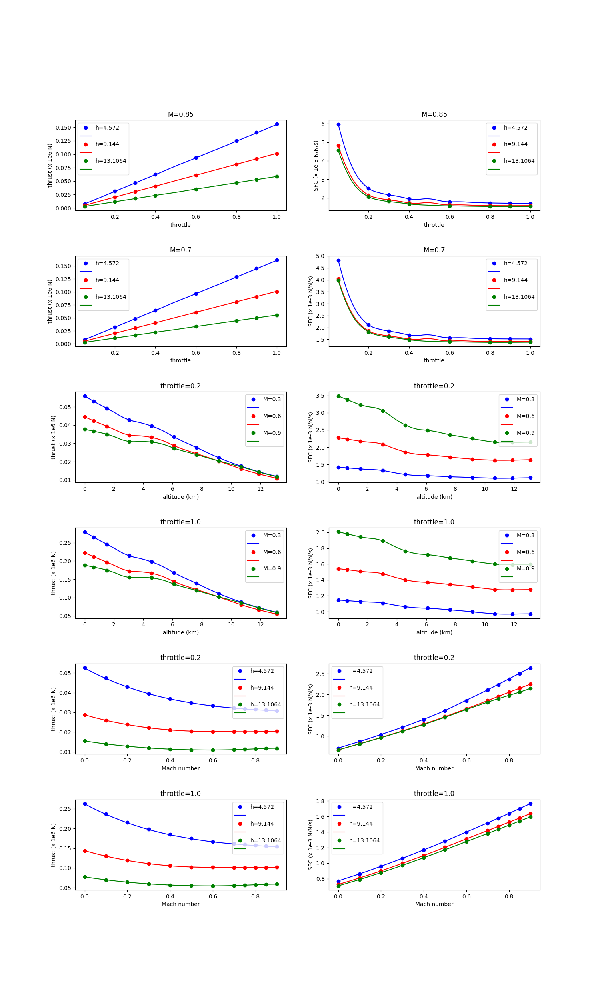
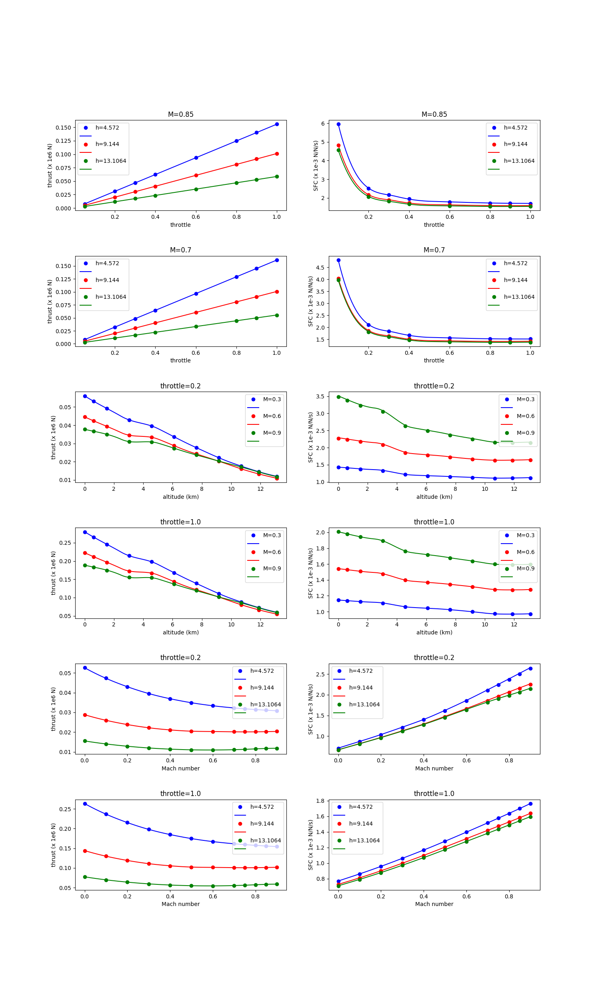

Boeing 777 engine data set
==========================

.. code-block:: python

  import numpy as np
  import os
  
  def get_b777_engine():
      this_dir = os.path.split(__file__)[0]
  
      nt = 12 * 11 * 8
      xt = np.loadtxt(os.path.join(this_dir, 'b777_engine_inputs.dat')).reshape((nt, 3))
      yt = np.loadtxt(os.path.join(this_dir, 'b777_engine_outputs.dat')).reshape((nt, 2))
      dyt_dxt = np.loadtxt(os.path.join(this_dir, 'b777_engine_derivs.dat')).reshape((nt, 2, 3))
  
      xlimits = np.array([
          [0, 0.9],
          [0, 15],
          [0, 1.],
      ])
  
      return xt, yt, dyt_dxt, xlimits
  
  
  def plot_b777_engine(xt, yt, limits, interp):
      import numpy as np
      import matplotlib
      matplotlib.use('Agg')
      import matplotlib.pyplot as plt
  
      val_M = np.array([
          0.0, 0.1, 0.2, 0.3, 0.4, 0.5, 0.6,
          0.7, 0.75, 0.8, 0.85, 0.9]) # 12
      val_h = np.array([
          0., 0.6096, 1.524, 3.048, 4.572, 6.096,
          7.62, 9.144, 10.668, 11.8872, 13.1064]) # 11
      val_t = np.array([
          0.05, 0.2, 0.3, 0.4, 0.6, 0.8, 0.9, 1.0]) # 8
  
      def get_pts(xt, yt, iy, ind_M=None, ind_h=None, ind_t=None):
          eps = 1e-5
  
          if ind_M is not None:
              M = val_M[ind_M]
              keep = abs(xt[:, 0] - M) < eps
              xt = xt[keep, :]
              yt = yt[keep, :]
          if ind_h is not None:
              h = val_h[ind_h]
              keep = abs(xt[:, 1] - h) < eps
              xt = xt[keep, :]
              yt = yt[keep, :]
          if ind_t is not None:
              t = val_t[ind_t]
              keep = abs(xt[:, 2] - t) < eps
              xt = xt[keep, :]
              yt = yt[keep, :]
  
          if ind_M is None:
              data = xt[:, 0], yt[:, iy]
          elif ind_h is None:
              data = xt[:, 1], yt[:, iy]
          elif ind_t is None:
              data = xt[:, 2], yt[:, iy]
  
          if iy == 0:
              data = data[0], data[1] / 1e6
          elif iy == 1:
              data = data[0], data[1] / 1e-4
  
          return data
  
      num = 100
      x = np.zeros((num, 3))
      lins_M = np.linspace(0., 0.9, num)
      lins_h = np.linspace(0., 13.1064, num)
      lins_t = np.linspace(0.05, 1., num)
  
      def get_x(ind_M=None, ind_h=None, ind_t=None):
          x = np.zeros((num, 3))
          x[:, 0] = lins_M
          x[:, 1] = lins_h
          x[:, 2] = lins_t
          if ind_M:
              x[:, 0] = val_M[ind_M]
          if ind_h:
              x[:, 1] = val_h[ind_h]
          if ind_t:
              x[:, 2] = val_t[ind_t]
          return x
  
      nrow = 6
      ncol = 2
  
      ind_M_1 = -2
      ind_M_2 = -5
  
      ind_t_1 = 1
      ind_t_2 = -1
  
      plt.close()
      plt.figure(figsize=(15, 25))
      plt.subplots_adjust(hspace=.5)
  
      # --------------------
  
      plt.subplot(nrow, ncol, 1)
      plt.title('M={}'.format(val_M[ind_M_1]))
      plt.xlabel('throttle')
      plt.ylabel('thrust (x 1e6 N)')
  
      plt.subplot(nrow, ncol, 2)
      plt.title('M={}'.format(val_M[ind_M_1]))
      plt.xlabel('throttle')
      plt.ylabel('SFC (x 1e-3 N/N/s)')
  
      plt.subplot(nrow, ncol, 3)
      plt.title('M={}'.format(val_M[ind_M_2]))
      plt.xlabel('throttle')
      plt.ylabel('thrust (x 1e6 N)')
  
      plt.subplot(nrow, ncol, 4)
      plt.title('M={}'.format(val_M[ind_M_2]))
      plt.xlabel('throttle')
      plt.ylabel('SFC (x 1e-3 N/N/s)')
  
      # --------------------
  
      plt.subplot(nrow, ncol, 5)
      plt.title('throttle={}'.format(val_t[ind_t_1]))
      plt.xlabel('altitude (km)')
      plt.ylabel('thrust (x 1e6 N)')
  
      plt.subplot(nrow, ncol, 6)
      plt.title('throttle={}'.format(val_t[ind_t_1]))
      plt.xlabel('altitude (km)')
      plt.ylabel('SFC (x 1e-3 N/N/s)')
  
      plt.subplot(nrow, ncol, 7)
      plt.title('throttle={}'.format(val_t[ind_t_2]))
      plt.xlabel('altitude (km)')
      plt.ylabel('thrust (x 1e6 N)')
  
      plt.subplot(nrow, ncol, 8)
      plt.title('throttle={}'.format(val_t[ind_t_2]))
      plt.xlabel('altitude (km)')
      plt.ylabel('SFC (x 1e-3 N/N/s)')
  
      # --------------------
  
      plt.subplot(nrow, ncol,  9)
      plt.title('throttle={}'.format(val_t[ind_t_1]))
      plt.xlabel('Mach number')
      plt.ylabel('thrust (x 1e6 N)')
  
      plt.subplot(nrow, ncol, 10)
      plt.title('throttle={}'.format(val_t[ind_t_1]))
      plt.xlabel('Mach number')
      plt.ylabel('SFC (x 1e-3 N/N/s)')
  
      plt.subplot(nrow, ncol, 11)
      plt.title('throttle={}'.format(val_t[ind_t_2]))
      plt.xlabel('Mach number')
      plt.ylabel('thrust (x 1e6 N)')
  
      plt.subplot(nrow, ncol, 12)
      plt.title('throttle={}'.format(val_t[ind_t_2]))
      plt.xlabel('Mach number')
      plt.ylabel('SFC (x 1e-3 N/N/s)')
  
      ind_h_list = [0, 4, 7, 10]
      ind_h_list = [4, 7, 10]
  
      ind_M_list = [0, 3, 6, 11]
      ind_M_list = [3, 6, 11]
  
      colors = ['b', 'r', 'g', 'c', 'm']
  
      # -----------------------------------------------------------------------------
  
      # Throttle slices
      for k, ind_h in enumerate(ind_h_list):
          ind_M = ind_M_1
          x = get_x(ind_M=ind_M, ind_h=ind_h)
          y = interp.predict_values(x)
  
          plt.subplot(nrow, ncol, 1)
          xt_, yt_ = get_pts(xt, yt, 0, ind_M=ind_M, ind_h=ind_h)
          plt.plot(xt_, yt_, 'o' + colors[k])
          plt.plot(lins_t, y[:, 0] / 1e6, colors[k])
          plt.subplot(nrow, ncol, 2)
          xt_, yt_ = get_pts(xt, yt, 1, ind_M=ind_M, ind_h=ind_h)
          plt.plot(xt_, yt_, 'o' + colors[k])
          plt.plot(lins_t, y[:, 1] / 1e-4, colors[k])
  
          ind_M = ind_M_2
          x = get_x(ind_M=ind_M, ind_h=ind_h)
          y = interp.predict_values(x)
  
          plt.subplot(nrow, ncol, 3)
          xt_, yt_ = get_pts(xt, yt, 0, ind_M=ind_M, ind_h=ind_h)
          plt.plot(xt_, yt_, 'o' + colors[k])
          plt.plot(lins_t, y[:, 0] / 1e6, colors[k])
          plt.subplot(nrow, ncol, 4)
          xt_, yt_ = get_pts(xt, yt, 1, ind_M=ind_M, ind_h=ind_h)
          plt.plot(xt_, yt_, 'o' + colors[k])
          plt.plot(lins_t, y[:, 1] / 1e-4, colors[k])
  
      # -----------------------------------------------------------------------------
  
      # Altitude slices
      for k, ind_M in enumerate(ind_M_list):
          ind_t = ind_t_1
          x = get_x(ind_M=ind_M, ind_t=ind_t)
          y = interp.predict_values(x)
  
          plt.subplot(nrow, ncol, 5)
          xt_, yt_ = get_pts(xt, yt, 0, ind_M=ind_M, ind_t=ind_t)
          plt.plot(xt_, yt_, 'o' + colors[k])
          plt.plot(lins_h, y[:, 0] / 1e6, colors[k])
          plt.subplot(nrow, ncol, 6)
          xt_, yt_ = get_pts(xt, yt, 1, ind_M=ind_M, ind_t=ind_t)
          plt.plot(xt_, yt_, 'o' + colors[k])
          plt.plot(lins_h, y[:, 1] / 1e-4, colors[k])
  
          ind_t = ind_t_2
          x = get_x(ind_M=ind_M, ind_t=ind_t)
          y = interp.predict_values(x)
  
          plt.subplot(nrow, ncol, 7)
          xt_, yt_ = get_pts(xt, yt, 0, ind_M=ind_M, ind_t=ind_t)
          plt.plot(xt_, yt_, 'o' + colors[k])
          plt.plot(lins_h, y[:, 0] / 1e6, colors[k])
          plt.subplot(nrow, ncol, 8)
          xt_, yt_ = get_pts(xt, yt, 1, ind_M=ind_M, ind_t=ind_t)
          plt.plot(xt_, yt_, 'o' + colors[k])
          plt.plot(lins_h, y[:, 1] / 1e-4, colors[k])
  
      # -----------------------------------------------------------------------------
  
      # Mach number slices
      for k, ind_h in enumerate(ind_h_list):
          ind_t = ind_t_1
          x = get_x(ind_t=ind_t, ind_h=ind_h)
          y = interp.predict_values(x)
  
          plt.subplot(nrow, ncol,  9)
          xt_, yt_ = get_pts(xt, yt, 0, ind_h=ind_h, ind_t=ind_t)
          plt.plot(xt_, yt_, 'o' + colors[k])
          plt.plot(lins_M, y[:, 0] / 1e6, colors[k])
          plt.subplot(nrow, ncol, 10)
          xt_, yt_ = get_pts(xt, yt, 1, ind_h=ind_h, ind_t=ind_t)
          plt.plot(xt_, yt_, 'o' + colors[k])
          plt.plot(lins_M, y[:, 1] / 1e-4, colors[k])
  
          ind_t = ind_t_2
          x = get_x(ind_t=ind_t, ind_h=ind_h)
          y = interp.predict_values(x)
  
          plt.subplot(nrow, ncol, 11)
          xt_, yt_ = get_pts(xt, yt, 0, ind_h=ind_h, ind_t=ind_t)
          plt.plot(xt_, yt_, 'o' + colors[k])
          plt.plot(lins_M, y[:, 0] / 1e6, colors[k])
          plt.subplot(nrow, ncol, 12)
          xt_, yt_ = get_pts(xt, yt, 1, ind_h=ind_h, ind_t=ind_t)
          plt.plot(xt_, yt_, 'o' + colors[k])
          plt.plot(lins_M, y[:, 1] / 1e-4, colors[k])
  
      # -----------------------------------------------------------------------------
  
      for k in range(4):
          legend_entries = []
          for ind_h in ind_h_list:
              legend_entries.append('h={}'.format(val_h[ind_h]))
              legend_entries.append('')
  
          plt.subplot(nrow, ncol, k + 1)
          plt.legend(legend_entries)
  
          plt.subplot(nrow, ncol, k + 9)
          plt.legend(legend_entries)
  
          legend_entries = []
          for ind_M in ind_M_list:
              legend_entries.append('M={}'.format(val_M[ind_M]))
              legend_entries.append('')
  
          plt.subplot(nrow, ncol, k + 5)
          plt.legend(legend_entries)
  
      plt.show()
  

RMTB
----

.. code-block:: python

  from smt.methods import RMTB
  from smt.examples.b777_engine import get_b777_engine, plot_b777_engine
  
  xt, yt, dyt_dxt, xlimits = get_b777_engine()
  
  interp = RMTB(num_ctrl_pts=15, xlimits=xlimits, nonlinear_maxiter=20, approx_order=2,
      energy_weight=0e-14, regularization_weight=0e-18, extrapolate=True,
  )
  interp.set_training_values(xt, yt)
  interp.set_training_derivatives(xt, dyt_dxt[:, :, 0], 0)
  interp.set_training_derivatives(xt, dyt_dxt[:, :, 1], 1)
  interp.set_training_derivatives(xt, dyt_dxt[:, :, 2], 2)
  interp.train()
  
  plot_b777_engine(xt, yt, xlimits, interp)
  
::

  ___________________________________________________________________________
     
                                     RMTB
  ___________________________________________________________________________
     
   Problem size
     
        # training points.        : 1056
     
  ___________________________________________________________________________
     
   Training
     
     Training ...
        Pre-computing matrices ...
           Computing dof2coeff ...
           Computing dof2coeff - done. Time (sec):  0.0000050
           Initializing Hessian ...
           Initializing Hessian - done. Time (sec):  0.0006042
           Computing energy terms ...
           Computing energy terms - done. Time (sec):  0.4169891
           Computing approximation terms ...
           Computing approximation terms - done. Time (sec):  0.0257118
        Pre-computing matrices - done. Time (sec):  0.4434199
        Solving for degrees of freedom ...
           Solving initial startup problem (n=3375) ...
              Solving for output 0 ...
                 Iteration (num., iy, grad. norm, func.) :   0   0 4.857178281e+07 2.642628384e+13
                 Iteration (num., iy, grad. norm, func.) :   0   0 1.234984740e+05 6.974516396e+09
              Solving for output 0 - done. Time (sec):  0.1102459
              Solving for output 1 ...
                 Iteration (num., iy, grad. norm, func.) :   0   1 3.711896708e-01 7.697335516e-04
                 Iteration (num., iy, grad. norm, func.) :   0   1 1.246807765e-03 3.529171559e-07
              Solving for output 1 - done. Time (sec):  0.1475520
           Solving initial startup problem (n=3375) - done. Time (sec):  0.2579451
           Solving nonlinear problem (n=3375) ...
              Solving for output 0 ...
                 Iteration (num., iy, grad. norm, func.) :   0   0 1.234984740e+05 6.974516396e+09
                 Iteration (num., iy, grad. norm, func.) :   0   0 9.344179646e+04 1.927478508e+09
                 Iteration (num., iy, grad. norm, func.) :   1   0 4.917404339e+04 5.698074128e+08
                 Iteration (num., iy, grad. norm, func.) :   2   0 3.600462397e+04 4.016408051e+08
                 Iteration (num., iy, grad. norm, func.) :   3   0 3.463148201e+04 3.903963136e+08
                 Iteration (num., iy, grad. norm, func.) :   4   0 2.336235029e+04 3.349187249e+08
                 Iteration (num., iy, grad. norm, func.) :   5   0 2.075008292e+04 3.039105278e+08
                 Iteration (num., iy, grad. norm, func.) :   6   0 1.083210446e+04 2.658472587e+08
                 Iteration (num., iy, grad. norm, func.) :   7   0 9.778228816e+03 2.248292632e+08
                 Iteration (num., iy, grad. norm, func.) :   8   0 1.233881987e+04 2.041640154e+08
                 Iteration (num., iy, grad. norm, func.) :   9   0 9.436720928e+03 1.900573922e+08
                 Iteration (num., iy, grad. norm, func.) :  10   0 6.050670781e+03 1.760634666e+08
                 Iteration (num., iy, grad. norm, func.) :  11   0 5.555814484e+03 1.633870283e+08
                 Iteration (num., iy, grad. norm, func.) :  12   0 3.953428617e+03 1.611583611e+08
                 Iteration (num., iy, grad. norm, func.) :  13   0 6.264313531e+03 1.611207679e+08
                 Iteration (num., iy, grad. norm, func.) :  14   0 7.747470786e+03 1.581165512e+08
                 Iteration (num., iy, grad. norm, func.) :  15   0 2.184893600e+03 1.517395779e+08
                 Iteration (num., iy, grad. norm, func.) :  16   0 2.311750623e+03 1.504615941e+08
                 Iteration (num., iy, grad. norm, func.) :  17   0 2.561911028e+03 1.498878373e+08
                 Iteration (num., iy, grad. norm, func.) :  18   0 2.123788159e+03 1.496919068e+08
                 Iteration (num., iy, grad. norm, func.) :  19   0 2.225862180e+03 1.496527226e+08
              Solving for output 0 - done. Time (sec):  1.6818202
              Solving for output 1 ...
                 Iteration (num., iy, grad. norm, func.) :   0   1 1.246807765e-03 3.529171559e-07
                 Iteration (num., iy, grad. norm, func.) :   0   1 3.292895615e-04 6.204303482e-08
                 Iteration (num., iy, grad. norm, func.) :   1   1 2.778780021e-04 1.822852097e-08
                 Iteration (num., iy, grad. norm, func.) :   2   1 2.055377363e-04 8.470205695e-09
                 Iteration (num., iy, grad. norm, func.) :   3   1 1.780358444e-04 7.804379520e-09
                 Iteration (num., iy, grad. norm, func.) :   4   1 1.108670523e-04 6.757690302e-09
                 Iteration (num., iy, grad. norm, func.) :   5   1 1.172214282e-04 5.097226638e-09
                 Iteration (num., iy, grad. norm, func.) :   6   1 4.848315884e-05 2.912309454e-09
                 Iteration (num., iy, grad. norm, func.) :   7   1 4.316964177e-05 2.091370576e-09
                 Iteration (num., iy, grad. norm, func.) :   8   1 2.713262809e-05 1.821251858e-09
                 Iteration (num., iy, grad. norm, func.) :   9   1 3.164381850e-05 1.708755769e-09
                 Iteration (num., iy, grad. norm, func.) :  10   1 2.103050847e-05 1.562178769e-09
                 Iteration (num., iy, grad. norm, func.) :  11   1 2.650559712e-05 1.413104227e-09
                 Iteration (num., iy, grad. norm, func.) :  12   1 1.595781692e-05 1.296040691e-09
                 Iteration (num., iy, grad. norm, func.) :  13   1 1.991171875e-05 1.241112043e-09
                 Iteration (num., iy, grad. norm, func.) :  14   1 1.844512451e-05 1.206385579e-09
                 Iteration (num., iy, grad. norm, func.) :  15   1 1.089374732e-05 1.197653071e-09
                 Iteration (num., iy, grad. norm, func.) :  16   1 1.038610423e-05 1.179707924e-09
                 Iteration (num., iy, grad. norm, func.) :  17   1 6.640517948e-06 1.154281811e-09
                 Iteration (num., iy, grad. norm, func.) :  18   1 9.597293263e-06 1.140163993e-09
                 Iteration (num., iy, grad. norm, func.) :  19   1 5.230124283e-06 1.138469758e-09
              Solving for output 1 - done. Time (sec):  1.6562660
           Solving nonlinear problem (n=3375) - done. Time (sec):  3.3381829
        Solving for degrees of freedom - done. Time (sec):  3.5962272
     Training - done. Time (sec):  4.0407221
  ___________________________________________________________________________
     
   Evaluation
     
        # eval points. : 100
     
     Predicting ...
     Predicting - done. Time (sec):  0.0013630
     
     Prediction time/pt. (sec) :  0.0000136
     
  ___________________________________________________________________________
     
   Evaluation
     
        # eval points. : 100
     
     Predicting ...
     Predicting - done. Time (sec):  0.0012171
     
     Prediction time/pt. (sec) :  0.0000122
     
  ___________________________________________________________________________
     
   Evaluation
     
        # eval points. : 100
     
     Predicting ...
     Predicting - done. Time (sec):  0.0013671
     
     Prediction time/pt. (sec) :  0.0000137
     
  ___________________________________________________________________________
     
   Evaluation
     
        # eval points. : 100
     
     Predicting ...
     Predicting - done. Time (sec):  0.0015318
     
     Prediction time/pt. (sec) :  0.0000153
     
  ___________________________________________________________________________
     
   Evaluation
     
        # eval points. : 100
     
     Predicting ...
     Predicting - done. Time (sec):  0.0012469
     
     Prediction time/pt. (sec) :  0.0000125
     
  ___________________________________________________________________________
     
   Evaluation
     
        # eval points. : 100
     
     Predicting ...
     Predicting - done. Time (sec):  0.0012200
     
     Prediction time/pt. (sec) :  0.0000122
     
  ___________________________________________________________________________
     
   Evaluation
     
        # eval points. : 100
     
     Predicting ...
     Predicting - done. Time (sec):  0.0012269
     
     Prediction time/pt. (sec) :  0.0000123
     
  ___________________________________________________________________________
     
   Evaluation
     
        # eval points. : 100
     
     Predicting ...
     Predicting - done. Time (sec):  0.0013151
     
     Prediction time/pt. (sec) :  0.0000132
     
  ___________________________________________________________________________
     
   Evaluation
     
        # eval points. : 100
     
     Predicting ...
     Predicting - done. Time (sec):  0.0012410
     
     Prediction time/pt. (sec) :  0.0000124
     
  ___________________________________________________________________________
     
   Evaluation
     
        # eval points. : 100
     
     Predicting ...
     Predicting - done. Time (sec):  0.0012193
     
     Prediction time/pt. (sec) :  0.0000122
     
  ___________________________________________________________________________
     
   Evaluation
     
        # eval points. : 100
     
     Predicting ...
     Predicting - done. Time (sec):  0.0012128
     
     Prediction time/pt. (sec) :  0.0000121
     
  ___________________________________________________________________________
     
   Evaluation
     
        # eval points. : 100
     
     Predicting ...
     Predicting - done. Time (sec):  0.0017002
     
     Prediction time/pt. (sec) :  0.0000170
     
  ___________________________________________________________________________
     
   Evaluation
     
        # eval points. : 100
     
     Predicting ...
     Predicting - done. Time (sec):  0.0013540
     
     Prediction time/pt. (sec) :  0.0000135
     
  ___________________________________________________________________________
     
   Evaluation
     
        # eval points. : 100
     
     Predicting ...
     Predicting - done. Time (sec):  0.0012231
     
     Prediction time/pt. (sec) :  0.0000122
     
  ___________________________________________________________________________
     
   Evaluation
     
        # eval points. : 100
     
     Predicting ...
     Predicting - done. Time (sec):  0.0013311
     
     Prediction time/pt. (sec) :  0.0000133
     
  ___________________________________________________________________________
     
   Evaluation
     
        # eval points. : 100
     
     Predicting ...
     Predicting - done. Time (sec):  0.0012159
     
     Prediction time/pt. (sec) :  0.0000122
     
  ___________________________________________________________________________
     
   Evaluation
     
        # eval points. : 100
     
     Predicting ...
     Predicting - done. Time (sec):  0.0012369
     
     Prediction time/pt. (sec) :  0.0000124
     
  ___________________________________________________________________________
     
   Evaluation
     
        # eval points. : 100
     
     Predicting ...
     Predicting - done. Time (sec):  0.0018229
     
     Prediction time/pt. (sec) :  0.0000182
     
  

RMTC
----

.. code-block:: python

  from smt.methods import RMTC
  from smt.examples.b777_engine import get_b777_engine, plot_b777_engine
  
  xt, yt, dyt_dxt, xlimits = get_b777_engine()
  
  interp = RMTC(num_elements=6, xlimits=xlimits, nonlinear_maxiter=20, approx_order=2,
      energy_weight=0., regularization_weight=0., extrapolate=True,
  )
  interp.set_training_values(xt, yt)
  interp.set_training_derivatives(xt, dyt_dxt[:, :, 0], 0)
  interp.set_training_derivatives(xt, dyt_dxt[:, :, 1], 1)
  interp.set_training_derivatives(xt, dyt_dxt[:, :, 2], 2)
  interp.train()
  
  plot_b777_engine(xt, yt, xlimits, interp)
  
::

  ___________________________________________________________________________
     
                                     RMTC
  ___________________________________________________________________________
     
   Problem size
     
        # training points.        : 1056
     
  ___________________________________________________________________________
     
   Training
     
     Training ...
        Pre-computing matrices ...
           Computing dof2coeff ...
           Computing dof2coeff - done. Time (sec):  0.0917239
           Initializing Hessian ...
           Initializing Hessian - done. Time (sec):  0.0005643
           Computing energy terms ...
           Computing energy terms - done. Time (sec):  0.1672120
           Computing approximation terms ...
           Computing approximation terms - done. Time (sec):  0.0798318
        Pre-computing matrices - done. Time (sec):  0.3394301
        Solving for degrees of freedom ...
           Solving initial startup problem (n=2744) ...
              Solving for output 0 ...
                 Iteration (num., iy, grad. norm, func.) :   0   0 7.864862172e+07 2.642628384e+13
                 Iteration (num., iy, grad. norm, func.) :   0   0 1.981017847e+05 2.020326181e+09
              Solving for output 0 - done. Time (sec):  0.1788888
              Solving for output 1 ...
                 Iteration (num., iy, grad. norm, func.) :   0   1 8.095040141e-01 7.697335516e-04
                 Iteration (num., iy, grad. norm, func.) :   0   1 1.244441570e-03 1.322573038e-07
              Solving for output 1 - done. Time (sec):  0.1861761
           Solving initial startup problem (n=2744) - done. Time (sec):  0.3651719
           Solving nonlinear problem (n=2744) ...
              Solving for output 0 ...
                 Iteration (num., iy, grad. norm, func.) :   0   0 1.981017847e+05 2.020326181e+09
                 Iteration (num., iy, grad. norm, func.) :   0   0 2.686879633e+04 4.193956757e+08
                 Iteration (num., iy, grad. norm, func.) :   1   0 1.662665300e+04 3.529890008e+08
                 Iteration (num., iy, grad. norm, func.) :   2   0 1.702962210e+04 3.504748628e+08
                 Iteration (num., iy, grad. norm, func.) :   3   0 9.525374457e+03 3.373027480e+08
                 Iteration (num., iy, grad. norm, func.) :   4   0 4.981524694e+03 3.326840486e+08
                 Iteration (num., iy, grad. norm, func.) :   5   0 5.960735552e+03 3.320598104e+08
                 Iteration (num., iy, grad. norm, func.) :   6   0 3.918231493e+03 3.312744918e+08
                 Iteration (num., iy, grad. norm, func.) :   7   0 2.820828878e+03 3.307066820e+08
                 Iteration (num., iy, grad. norm, func.) :   8   0 1.316833502e+03 3.304637646e+08
                 Iteration (num., iy, grad. norm, func.) :   9   0 1.770669701e+03 3.303584546e+08
                 Iteration (num., iy, grad. norm, func.) :  10   0 9.462960698e+02 3.302254901e+08
                 Iteration (num., iy, grad. norm, func.) :  11   0 1.279280442e+03 3.301369725e+08
                 Iteration (num., iy, grad. norm, func.) :  12   0 7.002593943e+02 3.299988270e+08
                 Iteration (num., iy, grad. norm, func.) :  13   0 8.100076615e+02 3.299113556e+08
                 Iteration (num., iy, grad. norm, func.) :  14   0 3.763919201e+02 3.298593269e+08
                 Iteration (num., iy, grad. norm, func.) :  15   0 7.056077153e+02 3.298397948e+08
                 Iteration (num., iy, grad. norm, func.) :  16   0 6.267210532e+02 3.298210261e+08
                 Iteration (num., iy, grad. norm, func.) :  17   0 4.316109815e+02 3.298130630e+08
                 Iteration (num., iy, grad. norm, func.) :  18   0 4.530462331e+02 3.298043354e+08
                 Iteration (num., iy, grad. norm, func.) :  19   0 3.940613817e+02 3.298018710e+08
              Solving for output 0 - done. Time (sec):  3.6343598
              Solving for output 1 ...
                 Iteration (num., iy, grad. norm, func.) :   0   1 1.244441570e-03 1.322573038e-07
                 Iteration (num., iy, grad. norm, func.) :   0   1 4.055867854e-04 9.505691755e-09
                 Iteration (num., iy, grad. norm, func.) :   1   1 3.065208899e-04 7.899672663e-09
                 Iteration (num., iy, grad. norm, func.) :   2   1 2.379391634e-04 6.085678268e-09
                 Iteration (num., iy, grad. norm, func.) :   3   1 1.145638171e-04 4.310459447e-09
                 Iteration (num., iy, grad. norm, func.) :   4   1 8.717952860e-05 4.061938742e-09
                 Iteration (num., iy, grad. norm, func.) :   5   1 7.096509345e-05 3.743727924e-09
                 Iteration (num., iy, grad. norm, func.) :   6   1 4.323888033e-05 3.364829442e-09
                 Iteration (num., iy, grad. norm, func.) :   7   1 3.848649692e-05 3.207619399e-09
                 Iteration (num., iy, grad. norm, func.) :   8   1 4.603698443e-05 3.126162234e-09
                 Iteration (num., iy, grad. norm, func.) :   9   1 2.262562887e-05 3.066051197e-09
                 Iteration (num., iy, grad. norm, func.) :  10   1 2.444605555e-05 3.047225843e-09
                 Iteration (num., iy, grad. norm, func.) :  11   1 2.100709675e-05 3.027958712e-09
                 Iteration (num., iy, grad. norm, func.) :  12   1 1.792596671e-05 2.996068147e-09
                 Iteration (num., iy, grad. norm, func.) :  13   1 2.053309672e-05 2.981414073e-09
                 Iteration (num., iy, grad. norm, func.) :  14   1 1.278089304e-05 2.956278355e-09
                 Iteration (num., iy, grad. norm, func.) :  15   1 1.548410882e-05 2.935632587e-09
                 Iteration (num., iy, grad. norm, func.) :  16   1 6.556256338e-06 2.925222424e-09
                 Iteration (num., iy, grad. norm, func.) :  17   1 8.696899565e-06 2.924053149e-09
                 Iteration (num., iy, grad. norm, func.) :  18   1 6.417628621e-06 2.922817325e-09
                 Iteration (num., iy, grad. norm, func.) :  19   1 1.096394519e-05 2.919976024e-09
              Solving for output 1 - done. Time (sec):  3.5333104
           Solving nonlinear problem (n=2744) - done. Time (sec):  7.1677608
        Solving for degrees of freedom - done. Time (sec):  7.5330110
     Training - done. Time (sec):  7.8753111
  ___________________________________________________________________________
     
   Evaluation
     
        # eval points. : 100
     
     Predicting ...
     Predicting - done. Time (sec):  0.0029800
     
     Prediction time/pt. (sec) :  0.0000298
     
  ___________________________________________________________________________
     
   Evaluation
     
        # eval points. : 100
     
     Predicting ...
     Predicting - done. Time (sec):  0.0026319
     
     Prediction time/pt. (sec) :  0.0000263
     
  ___________________________________________________________________________
     
   Evaluation
     
        # eval points. : 100
     
     Predicting ...
     Predicting - done. Time (sec):  0.0026670
     
     Prediction time/pt. (sec) :  0.0000267
     
  ___________________________________________________________________________
     
   Evaluation
     
        # eval points. : 100
     
     Predicting ...
     Predicting - done. Time (sec):  0.0026181
     
     Prediction time/pt. (sec) :  0.0000262
     
  ___________________________________________________________________________
     
   Evaluation
     
        # eval points. : 100
     
     Predicting ...
     Predicting - done. Time (sec):  0.0025373
     
     Prediction time/pt. (sec) :  0.0000254
     
  ___________________________________________________________________________
     
   Evaluation
     
        # eval points. : 100
     
     Predicting ...
     Predicting - done. Time (sec):  0.0025582
     
     Prediction time/pt. (sec) :  0.0000256
     
  ___________________________________________________________________________
     
   Evaluation
     
        # eval points. : 100
     
     Predicting ...
     Predicting - done. Time (sec):  0.0022500
     
     Prediction time/pt. (sec) :  0.0000225
     
  ___________________________________________________________________________
     
   Evaluation
     
        # eval points. : 100
     
     Predicting ...
     Predicting - done. Time (sec):  0.0022650
     
     Prediction time/pt. (sec) :  0.0000226
     
  ___________________________________________________________________________
     
   Evaluation
     
        # eval points. : 100
     
     Predicting ...
     Predicting - done. Time (sec):  0.0025680
     
     Prediction time/pt. (sec) :  0.0000257
     
  ___________________________________________________________________________
     
   Evaluation
     
        # eval points. : 100
     
     Predicting ...
     Predicting - done. Time (sec):  0.0026081
     
     Prediction time/pt. (sec) :  0.0000261
     
  ___________________________________________________________________________
     
   Evaluation
     
        # eval points. : 100
     
     Predicting ...
     Predicting - done. Time (sec):  0.0022500
     
     Prediction time/pt. (sec) :  0.0000225
     
  ___________________________________________________________________________
     
   Evaluation
     
        # eval points. : 100
     
     Predicting ...
     Predicting - done. Time (sec):  0.0022759
     
     Prediction time/pt. (sec) :  0.0000228
     
  ___________________________________________________________________________
     
   Evaluation
     
        # eval points. : 100
     
     Predicting ...
     Predicting - done. Time (sec):  0.0025339
     
     Prediction time/pt. (sec) :  0.0000253
     
  ___________________________________________________________________________
     
   Evaluation
     
        # eval points. : 100
     
     Predicting ...
     Predicting - done. Time (sec):  0.0026751
     
     Prediction time/pt. (sec) :  0.0000268
     
  ___________________________________________________________________________
     
   Evaluation
     
        # eval points. : 100
     
     Predicting ...
     Predicting - done. Time (sec):  0.0027080
     
     Prediction time/pt. (sec) :  0.0000271
     
  ___________________________________________________________________________
     
   Evaluation
     
        # eval points. : 100
     
     Predicting ...
     Predicting - done. Time (sec):  0.0025849
     
     Prediction time/pt. (sec) :  0.0000258
     
  ___________________________________________________________________________
     
   Evaluation
     
        # eval points. : 100
     
     Predicting ...
     Predicting - done. Time (sec):  0.0024838
     
     Prediction time/pt. (sec) :  0.0000248
     
  ___________________________________________________________________________
     
   Evaluation
     
        # eval points. : 100
     
     Predicting ...
     Predicting - done. Time (sec):  0.0025311
     
     Prediction time/pt. (sec) :  0.0000253
     
  

