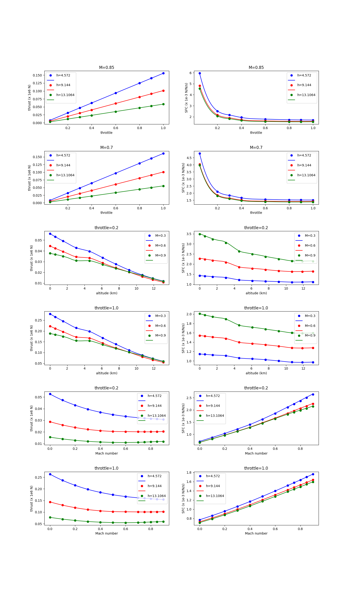

Boeing 777 engine data set
==========================

.. code-block:: python

  import numpy as np
  import os
  
  
  def get_b777_engine():
      this_dir = os.path.split(__file__)[0]
  
      nt = 12 * 11 * 8
      xt = np.loadtxt(os.path.join(this_dir, "b777_engine_inputs.dat")).reshape((nt, 3))
      yt = np.loadtxt(os.path.join(this_dir, "b777_engine_outputs.dat")).reshape((nt, 2))
      dyt_dxt = np.loadtxt(os.path.join(this_dir, "b777_engine_derivs.dat")).reshape(
          (nt, 2, 3)
      )
  
      xlimits = np.array([[0, 0.9], [0, 15], [0, 1.0]])
  
      return xt, yt, dyt_dxt, xlimits
  
  
  def plot_b777_engine(xt, yt, limits, interp):
      import numpy as np
      import matplotlib
  
      matplotlib.use("Agg")
      import matplotlib.pyplot as plt
  
      val_M = np.array(
          [0.0, 0.1, 0.2, 0.3, 0.4, 0.5, 0.6, 0.7, 0.75, 0.8, 0.85, 0.9]
      )  # 12
      val_h = np.array(
          [0.0, 0.6096, 1.524, 3.048, 4.572, 6.096, 7.62, 9.144, 10.668, 11.8872, 13.1064]
      )  # 11
      val_t = np.array([0.05, 0.2, 0.3, 0.4, 0.6, 0.8, 0.9, 1.0])  # 8
  
      def get_pts(xt, yt, iy, ind_M=None, ind_h=None, ind_t=None):
          eps = 1e-5
  
          if ind_M is not None:
              M = val_M[ind_M]
              keep = abs(xt[:, 0] - M) < eps
              xt = xt[keep, :]
              yt = yt[keep, :]
          if ind_h is not None:
              h = val_h[ind_h]
              keep = abs(xt[:, 1] - h) < eps
              xt = xt[keep, :]
              yt = yt[keep, :]
          if ind_t is not None:
              t = val_t[ind_t]
              keep = abs(xt[:, 2] - t) < eps
              xt = xt[keep, :]
              yt = yt[keep, :]
  
          if ind_M is None:
              data = xt[:, 0], yt[:, iy]
          elif ind_h is None:
              data = xt[:, 1], yt[:, iy]
          elif ind_t is None:
              data = xt[:, 2], yt[:, iy]
  
          if iy == 0:
              data = data[0], data[1] / 1e6
          elif iy == 1:
              data = data[0], data[1] / 1e-4
  
          return data
  
      num = 100
      x = np.zeros((num, 3))
      lins_M = np.linspace(0.0, 0.9, num)
      lins_h = np.linspace(0.0, 13.1064, num)
      lins_t = np.linspace(0.05, 1.0, num)
  
      def get_x(ind_M=None, ind_h=None, ind_t=None):
          x = np.zeros((num, 3))
          x[:, 0] = lins_M
          x[:, 1] = lins_h
          x[:, 2] = lins_t
          if ind_M:
              x[:, 0] = val_M[ind_M]
          if ind_h:
              x[:, 1] = val_h[ind_h]
          if ind_t:
              x[:, 2] = val_t[ind_t]
          return x
  
      nrow = 6
      ncol = 2
  
      ind_M_1 = -2
      ind_M_2 = -5
  
      ind_t_1 = 1
      ind_t_2 = -1
  
      plt.close()
  
      # --------------------
  
      fig, axs = plt.subplots(6, 2, gridspec_kw={"hspace": 0.5}, figsize=(15, 25))
  
      axs[0, 0].set_title("M={}".format(val_M[ind_M_1]))
      axs[0, 0].set(xlabel="throttle", ylabel="thrust (x 1e6 N)")
  
      axs[0, 1].set_title("M={}".format(val_M[ind_M_1]))
      axs[0, 1].set(xlabel="throttle", ylabel="SFC (x 1e-3 N/N/s)")
  
      axs[1, 0].set_title("M={}".format(val_M[ind_M_2]))
      axs[1, 0].set(xlabel="throttle", ylabel="thrust (x 1e6 N)")
  
      axs[1, 1].set_title("M={}".format(val_M[ind_M_2]))
      axs[1, 1].set(xlabel="throttle", ylabel="SFC (x 1e-3 N/N/s)")
  
      # --------------------
  
      axs[2, 0].set_title("throttle={}".format(val_t[ind_t_1]))
      axs[2, 0].set(xlabel="altitude (km)", ylabel="thrust (x 1e6 N)")
  
      axs[2, 1].set_title("throttle={}".format(val_t[ind_t_1]))
      axs[2, 1].set(xlabel="altitude (km)", ylabel="SFC (x 1e-3 N/N/s)")
  
      axs[3, 0].set_title("throttle={}".format(val_t[ind_t_2]))
      axs[3, 0].set(xlabel="altitude (km)", ylabel="thrust (x 1e6 N)")
  
      axs[3, 1].set_title("throttle={}".format(val_t[ind_t_2]))
      axs[3, 1].set(xlabel="altitude (km)", ylabel="SFC (x 1e-3 N/N/s)")
  
      # --------------------
  
      axs[4, 0].set_title("throttle={}".format(val_t[ind_t_1]))
      axs[4, 0].set(xlabel="Mach number", ylabel="thrust (x 1e6 N)")
  
      axs[4, 1].set_title("throttle={}".format(val_t[ind_t_1]))
      axs[4, 1].set(xlabel="Mach number", ylabel="SFC (x 1e-3 N/N/s)")
  
      axs[5, 0].set_title("throttle={}".format(val_t[ind_t_2]))
      axs[5, 0].set(xlabel="Mach number", ylabel="thrust (x 1e6 N)")
  
      axs[5, 1].set_title("throttle={}".format(val_t[ind_t_2]))
      axs[5, 1].set(xlabel="Mach number", ylabel="SFC (x 1e-3 N/N/s)")
  
      ind_h_list = [0, 4, 7, 10]
      ind_h_list = [4, 7, 10]
  
      ind_M_list = [0, 3, 6, 11]
      ind_M_list = [3, 6, 11]
  
      colors = ["b", "r", "g", "c", "m"]
  
      # -----------------------------------------------------------------------------
  
      # Throttle slices
      for k, ind_h in enumerate(ind_h_list):
          ind_M = ind_M_1
          x = get_x(ind_M=ind_M, ind_h=ind_h)
          y = interp.predict_values(x)
  
          xt_, yt_ = get_pts(xt, yt, 0, ind_M=ind_M, ind_h=ind_h)
          axs[0, 0].plot(xt_, yt_, "o" + colors[k])
          axs[0, 0].plot(lins_t, y[:, 0] / 1e6, colors[k])
  
          xt_, yt_ = get_pts(xt, yt, 1, ind_M=ind_M, ind_h=ind_h)
          axs[0, 1].plot(xt_, yt_, "o" + colors[k])
          axs[0, 1].plot(lins_t, y[:, 1] / 1e-4, colors[k])
  
          ind_M = ind_M_2
          x = get_x(ind_M=ind_M, ind_h=ind_h)
          y = interp.predict_values(x)
  
          xt_, yt_ = get_pts(xt, yt, 0, ind_M=ind_M, ind_h=ind_h)
          axs[1, 0].plot(xt_, yt_, "o" + colors[k])
          axs[1, 0].plot(lins_t, y[:, 0] / 1e6, colors[k])
  
          xt_, yt_ = get_pts(xt, yt, 1, ind_M=ind_M, ind_h=ind_h)
          axs[1, 1].plot(xt_, yt_, "o" + colors[k])
          axs[1, 1].plot(lins_t, y[:, 1] / 1e-4, colors[k])
  
      # -----------------------------------------------------------------------------
  
      # Altitude slices
      for k, ind_M in enumerate(ind_M_list):
          ind_t = ind_t_1
          x = get_x(ind_M=ind_M, ind_t=ind_t)
          y = interp.predict_values(x)
  
          xt_, yt_ = get_pts(xt, yt, 0, ind_M=ind_M, ind_t=ind_t)
          axs[2, 0].plot(xt_, yt_, "o" + colors[k])
          axs[2, 0].plot(lins_h, y[:, 0] / 1e6, colors[k])
  
          xt_, yt_ = get_pts(xt, yt, 1, ind_M=ind_M, ind_t=ind_t)
          axs[2, 1].plot(xt_, yt_, "o" + colors[k])
          axs[2, 1].plot(lins_h, y[:, 1] / 1e-4, colors[k])
  
          ind_t = ind_t_2
          x = get_x(ind_M=ind_M, ind_t=ind_t)
          y = interp.predict_values(x)
  
          xt_, yt_ = get_pts(xt, yt, 0, ind_M=ind_M, ind_t=ind_t)
          axs[3, 0].plot(xt_, yt_, "o" + colors[k])
          axs[3, 0].plot(lins_h, y[:, 0] / 1e6, colors[k])
  
          xt_, yt_ = get_pts(xt, yt, 1, ind_M=ind_M, ind_t=ind_t)
          axs[3, 1].plot(xt_, yt_, "o" + colors[k])
          axs[3, 1].plot(lins_h, y[:, 1] / 1e-4, colors[k])
  
      # -----------------------------------------------------------------------------
  
      # Mach number slices
      for k, ind_h in enumerate(ind_h_list):
          ind_t = ind_t_1
          x = get_x(ind_t=ind_t, ind_h=ind_h)
          y = interp.predict_values(x)
  
          xt_, yt_ = get_pts(xt, yt, 0, ind_h=ind_h, ind_t=ind_t)
          axs[4, 0].plot(xt_, yt_, "o" + colors[k])
          axs[4, 0].plot(lins_M, y[:, 0] / 1e6, colors[k])
  
          xt_, yt_ = get_pts(xt, yt, 1, ind_h=ind_h, ind_t=ind_t)
          axs[4, 1].plot(xt_, yt_, "o" + colors[k])
          axs[4, 1].plot(lins_M, y[:, 1] / 1e-4, colors[k])
  
          ind_t = ind_t_2
          x = get_x(ind_t=ind_t, ind_h=ind_h)
          y = interp.predict_values(x)
  
          xt_, yt_ = get_pts(xt, yt, 0, ind_h=ind_h, ind_t=ind_t)
          axs[5, 0].plot(xt_, yt_, "o" + colors[k])
          axs[5, 0].plot(lins_M, y[:, 0] / 1e6, colors[k])
  
          xt_, yt_ = get_pts(xt, yt, 1, ind_h=ind_h, ind_t=ind_t)
          axs[5, 1].plot(xt_, yt_, "o" + colors[k])
          axs[5, 1].plot(lins_M, y[:, 1] / 1e-4, colors[k])
  
      # -----------------------------------------------------------------------------
  
      for k in range(2):
          legend_entries = []
          for ind_h in ind_h_list:
              legend_entries.append("h={}".format(val_h[ind_h]))
              legend_entries.append("")
  
          axs[k, 0].legend(legend_entries)
          axs[k, 1].legend(legend_entries)
  
          axs[k + 4, 0].legend(legend_entries)
          axs[k + 4, 1].legend(legend_entries)
  
          legend_entries = []
          for ind_M in ind_M_list:
              legend_entries.append("M={}".format(val_M[ind_M]))
              legend_entries.append("")
  
          axs[k + 2, 0].legend(legend_entries)
          axs[k + 2, 1].legend(legend_entries)
  
      plt.show()
  

RMTB
----

.. code-block:: python

  from smt.surrogate_models import RMTB
  from smt.examples.b777_engine.b777_engine import get_b777_engine, plot_b777_engine
  
  xt, yt, dyt_dxt, xlimits = get_b777_engine()
  
  interp = RMTB(
      num_ctrl_pts=15,
      xlimits=xlimits,
      nonlinear_maxiter=20,
      approx_order=2,
      energy_weight=0e-14,
      regularization_weight=0e-18,
      extrapolate=True,
  )
  interp.set_training_values(xt, yt)
  interp.set_training_derivatives(xt, dyt_dxt[:, :, 0], 0)
  interp.set_training_derivatives(xt, dyt_dxt[:, :, 1], 1)
  interp.set_training_derivatives(xt, dyt_dxt[:, :, 2], 2)
  interp.train()
  
  plot_b777_engine(xt, yt, xlimits, interp)
  
::

  ___________________________________________________________________________
     
                                     RMTB
  ___________________________________________________________________________
     
   Problem size
     
        # training points.        : 1056
     
  ___________________________________________________________________________
     
   Training
     
     Training ...
        Pre-computing matrices ...
           Computing dof2coeff ...
           Computing dof2coeff - done. Time (sec):  0.0000024
           Initializing Hessian ...
           Initializing Hessian - done. Time (sec):  0.0004523
           Computing energy terms ...
           Computing energy terms - done. Time (sec):  0.2658696
           Computing approximation terms ...
           Computing approximation terms - done. Time (sec):  0.0096512
        Pre-computing matrices - done. Time (sec):  0.2760413
        Solving for degrees of freedom ...
           Solving initial startup problem (n=3375) ...
              Solving for output 0 ...
                 Iteration (num., iy, grad. norm, func.) :   0   0 4.857178281e+07 2.642628384e+13
                 Iteration (num., iy, grad. norm, func.) :   0   0 1.275872076e+05 7.014980388e+09
              Solving for output 0 - done. Time (sec):  0.0893450
              Solving for output 1 ...
                 Iteration (num., iy, grad. norm, func.) :   0   1 3.711896708e-01 7.697335516e-04
                 Iteration (num., iy, grad. norm, func.) :   0   1 1.242232475e-03 3.529813372e-07
              Solving for output 1 - done. Time (sec):  0.0883675
           Solving initial startup problem (n=3375) - done. Time (sec):  0.1778002
           Solving nonlinear problem (n=3375) ...
              Solving for output 0 ...
                 Iteration (num., iy, grad. norm, func.) :   0   0 1.275872076e+05 7.014980388e+09
                 Iteration (num., iy, grad. norm, func.) :   0   0 9.288085134e+04 1.953155630e+09
                 Iteration (num., iy, grad. norm, func.) :   1   0 4.926070874e+04 5.635278864e+08
                 Iteration (num., iy, grad. norm, func.) :   2   0 3.679856063e+04 3.897611903e+08
                 Iteration (num., iy, grad. norm, func.) :   3   0 3.383510086e+04 3.787123178e+08
                 Iteration (num., iy, grad. norm, func.) :   4   0 2.589886846e+04 3.284192662e+08
                 Iteration (num., iy, grad. norm, func.) :   5   0 1.845592605e+04 3.023670809e+08
                 Iteration (num., iy, grad. norm, func.) :   6   0 1.769372828e+04 2.681329751e+08
                 Iteration (num., iy, grad. norm, func.) :   7   0 1.530447070e+04 2.242731783e+08
                 Iteration (num., iy, grad. norm, func.) :   8   0 9.881826932e+03 2.023427168e+08
                 Iteration (num., iy, grad. norm, func.) :   9   0 1.588522663e+04 1.864877083e+08
                 Iteration (num., iy, grad. norm, func.) :  10   0 7.425937050e+03 1.768325991e+08
                 Iteration (num., iy, grad. norm, func.) :  11   0 6.171437551e+03 1.679045359e+08
                 Iteration (num., iy, grad. norm, func.) :  12   0 1.069917671e+04 1.620825061e+08
                 Iteration (num., iy, grad. norm, func.) :  13   0 3.653875897e+03 1.586612281e+08
                 Iteration (num., iy, grad. norm, func.) :  14   0 3.162616646e+03 1.574698211e+08
                 Iteration (num., iy, grad. norm, func.) :  15   0 3.260390990e+03 1.550613438e+08
                 Iteration (num., iy, grad. norm, func.) :  16   0 2.544518278e+03 1.518997468e+08
                 Iteration (num., iy, grad. norm, func.) :  17   0 2.438954004e+03 1.497917708e+08
                 Iteration (num., iy, grad. norm, func.) :  18   0 2.020600794e+03 1.492028567e+08
                 Iteration (num., iy, grad. norm, func.) :  19   0 1.472982211e+03 1.488930748e+08
              Solving for output 0 - done. Time (sec):  1.7447991
              Solving for output 1 ...
                 Iteration (num., iy, grad. norm, func.) :   0   1 1.242232475e-03 3.529813372e-07
                 Iteration (num., iy, grad. norm, func.) :   0   1 3.291537296e-04 6.204977989e-08
                 Iteration (num., iy, grad. norm, func.) :   1   1 2.793575829e-04 1.823401328e-08
                 Iteration (num., iy, grad. norm, func.) :   2   1 2.067622624e-04 8.324728593e-09
                 Iteration (num., iy, grad. norm, func.) :   3   1 1.663771237e-04 7.723689681e-09
                 Iteration (num., iy, grad. norm, func.) :   4   1 1.161962999e-04 6.778016439e-09
                 Iteration (num., iy, grad. norm, func.) :   5   1 1.410753454e-04 5.166822345e-09
                 Iteration (num., iy, grad. norm, func.) :   6   1 4.021446522e-05 2.975869191e-09
                 Iteration (num., iy, grad. norm, func.) :   7   1 3.893738412e-05 2.106018741e-09
                 Iteration (num., iy, grad. norm, func.) :   8   1 3.462947412e-05 1.806092003e-09
                 Iteration (num., iy, grad. norm, func.) :   9   1 3.829940623e-05 1.704500814e-09
                 Iteration (num., iy, grad. norm, func.) :  10   1 2.893554551e-05 1.589471783e-09
                 Iteration (num., iy, grad. norm, func.) :  11   1 2.455492027e-05 1.434957749e-09
                 Iteration (num., iy, grad. norm, func.) :  12   1 1.181000189e-05 1.306210742e-09
                 Iteration (num., iy, grad. norm, func.) :  13   1 1.801702275e-05 1.256716689e-09
                 Iteration (num., iy, grad. norm, func.) :  14   1 9.540420207e-06 1.228605583e-09
                 Iteration (num., iy, grad. norm, func.) :  15   1 8.923156659e-06 1.214274817e-09
                 Iteration (num., iy, grad. norm, func.) :  16   1 1.032728857e-05 1.187418654e-09
                 Iteration (num., iy, grad. norm, func.) :  17   1 1.197810779e-05 1.156131278e-09
                 Iteration (num., iy, grad. norm, func.) :  18   1 5.640649200e-06 1.139675008e-09
                 Iteration (num., iy, grad. norm, func.) :  19   1 5.800155030e-06 1.138464239e-09
              Solving for output 1 - done. Time (sec):  1.7479448
           Solving nonlinear problem (n=3375) - done. Time (sec):  3.4928083
        Solving for degrees of freedom - done. Time (sec):  3.6706922
     Training - done. Time (sec):  3.9474902
  ___________________________________________________________________________
     
   Evaluation
     
        # eval points. : 100
     
     Predicting ...
     Predicting - done. Time (sec):  0.0012105
     
     Prediction time/pt. (sec) :  0.0000121
     
  ___________________________________________________________________________
     
   Evaluation
     
        # eval points. : 100
     
     Predicting ...
     Predicting - done. Time (sec):  0.0011418
     
     Prediction time/pt. (sec) :  0.0000114
     
  ___________________________________________________________________________
     
   Evaluation
     
        # eval points. : 100
     
     Predicting ...
     Predicting - done. Time (sec):  0.0011227
     
     Prediction time/pt. (sec) :  0.0000112
     
  ___________________________________________________________________________
     
   Evaluation
     
        # eval points. : 100
     
     Predicting ...
     Predicting - done. Time (sec):  0.0011294
     
     Prediction time/pt. (sec) :  0.0000113
     
  ___________________________________________________________________________
     
   Evaluation
     
        # eval points. : 100
     
     Predicting ...
     Predicting - done. Time (sec):  0.0011373
     
     Prediction time/pt. (sec) :  0.0000114
     
  ___________________________________________________________________________
     
   Evaluation
     
        # eval points. : 100
     
     Predicting ...
     Predicting - done. Time (sec):  0.0011530
     
     Prediction time/pt. (sec) :  0.0000115
     
  ___________________________________________________________________________
     
   Evaluation
     
        # eval points. : 100
     
     Predicting ...
     Predicting - done. Time (sec):  0.0011668
     
     Prediction time/pt. (sec) :  0.0000117
     
  ___________________________________________________________________________
     
   Evaluation
     
        # eval points. : 100
     
     Predicting ...
     Predicting - done. Time (sec):  0.0011950
     
     Prediction time/pt. (sec) :  0.0000119
     
  ___________________________________________________________________________
     
   Evaluation
     
        # eval points. : 100
     
     Predicting ...
     Predicting - done. Time (sec):  0.0011606
     
     Prediction time/pt. (sec) :  0.0000116
     
  ___________________________________________________________________________
     
   Evaluation
     
        # eval points. : 100
     
     Predicting ...
     Predicting - done. Time (sec):  0.0011237
     
     Prediction time/pt. (sec) :  0.0000112
     
  ___________________________________________________________________________
     
   Evaluation
     
        # eval points. : 100
     
     Predicting ...
     Predicting - done. Time (sec):  0.0011373
     
     Prediction time/pt. (sec) :  0.0000114
     
  ___________________________________________________________________________
     
   Evaluation
     
        # eval points. : 100
     
     Predicting ...
     Predicting - done. Time (sec):  0.0011415
     
     Prediction time/pt. (sec) :  0.0000114
     
  ___________________________________________________________________________
     
   Evaluation
     
        # eval points. : 100
     
     Predicting ...
     Predicting - done. Time (sec):  0.0011349
     
     Prediction time/pt. (sec) :  0.0000113
     
  ___________________________________________________________________________
     
   Evaluation
     
        # eval points. : 100
     
     Predicting ...
     Predicting - done. Time (sec):  0.0011733
     
     Prediction time/pt. (sec) :  0.0000117
     
  ___________________________________________________________________________
     
   Evaluation
     
        # eval points. : 100
     
     Predicting ...
     Predicting - done. Time (sec):  0.0011494
     
     Prediction time/pt. (sec) :  0.0000115
     
  ___________________________________________________________________________
     
   Evaluation
     
        # eval points. : 100
     
     Predicting ...
     Predicting - done. Time (sec):  0.0011330
     
     Prediction time/pt. (sec) :  0.0000113
     
  ___________________________________________________________________________
     
   Evaluation
     
        # eval points. : 100
     
     Predicting ...
     Predicting - done. Time (sec):  0.0011353
     
     Prediction time/pt. (sec) :  0.0000114
     
  ___________________________________________________________________________
     
   Evaluation
     
        # eval points. : 100
     
     Predicting ...
     Predicting - done. Time (sec):  0.0011313
     
     Prediction time/pt. (sec) :  0.0000113
     
  

RMTC
----

.. code-block:: python

  from smt.surrogate_models import RMTC
  from smt.examples.b777_engine.b777_engine import get_b777_engine, plot_b777_engine
  
  xt, yt, dyt_dxt, xlimits = get_b777_engine()
  
  interp = RMTC(
      num_elements=6,
      xlimits=xlimits,
      nonlinear_maxiter=20,
      approx_order=2,
      energy_weight=0.0,
      regularization_weight=0.0,
      extrapolate=True,
  )
  interp.set_training_values(xt, yt)
  interp.set_training_derivatives(xt, dyt_dxt[:, :, 0], 0)
  interp.set_training_derivatives(xt, dyt_dxt[:, :, 1], 1)
  interp.set_training_derivatives(xt, dyt_dxt[:, :, 2], 2)
  interp.train()
  
  plot_b777_engine(xt, yt, xlimits, interp)
  
::

  ___________________________________________________________________________
     
                                     RMTC
  ___________________________________________________________________________
     
   Problem size
     
        # training points.        : 1056
     
  ___________________________________________________________________________
     
   Training
     
     Training ...
        Pre-computing matrices ...
           Computing dof2coeff ...
           Computing dof2coeff - done. Time (sec):  0.0241230
           Initializing Hessian ...
           Initializing Hessian - done. Time (sec):  0.0004451
           Computing energy terms ...
           Computing energy terms - done. Time (sec):  0.1647394
           Computing approximation terms ...
           Computing approximation terms - done. Time (sec):  0.0804243
        Pre-computing matrices - done. Time (sec):  0.2698176
        Solving for degrees of freedom ...
           Solving initial startup problem (n=2744) ...
              Solving for output 0 ...
                 Iteration (num., iy, grad. norm, func.) :   0   0 7.864862172e+07 2.642628384e+13
                 Iteration (num., iy, grad. norm, func.) :   0   0 2.083097286e+05 2.064477927e+09
              Solving for output 0 - done. Time (sec):  0.1904421
              Solving for output 1 ...
                 Iteration (num., iy, grad. norm, func.) :   0   1 8.095040141e-01 7.697335516e-04
                 Iteration (num., iy, grad. norm, func.) :   0   1 1.246264808e-03 1.322534258e-07
              Solving for output 1 - done. Time (sec):  0.1890645
           Solving initial startup problem (n=2744) - done. Time (sec):  0.3795958
           Solving nonlinear problem (n=2744) ...
              Solving for output 0 ...
                 Iteration (num., iy, grad. norm, func.) :   0   0 2.083097286e+05 2.064477927e+09
                 Iteration (num., iy, grad. norm, func.) :   0   0 2.921093469e+04 4.215575599e+08
                 Iteration (num., iy, grad. norm, func.) :   1   0 1.624892907e+04 3.528031953e+08
                 Iteration (num., iy, grad. norm, func.) :   2   0 2.265072322e+04 3.503556515e+08
                 Iteration (num., iy, grad. norm, func.) :   3   0 1.094482934e+04 3.373018101e+08
                 Iteration (num., iy, grad. norm, func.) :   4   0 4.467562615e+03 3.327042553e+08
                 Iteration (num., iy, grad. norm, func.) :   5   0 4.726704301e+03 3.320707375e+08
                 Iteration (num., iy, grad. norm, func.) :   6   0 3.053207732e+03 3.312934476e+08
                 Iteration (num., iy, grad. norm, func.) :   7   0 2.770622919e+03 3.307231558e+08
                 Iteration (num., iy, grad. norm, func.) :   8   0 1.263294650e+03 3.304665608e+08
                 Iteration (num., iy, grad. norm, func.) :   9   0 2.036122391e+03 3.303510963e+08
                 Iteration (num., iy, grad. norm, func.) :  10   0 9.662280290e+02 3.302094351e+08
                 Iteration (num., iy, grad. norm, func.) :  11   0 1.595601766e+03 3.301317782e+08
                 Iteration (num., iy, grad. norm, func.) :  12   0 6.853346133e+02 3.300060973e+08
                 Iteration (num., iy, grad. norm, func.) :  13   0 7.941751018e+02 3.299070838e+08
                 Iteration (num., iy, grad. norm, func.) :  14   0 5.327508408e+02 3.298430938e+08
                 Iteration (num., iy, grad. norm, func.) :  15   0 6.686481516e+02 3.298390706e+08
                 Iteration (num., iy, grad. norm, func.) :  16   0 4.278757016e+02 3.298282583e+08
                 Iteration (num., iy, grad. norm, func.) :  17   0 1.024292501e+03 3.298140054e+08
                 Iteration (num., iy, grad. norm, func.) :  18   0 3.840733792e+02 3.297950995e+08
                 Iteration (num., iy, grad. norm, func.) :  19   0 2.237764944e+02 3.297923893e+08
              Solving for output 0 - done. Time (sec):  3.8310549
              Solving for output 1 ...
                 Iteration (num., iy, grad. norm, func.) :   0   1 1.246264808e-03 1.322534258e-07
                 Iteration (num., iy, grad. norm, func.) :   0   1 4.125228033e-04 9.564646442e-09
                 Iteration (num., iy, grad. norm, func.) :   1   1 2.809791486e-04 7.886584381e-09
                 Iteration (num., iy, grad. norm, func.) :   2   1 2.227459244e-04 6.103691176e-09
                 Iteration (num., iy, grad. norm, func.) :   3   1 1.165820010e-04 4.322015707e-09
                 Iteration (num., iy, grad. norm, func.) :   4   1 7.944000757e-05 4.069136622e-09
                 Iteration (num., iy, grad. norm, func.) :   5   1 6.086550528e-05 3.750833482e-09
                 Iteration (num., iy, grad. norm, func.) :   6   1 4.597318407e-05 3.367615953e-09
                 Iteration (num., iy, grad. norm, func.) :   7   1 3.570441158e-05 3.208671412e-09
                 Iteration (num., iy, grad. norm, func.) :   8   1 4.355301841e-05 3.127337695e-09
                 Iteration (num., iy, grad. norm, func.) :   9   1 2.486877560e-05 3.067459784e-09
                 Iteration (num., iy, grad. norm, func.) :  10   1 2.640078765e-05 3.044941197e-09
                 Iteration (num., iy, grad. norm, func.) :  11   1 3.485205621e-05 3.030522947e-09
                 Iteration (num., iy, grad. norm, func.) :  12   1 1.829552973e-05 3.001917844e-09
                 Iteration (num., iy, grad. norm, func.) :  13   1 2.370540548e-05 2.986897120e-09
                 Iteration (num., iy, grad. norm, func.) :  14   1 1.845750980e-05 2.959996700e-09
                 Iteration (num., iy, grad. norm, func.) :  15   1 1.453401168e-05 2.936225153e-09
                 Iteration (num., iy, grad. norm, func.) :  16   1 8.584570383e-06 2.924598280e-09
                 Iteration (num., iy, grad. norm, func.) :  17   1 7.167158781e-06 2.923628026e-09
                 Iteration (num., iy, grad. norm, func.) :  18   1 5.666657239e-06 2.922637642e-09
                 Iteration (num., iy, grad. norm, func.) :  19   1 1.075729147e-05 2.920150371e-09
              Solving for output 1 - done. Time (sec):  3.7937956
           Solving nonlinear problem (n=2744) - done. Time (sec):  7.6249423
        Solving for degrees of freedom - done. Time (sec):  8.0046196
     Training - done. Time (sec):  8.2772305
  ___________________________________________________________________________
     
   Evaluation
     
        # eval points. : 100
     
     Predicting ...
     Predicting - done. Time (sec):  0.0028212
     
     Prediction time/pt. (sec) :  0.0000282
     
  ___________________________________________________________________________
     
   Evaluation
     
        # eval points. : 100
     
     Predicting ...
     Predicting - done. Time (sec):  0.0027299
     
     Prediction time/pt. (sec) :  0.0000273
     
  ___________________________________________________________________________
     
   Evaluation
     
        # eval points. : 100
     
     Predicting ...
     Predicting - done. Time (sec):  0.0027378
     
     Prediction time/pt. (sec) :  0.0000274
     
  ___________________________________________________________________________
     
   Evaluation
     
        # eval points. : 100
     
     Predicting ...
     Predicting - done. Time (sec):  0.0027292
     
     Prediction time/pt. (sec) :  0.0000273
     
  ___________________________________________________________________________
     
   Evaluation
     
        # eval points. : 100
     
     Predicting ...
     Predicting - done. Time (sec):  0.0028083
     
     Prediction time/pt. (sec) :  0.0000281
     
  ___________________________________________________________________________
     
   Evaluation
     
        # eval points. : 100
     
     Predicting ...
     Predicting - done. Time (sec):  0.0028942
     
     Prediction time/pt. (sec) :  0.0000289
     
  ___________________________________________________________________________
     
   Evaluation
     
        # eval points. : 100
     
     Predicting ...
     Predicting - done. Time (sec):  0.0026293
     
     Prediction time/pt. (sec) :  0.0000263
     
  ___________________________________________________________________________
     
   Evaluation
     
        # eval points. : 100
     
     Predicting ...
     Predicting - done. Time (sec):  0.0025048
     
     Prediction time/pt. (sec) :  0.0000250
     
  ___________________________________________________________________________
     
   Evaluation
     
        # eval points. : 100
     
     Predicting ...
     Predicting - done. Time (sec):  0.0027463
     
     Prediction time/pt. (sec) :  0.0000275
     
  ___________________________________________________________________________
     
   Evaluation
     
        # eval points. : 100
     
     Predicting ...
     Predicting - done. Time (sec):  0.0026333
     
     Prediction time/pt. (sec) :  0.0000263
     
  ___________________________________________________________________________
     
   Evaluation
     
        # eval points. : 100
     
     Predicting ...
     Predicting - done. Time (sec):  0.0026276
     
     Prediction time/pt. (sec) :  0.0000263
     
  ___________________________________________________________________________
     
   Evaluation
     
        # eval points. : 100
     
     Predicting ...
     Predicting - done. Time (sec):  0.0025115
     
     Prediction time/pt. (sec) :  0.0000251
     
  ___________________________________________________________________________
     
   Evaluation
     
        # eval points. : 100
     
     Predicting ...
     Predicting - done. Time (sec):  0.0027626
     
     Prediction time/pt. (sec) :  0.0000276
     
  ___________________________________________________________________________
     
   Evaluation
     
        # eval points. : 100
     
     Predicting ...
     Predicting - done. Time (sec):  0.0026529
     
     Prediction time/pt. (sec) :  0.0000265
     
  ___________________________________________________________________________
     
   Evaluation
     
        # eval points. : 100
     
     Predicting ...
     Predicting - done. Time (sec):  0.0027602
     
     Prediction time/pt. (sec) :  0.0000276
     
  ___________________________________________________________________________
     
   Evaluation
     
        # eval points. : 100
     
     Predicting ...
     Predicting - done. Time (sec):  0.0026464
     
     Prediction time/pt. (sec) :  0.0000265
     
  ___________________________________________________________________________
     
   Evaluation
     
        # eval points. : 100
     
     Predicting ...
     Predicting - done. Time (sec):  0.0028572
     
     Prediction time/pt. (sec) :  0.0000286
     
  ___________________________________________________________________________
     
   Evaluation
     
        # eval points. : 100
     
     Predicting ...
     Predicting - done. Time (sec):  0.0027480
     
     Prediction time/pt. (sec) :  0.0000275
     
  

