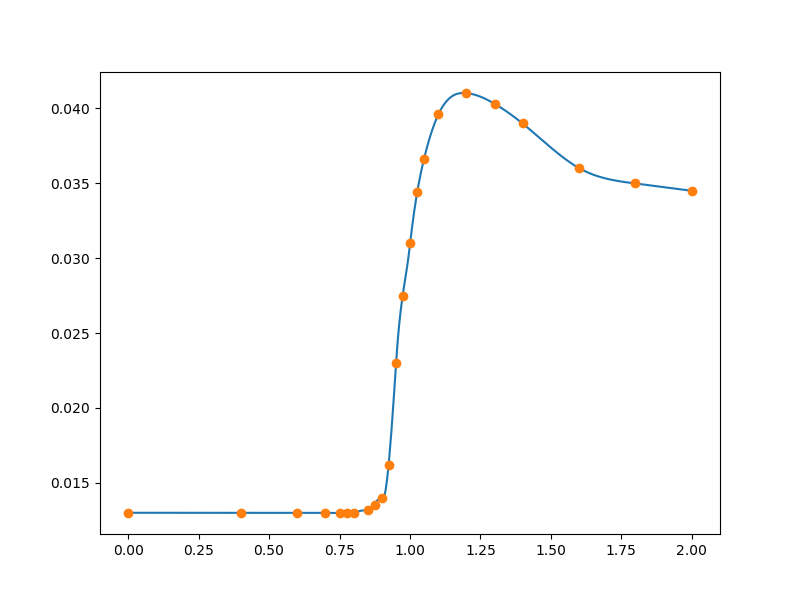

1-D step-like data set (RMTS)
=============================

RMTB
----

.. code-block:: python

  import numpy as np
  import matplotlib.pyplot as plt
  
  from smt.methods import RMTB
  
  xt = np.array([
      0.0000,    0.4000,    0.6000,    0.7000,    0.7500,
      0.7750,    0.8000,    0.8500,    0.8750,    0.9000,
      0.9250,    0.9500,    0.9750,    1.0000,    1.0250,
      1.0500,    1.1000,    1.2000,    1.3000,    1.4000,
      1.6000,    1.8000,    2.0000,
  ], dtype=np.float64)
  yt = np.array([
      0.0130,     0.0130,     0.0130,     0.0130,   0.0130,
      0.0130,     0.0130,     0.0132,     0.0135,   0.0140,
      0.0162,     0.0230,     0.0275,     0.0310,   0.0344,
      0.0366,     0.0396,     0.0410,     0.0403,   0.0390,
      0.0360,     0.0350,     0.0345,
  ], dtype=np.float64)
  
  xlimits = np.array([[0.0, 2.0]])
  
  interp = RMTB(num_ctrl_pts=100, xlimits=xlimits, nln_max_iter=20, reg_cons=1e-14)
  
  interp.set_training_values(xt, yt)
  interp.train()
  
  num = 500
  
  x = np.linspace(0., 2., num)
  y = interp.predict_values(x)[:, 0]
  
  plt.plot(x, y)
  plt.plot(xt, yt, 'o')
  plt.show()
  
::

  ___________________________________________________________________________
     
                                     RMTB
  ___________________________________________________________________________
     
   Problem size
     
        # training points.        : 23
     
  ___________________________________________________________________________
     
   Training
     
     Training ...
        Pre-computing matrices ...
           Computing dof2coeff ...
           Computing dof2coeff - done. Time (sec):  0.0000041
           Initializing Hessian ...
           Initializing Hessian - done. Time (sec):  0.0003760
           Computing energy terms ...
           Computing energy terms - done. Time (sec):  0.0012729
           Computing approximation terms ...
           Computing approximation terms - done. Time (sec):  0.0004632
        Pre-computing matrices - done. Time (sec):  0.0021849
        Solving for degrees of freedom ...
           Solving initial linear problem (n=100) ...
              Assembling linear system ...
              Assembling linear system - done. Time (sec):  0.0004983
              Initializing linear solver ...
              Initializing linear solver - done. Time (sec):  0.0000229
              Solving linear system (col. 0) ...
                 Running cg Krylov solver (100 x 100 mtx) ...
                 Running cg Krylov solver (100 x 100 mtx) - done. Time (sec):  0.0072732
              Solving linear system (col. 0) - done. Time (sec):  0.0073061
           Solving initial linear problem (n=100) - done. Time (sec):  0.0078588
           Solving nonlinear problem (col. 0) ...
              Nonlinear (itn, iy, grad. norm, func.) :   0   0 1.552186811e-11 2.217740009e-13
                 Assembling linear system ...
                 Assembling linear system - done. Time (sec):  0.0008302
                 Initializing linear solver ...
                 Initializing linear solver - done. Time (sec):  0.0000250
                 Solving linear system ...
                 Solving linear system - done. Time (sec):  0.0079062
                 Performing line search ...
                 Performing line search - done. Time (sec):  0.0003719
              Nonlinear (itn, iy, grad. norm, func.) :   1   0 1.404041039e-11 2.190118366e-13
                 Assembling linear system ...
                 Assembling linear system - done. Time (sec):  0.0008080
                 Initializing linear solver ...
                 Initializing linear solver - done. Time (sec):  0.0000272
                 Solving linear system ...
                 Solving linear system - done. Time (sec):  0.0052459
                 Performing line search ...
                 Performing line search - done. Time (sec):  0.0000420
              Nonlinear (itn, iy, grad. norm, func.) :   2   0 4.546609896e-10 1.386359367e-13
                 Assembling linear system ...
                 Assembling linear system - done. Time (sec):  0.0011539
                 Initializing linear solver ...
                 Initializing linear solver - done. Time (sec):  0.0000918
                 Solving linear system ...
                 Solving linear system - done. Time (sec):  0.0051870
                 Performing line search ...
                 Performing line search - done. Time (sec):  0.0000429
              Nonlinear (itn, iy, grad. norm, func.) :   3   0 3.061396389e-10 8.862628830e-14
                 Assembling linear system ...
                 Assembling linear system - done. Time (sec):  0.0008037
                 Initializing linear solver ...
                 Initializing linear solver - done. Time (sec):  0.0000269
                 Solving linear system ...
                 Solving linear system - done. Time (sec):  0.0050550
                 Performing line search ...
                 Performing line search - done. Time (sec):  0.0000420
              Nonlinear (itn, iy, grad. norm, func.) :   4   0 8.996405942e-11 2.349517856e-14
                 Assembling linear system ...
                 Assembling linear system - done. Time (sec):  0.0008039
                 Initializing linear solver ...
                 Initializing linear solver - done. Time (sec):  0.0000300
                 Solving linear system ...
                 Solving linear system - done. Time (sec):  0.0050232
                 Performing line search ...
                 Performing line search - done. Time (sec):  0.0000420
              Nonlinear (itn, iy, grad. norm, func.) :   5   0 2.599226877e-11 1.114104776e-14
                 Assembling linear system ...
                 Assembling linear system - done. Time (sec):  0.0008340
                 Initializing linear solver ...
                 Initializing linear solver - done. Time (sec):  0.0000291
                 Solving linear system ...
                 Solving linear system - done. Time (sec):  0.0049357
                 Performing line search ...
                 Performing line search - done. Time (sec):  0.0000720
              Nonlinear (itn, iy, grad. norm, func.) :   6   0 8.122882728e-12 9.097495833e-15
                 Assembling linear system ...
                 Assembling linear system - done. Time (sec):  0.0016429
                 Initializing linear solver ...
                 Initializing linear solver - done. Time (sec):  0.0000510
                 Solving linear system ...
                 Solving linear system - done. Time (sec):  0.0076821
                 Performing line search ...
                 Performing line search - done. Time (sec):  0.0001013
              Nonlinear (itn, iy, grad. norm, func.) :   7   0 7.536042956e-12 9.064665549e-15
                 Assembling linear system ...
                 Assembling linear system - done. Time (sec):  0.0008497
                 Initializing linear solver ...
                 Initializing linear solver - done. Time (sec):  0.0000341
                 Solving linear system ...
                 Solving linear system - done. Time (sec):  0.0061841
                 Performing line search ...
                 Performing line search - done. Time (sec):  0.0000429
              Nonlinear (itn, iy, grad. norm, func.) :   8   0 2.061562843e-12 8.549347848e-15
                 Assembling linear system ...
                 Assembling linear system - done. Time (sec):  0.0008078
                 Initializing linear solver ...
                 Initializing linear solver - done. Time (sec):  0.0000300
                 Solving linear system ...
                 Solving linear system - done. Time (sec):  0.0054851
                 Performing line search ...
                 Performing line search - done. Time (sec):  0.0001280
              Nonlinear (itn, iy, grad. norm, func.) :   9   0 5.697949874e-13 8.474106456e-15
                 Assembling linear system ...
                 Assembling linear system - done. Time (sec):  0.0016298
                 Initializing linear solver ...
                 Initializing linear solver - done. Time (sec):  0.0000329
                 Solving linear system ...
                 Solving linear system - done. Time (sec):  0.0052459
                 Performing line search ...
                 Performing line search - done. Time (sec):  0.0000529
              Nonlinear (itn, iy, grad. norm, func.) :  10   0 1.822891031e-13 8.460318161e-15
                 Assembling linear system ...
                 Assembling linear system - done. Time (sec):  0.0008578
                 Initializing linear solver ...
                 Initializing linear solver - done. Time (sec):  0.0000310
                 Solving linear system ...
                 Solving linear system - done. Time (sec):  0.0058992
                 Performing line search ...
                 Performing line search - done. Time (sec):  0.0000429
              Nonlinear (itn, iy, grad. norm, func.) :  11   0 5.079064365e-14 8.454141952e-15
                 Assembling linear system ...
                 Assembling linear system - done. Time (sec):  0.0008142
                 Initializing linear solver ...
                 Initializing linear solver - done. Time (sec):  0.0000272
                 Solving linear system ...
                 Solving linear system - done. Time (sec):  0.0057080
                 Performing line search ...
                 Performing line search - done. Time (sec):  0.0000520
              Nonlinear (itn, iy, grad. norm, func.) :  12   0 1.436505672e-14 8.453442685e-15
                 Assembling linear system ...
                 Assembling linear system - done. Time (sec):  0.0008559
                 Initializing linear solver ...
                 Initializing linear solver - done. Time (sec):  0.0000308
                 Solving linear system ...
                 Solving linear system - done. Time (sec):  0.0098960
                 Performing line search ...
                 Performing line search - done. Time (sec):  0.0000470
              Nonlinear (itn, iy, grad. norm, func.) :  13   0 4.930948651e-15 8.453304906e-15
                 Assembling linear system ...
                 Assembling linear system - done. Time (sec):  0.0013549
                 Initializing linear solver ...
                 Initializing linear solver - done. Time (sec):  0.0000381
                 Solving linear system ...
                 Solving linear system - done. Time (sec):  0.0055859
                 Performing line search ...
                 Performing line search - done. Time (sec):  0.0000739
              Nonlinear (itn, iy, grad. norm, func.) :  14   0 3.105126397e-15 8.453286412e-15
                 Assembling linear system ...
                 Assembling linear system - done. Time (sec):  0.0008900
                 Initializing linear solver ...
                 Initializing linear solver - done. Time (sec):  0.0000288
                 Solving linear system ...
                 Solving linear system - done. Time (sec):  0.0065799
                 Performing line search ...
                 Performing line search - done. Time (sec):  0.0000439
              Nonlinear (itn, iy, grad. norm, func.) :  15   0 2.091950846e-15 8.453285440e-15
                 Assembling linear system ...
                 Assembling linear system - done. Time (sec):  0.0008419
                 Initializing linear solver ...
                 Initializing linear solver - done. Time (sec):  0.0000291
                 Solving linear system ...
                 Solving linear system - done. Time (sec):  0.0057123
                 Performing line search ...
                 Performing line search - done. Time (sec):  0.0000532
              Nonlinear (itn, iy, grad. norm, func.) :  16   0 1.629696614e-15 8.453276777e-15
                 Assembling linear system ...
                 Assembling linear system - done. Time (sec):  0.0008452
                 Initializing linear solver ...
                 Initializing linear solver - done. Time (sec):  0.0000379
                 Solving linear system ...
                 Solving linear system - done. Time (sec):  0.0049903
                 Performing line search ...
                 Performing line search - done. Time (sec):  0.0000570
              Nonlinear (itn, iy, grad. norm, func.) :  17   0 3.581438694e-16 8.453270889e-15
                 Assembling linear system ...
                 Assembling linear system - done. Time (sec):  0.0009091
                 Initializing linear solver ...
                 Initializing linear solver - done. Time (sec):  0.0000341
                 Solving linear system ...
                 Solving linear system - done. Time (sec):  0.0049510
                 Performing line search ...
                 Performing line search - done. Time (sec):  0.0001001
              Nonlinear (itn, iy, grad. norm, func.) :  18   0 2.792878910e-16 8.453270841e-15
                 Assembling linear system ...
                 Assembling linear system - done. Time (sec):  0.0024838
                 Initializing linear solver ...
                 Initializing linear solver - done. Time (sec):  0.0000520
                 Solving linear system ...
                 Solving linear system - done. Time (sec):  0.0003777
                 Performing line search ...
                 Performing line search - done. Time (sec):  0.0010190
              Nonlinear (itn, iy, grad. norm, func.) :  19   0 2.792836490e-16 8.453270841e-15
                 Assembling linear system ...
                 Assembling linear system - done. Time (sec):  0.0014169
                 Initializing linear solver ...
                 Initializing linear solver - done. Time (sec):  0.0000520
                 Solving linear system ...
                 Solving linear system - done. Time (sec):  0.0003860
                 Performing line search ...
                 Performing line search - done. Time (sec):  0.0014663
              Nonlinear (itn, iy, grad. norm, func.) :  20   0 2.792836485e-16 8.453270841e-15
           Solving nonlinear problem (col. 0) - done. Time (sec):  0.1466680
        Solving for degrees of freedom - done. Time (sec):  0.1546299
     Training - done. Time (sec):  0.1572402
  ___________________________________________________________________________
     
   Evaluation
     
        # eval points. : 500
     
     Predicting ...
     Predicting - done. Time (sec):  0.0008550
     
     Prediction time/pt. (sec) :  0.0000017
     
  

RMTC
----

.. code-block:: python

  import numpy as np
  import matplotlib.pyplot as plt
  
  from smt.methods import RMTC
  
  xt = np.array([
      0.0000,    0.4000,    0.6000,    0.7000,    0.7500,
      0.7750,    0.8000,    0.8500,    0.8750,    0.9000,
      0.9250,    0.9500,    0.9750,    1.0000,    1.0250,
      1.0500,    1.1000,    1.2000,    1.3000,    1.4000,
      1.6000,    1.8000,    2.0000,
  ], dtype=np.float64)
  yt = np.array([
      0.0130,     0.0130,     0.0130,     0.0130,   0.0130,
      0.0130,     0.0130,     0.0132,     0.0135,   0.0140,
      0.0162,     0.0230,     0.0275,     0.0310,   0.0344,
      0.0366,     0.0396,     0.0410,     0.0403,   0.0390,
      0.0360,     0.0350,     0.0345,
  ], dtype=np.float64)
  
  xlimits = np.array([[0.0, 2.0]])
  
  interp = RMTC(num_elements=40, xlimits=xlimits, nln_max_iter=20, reg_cons=1e-14)
  
  interp.set_training_values(xt, yt)
  interp.train()
  
  num = 500
  
  x = np.linspace(0., 2., num)
  y = interp.predict_values(x)[:, 0]
  
  plt.plot(x, y)
  plt.plot(xt, yt, 'o')
  plt.show()
  
::

  ___________________________________________________________________________
     
                                     RMTC
  ___________________________________________________________________________
     
   Problem size
     
        # training points.        : 23
     
  ___________________________________________________________________________
     
   Training
     
     Training ...
        Pre-computing matrices ...
           Computing dof2coeff ...
           Computing dof2coeff - done. Time (sec):  0.0008280
           Initializing Hessian ...
           Initializing Hessian - done. Time (sec):  0.0002701
           Computing energy terms ...
           Computing energy terms - done. Time (sec):  0.0012443
           Computing approximation terms ...
           Computing approximation terms - done. Time (sec):  0.0005398
        Pre-computing matrices - done. Time (sec):  0.0029609
        Solving for degrees of freedom ...
           Solving initial linear problem (n=82) ...
              Assembling linear system ...
              Assembling linear system - done. Time (sec):  0.0004811
              Initializing linear solver ...
              Initializing linear solver - done. Time (sec):  0.0000222
              Solving linear system (col. 0) ...
                 Running cg Krylov solver (82 x 82 mtx) ...
                 Running cg Krylov solver (82 x 82 mtx) - done. Time (sec):  0.0049541
              Solving linear system (col. 0) - done. Time (sec):  0.0049851
           Solving initial linear problem (n=82) - done. Time (sec):  0.0055208
           Solving nonlinear problem (col. 0) ...
              Nonlinear (itn, iy, grad. norm, func.) :   0   0 7.483532044e-12 2.493150298e-14
                 Assembling linear system ...
                 Assembling linear system - done. Time (sec):  0.0008051
                 Initializing linear solver ...
                 Initializing linear solver - done. Time (sec):  0.0000229
                 Solving linear system ...
                 Solving linear system - done. Time (sec):  0.0059080
                 Performing line search ...
                 Performing line search - done. Time (sec):  0.0002398
              Nonlinear (itn, iy, grad. norm, func.) :   1   0 9.032495044e-12 2.482796195e-14
                 Assembling linear system ...
                 Assembling linear system - done. Time (sec):  0.0008209
                 Initializing linear solver ...
                 Initializing linear solver - done. Time (sec):  0.0000310
                 Solving linear system ...
                 Solving linear system - done. Time (sec):  0.0049558
                 Performing line search ...
                 Performing line search - done. Time (sec):  0.0001011
              Nonlinear (itn, iy, grad. norm, func.) :   2   0 8.671236796e-11 2.387442557e-14
                 Assembling linear system ...
                 Assembling linear system - done. Time (sec):  0.0007970
                 Initializing linear solver ...
                 Initializing linear solver - done. Time (sec):  0.0000272
                 Solving linear system ...
                 Solving linear system - done. Time (sec):  0.0049150
                 Performing line search ...
                 Performing line search - done. Time (sec):  0.0000718
              Nonlinear (itn, iy, grad. norm, func.) :   3   0 9.651613003e-11 2.269711639e-14
                 Assembling linear system ...
                 Assembling linear system - done. Time (sec):  0.0007899
                 Initializing linear solver ...
                 Initializing linear solver - done. Time (sec):  0.0000262
                 Solving linear system ...
                 Solving linear system - done. Time (sec):  0.0052941
                 Performing line search ...
                 Performing line search - done. Time (sec):  0.0000429
              Nonlinear (itn, iy, grad. norm, func.) :   4   0 2.832795000e-11 1.317843273e-14
                 Assembling linear system ...
                 Assembling linear system - done. Time (sec):  0.0007899
                 Initializing linear solver ...
                 Initializing linear solver - done. Time (sec):  0.0000269
                 Solving linear system ...
                 Solving linear system - done. Time (sec):  0.0049000
                 Performing line search ...
                 Performing line search - done. Time (sec):  0.0000720
              Nonlinear (itn, iy, grad. norm, func.) :   5   0 1.513844619e-11 1.197072509e-14
                 Assembling linear system ...
                 Assembling linear system - done. Time (sec):  0.0010662
                 Initializing linear solver ...
                 Initializing linear solver - done. Time (sec):  0.0000300
                 Solving linear system ...
                 Solving linear system - done. Time (sec):  0.0055060
                 Performing line search ...
                 Performing line search - done. Time (sec):  0.0000548
              Nonlinear (itn, iy, grad. norm, func.) :   6   0 4.305373634e-12 1.123414104e-14
                 Assembling linear system ...
                 Assembling linear system - done. Time (sec):  0.0008540
                 Initializing linear solver ...
                 Initializing linear solver - done. Time (sec):  0.0000310
                 Solving linear system ...
                 Solving linear system - done. Time (sec):  0.0049980
                 Performing line search ...
                 Performing line search - done. Time (sec):  0.0000422
              Nonlinear (itn, iy, grad. norm, func.) :   7   0 1.267945843e-12 1.111748928e-14
                 Assembling linear system ...
                 Assembling linear system - done. Time (sec):  0.0007889
                 Initializing linear solver ...
                 Initializing linear solver - done. Time (sec):  0.0000272
                 Solving linear system ...
                 Solving linear system - done. Time (sec):  0.0060310
                 Performing line search ...
                 Performing line search - done. Time (sec):  0.0001483
              Nonlinear (itn, iy, grad. norm, func.) :   8   0 4.481785520e-13 1.109776660e-14
                 Assembling linear system ...
                 Assembling linear system - done. Time (sec):  0.0012140
                 Initializing linear solver ...
                 Initializing linear solver - done. Time (sec):  0.0000458
                 Solving linear system ...
                 Solving linear system - done. Time (sec):  0.0062761
                 Performing line search ...
                 Performing line search - done. Time (sec):  0.0000529
              Nonlinear (itn, iy, grad. norm, func.) :   9   0 1.315099112e-13 1.109095003e-14
                 Assembling linear system ...
                 Assembling linear system - done. Time (sec):  0.0008640
                 Initializing linear solver ...
                 Initializing linear solver - done. Time (sec):  0.0000322
                 Solving linear system ...
                 Solving linear system - done. Time (sec):  0.0063901
                 Performing line search ...
                 Performing line search - done. Time (sec):  0.0000501
              Nonlinear (itn, iy, grad. norm, func.) :  10   0 3.762250507e-14 1.108966145e-14
                 Assembling linear system ...
                 Assembling linear system - done. Time (sec):  0.0008347
                 Initializing linear solver ...
                 Initializing linear solver - done. Time (sec):  0.0000300
                 Solving linear system ...
                 Solving linear system - done. Time (sec):  0.0061898
                 Performing line search ...
                 Performing line search - done. Time (sec):  0.0000479
              Nonlinear (itn, iy, grad. norm, func.) :  11   0 9.912737630e-15 1.108943593e-14
                 Assembling linear system ...
                 Assembling linear system - done. Time (sec):  0.0013330
                 Initializing linear solver ...
                 Initializing linear solver - done. Time (sec):  0.0000288
                 Solving linear system ...
                 Solving linear system - done. Time (sec):  0.0050669
                 Performing line search ...
                 Performing line search - done. Time (sec):  0.0000439
              Nonlinear (itn, iy, grad. norm, func.) :  12   0 2.005184866e-15 1.108940543e-14
                 Assembling linear system ...
                 Assembling linear system - done. Time (sec):  0.0008180
                 Initializing linear solver ...
                 Initializing linear solver - done. Time (sec):  0.0000293
                 Solving linear system ...
                 Solving linear system - done. Time (sec):  0.0055308
                 Performing line search ...
                 Performing line search - done. Time (sec):  0.0000436
              Nonlinear (itn, iy, grad. norm, func.) :  13   0 1.932624149e-16 1.108940342e-14
                 Assembling linear system ...
                 Assembling linear system - done. Time (sec):  0.0008149
                 Initializing linear solver ...
                 Initializing linear solver - done. Time (sec):  0.0000339
                 Solving linear system ...
                 Solving linear system - done. Time (sec):  0.0050902
                 Performing line search ...
                 Performing line search - done. Time (sec):  0.0000529
              Nonlinear (itn, iy, grad. norm, func.) :  14   0 6.579070269e-18 1.108940339e-14
           Solving nonlinear problem (col. 0) - done. Time (sec):  0.0993528
        Solving for degrees of freedom - done. Time (sec):  0.1049502
     Training - done. Time (sec):  0.1083148
  ___________________________________________________________________________
     
   Evaluation
     
        # eval points. : 500
     
     Predicting ...
     Predicting - done. Time (sec):  0.0005541
     
     Prediction time/pt. (sec) :  0.0000011
     
  

