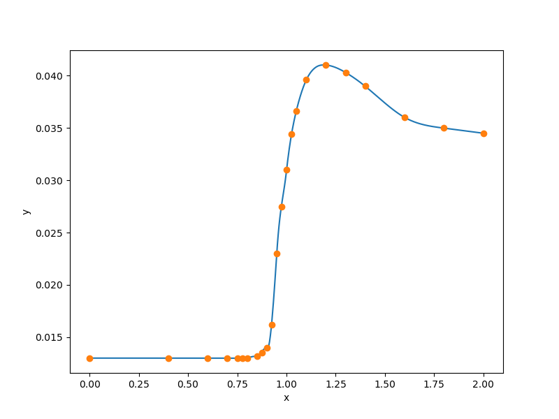

1-D step-like data set
======================

.. code-block:: python

  import numpy as np
  
  
  def get_one_d_step():
      xt = np.array([
          0.0000,    0.4000,    0.6000,    0.7000,    0.7500,
          0.7750,    0.8000,    0.8500,    0.8750,    0.9000,
          0.9250,    0.9500,    0.9750,    1.0000,    1.0250,
          1.0500,    1.1000,    1.2000,    1.3000,    1.4000,
          1.6000,    1.8000,    2.0000,
      ], dtype=np.float64)
      yt = np.array([
          0.0130,     0.0130,     0.0130,     0.0130,   0.0130,
          0.0130,     0.0130,     0.0132,     0.0135,   0.0140,
          0.0162,     0.0230,     0.0275,     0.0310,   0.0344,
          0.0366,     0.0396,     0.0410,     0.0403,   0.0390,
          0.0360,     0.0350,     0.0345,
      ], dtype=np.float64)
  
      xlimits = np.array([[0.0, 2.0]])
  
      return xt, yt, xlimits
  
  
  def plot_one_d_step(xt, yt, limits, interp):
      import numpy as np
      import matplotlib
      matplotlib.use('Agg')
      import matplotlib.pyplot as plt
  
      num = 500
      x = np.linspace(0., 2., num)
      y = interp.predict_values(x)[:, 0]
  
      plt.plot(x, y)
      plt.plot(xt, yt, 'o')
      plt.xlabel('x')
      plt.ylabel('y')
      plt.show()
  

RMTB
----

.. code-block:: python

  from smt.methods import RMTB
  from smt.examples.one_d_step import get_one_d_step, plot_one_d_step
  
  xt, yt, xlimits = get_one_d_step()
  
  interp = RMTB(num_ctrl_pts=100, xlimits=xlimits, nonlinear_maxiter=20,
      solver_tolerance=1e-16, energy_weight=1e-14, regularization_weight=0.)
  interp.set_training_values(xt, yt)
  interp.train()
  
  plot_one_d_step(xt, yt, xlimits, interp)
  
::

  ___________________________________________________________________________
     
                                     RMTB
  ___________________________________________________________________________
     
   Problem size
     
        # training points.        : 23
     
  ___________________________________________________________________________
     
   Training
     
     Training ...
        Pre-computing matrices ...
           Computing dof2coeff ...
           Computing dof2coeff - done. Time (sec):  0.0000060
           Initializing Hessian ...
           Initializing Hessian - done. Time (sec):  0.0006499
           Computing energy terms ...
           Computing energy terms - done. Time (sec):  0.0026019
           Computing approximation terms ...
           Computing approximation terms - done. Time (sec):  0.0010779
        Pre-computing matrices - done. Time (sec):  0.0044849
        Solving for degrees of freedom ...
           Solving initial startup problem (n=100) ...
              Solving for output 0 ...
                 Iteration (num., iy, grad. norm, func.) :   0   0 1.032652876e-01 8.436300000e-03
                 Iteration (num., iy, grad. norm, func.) :   0   0 6.450151056e-08 2.293337503e-13
              Solving for output 0 - done. Time (sec):  0.0150869
           Solving initial startup problem (n=100) - done. Time (sec):  0.0151780
           Solving nonlinear problem (n=100) ...
              Solving for output 0 ...
                 Iteration (num., iy, grad. norm, func.) :   0   0 1.427045627e-11 2.251640048e-13
                 Iteration (num., iy, grad. norm, func.) :   0   0 1.257474689e-11 2.223873525e-13
                 Iteration (num., iy, grad. norm, func.) :   1   0 4.527766832e-10 1.381388412e-13
                 Iteration (num., iy, grad. norm, func.) :   2   0 3.102435443e-10 8.971318961e-14
                 Iteration (num., iy, grad. norm, func.) :   3   0 9.122479124e-11 2.367736686e-14
                 Iteration (num., iy, grad. norm, func.) :   4   0 2.636423913e-11 1.117589674e-14
                 Iteration (num., iy, grad. norm, func.) :   5   0 7.954280430e-12 9.069776333e-15
                 Iteration (num., iy, grad. norm, func.) :   6   0 1.972681901e-12 8.530458824e-15
                 Iteration (num., iy, grad. norm, func.) :   7   0 4.136627116e-13 8.463867518e-15
                 Iteration (num., iy, grad. norm, func.) :   8   0 9.616763605e-14 8.455568065e-15
                 Iteration (num., iy, grad. norm, func.) :   9   0 2.902764443e-14 8.453687824e-15
                 Iteration (num., iy, grad. norm, func.) :  10   0 1.282320394e-14 8.453456157e-15
                 Iteration (num., iy, grad. norm, func.) :  11   0 9.487999942e-15 8.453386796e-15
                 Iteration (num., iy, grad. norm, func.) :  12   0 9.945802178e-15 8.453330119e-15
                 Iteration (num., iy, grad. norm, func.) :  13   0 2.720624241e-15 8.453282186e-15
                 Iteration (num., iy, grad. norm, func.) :  14   0 2.309774706e-15 8.453282158e-15
                 Iteration (num., iy, grad. norm, func.) :  15   0 6.557909836e-16 8.453273791e-15
                 Iteration (num., iy, grad. norm, func.) :  16   0 3.075573095e-16 8.453271361e-15
                 Iteration (num., iy, grad. norm, func.) :  17   0 3.571746920e-16 8.453271354e-15
                 Iteration (num., iy, grad. norm, func.) :  18   0 1.190712320e-16 8.453270671e-15
                 Iteration (num., iy, grad. norm, func.) :  19   0 3.875757302e-16 8.453270574e-15
              Solving for output 0 - done. Time (sec):  0.1407499
           Solving nonlinear problem (n=100) - done. Time (sec):  0.1408172
        Solving for degrees of freedom - done. Time (sec):  0.1560979
     Training - done. Time (sec):  0.1612141
  ___________________________________________________________________________
     
   Evaluation
     
        # eval points. : 500
     
     Predicting ...
     Predicting - done. Time (sec):  0.0004890
     
     Prediction time/pt. (sec) :  0.0000010
     
  

RMTC
----

.. code-block:: python

  from smt.methods import RMTC
  from smt.examples.one_d_step import get_one_d_step, plot_one_d_step
  
  xt, yt, xlimits = get_one_d_step()
  
  interp = RMTC(num_elements=40, xlimits=xlimits, nonlinear_maxiter=20,
      solver_tolerance=1e-16, energy_weight=1e-14, regularization_weight=0.)
  interp.set_training_values(xt, yt)
  interp.train()
  
  plot_one_d_step(xt, yt, xlimits, interp)
  
::

  ___________________________________________________________________________
     
                                     RMTC
  ___________________________________________________________________________
     
   Problem size
     
        # training points.        : 23
     
  ___________________________________________________________________________
     
   Training
     
     Training ...
        Pre-computing matrices ...
           Computing dof2coeff ...
           Computing dof2coeff - done. Time (sec):  0.0007770
           Initializing Hessian ...
           Initializing Hessian - done. Time (sec):  0.0003102
           Computing energy terms ...
           Computing energy terms - done. Time (sec):  0.0011668
           Computing approximation terms ...
           Computing approximation terms - done. Time (sec):  0.0005200
        Pre-computing matrices - done. Time (sec):  0.0028300
        Solving for degrees of freedom ...
           Solving initial startup problem (n=82) ...
              Solving for output 0 ...
                 Iteration (num., iy, grad. norm, func.) :   0   0 1.470849329e-01 8.436300000e-03
                 Iteration (num., iy, grad. norm, func.) :   0   0 9.247786014e-10 2.493640129e-14
              Solving for output 0 - done. Time (sec):  0.0065310
           Solving initial startup problem (n=82) - done. Time (sec):  0.0065947
           Solving nonlinear problem (n=82) ...
              Solving for output 0 ...
                 Iteration (num., iy, grad. norm, func.) :   0   0 7.484040934e-12 2.493593876e-14
                 Iteration (num., iy, grad. norm, func.) :   0   0 9.032474441e-12 2.483229615e-14
                 Iteration (num., iy, grad. norm, func.) :   1   0 8.524071904e-11 2.371029299e-14
                 Iteration (num., iy, grad. norm, func.) :   2   0 4.548381717e-11 1.697968148e-14
                 Iteration (num., iy, grad. norm, func.) :   3   0 4.289197076e-11 1.655363158e-14
                 Iteration (num., iy, grad. norm, func.) :   4   0 1.484067476e-11 1.210235795e-14
                 Iteration (num., iy, grad. norm, func.) :   5   0 4.214372513e-12 1.120623342e-14
                 Iteration (num., iy, grad. norm, func.) :   6   0 6.771498846e-13 1.109821368e-14
                 Iteration (num., iy, grad. norm, func.) :   7   0 1.551570970e-13 1.109142780e-14
                 Iteration (num., iy, grad. norm, func.) :   8   0 8.532217095e-14 1.109025897e-14
                 Iteration (num., iy, grad. norm, func.) :   9   0 2.331700417e-14 1.108952450e-14
                 Iteration (num., iy, grad. norm, func.) :  10   0 5.770675015e-15 1.108941613e-14
                 Iteration (num., iy, grad. norm, func.) :  11   0 1.019560468e-15 1.108940408e-14
                 Iteration (num., iy, grad. norm, func.) :  12   0 8.513554605e-17 1.108940343e-14
              Solving for output 0 - done. Time (sec):  0.0937321
           Solving nonlinear problem (n=82) - done. Time (sec):  0.0937800
        Solving for degrees of freedom - done. Time (sec):  0.1004300
     Training - done. Time (sec):  0.1036313
  ___________________________________________________________________________
     
   Evaluation
     
        # eval points. : 500
     
     Predicting ...
     Predicting - done. Time (sec):  0.0005100
     
     Prediction time/pt. (sec) :  0.0000010
     
  

