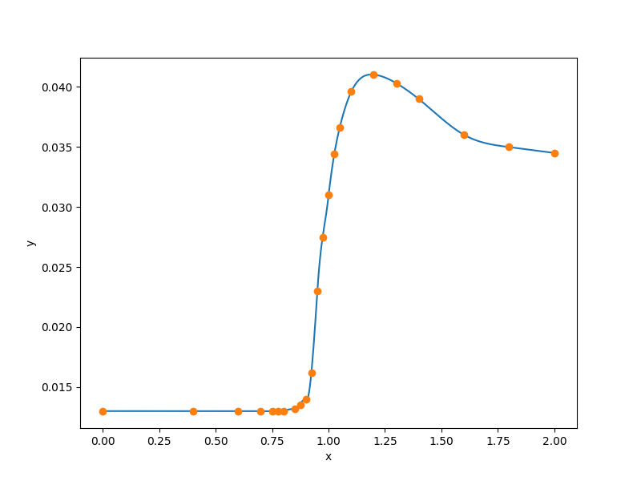

1-D step-like data set
======================

.. code-block:: python

  import numpy as np
  
  
  def get_one_d_step():
      xt = np.array(
          [
              0.0000,
              0.4000,
              0.6000,
              0.7000,
              0.7500,
              0.7750,
              0.8000,
              0.8500,
              0.8750,
              0.9000,
              0.9250,
              0.9500,
              0.9750,
              1.0000,
              1.0250,
              1.0500,
              1.1000,
              1.2000,
              1.3000,
              1.4000,
              1.6000,
              1.8000,
              2.0000,
          ],
          dtype=np.float64,
      )
      yt = np.array(
          [
              0.0130,
              0.0130,
              0.0130,
              0.0130,
              0.0130,
              0.0130,
              0.0130,
              0.0132,
              0.0135,
              0.0140,
              0.0162,
              0.0230,
              0.0275,
              0.0310,
              0.0344,
              0.0366,
              0.0396,
              0.0410,
              0.0403,
              0.0390,
              0.0360,
              0.0350,
              0.0345,
          ],
          dtype=np.float64,
      )
  
      xlimits = np.array([[0.0, 2.0]])
  
      return xt, yt, xlimits
  
  
  def plot_one_d_step(xt, yt, limits, interp):
      import numpy as np
      import matplotlib
  
      matplotlib.use("Agg")
      import matplotlib.pyplot as plt
  
      num = 500
      x = np.linspace(0.0, 2.0, num)
      y = interp.predict_values(x)[:, 0]
  
      plt.plot(x, y)
      plt.plot(xt, yt, "o")
      plt.xlabel("x")
      plt.ylabel("y")
      plt.show()
  

RMTB
----

.. code-block:: python

  from smt.surrogate_models import RMTB
  from smt.examples.one_D_step.one_D_step import get_one_d_step, plot_one_d_step
  
  xt, yt, xlimits = get_one_d_step()
  
  interp = RMTB(
      num_ctrl_pts=100,
      xlimits=xlimits,
      nonlinear_maxiter=20,
      solver_tolerance=1e-16,
      energy_weight=1e-14,
      regularization_weight=0.0,
  )
  interp.set_training_values(xt, yt)
  interp.train()
  
  plot_one_d_step(xt, yt, xlimits, interp)
  
::

  ___________________________________________________________________________
     
                                     RMTB
  ___________________________________________________________________________
     
   Problem size
     
        # training points.        : 23
     
  ___________________________________________________________________________
     
   Training
     
     Training ...
        Pre-computing matrices ...
           Computing dof2coeff ...
           Computing dof2coeff - done. Time (sec):  0.0000000
           Initializing Hessian ...
           Initializing Hessian - done. Time (sec):  0.0000000
           Computing energy terms ...
           Computing energy terms - done. Time (sec):  0.0000000
           Computing approximation terms ...
           Computing approximation terms - done. Time (sec):  0.0000000
        Pre-computing matrices - done. Time (sec):  0.0000000
        Solving for degrees of freedom ...
           Solving initial startup problem (n=100) ...
              Solving for output 0 ...
                 Iteration (num., iy, grad. norm, func.) :   0   0 1.032652876e-01 8.436300000e-03
                 Iteration (num., iy, grad. norm, func.) :   0   0 8.326567782e-09 2.218506146e-13
              Solving for output 0 - done. Time (sec):  0.0100002
           Solving initial startup problem (n=100) - done. Time (sec):  0.0100002
           Solving nonlinear problem (n=100) ...
              Solving for output 0 ...
                 Iteration (num., iy, grad. norm, func.) :   0   0 1.550397729e-11 2.217742297e-13
                 Iteration (num., iy, grad. norm, func.) :   0   0 1.400133688e-11 2.190130776e-13
                 Iteration (num., iy, grad. norm, func.) :   1   0 4.569917417e-10 1.398657411e-13
                 Iteration (num., iy, grad. norm, func.) :   2   0 3.273418041e-10 9.582645418e-14
                 Iteration (num., iy, grad. norm, func.) :   3   0 9.631253690e-11 2.487556028e-14
                 Iteration (num., iy, grad. norm, func.) :   4   0 2.807786097e-11 1.154934069e-14
                 Iteration (num., iy, grad. norm, func.) :   5   0 1.047652622e-11 9.424623014e-15
                 Iteration (num., iy, grad. norm, func.) :   6   0 2.796406609e-12 8.629430946e-15
                 Iteration (num., iy, grad. norm, func.) :   7   0 2.503249902e-12 8.611872251e-15
                 Iteration (num., iy, grad. norm, func.) :   8   0 1.673758712e-12 8.544715841e-15
                 Iteration (num., iy, grad. norm, func.) :   9   0 4.321920620e-13 8.467209450e-15
                 Iteration (num., iy, grad. norm, func.) :  10   0 1.206983452e-13 8.455862293e-15
                 Iteration (num., iy, grad. norm, func.) :  11   0 3.366638988e-14 8.453930122e-15
                 Iteration (num., iy, grad. norm, func.) :  12   0 1.432594106e-14 8.453696373e-15
                 Iteration (num., iy, grad. norm, func.) :  13   0 1.419395614e-14 8.453592635e-15
                 Iteration (num., iy, grad. norm, func.) :  14   0 3.778253812e-15 8.453316574e-15
                 Iteration (num., iy, grad. norm, func.) :  15   0 1.065786022e-15 8.453276042e-15
                 Iteration (num., iy, grad. norm, func.) :  16   0 2.072128988e-15 8.453275135e-15
                 Iteration (num., iy, grad. norm, func.) :  17   0 1.842351695e-16 8.453270514e-15
                 Iteration (num., iy, grad. norm, func.) :  18   0 1.015886357e-16 8.453270452e-15
                 Iteration (num., iy, grad. norm, func.) :  19   0 1.015887329e-16 8.453270452e-15
              Solving for output 0 - done. Time (sec):  0.1299999
           Solving nonlinear problem (n=100) - done. Time (sec):  0.1299999
        Solving for degrees of freedom - done. Time (sec):  0.1400001
     Training - done. Time (sec):  0.1400001
  ___________________________________________________________________________
     
   Evaluation
     
        # eval points. : 500
     
     Predicting ...
     Predicting - done. Time (sec):  0.0000000
     
     Prediction time/pt. (sec) :  0.0000000
     
  

RMTC
----

.. code-block:: python

  from smt.surrogate_models import RMTC
  from smt.examples.one_D_step.one_D_step import get_one_d_step, plot_one_d_step
  
  xt, yt, xlimits = get_one_d_step()
  
  interp = RMTC(
      num_elements=40,
      xlimits=xlimits,
      nonlinear_maxiter=20,
      solver_tolerance=1e-16,
      energy_weight=1e-14,
      regularization_weight=0.0,
  )
  interp.set_training_values(xt, yt)
  interp.train()
  
  plot_one_d_step(xt, yt, xlimits, interp)
  
::

  ___________________________________________________________________________
     
                                     RMTC
  ___________________________________________________________________________
     
   Problem size
     
        # training points.        : 23
     
  ___________________________________________________________________________
     
   Training
     
     Training ...
        Pre-computing matrices ...
           Computing dof2coeff ...
           Computing dof2coeff - done. Time (sec):  0.0000000
           Initializing Hessian ...
           Initializing Hessian - done. Time (sec):  0.0000000
           Computing energy terms ...
           Computing energy terms - done. Time (sec):  0.0000000
           Computing approximation terms ...
           Computing approximation terms - done. Time (sec):  0.0000000
        Pre-computing matrices - done. Time (sec):  0.0000000
        Solving for degrees of freedom ...
           Solving initial startup problem (n=82) ...
              Solving for output 0 ...
                 Iteration (num., iy, grad. norm, func.) :   0   0 1.470849329e-01 8.436300000e-03
                 Iteration (num., iy, grad. norm, func.) :   0   0 1.271524727e-11 2.493686417e-14
              Solving for output 0 - done. Time (sec):  0.0100000
           Solving initial startup problem (n=82) - done. Time (sec):  0.0100000
           Solving nonlinear problem (n=82) ...
              Solving for output 0 ...
                 Iteration (num., iy, grad. norm, func.) :   0   0 7.484146458e-12 2.493686273e-14
                 Iteration (num., iy, grad. norm, func.) :   0   0 9.032463140e-12 2.483319826e-14
                 Iteration (num., iy, grad. norm, func.) :   1   0 8.723372989e-11 2.393675636e-14
                 Iteration (num., iy, grad. norm, func.) :   2   0 4.783883236e-11 1.793850937e-14
                 Iteration (num., iy, grad. norm, func.) :   3   0 4.678916694e-11 1.785317983e-14
                 Iteration (num., iy, grad. norm, func.) :   4   0 1.297955451e-11 1.193038054e-14
                 Iteration (num., iy, grad. norm, func.) :   5   0 3.942464065e-12 1.121509131e-14
                 Iteration (num., iy, grad. norm, func.) :   6   0 8.384726431e-13 1.110564189e-14
                 Iteration (num., iy, grad. norm, func.) :   7   0 2.581741267e-13 1.109374227e-14
                 Iteration (num., iy, grad. norm, func.) :   8   0 7.635918060e-14 1.109026987e-14
                 Iteration (num., iy, grad. norm, func.) :   9   0 2.106298788e-14 1.108953137e-14
                 Iteration (num., iy, grad. norm, func.) :  10   0 5.042586986e-15 1.108941658e-14
                 Iteration (num., iy, grad. norm, func.) :  11   0 8.730387249e-16 1.108940427e-14
                 Iteration (num., iy, grad. norm, func.) :  12   0 1.188005043e-16 1.108940347e-14
                 Iteration (num., iy, grad. norm, func.) :  13   0 2.828378041e-16 1.108940346e-14
                 Iteration (num., iy, grad. norm, func.) :  14   0 2.828383946e-16 1.108940346e-14
                 Iteration (num., iy, grad. norm, func.) :  15   0 2.828383946e-16 1.108940346e-14
                 Iteration (num., iy, grad. norm, func.) :  16   0 2.828383946e-16 1.108940346e-14
                 Iteration (num., iy, grad. norm, func.) :  17   0 2.828383946e-16 1.108940346e-14
                 Iteration (num., iy, grad. norm, func.) :  18   0 2.828383946e-16 1.108940346e-14
                 Iteration (num., iy, grad. norm, func.) :  19   0 2.828383946e-16 1.108940346e-14
              Solving for output 0 - done. Time (sec):  0.1000001
           Solving nonlinear problem (n=82) - done. Time (sec):  0.1000001
        Solving for degrees of freedom - done. Time (sec):  0.1100001
     Training - done. Time (sec):  0.1100001
  ___________________________________________________________________________
     
   Evaluation
     
        # eval points. : 500
     
     Predicting ...
     Predicting - done. Time (sec):  0.0000000
     
     Prediction time/pt. (sec) :  0.0000000
     
  

