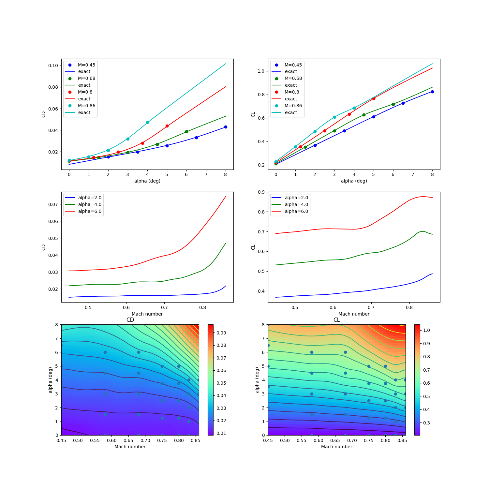

RANS CRM wing 2-D data set
==========================

.. code-block:: python

  import numpy as np
  
  
  raw = np.array([
      [2.000000000000000000e+00 ,  4.500000000000000111e-01 ,  1.536799999999999972e-02 ,  3.674239999999999728e-01 ,  5.592279999999999474e-01 , -1.258039999999999992e-01 , -1.248699999999999984e-02],
      [3.500000000000000000e+00 ,  4.500000000000000111e-01 ,  1.985100000000000059e-02 ,  4.904470000000000218e-01 ,  7.574600000000000222e-01 , -1.615260000000000029e-01 ,  8.987000000000000197e-03],
      [5.000000000000000000e+00 ,  4.500000000000000111e-01 ,  2.571000000000000021e-02 ,  6.109189999999999898e-01 ,  9.497949999999999449e-01 , -1.954619999999999969e-01 ,  4.090900000000000092e-02],
      [6.500000000000000000e+00 ,  4.500000000000000111e-01 ,  3.304200000000000192e-02 ,  7.266120000000000356e-01 ,  1.131138999999999895e+00 , -2.255890000000000117e-01 ,  8.185399999999999621e-02],
      [8.000000000000000000e+00 ,  4.500000000000000111e-01 ,  4.318999999999999923e-02 ,  8.247250000000000414e-01 ,  1.271487000000000034e+00 , -2.397040000000000004e-01 ,  1.217659999999999992e-01],
      [0.000000000000000000e+00 ,  5.799999999999999600e-01 ,  1.136200000000000057e-02 ,  2.048760000000000026e-01 ,  2.950280000000000125e-01 , -7.882100000000000217e-02 , -2.280099999999999835e-02],
      [1.500000000000000000e+00 ,  5.799999999999999600e-01 ,  1.426000000000000011e-02 ,  3.375619999999999732e-01 ,  5.114130000000000065e-01 , -1.189420000000000061e-01 , -1.588200000000000028e-02],
      [3.000000000000000000e+00 ,  5.799999999999999600e-01 ,  1.866400000000000003e-02 ,  4.687450000000000228e-01 ,  7.240400000000000169e-01 , -1.577669999999999906e-01 ,  3.099999999999999891e-03],
      [4.500000000000000000e+00 ,  5.799999999999999600e-01 ,  2.461999999999999952e-02 ,  5.976639999999999731e-01 ,  9.311709999999999710e-01 , -1.944160000000000055e-01 ,  3.357500000000000068e-02],
      [6.000000000000000000e+00 ,  5.799999999999999600e-01 ,  3.280700000000000283e-02 ,  7.142249999999999988e-01 ,  1.111707999999999918e+00 , -2.205870000000000053e-01 ,  7.151699999999999724e-02],
      [0.000000000000000000e+00 ,  6.800000000000000488e-01 ,  1.138800000000000055e-02 ,  2.099310000000000065e-01 ,  3.032230000000000203e-01 , -8.187899999999999345e-02 , -2.172699999999999979e-02],
      [1.500000000000000000e+00 ,  6.800000000000000488e-01 ,  1.458699999999999927e-02 ,  3.518569999999999753e-01 ,  5.356630000000000003e-01 , -1.257649999999999879e-01 , -1.444800000000000077e-02],
      [3.000000000000000000e+00 ,  6.800000000000000488e-01 ,  1.952800000000000022e-02 ,  4.924879999999999813e-01 ,  7.644769999999999621e-01 , -1.678040000000000087e-01 ,  6.023999999999999841e-03],
      [4.500000000000000000e+00 ,  6.800000000000000488e-01 ,  2.666699999999999973e-02 ,  6.270339999999999803e-01 ,  9.801630000000000065e-01 , -2.035240000000000105e-01 ,  3.810000000000000192e-02],
      [6.000000000000000000e+00 ,  6.800000000000000488e-01 ,  3.891800000000000120e-02 ,  7.172730000000000494e-01 ,  1.097855999999999943e+00 , -2.014620000000000022e-01 ,  6.640000000000000069e-02],
      [0.000000000000000000e+00 ,  7.500000000000000000e-01 ,  1.150699999999999987e-02 ,  2.149069999999999869e-01 ,  3.115740000000000176e-01 , -8.498999999999999611e-02 , -2.057700000000000154e-02],
      [1.250000000000000000e+00 ,  7.500000000000000000e-01 ,  1.432600000000000019e-02 ,  3.415969999999999840e-01 ,  5.199390000000000400e-01 , -1.251009999999999900e-01 , -1.515400000000000080e-02],
      [2.500000000000000000e+00 ,  7.500000000000000000e-01 ,  1.856000000000000011e-02 ,  4.677589999999999804e-01 ,  7.262499999999999512e-01 , -1.635169999999999957e-01 ,  3.989999999999999949e-04],
      [3.750000000000000000e+00 ,  7.500000000000000000e-01 ,  2.472399999999999945e-02 ,  5.911459999999999493e-01 ,  9.254930000000000101e-01 , -1.966150000000000120e-01 ,  2.524900000000000061e-02],
      [5.000000000000000000e+00 ,  7.500000000000000000e-01 ,  3.506800000000000195e-02 ,  7.047809999999999908e-01 ,  1.097736000000000045e+00 , -2.143069999999999975e-01 ,  5.321300000000000335e-02],
      [0.000000000000000000e+00 ,  8.000000000000000444e-01 ,  1.168499999999999921e-02 ,  2.196390000000000009e-01 ,  3.197160000000000002e-01 , -8.798200000000000465e-02 , -1.926999999999999894e-02],
      [1.250000000000000000e+00 ,  8.000000000000000444e-01 ,  1.481599999999999931e-02 ,  3.553939999999999877e-01 ,  5.435950000000000504e-01 , -1.317419999999999980e-01 , -1.345599999999999921e-02],
      [2.500000000000000000e+00 ,  8.000000000000000444e-01 ,  1.968999999999999917e-02 ,  4.918299999999999894e-01 ,  7.669930000000000359e-01 , -1.728079999999999894e-01 ,  3.756999999999999923e-03],
      [3.750000000000000000e+00 ,  8.000000000000000444e-01 ,  2.785599999999999882e-02 ,  6.324319999999999942e-01 ,  9.919249999999999456e-01 , -2.077100000000000057e-01 ,  3.159800000000000109e-02],
      [5.000000000000000000e+00 ,  8.000000000000000444e-01 ,  4.394300000000000289e-02 ,  7.650689999999999991e-01 ,  1.188355999999999968e+00 , -2.332680000000000031e-01 ,  5.645000000000000018e-02],
      [0.000000000000000000e+00 ,  8.299999999999999600e-01 ,  1.186100000000000002e-02 ,  2.232899999999999885e-01 ,  3.261100000000000110e-01 , -9.028400000000000314e-02 , -1.806500000000000120e-02],
      [1.000000000000000000e+00 ,  8.299999999999999600e-01 ,  1.444900000000000004e-02 ,  3.383419999999999761e-01 ,  5.161710000000000464e-01 , -1.279530000000000112e-01 , -1.402400000000000001e-02],
      [2.000000000000000000e+00 ,  8.299999999999999600e-01 ,  1.836799999999999891e-02 ,  4.554270000000000262e-01 ,  7.082190000000000429e-01 , -1.642339999999999911e-01 , -1.793000000000000106e-03],
      [3.000000000000000000e+00 ,  8.299999999999999600e-01 ,  2.466899999999999996e-02 ,  5.798410000000000508e-01 ,  9.088819999999999677e-01 , -2.004589999999999983e-01 ,  1.892900000000000138e-02],
      [4.000000000000000000e+00 ,  8.299999999999999600e-01 ,  3.700400000000000217e-02 ,  7.012720000000000065e-01 ,  1.097366000000000064e+00 , -2.362420000000000075e-01 ,  3.750699999999999867e-02],
      [0.000000000000000000e+00 ,  8.599999999999999867e-01 ,  1.224300000000000041e-02 ,  2.278100000000000125e-01 ,  3.342720000000000136e-01 , -9.307600000000000595e-02 , -1.608400000000000107e-02],
      [1.000000000000000000e+00 ,  8.599999999999999867e-01 ,  1.540700000000000056e-02 ,  3.551839999999999997e-01 ,  5.433130000000000459e-01 , -1.364730000000000110e-01 , -1.162200000000000039e-02],
      [2.000000000000000000e+00 ,  8.599999999999999867e-01 ,  2.122699999999999934e-02 ,  4.854620000000000046e-01 ,  7.552919999999999634e-01 , -1.817850000000000021e-01 ,  1.070999999999999903e-03],
      [3.000000000000000000e+00 ,  8.599999999999999867e-01 ,  3.178899999999999781e-02 ,  6.081849999999999756e-01 ,  9.510380000000000500e-01 , -2.252020000000000133e-01 ,  1.540799999999999982e-02],
      [4.000000000000000000e+00 ,  8.599999999999999867e-01 ,  4.744199999999999806e-02 ,  6.846989999999999466e-01 ,  1.042564000000000046e+00 , -2.333600000000000119e-01 ,  2.035400000000000056e-02],
  ])
  
  
  def get_rans_crm_wing():
      # data structure:
      # alpha, mach, cd, cl, cmx, cmy, cmz
  
      deg2rad = np.pi / 180.
  
      xt = np.array(raw[:, 0:2])
      yt = np.array(raw[:, 2:4])
      xlimits = np.array([
          [-3., 10.],
          [0.4, 0.90],
      ])
  
      xt[:, 0] *= deg2rad
      xlimits[0, :] *= deg2rad
  
      return xt, yt, xlimits
  
  
  def plot_rans_crm_wing(xt, yt, limits, interp):
      import numpy as np
      import matplotlib
      matplotlib.use('Agg')
      import matplotlib.pyplot as plt
  
      rad2deg = 180. / np.pi
  
      num = 500
      num_a = 50
      num_M = 50
  
      x = np.zeros((num, 2))
      colors = ['b', 'g', 'r', 'c', 'm', 'k', 'y']
  
      nrow = 3
      ncol = 2
  
      plt.close()
      plt.figure(figsize=(15, 15))
  
      # -----------------------------------------------------------------------------
  
      mach_numbers = [0.45, 0.68, 0.80, 0.86]
      legend_entries = []
  
      alpha_sweep = np.linspace(0., 8., num)
  
      for ind, mach in enumerate(mach_numbers):
          x[:, 0] = alpha_sweep / rad2deg
          x[:, 1] = mach
          CD = interp.predict_values(x)[:, 0]
          CL = interp.predict_values(x)[:, 1]
  
          plt.subplot(nrow, ncol, 1)
  
          mask = np.abs(xt[:, 1] - mach) < 1e-10
          plt.plot(xt[mask, 0] * rad2deg, yt[mask, 0], 'o' + colors[ind])
          plt.plot(alpha_sweep, CD, colors[ind])
  
          plt.subplot(nrow, ncol, 2)
  
          mask = np.abs(xt[:, 1] - mach) < 1e-10
          plt.plot(xt[mask, 0] * rad2deg, yt[mask, 1], 'o' + colors[ind])
          plt.plot(alpha_sweep, CL, colors[ind])
  
          legend_entries.append('M={}'.format(mach))
          legend_entries.append('exact')
  
      plt.subplot(nrow, ncol, 1)
      plt.xlabel('alpha (deg)')
      plt.ylabel('CD')
      plt.legend(legend_entries)
  
      plt.subplot(nrow, ncol, 2)
      plt.xlabel('alpha (deg)')
      plt.ylabel('CL')
      plt.legend(legend_entries)
  
      # -----------------------------------------------------------------------------
  
      alphas = [2., 4., 6.]
      legend_entries = []
  
      mach_sweep = np.linspace(0.45, 0.86, num)
  
      for ind, alpha in enumerate(alphas):
          x[:, 0] = alpha / rad2deg
          x[:, 1] = mach_sweep
          CD = interp.predict_values(x)[:, 0]
          CL = interp.predict_values(x)[:, 1]
  
          plt.subplot(nrow, ncol, 3)
          plt.plot(mach_sweep, CD, colors[ind])
  
          plt.subplot(nrow, ncol, 4)
          plt.plot(mach_sweep, CL, colors[ind])
  
          legend_entries.append('alpha={}'.format(alpha))
  
      plt.subplot(nrow, ncol, 3)
      plt.xlabel('Mach number')
      plt.ylabel('CD')
      plt.legend(legend_entries)
  
      plt.subplot(nrow, ncol, 4)
      plt.xlabel('Mach number')
      plt.ylabel('CL')
      plt.legend(legend_entries)
  
      # -----------------------------------------------------------------------------
  
      x = np.zeros((num_a, num_M, 2))
      x[:, :, 0] = np.outer(np.linspace(0., 8., num_a), np.ones(num_M)) / rad2deg
      x[:, :, 1] = np.outer(np.ones(num_a), np.linspace(0.45, 0.86, num_M))
      CD = interp.predict_values(x.reshape((num_a * num_M, 2)))[:, 0].reshape((num_a, num_M))
      CL = interp.predict_values(x.reshape((num_a * num_M, 2)))[:, 1].reshape((num_a, num_M))
  
      plt.subplot(nrow, ncol, 5)
      plt.plot(xt[:, 1], xt[:, 0] * rad2deg, 'o')
      plt.contour(x[:, :, 1], x[:, :, 0] * rad2deg, CD, 20)
      plt.pcolormesh(x[:, :, 1], x[:, :, 0] * rad2deg, CD, cmap = plt.get_cmap('rainbow'))
      plt.xlabel('Mach number')
      plt.ylabel('alpha (deg)')
      plt.title('CD')
      plt.colorbar()
  
      plt.subplot(nrow, ncol, 6)
      plt.plot(xt[:, 1], xt[:, 0] * rad2deg, 'o')
      plt.contour(x[:, :, 1], x[:, :, 0] * rad2deg, CL, 20)
      plt.pcolormesh(x[:, :, 1], x[:, :, 0] * rad2deg, CL, cmap = plt.get_cmap('rainbow'))
      plt.xlabel('Mach number')
      plt.ylabel('alpha (deg)')
      plt.title('CL')
      plt.colorbar()
  
      plt.show()
  

RMTB
----

.. code-block:: python

  from smt.methods import RMTB
  from smt.examples.rans_crm_wing import get_rans_crm_wing, plot_rans_crm_wing
  
  xt, yt, xlimits = get_rans_crm_wing()
  
  interp = RMTB(num_ctrl_pts=20, xlimits=xlimits, nln_max_iter=20, reg_cons=1e-12)
  interp.set_training_values(xt, yt)
  interp.train()
  
  plot_rans_crm_wing(xt, yt, xlimits, interp)
  
::

  ___________________________________________________________________________
     
                                     RMTB
  ___________________________________________________________________________
     
   Problem size
     
        # training points.        : 35
     
  ___________________________________________________________________________
     
   Training
     
     Training ...
        Pre-computing matrices ...
           Computing dof2coeff ...
           Computing dof2coeff - done. Time (sec):  0.0000000
           Initializing Hessian ...
           Initializing Hessian - done. Time (sec):  0.0160000
           Computing energy terms ...
           Computing energy terms - done. Time (sec):  0.0000000
           Computing approximation terms ...
           Computing approximation terms - done. Time (sec):  0.0000000
        Pre-computing matrices - done. Time (sec):  0.0160000
        Solving for degrees of freedom ...
           Solving initial linear problem (n=400) ...
              Assembling linear system ...
              Assembling linear system - done. Time (sec):  0.0000000
              Initializing linear solver ...
              Initializing linear solver - done. Time (sec):  0.0000000
              Solving linear system (col. 0) ...
                 Running cg Krylov solver (400 x 400 mtx) ...
                 Running cg Krylov solver (400 x 400 mtx) - done. Time (sec):  0.0149999
              Solving linear system (col. 0) - done. Time (sec):  0.0149999
              Solving linear system (col. 1) ...
                 Running cg Krylov solver (400 x 400 mtx) ...
                 Running cg Krylov solver (400 x 400 mtx) - done. Time (sec):  0.0000000
              Solving linear system (col. 1) - done. Time (sec):  0.0000000
           Solving initial linear problem (n=400) - done. Time (sec):  0.0149999
           Solving nonlinear problem (col. 0) ...
              Nonlinear (itn, iy, grad. norm, func.) :   0   0 6.652679310e-09 1.793030821e-10
                 Assembling linear system ...
                 Assembling linear system - done. Time (sec):  0.0000000
                 Initializing linear solver ...
                 Initializing linear solver - done. Time (sec):  0.0000000
                 Solving linear system ...
                 Solving linear system - done. Time (sec):  0.0160000
                 Performing line search ...
                 Performing line search - done. Time (sec):  0.0000000
              Nonlinear (itn, iy, grad. norm, func.) :   1   0 5.849678384e-09 1.703965928e-10
                 Assembling linear system ...
                 Assembling linear system - done. Time (sec):  0.0000000
                 Initializing linear solver ...
                 Initializing linear solver - done. Time (sec):  0.0000000
                 Solving linear system ...
                 Solving linear system - done. Time (sec):  0.0000000
                 Performing line search ...
                 Performing line search - done. Time (sec):  0.0000000
              Nonlinear (itn, iy, grad. norm, func.) :   2   0 3.050330968e-08 1.039231681e-10
                 Assembling linear system ...
                 Assembling linear system - done. Time (sec):  0.0000000
                 Initializing linear solver ...
                 Initializing linear solver - done. Time (sec):  0.0000000
                 Solving linear system ...
                 Solving linear system - done. Time (sec):  0.0150001
                 Performing line search ...
                 Performing line search - done. Time (sec):  0.0000000
              Nonlinear (itn, iy, grad. norm, func.) :   3   0 1.132013570e-08 2.521642180e-11
                 Assembling linear system ...
                 Assembling linear system - done. Time (sec):  0.0000000
                 Initializing linear solver ...
                 Initializing linear solver - done. Time (sec):  0.0000000
                 Solving linear system ...
                 Solving linear system - done. Time (sec):  0.0159998
                 Performing line search ...
                 Performing line search - done. Time (sec):  0.0000000
              Nonlinear (itn, iy, grad. norm, func.) :   4   0 3.522731388e-09 1.046535400e-11
                 Assembling linear system ...
                 Assembling linear system - done. Time (sec):  0.0000000
                 Initializing linear solver ...
                 Initializing linear solver - done. Time (sec):  0.0000000
                 Solving linear system ...
                 Solving linear system - done. Time (sec):  0.0000000
                 Performing line search ...
                 Performing line search - done. Time (sec):  0.0000000
              Nonlinear (itn, iy, grad. norm, func.) :   5   0 2.492849014e-09 9.508767197e-12
                 Assembling linear system ...
                 Assembling linear system - done. Time (sec):  0.0000000
                 Initializing linear solver ...
                 Initializing linear solver - done. Time (sec):  0.0000000
                 Solving linear system ...
                 Solving linear system - done. Time (sec):  0.0160000
                 Performing line search ...
                 Performing line search - done. Time (sec):  0.0000000
              Nonlinear (itn, iy, grad. norm, func.) :   6   0 7.136580833e-10 7.413576803e-12
                 Assembling linear system ...
                 Assembling linear system - done. Time (sec):  0.0000000
                 Initializing linear solver ...
                 Initializing linear solver - done. Time (sec):  0.0000000
                 Solving linear system ...
                 Solving linear system - done. Time (sec):  0.0000000
                 Performing line search ...
                 Performing line search - done. Time (sec):  0.0000000
              Nonlinear (itn, iy, grad. norm, func.) :   7   0 2.002844903e-10 6.532355489e-12
                 Assembling linear system ...
                 Assembling linear system - done. Time (sec):  0.0150001
                 Initializing linear solver ...
                 Initializing linear solver - done. Time (sec):  0.0000000
                 Solving linear system ...
                 Solving linear system - done. Time (sec):  0.0000000
                 Performing line search ...
                 Performing line search - done. Time (sec):  0.0000000
              Nonlinear (itn, iy, grad. norm, func.) :   8   0 4.236341789e-11 6.258814336e-12
                 Assembling linear system ...
                 Assembling linear system - done. Time (sec):  0.0000000
                 Initializing linear solver ...
                 Initializing linear solver - done. Time (sec):  0.0000000
                 Solving linear system ...
                 Solving linear system - done. Time (sec):  0.0160000
                 Performing line search ...
                 Performing line search - done. Time (sec):  0.0000000
              Nonlinear (itn, iy, grad. norm, func.) :   9   0 2.524326147e-11 6.257519228e-12
                 Assembling linear system ...
                 Assembling linear system - done. Time (sec):  0.0000000
                 Initializing linear solver ...
                 Initializing linear solver - done. Time (sec):  0.0000000
                 Solving linear system ...
                 Solving linear system - done. Time (sec):  0.0000000
                 Performing line search ...
                 Performing line search - done. Time (sec):  0.0000000
              Nonlinear (itn, iy, grad. norm, func.) :  10   0 1.503165356e-11 6.256679392e-12
                 Assembling linear system ...
                 Assembling linear system - done. Time (sec):  0.0000000
                 Initializing linear solver ...
                 Initializing linear solver - done. Time (sec):  0.0000000
                 Solving linear system ...
                 Solving linear system - done. Time (sec):  0.0149999
                 Performing line search ...
                 Performing line search - done. Time (sec):  0.0000000
              Nonlinear (itn, iy, grad. norm, func.) :  11   0 1.045013609e-11 6.256545238e-12
                 Assembling linear system ...
                 Assembling linear system - done. Time (sec):  0.0000000
                 Initializing linear solver ...
                 Initializing linear solver - done. Time (sec):  0.0000000
                 Solving linear system ...
                 Solving linear system - done. Time (sec):  0.0000000
                 Performing line search ...
                 Performing line search - done. Time (sec):  0.0000000
              Nonlinear (itn, iy, grad. norm, func.) :  12   0 3.482298658e-12 6.252797462e-12
                 Assembling linear system ...
                 Assembling linear system - done. Time (sec):  0.0000000
                 Initializing linear solver ...
                 Initializing linear solver - done. Time (sec):  0.0000000
                 Solving linear system ...
                 Solving linear system - done. Time (sec):  0.0160000
                 Performing line search ...
                 Performing line search - done. Time (sec):  0.0000000
              Nonlinear (itn, iy, grad. norm, func.) :  13   0 6.294797782e-13 6.251696969e-12
                 Assembling linear system ...
                 Assembling linear system - done. Time (sec):  0.0000000
                 Initializing linear solver ...
                 Initializing linear solver - done. Time (sec):  0.0000000
                 Solving linear system ...
                 Solving linear system - done. Time (sec):  0.0000000
                 Performing line search ...
                 Performing line search - done. Time (sec):  0.0000000
              Nonlinear (itn, iy, grad. norm, func.) :  14   0 1.713086818e-12 6.251689504e-12
                 Assembling linear system ...
                 Assembling linear system - done. Time (sec):  0.0160000
                 Initializing linear solver ...
                 Initializing linear solver - done. Time (sec):  0.0000000
                 Solving linear system ...
                 Solving linear system - done. Time (sec):  0.0000000
                 Performing line search ...
                 Performing line search - done. Time (sec):  0.0000000
              Nonlinear (itn, iy, grad. norm, func.) :  15   0 1.197967816e-12 6.251680589e-12
                 Assembling linear system ...
                 Assembling linear system - done. Time (sec):  0.0000000
                 Initializing linear solver ...
                 Initializing linear solver - done. Time (sec):  0.0000000
                 Solving linear system ...
                 Solving linear system - done. Time (sec):  0.0150001
                 Performing line search ...
                 Performing line search - done. Time (sec):  0.0000000
              Nonlinear (itn, iy, grad. norm, func.) :  16   0 8.790864113e-13 6.251671719e-12
                 Assembling linear system ...
                 Assembling linear system - done. Time (sec):  0.0000000
                 Initializing linear solver ...
                 Initializing linear solver - done. Time (sec):  0.0000000
                 Solving linear system ...
                 Solving linear system - done. Time (sec):  0.0000000
                 Performing line search ...
                 Performing line search - done. Time (sec):  0.0000000
              Nonlinear (itn, iy, grad. norm, func.) :  17   0 3.676881756e-13 6.251646996e-12
                 Assembling linear system ...
                 Assembling linear system - done. Time (sec):  0.0000000
                 Initializing linear solver ...
                 Initializing linear solver - done. Time (sec):  0.0000000
                 Solving linear system ...
                 Solving linear system - done. Time (sec):  0.0159998
                 Performing line search ...
                 Performing line search - done. Time (sec):  0.0000000
              Nonlinear (itn, iy, grad. norm, func.) :  18   0 1.494147502e-13 6.251643918e-12
                 Assembling linear system ...
                 Assembling linear system - done. Time (sec):  0.0000000
                 Initializing linear solver ...
                 Initializing linear solver - done. Time (sec):  0.0000000
                 Solving linear system ...
                 Solving linear system - done. Time (sec):  0.0000000
                 Performing line search ...
                 Performing line search - done. Time (sec):  0.0000000
              Nonlinear (itn, iy, grad. norm, func.) :  19   0 1.539967732e-13 6.251643486e-12
                 Assembling linear system ...
                 Assembling linear system - done. Time (sec):  0.0000000
                 Initializing linear solver ...
                 Initializing linear solver - done. Time (sec):  0.0000000
                 Solving linear system ...
                 Solving linear system - done. Time (sec):  0.0150001
                 Performing line search ...
                 Performing line search - done. Time (sec):  0.0000000
              Nonlinear (itn, iy, grad. norm, func.) :  20   0 5.047264504e-14 6.251642084e-12
           Solving nonlinear problem (col. 0) - done. Time (sec):  0.1870000
           Solving nonlinear problem (col. 1) ...
              Nonlinear (itn, iy, grad. norm, func.) :   0   1 9.729488904e-08 4.567618625e-08
                 Assembling linear system ...
                 Assembling linear system - done. Time (sec):  0.0000000
                 Initializing linear solver ...
                 Initializing linear solver - done. Time (sec):  0.0000000
                 Solving linear system ...
                 Solving linear system - done. Time (sec):  0.0160000
                 Performing line search ...
                 Performing line search - done. Time (sec):  0.0000000
              Nonlinear (itn, iy, grad. norm, func.) :   1   1 9.338314171e-08 4.538190011e-08
                 Assembling linear system ...
                 Assembling linear system - done. Time (sec):  0.0000000
                 Initializing linear solver ...
                 Initializing linear solver - done. Time (sec):  0.0000000
                 Solving linear system ...
                 Solving linear system - done. Time (sec):  0.0000000
                 Performing line search ...
                 Performing line search - done. Time (sec):  0.0000000
              Nonlinear (itn, iy, grad. norm, func.) :   2   1 2.908860161e-06 3.253836524e-08
                 Assembling linear system ...
                 Assembling linear system - done. Time (sec):  0.0000000
                 Initializing linear solver ...
                 Initializing linear solver - done. Time (sec):  0.0000000
                 Solving linear system ...
                 Solving linear system - done. Time (sec):  0.0160000
                 Performing line search ...
                 Performing line search - done. Time (sec):  0.0000000
              Nonlinear (itn, iy, grad. norm, func.) :   3   1 8.623726204e-07 4.667154600e-09
                 Assembling linear system ...
                 Assembling linear system - done. Time (sec):  0.0000000
                 Initializing linear solver ...
                 Initializing linear solver - done. Time (sec):  0.0000000
                 Solving linear system ...
                 Solving linear system - done. Time (sec):  0.0000000
                 Performing line search ...
                 Performing line search - done. Time (sec):  0.0000000
              Nonlinear (itn, iy, grad. norm, func.) :   4   1 3.032978858e-07 2.317915400e-09
                 Assembling linear system ...
                 Assembling linear system - done. Time (sec):  0.0149999
                 Initializing linear solver ...
                 Initializing linear solver - done. Time (sec):  0.0000000
                 Solving linear system ...
                 Solving linear system - done. Time (sec):  0.0000000
                 Performing line search ...
                 Performing line search - done. Time (sec):  0.0000000
              Nonlinear (itn, iy, grad. norm, func.) :   5   1 2.187432686e-07 1.562317275e-09
                 Assembling linear system ...
                 Assembling linear system - done. Time (sec):  0.0000000
                 Initializing linear solver ...
                 Initializing linear solver - done. Time (sec):  0.0000000
                 Solving linear system ...
                 Solving linear system - done. Time (sec):  0.0160000
                 Performing line search ...
                 Performing line search - done. Time (sec):  0.0000000
              Nonlinear (itn, iy, grad. norm, func.) :   6   1 1.792983361e-07 1.305202047e-09
                 Assembling linear system ...
                 Assembling linear system - done. Time (sec):  0.0000000
                 Initializing linear solver ...
                 Initializing linear solver - done. Time (sec):  0.0000000
                 Solving linear system ...
                 Solving linear system - done. Time (sec):  0.0000000
                 Performing line search ...
                 Performing line search - done. Time (sec):  0.0000000
              Nonlinear (itn, iy, grad. norm, func.) :   7   1 5.179606223e-08 5.107298101e-10
                 Assembling linear system ...
                 Assembling linear system - done. Time (sec):  0.0000000
                 Initializing linear solver ...
                 Initializing linear solver - done. Time (sec):  0.0000000
                 Solving linear system ...
                 Solving linear system - done. Time (sec):  0.0150001
                 Performing line search ...
                 Performing line search - done. Time (sec):  0.0000000
              Nonlinear (itn, iy, grad. norm, func.) :   8   1 1.500071710e-08 5.086607932e-10
                 Assembling linear system ...
                 Assembling linear system - done. Time (sec):  0.0000000
                 Initializing linear solver ...
                 Initializing linear solver - done. Time (sec):  0.0000000
                 Solving linear system ...
                 Solving linear system - done. Time (sec):  0.0000000
                 Performing line search ...
                 Performing line search - done. Time (sec):  0.0000000
              Nonlinear (itn, iy, grad. norm, func.) :   9   1 2.451045384e-08 4.781574747e-10
                 Assembling linear system ...
                 Assembling linear system - done. Time (sec):  0.0000000
                 Initializing linear solver ...
                 Initializing linear solver - done. Time (sec):  0.0000000
                 Solving linear system ...
                 Solving linear system - done. Time (sec):  0.0160000
                 Performing line search ...
                 Performing line search - done. Time (sec):  0.0000000
              Nonlinear (itn, iy, grad. norm, func.) :  10   1 7.273961056e-09 3.548747545e-10
                 Assembling linear system ...
                 Assembling linear system - done. Time (sec):  0.0000000
                 Initializing linear solver ...
                 Initializing linear solver - done. Time (sec):  0.0000000
                 Solving linear system ...
                 Solving linear system - done. Time (sec):  0.0159998
                 Performing line search ...
                 Performing line search - done. Time (sec):  0.0000000
              Nonlinear (itn, iy, grad. norm, func.) :  11   1 1.382379843e-08 2.948017600e-10
                 Assembling linear system ...
                 Assembling linear system - done. Time (sec):  0.0000000
                 Initializing linear solver ...
                 Initializing linear solver - done. Time (sec):  0.0000000
                 Solving linear system ...
                 Solving linear system - done. Time (sec):  0.0000000
                 Performing line search ...
                 Performing line search - done. Time (sec):  0.0000000
              Nonlinear (itn, iy, grad. norm, func.) :  12   1 3.961292527e-09 2.789523334e-10
                 Assembling linear system ...
                 Assembling linear system - done. Time (sec):  0.0000000
                 Initializing linear solver ...
                 Initializing linear solver - done. Time (sec):  0.0000000
                 Solving linear system ...
                 Solving linear system - done. Time (sec):  0.0150001
                 Performing line search ...
                 Performing line search - done. Time (sec):  0.0000000
              Nonlinear (itn, iy, grad. norm, func.) :  13   1 1.252977713e-09 2.780161201e-10
                 Assembling linear system ...
                 Assembling linear system - done. Time (sec):  0.0000000
                 Initializing linear solver ...
                 Initializing linear solver - done. Time (sec):  0.0000000
                 Solving linear system ...
                 Solving linear system - done. Time (sec):  0.0000000
                 Performing line search ...
                 Performing line search - done. Time (sec):  0.0000000
              Nonlinear (itn, iy, grad. norm, func.) :  14   1 2.637782379e-10 2.708691171e-10
                 Assembling linear system ...
                 Assembling linear system - done. Time (sec):  0.0000000
                 Initializing linear solver ...
                 Initializing linear solver - done. Time (sec):  0.0000000
                 Solving linear system ...
                 Solving linear system - done. Time (sec):  0.0160000
                 Performing line search ...
                 Performing line search - done. Time (sec):  0.0000000
              Nonlinear (itn, iy, grad. norm, func.) :  15   1 1.477525182e-10 2.708009159e-10
                 Assembling linear system ...
                 Assembling linear system - done. Time (sec):  0.0000000
                 Initializing linear solver ...
                 Initializing linear solver - done. Time (sec):  0.0000000
                 Solving linear system ...
                 Solving linear system - done. Time (sec):  0.0000000
                 Performing line search ...
                 Performing line search - done. Time (sec):  0.0000000
              Nonlinear (itn, iy, grad. norm, func.) :  16   1 1.057517338e-10 2.707168848e-10
                 Assembling linear system ...
                 Assembling linear system - done. Time (sec):  0.0000000
                 Initializing linear solver ...
                 Initializing linear solver - done. Time (sec):  0.0000000
                 Solving linear system ...
                 Solving linear system - done. Time (sec):  0.0000000
                 Performing line search ...
                 Performing line search - done. Time (sec):  0.0000000
              Nonlinear (itn, iy, grad. norm, func.) :  17   1 5.636541147e-11 2.706660250e-10
                 Assembling linear system ...
                 Assembling linear system - done. Time (sec):  0.0000000
                 Initializing linear solver ...
                 Initializing linear solver - done. Time (sec):  0.0000000
                 Solving linear system ...
                 Solving linear system - done. Time (sec):  0.0160000
                 Performing line search ...
                 Performing line search - done. Time (sec):  0.0000000
              Nonlinear (itn, iy, grad. norm, func.) :  18   1 7.814153435e-11 2.706074982e-10
                 Assembling linear system ...
                 Assembling linear system - done. Time (sec):  0.0000000
                 Initializing linear solver ...
                 Initializing linear solver - done. Time (sec):  0.0000000
                 Solving linear system ...
                 Solving linear system - done. Time (sec):  0.0000000
                 Performing line search ...
                 Performing line search - done. Time (sec):  0.0000000
              Nonlinear (itn, iy, grad. norm, func.) :  19   1 1.706726279e-11 2.705345873e-10
                 Assembling linear system ...
                 Assembling linear system - done. Time (sec):  0.0000000
                 Initializing linear solver ...
                 Initializing linear solver - done. Time (sec):  0.0000000
                 Solving linear system ...
                 Solving linear system - done. Time (sec):  0.0160000
                 Performing line search ...
                 Performing line search - done. Time (sec):  0.0000000
              Nonlinear (itn, iy, grad. norm, func.) :  20   1 1.213944446e-11 2.705284297e-10
           Solving nonlinear problem (col. 1) - done. Time (sec):  0.1880000
        Solving for degrees of freedom - done. Time (sec):  0.3899999
     Training - done. Time (sec):  0.4059999
  ___________________________________________________________________________
     
   Evaluation
     
        # eval points. : 500
     
     Predicting ...
     Predicting - done. Time (sec):  0.0000000
     
     Prediction time/pt. (sec) :  0.0000000
     
  ___________________________________________________________________________
     
   Evaluation
     
        # eval points. : 500
     
     Predicting ...
     Predicting - done. Time (sec):  0.0000000
     
     Prediction time/pt. (sec) :  0.0000000
     
  ___________________________________________________________________________
     
   Evaluation
     
        # eval points. : 500
     
     Predicting ...
     Predicting - done. Time (sec):  0.0000000
     
     Prediction time/pt. (sec) :  0.0000000
     
  ___________________________________________________________________________
     
   Evaluation
     
        # eval points. : 500
     
     Predicting ...
     Predicting - done. Time (sec):  0.0000000
     
     Prediction time/pt. (sec) :  0.0000000
     
  ___________________________________________________________________________
     
   Evaluation
     
        # eval points. : 500
     
     Predicting ...
     Predicting - done. Time (sec):  0.0000000
     
     Prediction time/pt. (sec) :  0.0000000
     
  ___________________________________________________________________________
     
   Evaluation
     
        # eval points. : 500
     
     Predicting ...
     Predicting - done. Time (sec):  0.0000000
     
     Prediction time/pt. (sec) :  0.0000000
     
  ___________________________________________________________________________
     
   Evaluation
     
        # eval points. : 500
     
     Predicting ...
     Predicting - done. Time (sec):  0.0000000
     
     Prediction time/pt. (sec) :  0.0000000
     
  ___________________________________________________________________________
     
   Evaluation
     
        # eval points. : 500
     
     Predicting ...
     Predicting - done. Time (sec):  0.0000000
     
     Prediction time/pt. (sec) :  0.0000000
     
  ___________________________________________________________________________
     
   Evaluation
     
        # eval points. : 500
     
     Predicting ...
     Predicting - done. Time (sec):  0.0000000
     
     Prediction time/pt. (sec) :  0.0000000
     
  ___________________________________________________________________________
     
   Evaluation
     
        # eval points. : 500
     
     Predicting ...
     Predicting - done. Time (sec):  0.0000000
     
     Prediction time/pt. (sec) :  0.0000000
     
  ___________________________________________________________________________
     
   Evaluation
     
        # eval points. : 500
     
     Predicting ...
     Predicting - done. Time (sec):  0.0000000
     
     Prediction time/pt. (sec) :  0.0000000
     
  ___________________________________________________________________________
     
   Evaluation
     
        # eval points. : 500
     
     Predicting ...
     Predicting - done. Time (sec):  0.0000000
     
     Prediction time/pt. (sec) :  0.0000000
     
  ___________________________________________________________________________
     
   Evaluation
     
        # eval points. : 500
     
     Predicting ...
     Predicting - done. Time (sec):  0.0000000
     
     Prediction time/pt. (sec) :  0.0000000
     
  ___________________________________________________________________________
     
   Evaluation
     
        # eval points. : 500
     
     Predicting ...
     Predicting - done. Time (sec):  0.0000000
     
     Prediction time/pt. (sec) :  0.0000000
     
  ___________________________________________________________________________
     
   Evaluation
     
        # eval points. : 2500
     
     Predicting ...
     Predicting - done. Time (sec):  0.0000000
     
     Prediction time/pt. (sec) :  0.0000000
     
  ___________________________________________________________________________
     
   Evaluation
     
        # eval points. : 2500
     
     Predicting ...
     Predicting - done. Time (sec):  0.0160000
     
     Prediction time/pt. (sec) :  0.0000064
     
  

RMTC
----

.. code-block:: python

  from smt.methods import RMTC
  from smt.examples.rans_crm_wing import get_rans_crm_wing, plot_rans_crm_wing
  
  xt, yt, xlimits = get_rans_crm_wing()
  
  interp = RMTC(num_elements=20, xlimits=xlimits, nln_max_iter=20, reg_cons=1e-10)
  interp.set_training_values(xt, yt)
  interp.train()
  
  plot_rans_crm_wing(xt, yt, xlimits, interp)
  
::

  ___________________________________________________________________________
     
                                     RMTC
  ___________________________________________________________________________
     
   Problem size
     
        # training points.        : 35
     
  ___________________________________________________________________________
     
   Training
     
     Training ...
        Pre-computing matrices ...
           Computing dof2coeff ...
           Computing dof2coeff - done. Time (sec):  0.0160000
           Initializing Hessian ...
           Initializing Hessian - done. Time (sec):  0.0000000
           Computing energy terms ...
           Computing energy terms - done. Time (sec):  0.0160000
           Computing approximation terms ...
           Computing approximation terms - done. Time (sec):  0.0000000
        Pre-computing matrices - done. Time (sec):  0.0320001
        Solving for degrees of freedom ...
           Solving initial linear problem (n=1764) ...
              Assembling linear system ...
              Assembling linear system - done. Time (sec):  0.0000000
              Initializing linear solver ...
              Initializing linear solver - done. Time (sec):  0.0000000
              Solving linear system (col. 0) ...
                 Running cg Krylov solver (1764 x 1764 mtx) ...
                 Running cg Krylov solver (1764 x 1764 mtx) - done. Time (sec):  0.0309999
              Solving linear system (col. 0) - done. Time (sec):  0.0309999
              Solving linear system (col. 1) ...
                 Running cg Krylov solver (1764 x 1764 mtx) ...
                 Running cg Krylov solver (1764 x 1764 mtx) - done. Time (sec):  0.0150001
              Solving linear system (col. 1) - done. Time (sec):  0.0150001
           Solving initial linear problem (n=1764) - done. Time (sec):  0.0460000
           Solving nonlinear problem (col. 0) ...
              Nonlinear (itn, iy, grad. norm, func.) :   0   0 8.374799665e-07 2.096120440e-08
                 Assembling linear system ...
                 Assembling linear system - done. Time (sec):  0.0000000
                 Initializing linear solver ...
                 Initializing linear solver - done. Time (sec):  0.0000000
                 Solving linear system ...
                 Solving linear system - done. Time (sec):  0.0160000
                 Performing line search ...
                 Performing line search - done. Time (sec):  0.0000000
              Nonlinear (itn, iy, grad. norm, func.) :   1   0 8.918348513e-07 1.660959508e-08
                 Assembling linear system ...
                 Assembling linear system - done. Time (sec):  0.0000000
                 Initializing linear solver ...
                 Initializing linear solver - done. Time (sec):  0.0000000
                 Solving linear system ...
                 Solving linear system - done. Time (sec):  0.0309999
                 Performing line search ...
                 Performing line search - done. Time (sec):  0.0000000
              Nonlinear (itn, iy, grad. norm, func.) :   2   0 3.419016173e-07 3.186485988e-09
                 Assembling linear system ...
                 Assembling linear system - done. Time (sec):  0.0000000
                 Initializing linear solver ...
                 Initializing linear solver - done. Time (sec):  0.0000000
                 Solving linear system ...
                 Solving linear system - done. Time (sec):  0.0160000
                 Performing line search ...
                 Performing line search - done. Time (sec):  0.0000000
              Nonlinear (itn, iy, grad. norm, func.) :   3   0 1.136544768e-07 1.027902256e-09
                 Assembling linear system ...
                 Assembling linear system - done. Time (sec):  0.0000000
                 Initializing linear solver ...
                 Initializing linear solver - done. Time (sec):  0.0000000
                 Solving linear system ...
                 Solving linear system - done. Time (sec):  0.0150001
                 Performing line search ...
                 Performing line search - done. Time (sec):  0.0000000
              Nonlinear (itn, iy, grad. norm, func.) :   4   0 6.033194646e-08 5.273712566e-10
                 Assembling linear system ...
                 Assembling linear system - done. Time (sec):  0.0000000
                 Initializing linear solver ...
                 Initializing linear solver - done. Time (sec):  0.0000000
                 Solving linear system ...
                 Solving linear system - done. Time (sec):  0.0319998
                 Performing line search ...
                 Performing line search - done. Time (sec):  0.0000000
              Nonlinear (itn, iy, grad. norm, func.) :   5   0 3.588073193e-08 4.131339801e-10
                 Assembling linear system ...
                 Assembling linear system - done. Time (sec):  0.0000000
                 Initializing linear solver ...
                 Initializing linear solver - done. Time (sec):  0.0000000
                 Solving linear system ...
                 Solving linear system - done. Time (sec):  0.0150001
                 Performing line search ...
                 Performing line search - done. Time (sec):  0.0000000
              Nonlinear (itn, iy, grad. norm, func.) :   6   0 2.366531277e-08 3.787562170e-10
                 Assembling linear system ...
                 Assembling linear system - done. Time (sec):  0.0000000
                 Initializing linear solver ...
                 Initializing linear solver - done. Time (sec):  0.0000000
                 Solving linear system ...
                 Solving linear system - done. Time (sec):  0.0160000
                 Performing line search ...
                 Performing line search - done. Time (sec):  0.0000000
              Nonlinear (itn, iy, grad. norm, func.) :   7   0 2.089930992e-08 3.750603524e-10
                 Assembling linear system ...
                 Assembling linear system - done. Time (sec):  0.0000000
                 Initializing linear solver ...
                 Initializing linear solver - done. Time (sec):  0.0000000
                 Solving linear system ...
                 Solving linear system - done. Time (sec):  0.0309999
                 Performing line search ...
                 Performing line search - done. Time (sec):  0.0000000
              Nonlinear (itn, iy, grad. norm, func.) :   8   0 2.139446518e-08 3.738908966e-10
                 Assembling linear system ...
                 Assembling linear system - done. Time (sec):  0.0000000
                 Initializing linear solver ...
                 Initializing linear solver - done. Time (sec):  0.0000000
                 Solving linear system ...
                 Solving linear system - done. Time (sec):  0.0160000
                 Performing line search ...
                 Performing line search - done. Time (sec):  0.0000000
              Nonlinear (itn, iy, grad. norm, func.) :   9   0 1.387788216e-08 3.612666183e-10
                 Assembling linear system ...
                 Assembling linear system - done. Time (sec):  0.0000000
                 Initializing linear solver ...
                 Initializing linear solver - done. Time (sec):  0.0000000
                 Solving linear system ...
                 Solving linear system - done. Time (sec):  0.0150001
                 Performing line search ...
                 Performing line search - done. Time (sec):  0.0000000
              Nonlinear (itn, iy, grad. norm, func.) :  10   0 1.577910264e-08 3.411446153e-10
                 Assembling linear system ...
                 Assembling linear system - done. Time (sec):  0.0159998
                 Initializing linear solver ...
                 Initializing linear solver - done. Time (sec):  0.0000000
                 Solving linear system ...
                 Solving linear system - done. Time (sec):  0.0150001
                 Performing line search ...
                 Performing line search - done. Time (sec):  0.0000000
              Nonlinear (itn, iy, grad. norm, func.) :  11   0 6.290518339e-09 3.050795732e-10
                 Assembling linear system ...
                 Assembling linear system - done. Time (sec):  0.0000000
                 Initializing linear solver ...
                 Initializing linear solver - done. Time (sec):  0.0000000
                 Solving linear system ...
                 Solving linear system - done. Time (sec):  0.0160000
                 Performing line search ...
                 Performing line search - done. Time (sec):  0.0000000
              Nonlinear (itn, iy, grad. norm, func.) :  12   0 2.339743981e-09 2.891419665e-10
                 Assembling linear system ...
                 Assembling linear system - done. Time (sec):  0.0000000
                 Initializing linear solver ...
                 Initializing linear solver - done. Time (sec):  0.0000000
                 Solving linear system ...
                 Solving linear system - done. Time (sec):  0.0160000
                 Performing line search ...
                 Performing line search - done. Time (sec):  0.0000000
              Nonlinear (itn, iy, grad. norm, func.) :  13   0 1.885730095e-09 2.876593172e-10
                 Assembling linear system ...
                 Assembling linear system - done. Time (sec):  0.0149999
                 Initializing linear solver ...
                 Initializing linear solver - done. Time (sec):  0.0000000
                 Solving linear system ...
                 Solving linear system - done. Time (sec):  0.0160000
                 Performing line search ...
                 Performing line search - done. Time (sec):  0.0000000
              Nonlinear (itn, iy, grad. norm, func.) :  14   0 2.343863056e-09 2.876105004e-10
                 Assembling linear system ...
                 Assembling linear system - done. Time (sec):  0.0000000
                 Initializing linear solver ...
                 Initializing linear solver - done. Time (sec):  0.0000000
                 Solving linear system ...
                 Solving linear system - done. Time (sec):  0.0150001
                 Performing line search ...
                 Performing line search - done. Time (sec):  0.0000000
              Nonlinear (itn, iy, grad. norm, func.) :  15   0 1.570105367e-09 2.874611353e-10
                 Assembling linear system ...
                 Assembling linear system - done. Time (sec):  0.0000000
                 Initializing linear solver ...
                 Initializing linear solver - done. Time (sec):  0.0000000
                 Solving linear system ...
                 Solving linear system - done. Time (sec):  0.0319998
                 Performing line search ...
                 Performing line search - done. Time (sec):  0.0000000
              Nonlinear (itn, iy, grad. norm, func.) :  16   0 3.229116465e-09 2.872574331e-10
                 Assembling linear system ...
                 Assembling linear system - done. Time (sec):  0.0000000
                 Initializing linear solver ...
                 Initializing linear solver - done. Time (sec):  0.0000000
                 Solving linear system ...
                 Solving linear system - done. Time (sec):  0.0150001
                 Performing line search ...
                 Performing line search - done. Time (sec):  0.0000000
              Nonlinear (itn, iy, grad. norm, func.) :  17   0 4.654894144e-10 2.867453460e-10
                 Assembling linear system ...
                 Assembling linear system - done. Time (sec):  0.0000000
                 Initializing linear solver ...
                 Initializing linear solver - done. Time (sec):  0.0000000
                 Solving linear system ...
                 Solving linear system - done. Time (sec):  0.0160000
                 Performing line search ...
                 Performing line search - done. Time (sec):  0.0000000
              Nonlinear (itn, iy, grad. norm, func.) :  18   0 2.336560708e-10 2.867414911e-10
                 Assembling linear system ...
                 Assembling linear system - done. Time (sec):  0.0000000
                 Initializing linear solver ...
                 Initializing linear solver - done. Time (sec):  0.0000000
                 Solving linear system ...
                 Solving linear system - done. Time (sec):  0.0309999
                 Performing line search ...
                 Performing line search - done. Time (sec):  0.0000000
              Nonlinear (itn, iy, grad. norm, func.) :  19   0 1.183096548e-09 2.867306440e-10
                 Assembling linear system ...
                 Assembling linear system - done. Time (sec):  0.0000000
                 Initializing linear solver ...
                 Initializing linear solver - done. Time (sec):  0.0000000
                 Solving linear system ...
                 Solving linear system - done. Time (sec):  0.0160000
                 Performing line search ...
                 Performing line search - done. Time (sec):  0.0000000
              Nonlinear (itn, iy, grad. norm, func.) :  20   0 5.300407597e-10 2.866810408e-10
           Solving nonlinear problem (col. 0) - done. Time (sec):  0.4219999
           Solving nonlinear problem (col. 1) ...
              Nonlinear (itn, iy, grad. norm, func.) :   0   1 1.283740724e-05 6.122498701e-06
                 Assembling linear system ...
                 Assembling linear system - done. Time (sec):  0.0000000
                 Initializing linear solver ...
                 Initializing linear solver - done. Time (sec):  0.0000000
                 Solving linear system ...
                 Solving linear system - done. Time (sec):  0.0150001
                 Performing line search ...
                 Performing line search - done. Time (sec):  0.0000000
              Nonlinear (itn, iy, grad. norm, func.) :   1   1 1.242838435e-05 5.889531285e-06
                 Assembling linear system ...
                 Assembling linear system - done. Time (sec):  0.0000000
                 Initializing linear solver ...
                 Initializing linear solver - done. Time (sec):  0.0000000
                 Solving linear system ...
                 Solving linear system - done. Time (sec):  0.0309999
                 Performing line search ...
                 Performing line search - done. Time (sec):  0.0000000
              Nonlinear (itn, iy, grad. norm, func.) :   2   1 1.464393803e-05 7.919974983e-07
                 Assembling linear system ...
                 Assembling linear system - done. Time (sec):  0.0000000
                 Initializing linear solver ...
                 Initializing linear solver - done. Time (sec):  0.0000000
                 Solving linear system ...
                 Solving linear system - done. Time (sec):  0.0160000
                 Performing line search ...
                 Performing line search - done. Time (sec):  0.0000000
              Nonlinear (itn, iy, grad. norm, func.) :   3   1 1.092895615e-05 2.564767720e-07
                 Assembling linear system ...
                 Assembling linear system - done. Time (sec):  0.0000000
                 Initializing linear solver ...
                 Initializing linear solver - done. Time (sec):  0.0000000
                 Solving linear system ...
                 Solving linear system - done. Time (sec):  0.0160000
                 Performing line search ...
                 Performing line search - done. Time (sec):  0.0000000
              Nonlinear (itn, iy, grad. norm, func.) :   4   1 3.417652180e-06 9.765657659e-08
                 Assembling linear system ...
                 Assembling linear system - done. Time (sec):  0.0000000
                 Initializing linear solver ...
                 Initializing linear solver - done. Time (sec):  0.0000000
                 Solving linear system ...
                 Solving linear system - done. Time (sec):  0.0309999
                 Performing line search ...
                 Performing line search - done. Time (sec):  0.0000000
              Nonlinear (itn, iy, grad. norm, func.) :   5   1 2.669412890e-06 7.475896516e-08
                 Assembling linear system ...
                 Assembling linear system - done. Time (sec):  0.0000000
                 Initializing linear solver ...
                 Initializing linear solver - done. Time (sec):  0.0000000
                 Solving linear system ...
                 Solving linear system - done. Time (sec):  0.0150001
                 Performing line search ...
                 Performing line search - done. Time (sec):  0.0000000
              Nonlinear (itn, iy, grad. norm, func.) :   6   1 8.807237761e-07 2.917800693e-08
                 Assembling linear system ...
                 Assembling linear system - done. Time (sec):  0.0000000
                 Initializing linear solver ...
                 Initializing linear solver - done. Time (sec):  0.0000000
                 Solving linear system ...
                 Solving linear system - done. Time (sec):  0.0160000
                 Performing line search ...
                 Performing line search - done. Time (sec):  0.0000000
              Nonlinear (itn, iy, grad. norm, func.) :   7   1 6.386535169e-07 2.879024491e-08
                 Assembling linear system ...
                 Assembling linear system - done. Time (sec):  0.0000000
                 Initializing linear solver ...
                 Initializing linear solver - done. Time (sec):  0.0000000
                 Solving linear system ...
                 Solving linear system - done. Time (sec):  0.0309999
                 Performing line search ...
                 Performing line search - done. Time (sec):  0.0000000
              Nonlinear (itn, iy, grad. norm, func.) :   8   1 5.622806818e-07 2.878528459e-08
                 Assembling linear system ...
                 Assembling linear system - done. Time (sec):  0.0000000
                 Initializing linear solver ...
                 Initializing linear solver - done. Time (sec):  0.0000000
                 Solving linear system ...
                 Solving linear system - done. Time (sec):  0.0160000
                 Performing line search ...
                 Performing line search - done. Time (sec):  0.0000000
              Nonlinear (itn, iy, grad. norm, func.) :   9   1 5.145682585e-07 2.824337860e-08
                 Assembling linear system ...
                 Assembling linear system - done. Time (sec):  0.0000000
                 Initializing linear solver ...
                 Initializing linear solver - done. Time (sec):  0.0000000
                 Solving linear system ...
                 Solving linear system - done. Time (sec):  0.0150001
                 Performing line search ...
                 Performing line search - done. Time (sec):  0.0000000
              Nonlinear (itn, iy, grad. norm, func.) :  10   1 1.643364846e-07 2.164842647e-08
                 Assembling linear system ...
                 Assembling linear system - done. Time (sec):  0.0159998
                 Initializing linear solver ...
                 Initializing linear solver - done. Time (sec):  0.0000000
                 Solving linear system ...
                 Solving linear system - done. Time (sec):  0.0160000
                 Performing line search ...
                 Performing line search - done. Time (sec):  0.0000000
              Nonlinear (itn, iy, grad. norm, func.) :  11   1 8.100287875e-08 1.698541430e-08
                 Assembling linear system ...
                 Assembling linear system - done. Time (sec):  0.0000000
                 Initializing linear solver ...
                 Initializing linear solver - done. Time (sec):  0.0000000
                 Solving linear system ...
                 Solving linear system - done. Time (sec):  0.0150001
                 Performing line search ...
                 Performing line search - done. Time (sec):  0.0000000
              Nonlinear (itn, iy, grad. norm, func.) :  12   1 2.859021483e-08 1.476070749e-08
                 Assembling linear system ...
                 Assembling linear system - done. Time (sec):  0.0000000
                 Initializing linear solver ...
                 Initializing linear solver - done. Time (sec):  0.0000000
                 Solving linear system ...
                 Solving linear system - done. Time (sec):  0.0160000
                 Performing line search ...
                 Performing line search - done. Time (sec):  0.0000000
              Nonlinear (itn, iy, grad. norm, func.) :  13   1 2.532212427e-08 1.457584403e-08
                 Assembling linear system ...
                 Assembling linear system - done. Time (sec):  0.0149999
                 Initializing linear solver ...
                 Initializing linear solver - done. Time (sec):  0.0000000
                 Solving linear system ...
                 Solving linear system - done. Time (sec):  0.0160000
                 Performing line search ...
                 Performing line search - done. Time (sec):  0.0000000
              Nonlinear (itn, iy, grad. norm, func.) :  14   1 2.482220953e-08 1.457533559e-08
                 Assembling linear system ...
                 Assembling linear system - done. Time (sec):  0.0000000
                 Initializing linear solver ...
                 Initializing linear solver - done. Time (sec):  0.0000000
                 Solving linear system ...
                 Solving linear system - done. Time (sec):  0.0160000
                 Performing line search ...
                 Performing line search - done. Time (sec):  0.0000000
              Nonlinear (itn, iy, grad. norm, func.) :  15   1 2.448450053e-08 1.457523864e-08
                 Assembling linear system ...
                 Assembling linear system - done. Time (sec):  0.0000000
                 Initializing linear solver ...
                 Initializing linear solver - done. Time (sec):  0.0000000
                 Solving linear system ...
                 Solving linear system - done. Time (sec):  0.0309999
                 Performing line search ...
                 Performing line search - done. Time (sec):  0.0000000
              Nonlinear (itn, iy, grad. norm, func.) :  16   1 2.093256434e-08 1.457136565e-08
                 Assembling linear system ...
                 Assembling linear system - done. Time (sec):  0.0000000
                 Initializing linear solver ...
                 Initializing linear solver - done. Time (sec):  0.0000000
                 Solving linear system ...
                 Solving linear system - done. Time (sec):  0.0150001
                 Performing line search ...
                 Performing line search - done. Time (sec):  0.0000000
              Nonlinear (itn, iy, grad. norm, func.) :  17   1 1.820640882e-08 1.456891773e-08
                 Assembling linear system ...
                 Assembling linear system - done. Time (sec):  0.0000000
                 Initializing linear solver ...
                 Initializing linear solver - done. Time (sec):  0.0000000
                 Solving linear system ...
                 Solving linear system - done. Time (sec):  0.0160000
                 Performing line search ...
                 Performing line search - done. Time (sec):  0.0000000
              Nonlinear (itn, iy, grad. norm, func.) :  18   1 2.368126757e-08 1.455947570e-08
                 Assembling linear system ...
                 Assembling linear system - done. Time (sec):  0.0000000
                 Initializing linear solver ...
                 Initializing linear solver - done. Time (sec):  0.0000000
                 Solving linear system ...
                 Solving linear system - done. Time (sec):  0.0309999
                 Performing line search ...
                 Performing line search - done. Time (sec):  0.0000000
              Nonlinear (itn, iy, grad. norm, func.) :  19   1 1.179903848e-08 1.451871196e-08
                 Assembling linear system ...
                 Assembling linear system - done. Time (sec):  0.0000000
                 Initializing linear solver ...
                 Initializing linear solver - done. Time (sec):  0.0000000
                 Solving linear system ...
                 Solving linear system - done. Time (sec):  0.0160000
                 Performing line search ...
                 Performing line search - done. Time (sec):  0.0000000
              Nonlinear (itn, iy, grad. norm, func.) :  20   1 6.097062578e-09 1.448714603e-08
           Solving nonlinear problem (col. 1) - done. Time (sec):  0.4210000
        Solving for degrees of freedom - done. Time (sec):  0.8889999
     Training - done. Time (sec):  0.9210000
  ___________________________________________________________________________
     
   Evaluation
     
        # eval points. : 500
     
     Predicting ...
     Predicting - done. Time (sec):  0.0000000
     
     Prediction time/pt. (sec) :  0.0000000
     
  ___________________________________________________________________________
     
   Evaluation
     
        # eval points. : 500
     
     Predicting ...
     Predicting - done. Time (sec):  0.0000000
     
     Prediction time/pt. (sec) :  0.0000000
     
  ___________________________________________________________________________
     
   Evaluation
     
        # eval points. : 500
     
     Predicting ...
     Predicting - done. Time (sec):  0.0000000
     
     Prediction time/pt. (sec) :  0.0000000
     
  ___________________________________________________________________________
     
   Evaluation
     
        # eval points. : 500
     
     Predicting ...
     Predicting - done. Time (sec):  0.0000000
     
     Prediction time/pt. (sec) :  0.0000000
     
  ___________________________________________________________________________
     
   Evaluation
     
        # eval points. : 500
     
     Predicting ...
     Predicting - done. Time (sec):  0.0000000
     
     Prediction time/pt. (sec) :  0.0000000
     
  ___________________________________________________________________________
     
   Evaluation
     
        # eval points. : 500
     
     Predicting ...
     Predicting - done. Time (sec):  0.0000000
     
     Prediction time/pt. (sec) :  0.0000000
     
  ___________________________________________________________________________
     
   Evaluation
     
        # eval points. : 500
     
     Predicting ...
     Predicting - done. Time (sec):  0.0000000
     
     Prediction time/pt. (sec) :  0.0000000
     
  ___________________________________________________________________________
     
   Evaluation
     
        # eval points. : 500
     
     Predicting ...
     Predicting - done. Time (sec):  0.0000000
     
     Prediction time/pt. (sec) :  0.0000000
     
  ___________________________________________________________________________
     
   Evaluation
     
        # eval points. : 500
     
     Predicting ...
     Predicting - done. Time (sec):  0.0000000
     
     Prediction time/pt. (sec) :  0.0000000
     
  ___________________________________________________________________________
     
   Evaluation
     
        # eval points. : 500
     
     Predicting ...
     Predicting - done. Time (sec):  0.0000000
     
     Prediction time/pt. (sec) :  0.0000000
     
  ___________________________________________________________________________
     
   Evaluation
     
        # eval points. : 500
     
     Predicting ...
     Predicting - done. Time (sec):  0.0000000
     
     Prediction time/pt. (sec) :  0.0000000
     
  ___________________________________________________________________________
     
   Evaluation
     
        # eval points. : 500
     
     Predicting ...
     Predicting - done. Time (sec):  0.0000000
     
     Prediction time/pt. (sec) :  0.0000000
     
  ___________________________________________________________________________
     
   Evaluation
     
        # eval points. : 500
     
     Predicting ...
     Predicting - done. Time (sec):  0.0000000
     
     Prediction time/pt. (sec) :  0.0000000
     
  ___________________________________________________________________________
     
   Evaluation
     
        # eval points. : 500
     
     Predicting ...
     Predicting - done. Time (sec):  0.0000000
     
     Prediction time/pt. (sec) :  0.0000000
     
  ___________________________________________________________________________
     
   Evaluation
     
        # eval points. : 2500
     
     Predicting ...
     Predicting - done. Time (sec):  0.0000000
     
     Prediction time/pt. (sec) :  0.0000000
     
  ___________________________________________________________________________
     
   Evaluation
     
        # eval points. : 2500
     
     Predicting ...
     Predicting - done. Time (sec):  0.0000000
     
     Prediction time/pt. (sec) :  0.0000000
     
  
.. figure:: rans_crm_wing_Test_test_rmtc.png
  :scale: 60 %
  :align: center
