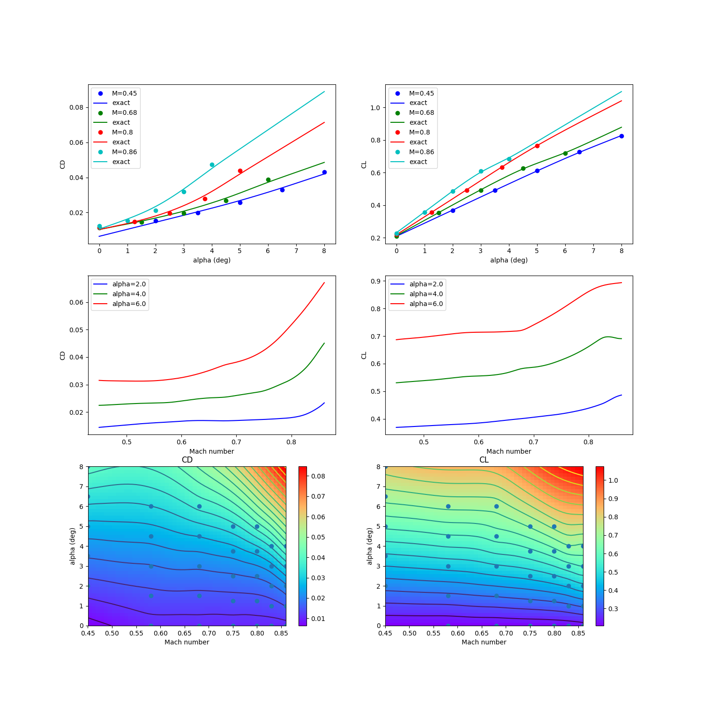

RANS CRM wing 2-D data set
==========================

.. code-block:: python

  import numpy as np
  
  
  raw = np.array([
      [2.000000000000000000e+00 ,  4.500000000000000111e-01 ,  1.536799999999999972e-02 ,  3.674239999999999728e-01 ,  5.592279999999999474e-01 , -1.258039999999999992e-01 , -1.248699999999999984e-02],
      [3.500000000000000000e+00 ,  4.500000000000000111e-01 ,  1.985100000000000059e-02 ,  4.904470000000000218e-01 ,  7.574600000000000222e-01 , -1.615260000000000029e-01 ,  8.987000000000000197e-03],
      [5.000000000000000000e+00 ,  4.500000000000000111e-01 ,  2.571000000000000021e-02 ,  6.109189999999999898e-01 ,  9.497949999999999449e-01 , -1.954619999999999969e-01 ,  4.090900000000000092e-02],
      [6.500000000000000000e+00 ,  4.500000000000000111e-01 ,  3.304200000000000192e-02 ,  7.266120000000000356e-01 ,  1.131138999999999895e+00 , -2.255890000000000117e-01 ,  8.185399999999999621e-02],
      [8.000000000000000000e+00 ,  4.500000000000000111e-01 ,  4.318999999999999923e-02 ,  8.247250000000000414e-01 ,  1.271487000000000034e+00 , -2.397040000000000004e-01 ,  1.217659999999999992e-01],
      [0.000000000000000000e+00 ,  5.799999999999999600e-01 ,  1.136200000000000057e-02 ,  2.048760000000000026e-01 ,  2.950280000000000125e-01 , -7.882100000000000217e-02 , -2.280099999999999835e-02],
      [1.500000000000000000e+00 ,  5.799999999999999600e-01 ,  1.426000000000000011e-02 ,  3.375619999999999732e-01 ,  5.114130000000000065e-01 , -1.189420000000000061e-01 , -1.588200000000000028e-02],
      [3.000000000000000000e+00 ,  5.799999999999999600e-01 ,  1.866400000000000003e-02 ,  4.687450000000000228e-01 ,  7.240400000000000169e-01 , -1.577669999999999906e-01 ,  3.099999999999999891e-03],
      [4.500000000000000000e+00 ,  5.799999999999999600e-01 ,  2.461999999999999952e-02 ,  5.976639999999999731e-01 ,  9.311709999999999710e-01 , -1.944160000000000055e-01 ,  3.357500000000000068e-02],
      [6.000000000000000000e+00 ,  5.799999999999999600e-01 ,  3.280700000000000283e-02 ,  7.142249999999999988e-01 ,  1.111707999999999918e+00 , -2.205870000000000053e-01 ,  7.151699999999999724e-02],
      [0.000000000000000000e+00 ,  6.800000000000000488e-01 ,  1.138800000000000055e-02 ,  2.099310000000000065e-01 ,  3.032230000000000203e-01 , -8.187899999999999345e-02 , -2.172699999999999979e-02],
      [1.500000000000000000e+00 ,  6.800000000000000488e-01 ,  1.458699999999999927e-02 ,  3.518569999999999753e-01 ,  5.356630000000000003e-01 , -1.257649999999999879e-01 , -1.444800000000000077e-02],
      [3.000000000000000000e+00 ,  6.800000000000000488e-01 ,  1.952800000000000022e-02 ,  4.924879999999999813e-01 ,  7.644769999999999621e-01 , -1.678040000000000087e-01 ,  6.023999999999999841e-03],
      [4.500000000000000000e+00 ,  6.800000000000000488e-01 ,  2.666699999999999973e-02 ,  6.270339999999999803e-01 ,  9.801630000000000065e-01 , -2.035240000000000105e-01 ,  3.810000000000000192e-02],
      [6.000000000000000000e+00 ,  6.800000000000000488e-01 ,  3.891800000000000120e-02 ,  7.172730000000000494e-01 ,  1.097855999999999943e+00 , -2.014620000000000022e-01 ,  6.640000000000000069e-02],
      [0.000000000000000000e+00 ,  7.500000000000000000e-01 ,  1.150699999999999987e-02 ,  2.149069999999999869e-01 ,  3.115740000000000176e-01 , -8.498999999999999611e-02 , -2.057700000000000154e-02],
      [1.250000000000000000e+00 ,  7.500000000000000000e-01 ,  1.432600000000000019e-02 ,  3.415969999999999840e-01 ,  5.199390000000000400e-01 , -1.251009999999999900e-01 , -1.515400000000000080e-02],
      [2.500000000000000000e+00 ,  7.500000000000000000e-01 ,  1.856000000000000011e-02 ,  4.677589999999999804e-01 ,  7.262499999999999512e-01 , -1.635169999999999957e-01 ,  3.989999999999999949e-04],
      [3.750000000000000000e+00 ,  7.500000000000000000e-01 ,  2.472399999999999945e-02 ,  5.911459999999999493e-01 ,  9.254930000000000101e-01 , -1.966150000000000120e-01 ,  2.524900000000000061e-02],
      [5.000000000000000000e+00 ,  7.500000000000000000e-01 ,  3.506800000000000195e-02 ,  7.047809999999999908e-01 ,  1.097736000000000045e+00 , -2.143069999999999975e-01 ,  5.321300000000000335e-02],
      [0.000000000000000000e+00 ,  8.000000000000000444e-01 ,  1.168499999999999921e-02 ,  2.196390000000000009e-01 ,  3.197160000000000002e-01 , -8.798200000000000465e-02 , -1.926999999999999894e-02],
      [1.250000000000000000e+00 ,  8.000000000000000444e-01 ,  1.481599999999999931e-02 ,  3.553939999999999877e-01 ,  5.435950000000000504e-01 , -1.317419999999999980e-01 , -1.345599999999999921e-02],
      [2.500000000000000000e+00 ,  8.000000000000000444e-01 ,  1.968999999999999917e-02 ,  4.918299999999999894e-01 ,  7.669930000000000359e-01 , -1.728079999999999894e-01 ,  3.756999999999999923e-03],
      [3.750000000000000000e+00 ,  8.000000000000000444e-01 ,  2.785599999999999882e-02 ,  6.324319999999999942e-01 ,  9.919249999999999456e-01 , -2.077100000000000057e-01 ,  3.159800000000000109e-02],
      [5.000000000000000000e+00 ,  8.000000000000000444e-01 ,  4.394300000000000289e-02 ,  7.650689999999999991e-01 ,  1.188355999999999968e+00 , -2.332680000000000031e-01 ,  5.645000000000000018e-02],
      [0.000000000000000000e+00 ,  8.299999999999999600e-01 ,  1.186100000000000002e-02 ,  2.232899999999999885e-01 ,  3.261100000000000110e-01 , -9.028400000000000314e-02 , -1.806500000000000120e-02],
      [1.000000000000000000e+00 ,  8.299999999999999600e-01 ,  1.444900000000000004e-02 ,  3.383419999999999761e-01 ,  5.161710000000000464e-01 , -1.279530000000000112e-01 , -1.402400000000000001e-02],
      [2.000000000000000000e+00 ,  8.299999999999999600e-01 ,  1.836799999999999891e-02 ,  4.554270000000000262e-01 ,  7.082190000000000429e-01 , -1.642339999999999911e-01 , -1.793000000000000106e-03],
      [3.000000000000000000e+00 ,  8.299999999999999600e-01 ,  2.466899999999999996e-02 ,  5.798410000000000508e-01 ,  9.088819999999999677e-01 , -2.004589999999999983e-01 ,  1.892900000000000138e-02],
      [4.000000000000000000e+00 ,  8.299999999999999600e-01 ,  3.700400000000000217e-02 ,  7.012720000000000065e-01 ,  1.097366000000000064e+00 , -2.362420000000000075e-01 ,  3.750699999999999867e-02],
      [0.000000000000000000e+00 ,  8.599999999999999867e-01 ,  1.224300000000000041e-02 ,  2.278100000000000125e-01 ,  3.342720000000000136e-01 , -9.307600000000000595e-02 , -1.608400000000000107e-02],
      [1.000000000000000000e+00 ,  8.599999999999999867e-01 ,  1.540700000000000056e-02 ,  3.551839999999999997e-01 ,  5.433130000000000459e-01 , -1.364730000000000110e-01 , -1.162200000000000039e-02],
      [2.000000000000000000e+00 ,  8.599999999999999867e-01 ,  2.122699999999999934e-02 ,  4.854620000000000046e-01 ,  7.552919999999999634e-01 , -1.817850000000000021e-01 ,  1.070999999999999903e-03],
      [3.000000000000000000e+00 ,  8.599999999999999867e-01 ,  3.178899999999999781e-02 ,  6.081849999999999756e-01 ,  9.510380000000000500e-01 , -2.252020000000000133e-01 ,  1.540799999999999982e-02],
      [4.000000000000000000e+00 ,  8.599999999999999867e-01 ,  4.744199999999999806e-02 ,  6.846989999999999466e-01 ,  1.042564000000000046e+00 , -2.333600000000000119e-01 ,  2.035400000000000056e-02],
  ])
  
  
  def get_rans_crm_wing():
      # data structure:
      # alpha, mach, cd, cl, cmx, cmy, cmz
  
      deg2rad = np.pi / 180.
  
      xt = np.array(raw[:, 0:2])
      yt = np.array(raw[:, 2:4])
      xlimits = np.array([
          [-3., 10.],
          [0.4, 0.90],
      ])
  
      xt[:, 0] *= deg2rad
      xlimits[0, :] *= deg2rad
  
      return xt, yt, xlimits
  
  
  def plot_rans_crm_wing(xt, yt, limits, interp):
      import numpy as np
      import matplotlib
      matplotlib.use('Agg')
      import matplotlib.pyplot as plt
  
      rad2deg = 180. / np.pi
  
      num = 500
      num_a = 50
      num_M = 50
  
      x = np.zeros((num, 2))
      colors = ['b', 'g', 'r', 'c', 'm', 'k', 'y']
  
      nrow = 3
      ncol = 2
  
      plt.close()
      plt.figure(figsize=(15, 15))
  
      # -----------------------------------------------------------------------------
  
      mach_numbers = [0.45, 0.68, 0.80, 0.86]
      legend_entries = []
  
      alpha_sweep = np.linspace(0., 8., num)
  
      for ind, mach in enumerate(mach_numbers):
          x[:, 0] = alpha_sweep / rad2deg
          x[:, 1] = mach
          CD = interp.predict_values(x)[:, 0]
          CL = interp.predict_values(x)[:, 1]
  
          plt.subplot(nrow, ncol, 1)
  
          mask = np.abs(xt[:, 1] - mach) < 1e-10
          plt.plot(xt[mask, 0] * rad2deg, yt[mask, 0], 'o' + colors[ind])
          plt.plot(alpha_sweep, CD, colors[ind])
  
          plt.subplot(nrow, ncol, 2)
  
          mask = np.abs(xt[:, 1] - mach) < 1e-10
          plt.plot(xt[mask, 0] * rad2deg, yt[mask, 1], 'o' + colors[ind])
          plt.plot(alpha_sweep, CL, colors[ind])
  
          legend_entries.append('M={}'.format(mach))
          legend_entries.append('exact')
  
      plt.subplot(nrow, ncol, 1)
      plt.xlabel('alpha (deg)')
      plt.ylabel('CD')
      plt.legend(legend_entries)
  
      plt.subplot(nrow, ncol, 2)
      plt.xlabel('alpha (deg)')
      plt.ylabel('CL')
      plt.legend(legend_entries)
  
      # -----------------------------------------------------------------------------
  
      alphas = [2., 4., 6.]
      legend_entries = []
  
      mach_sweep = np.linspace(0.45, 0.86, num)
  
      for ind, alpha in enumerate(alphas):
          x[:, 0] = alpha / rad2deg
          x[:, 1] = mach_sweep
          CD = interp.predict_values(x)[:, 0]
          CL = interp.predict_values(x)[:, 1]
  
          plt.subplot(nrow, ncol, 3)
          plt.plot(mach_sweep, CD, colors[ind])
  
          plt.subplot(nrow, ncol, 4)
          plt.plot(mach_sweep, CL, colors[ind])
  
          legend_entries.append('alpha={}'.format(alpha))
  
      plt.subplot(nrow, ncol, 3)
      plt.xlabel('Mach number')
      plt.ylabel('CD')
      plt.legend(legend_entries)
  
      plt.subplot(nrow, ncol, 4)
      plt.xlabel('Mach number')
      plt.ylabel('CL')
      plt.legend(legend_entries)
  
      # -----------------------------------------------------------------------------
  
      x = np.zeros((num_a, num_M, 2))
      x[:, :, 0] = np.outer(np.linspace(0., 8., num_a), np.ones(num_M)) / rad2deg
      x[:, :, 1] = np.outer(np.ones(num_a), np.linspace(0.45, 0.86, num_M))
      CD = interp.predict_values(x.reshape((num_a * num_M, 2)))[:, 0].reshape((num_a, num_M))
      CL = interp.predict_values(x.reshape((num_a * num_M, 2)))[:, 1].reshape((num_a, num_M))
  
      plt.subplot(nrow, ncol, 5)
      plt.plot(xt[:, 1], xt[:, 0] * rad2deg, 'o')
      plt.contour(x[:, :, 1], x[:, :, 0] * rad2deg, CD, 20)
      plt.pcolormesh(x[:, :, 1], x[:, :, 0] * rad2deg, CD, cmap = plt.get_cmap('rainbow'))
      plt.xlabel('Mach number')
      plt.ylabel('alpha (deg)')
      plt.title('CD')
      plt.colorbar()
  
      plt.subplot(nrow, ncol, 6)
      plt.plot(xt[:, 1], xt[:, 0] * rad2deg, 'o')
      plt.contour(x[:, :, 1], x[:, :, 0] * rad2deg, CL, 20)
      plt.pcolormesh(x[:, :, 1], x[:, :, 0] * rad2deg, CL, cmap = plt.get_cmap('rainbow'))
      plt.xlabel('Mach number')
      plt.ylabel('alpha (deg)')
      plt.title('CL')
      plt.colorbar()
  
      plt.show()
  

RMTB
----

.. code-block:: python

  from smt.methods import RMTB
  from smt.examples.rans_crm_wing import get_rans_crm_wing, plot_rans_crm_wing
  
  xt, yt, xlimits = get_rans_crm_wing()
  
  interp = RMTB(num_ctrl_pts=20, xlimits=xlimits, nln_max_iter=20, reg_cons=1e-12)
  interp.set_training_values(xt, yt)
  interp.train()
  
  plot_rans_crm_wing(xt, yt, xlimits, interp)
  
::

  ___________________________________________________________________________
     
                                     RMTB
  ___________________________________________________________________________
     
   Problem size
     
        # training points.        : 35
     
  ___________________________________________________________________________
     
   Training
     
     Training ...
        Pre-computing matrices ...
           Computing dof2coeff ...
           Computing dof2coeff - done. Time (sec):  0.0000031
           Initializing Hessian ...
           Initializing Hessian - done. Time (sec):  0.0003667
           Computing energy terms ...
           Computing energy terms - done. Time (sec):  0.0068448
           Computing approximation terms ...
           Computing approximation terms - done. Time (sec):  0.0005300
        Pre-computing matrices - done. Time (sec):  0.0080361
        Solving for degrees of freedom ...
           Solving initial linear problem (n=400) ...
              Assembling linear system ...
              Assembling linear system - done. Time (sec):  0.0013969
              Initializing linear solver ...
              Initializing linear solver - done. Time (sec):  0.0000463
              Solving linear system (col. 0) ...
                 Running cg Krylov solver (400 x 400 mtx) ...
                 Running cg Krylov solver (400 x 400 mtx) - done. Time (sec):  0.0119438
              Solving linear system (col. 0) - done. Time (sec):  0.0119870
              Solving linear system (col. 1) ...
                 Running cg Krylov solver (400 x 400 mtx) ...
                 Running cg Krylov solver (400 x 400 mtx) - done. Time (sec):  0.0092411
              Solving linear system (col. 1) - done. Time (sec):  0.0092919
           Solving initial linear problem (n=400) - done. Time (sec):  0.0228488
           Solving nonlinear problem (col. 0) ...
              Nonlinear (itn, iy, grad. norm, func.) :   0   0 6.652714318e-09 1.793031698e-10
                 Assembling linear system ...
                 Assembling linear system - done. Time (sec):  0.0017221
                 Initializing linear solver ...
                 Initializing linear solver - done. Time (sec):  0.0000429
                 Solving linear system ...
                 Solving linear system - done. Time (sec):  0.0146120
                 Performing line search ...
                 Performing line search - done. Time (sec):  0.0005651
              Nonlinear (itn, iy, grad. norm, func.) :   1   0 5.849744260e-09 1.703964031e-10
                 Assembling linear system ...
                 Assembling linear system - done. Time (sec):  0.0018241
                 Initializing linear solver ...
                 Initializing linear solver - done. Time (sec):  0.0000503
                 Solving linear system ...
                 Solving linear system - done. Time (sec):  0.0139291
                 Performing line search ...
                 Performing line search - done. Time (sec):  0.0002291
              Nonlinear (itn, iy, grad. norm, func.) :   2   0 3.047732090e-08 1.038714754e-10
                 Assembling linear system ...
                 Assembling linear system - done. Time (sec):  0.0008976
                 Initializing linear solver ...
                 Initializing linear solver - done. Time (sec):  0.0000262
                 Solving linear system ...
                 Solving linear system - done. Time (sec):  0.0089459
                 Performing line search ...
                 Performing line search - done. Time (sec):  0.0000608
              Nonlinear (itn, iy, grad. norm, func.) :   3   0 1.130229687e-08 2.514659248e-11
                 Assembling linear system ...
                 Assembling linear system - done. Time (sec):  0.0008869
                 Initializing linear solver ...
                 Initializing linear solver - done. Time (sec):  0.0000231
                 Solving linear system ...
                 Solving linear system - done. Time (sec):  0.0096409
                 Performing line search ...
                 Performing line search - done. Time (sec):  0.0001009
              Nonlinear (itn, iy, grad. norm, func.) :   4   0 3.723741742e-09 1.070479089e-11
                 Assembling linear system ...
                 Assembling linear system - done. Time (sec):  0.0015180
                 Initializing linear solver ...
                 Initializing linear solver - done. Time (sec):  0.0000391
                 Solving linear system ...
                 Solving linear system - done. Time (sec):  0.0100338
                 Performing line search ...
                 Performing line search - done. Time (sec):  0.0000622
              Nonlinear (itn, iy, grad. norm, func.) :   5   0 1.942857626e-09 8.964958702e-12
                 Assembling linear system ...
                 Assembling linear system - done. Time (sec):  0.0011771
                 Initializing linear solver ...
                 Initializing linear solver - done. Time (sec):  0.0000298
                 Solving linear system ...
                 Solving linear system - done. Time (sec):  0.0115252
                 Performing line search ...
                 Performing line search - done. Time (sec):  0.0000620
              Nonlinear (itn, iy, grad. norm, func.) :   6   0 5.437707571e-10 7.308335972e-12
                 Assembling linear system ...
                 Assembling linear system - done. Time (sec):  0.0009780
                 Initializing linear solver ...
                 Initializing linear solver - done. Time (sec):  0.0000269
                 Solving linear system ...
                 Solving linear system - done. Time (sec):  0.0126951
                 Performing line search ...
                 Performing line search - done. Time (sec):  0.0002851
              Nonlinear (itn, iy, grad. norm, func.) :   7   0 1.524559420e-10 6.508865761e-12
                 Assembling linear system ...
                 Assembling linear system - done. Time (sec):  0.0009611
                 Initializing linear solver ...
                 Initializing linear solver - done. Time (sec):  0.0000279
                 Solving linear system ...
                 Solving linear system - done. Time (sec):  0.0075200
                 Performing line search ...
                 Performing line search - done. Time (sec):  0.0000999
              Nonlinear (itn, iy, grad. norm, func.) :   8   0 2.789303117e-11 6.256281964e-12
                 Assembling linear system ...
                 Assembling linear system - done. Time (sec):  0.0015850
                 Initializing linear solver ...
                 Initializing linear solver - done. Time (sec):  0.0000441
                 Solving linear system ...
                 Solving linear system - done. Time (sec):  0.0125270
                 Performing line search ...
                 Performing line search - done. Time (sec):  0.0002451
              Nonlinear (itn, iy, grad. norm, func.) :   9   0 2.220829742e-11 6.254054522e-12
                 Assembling linear system ...
                 Assembling linear system - done. Time (sec):  0.0015509
                 Initializing linear solver ...
                 Initializing linear solver - done. Time (sec):  0.0000341
                 Solving linear system ...
                 Solving linear system - done. Time (sec):  0.0072749
                 Performing line search ...
                 Performing line search - done. Time (sec):  0.0001030
              Nonlinear (itn, iy, grad. norm, func.) :  10   0 1.157438871e-11 6.253496103e-12
                 Assembling linear system ...
                 Assembling linear system - done. Time (sec):  0.0008850
                 Initializing linear solver ...
                 Initializing linear solver - done. Time (sec):  0.0000293
                 Solving linear system ...
                 Solving linear system - done. Time (sec):  0.0083389
                 Performing line search ...
                 Performing line search - done. Time (sec):  0.0002010
              Nonlinear (itn, iy, grad. norm, func.) :  11   0 1.030303187e-11 6.253465680e-12
                 Assembling linear system ...
                 Assembling linear system - done. Time (sec):  0.0009561
                 Initializing linear solver ...
                 Initializing linear solver - done. Time (sec):  0.0000257
                 Solving linear system ...
                 Solving linear system - done. Time (sec):  0.0082440
                 Performing line search ...
                 Performing line search - done. Time (sec):  0.0000629
              Nonlinear (itn, iy, grad. norm, func.) :  12   0 6.013521373e-12 6.252325107e-12
                 Assembling linear system ...
                 Assembling linear system - done. Time (sec):  0.0009339
                 Initializing linear solver ...
                 Initializing linear solver - done. Time (sec):  0.0000291
                 Solving linear system ...
                 Solving linear system - done. Time (sec):  0.0103650
                 Performing line search ...
                 Performing line search - done. Time (sec):  0.0001023
              Nonlinear (itn, iy, grad. norm, func.) :  13   0 8.593161080e-13 6.251733557e-12
                 Assembling linear system ...
                 Assembling linear system - done. Time (sec):  0.0016160
                 Initializing linear solver ...
                 Initializing linear solver - done. Time (sec):  0.0000403
                 Solving linear system ...
                 Solving linear system - done. Time (sec):  0.0075400
                 Performing line search ...
                 Performing line search - done. Time (sec):  0.0000651
              Nonlinear (itn, iy, grad. norm, func.) :  14   0 1.299095103e-12 6.251714128e-12
                 Assembling linear system ...
                 Assembling linear system - done. Time (sec):  0.0009761
                 Initializing linear solver ...
                 Initializing linear solver - done. Time (sec):  0.0000257
                 Solving linear system ...
                 Solving linear system - done. Time (sec):  0.0132201
                 Performing line search ...
                 Performing line search - done. Time (sec):  0.0002060
              Nonlinear (itn, iy, grad. norm, func.) :  15   0 1.470266958e-12 6.251694032e-12
                 Assembling linear system ...
                 Assembling linear system - done. Time (sec):  0.0022430
                 Initializing linear solver ...
                 Initializing linear solver - done. Time (sec):  0.0000300
                 Solving linear system ...
                 Solving linear system - done. Time (sec):  0.0087810
                 Performing line search ...
                 Performing line search - done. Time (sec):  0.0000620
              Nonlinear (itn, iy, grad. norm, func.) :  16   0 3.253417341e-13 6.251652195e-12
                 Assembling linear system ...
                 Assembling linear system - done. Time (sec):  0.0020893
                 Initializing linear solver ...
                 Initializing linear solver - done. Time (sec):  0.0000322
                 Solving linear system ...
                 Solving linear system - done. Time (sec):  0.0096979
                 Performing line search ...
                 Performing line search - done. Time (sec):  0.0001791
              Nonlinear (itn, iy, grad. norm, func.) :  17   0 6.423152511e-13 6.251651596e-12
                 Assembling linear system ...
                 Assembling linear system - done. Time (sec):  0.0023351
                 Initializing linear solver ...
                 Initializing linear solver - done. Time (sec):  0.0000339
                 Solving linear system ...
                 Solving linear system - done. Time (sec):  0.0079432
                 Performing line search ...
                 Performing line search - done. Time (sec):  0.0000629
              Nonlinear (itn, iy, grad. norm, func.) :  18   0 2.850770327e-13 6.251645805e-12
                 Assembling linear system ...
                 Assembling linear system - done. Time (sec):  0.0009418
                 Initializing linear solver ...
                 Initializing linear solver - done. Time (sec):  0.0000291
                 Solving linear system ...
                 Solving linear system - done. Time (sec):  0.0113311
                 Performing line search ...
                 Performing line search - done. Time (sec):  0.0000629
              Nonlinear (itn, iy, grad. norm, func.) :  19   0 2.356256926e-13 6.251643446e-12
                 Assembling linear system ...
                 Assembling linear system - done. Time (sec):  0.0009630
                 Initializing linear solver ...
                 Initializing linear solver - done. Time (sec):  0.0000279
                 Solving linear system ...
                 Solving linear system - done. Time (sec):  0.0146780
                 Performing line search ...
                 Performing line search - done. Time (sec):  0.0000620
              Nonlinear (itn, iy, grad. norm, func.) :  20   0 1.211120745e-13 6.251642416e-12
           Solving nonlinear problem (col. 0) - done. Time (sec):  0.2570000
           Solving nonlinear problem (col. 1) ...
              Nonlinear (itn, iy, grad. norm, func.) :   0   1 9.729396918e-08 4.567617829e-08
                 Assembling linear system ...
                 Assembling linear system - done. Time (sec):  0.0032070
                 Initializing linear solver ...
                 Initializing linear solver - done. Time (sec):  0.0003560
                 Solving linear system ...
                 Solving linear system - done. Time (sec):  0.0103970
                 Performing line search ...
                 Performing line search - done. Time (sec):  0.0003920
              Nonlinear (itn, iy, grad. norm, func.) :   1   1 9.338200615e-08 4.538190094e-08
                 Assembling linear system ...
                 Assembling linear system - done. Time (sec):  0.0008969
                 Initializing linear solver ...
                 Initializing linear solver - done. Time (sec):  0.0001891
                 Solving linear system ...
                 Solving linear system - done. Time (sec):  0.0099583
                 Performing line search ...
                 Performing line search - done. Time (sec):  0.0001049
              Nonlinear (itn, iy, grad. norm, func.) :   2   1 2.724979159e-06 3.099607827e-08
                 Assembling linear system ...
                 Assembling linear system - done. Time (sec):  0.0009050
                 Initializing linear solver ...
                 Initializing linear solver - done. Time (sec):  0.0000331
                 Solving linear system ...
                 Solving linear system - done. Time (sec):  0.0094860
                 Performing line search ...
                 Performing line search - done. Time (sec):  0.0000730
              Nonlinear (itn, iy, grad. norm, func.) :   3   1 8.174867134e-07 4.618621696e-09
                 Assembling linear system ...
                 Assembling linear system - done. Time (sec):  0.0014362
                 Initializing linear solver ...
                 Initializing linear solver - done. Time (sec):  0.0000350
                 Solving linear system ...
                 Solving linear system - done. Time (sec):  0.0086999
                 Performing line search ...
                 Performing line search - done. Time (sec):  0.0001042
              Nonlinear (itn, iy, grad. norm, func.) :   4   1 2.487362007e-07 2.167095171e-09
                 Assembling linear system ...
                 Assembling linear system - done. Time (sec):  0.0009391
                 Initializing linear solver ...
                 Initializing linear solver - done. Time (sec):  0.0000298
                 Solving linear system ...
                 Solving linear system - done. Time (sec):  0.0089352
                 Performing line search ...
                 Performing line search - done. Time (sec):  0.0002067
              Nonlinear (itn, iy, grad. norm, func.) :   5   1 2.246609101e-07 1.906459273e-09
                 Assembling linear system ...
                 Assembling linear system - done. Time (sec):  0.0014012
                 Initializing linear solver ...
                 Initializing linear solver - done. Time (sec):  0.0000329
                 Solving linear system ...
                 Solving linear system - done. Time (sec):  0.0104060
                 Performing line search ...
                 Performing line search - done. Time (sec):  0.0000670
              Nonlinear (itn, iy, grad. norm, func.) :   6   1 6.648101143e-08 5.416337102e-10
                 Assembling linear system ...
                 Assembling linear system - done. Time (sec):  0.0009153
                 Initializing linear solver ...
                 Initializing linear solver - done. Time (sec):  0.0000298
                 Solving linear system ...
                 Solving linear system - done. Time (sec):  0.0076118
                 Performing line search ...
                 Performing line search - done. Time (sec):  0.0000782
              Nonlinear (itn, iy, grad. norm, func.) :   7   1 1.956548092e-08 4.650651585e-10
                 Assembling linear system ...
                 Assembling linear system - done. Time (sec):  0.0009389
                 Initializing linear solver ...
                 Initializing linear solver - done. Time (sec):  0.0000250
                 Solving linear system ...
                 Solving linear system - done. Time (sec):  0.0083492
                 Performing line search ...
                 Performing line search - done. Time (sec):  0.0000701
              Nonlinear (itn, iy, grad. norm, func.) :   8   1 7.999369538e-09 4.252746654e-10
                 Assembling linear system ...
                 Assembling linear system - done. Time (sec):  0.0080838
                 Initializing linear solver ...
                 Initializing linear solver - done. Time (sec):  0.0003691
                 Solving linear system ...
                 Solving linear system - done. Time (sec):  0.0425637
                 Performing line search ...
                 Performing line search - done. Time (sec):  0.0001309
              Nonlinear (itn, iy, grad. norm, func.) :   9   1 9.883421318e-09 3.243236780e-10
                 Assembling linear system ...
                 Assembling linear system - done. Time (sec):  0.0014670
                 Initializing linear solver ...
                 Initializing linear solver - done. Time (sec):  0.0000319
                 Solving linear system ...
                 Solving linear system - done. Time (sec):  0.0100670
                 Performing line search ...
                 Performing line search - done. Time (sec):  0.0000629
              Nonlinear (itn, iy, grad. norm, func.) :  10   1 3.208827938e-09 2.753896870e-10
                 Assembling linear system ...
                 Assembling linear system - done. Time (sec):  0.0010240
                 Initializing linear solver ...
                 Initializing linear solver - done. Time (sec):  0.0000291
                 Solving linear system ...
                 Solving linear system - done. Time (sec):  0.0077341
                 Performing line search ...
                 Performing line search - done. Time (sec):  0.0001049
              Nonlinear (itn, iy, grad. norm, func.) :  11   1 1.850721183e-09 2.727130157e-10
                 Assembling linear system ...
                 Assembling linear system - done. Time (sec):  0.0009029
                 Initializing linear solver ...
                 Initializing linear solver - done. Time (sec):  0.0000260
                 Solving linear system ...
                 Solving linear system - done. Time (sec):  0.0071299
                 Performing line search ...
                 Performing line search - done. Time (sec):  0.0001049
              Nonlinear (itn, iy, grad. norm, func.) :  12   1 1.108740289e-09 2.726981575e-10
                 Assembling linear system ...
                 Assembling linear system - done. Time (sec):  0.0010872
                 Initializing linear solver ...
                 Initializing linear solver - done. Time (sec):  0.0000279
                 Solving linear system ...
                 Solving linear system - done. Time (sec):  0.0072522
                 Performing line search ...
                 Performing line search - done. Time (sec):  0.0001032
              Nonlinear (itn, iy, grad. norm, func.) :  13   1 6.735723509e-10 2.722607531e-10
                 Assembling linear system ...
                 Assembling linear system - done. Time (sec):  0.0008876
                 Initializing linear solver ...
                 Initializing linear solver - done. Time (sec):  0.0000210
                 Solving linear system ...
                 Solving linear system - done. Time (sec):  0.0070422
                 Performing line search ...
                 Performing line search - done. Time (sec):  0.0000582
              Nonlinear (itn, iy, grad. norm, func.) :  14   1 2.160727809e-10 2.713311080e-10
                 Assembling linear system ...
                 Assembling linear system - done. Time (sec):  0.0008340
                 Initializing linear solver ...
                 Initializing linear solver - done. Time (sec):  0.0000169
                 Solving linear system ...
                 Solving linear system - done. Time (sec):  0.0232780
                 Performing line search ...
                 Performing line search - done. Time (sec):  0.0000677
              Nonlinear (itn, iy, grad. norm, func.) :  15   1 6.032289536e-11 2.706281079e-10
                 Assembling linear system ...
                 Assembling linear system - done. Time (sec):  0.0009563
                 Initializing linear solver ...
                 Initializing linear solver - done. Time (sec):  0.0000238
                 Solving linear system ...
                 Solving linear system - done. Time (sec):  0.0075357
                 Performing line search ...
                 Performing line search - done. Time (sec):  0.0000582
              Nonlinear (itn, iy, grad. norm, func.) :  16   1 4.953194445e-11 2.706255976e-10
                 Assembling linear system ...
                 Assembling linear system - done. Time (sec):  0.0008373
                 Initializing linear solver ...
                 Initializing linear solver - done. Time (sec):  0.0000179
                 Solving linear system ...
                 Solving linear system - done. Time (sec):  0.0071821
                 Performing line search ...
                 Performing line search - done. Time (sec):  0.0001049
              Nonlinear (itn, iy, grad. norm, func.) :  17   1 4.161091428e-11 2.706078876e-10
                 Assembling linear system ...
                 Assembling linear system - done. Time (sec):  0.0008481
                 Initializing linear solver ...
                 Initializing linear solver - done. Time (sec):  0.0000210
                 Solving linear system ...
                 Solving linear system - done. Time (sec):  0.0079169
                 Performing line search ...
                 Performing line search - done. Time (sec):  0.0000629
              Nonlinear (itn, iy, grad. norm, func.) :  18   1 3.727332937e-11 2.705664849e-10
                 Assembling linear system ...
                 Assembling linear system - done. Time (sec):  0.0009320
                 Initializing linear solver ...
                 Initializing linear solver - done. Time (sec):  0.0000191
                 Solving linear system ...
                 Solving linear system - done. Time (sec):  0.0072021
                 Performing line search ...
                 Performing line search - done. Time (sec):  0.0000567
              Nonlinear (itn, iy, grad. norm, func.) :  19   1 2.805244858e-11 2.705349248e-10
                 Assembling linear system ...
                 Assembling linear system - done. Time (sec):  0.0008290
                 Initializing linear solver ...
                 Initializing linear solver - done. Time (sec):  0.0000157
                 Solving linear system ...
                 Solving linear system - done. Time (sec):  0.0069590
                 Performing line search ...
                 Performing line search - done. Time (sec):  0.0000572
              Nonlinear (itn, iy, grad. norm, func.) :  20   1 6.927750219e-12 2.705258906e-10
           Solving nonlinear problem (col. 1) - done. Time (sec):  0.2624898
        Solving for degrees of freedom - done. Time (sec):  0.5424840
     Training - done. Time (sec):  0.5508947
  ___________________________________________________________________________
     
   Evaluation
     
        # eval points. : 500
     
     Predicting ...
     Predicting - done. Time (sec):  0.0007348
     
     Prediction time/pt. (sec) :  0.0000015
     
  ___________________________________________________________________________
     
   Evaluation
     
        # eval points. : 500
     
     Predicting ...
     Predicting - done. Time (sec):  0.0006421
     
     Prediction time/pt. (sec) :  0.0000013
     
  ___________________________________________________________________________
     
   Evaluation
     
        # eval points. : 500
     
     Predicting ...
     Predicting - done. Time (sec):  0.0007288
     
     Prediction time/pt. (sec) :  0.0000015
     
  ___________________________________________________________________________
     
   Evaluation
     
        # eval points. : 500
     
     Predicting ...
     Predicting - done. Time (sec):  0.0006461
     
     Prediction time/pt. (sec) :  0.0000013
     
  ___________________________________________________________________________
     
   Evaluation
     
        # eval points. : 500
     
     Predicting ...
     Predicting - done. Time (sec):  0.0006919
     
     Prediction time/pt. (sec) :  0.0000014
     
  ___________________________________________________________________________
     
   Evaluation
     
        # eval points. : 500
     
     Predicting ...
     Predicting - done. Time (sec):  0.0006440
     
     Prediction time/pt. (sec) :  0.0000013
     
  ___________________________________________________________________________
     
   Evaluation
     
        # eval points. : 500
     
     Predicting ...
     Predicting - done. Time (sec):  0.0010419
     
     Prediction time/pt. (sec) :  0.0000021
     
  ___________________________________________________________________________
     
   Evaluation
     
        # eval points. : 500
     
     Predicting ...
     Predicting - done. Time (sec):  0.0008140
     
     Prediction time/pt. (sec) :  0.0000016
     
  ___________________________________________________________________________
     
   Evaluation
     
        # eval points. : 500
     
     Predicting ...
     Predicting - done. Time (sec):  0.0007899
     
     Prediction time/pt. (sec) :  0.0000016
     
  ___________________________________________________________________________
     
   Evaluation
     
        # eval points. : 500
     
     Predicting ...
     Predicting - done. Time (sec):  0.0006547
     
     Prediction time/pt. (sec) :  0.0000013
     
  ___________________________________________________________________________
     
   Evaluation
     
        # eval points. : 500
     
     Predicting ...
     Predicting - done. Time (sec):  0.0008810
     
     Prediction time/pt. (sec) :  0.0000018
     
  ___________________________________________________________________________
     
   Evaluation
     
        # eval points. : 500
     
     Predicting ...
     Predicting - done. Time (sec):  0.0006840
     
     Prediction time/pt. (sec) :  0.0000014
     
  ___________________________________________________________________________
     
   Evaluation
     
        # eval points. : 500
     
     Predicting ...
     Predicting - done. Time (sec):  0.0007150
     
     Prediction time/pt. (sec) :  0.0000014
     
  ___________________________________________________________________________
     
   Evaluation
     
        # eval points. : 500
     
     Predicting ...
     Predicting - done. Time (sec):  0.0006449
     
     Prediction time/pt. (sec) :  0.0000013
     
  ___________________________________________________________________________
     
   Evaluation
     
        # eval points. : 2500
     
     Predicting ...
     Predicting - done. Time (sec):  0.0025690
     
     Prediction time/pt. (sec) :  0.0000010
     
  ___________________________________________________________________________
     
   Evaluation
     
        # eval points. : 2500
     
     Predicting ...
     Predicting - done. Time (sec):  0.0023432
     
     Prediction time/pt. (sec) :  0.0000009
     
  

RMTC
----

.. code-block:: python

  from smt.methods import RMTC
  from smt.examples.rans_crm_wing import get_rans_crm_wing, plot_rans_crm_wing
  
  xt, yt, xlimits = get_rans_crm_wing()
  
  interp = RMTC(num_elements=20, xlimits=xlimits, nln_max_iter=20, reg_cons=1e-10)
  interp.set_training_values(xt, yt)
  interp.train()
  
  plot_rans_crm_wing(xt, yt, xlimits, interp)
  
::

  ___________________________________________________________________________
     
                                     RMTC
  ___________________________________________________________________________
     
   Problem size
     
        # training points.        : 35
     
  ___________________________________________________________________________
     
   Training
     
     Training ...
        Pre-computing matrices ...
           Computing dof2coeff ...
           Computing dof2coeff - done. Time (sec):  0.0138659
           Initializing Hessian ...
           Initializing Hessian - done. Time (sec):  0.0007782
           Computing energy terms ...
           Computing energy terms - done. Time (sec):  0.0208099
           Computing approximation terms ...
           Computing approximation terms - done. Time (sec):  0.0014789
        Pre-computing matrices - done. Time (sec):  0.0371699
        Solving for degrees of freedom ...
           Solving initial linear problem (n=1764) ...
              Assembling linear system ...
              Assembling linear system - done. Time (sec):  0.0019929
              Initializing linear solver ...
              Initializing linear solver - done. Time (sec):  0.0000439
              Solving linear system (col. 0) ...
                 Running cg Krylov solver (1764 x 1764 mtx) ...
                 Running cg Krylov solver (1764 x 1764 mtx) - done. Time (sec):  0.0297081
              Solving linear system (col. 0) - done. Time (sec):  0.0297580
              Solving linear system (col. 1) ...
                 Running cg Krylov solver (1764 x 1764 mtx) ...
                 Running cg Krylov solver (1764 x 1764 mtx) - done. Time (sec):  0.0318601
              Solving linear system (col. 1) - done. Time (sec):  0.0319211
           Solving initial linear problem (n=1764) - done. Time (sec):  0.0638058
           Solving nonlinear problem (col. 0) ...
              Nonlinear (itn, iy, grad. norm, func.) :   0   0 8.107492912e-07 2.168546311e-08
                 Assembling linear system ...
                 Assembling linear system - done. Time (sec):  0.0027328
                 Initializing linear solver ...
                 Initializing linear solver - done. Time (sec):  0.0000432
                 Solving linear system ...
                 Solving linear system - done. Time (sec):  0.0469389
                 Performing line search ...
                 Performing line search - done. Time (sec):  0.0006180
              Nonlinear (itn, iy, grad. norm, func.) :   1   0 9.164230015e-07 1.724829664e-08
                 Assembling linear system ...
                 Assembling linear system - done. Time (sec):  0.0013556
                 Initializing linear solver ...
                 Initializing linear solver - done. Time (sec):  0.0000398
                 Solving linear system ...
                 Solving linear system - done. Time (sec):  0.0188301
                 Performing line search ...
                 Performing line search - done. Time (sec):  0.0001171
              Nonlinear (itn, iy, grad. norm, func.) :   2   0 3.514616804e-07 3.253757506e-09
                 Assembling linear system ...
                 Assembling linear system - done. Time (sec):  0.0014157
                 Initializing linear solver ...
                 Initializing linear solver - done. Time (sec):  0.0000379
                 Solving linear system ...
                 Solving linear system - done. Time (sec):  0.0173919
                 Performing line search ...
                 Performing line search - done. Time (sec):  0.0001259
              Nonlinear (itn, iy, grad. norm, func.) :   3   0 1.168798886e-07 1.046910272e-09
                 Assembling linear system ...
                 Assembling linear system - done. Time (sec):  0.0011899
                 Initializing linear solver ...
                 Initializing linear solver - done. Time (sec):  0.0000331
                 Solving linear system ...
                 Solving linear system - done. Time (sec):  0.0164711
                 Performing line search ...
                 Performing line search - done. Time (sec):  0.0001180
              Nonlinear (itn, iy, grad. norm, func.) :   4   0 6.336601168e-08 5.331710247e-10
                 Assembling linear system ...
                 Assembling linear system - done. Time (sec):  0.0011740
                 Initializing linear solver ...
                 Initializing linear solver - done. Time (sec):  0.0000377
                 Solving linear system ...
                 Solving linear system - done. Time (sec):  0.0169189
                 Performing line search ...
                 Performing line search - done. Time (sec):  0.0001142
              Nonlinear (itn, iy, grad. norm, func.) :   5   0 3.413961645e-08 4.110035982e-10
                 Assembling linear system ...
                 Assembling linear system - done. Time (sec):  0.0011799
                 Initializing linear solver ...
                 Initializing linear solver - done. Time (sec):  0.0000350
                 Solving linear system ...
                 Solving linear system - done. Time (sec):  0.0166252
                 Performing line search ...
                 Performing line search - done. Time (sec):  0.0002089
              Nonlinear (itn, iy, grad. norm, func.) :   6   0 2.257156439e-08 3.759758280e-10
                 Assembling linear system ...
                 Assembling linear system - done. Time (sec):  0.0012329
                 Initializing linear solver ...
                 Initializing linear solver - done. Time (sec):  0.0000341
                 Solving linear system ...
                 Solving linear system - done. Time (sec):  0.0170240
                 Performing line search ...
                 Performing line search - done. Time (sec):  0.0003021
              Nonlinear (itn, iy, grad. norm, func.) :   7   0 2.008896965e-08 3.713104053e-10
                 Assembling linear system ...
                 Assembling linear system - done. Time (sec):  0.0011578
                 Initializing linear solver ...
                 Initializing linear solver - done. Time (sec):  0.0000279
                 Solving linear system ...
                 Solving linear system - done. Time (sec):  0.0171502
                 Performing line search ...
                 Performing line search - done. Time (sec):  0.0001168
              Nonlinear (itn, iy, grad. norm, func.) :   8   0 1.939445864e-08 3.709315058e-10
                 Assembling linear system ...
                 Assembling linear system - done. Time (sec):  0.0011811
                 Initializing linear solver ...
                 Initializing linear solver - done. Time (sec):  0.0000291
                 Solving linear system ...
                 Solving linear system - done. Time (sec):  0.0171819
                 Performing line search ...
                 Performing line search - done. Time (sec):  0.0002093
              Nonlinear (itn, iy, grad. norm, func.) :   9   0 1.325485323e-08 3.605617935e-10
                 Assembling linear system ...
                 Assembling linear system - done. Time (sec):  0.0011909
                 Initializing linear solver ...
                 Initializing linear solver - done. Time (sec):  0.0000319
                 Solving linear system ...
                 Solving linear system - done. Time (sec):  0.0183010
                 Performing line search ...
                 Performing line search - done. Time (sec):  0.0001206
              Nonlinear (itn, iy, grad. norm, func.) :  10   0 1.525659814e-08 3.420710780e-10
                 Assembling linear system ...
                 Assembling linear system - done. Time (sec):  0.0011768
                 Initializing linear solver ...
                 Initializing linear solver - done. Time (sec):  0.0000322
                 Solving linear system ...
                 Solving linear system - done. Time (sec):  0.0180731
                 Performing line search ...
                 Performing line search - done. Time (sec):  0.0001132
              Nonlinear (itn, iy, grad. norm, func.) :  11   0 7.340329754e-09 3.069638752e-10
                 Assembling linear system ...
                 Assembling linear system - done. Time (sec):  0.0011551
                 Initializing linear solver ...
                 Initializing linear solver - done. Time (sec):  0.0000310
                 Solving linear system ...
                 Solving linear system - done. Time (sec):  0.0165491
                 Performing line search ...
                 Performing line search - done. Time (sec):  0.0001111
              Nonlinear (itn, iy, grad. norm, func.) :  12   0 2.292148179e-09 2.895168611e-10
                 Assembling linear system ...
                 Assembling linear system - done. Time (sec):  0.0011530
                 Initializing linear solver ...
                 Initializing linear solver - done. Time (sec):  0.0000319
                 Solving linear system ...
                 Solving linear system - done. Time (sec):  0.0169761
                 Performing line search ...
                 Performing line search - done. Time (sec):  0.0001178
              Nonlinear (itn, iy, grad. norm, func.) :  13   0 1.901555762e-09 2.891802994e-10
                 Assembling linear system ...
                 Assembling linear system - done. Time (sec):  0.0011902
                 Initializing linear solver ...
                 Initializing linear solver - done. Time (sec):  0.0000331
                 Solving linear system ...
                 Solving linear system - done. Time (sec):  0.0168457
                 Performing line search ...
                 Performing line search - done. Time (sec):  0.0003710
              Nonlinear (itn, iy, grad. norm, func.) :  14   0 2.216963661e-09 2.889724350e-10
                 Assembling linear system ...
                 Assembling linear system - done. Time (sec):  0.0012038
                 Initializing linear solver ...
                 Initializing linear solver - done. Time (sec):  0.0000322
                 Solving linear system ...
                 Solving linear system - done. Time (sec):  0.0169830
                 Performing line search ...
                 Performing line search - done. Time (sec):  0.0001137
              Nonlinear (itn, iy, grad. norm, func.) :  15   0 1.339139907e-09 2.879308446e-10
                 Assembling linear system ...
                 Assembling linear system - done. Time (sec):  0.0011830
                 Initializing linear solver ...
                 Initializing linear solver - done. Time (sec):  0.0000288
                 Solving linear system ...
                 Solving linear system - done. Time (sec):  0.0169280
                 Performing line search ...
                 Performing line search - done. Time (sec):  0.0001180
              Nonlinear (itn, iy, grad. norm, func.) :  16   0 1.729232047e-09 2.871436960e-10
                 Assembling linear system ...
                 Assembling linear system - done. Time (sec):  0.0011880
                 Initializing linear solver ...
                 Initializing linear solver - done. Time (sec):  0.0000350
                 Solving linear system ...
                 Solving linear system - done. Time (sec):  0.0170150
                 Performing line search ...
                 Performing line search - done. Time (sec):  0.0001142
              Nonlinear (itn, iy, grad. norm, func.) :  17   0 5.172084942e-10 2.868316193e-10
                 Assembling linear system ...
                 Assembling linear system - done. Time (sec):  0.0011730
                 Initializing linear solver ...
                 Initializing linear solver - done. Time (sec):  0.0000310
                 Solving linear system ...
                 Solving linear system - done. Time (sec):  0.0201182
                 Performing line search ...
                 Performing line search - done. Time (sec):  0.0003490
              Nonlinear (itn, iy, grad. norm, func.) :  18   0 4.191382148e-10 2.868118111e-10
                 Assembling linear system ...
                 Assembling linear system - done. Time (sec):  0.0012090
                 Initializing linear solver ...
                 Initializing linear solver - done. Time (sec):  0.0000353
                 Solving linear system ...
                 Solving linear system - done. Time (sec):  0.0166881
                 Performing line search ...
                 Performing line search - done. Time (sec):  0.0001132
              Nonlinear (itn, iy, grad. norm, func.) :  19   0 7.508725779e-10 2.868063399e-10
                 Assembling linear system ...
                 Assembling linear system - done. Time (sec):  0.0011470
                 Initializing linear solver ...
                 Initializing linear solver - done. Time (sec):  0.0000319
                 Solving linear system ...
                 Solving linear system - done. Time (sec):  0.0164440
                 Performing line search ...
                 Performing line search - done. Time (sec):  0.0001111
              Nonlinear (itn, iy, grad. norm, func.) :  20   0 1.005072725e-09 2.867869355e-10
           Solving nonlinear problem (col. 0) - done. Time (sec):  0.4218900
           Solving nonlinear problem (col. 1) ...
              Nonlinear (itn, iy, grad. norm, func.) :   0   1 1.221721877e-05 6.271268362e-06
                 Assembling linear system ...
                 Assembling linear system - done. Time (sec):  0.0011380
                 Initializing linear solver ...
                 Initializing linear solver - done. Time (sec):  0.0000303
                 Solving linear system ...
                 Solving linear system - done. Time (sec):  0.0164380
                 Performing line search ...
                 Performing line search - done. Time (sec):  0.0005622
              Nonlinear (itn, iy, grad. norm, func.) :   1   1 1.203995945e-05 6.032141717e-06
                 Assembling linear system ...
                 Assembling linear system - done. Time (sec):  0.0011451
                 Initializing linear solver ...
                 Initializing linear solver - done. Time (sec):  0.0000291
                 Solving linear system ...
                 Solving linear system - done. Time (sec):  0.0165849
                 Performing line search ...
                 Performing line search - done. Time (sec):  0.0001152
              Nonlinear (itn, iy, grad. norm, func.) :   2   1 1.502342431e-05 8.024479123e-07
                 Assembling linear system ...
                 Assembling linear system - done. Time (sec):  0.0011740
                 Initializing linear solver ...
                 Initializing linear solver - done. Time (sec):  0.0000319
                 Solving linear system ...
                 Solving linear system - done. Time (sec):  0.0175989
                 Performing line search ...
                 Performing line search - done. Time (sec):  0.0001221
              Nonlinear (itn, iy, grad. norm, func.) :   3   1 1.769259595e-05 3.566207800e-07
                 Assembling linear system ...
                 Assembling linear system - done. Time (sec):  0.0011692
                 Initializing linear solver ...
                 Initializing linear solver - done. Time (sec):  0.0000310
                 Solving linear system ...
                 Solving linear system - done. Time (sec):  0.0172920
                 Performing line search ...
                 Performing line search - done. Time (sec):  0.0001140
              Nonlinear (itn, iy, grad. norm, func.) :   4   1 5.435148221e-06 1.253743252e-07
                 Assembling linear system ...
                 Assembling linear system - done. Time (sec):  0.0011714
                 Initializing linear solver ...
                 Initializing linear solver - done. Time (sec):  0.0000350
                 Solving linear system ...
                 Solving linear system - done. Time (sec):  0.0164800
                 Performing line search ...
                 Performing line search - done. Time (sec):  0.0002937
              Nonlinear (itn, iy, grad. norm, func.) :   5   1 7.478104258e-06 1.196451677e-07
                 Assembling linear system ...
                 Assembling linear system - done. Time (sec):  0.0011451
                 Initializing linear solver ...
                 Initializing linear solver - done. Time (sec):  0.0000288
                 Solving linear system ...
                 Solving linear system - done. Time (sec):  0.0164380
                 Performing line search ...
                 Performing line search - done. Time (sec):  0.0001118
              Nonlinear (itn, iy, grad. norm, func.) :   6   1 2.247690995e-06 4.339968352e-08
                 Assembling linear system ...
                 Assembling linear system - done. Time (sec):  0.0011551
                 Initializing linear solver ...
                 Initializing linear solver - done. Time (sec):  0.0000260
                 Solving linear system ...
                 Solving linear system - done. Time (sec):  0.0183921
                 Performing line search ...
                 Performing line search - done. Time (sec):  0.0001190
              Nonlinear (itn, iy, grad. norm, func.) :   7   1 7.953295772e-07 3.057814754e-08
                 Assembling linear system ...
                 Assembling linear system - done. Time (sec):  0.0012760
                 Initializing linear solver ...
                 Initializing linear solver - done. Time (sec):  0.0000501
                 Solving linear system ...
                 Solving linear system - done. Time (sec):  0.0172532
                 Performing line search ...
                 Performing line search - done. Time (sec):  0.0002990
              Nonlinear (itn, iy, grad. norm, func.) :   8   1 6.149383474e-07 3.030848343e-08
                 Assembling linear system ...
                 Assembling linear system - done. Time (sec):  0.0011909
                 Initializing linear solver ...
                 Initializing linear solver - done. Time (sec):  0.0000360
                 Solving linear system ...
                 Solving linear system - done. Time (sec):  0.0195541
                 Performing line search ...
                 Performing line search - done. Time (sec):  0.0002072
              Nonlinear (itn, iy, grad. norm, func.) :   9   1 4.014587714e-07 2.911153142e-08
                 Assembling linear system ...
                 Assembling linear system - done. Time (sec):  0.0011690
                 Initializing linear solver ...
                 Initializing linear solver - done. Time (sec):  0.0000341
                 Solving linear system ...
                 Solving linear system - done. Time (sec):  0.0195630
                 Performing line search ...
                 Performing line search - done. Time (sec):  0.0001330
              Nonlinear (itn, iy, grad. norm, func.) :  10   1 1.618488531e-07 2.308106313e-08
                 Assembling linear system ...
                 Assembling linear system - done. Time (sec):  0.0012910
                 Initializing linear solver ...
                 Initializing linear solver - done. Time (sec):  0.0000348
                 Solving linear system ...
                 Solving linear system - done. Time (sec):  0.0184758
                 Performing line search ...
                 Performing line search - done. Time (sec):  0.0001202
              Nonlinear (itn, iy, grad. norm, func.) :  11   1 8.506237609e-08 1.768271301e-08
                 Assembling linear system ...
                 Assembling linear system - done. Time (sec):  0.0011814
                 Initializing linear solver ...
                 Initializing linear solver - done. Time (sec):  0.0000322
                 Solving linear system ...
                 Solving linear system - done. Time (sec):  0.0171688
                 Performing line search ...
                 Performing line search - done. Time (sec):  0.0001161
              Nonlinear (itn, iy, grad. norm, func.) :  12   1 4.391730349e-08 1.504077436e-08
                 Assembling linear system ...
                 Assembling linear system - done. Time (sec):  0.0011749
                 Initializing linear solver ...
                 Initializing linear solver - done. Time (sec):  0.0000319
                 Solving linear system ...
                 Solving linear system - done. Time (sec):  0.0166683
                 Performing line search ...
                 Performing line search - done. Time (sec):  0.0001142
              Nonlinear (itn, iy, grad. norm, func.) :  13   1 4.414177673e-08 1.489676909e-08
                 Assembling linear system ...
                 Assembling linear system - done. Time (sec):  0.0011601
                 Initializing linear solver ...
                 Initializing linear solver - done. Time (sec):  0.0000331
                 Solving linear system ...
                 Solving linear system - done. Time (sec):  0.0164299
                 Performing line search ...
                 Performing line search - done. Time (sec):  0.0028391
              Nonlinear (itn, iy, grad. norm, func.) :  14   1 4.414177671e-08 1.489676909e-08
                 Assembling linear system ...
                 Assembling linear system - done. Time (sec):  0.0011878
                 Initializing linear solver ...
                 Initializing linear solver - done. Time (sec):  0.0000329
                 Solving linear system ...
                 Solving linear system - done. Time (sec):  0.0170131
                 Performing line search ...
                 Performing line search - done. Time (sec):  0.0042701
              Nonlinear (itn, iy, grad. norm, func.) :  15   1 4.414177671e-08 1.489676909e-08
                 Assembling linear system ...
                 Assembling linear system - done. Time (sec):  0.0011752
                 Initializing linear solver ...
                 Initializing linear solver - done. Time (sec):  0.0000310
                 Solving linear system ...
                 Solving linear system - done. Time (sec):  0.0168309
                 Performing line search ...
                 Performing line search - done. Time (sec):  0.0001154
              Nonlinear (itn, iy, grad. norm, func.) :  16   1 4.220822932e-08 1.473130554e-08
                 Assembling linear system ...
                 Assembling linear system - done. Time (sec):  0.0011919
                 Initializing linear solver ...
                 Initializing linear solver - done. Time (sec):  0.0000303
                 Solving linear system ...
                 Solving linear system - done. Time (sec):  0.0168650
                 Performing line search ...
                 Performing line search - done. Time (sec):  0.0001211
              Nonlinear (itn, iy, grad. norm, func.) :  17   1 1.437944054e-08 1.456476700e-08
                 Assembling linear system ...
                 Assembling linear system - done. Time (sec):  0.0012112
                 Initializing linear solver ...
                 Initializing linear solver - done. Time (sec):  0.0000322
                 Solving linear system ...
                 Solving linear system - done. Time (sec):  0.0169020
                 Performing line search ...
                 Performing line search - done. Time (sec):  0.0001161
              Nonlinear (itn, iy, grad. norm, func.) :  18   1 1.844971014e-08 1.453224250e-08
                 Assembling linear system ...
                 Assembling linear system - done. Time (sec):  0.0012021
                 Initializing linear solver ...
                 Initializing linear solver - done. Time (sec):  0.0000348
                 Solving linear system ...
                 Solving linear system - done. Time (sec):  0.0170250
                 Performing line search ...
                 Performing line search - done. Time (sec):  0.0001159
              Nonlinear (itn, iy, grad. norm, func.) :  19   1 1.229985459e-08 1.451733618e-08
                 Assembling linear system ...
                 Assembling linear system - done. Time (sec):  0.0011871
                 Initializing linear solver ...
                 Initializing linear solver - done. Time (sec):  0.0000341
                 Solving linear system ...
                 Solving linear system - done. Time (sec):  0.0169950
                 Performing line search ...
                 Performing line search - done. Time (sec):  0.0001140
              Nonlinear (itn, iy, grad. norm, func.) :  20   1 1.761446324e-08 1.451009270e-08
           Solving nonlinear problem (col. 1) - done. Time (sec):  0.3961761
        Solving for degrees of freedom - done. Time (sec):  0.8820190
     Training - done. Time (sec):  0.9198618
  ___________________________________________________________________________
     
   Evaluation
     
        # eval points. : 500
     
     Predicting ...
     Predicting - done. Time (sec):  0.0010948
     
     Prediction time/pt. (sec) :  0.0000022
     
  ___________________________________________________________________________
     
   Evaluation
     
        # eval points. : 500
     
     Predicting ...
     Predicting - done. Time (sec):  0.0009952
     
     Prediction time/pt. (sec) :  0.0000020
     
  ___________________________________________________________________________
     
   Evaluation
     
        # eval points. : 500
     
     Predicting ...
     Predicting - done. Time (sec):  0.0011809
     
     Prediction time/pt. (sec) :  0.0000024
     
  ___________________________________________________________________________
     
   Evaluation
     
        # eval points. : 500
     
     Predicting ...
     Predicting - done. Time (sec):  0.0011408
     
     Prediction time/pt. (sec) :  0.0000023
     
  ___________________________________________________________________________
     
   Evaluation
     
        # eval points. : 500
     
     Predicting ...
     Predicting - done. Time (sec):  0.0012386
     
     Prediction time/pt. (sec) :  0.0000025
     
  ___________________________________________________________________________
     
   Evaluation
     
        # eval points. : 500
     
     Predicting ...
     Predicting - done. Time (sec):  0.0011280
     
     Prediction time/pt. (sec) :  0.0000023
     
  ___________________________________________________________________________
     
   Evaluation
     
        # eval points. : 500
     
     Predicting ...
     Predicting - done. Time (sec):  0.0011809
     
     Prediction time/pt. (sec) :  0.0000024
     
  ___________________________________________________________________________
     
   Evaluation
     
        # eval points. : 500
     
     Predicting ...
     Predicting - done. Time (sec):  0.0011432
     
     Prediction time/pt. (sec) :  0.0000023
     
  ___________________________________________________________________________
     
   Evaluation
     
        # eval points. : 500
     
     Predicting ...
     Predicting - done. Time (sec):  0.0012591
     
     Prediction time/pt. (sec) :  0.0000025
     
  ___________________________________________________________________________
     
   Evaluation
     
        # eval points. : 500
     
     Predicting ...
     Predicting - done. Time (sec):  0.0011401
     
     Prediction time/pt. (sec) :  0.0000023
     
  ___________________________________________________________________________
     
   Evaluation
     
        # eval points. : 500
     
     Predicting ...
     Predicting - done. Time (sec):  0.0012190
     
     Prediction time/pt. (sec) :  0.0000024
     
  ___________________________________________________________________________
     
   Evaluation
     
        # eval points. : 500
     
     Predicting ...
     Predicting - done. Time (sec):  0.0011098
     
     Prediction time/pt. (sec) :  0.0000022
     
  ___________________________________________________________________________
     
   Evaluation
     
        # eval points. : 500
     
     Predicting ...
     Predicting - done. Time (sec):  0.0011392
     
     Prediction time/pt. (sec) :  0.0000023
     
  ___________________________________________________________________________
     
   Evaluation
     
        # eval points. : 500
     
     Predicting ...
     Predicting - done. Time (sec):  0.0010660
     
     Prediction time/pt. (sec) :  0.0000021
     
  ___________________________________________________________________________
     
   Evaluation
     
        # eval points. : 2500
     
     Predicting ...
     Predicting - done. Time (sec):  0.0058057
     
     Prediction time/pt. (sec) :  0.0000023
     
  ___________________________________________________________________________
     
   Evaluation
     
        # eval points. : 2500
     
     Predicting ...
     Predicting - done. Time (sec):  0.0068192
     
     Prediction time/pt. (sec) :  0.0000027
     
  

