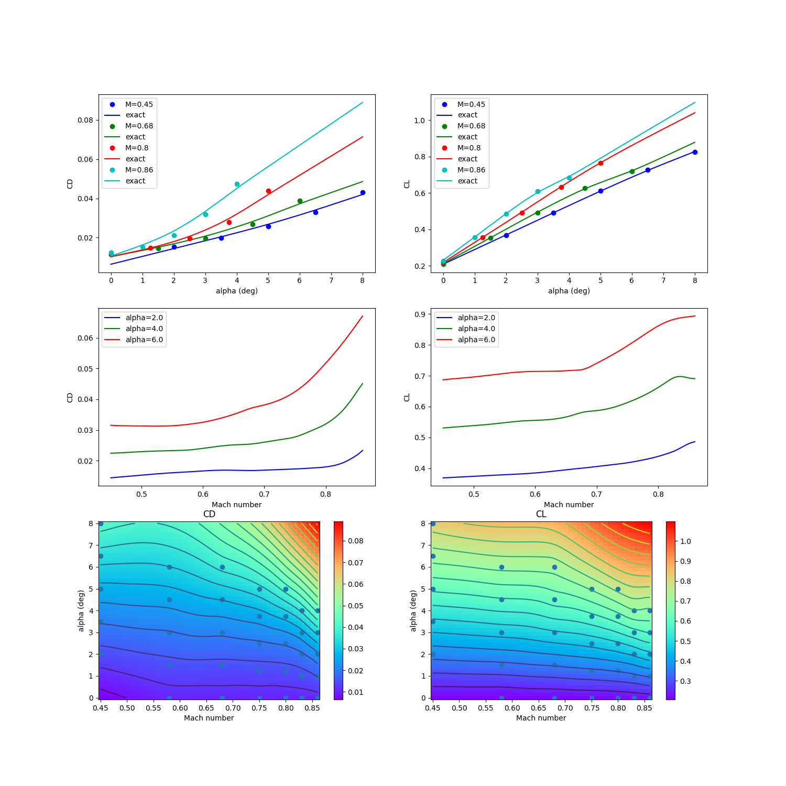

RANS CRM wing 2-D data set
==========================

.. code-block:: python

  import numpy as np
  
  
  raw = np.array(
      [
          [
              2.000000000000000000e00,
              4.500000000000000111e-01,
              1.536799999999999972e-02,
              3.674239999999999728e-01,
              5.592279999999999474e-01,
              -1.258039999999999992e-01,
              -1.248699999999999984e-02,
          ],
          [
              3.500000000000000000e00,
              4.500000000000000111e-01,
              1.985100000000000059e-02,
              4.904470000000000218e-01,
              7.574600000000000222e-01,
              -1.615260000000000029e-01,
              8.987000000000000197e-03,
          ],
          [
              5.000000000000000000e00,
              4.500000000000000111e-01,
              2.571000000000000021e-02,
              6.109189999999999898e-01,
              9.497949999999999449e-01,
              -1.954619999999999969e-01,
              4.090900000000000092e-02,
          ],
          [
              6.500000000000000000e00,
              4.500000000000000111e-01,
              3.304200000000000192e-02,
              7.266120000000000356e-01,
              1.131138999999999895e00,
              -2.255890000000000117e-01,
              8.185399999999999621e-02,
          ],
          [
              8.000000000000000000e00,
              4.500000000000000111e-01,
              4.318999999999999923e-02,
              8.247250000000000414e-01,
              1.271487000000000034e00,
              -2.397040000000000004e-01,
              1.217659999999999992e-01,
          ],
          [
              0.000000000000000000e00,
              5.799999999999999600e-01,
              1.136200000000000057e-02,
              2.048760000000000026e-01,
              2.950280000000000125e-01,
              -7.882100000000000217e-02,
              -2.280099999999999835e-02,
          ],
          [
              1.500000000000000000e00,
              5.799999999999999600e-01,
              1.426000000000000011e-02,
              3.375619999999999732e-01,
              5.114130000000000065e-01,
              -1.189420000000000061e-01,
              -1.588200000000000028e-02,
          ],
          [
              3.000000000000000000e00,
              5.799999999999999600e-01,
              1.866400000000000003e-02,
              4.687450000000000228e-01,
              7.240400000000000169e-01,
              -1.577669999999999906e-01,
              3.099999999999999891e-03,
          ],
          [
              4.500000000000000000e00,
              5.799999999999999600e-01,
              2.461999999999999952e-02,
              5.976639999999999731e-01,
              9.311709999999999710e-01,
              -1.944160000000000055e-01,
              3.357500000000000068e-02,
          ],
          [
              6.000000000000000000e00,
              5.799999999999999600e-01,
              3.280700000000000283e-02,
              7.142249999999999988e-01,
              1.111707999999999918e00,
              -2.205870000000000053e-01,
              7.151699999999999724e-02,
          ],
          [
              0.000000000000000000e00,
              6.800000000000000488e-01,
              1.138800000000000055e-02,
              2.099310000000000065e-01,
              3.032230000000000203e-01,
              -8.187899999999999345e-02,
              -2.172699999999999979e-02,
          ],
          [
              1.500000000000000000e00,
              6.800000000000000488e-01,
              1.458699999999999927e-02,
              3.518569999999999753e-01,
              5.356630000000000003e-01,
              -1.257649999999999879e-01,
              -1.444800000000000077e-02,
          ],
          [
              3.000000000000000000e00,
              6.800000000000000488e-01,
              1.952800000000000022e-02,
              4.924879999999999813e-01,
              7.644769999999999621e-01,
              -1.678040000000000087e-01,
              6.023999999999999841e-03,
          ],
          [
              4.500000000000000000e00,
              6.800000000000000488e-01,
              2.666699999999999973e-02,
              6.270339999999999803e-01,
              9.801630000000000065e-01,
              -2.035240000000000105e-01,
              3.810000000000000192e-02,
          ],
          [
              6.000000000000000000e00,
              6.800000000000000488e-01,
              3.891800000000000120e-02,
              7.172730000000000494e-01,
              1.097855999999999943e00,
              -2.014620000000000022e-01,
              6.640000000000000069e-02,
          ],
          [
              0.000000000000000000e00,
              7.500000000000000000e-01,
              1.150699999999999987e-02,
              2.149069999999999869e-01,
              3.115740000000000176e-01,
              -8.498999999999999611e-02,
              -2.057700000000000154e-02,
          ],
          [
              1.250000000000000000e00,
              7.500000000000000000e-01,
              1.432600000000000019e-02,
              3.415969999999999840e-01,
              5.199390000000000400e-01,
              -1.251009999999999900e-01,
              -1.515400000000000080e-02,
          ],
          [
              2.500000000000000000e00,
              7.500000000000000000e-01,
              1.856000000000000011e-02,
              4.677589999999999804e-01,
              7.262499999999999512e-01,
              -1.635169999999999957e-01,
              3.989999999999999949e-04,
          ],
          [
              3.750000000000000000e00,
              7.500000000000000000e-01,
              2.472399999999999945e-02,
              5.911459999999999493e-01,
              9.254930000000000101e-01,
              -1.966150000000000120e-01,
              2.524900000000000061e-02,
          ],
          [
              5.000000000000000000e00,
              7.500000000000000000e-01,
              3.506800000000000195e-02,
              7.047809999999999908e-01,
              1.097736000000000045e00,
              -2.143069999999999975e-01,
              5.321300000000000335e-02,
          ],
          [
              0.000000000000000000e00,
              8.000000000000000444e-01,
              1.168499999999999921e-02,
              2.196390000000000009e-01,
              3.197160000000000002e-01,
              -8.798200000000000465e-02,
              -1.926999999999999894e-02,
          ],
          [
              1.250000000000000000e00,
              8.000000000000000444e-01,
              1.481599999999999931e-02,
              3.553939999999999877e-01,
              5.435950000000000504e-01,
              -1.317419999999999980e-01,
              -1.345599999999999921e-02,
          ],
          [
              2.500000000000000000e00,
              8.000000000000000444e-01,
              1.968999999999999917e-02,
              4.918299999999999894e-01,
              7.669930000000000359e-01,
              -1.728079999999999894e-01,
              3.756999999999999923e-03,
          ],
          [
              3.750000000000000000e00,
              8.000000000000000444e-01,
              2.785599999999999882e-02,
              6.324319999999999942e-01,
              9.919249999999999456e-01,
              -2.077100000000000057e-01,
              3.159800000000000109e-02,
          ],
          [
              5.000000000000000000e00,
              8.000000000000000444e-01,
              4.394300000000000289e-02,
              7.650689999999999991e-01,
              1.188355999999999968e00,
              -2.332680000000000031e-01,
              5.645000000000000018e-02,
          ],
          [
              0.000000000000000000e00,
              8.299999999999999600e-01,
              1.186100000000000002e-02,
              2.232899999999999885e-01,
              3.261100000000000110e-01,
              -9.028400000000000314e-02,
              -1.806500000000000120e-02,
          ],
          [
              1.000000000000000000e00,
              8.299999999999999600e-01,
              1.444900000000000004e-02,
              3.383419999999999761e-01,
              5.161710000000000464e-01,
              -1.279530000000000112e-01,
              -1.402400000000000001e-02,
          ],
          [
              2.000000000000000000e00,
              8.299999999999999600e-01,
              1.836799999999999891e-02,
              4.554270000000000262e-01,
              7.082190000000000429e-01,
              -1.642339999999999911e-01,
              -1.793000000000000106e-03,
          ],
          [
              3.000000000000000000e00,
              8.299999999999999600e-01,
              2.466899999999999996e-02,
              5.798410000000000508e-01,
              9.088819999999999677e-01,
              -2.004589999999999983e-01,
              1.892900000000000138e-02,
          ],
          [
              4.000000000000000000e00,
              8.299999999999999600e-01,
              3.700400000000000217e-02,
              7.012720000000000065e-01,
              1.097366000000000064e00,
              -2.362420000000000075e-01,
              3.750699999999999867e-02,
          ],
          [
              0.000000000000000000e00,
              8.599999999999999867e-01,
              1.224300000000000041e-02,
              2.278100000000000125e-01,
              3.342720000000000136e-01,
              -9.307600000000000595e-02,
              -1.608400000000000107e-02,
          ],
          [
              1.000000000000000000e00,
              8.599999999999999867e-01,
              1.540700000000000056e-02,
              3.551839999999999997e-01,
              5.433130000000000459e-01,
              -1.364730000000000110e-01,
              -1.162200000000000039e-02,
          ],
          [
              2.000000000000000000e00,
              8.599999999999999867e-01,
              2.122699999999999934e-02,
              4.854620000000000046e-01,
              7.552919999999999634e-01,
              -1.817850000000000021e-01,
              1.070999999999999903e-03,
          ],
          [
              3.000000000000000000e00,
              8.599999999999999867e-01,
              3.178899999999999781e-02,
              6.081849999999999756e-01,
              9.510380000000000500e-01,
              -2.252020000000000133e-01,
              1.540799999999999982e-02,
          ],
          [
              4.000000000000000000e00,
              8.599999999999999867e-01,
              4.744199999999999806e-02,
              6.846989999999999466e-01,
              1.042564000000000046e00,
              -2.333600000000000119e-01,
              2.035400000000000056e-02,
          ],
      ]
  )
  
  
  def get_rans_crm_wing():
      # data structure:
      # alpha, mach, cd, cl, cmx, cmy, cmz
  
      deg2rad = np.pi / 180.0
  
      xt = np.array(raw[:, 0:2])
      yt = np.array(raw[:, 2:4])
      xlimits = np.array([[-3.0, 10.0], [0.4, 0.90]])
  
      xt[:, 0] *= deg2rad
      xlimits[0, :] *= deg2rad
  
      return xt, yt, xlimits
  
  
  def plot_rans_crm_wing(xt, yt, limits, interp):
      import numpy as np
      import matplotlib
  
      matplotlib.use("Agg")
      import matplotlib.pyplot as plt
  
      rad2deg = 180.0 / np.pi
  
      num = 500
      num_a = 50
      num_M = 50
  
      x = np.zeros((num, 2))
      colors = ["b", "g", "r", "c", "m", "k", "y"]
  
      nrow = 3
      ncol = 2
  
      plt.close()
      fig, axs = plt.subplots(3, 2, figsize=(15, 15))
  
      # -----------------------------------------------------------------------------
  
      mach_numbers = [0.45, 0.68, 0.80, 0.86]
      legend_entries = []
  
      alpha_sweep = np.linspace(0.0, 8.0, num)
  
      for ind, mach in enumerate(mach_numbers):
          x[:, 0] = alpha_sweep / rad2deg
          x[:, 1] = mach
          CD = interp.predict_values(x)[:, 0]
          CL = interp.predict_values(x)[:, 1]
  
          mask = np.abs(xt[:, 1] - mach) < 1e-10
          axs[0, 0].plot(xt[mask, 0] * rad2deg, yt[mask, 0], "o" + colors[ind])
          axs[0, 0].plot(alpha_sweep, CD, colors[ind])
  
          mask = np.abs(xt[:, 1] - mach) < 1e-10
          axs[0, 1].plot(xt[mask, 0] * rad2deg, yt[mask, 1], "o" + colors[ind])
          axs[0, 1].plot(alpha_sweep, CL, colors[ind])
  
          legend_entries.append("M={}".format(mach))
          legend_entries.append("exact")
  
      axs[0, 0].set(xlabel="alpha (deg)", ylabel="CD")
      axs[0, 0].legend(legend_entries)
  
      axs[0, 1].set(xlabel="alpha (deg)", ylabel="CL")
      axs[0, 1].legend(legend_entries)
  
      # -----------------------------------------------------------------------------
  
      alphas = [2.0, 4.0, 6.0]
      legend_entries = []
  
      mach_sweep = np.linspace(0.45, 0.86, num)
  
      for ind, alpha in enumerate(alphas):
          x[:, 0] = alpha / rad2deg
          x[:, 1] = mach_sweep
          CD = interp.predict_values(x)[:, 0]
          CL = interp.predict_values(x)[:, 1]
  
          axs[1, 0].plot(mach_sweep, CD, colors[ind])
          axs[1, 1].plot(mach_sweep, CL, colors[ind])
  
          legend_entries.append("alpha={}".format(alpha))
  
      axs[1, 0].set(xlabel="Mach number", ylabel="CD")
      axs[1, 0].legend(legend_entries)
  
      axs[1, 1].set(xlabel="Mach number", ylabel="CL")
      axs[1, 1].legend(legend_entries)
  
      # -----------------------------------------------------------------------------
  
      x = np.zeros((num_a, num_M, 2))
      x[:, :, 0] = np.outer(np.linspace(0.0, 8.0, num_a), np.ones(num_M)) / rad2deg
      x[:, :, 1] = np.outer(np.ones(num_a), np.linspace(0.45, 0.86, num_M))
      CD = interp.predict_values(x.reshape((num_a * num_M, 2)))[:, 0].reshape(
          (num_a, num_M)
      )
      CL = interp.predict_values(x.reshape((num_a * num_M, 2)))[:, 1].reshape(
          (num_a, num_M)
      )
  
      axs[2, 0].plot(xt[:, 1], xt[:, 0] * rad2deg, "o")
      axs[2, 0].contour(x[:, :, 1], x[:, :, 0] * rad2deg, CD, 20)
      pcm1 = axs[2, 0].pcolormesh(
          x[:, :, 1],
          x[:, :, 0] * rad2deg,
          CD,
          cmap=plt.get_cmap("rainbow"),
          shading="auto",
      )
      fig.colorbar(pcm1, ax=axs[2, 0])
      axs[2, 0].set(xlabel="Mach number", ylabel="alpha (deg)")
      axs[2, 0].set_title("CD")
  
      axs[2, 1].plot(xt[:, 1], xt[:, 0] * rad2deg, "o")
      axs[2, 1].contour(x[:, :, 1], x[:, :, 0] * rad2deg, CL, 20)
      pcm2 = axs[2, 1].pcolormesh(
          x[:, :, 1],
          x[:, :, 0] * rad2deg,
          CL,
          cmap=plt.get_cmap("rainbow"),
          shading="auto",
      )
      fig.colorbar(pcm2, ax=axs[2, 1])
      axs[2, 1].set(xlabel="Mach number", ylabel="alpha (deg)")
      axs[2, 1].set_title("CL")
  
      plt.show()
  

RMTB
----

.. code-block:: python

  from smt.surrogate_models import RMTB
  from smt.examples.rans_crm_wing.rans_crm_wing import (
      get_rans_crm_wing,
      plot_rans_crm_wing,
  )
  
  xt, yt, xlimits = get_rans_crm_wing()
  
  interp = RMTB(
      num_ctrl_pts=20, xlimits=xlimits, nonlinear_maxiter=100, energy_weight=1e-12
  )
  interp.set_training_values(xt, yt)
  interp.train()
  
  plot_rans_crm_wing(xt, yt, xlimits, interp)
  
::

  ___________________________________________________________________________
     
                                     RMTB
  ___________________________________________________________________________
     
   Problem size
     
        # training points.        : 35
     
  ___________________________________________________________________________
     
   Training
     
     Training ...
        Pre-computing matrices ...
           Computing dof2coeff ...
           Computing dof2coeff - done. Time (sec):  0.0000000
           Initializing Hessian ...
           Initializing Hessian - done. Time (sec):  0.0000000
           Computing energy terms ...
           Computing energy terms - done. Time (sec):  0.0000000
           Computing approximation terms ...
           Computing approximation terms - done. Time (sec):  0.0000000
        Pre-computing matrices - done. Time (sec):  0.0000000
        Solving for degrees of freedom ...
           Solving initial startup problem (n=400) ...
              Solving for output 0 ...
                 Iteration (num., iy, grad. norm, func.) :   0   0 9.429150220e-02 1.114942861e-02
                 Iteration (num., iy, grad. norm, func.) :   0   0 3.285344182e-08 1.793057271e-10
              Solving for output 0 - done. Time (sec):  0.0099998
              Solving for output 1 ...
                 Iteration (num., iy, grad. norm, func.) :   0   1 1.955493282e+00 4.799845498e+00
                 Iteration (num., iy, grad. norm, func.) :   0   1 2.576015345e-07 4.567654000e-08
              Solving for output 1 - done. Time (sec):  0.0100002
           Solving initial startup problem (n=400) - done. Time (sec):  0.0200000
           Solving nonlinear problem (n=400) ...
              Solving for output 0 ...
                 Iteration (num., iy, grad. norm, func.) :   0   0 6.652468783e-09 1.793036975e-10
                 Iteration (num., iy, grad. norm, func.) :   0   0 5.849359661e-09 1.703948671e-10
                 Iteration (num., iy, grad. norm, func.) :   1   0 3.024325657e-08 1.032975972e-10
                 Iteration (num., iy, grad. norm, func.) :   2   0 1.125952154e-08 2.504755353e-11
                 Iteration (num., iy, grad. norm, func.) :   3   0 3.703330543e-09 1.068567321e-11
                 Iteration (num., iy, grad. norm, func.) :   4   0 2.308909897e-09 9.336148495e-12
                 Iteration (num., iy, grad. norm, func.) :   5   0 6.563532482e-10 7.374595825e-12
                 Iteration (num., iy, grad. norm, func.) :   6   0 1.899965043e-10 6.526023195e-12
                 Iteration (num., iy, grad. norm, func.) :   7   0 3.754706496e-11 6.261587544e-12
                 Iteration (num., iy, grad. norm, func.) :   8   0 2.324496290e-11 6.261399259e-12
                 Iteration (num., iy, grad. norm, func.) :   9   0 1.605020424e-11 6.260532352e-12
                 Iteration (num., iy, grad. norm, func.) :  10   0 9.318527760e-12 6.260087609e-12
                 Iteration (num., iy, grad. norm, func.) :  11   0 3.152266674e-12 6.256581242e-12
                 Iteration (num., iy, grad. norm, func.) :  12   0 6.297025943e-13 6.255685336e-12
              Solving for output 0 - done. Time (sec):  0.1299999
              Solving for output 1 ...
                 Iteration (num., iy, grad. norm, func.) :   0   1 9.729427657e-08 4.567642346e-08
                 Iteration (num., iy, grad. norm, func.) :   0   1 9.338325576e-08 4.538217216e-08
                 Iteration (num., iy, grad. norm, func.) :   1   1 2.905713447e-06 3.252950315e-08
                 Iteration (num., iy, grad. norm, func.) :   2   1 8.633229768e-07 4.671460509e-09
                 Iteration (num., iy, grad. norm, func.) :   3   1 3.070729855e-07 2.348794793e-09
                 Iteration (num., iy, grad. norm, func.) :   4   1 2.500598178e-07 1.843742999e-09
                 Iteration (num., iy, grad. norm, func.) :   5   1 7.358885180e-08 6.117826659e-10
                 Iteration (num., iy, grad. norm, func.) :   6   1 2.131842881e-08 4.697487696e-10
                 Iteration (num., iy, grad. norm, func.) :   7   1 8.392367562e-09 4.379120867e-10
                 Iteration (num., iy, grad. norm, func.) :   8   1 1.441027672e-08 3.875329318e-10
                 Iteration (num., iy, grad. norm, func.) :   9   1 4.418732381e-09 2.976219461e-10
                 Iteration (num., iy, grad. norm, func.) :  10   1 1.162494175e-09 2.732104388e-10
                 Iteration (num., iy, grad. norm, func.) :  11   1 1.029882269e-09 2.731585062e-10
                 Iteration (num., iy, grad. norm, func.) :  12   1 5.996851815e-10 2.729944378e-10
                 Iteration (num., iy, grad. norm, func.) :  13   1 2.773575123e-10 2.720631775e-10
                 Iteration (num., iy, grad. norm, func.) :  14   1 4.839897428e-11 2.714806989e-10
                 Iteration (num., iy, grad. norm, func.) :  15   1 3.510264913e-11 2.714720312e-10
                 Iteration (num., iy, grad. norm, func.) :  16   1 4.275628954e-11 2.714584243e-10
                 Iteration (num., iy, grad. norm, func.) :  17   1 4.600758315e-11 2.714215071e-10
                 Iteration (num., iy, grad. norm, func.) :  18   1 3.755405225e-11 2.713917882e-10
                 Iteration (num., iy, grad. norm, func.) :  19   1 2.030607591e-11 2.713645513e-10
                 Iteration (num., iy, grad. norm, func.) :  20   1 2.354692086e-11 2.713542916e-10
                 Iteration (num., iy, grad. norm, func.) :  21   1 1.575101494e-11 2.713528375e-10
                 Iteration (num., iy, grad. norm, func.) :  22   1 1.050318251e-11 2.713503217e-10
                 Iteration (num., iy, grad. norm, func.) :  23   1 1.594812517e-11 2.713483733e-10
                 Iteration (num., iy, grad. norm, func.) :  24   1 3.895308868e-12 2.713460532e-10
                 Iteration (num., iy, grad. norm, func.) :  25   1 5.032359799e-12 2.713456491e-10
                 Iteration (num., iy, grad. norm, func.) :  26   1 3.021954913e-12 2.713455900e-10
                 Iteration (num., iy, grad. norm, func.) :  27   1 4.520394294e-12 2.713453462e-10
                 Iteration (num., iy, grad. norm, func.) :  28   1 7.790196797e-13 2.713450408e-10
              Solving for output 1 - done. Time (sec):  0.2700002
           Solving nonlinear problem (n=400) - done. Time (sec):  0.4000001
        Solving for degrees of freedom - done. Time (sec):  0.4200001
     Training - done. Time (sec):  0.4200001
  ___________________________________________________________________________
     
   Evaluation
     
        # eval points. : 500
     
     Predicting ...
     Predicting - done. Time (sec):  0.0000000
     
     Prediction time/pt. (sec) :  0.0000000
     
  ___________________________________________________________________________
     
   Evaluation
     
        # eval points. : 500
     
     Predicting ...
     Predicting - done. Time (sec):  0.0000000
     
     Prediction time/pt. (sec) :  0.0000000
     
  ___________________________________________________________________________
     
   Evaluation
     
        # eval points. : 500
     
     Predicting ...
     Predicting - done. Time (sec):  0.0000000
     
     Prediction time/pt. (sec) :  0.0000000
     
  ___________________________________________________________________________
     
   Evaluation
     
        # eval points. : 500
     
     Predicting ...
     Predicting - done. Time (sec):  0.0000000
     
     Prediction time/pt. (sec) :  0.0000000
     
  ___________________________________________________________________________
     
   Evaluation
     
        # eval points. : 500
     
     Predicting ...
     Predicting - done. Time (sec):  0.0000000
     
     Prediction time/pt. (sec) :  0.0000000
     
  ___________________________________________________________________________
     
   Evaluation
     
        # eval points. : 500
     
     Predicting ...
     Predicting - done. Time (sec):  0.0000000
     
     Prediction time/pt. (sec) :  0.0000000
     
  ___________________________________________________________________________
     
   Evaluation
     
        # eval points. : 500
     
     Predicting ...
     Predicting - done. Time (sec):  0.0000000
     
     Prediction time/pt. (sec) :  0.0000000
     
  ___________________________________________________________________________
     
   Evaluation
     
        # eval points. : 500
     
     Predicting ...
     Predicting - done. Time (sec):  0.0000000
     
     Prediction time/pt. (sec) :  0.0000000
     
  ___________________________________________________________________________
     
   Evaluation
     
        # eval points. : 500
     
     Predicting ...
     Predicting - done. Time (sec):  0.0000000
     
     Prediction time/pt. (sec) :  0.0000000
     
  ___________________________________________________________________________
     
   Evaluation
     
        # eval points. : 500
     
     Predicting ...
     Predicting - done. Time (sec):  0.0000000
     
     Prediction time/pt. (sec) :  0.0000000
     
  ___________________________________________________________________________
     
   Evaluation
     
        # eval points. : 500
     
     Predicting ...
     Predicting - done. Time (sec):  0.0000000
     
     Prediction time/pt. (sec) :  0.0000000
     
  ___________________________________________________________________________
     
   Evaluation
     
        # eval points. : 500
     
     Predicting ...
     Predicting - done. Time (sec):  0.0000000
     
     Prediction time/pt. (sec) :  0.0000000
     
  ___________________________________________________________________________
     
   Evaluation
     
        # eval points. : 500
     
     Predicting ...
     Predicting - done. Time (sec):  0.0000000
     
     Prediction time/pt. (sec) :  0.0000000
     
  ___________________________________________________________________________
     
   Evaluation
     
        # eval points. : 500
     
     Predicting ...
     Predicting - done. Time (sec):  0.0000000
     
     Prediction time/pt. (sec) :  0.0000000
     
  ___________________________________________________________________________
     
   Evaluation
     
        # eval points. : 2500
     
     Predicting ...
     Predicting - done. Time (sec):  0.0000000
     
     Prediction time/pt. (sec) :  0.0000000
     
  ___________________________________________________________________________
     
   Evaluation
     
        # eval points. : 2500
     
     Predicting ...
     Predicting - done. Time (sec):  0.0000000
     
     Prediction time/pt. (sec) :  0.0000000
     
  

RMTC
----

.. code-block:: python

  from smt.surrogate_models import RMTC
  from smt.examples.rans_crm_wing.rans_crm_wing import (
      get_rans_crm_wing,
      plot_rans_crm_wing,
  )
  
  xt, yt, xlimits = get_rans_crm_wing()
  
  interp = RMTC(
      num_elements=20, xlimits=xlimits, nonlinear_maxiter=100, energy_weight=1e-10
  )
  interp.set_training_values(xt, yt)
  interp.train()
  
  plot_rans_crm_wing(xt, yt, xlimits, interp)
  
::

  ___________________________________________________________________________
     
                                     RMTC
  ___________________________________________________________________________
     
   Problem size
     
        # training points.        : 35
     
  ___________________________________________________________________________
     
   Training
     
     Training ...
        Pre-computing matrices ...
           Computing dof2coeff ...
           Computing dof2coeff - done. Time (sec):  0.0000000
           Initializing Hessian ...
           Initializing Hessian - done. Time (sec):  0.0000000
           Computing energy terms ...
           Computing energy terms - done. Time (sec):  0.0100002
           Computing approximation terms ...
           Computing approximation terms - done. Time (sec):  0.0000000
        Pre-computing matrices - done. Time (sec):  0.0100002
        Solving for degrees of freedom ...
           Solving initial startup problem (n=1764) ...
              Solving for output 0 ...
                 Iteration (num., iy, grad. norm, func.) :   0   0 1.279175539e-01 1.114942861e-02
                 Iteration (num., iy, grad. norm, func.) :   0   0 4.269613325e-06 2.206667028e-08
              Solving for output 0 - done. Time (sec):  0.0200000
              Solving for output 1 ...
                 Iteration (num., iy, grad. norm, func.) :   0   1 2.653045755e+00 4.799845498e+00
                 Iteration (num., iy, grad. norm, func.) :   0   1 8.181842136e-05 6.499264090e-06
              Solving for output 1 - done. Time (sec):  0.0200000
           Solving initial startup problem (n=1764) - done. Time (sec):  0.0400000
           Solving nonlinear problem (n=1764) ...
              Solving for output 0 ...
                 Iteration (num., iy, grad. norm, func.) :   0   0 8.706466102e-07 2.205254659e-08
                 Iteration (num., iy, grad. norm, func.) :   0   0 9.563774984e-07 1.751091936e-08
                 Iteration (num., iy, grad. norm, func.) :   1   0 3.540967624e-07 3.271690535e-09
                 Iteration (num., iy, grad. norm, func.) :   2   0 1.182287333e-07 1.052646339e-09
                 Iteration (num., iy, grad. norm, func.) :   3   0 6.338489775e-08 5.346409167e-10
                 Iteration (num., iy, grad. norm, func.) :   4   0 3.377551606e-08 4.104301514e-10
                 Iteration (num., iy, grad. norm, func.) :   5   0 2.242910012e-08 3.753259905e-10
                 Iteration (num., iy, grad. norm, func.) :   6   0 1.964970772e-08 3.751489728e-10
                 Iteration (num., iy, grad. norm, func.) :   7   0 1.527094421e-08 3.661593175e-10
                 Iteration (num., iy, grad. norm, func.) :   8   0 1.690202790e-08 3.641811225e-10
                 Iteration (num., iy, grad. norm, func.) :   9   0 1.404808000e-08 3.400408379e-10
                 Iteration (num., iy, grad. norm, func.) :  10   0 8.545659714e-09 3.088440096e-10
                 Iteration (num., iy, grad. norm, func.) :  11   0 2.764134834e-09 2.905853361e-10
                 Iteration (num., iy, grad. norm, func.) :  12   0 2.564977956e-09 2.894136297e-10
                 Iteration (num., iy, grad. norm, func.) :  13   0 2.564977954e-09 2.894136297e-10
                 Iteration (num., iy, grad. norm, func.) :  14   0 2.564977954e-09 2.894136297e-10
                 Iteration (num., iy, grad. norm, func.) :  15   0 3.829116565e-09 2.884285847e-10
                 Iteration (num., iy, grad. norm, func.) :  16   0 7.531911834e-10 2.872989730e-10
                 Iteration (num., iy, grad. norm, func.) :  17   0 1.467359380e-09 2.870606984e-10
                 Iteration (num., iy, grad. norm, func.) :  18   0 9.879625566e-10 2.869763841e-10
                 Iteration (num., iy, grad. norm, func.) :  19   0 9.122177076e-10 2.869563186e-10
                 Iteration (num., iy, grad. norm, func.) :  20   0 8.902786862e-10 2.869003688e-10
                 Iteration (num., iy, grad. norm, func.) :  21   0 1.135119850e-09 2.867529790e-10
                 Iteration (num., iy, grad. norm, func.) :  22   0 7.995220792e-10 2.866276258e-10
                 Iteration (num., iy, grad. norm, func.) :  23   0 3.328505805e-10 2.865652621e-10
                 Iteration (num., iy, grad. norm, func.) :  24   0 2.914967622e-10 2.865626286e-10
                 Iteration (num., iy, grad. norm, func.) :  25   0 4.202766941e-10 2.865616065e-10
                 Iteration (num., iy, grad. norm, func.) :  26   0 3.877343718e-10 2.865534583e-10
                 Iteration (num., iy, grad. norm, func.) :  27   0 4.306678978e-10 2.865437762e-10
                 Iteration (num., iy, grad. norm, func.) :  28   0 2.673682253e-10 2.865299886e-10
                 Iteration (num., iy, grad. norm, func.) :  29   0 3.275156607e-10 2.865207653e-10
                 Iteration (num., iy, grad. norm, func.) :  30   0 1.930712327e-10 2.865122795e-10
                 Iteration (num., iy, grad. norm, func.) :  31   0 2.110880200e-10 2.865087706e-10
                 Iteration (num., iy, grad. norm, func.) :  32   0 1.473132344e-10 2.865051960e-10
                 Iteration (num., iy, grad. norm, func.) :  33   0 1.942718886e-10 2.865041883e-10
                 Iteration (num., iy, grad. norm, func.) :  34   0 1.115813968e-10 2.865019571e-10
                 Iteration (num., iy, grad. norm, func.) :  35   0 1.662319465e-10 2.864991211e-10
                 Iteration (num., iy, grad. norm, func.) :  36   0 6.180638003e-11 2.864957999e-10
                 Iteration (num., iy, grad. norm, func.) :  37   0 1.062616250e-10 2.864956662e-10
                 Iteration (num., iy, grad. norm, func.) :  38   0 6.888942793e-11 2.864952745e-10
                 Iteration (num., iy, grad. norm, func.) :  39   0 1.155104075e-10 2.864948247e-10
                 Iteration (num., iy, grad. norm, func.) :  40   0 5.301847100e-11 2.864940891e-10
                 Iteration (num., iy, grad. norm, func.) :  41   0 6.018140313e-11 2.864937454e-10
                 Iteration (num., iy, grad. norm, func.) :  42   0 4.486986044e-11 2.864935284e-10
                 Iteration (num., iy, grad. norm, func.) :  43   0 4.403159581e-11 2.864932581e-10
                 Iteration (num., iy, grad. norm, func.) :  44   0 4.446981101e-11 2.864931203e-10
                 Iteration (num., iy, grad. norm, func.) :  45   0 3.306185597e-11 2.864929855e-10
                 Iteration (num., iy, grad. norm, func.) :  46   0 3.855294007e-11 2.864928687e-10
                 Iteration (num., iy, grad. norm, func.) :  47   0 2.386145287e-11 2.864927343e-10
                 Iteration (num., iy, grad. norm, func.) :  48   0 3.479120870e-11 2.864926795e-10
                 Iteration (num., iy, grad. norm, func.) :  49   0 2.038523321e-11 2.864926305e-10
                 Iteration (num., iy, grad. norm, func.) :  50   0 2.842194813e-11 2.864925264e-10
                 Iteration (num., iy, grad. norm, func.) :  51   0 5.869027097e-12 2.864924490e-10
                 Iteration (num., iy, grad. norm, func.) :  52   0 5.498904403e-12 2.864924489e-10
                 Iteration (num., iy, grad. norm, func.) :  53   0 7.306931689e-12 2.864924453e-10
                 Iteration (num., iy, grad. norm, func.) :  54   0 6.504376748e-12 2.864924392e-10
                 Iteration (num., iy, grad. norm, func.) :  55   0 1.045430092e-11 2.864924382e-10
                 Iteration (num., iy, grad. norm, func.) :  56   0 5.954310611e-12 2.864924378e-10
                 Iteration (num., iy, grad. norm, func.) :  57   0 8.350346501e-12 2.864924344e-10
                 Iteration (num., iy, grad. norm, func.) :  58   0 4.203044469e-12 2.864924276e-10
                 Iteration (num., iy, grad. norm, func.) :  59   0 4.808460418e-12 2.864924239e-10
                 Iteration (num., iy, grad. norm, func.) :  60   0 3.033848305e-12 2.864924214e-10
                 Iteration (num., iy, grad. norm, func.) :  61   0 4.617206475e-12 2.864924203e-10
                 Iteration (num., iy, grad. norm, func.) :  62   0 2.637312920e-12 2.864924192e-10
                 Iteration (num., iy, grad. norm, func.) :  63   0 3.304647023e-12 2.864924191e-10
                 Iteration (num., iy, grad. norm, func.) :  64   0 2.271894901e-12 2.864924185e-10
                 Iteration (num., iy, grad. norm, func.) :  65   0 3.579944006e-12 2.864924178e-10
                 Iteration (num., iy, grad. norm, func.) :  66   0 1.348728833e-12 2.864924169e-10
                 Iteration (num., iy, grad. norm, func.) :  67   0 1.806375611e-12 2.864924165e-10
                 Iteration (num., iy, grad. norm, func.) :  68   0 1.363756532e-12 2.864924163e-10
                 Iteration (num., iy, grad. norm, func.) :  69   0 1.712838050e-12 2.864924161e-10
                 Iteration (num., iy, grad. norm, func.) :  70   0 9.876379889e-13 2.864924158e-10
              Solving for output 0 - done. Time (sec):  1.4699998
              Solving for output 1 ...
                 Iteration (num., iy, grad. norm, func.) :   0   1 1.428317959e-05 6.494040493e-06
                 Iteration (num., iy, grad. norm, func.) :   0   1 1.428267378e-05 6.247373107e-06
                 Iteration (num., iy, grad. norm, func.) :   1   1 1.481274881e-05 8.062583973e-07
                 Iteration (num., iy, grad. norm, func.) :   2   1 1.867225216e-05 3.693188434e-07
                 Iteration (num., iy, grad. norm, func.) :   3   1 5.730360645e-06 1.284492940e-07
                 Iteration (num., iy, grad. norm, func.) :   4   1 4.881295024e-06 1.022046592e-07
                 Iteration (num., iy, grad. norm, func.) :   5   1 1.494072262e-06 3.710248943e-08
                 Iteration (num., iy, grad. norm, func.) :   6   1 1.213916647e-06 3.116830197e-08
                 Iteration (num., iy, grad. norm, func.) :   7   1 9.300654262e-07 3.027500084e-08
                 Iteration (num., iy, grad. norm, func.) :   8   1 3.309011543e-07 2.989622146e-08
                 Iteration (num., iy, grad. norm, func.) :   9   1 1.737272135e-07 2.372116544e-08
                 Iteration (num., iy, grad. norm, func.) :  10   1 1.192375978e-07 1.812151163e-08
                 Iteration (num., iy, grad. norm, func.) :  11   1 2.823830003e-08 1.492230509e-08
                 Iteration (num., iy, grad. norm, func.) :  12   1 3.075752735e-08 1.479543683e-08
                 Iteration (num., iy, grad. norm, func.) :  13   1 3.075752733e-08 1.479543683e-08
                 Iteration (num., iy, grad. norm, func.) :  14   1 3.075752733e-08 1.479543683e-08
                 Iteration (num., iy, grad. norm, func.) :  15   1 3.964583353e-08 1.465943906e-08
                 Iteration (num., iy, grad. norm, func.) :  16   1 7.803411275e-09 1.450888835e-08
                 Iteration (num., iy, grad. norm, func.) :  17   1 5.277665204e-09 1.449730293e-08
                 Iteration (num., iy, grad. norm, func.) :  18   1 1.430068303e-08 1.449498297e-08
                 Iteration (num., iy, grad. norm, func.) :  19   1 9.248180067e-09 1.449172013e-08
                 Iteration (num., iy, grad. norm, func.) :  20   1 9.340420132e-09 1.449165474e-08
                 Iteration (num., iy, grad. norm, func.) :  21   1 7.764038380e-09 1.448168658e-08
                 Iteration (num., iy, grad. norm, func.) :  22   1 6.859229342e-09 1.447218601e-08
                 Iteration (num., iy, grad. norm, func.) :  23   1 3.419486695e-09 1.446903012e-08
                 Iteration (num., iy, grad. norm, func.) :  24   1 3.133529225e-09 1.446840459e-08
                 Iteration (num., iy, grad. norm, func.) :  25   1 3.234821678e-09 1.446804176e-08
                 Iteration (num., iy, grad. norm, func.) :  26   1 4.311442242e-09 1.446751633e-08
                 Iteration (num., iy, grad. norm, func.) :  27   1 2.174738895e-09 1.446676165e-08
                 Iteration (num., iy, grad. norm, func.) :  28   1 3.665734460e-09 1.446612261e-08
                 Iteration (num., iy, grad. norm, func.) :  29   1 1.819294496e-09 1.446525702e-08
                 Iteration (num., iy, grad. norm, func.) :  30   1 1.688849698e-09 1.446466796e-08
                 Iteration (num., iy, grad. norm, func.) :  31   1 1.477487561e-09 1.446425046e-08
                 Iteration (num., iy, grad. norm, func.) :  32   1 1.048263967e-09 1.446400848e-08
                 Iteration (num., iy, grad. norm, func.) :  33   1 9.830692267e-10 1.446399517e-08
                 Iteration (num., iy, grad. norm, func.) :  34   1 1.112492217e-09 1.446398817e-08
                 Iteration (num., iy, grad. norm, func.) :  35   1 1.196589508e-09 1.446389015e-08
                 Iteration (num., iy, grad. norm, func.) :  36   1 9.757587962e-10 1.446374330e-08
                 Iteration (num., iy, grad. norm, func.) :  37   1 3.612625839e-10 1.446363742e-08
                 Iteration (num., iy, grad. norm, func.) :  38   1 3.212287016e-10 1.446362495e-08
                 Iteration (num., iy, grad. norm, func.) :  39   1 3.380688480e-10 1.446361644e-08
                 Iteration (num., iy, grad. norm, func.) :  40   1 4.451214840e-10 1.446360940e-08
                 Iteration (num., iy, grad. norm, func.) :  41   1 4.125923914e-10 1.446360055e-08
                 Iteration (num., iy, grad. norm, func.) :  42   1 3.316955216e-10 1.446358697e-08
                 Iteration (num., iy, grad. norm, func.) :  43   1 2.785079803e-10 1.446358341e-08
                 Iteration (num., iy, grad. norm, func.) :  44   1 2.210639567e-10 1.446357765e-08
                 Iteration (num., iy, grad. norm, func.) :  45   1 2.297590270e-10 1.446357276e-08
                 Iteration (num., iy, grad. norm, func.) :  46   1 1.366682844e-10 1.446356930e-08
                 Iteration (num., iy, grad. norm, func.) :  47   1 2.695700896e-10 1.446356498e-08
                 Iteration (num., iy, grad. norm, func.) :  48   1 4.755236155e-11 1.446356106e-08
                 Iteration (num., iy, grad. norm, func.) :  49   1 3.293668661e-11 1.446356098e-08
                 Iteration (num., iy, grad. norm, func.) :  50   1 6.150697758e-11 1.446356068e-08
                 Iteration (num., iy, grad. norm, func.) :  51   1 4.910616134e-11 1.446356031e-08
                 Iteration (num., iy, grad. norm, func.) :  52   1 6.141409525e-11 1.446355996e-08
                 Iteration (num., iy, grad. norm, func.) :  53   1 2.254141518e-11 1.446355962e-08
                 Iteration (num., iy, grad. norm, func.) :  54   1 2.548291847e-11 1.446355959e-08
                 Iteration (num., iy, grad. norm, func.) :  55   1 2.626783512e-11 1.446355952e-08
                 Iteration (num., iy, grad. norm, func.) :  56   1 2.951026223e-11 1.446355940e-08
                 Iteration (num., iy, grad. norm, func.) :  57   1 2.416840918e-11 1.446355932e-08
                 Iteration (num., iy, grad. norm, func.) :  58   1 1.583781374e-11 1.446355927e-08
                 Iteration (num., iy, grad. norm, func.) :  59   1 1.331983010e-11 1.446355926e-08
                 Iteration (num., iy, grad. norm, func.) :  60   1 1.538617826e-11 1.446355923e-08
                 Iteration (num., iy, grad. norm, func.) :  61   1 1.162017872e-11 1.446355920e-08
                 Iteration (num., iy, grad. norm, func.) :  62   1 1.308859447e-11 1.446355918e-08
                 Iteration (num., iy, grad. norm, func.) :  63   1 7.793346965e-12 1.446355918e-08
                 Iteration (num., iy, grad. norm, func.) :  64   1 1.252464249e-11 1.446355918e-08
                 Iteration (num., iy, grad. norm, func.) :  65   1 6.203040233e-12 1.446355917e-08
                 Iteration (num., iy, grad. norm, func.) :  66   1 6.342939419e-12 1.446355916e-08
                 Iteration (num., iy, grad. norm, func.) :  67   1 4.780453656e-12 1.446355916e-08
                 Iteration (num., iy, grad. norm, func.) :  68   1 4.876176332e-12 1.446355915e-08
                 Iteration (num., iy, grad. norm, func.) :  69   1 2.643218436e-12 1.446355915e-08
                 Iteration (num., iy, grad. norm, func.) :  70   1 2.173821409e-12 1.446355915e-08
                 Iteration (num., iy, grad. norm, func.) :  71   1 3.103482666e-12 1.446355915e-08
                 Iteration (num., iy, grad. norm, func.) :  72   1 3.133075055e-12 1.446355915e-08
                 Iteration (num., iy, grad. norm, func.) :  73   1 2.316398650e-12 1.446355915e-08
                 Iteration (num., iy, grad. norm, func.) :  74   1 2.928148144e-12 1.446355915e-08
                 Iteration (num., iy, grad. norm, func.) :  75   1 1.225656672e-12 1.446355915e-08
                 Iteration (num., iy, grad. norm, func.) :  76   1 1.460100479e-12 1.446355915e-08
                 Iteration (num., iy, grad. norm, func.) :  77   1 1.400462776e-12 1.446355915e-08
                 Iteration (num., iy, grad. norm, func.) :  78   1 1.694580342e-12 1.446355915e-08
                 Iteration (num., iy, grad. norm, func.) :  79   1 8.560025835e-13 1.446355915e-08
              Solving for output 1 - done. Time (sec):  1.6500003
           Solving nonlinear problem (n=1764) - done. Time (sec):  3.1200001
        Solving for degrees of freedom - done. Time (sec):  3.1600001
     Training - done. Time (sec):  3.1700003
  ___________________________________________________________________________
     
   Evaluation
     
        # eval points. : 500
     
     Predicting ...
     Predicting - done. Time (sec):  0.0000000
     
     Prediction time/pt. (sec) :  0.0000000
     
  ___________________________________________________________________________
     
   Evaluation
     
        # eval points. : 500
     
     Predicting ...
     Predicting - done. Time (sec):  0.0000000
     
     Prediction time/pt. (sec) :  0.0000000
     
  ___________________________________________________________________________
     
   Evaluation
     
        # eval points. : 500
     
     Predicting ...
     Predicting - done. Time (sec):  0.0000000
     
     Prediction time/pt. (sec) :  0.0000000
     
  ___________________________________________________________________________
     
   Evaluation
     
        # eval points. : 500
     
     Predicting ...
     Predicting - done. Time (sec):  0.0000000
     
     Prediction time/pt. (sec) :  0.0000000
     
  ___________________________________________________________________________
     
   Evaluation
     
        # eval points. : 500
     
     Predicting ...
     Predicting - done. Time (sec):  0.0000000
     
     Prediction time/pt. (sec) :  0.0000000
     
  ___________________________________________________________________________
     
   Evaluation
     
        # eval points. : 500
     
     Predicting ...
     Predicting - done. Time (sec):  0.0000000
     
     Prediction time/pt. (sec) :  0.0000000
     
  ___________________________________________________________________________
     
   Evaluation
     
        # eval points. : 500
     
     Predicting ...
     Predicting - done. Time (sec):  0.0000000
     
     Prediction time/pt. (sec) :  0.0000000
     
  ___________________________________________________________________________
     
   Evaluation
     
        # eval points. : 500
     
     Predicting ...
     Predicting - done. Time (sec):  0.0000000
     
     Prediction time/pt. (sec) :  0.0000000
     
  ___________________________________________________________________________
     
   Evaluation
     
        # eval points. : 500
     
     Predicting ...
     Predicting - done. Time (sec):  0.0000000
     
     Prediction time/pt. (sec) :  0.0000000
     
  ___________________________________________________________________________
     
   Evaluation
     
        # eval points. : 500
     
     Predicting ...
     Predicting - done. Time (sec):  0.0000000
     
     Prediction time/pt. (sec) :  0.0000000
     
  ___________________________________________________________________________
     
   Evaluation
     
        # eval points. : 500
     
     Predicting ...
     Predicting - done. Time (sec):  0.0000000
     
     Prediction time/pt. (sec) :  0.0000000
     
  ___________________________________________________________________________
     
   Evaluation
     
        # eval points. : 500
     
     Predicting ...
     Predicting - done. Time (sec):  0.0000000
     
     Prediction time/pt. (sec) :  0.0000000
     
  ___________________________________________________________________________
     
   Evaluation
     
        # eval points. : 500
     
     Predicting ...
     Predicting - done. Time (sec):  0.0000000
     
     Prediction time/pt. (sec) :  0.0000000
     
  ___________________________________________________________________________
     
   Evaluation
     
        # eval points. : 500
     
     Predicting ...
     Predicting - done. Time (sec):  0.0100002
     
     Prediction time/pt. (sec) :  0.0000200
     
  ___________________________________________________________________________
     
   Evaluation
     
        # eval points. : 2500
     
     Predicting ...
     Predicting - done. Time (sec):  0.0000000
     
     Prediction time/pt. (sec) :  0.0000000
     
  ___________________________________________________________________________
     
   Evaluation
     
        # eval points. : 2500
     
     Predicting ...
     Predicting - done. Time (sec):  0.0100000
     
     Prediction time/pt. (sec) :  0.0000040
     
  

