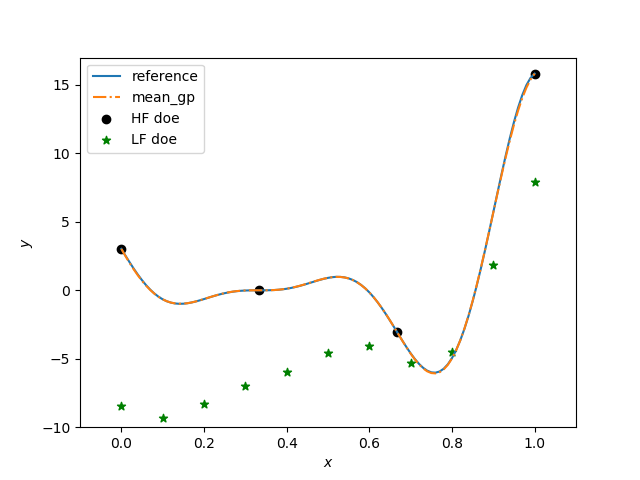

Multi-Fidelity Kriging (MFK)
================================

MFK is a multi-fidelity modeling method which uses an autoregressive model of order 1 (AR1).

.. math ::
        y_\text{high}({\bf x})=\rho \cdot y_\text{low}({\bf x}) + \delta({\bf x})

where :math:`\rho(x)` 
is a scaling/correlation factor (constant, linear or qudratic) and :math:`\delta(\cdot)` is a discrepancy function.

The additive AR1 formulation was first introduced by Kennedy and O'Hagan [1].
The implementation here follows the one proposed by Le Gratiet [2]. It offers the advantage of being recursive, easily extended to :math:`n` levels of fidelity and offers better scaling for high numbers of samples.

References
----------
.. [1] Kennedy, M.C. and O'Hagan, A., Bayesian calibration of computer models. Journal of the Royal Statistical Society. 2001
.. [2] Le Gratiet, L., Multi-fidelity Gaussian process regression for computer experiments. PhD Thesis. 2013

Usage
-----

.. code-block:: python

  import numpy as np
  from smt.extensions import MFK
  # Define the 
  def LF_function(x):
      import numpy as np
      return 0.5*((x*6-2)**2)*np.sin((x*6-2)*2)+(x-0.5)*10. - 5
  
  def HF_function(x):
      import numpy as np
      return ((x*6-2)**2)*np.sin((x*6-2)*2)
  
  
  # Problem set up
  ndim=1
  Xt_e = np.linspace(0,1, 4, endpoint = True).reshape(-1,ndim)
  Xt_c = np.linspace(0,1, 11, endpoint = True).reshape(-1,ndim)
  
  nt_exp = Xt_e.shape[0]
  nt_cheap = Xt_c.shape[0]
  
  # Evaluate the HF and LF functions
  yt_e = HF_function(Xt_e)
  yt_c = LF_function(Xt_c)
  
  
  
  sm = MFK(theta0=np.array(Xt_e.shape[1]*[1.]))
  
  #low-fidelity dataset names being integers from 0 to level-1
  sm.set_training_values(Xt_c, yt_c, name = 0) 
  #high-fidelity dataset without name
  sm.set_training_values(Xt_e, yt_e) 
  
  # train the model
  sm.train()
  
  x = np.linspace(0, 1, 101, endpoint = True).reshape(-1,1)
  
  # query the outputs
  y = sm.predict_values(x)
  MSE = sm.predict_variances(x)
  der = sm.predict_derivatives(x, kx=0)
  
  plt.figure()
   
  plt.plot(x, HF_function(x), label ='reference')
  plt.plot(x, y, linestyle = '-.' , label ='mean_gp')
  plt.scatter(Xt_e, yt_e, marker = 'o' , color ='k', label ='HF doe')
  plt.scatter(Xt_c, yt_c, marker = '*' , color ='g', label ='LF doe')
   
  plt.legend(loc=0)
  plt.ylim(-10,17)
  plt.xlim(-0.1,1.1)
  plt.xlabel(r'$x$')
  plt.ylabel(r'$y$')
  
  plt.show()
  
::

  ___________________________________________________________________________
     
                                      MFK
  ___________________________________________________________________________
     
   Problem size
     
        # training points.        : 4
     
  ___________________________________________________________________________
     
   Training
     
     Training ...
     Training - done. Time (sec):  0.0128019
  ___________________________________________________________________________
     
   Evaluation
     
        # eval points. : 101
     
     Predicting ...
     Predicting - done. Time (sec):  0.0006289
     
     Prediction time/pt. (sec) :  0.0000062
     
  ___________________________________________________________________________
     
   Evaluation
     
        # eval points. : 101
     
     Predicting ...
     Predicting - done. Time (sec):  0.0005281
     
     Prediction time/pt. (sec) :  0.0000052
     
  

Options
-------

.. list-table:: List of options
  :header-rows: 1
  :widths: 15, 10, 20, 20, 30
  :stub-columns: 0

  *  -  Option
     -  Default
     -  Acceptable values
     -  Acceptable types
     -  Description
  *  -  rho_regr
     -  constant
     -  ['constant', 'linear', 'quadratic']
     -  ['function']
     -  regr. term
  *  -  theta0
     -  None
     -  None
     -  ['list', 'ndarray']
     -  Initial hyperparameters
  *  -  data_dir
     -  None
     -  None
     -  ['str']
     -  Directory for loading / saving cached data; None means do not save or load
  *  -  print_solver
     -  True
     -  None
     -  ['bool']
     -  Whether to print solver information
  *  -  eval_noise
     -  False
     -  [True, False]
     -  ['bool']
     -  noise evaluation flag
  *  -  print_problem
     -  True
     -  None
     -  ['bool']
     -  Whether to print problem information
  *  -  print_global
     -  True
     -  None
     -  ['bool']
     -  Global print toggle. If False, all printing is suppressed
  *  -  optim_var
     -  False
     -  [True, False]
     -  ['bool']
     -  Turning this option to True, forces variance to zero at HF samples 
  *  -  poly
     -  constant
     -  ['constant', 'linear', 'quadratic']
     -  ['function']
     -  regr. term
  *  -  corr
     -  squar_exp
     -  ['abs_exp', 'squar_exp']
     -  ['function']
     -  type of corr. func.
  *  -  noise0
     -  1e-06
     -  None
     -  ['float']
     -  Initial noise hyperparameter
  *  -  print_training
     -  True
     -  None
     -  ['bool']
     -  Whether to print training information
  *  -  print_prediction
     -  True
     -  None
     -  ['bool']
     -  Whether to print prediction information
