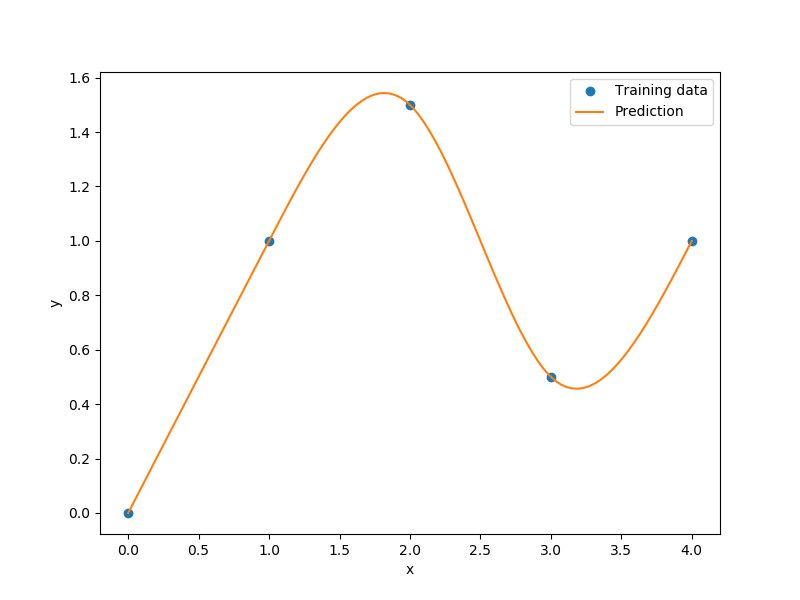

Regularized minimal-energy tensor-product splines
=================================================

Regularized minimal-energy tensor-product splines (RMTS) is a type of surrogate model for
low-dimensional problems with large datasets and where fast prediction is desired.
The underlying mathematical functions are tensor-product splines,
which limits RMTS to up to 4-D problems, or 5-D problems in certain cases.
On the other hand, tensor-product splines enable a very fast prediction time
that does not increase with the number of training points.
Unlike other methods like Kriging and radial basis functions,
RMTS is not susceptible to numerical issues when there is a large number of training points
or when there are points that are too close together.

The prediction equation for RMTS is

.. math ::
  y = \mathbf{F}(\mathbf{x}) \mathbf{w} ,

where
:math:`\mathbf{x} \in \mathbb{R}^{nx}` is the prediction input vector,
:math:`y \in \mathbb{R}` is the prediction output,
:math:`\mathbf{w} \in \mathbb{R}^{nw}` is the vector of spline coefficients,
and
:math:`\mathbf{F}(\mathbf{x}) \in \mathbb{R}^{nw}` is the vector mapping the spline coefficients to the prediction output.

RMTS computes the coefficients of the splines, :math:`\mathbf{w}`, by solving an energy minimization problem
subject to the conditions that the splines pass through the training points.
This is formulated as an unconstrained optimization problem
where the objective function consists of a term containing the second derivatives of the splines,
another term representing the approximation error for the training points,
and another term for regularization:

.. math ::

  \begin{array}{r l}
    \underset{\mathbf{w}}{\min} & \frac{1}{2} \mathbf{w}^T \mathbf{H} \mathbf{w}
    + \frac{1}{2} \beta \mathbf{w}^T \mathbf{w}
    \\
    &
    + \frac{1}{2} \frac{1}{\alpha}
    \sum_i^{nt} \left[ \mathbf{F}(\mathbf{xt}_i) \mathbf{w} - yt_i \right] ^ 2
  \end{array} ,

where
:math:`\mathbf{xt}_i \in \mathbb{R}^{nx}` is the input vector for the :math:`i` th training point,
:math:`yt_i \in \mathbb{R}` is the output value for the :math:`i` th training point,
:math:`\mathbf{H} \in \mathbb{R}^{nw \times nw}` is the matrix containing the second derivatives,
:math:`\mathbf{F}(\mathbf{xt}_i) \in \mathbb{R}^{nw}` is the vector mapping the spline coefficients to the :math:`i` th training output.
and :math:`\alpha` and :math:`\beta` are regularization coefficients.

In problems with a large number of training points relative to the number of spline coefficients,
the energy minimization term is not necessary;
this term can be zero-ed by setting the reg_cons option to zero.
In problems with a small dataset, the energy minimization is necessary.
When the true function has high curvature, the energy minimization can be counterproductive
in the regions of high curvature.
This can be addressed by increasing the quadratic approximation term to one of higher order,
and using Newton's method to solve the nonlinear system that results.
The nonlinear formulation is given by

.. math::

  \begin{array}{r l}
    \underset{\mathbf{w}}{\min} & \frac{1}{2} \mathbf{w}^T \mathbf{H} \mathbf{w}
    + \frac{1}{2} \beta \mathbf{w}^T \mathbf{w}
    \\
    &
    + \frac{1}{2} \frac{1}{\alpha}
    \sum_i^{nt} \left[ \mathbf{F}(\mathbf{xt}_i) \mathbf{w} - \mathbf{yt}_i \right] ^ p
  \end{array}
  ,

where :math:`p` is the order given by the approx_order option.
The number of Newton iterations can be specified via the :code:`nln_max_iter` option.

RMTS is implemented in SMT with two choices of splines:

1. B-splines (RMTB): RMTB uses B-splines with a uniform knot vector in each dimension.
The number of B-spline control points and the B-spline order in each dimension are options
that trade off efficiency and precision of the interpolant.

2. Cubic Hermite splines (RMTC): RMTC divides the domain into tensor-product cubic elements.
For adjacent elements, the values and derivatives are continuous.
The number of elements in each dimension is an option that trades off efficiency and precision.

In general, RMTB is the better choice when training time is the most important,
while RMTC is the better choice when accuracy of the interpolant is the most important.

Usage (RMTB)
------------

.. code-block:: python

  import numpy as np
  import matplotlib.pyplot as plt
  
  from smt.methods import RMTB
  
  xt = np.array([0., 1., 2., 3., 4.])
  yt = np.array([0., 1., 1.5, 0.5, 1.0])
  
  xlimits = np.array([[0., 4.]])
  
  sm = RMTB(xlimits=xlimits, order=4, num_ctrl_pts=20, reg_dv=1e-15, reg_cons=1e-15)
  sm.set_training_values(xt, yt)
  sm.train()
  
  num = 100
  x = np.linspace(0., 4., num)
  y = sm.predict_values(x)
  
  plt.plot(xt, yt, 'o')
  plt.plot(x, y)
  plt.xlabel('x')
  plt.ylabel('y')
  plt.legend(['Training data', 'Prediction'])
  plt.show()
  
::

  ___________________________________________________________________________
     
                                     RMTB
  ___________________________________________________________________________
     
   Problem size
     
        # training points.        : 5
     
  ___________________________________________________________________________
     
   Training
     
     Training ...
        Pre-computing matrices ...
           Computing dof2coeff ...
           Computing dof2coeff - done. Time (sec):  0.0000029
           Initializing Hessian ...
           Initializing Hessian - done. Time (sec):  0.0007269
           Computing energy terms ...
           Computing energy terms - done. Time (sec):  0.0018511
           Computing approximation terms ...
           Computing approximation terms - done. Time (sec):  0.0006781
        Pre-computing matrices - done. Time (sec):  0.0034101
        Solving for degrees of freedom ...
           Solving initial linear problem (n=20) ...
              Assembling linear system ...
              Assembling linear system - done. Time (sec):  0.0007951
              Initializing linear solver ...
              Initializing linear solver - done. Time (sec):  0.0000410
              Solving linear system (col. 0) ...
                 Running cg Krylov solver (20 x 20 mtx) ...
                 Running cg Krylov solver (20 x 20 mtx) - done. Time (sec):  0.0036678
              Solving linear system (col. 0) - done. Time (sec):  0.0037150
           Solving initial linear problem (n=20) - done. Time (sec):  0.0046220
           Solving nonlinear problem (col. 0) ...
              Nonlinear (itn, iy, grad. norm, func.) :   0   0 2.645720108e-15 1.135812944e-15
                 Assembling linear system ...
                 Assembling linear system - done. Time (sec):  0.0013399
                 Initializing linear solver ...
                 Initializing linear solver - done. Time (sec):  0.0000231
                 Solving linear system ...
                 Solving linear system - done. Time (sec):  0.0090251
                 Performing line search ...
                 Performing line search - done. Time (sec):  0.0010900
              Nonlinear (itn, iy, grad. norm, func.) :   1   0 2.715444789e-15 1.135810436e-15
                 Assembling linear system ...
                 Assembling linear system - done. Time (sec):  0.0012698
                 Initializing linear solver ...
                 Initializing linear solver - done. Time (sec):  0.0000248
                 Solving linear system ...
                 Solving linear system - done. Time (sec):  0.0045910
                 Performing line search ...
                 Performing line search - done. Time (sec):  0.0001349
              Nonlinear (itn, iy, grad. norm, func.) :   2   0 9.147277374e-14 1.125019496e-15
                 Assembling linear system ...
                 Assembling linear system - done. Time (sec):  0.0012660
                 Initializing linear solver ...
                 Initializing linear solver - done. Time (sec):  0.0000260
                 Solving linear system ...
                 Solving linear system - done. Time (sec):  0.0043259
                 Performing line search ...
                 Performing line search - done. Time (sec):  0.0001400
              Nonlinear (itn, iy, grad. norm, func.) :   3   0 7.664218198e-14 1.121922545e-15
                 Assembling linear system ...
                 Assembling linear system - done. Time (sec):  0.0012641
                 Initializing linear solver ...
                 Initializing linear solver - done. Time (sec):  0.0000250
                 Solving linear system ...
                 Solving linear system - done. Time (sec):  0.0041721
                 Performing line search ...
                 Performing line search - done. Time (sec):  0.0000808
              Nonlinear (itn, iy, grad. norm, func.) :   4   0 2.239826012e-14 1.119834510e-15
                 Assembling linear system ...
                 Assembling linear system - done. Time (sec):  0.0012610
                 Initializing linear solver ...
                 Initializing linear solver - done. Time (sec):  0.0000260
                 Solving linear system ...
                 Solving linear system - done. Time (sec):  0.0040731
                 Performing line search ...
                 Performing line search - done. Time (sec):  0.0000811
              Nonlinear (itn, iy, grad. norm, func.) :   5   0 6.282080603e-15 1.119630128e-15
           Solving nonlinear problem (col. 0) - done. Time (sec):  0.0383391
        Solving for degrees of freedom - done. Time (sec):  0.0430679
     Training - done. Time (sec):  0.0473261
  ___________________________________________________________________________
     
   Evaluation
     
        # eval points. : 100
     
     Predicting ...
     Predicting - done. Time (sec):  0.0005312
     
     Prediction time/pt. (sec) :  0.0000053
     
  

Usage (RMTC)
------------

.. code-block:: python

  import numpy as np
  import matplotlib.pyplot as plt
  
  from smt.methods import RMTC
  
  xt = np.array([0., 1., 2., 3., 4.])
  yt = np.array([0., 1., 1.5, 0.5, 1.0])
  
  xlimits = np.array([[0., 4.]])
  
  sm = RMTC(xlimits=xlimits, num_elements=20, reg_dv=1e-15, reg_cons=1e-15)
  sm.set_training_values(xt, yt)
  sm.train()
  
  num = 100
  x = np.linspace(0., 4., num)
  y = sm.predict_values(x)
  
  plt.plot(xt, yt, 'o')
  plt.plot(x, y)
  plt.xlabel('x')
  plt.ylabel('y')
  plt.legend(['Training data', 'Prediction'])
  plt.show()
  
::

  ___________________________________________________________________________
     
                                     RMTC
  ___________________________________________________________________________
     
   Problem size
     
        # training points.        : 5
     
  ___________________________________________________________________________
     
   Training
     
     Training ...
        Pre-computing matrices ...
           Computing dof2coeff ...
           Computing dof2coeff - done. Time (sec):  0.0012100
           Initializing Hessian ...
           Initializing Hessian - done. Time (sec):  0.0004580
           Computing energy terms ...
           Computing energy terms - done. Time (sec):  0.0018320
           Computing approximation terms ...
           Computing approximation terms - done. Time (sec):  0.0008409
        Pre-computing matrices - done. Time (sec):  0.0044720
        Solving for degrees of freedom ...
           Solving initial linear problem (n=42) ...
              Assembling linear system ...
              Assembling linear system - done. Time (sec):  0.0007541
              Initializing linear solver ...
              Initializing linear solver - done. Time (sec):  0.0000250
              Solving linear system (col. 0) ...
                 Running cg Krylov solver (42 x 42 mtx) ...
                 Running cg Krylov solver (42 x 42 mtx) - done. Time (sec):  0.0043011
              Solving linear system (col. 0) - done. Time (sec):  0.0043480
           Solving initial linear problem (n=42) - done. Time (sec):  0.0051992
           Solving nonlinear problem (col. 0) ...
              Nonlinear (itn, iy, grad. norm, func.) :   0   0 3.799115482e-15 1.133573309e-15
                 Assembling linear system ...
                 Assembling linear system - done. Time (sec):  0.0012841
                 Initializing linear solver ...
                 Initializing linear solver - done. Time (sec):  0.0000229
                 Solving linear system ...
                 Solving linear system - done. Time (sec):  0.0091510
                 Performing line search ...
                 Performing line search - done. Time (sec):  0.0010450
              Nonlinear (itn, iy, grad. norm, func.) :   1   0 3.443643778e-15 1.133567021e-15
                 Assembling linear system ...
                 Assembling linear system - done. Time (sec):  0.0012789
                 Initializing linear solver ...
                 Initializing linear solver - done. Time (sec):  0.0000260
                 Solving linear system ...
                 Solving linear system - done. Time (sec):  0.0084932
                 Performing line search ...
                 Performing line search - done. Time (sec):  0.0000751
              Nonlinear (itn, iy, grad. norm, func.) :   2   0 1.760867582e-14 1.117593275e-15
                 Assembling linear system ...
                 Assembling linear system - done. Time (sec):  0.0012791
                 Initializing linear solver ...
                 Initializing linear solver - done. Time (sec):  0.0000260
                 Solving linear system ...
                 Solving linear system - done. Time (sec):  0.0073011
                 Performing line search ...
                 Performing line search - done. Time (sec):  0.0000820
              Nonlinear (itn, iy, grad. norm, func.) :   3   0 4.675212285e-15 1.117525470e-15
                 Assembling linear system ...
                 Assembling linear system - done. Time (sec):  0.0012760
                 Initializing linear solver ...
                 Initializing linear solver - done. Time (sec):  0.0000250
                 Solving linear system ...
                 Solving linear system - done. Time (sec):  0.0071940
                 Performing line search ...
                 Performing line search - done. Time (sec):  0.0000830
              Nonlinear (itn, iy, grad. norm, func.) :   4   0 9.728741606e-16 1.117516322e-15
                 Assembling linear system ...
                 Assembling linear system - done. Time (sec):  0.0012670
                 Initializing linear solver ...
                 Initializing linear solver - done. Time (sec):  0.0000260
                 Solving linear system ...
                 Solving linear system - done. Time (sec):  0.0068948
                 Performing line search ...
                 Performing line search - done. Time (sec):  0.0000880
              Nonlinear (itn, iy, grad. norm, func.) :   5   0 9.505451733e-17 1.117515709e-15
           Solving nonlinear problem (col. 0) - done. Time (sec):  0.0510201
        Solving for degrees of freedom - done. Time (sec):  0.0563109
     Training - done. Time (sec):  0.0614669
  ___________________________________________________________________________
     
   Evaluation
     
        # eval points. : 100
     
     Predicting ...
     Predicting - done. Time (sec):  0.0005112
     
     Prediction time/pt. (sec) :  0.0000051
     
  

Options (RMTB)
--------------

.. list-table:: List of options
  :header-rows: 1
  :widths: 15, 10, 20, 20, 30
  :stub-columns: 0

  *  -  Option
     -  Default
     -  Acceptable values
     -  Acceptable types
     -  Description
  *  -  min_energy
     -  True
     -  None
     -  ['bool']
     -  Whether to perform energy minimization
  *  -  reg_dv
     -  1e-10
     -  None
     -  ['Integral', 'float']
     -  Regularization coeff. for system degrees of freedom. This ensures there is always a unique solution
  *  -  mtx_free
     -  False
     -  None
     -  ['bool']
     -  Whether to solve the linear system in a matrix-free way
  *  -  print_prediction
     -  True
     -  None
     -  ['bool']
     -  Whether to print prediction information
  *  -  num_ctrl_pts
     -  15
     -  None
     -  ['Integral', 'tuple', 'list', 'ndarray']
     -  # B-spline control points in each dimension - length [nx]
  *  -  data_dir
     -  None
     -  [None]
     -  ['str']
     -  Directory for loading / saving cached data; None means do not save or load
  *  -  print_solver
     -  True
     -  None
     -  ['bool']
     -  Whether to print solver information
  *  -  nln_max_iter
     -  5
     -  None
     -  ['Integral']
     -  maximum number of nonlinear iterations
  *  -  line_search
     -  backtracking
     -  ['backtracking', 'bracketed', 'quadratic', 'cubic', 'null']
     -  ['LineSearch']
     -  Line search algorithm
  *  -  extrapolate
     -  False
     -  None
     -  ['bool']
     -  Whether to perform linear extrapolation for external evaluation points
  *  -  save_energy_terms
     -  False
     -  None
     -  ['bool']
     -  Whether to cache energy terms in the data_dir directory
  *  -  print_problem
     -  True
     -  None
     -  ['bool']
     -  Whether to print problem information
  *  -  print_global
     -  True
     -  None
     -  ['bool']
     -  Global print toggle. If False, all printing is suppressed
  *  -  approx_order
     -  4
     -  None
     -  ['Integral']
     -  Exponent in the approximation term
  *  -  reg_cons
     -  0.0001
     -  None
     -  ['Integral', 'float']
     -  Negative of the regularization coeff. of the Lagrange mult. block The weight of the energy terms (and reg_dv) relative to the approx terms
  *  -  smoothness
     -  1.0
     -  None
     -  ['Integral', 'float', 'tuple', 'list', 'ndarray']
     -  Smoothness parameter in each dimension - length nx. None implies uniform
  *  -  xlimits
     -  None
     -  None
     -  ['ndarray']
     -  Lower/upper bounds in each dimension - ndarray [nx, 2]
  *  -  solver
     -  krylov
     -  ['krylov-dense', 'dense-lu', 'dense-chol', 'lu', 'ilu', 'krylov', 'krylov-lu', 'krylov-mg', 'gs', 'jacobi', 'mg', 'null']
     -  ['LinearSolver']
     -  Linear solver
  *  -  max_print_depth
     -  5
     -  None
     -  ['Integral']
     -  Maximum depth (level of nesting) to print operation descriptions and times
  *  -  grad_weight
     -  0.5
     -  None
     -  ['Integral', 'float']
     -  Weight on gradient training data
  *  -  print_training
     -  True
     -  None
     -  ['bool']
     -  Whether to print training information
  *  -  order
     -  3
     -  None
     -  ['Integral', 'tuple', 'list', 'ndarray']
     -  B-spline order in each dimension - length [nx]

Options (RMTC)
--------------

.. list-table:: List of options
  :header-rows: 1
  :widths: 15, 10, 20, 20, 30
  :stub-columns: 0

  *  -  Option
     -  Default
     -  Acceptable values
     -  Acceptable types
     -  Description
  *  -  num_elements
     -  4
     -  None
     -  ['Integral', 'list', 'ndarray']
     -  # elements in each dimension - ndarray [nx]
  *  -  save_energy_terms
     -  False
     -  None
     -  ['bool']
     -  Whether to cache energy terms in the data_dir directory
  *  -  data_dir
     -  None
     -  [None]
     -  ['str']
     -  Directory for loading / saving cached data; None means do not save or load
  *  -  print_solver
     -  True
     -  None
     -  ['bool']
     -  Whether to print solver information
  *  -  solver
     -  krylov
     -  ['krylov-dense', 'dense-lu', 'dense-chol', 'lu', 'ilu', 'krylov', 'krylov-lu', 'krylov-mg', 'gs', 'jacobi', 'mg', 'null']
     -  ['LinearSolver']
     -  Linear solver
  *  -  print_problem
     -  True
     -  None
     -  ['bool']
     -  Whether to print problem information
  *  -  print_global
     -  True
     -  None
     -  ['bool']
     -  Global print toggle. If False, all printing is suppressed
  *  -  nln_max_iter
     -  5
     -  None
     -  ['Integral']
     -  maximum number of nonlinear iterations
  *  -  line_search
     -  backtracking
     -  ['backtracking', 'bracketed', 'quadratic', 'cubic', 'null']
     -  ['LineSearch']
     -  Line search algorithm
  *  -  max_print_depth
     -  5
     -  None
     -  ['Integral']
     -  Maximum depth (level of nesting) to print operation descriptions and times
  *  -  reg_dv
     -  1e-10
     -  None
     -  ['Integral', 'float']
     -  Regularization coeff. for system degrees of freedom. This ensures there is always a unique solution
  *  -  extrapolate
     -  False
     -  None
     -  ['bool']
     -  Whether to perform linear extrapolation for external evaluation points
  *  -  approx_order
     -  4
     -  None
     -  ['Integral']
     -  Exponent in the approximation term
  *  -  reg_cons
     -  0.0001
     -  None
     -  ['Integral', 'float']
     -  Negative of the regularization coeff. of the Lagrange mult. block The weight of the energy terms (and reg_dv) relative to the approx terms
  *  -  min_energy
     -  True
     -  None
     -  ['bool']
     -  Whether to perform energy minimization
  *  -  grad_weight
     -  0.5
     -  None
     -  ['Integral', 'float']
     -  Weight on gradient training data
  *  -  mtx_free
     -  False
     -  None
     -  ['bool']
     -  Whether to solve the linear system in a matrix-free way
  *  -  print_prediction
     -  True
     -  None
     -  ['bool']
     -  Whether to print prediction information
  *  -  print_training
     -  True
     -  None
     -  ['bool']
     -  Whether to print training information
  *  -  smoothness
     -  1.0
     -  None
     -  ['Integral', 'float', 'tuple', 'list', 'ndarray']
     -  Smoothness parameter in each dimension - length nx. None implies uniform
  *  -  xlimits
     -  None
     -  None
     -  ['ndarray']
     -  Lower/upper bounds in each dimension - ndarray [nx, 2]
