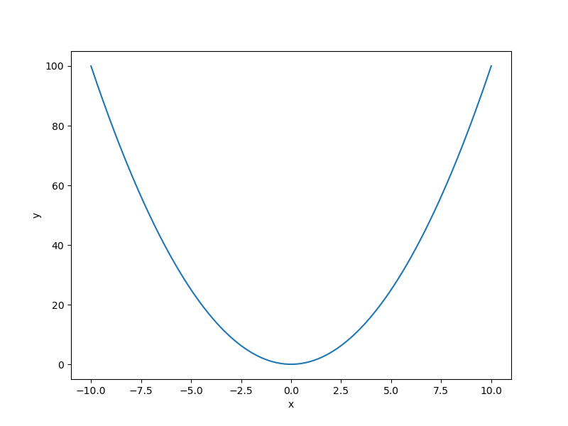

Benchmarking problems
=====================

SMT contains a library of analytical and engineering problems to be used for benchmarking purposes.
These are listed below.

.. toctree::
   :maxdepth: 1
   :titlesonly:

   problems/sphere
   problems/branin
   problems/lp_norm
   problems/rosenbrock
   problems/tensorproduct
   problems/cantileverbeam
   problems/mixedcantileverbeam
   problems/neuralnetwork
   problems/robotarm
   problems/torsionvibration
   problems/waterflow
   problems/weldedbeam
   problems/wingweight

Usage
-----

.. code-block:: python

  import numpy as np
  import matplotlib.pyplot as plt
  
  from smt.problems import Sphere
  
  ndim = 2
  problem = Sphere(ndim=ndim)
  
  num = 100
  x = np.ones((num, ndim))
  x[:, 0] = np.linspace(-10, 10.0, num)
  x[:, 1] = 0.0
  y = problem(x)
  
  yd = np.empty((num, ndim))
  for i in range(ndim):
      yd[:, i] = problem(x, kx=i).flatten()
  
  print(y.shape)
  print(yd.shape)
  
  plt.plot(x[:, 0], y[:, 0])
  plt.xlabel("x")
  plt.ylabel("y")
  plt.show()
  
::

  (100, 1)
  (100, 2)
  

Problem class API
-----------------

.. autoclass:: smt.problems.problem.Problem

  .. automethod:: smt.problems.problem.Problem.__init__

  .. automethod:: smt.problems.problem.Problem.__call__
