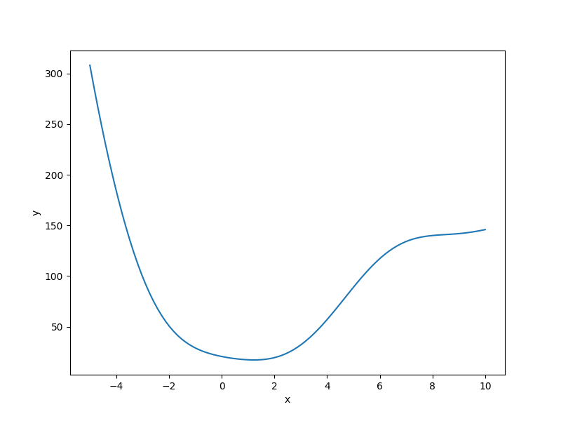

Branin function
===================

.. math ::
  f(x) = (x_2 - \frac{5.1}{4\pi^2}x_1^{2} + \frac{5}{\pi}x_1 - 6)^2 + 10(1-\frac{1}{8\pi})\cos(x_1) + 10,

where
:math:`x = (x_1, x_2)`
with
:math:`-5\leq x_1 \leq 10, 0 \leq x_2 \leq 15`

The Branin function has three global minima:

:math:`f(x^*) = 0.397887`,
at
:math:`x^* = (-\pi, 12.275), (\pi, 2.275)` and :math:`(9.42478, 2.475)`

Usage
-----

.. code-block:: python

  import numpy as np
  import matplotlib.pyplot as plt
  
  from smt.problems import Branin
  
  ndim = 2
  problem = Branin(ndim=ndim)
  
  num = 100
  x = np.ones((num, ndim))
  x[:, 0] = np.linspace(-5.0, 10.0, num)
  x[:, 1] = np.linspace(0.0, 15.0, num)
  y = problem(x)
  
  yd = np.empty((num, ndim))
  for i in range(ndim):
      yd[:, i] = problem(x, kx=i).flatten()
  
  print(y.shape)
  print(yd.shape)
  
  plt.plot(x[:, 0], y[:, 0])
  plt.xlabel("x")
  plt.ylabel("y")
  plt.show()
  
::

  (100, 1)
  (100, 2)
  

Options
-------

.. list-table:: List of options
  :header-rows: 1
  :widths: 15, 10, 20, 20, 30
  :stub-columns: 0

  *  -  Option
     -  Default
     -  Acceptable values
     -  Acceptable types
     -  Description
  *  -  ndim
     -  2
     -  [2]
     -  ['int']
     -  
  *  -  return_complex
     -  False
     -  None
     -  ['bool']
     -  
  *  -  name
     -  Branin
     -  None
     -  ['str']
     -  
