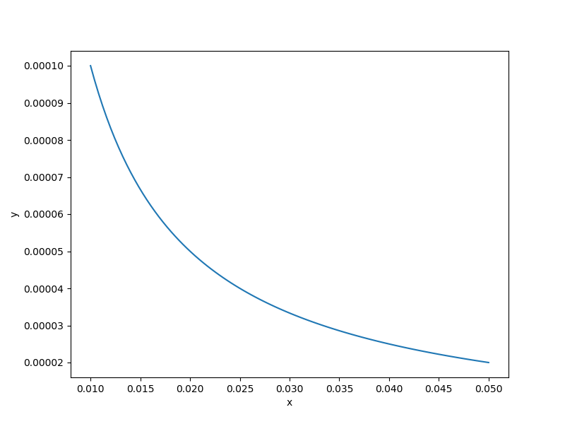

Cantilever beam function
========================

.. math ::
  \frac{50}{600}\sum\limits_{i=1}^{17}\left[\frac{12}{b_ih_i^3}\left(\left(\sum\limits_{j=i}^{17}l_j\right)^3-\left(\sum\limits_{j=i+1}^{17}l_j\right)^3\right)\right],

:math:`b_i\in [0.01,0.05], \quad h_i\in[0.3,0.65], \quad l_i\in[0.5,1].`

Usage
-----

.. code-block:: python

  import numpy as np
  import matplotlib.pyplot as plt
  
  from smt.problems import CantileverBeam
  
  ndim = 3
  problem = CantileverBeam(ndim=ndim)
  
  num = 100
  x = np.ones((num, ndim))
  x[:, 0] = np.linspace(0.01, 0.05, num)
  x[:, 1] = 0.5
  x[:, 2] = 0.5
  y = problem(x)
  
  yd = np.empty((num, ndim))
  for i in range(ndim):
      yd[:, i] = problem(x, kx=i).flatten()
  
  print(y.shape)
  print(yd.shape)
  
  plt.plot(x[:, 0], y[:, 0])
  plt.xlabel("x")
  plt.ylabel("y")
  plt.show()
  
::

  (100, 1)
  (100, 3)
  

Options
-------

.. list-table:: List of options
  :header-rows: 1
  :widths: 15, 10, 20, 20, 30
  :stub-columns: 0

  *  -  Option
     -  Default
     -  Acceptable values
     -  Acceptable types
     -  Description
  *  -  ndim
     -  3
     -  None
     -  ['int']
     -  
  *  -  return_complex
     -  False
     -  None
     -  ['bool']
     -  
  *  -  name
     -  CantileverBeam
     -  None
     -  ['str']
     -  
  *  -  P
     -  50000.0
     -  None
     -  ['int', 'float']
     -  Tip load (50 kN)
  *  -  E
     -  200000000000.0
     -  None
     -  ['int', 'float']
     -  Modulus of elast. (200 GPa)
