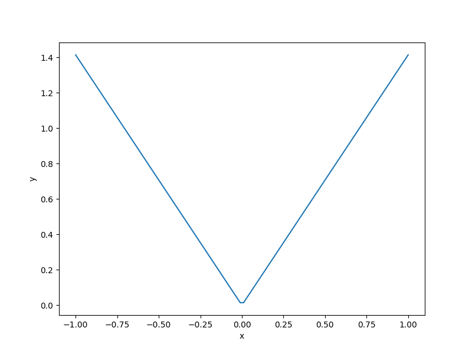

Lp norm function
===================

.. math ::
  f(x) = \left \| x \right \|_p = \sqrt[p]{\sum\limits_{i}^{nx}\left | x_i \right |^p},

Usage
-----

.. code-block:: python

  import numpy as np
  import matplotlib.pyplot as plt
  
  from smt.problems import LpNorm
  
  ndim = 2
  problem = LpNorm(ndim=ndim, order=2)
  
  num = 100
  x = np.ones((num, ndim))
  x[:, 0] = np.linspace(-1.0, 1.0, num)
  x[:, 1] = np.linspace(-1.0, 1.0, num)
  y = problem(x)
  
  yd = np.empty((num, ndim))
  for i in range(ndim):
      yd[:, i] = problem(x, kx=i).flatten()
  
  print(y.shape)
  print(yd.shape)
  
  plt.plot(x[:, 0], y[:, 0])
  plt.xlabel("x")
  plt.ylabel("y")
  plt.show()
  
::

  (100, 1)
  (100, 2)
  

Options
-------

.. list-table:: List of options
  :header-rows: 1
  :widths: 15, 10, 20, 20, 30
  :stub-columns: 0

  *  -  Option
     -  Default
     -  Acceptable values
     -  Acceptable types
     -  Description
  *  -  ndim
     -  1
     -  None
     -  ['int']
     -  
  *  -  return_complex
     -  False
     -  None
     -  ['bool']
     -  
  *  -  order
     -  2
     -  None
     -  ['int']
     -  
  *  -  name
     -  LpNorm
     -  None
     -  ['str']
     -  
