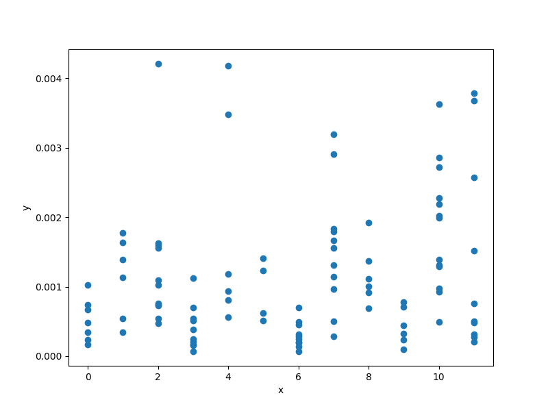

Mixed cantilever beam function
==============================

.. math ::
 \delta = f( \tilde{I}, L,S) = \frac{F}{3E} \frac{L^3}{S^2\tilde{I}},

:math:`L\in [10,20], \quad S\in[1,2], \quad \tilde{I} \in \{1,2,3,4,5,6,7,8,9,10,11,12\}.`

Usage
-----

.. code-block:: python

  import matplotlib.pyplot as plt
  from smt.problems import MixedCantileverBeam
  
  problem = MixedCantileverBeam()
  
  n_doe = 100
  xdoe = problem.sample(n_doe)
  y = problem(xdoe)
  
  plt.scatter(xdoe[:, 0], y)
  plt.xlabel("x")
  plt.ylabel("y")
  plt.show()
  

Options
-------

.. list-table:: List of options
  :header-rows: 1
  :widths: 15, 10, 20, 20, 30
  :stub-columns: 0

  *  -  Option
     -  Default
     -  Acceptable values
     -  Acceptable types
     -  Description
  *  -  ndim
     -  3
     -  None
     -  ['int']
     -  
  *  -  return_complex
     -  False
     -  None
     -  ['bool']
     -  
  *  -  name
     -  CantileverBeam
     -  None
     -  ['str']
     -  
  *  -  P
     -  50000.0
     -  None
     -  ['int', 'float']
     -  Tip load (50 kN)
  *  -  E
     -  200000000000.0
     -  None
     -  ['int', 'float']
     -  Modulus of elast. (200 GPa)
