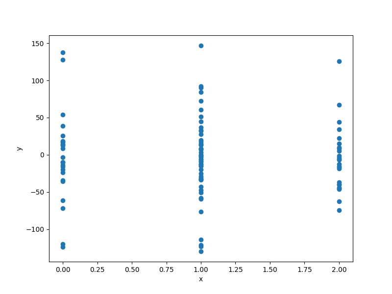

Multi-layer perceptron
======================

.. math ::
 y =  f_1(x_1,x_2,x_3,x_4,x_5) \ if \ x_0 == 1 \\
 y =  f_2(x_1,x_2,x_3,x_4,x_5,x_6) \ if \ x_0 == 2 \\
 y =  f_3(x_1,x_2,x_3,x_4,x_5,x_6,x_7) \ if \ x_0 == 3 \\

:math:`x_0 \in \{1,2,3\} , x_1 \in [-5,-2], x_2 \in [-5,-1], x_3 \in [8,16,32,64,128,256], x_4 \in \{ReLU,SeLU,ISRLU\}, x_{5,6,7} \in [0,5]  .`

Usage
-----

.. code-block:: python

  import matplotlib.pyplot as plt
  from smt.problems import HierarchicalNeuralNetwork
  
  problem = HierarchicalNeuralNetwork()
  
  n_doe = 100
  xdoe, x_is_acting = problem.design_space.sample_valid_x(
      n_doe
  )  # If acting information is needed
  # xdoe = problem.sample(n_doe)  # Also possible
  y = problem(xdoe)
  
  plt.scatter(xdoe[:, 0], y)
  plt.xlabel("x")
  plt.ylabel("y")
  plt.show()
  

Options
-------

.. list-table:: List of options
  :header-rows: 1
  :widths: 15, 10, 20, 20, 30
  :stub-columns: 0

  *  -  Option
     -  Default
     -  Acceptable values
     -  Acceptable types
     -  Description
  *  -  ndim
     -  3
     -  None
     -  ['int']
     -  
  *  -  return_complex
     -  False
     -  None
     -  ['bool']
     -  
  *  -  name
     -  CantileverBeam
     -  None
     -  ['str']
     -  
  *  -  P
     -  50000.0
     -  None
     -  ['int', 'float']
     -  Tip load (50 kN)
  *  -  E
     -  200000000000.0
     -  None
     -  ['int', 'float']
     -  Modulus of elast. (200 GPa)
