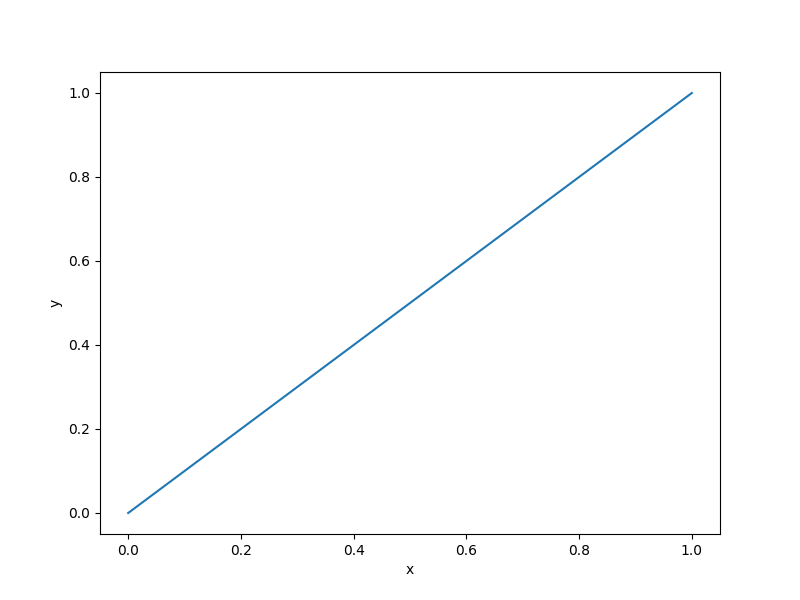

Robot arm function
==================

.. math ::
  \sqrt{\left(\sum\limits_{i=1}^4L_i\cos\left(\sum\limits_{j=1}^i\theta_j\right)\right)^2+\left(\sum\limits_{i=1}^4L_i\sin\left(\sum\limits_{j=1}^i\theta_j\right)
  \right)^2},\quad L_i \in [0,1] \quad \text{for}\quad i=1,\dotsc,4 \quad \text{and}\quad \theta_j \in [0,2\pi]\quad\text{for}\quad j=1,\dotsc,4.

Usage
-----

.. code-block:: python

  import numpy as np
  import matplotlib.pyplot as plt
  
  from smt.problems import RobotArm
  
  ndim = 2
  problem = RobotArm(ndim=ndim)
  
  num = 100
  x = np.ones((num, ndim))
  x[:, 0] = np.linspace(0.0, 1.0, num)
  x[:, 1] = np.pi
  y = problem(x)
  
  yd = np.empty((num, ndim))
  for i in range(ndim):
      yd[:, i] = problem(x, kx=i).flatten()
  
  print(y.shape)
  print(yd.shape)
  
  plt.plot(x[:, 0], y[:, 0])
  plt.xlabel("x")
  plt.ylabel("y")
  plt.show()
  
::

  (100, 1)
  (100, 2)
  

Options
-------

.. list-table:: List of options
  :header-rows: 1
  :widths: 15, 10, 20, 20, 30
  :stub-columns: 0

  *  -  Option
     -  Default
     -  Acceptable values
     -  Acceptable types
     -  Description
  *  -  ndim
     -  2
     -  None
     -  ['int']
     -  
  *  -  return_complex
     -  False
     -  None
     -  ['bool']
     -  
  *  -  name
     -  RobotArm
     -  None
     -  ['str']
     -  
