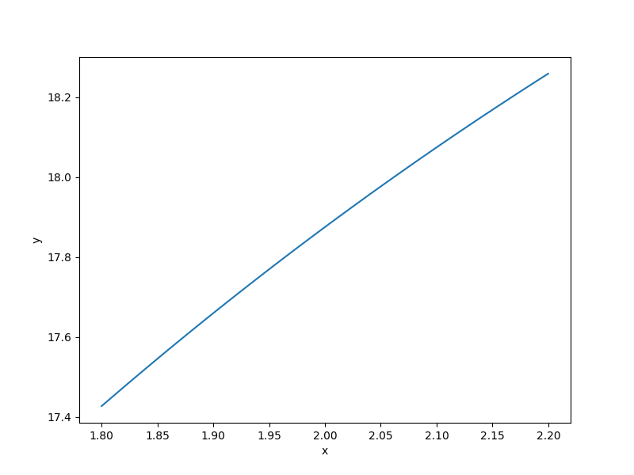

Torsion vibration function
==========================

.. math ::
  \frac{1}{2\pi}\sqrt{\frac{-b-\sqrt{b^2-4ac}}{2a}},

where
:math:`K_i=\frac{\pi G_id_i}{32L_i},\quad M_j=\frac{\rho_j \pi t_jD_j}{4g},\quad J_j=0.5M_j\frac{D_j}{2},\quad a = 1,\quad b=-\left(\frac{K_1+K2}{J_1}+\frac{K_2+K3}{J_2}\right),\quad c=\frac{K_1K_2+K_2K_3+K_3K_1}{J_1J_2},\quad \text{for}\quad d_1\in [1.8,2.2],\quad L_1\in[9,11],\quad G_1\in [105300000,128700000],`
:math:`d_2\in [1.638,2.002],\quad L_2\in[10.8,13.2],\quad G_2\in[5580000,6820000],\quad d_3\in[2.025,2.475],\quad L_3\in[7.2,8.8],\quad G_3\in[3510000,4290000],\quad D_1\in[10.8,13.2],\quad t_1\in[2.7,3.3],`
:math:`\rho_1\in[0.252,0.308], \quad D_2\in[12.6,15.4],\quad t_2\in[3.6,4.4],\quad\rho_1\in[0.09,0.11].`

Usage
-----

.. code-block:: python

  import numpy as np
  import matplotlib.pyplot as plt
  
  from smt.problems import TorsionVibration
  
  ndim = 15
  problem = TorsionVibration(ndim=ndim)
  
  num = 100
  x = np.ones((num, ndim))
  for i in range(ndim):
      x[:, i] = 0.5 * (problem.xlimits[i, 0] + problem.xlimits[i, 1])
  x[:, 0] = np.linspace(1.8, 2.2, num)
  y = problem(x)
  
  yd = np.empty((num, ndim))
  for i in range(ndim):
      yd[:, i] = problem(x, kx=i).flatten()
  
  print(y.shape)
  print(yd.shape)
  
  plt.plot(x[:, 0], y[:, 0])
  plt.xlabel("x")
  plt.ylabel("y")
  plt.show()
  
::

  (100, 1)
  (100, 15)
  

Options
-------

.. list-table:: List of options
  :header-rows: 1
  :widths: 15, 10, 20, 20, 30
  :stub-columns: 0

  *  -  Option
     -  Default
     -  Acceptable values
     -  Acceptable types
     -  Description
  *  -  ndim
     -  1
     -  None
     -  ['int']
     -  
  *  -  return_complex
     -  False
     -  None
     -  ['bool']
     -  
  *  -  name
     -  TorsionVibration
     -  None
     -  ['str']
     -  
  *  -  use_FD
     -  False
     -  None
     -  ['bool']
     -  
