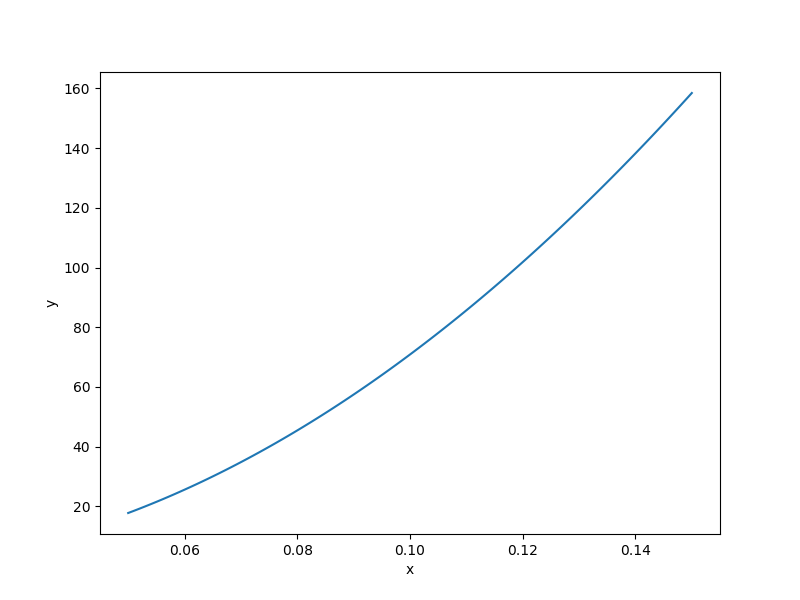

Water flow function
===================

.. math ::
  \frac{2\pi T_u\left(H_u-H_l\right)}{\ln\left(\frac{r}{r_w}\right)\left[1+\frac{2LT_u}{\ln\left(\frac{r}{r_w}\right)r_w^2K_w}+\frac{T_u}{T_l}\right]},

:math:`0.05\leq r_w\leq 0.15,\quad 100\leq r\leq 50000,\quad 63070\leq T_u\leq 115600,\quad 990 \leq H_u \leq 1110, \quad 63.1 \leq T_l \leq 116, \quad 700 \leq H_l \leq 820, \quad 1120 \leq L \leq 1680,\quad \text{and}\quad  9855 \leq K_w \leq 12045.`

Usage
-----

.. code-block:: python

  import numpy as np
  import matplotlib.pyplot as plt
  
  from smt.problems import WaterFlow
  
  ndim = 8
  problem = WaterFlow(ndim=ndim)
  
  num = 100
  x = np.ones((num, ndim))
  for i in range(ndim):
      x[:, i] = 0.5 * (problem.xlimits[i, 0] + problem.xlimits[i, 1])
  x[:, 0] = np.linspace(0.05, 0.15, num)
  y = problem(x)
  
  yd = np.empty((num, ndim))
  for i in range(ndim):
      yd[:, i] = problem(x, kx=i).flatten()
  
  print(y.shape)
  print(yd.shape)
  
  plt.plot(x[:, 0], y[:, 0])
  plt.xlabel("x")
  plt.ylabel("y")
  plt.show()
  
::

  (100, 1)
  (100, 8)
  

Options
-------

.. list-table:: List of options
  :header-rows: 1
  :widths: 15, 10, 20, 20, 30
  :stub-columns: 0

  *  -  Option
     -  Default
     -  Acceptable values
     -  Acceptable types
     -  Description
  *  -  ndim
     -  1
     -  None
     -  ['int']
     -  
  *  -  return_complex
     -  False
     -  None
     -  ['bool']
     -  
  *  -  name
     -  WaterFlow
     -  None
     -  ['str']
     -  
  *  -  use_FD
     -  False
     -  None
     -  ['bool']
     -  
