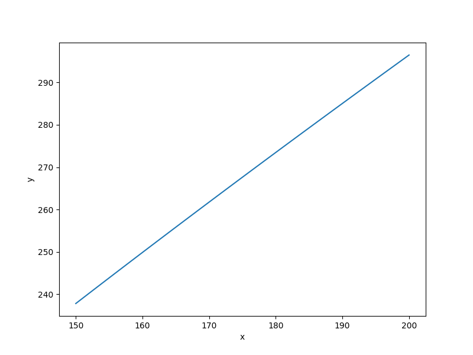

Wing weight function
====================

.. math ::
  0.036S_w^{0.758}W_{fw}^{0.0035}\left(\frac{A}{\cos^2\Lambda}\right)^{0.6}q^{0.006}\lambda^{0.04}\left(\frac{100tc}{\cos\Lambda}\right)^{-0.3}\left(N_zW_{dg}\right)^{0.49}+S_wW_p,

:math:`150\leq S_w\leq 200,\quad 220\leq W_{fw}\leq 300,\quad 6 \leq A \leq 10,\quad -10 \leq \Lambda \leq 10,\quad 16\leq q\leq 45,\quad 0.5\leq \lambda\leq 1,\quad 0.08 \leq t_c\leq 0.18,\quad 2.5\leq N_z\leq 6,\quad 1700\leq W_{dg}\leq 25000,\quad \text{and} \quad 0.025\leq W_p\leq 0.08.`

Usage
-----

.. code-block:: python

  import numpy as np
  import matplotlib.pyplot as plt
  
  from smt.problems import WingWeight
  
  ndim = 10
  problem = WingWeight(ndim=ndim)
  
  num = 100
  x = np.ones((num, ndim))
  for i in range(ndim):
      x[:, i] = 0.5 * (problem.xlimits[i, 0] + problem.xlimits[i, 1])
  x[:, 0] = np.linspace(150.0, 200.0, num)
  y = problem(x)
  
  yd = np.empty((num, ndim))
  for i in range(ndim):
      yd[:, i] = problem(x, kx=i).flatten()
  
  print(y.shape)
  print(yd.shape)
  
  plt.plot(x[:, 0], y[:, 0])
  plt.xlabel("x")
  plt.ylabel("y")
  plt.show()
  
::

  (100, 1)
  (100, 10)
  

Options
-------

.. list-table:: List of options
  :header-rows: 1
  :widths: 15, 10, 20, 20, 30
  :stub-columns: 0

  *  -  Option
     -  Default
     -  Acceptable values
     -  Acceptable types
     -  Description
  *  -  ndim
     -  1
     -  None
     -  ['int']
     -  
  *  -  return_complex
     -  False
     -  None
     -  ['bool']
     -  
  *  -  name
     -  WingWeight
     -  None
     -  ['str']
     -  
  *  -  use_FD
     -  False
     -  None
     -  ['bool']
     -  
