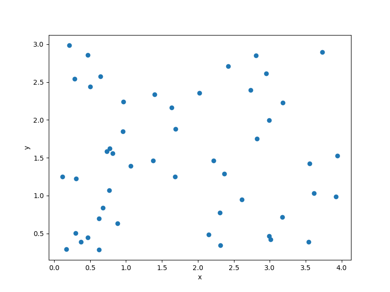

Sampling methods
================

SMT contains a library of sampling methods used to generate sets of points in the input space,
either for training or for prediction.
These are listed below.

.. toctree::
   :maxdepth: 1
   :titlesonly:

   sampling_methods/random
   sampling_methods/lhs
   sampling_methods/full_factorial
   sampling_methods/clustered

Usage
-----

.. code-block:: python

  import numpy as np
  import matplotlib.pyplot as plt

  from smt.sampling_methods import Random

  xlimits = np.array([
      [0., 4.],
      [0., 3.],
  ])
  sampling = Random(xlimits=xlimits)

  num = 50
  x = sampling(num)

  print(x.shape)

  plt.plot(x[:, 0], x[:, 1], 'o')
  plt.xlabel('x')
  plt.ylabel('y')
  plt.show()

::

  (50, 2)

Problem class API
-----------------

.. autoclass:: smt.sampling_methods.sampling_methods.SamplingMethod

  .. automethod:: smt.sampling_methods.sampling_methods.SamplingMethod.__init__

  .. automethod:: smt.sampling_methods.sampling_methods.SamplingMethod.__call__
