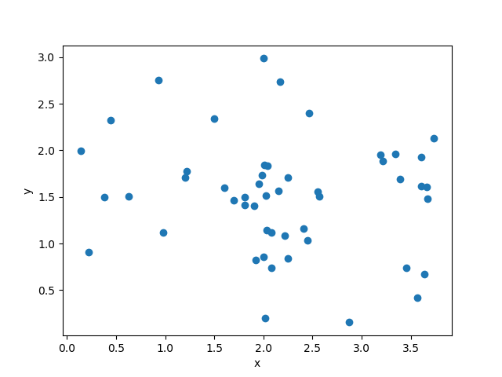

Clustered sampling
==================

Usage
-----

.. code-block:: python

  import numpy as np
  import matplotlib.pyplot as plt
  
  from smt.sampling import Clustered, Random
  
  xlimits = np.array([
      [0., 4.],
      [0., 3.],
  ])
  sampling = Clustered(kernel=Random(xlimits=xlimits))
  
  num = 50
  x = sampling(num)
  
  print(x.shape)
  
  plt.plot(x[:, 0], x[:, 1], 'o')
  plt.xlabel('x')
  plt.ylabel('y')
  plt.show()
  
::

  (50, 2)
  

Options
-------

.. list-table:: List of options
  :header-rows: 1
  :widths: 15, 10, 20, 20, 30
  :stub-columns: 0

  *  -  Option
     -  Default
     -  Acceptable values
     -  Acceptable types
     -  Description
  *  -  kernel
     -  None
     -  None
     -  ['Sampling']
     -  
  *  -  spacing
     -  None
     -  None
     -  None
     -  
  *  -  xlimits
     -  None
     -  None
     -  ['ndarray']
     -  The interval of the domain in each dimension with shape nx x 2 (required)
