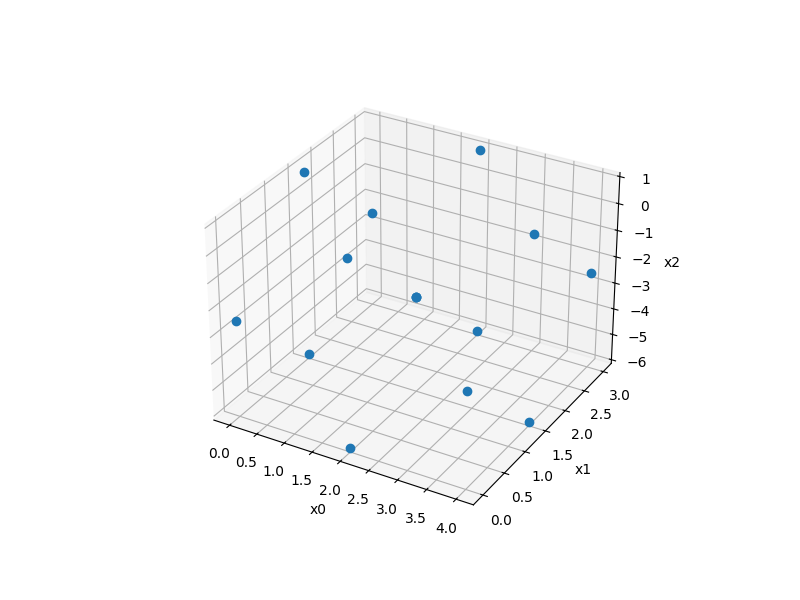
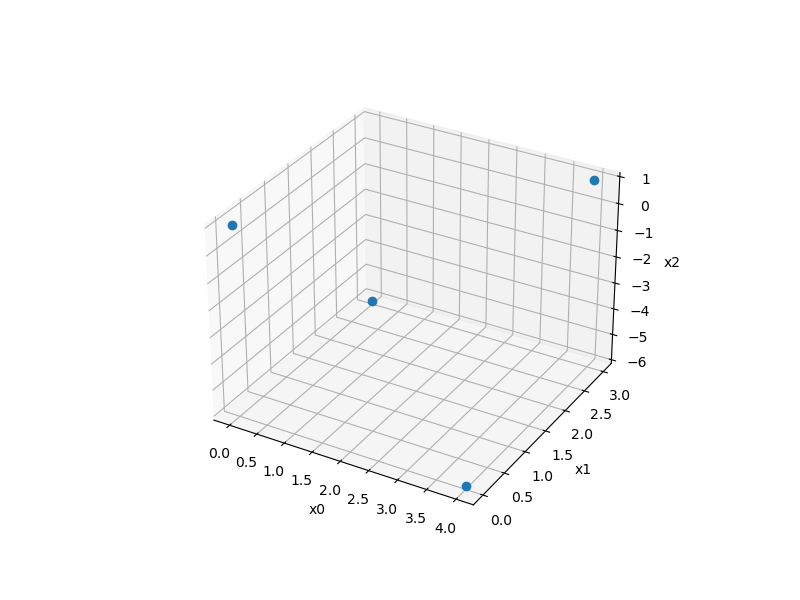
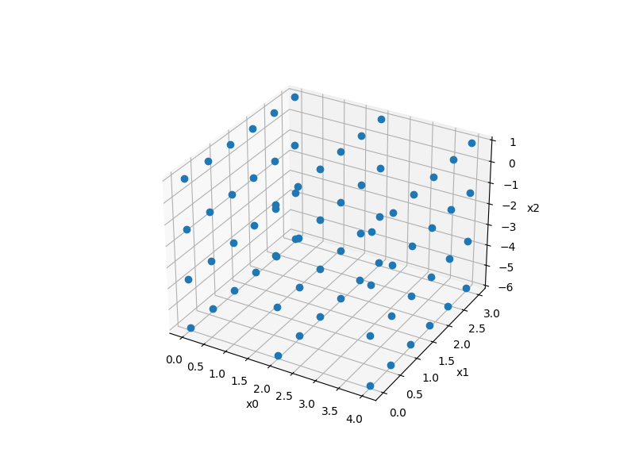
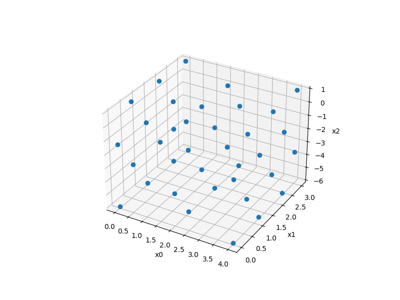

pyDOE sampling methods
======================

pyDOE is a package for design of experiments [1]_ (LHS implementation in SMT is based on pyDOE LHS). 

Main DOE functions provided by pyDOE are made available through an adapter base 
class `PyDoeSamplingMethod` which makes them compliant with the `SamplingMethod` base class interface.

While historically the sampling method interface of SMT requires to specify a number of points, pyDOE design
methods output a number of points which is only determined by the dimension of x and other method-specific options.

The following designs are exposed:

* Box Behnken design
* Plackett-Burman design
* Factorial design
* Generalized Subset Design

See pyDOE3 documentation [2]_

References

.. [1] https://github.com/relf/pyDOE3 

.. [2] https://pydoe3.readthedocs.io/en/stable 

Box Behnken sampling
--------------------

Usage
^^^^^

.. code-block:: python

  import numpy as np
  import matplotlib.pyplot as plt
  
  from smt.sampling_methods import BoxBehnken
  
  xlimits = np.array([[0.0, 4.0], [0.0, 3.0], [-6.0, 1.0]])
  sampling = BoxBehnken(xlimits=xlimits)
  
  x = sampling()
  
  print(x.shape)
  
  ax = plt.axes(projection="3d")
  ax.plot3D(x[:, 0], x[:, 1], x[:, 2], "o")
  
  ax.set_xlabel("x0")
  ax.set_ylabel("x1")
  ax.set_zlabel("x2")
  plt.show()
  
::

  (15, 3)
  

Options
^^^^^^^

.. list-table:: List of options
  :header-rows: 1
  :widths: 15, 10, 20, 20, 30
  :stub-columns: 0

  *  -  Option
     -  Default
     -  Acceptable values
     -  Acceptable types
     -  Description
  *  -  xlimits
     -  None
     -  None
     -  ['ndarray']
     -  The interval of the domain in each dimension with shape nx x 2 (required)

Plackett-Burman sampling
------------------------

Usage
^^^^^

.. code-block:: python

  import numpy as np
  import matplotlib.pyplot as plt
  
  from smt.sampling_methods import PlackettBurman
  
  xlimits = np.array([[0.0, 4.0], [0.0, 3.0], [-6.0, 1.0]])
  sampling = PlackettBurman(xlimits=xlimits)
  
  x = sampling()
  
  print(x.shape)
  
  ax = plt.axes(projection="3d")
  ax.plot3D(x[:, 0], x[:, 1], x[:, 2], "o")
  
  ax.set_xlabel("x0")
  ax.set_ylabel("x1")
  ax.set_zlabel("x2")
  plt.show()
  
::

  (4, 3)
  

Options
^^^^^^^

.. list-table:: List of options
  :header-rows: 1
  :widths: 15, 10, 20, 20, 30
  :stub-columns: 0

  *  -  Option
     -  Default
     -  Acceptable values
     -  Acceptable types
     -  Description
  *  -  xlimits
     -  None
     -  None
     -  ['ndarray']
     -  The interval of the domain in each dimension with shape nx x 2 (required)

Factorial sampling
------------------

Usage
^^^^^

.. code-block:: python

  import numpy as np
  import matplotlib.pyplot as plt
  
  from smt.sampling_methods import Factorial
  
  xlimits = np.array([[0.0, 4.0], [0.0, 3.0], [-6.0, 1.0]])
  sampling = Factorial(xlimits=xlimits, levels=[3, 6, 4])
  
  x = sampling()
  
  print(x.shape)
  
  ax = plt.axes(projection="3d")
  ax.plot3D(x[:, 0], x[:, 1], x[:, 2], "o")
  
  ax.set_xlabel("x0")
  ax.set_ylabel("x1")
  ax.set_zlabel("x2")
  plt.show()
  
::

  (72, 3)
  

Options
^^^^^^^

.. list-table:: List of options
  :header-rows: 1
  :widths: 15, 10, 20, 20, 30
  :stub-columns: 0

  *  -  Option
     -  Default
     -  Acceptable values
     -  Acceptable types
     -  Description
  *  -  xlimits
     -  None
     -  None
     -  ['ndarray']
     -  The interval of the domain in each dimension with shape nx x 2 (required)
  *  -  levels
     -  None
     -  None
     -  ['list']
     -  number of factor levels per factor in design

Generalized Subset sampling
---------------------------

Usage
^^^^^

.. code-block:: python

  import numpy as np
  import matplotlib.pyplot as plt
  
  from smt.sampling_methods import Gsd
  
  xlimits = np.array([[0.0, 4.0], [0.0, 3.0], [-6.0, 1.0]])
  sampling = Gsd(xlimits=xlimits, levels=[3, 6, 4])
  
  x = sampling()
  
  print(x.shape)
  
  ax = plt.axes(projection="3d")
  ax.plot3D(x[:, 0], x[:, 1], x[:, 2], "o")
  
  ax.set_xlabel("x0")
  ax.set_ylabel("x1")
  ax.set_zlabel("x2")
  plt.show()
  
::

  (36, 3)
  

Options
^^^^^^^

.. list-table:: List of options
  :header-rows: 1
  :widths: 15, 10, 20, 20, 30
  :stub-columns: 0

  *  -  Option
     -  Default
     -  Acceptable values
     -  Acceptable types
     -  Description
  *  -  xlimits
     -  None
     -  None
     -  ['ndarray']
     -  The interval of the domain in each dimension with shape nx x 2 (required)
  *  -  levels
     -  None
     -  None
     -  ['list']
     -  number of factor levels per factor in design
  *  -  reduction
     -  2
     -  None
     -  ['int']
     -  Reduction factor (bigger than 1). Larger `reduction` means fewer experiments in the design and more possible complementary designs

