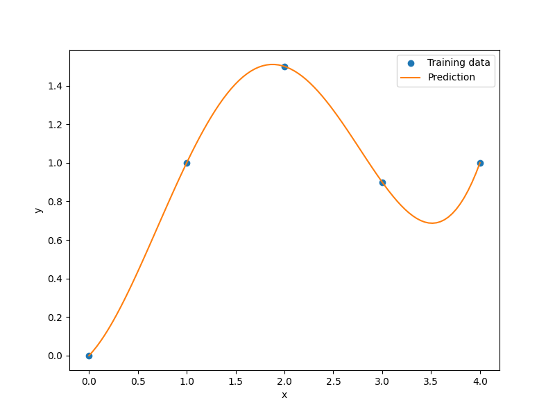

Surrogate modeling methods
==========================

SMT contains the surrogate modeling methods listed below.

.. toctree::
   :maxdepth: 1
   :titlesonly:

   surrogate_models/rbf
   surrogate_models/idw
   surrogate_models/rmts
   surrogate_models/ls
   surrogate_models/qp
   surrogate_models/krg
   surrogate_models/kpls
   surrogate_models/kplsk
   surrogate_models/gekpls
   surrogate_models/genn
   surrogate_models/mgp

Usage
-----

.. code-block:: python

  import numpy as np
  import matplotlib.pyplot as plt
  
  from smt.surrogate_models import RBF
  
  xt = np.array([0.0, 1.0, 2.0, 3.0, 4.0])
  yt = np.array([0.0, 1.0, 1.5, 0.9, 1.0])
  
  sm = RBF(d0=5)
  sm.set_training_values(xt, yt)
  sm.train()
  
  num = 100
  x = np.linspace(0.0, 4.0, num)
  y = sm.predict_values(x)
  
  plt.plot(xt, yt, "o")
  plt.plot(x, y)
  plt.xlabel("x")
  plt.ylabel("y")
  plt.legend(["Training data", "Prediction"])
  plt.show()
  
::

  ___________________________________________________________________________
     
                                      RBF
  ___________________________________________________________________________
     
   Problem size
     
        # training points.        : 5
     
  ___________________________________________________________________________
     
   Training
     
     Training ...
        Initializing linear solver ...
           Performing LU fact. (5 x 5 mtx) ...
           Performing LU fact. (5 x 5 mtx) - done. Time (sec):  0.0000000
        Initializing linear solver - done. Time (sec):  0.0000000
        Solving linear system (col. 0) ...
           Back solving (5 x 5 mtx) ...
           Back solving (5 x 5 mtx) - done. Time (sec):  0.0000000
        Solving linear system (col. 0) - done. Time (sec):  0.0000000
     Training - done. Time (sec):  0.0000000
  ___________________________________________________________________________
     
   Evaluation
     
        # eval points. : 100
     
     Predicting ...
     Predicting - done. Time (sec):  0.0000000
     
     Prediction time/pt. (sec) :  0.0000000
     
  

SurrogateModel class API
------------------------

All surrogate modeling methods implement the following API, though some of the functions in the API are not supported by all methods.

.. autoclass:: smt.surrogate_models.surrogate_model.SurrogateModel

  .. automethod:: smt.surrogate_models.surrogate_model.SurrogateModel.__init__

  .. automethod:: smt.surrogate_models.surrogate_model.SurrogateModel.set_training_values

  .. automethod:: smt.surrogate_models.surrogate_model.SurrogateModel.set_training_derivatives

  .. automethod:: smt.surrogate_models.surrogate_model.SurrogateModel.train

  .. automethod:: smt.surrogate_models.surrogate_model.SurrogateModel.predict_values

  .. automethod:: smt.surrogate_models.surrogate_model.SurrogateModel.predict_derivatives

  .. automethod:: smt.surrogate_models.surrogate_model.SurrogateModel.predict_output_derivatives

  .. automethod:: smt.surrogate_models.surrogate_model.SurrogateModel.predict_variances
