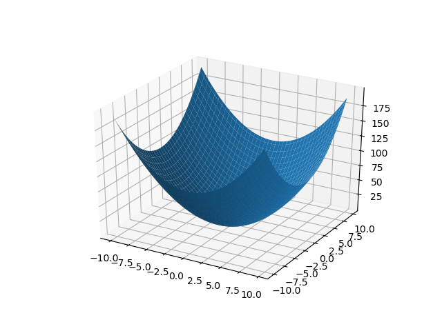

GEKPLS
======

GEKPLS is a gradient-enhaced kriging with partial least squares approach.
Gradient-enhaced kriging (GEK) is an extention of kriging which supports gradient information [1]_.
GEK is usually more accurate than kriging, however, it is not computationally efficient when the number of inputs, the number of sampling points, or both, are high.
This is mainly due to the size of the corresponding correlation matrix that increases proportionally with both the number of inputs and the number of sampling points.

To address these issues, GEKPLS exploits the gradient information with a slight increase of the size of the correlation matrix and reduces the number of hyperparameters.
The key idea of GEKPLS consists in generating a set of approximating points around each sampling points using the first order Taylor approximation method.
Then, the PLS method is applied several times, each time on a different number of sampling points with the associated sampling points.
Each PLS provides a set of coefficients that gives the contribution of each variable nearby the associated sampling point to the output.
Finally, an average of all PLS coefficients is computed to get the global influence to the output.
Denoting these coefficients by :math:`\left(w_1^{(k)},\dots,w_{nx}^{(k)}\right)`, the GEKPLS Gaussian kernel function is given by:

.. math ::
  k\left({\bf x^{(i)}},{\bf x^{(j)}}\right)=\sigma\prod\limits_{l=1}^{nx} \prod\limits_{k=1}^h\exp\left(-\theta_k\left(w_l^{(k)}x_l^{(i)}-w_l^{(k)}x_l^{(j)}\right)^{2}\right)

This approach reduces the number of hyperparameters (reduced dimension) from :math:`nx` to :math:`h` with :math:`nx>>h`.

As previously mentioned, PLS is applied several times with respect to each sampling point, which provides the influence of each input variable around that point.
The idea here is to add only m approximating points :math:`(m \in [1, nx])` around each sampling point.
Only the :math:`m` highest coefficients given by the first principal component are considered, which usually contains the most useful information.
More details of such approach are given in [2]_.

.. [1] Forrester, I. J. and Sobester, A. and Keane, A. J., Engineering Design via Surrogate Modeling: A Practical Guide. Wiley, 2008 (Chapter 7).

.. [2] Bouhlel, M. A., & Martins, J. R. (2019). Gradient-enhanced kriging for high-dimensional problems. Engineering with Computers, 35(1), 157-173.

Usage
-----

.. code-block:: python

  import numpy as np
  from mpl_toolkits.mplot3d import Axes3D
  import matplotlib.pyplot as plt
  
  from smt.surrogate_models import GEKPLS
  from smt.problems import Sphere
  from smt.sampling_methods import LHS
  
  # Construction of the DOE
  fun = Sphere(ndim=2)
  sampling = LHS(xlimits=fun.xlimits, criterion="m")
  xt = sampling(20)
  yt = fun(xt)
  # Compute the gradient
  for i in range(2):
      yd = fun(xt, kx=i)
      yt = np.concatenate((yt, yd), axis=1)
  
  # Build the GEKPLS model
  n_comp = 2
  sm = GEKPLS(
      theta0=[1e-2] * n_comp,
      xlimits=fun.xlimits,
      extra_points=1,
      print_prediction=False,
      n_comp=n_comp,
  )
  sm.set_training_values(xt, yt[:, 0])
  for i in range(2):
      sm.set_training_derivatives(xt, yt[:, 1 + i].reshape((yt.shape[0], 1)), i)
  sm.train()
  
  # Test the model
  X = np.arange(fun.xlimits[0, 0], fun.xlimits[0, 1], 0.25)
  Y = np.arange(fun.xlimits[1, 0], fun.xlimits[1, 1], 0.25)
  X, Y = np.meshgrid(X, Y)
  Z = np.zeros((X.shape[0], X.shape[1]))
  
  for i in range(X.shape[0]):
      for j in range(X.shape[1]):
          Z[i, j] = sm.predict_values(
              np.hstack((X[i, j], Y[i, j])).reshape((1, 2))
          )
  
  fig = plt.figure()
  ax = fig.gca(projection="3d")
  surf = ax.plot_surface(X, Y, Z)
  
  plt.show()
  
::

  ___________________________________________________________________________
     
                                    GEKPLS
  ___________________________________________________________________________
     
   Problem size
     
        # training points.        : 20
     
  ___________________________________________________________________________
     
   Training
     
     Training ...
     Training - done. Time (sec):  0.1266608
  

Options
-------

.. list-table:: List of options
  :header-rows: 1
  :widths: 15, 10, 20, 20, 30
  :stub-columns: 0

  *  -  Option
     -  Default
     -  Acceptable values
     -  Acceptable types
     -  Description
  *  -  print_global
     -  True
     -  None
     -  ['bool']
     -  Global print toggle. If False, all printing is suppressed
  *  -  print_training
     -  True
     -  None
     -  ['bool']
     -  Whether to print training information
  *  -  print_prediction
     -  True
     -  None
     -  ['bool']
     -  Whether to print prediction information
  *  -  print_problem
     -  True
     -  None
     -  ['bool']
     -  Whether to print problem information
  *  -  print_solver
     -  True
     -  None
     -  ['bool']
     -  Whether to print solver information
  *  -  poly
     -  constant
     -  ['constant', 'linear', 'quadratic']
     -  ['str']
     -  Regression function type
  *  -  corr
     -  squar_exp
     -  ['abs_exp', 'squar_exp']
     -  ['str']
     -  Correlation function type
  *  -  categorical_kernel
     -  None
     -  ['continuous_relaxation_matrix_kernel', 'gower_matrix_kernel', 'exponential_homoscedastic_matrix_kernel', 'homoscedastic_matrix_kernel']
     -  None
     -  The kernel to use for categorical inputs. Only for non continuous Kriging
  *  -  xtypes
     -  None
     -  None
     -  ['list']
     -  x type specifications: either FLOAT for continuous, INT for integer or (ENUM n) for categorical dimension with n levels
  *  -  nugget
     -  2.220446049250313e-14
     -  None
     -  ['float']
     -  a jitter for numerical stability
  *  -  theta0
     -  [0.01]
     -  None
     -  ['list', 'ndarray']
     -  Initial hyperparameters
  *  -  theta_bounds
     -  [1e-06, 20.0]
     -  None
     -  ['list', 'ndarray']
     -  bounds for hyperparameters
  *  -  hyper_opt
     -  Cobyla
     -  ['Cobyla', 'TNC']
     -  ['str']
     -  Optimiser for hyperparameters optimisation
  *  -  eval_noise
     -  False
     -  [True, False]
     -  ['bool']
     -  noise evaluation flag
  *  -  noise0
     -  [0.0]
     -  None
     -  ['list', 'ndarray']
     -  Initial noise hyperparameters
  *  -  noise_bounds
     -  [2.220446049250313e-14, 10000000000.0]
     -  None
     -  ['list', 'ndarray']
     -  bounds for noise hyperparameters
  *  -  use_het_noise
     -  False
     -  [True, False]
     -  ['bool']
     -  heteroscedastic noise evaluation flag
  *  -  n_start
     -  10
     -  None
     -  ['int']
     -  number of optimizer runs (multistart method)
  *  -  n_comp
     -  2
     -  None
     -  ['int']
     -  Number of principal components
  *  -  eval_n_comp
     -  False
     -  [True, False]
     -  ['bool']
     -  n_comp evaluation flag
  *  -  eval_comp_treshold
     -  1.0
     -  None
     -  ['float']
     -  n_comp evaluation treshold for Wold's R criterion
  *  -  cat_kernel_comps
     -  None
     -  None
     -  ['list']
     -  Number of components for PLS categorical kernel
  *  -  xlimits
     -  None
     -  None
     -  ['ndarray']
     -  Lower/upper bounds in each dimension - ndarray [nx, 2]
  *  -  delta_x
     -  0.0001
     -  None
     -  ['int', 'float']
     -  Step used in the FOTA
  *  -  extra_points
     -  0
     -  None
     -  ['int']
     -  Number of extra points per training point
