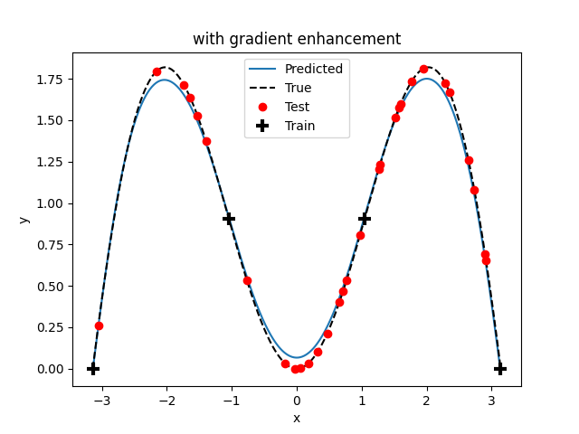

GENN
====

Gradient-Enhanced Neural Networks (GENN) are fully connected multi-layer perceptrons, whose training process was modified to
account for gradient information. Specifically, the parameters are learned by minimizing the Least Squares Estimator (LSE),
modified to account for partial derivatives.  The theory behind the algorithm can be found `here`_,
but suffice it to say that the model is trained in such a way so as to minimize not only the prediction error :math:`y - f(x)` of
the response, but also the prediction error :math:`{dy}/{dx} - f'(x)` of the partial derivatives. The chief benefit of gradient-enhancement
is better accuracy with fewer training points, compared to regular neural networks without gradient-enhancement. Note that GENN applies
to regression (single-output or multi-output), but not classification since there is no gradient in that case. The implementation
is fully vectorized and uses Adam optimization, mini-batch, and L2-norm regularization.

.. _here: https://github.com/SMTorg/smt/blob/master/doc/_src_docs/surrogate_models/genn_theory.pdf

Limitations
-----------

Gradient-enhanced methods only apply to the special use-case of computer aided design, where data is generated
synthetically using physics-based computer models, responses are continuous, and their gradient is defined. Furthermore,
gradient enhancement is only beneficial when the cost of obtaining the gradient is not excessive in the first place.
This is often true in computer-aided design with the advent of adjoint design methods for example, but it is not always
the case. The user should therefore carefully weight the benefit of gradient-enhanced methods depending on the application.

Usage
-----

.. code-block:: python

  import numpy as np
  import matplotlib.pyplot as plt
  from smt.surrogate_models.genn import GENN, load_smt_data
  
  # Training data
  lower_bound = -np.pi
  upper_bound = np.pi
  number_of_training_points = 4
  xt = np.linspace(lower_bound, upper_bound, number_of_training_points)
  yt = xt * np.sin(xt)
  dyt_dxt = np.sin(xt) + xt * np.cos(xt)
  
  # Validation data
  number_of_validation_points = 30
  xv = np.linspace(lower_bound, upper_bound, number_of_validation_points)
  yv = xv * np.sin(xv)
  dyv_dxv = np.sin(xv) + xv * np.cos(xv)
  
  # Truth model
  x = np.arange(lower_bound, upper_bound, 0.01)
  y = x * np.sin(x)
  
  # GENN
  genn = GENN()
  genn.options["alpha"] = 0.1  # learning rate that controls optimizer step size
  genn.options["beta1"] = 0.9  # tuning parameter to control ADAM optimization
  genn.options["beta2"] = 0.99  # tuning parameter to control ADAM optimization
  genn.options[
      "lambd"
  ] = 0.1  # lambd = 0. = no regularization, lambd > 0 = regularization
  genn.options[
      "gamma"
  ] = 1.0  # gamma = 0. = no grad-enhancement, gamma > 0 = grad-enhancement
  genn.options["deep"] = 2  # number of hidden layers
  genn.options["wide"] = 6  # number of nodes per hidden layer
  genn.options[
      "mini_batch_size"
  ] = 64  # used to divide data into training batches (use for large data sets)
  genn.options["num_epochs"] = 20  # number of passes through data
  genn.options[
      "num_iterations"
  ] = 100  # number of optimizer iterations per mini-batch
  genn.options["is_print"] = True  # print output (or not)
  load_smt_data(
      genn, xt, yt, dyt_dxt
  )  # convenience function to read in data that is in SMT format
  genn.train()  # API function to train model
  genn.plot_training_history()  # non-API function to plot training history (to check convergence)
  genn.goodness_of_fit(
      xv, yv, dyv_dxv
  )  # non-API function to check accuracy of regression
  y_pred = genn.predict_values(
      x
  )  # API function to predict values at new (unseen) points
  
  # Plot
  fig, ax = plt.subplots()
  ax.plot(x, y_pred)
  ax.plot(x, y, "k--")
  ax.plot(xv, yv, "ro")
  ax.plot(xt, yt, "k+", mew=3, ms=10)
  ax.set(xlabel="x", ylabel="y", title="GENN")
  ax.legend(["Predicted", "True", "Test", "Train"])
  plt.show()
  
::

  ___________________________________________________________________________
     
                                     GENN
  ___________________________________________________________________________
     
   Problem size
     
        # training points.        : 4
     
  ___________________________________________________________________________
     
   Training
     
     Training ...
  epoch = 0, mini-batch = 0, avg cost = 22.980
  epoch = 1, mini-batch = 0, avg cost =  7.601
  epoch = 2, mini-batch = 0, avg cost =  7.444
  epoch = 3, mini-batch = 0, avg cost =  7.356
  epoch = 4, mini-batch = 0, avg cost =  2.718
  epoch = 5, mini-batch = 0, avg cost =  0.694
  epoch = 6, mini-batch = 0, avg cost =  0.654
  epoch = 7, mini-batch = 0, avg cost =  0.643
  epoch = 8, mini-batch = 0, avg cost =  0.638
  epoch = 9, mini-batch = 0, avg cost =  0.634
  epoch = 10, mini-batch = 0, avg cost =  0.631
  epoch = 11, mini-batch = 0, avg cost =  0.630
  epoch = 12, mini-batch = 0, avg cost =  0.629
  epoch = 13, mini-batch = 0, avg cost =  0.627
  epoch = 14, mini-batch = 0, avg cost =  0.627
  epoch = 15, mini-batch = 0, avg cost =  0.626
  epoch = 16, mini-batch = 0, avg cost =  0.626
  epoch = 17, mini-batch = 0, avg cost =  0.626
  epoch = 18, mini-batch = 0, avg cost =  0.626
  epoch = 19, mini-batch = 0, avg cost =  0.626
     Training - done. Time (sec):  4.6699998
  ___________________________________________________________________________
     
   Evaluation
     
        # eval points. : 629
     
     Predicting ...
     Predicting - done. Time (sec):  0.0000000
     
     Prediction time/pt. (sec) :  0.0000000
     
  

Options
-------

.. list-table:: List of options
  :header-rows: 1
  :widths: 15, 10, 20, 20, 30
  :stub-columns: 0

  *  -  Option
     -  Default
     -  Acceptable values
     -  Acceptable types
     -  Description
  *  -  print_global
     -  True
     -  None
     -  ['bool']
     -  Global print toggle. If False, all printing is suppressed
  *  -  print_training
     -  True
     -  None
     -  ['bool']
     -  Whether to print training information
  *  -  print_prediction
     -  True
     -  None
     -  ['bool']
     -  Whether to print prediction information
  *  -  print_problem
     -  True
     -  None
     -  ['bool']
     -  Whether to print problem information
  *  -  print_solver
     -  True
     -  None
     -  ['bool']
     -  Whether to print solver information
  *  -  alpha
     -  0.5
     -  None
     -  ['int', 'float']
     -  optimizer learning rate
  *  -  beta1
     -  0.9
     -  None
     -  ['int', 'float']
     -  Adam optimizer tuning parameter
  *  -  beta2
     -  0.99
     -  None
     -  ['int', 'float']
     -  Adam optimizer tuning parameter
  *  -  lambd
     -  0.1
     -  None
     -  ['int', 'float']
     -  regularization coefficient
  *  -  gamma
     -  1.0
     -  None
     -  ['int', 'float']
     -  gradient-enhancement coefficient
  *  -  deep
     -  2
     -  None
     -  ['int']
     -  number of hidden layers
  *  -  wide
     -  2
     -  None
     -  ['int']
     -  number of nodes per hidden layer
  *  -  mini_batch_size
     -  64
     -  None
     -  ['int']
     -  split data into batches of specified size
  *  -  num_epochs
     -  10
     -  None
     -  ['int']
     -  number of random passes through the data
  *  -  num_iterations
     -  100
     -  None
     -  ['int']
     -  number of optimizer iterations per mini-batch
  *  -  seed
     -  None
     -  None
     -  ['int']
     -  random seed to ensure repeatability of results when desired
  *  -  is_print
     -  True
     -  None
     -  ['bool']
     -  print progress (or not)
