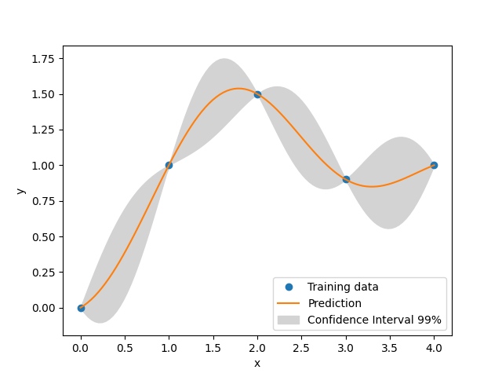

GPX
===

`GPX` is a rewrite of Kriging (aka `KRG`) and `KPLS` models of SMT in Rust. 
Actually `GPX` is a wrapper of the `Gpx` model from the `egobox` library which is adapted here to the surrogate models API of SMT.

If you find the performances of the Python implementation (training/prediction time) not sufficient for your use case,
you may want to give `GPX` a try.

You will need to install the `egobox` extra dependency with the command: `pip install smt[gpx]`

More information about the `egobox` library can be found in [1]_.

Limitations
-----------

* wrt `KRG/KPLS`: `GPX` does not implement mixed integer or hierarchical variables, derivatives, noise handling or KRG sampling.

* wrt `egobox::Gpx`: `GPX` does not give access to mixture of gaussian processes, does not give access to GP sampling

See [2]_ for more information on `egobox::Gpx`.  

Reference
---------

.. [1] `Lafage, R., (2022). egobox, a Rust toolbox for efficient global optimization. Journal of Open Source Software, 7(78), 4737, <https://doi.org/10.21105/joss.04737>`_

.. [2] `Tutorial egobox::Gpx <https://github.com/relf/egobox/blob/cf7e50cb23b11fda9dd255c2b29178f6d51c3242/doc/Gpx_Tutorial.ipynb>`_

Usage
-----

Example
^^^^^^^

.. code-block:: python

  import matplotlib.pyplot as plt
  import numpy as np
  
  from smt.surrogate_models import GPX
  
  xt = np.array([0.0, 1.0, 2.0, 3.0, 4.0])
  yt = np.array([0.0, 1.0, 1.5, 0.9, 1.0])
  
  sm = GPX(theta0=[1e-2])
  sm.set_training_values(xt, yt)
  sm.train()
  
  num = 100
  x = np.linspace(0.0, 4.0, num)
  y = sm.predict_values(x)
  # estimated variance
  s2 = sm.predict_variances(x)
  
  _, axs = plt.subplots(1)
  # add a plot with variance
  axs.plot(xt, yt, "o")
  axs.plot(x, y)
  axs.fill_between(
      np.ravel(x),
      np.ravel(y - 3 * np.sqrt(s2)),
      np.ravel(y + 3 * np.sqrt(s2)),
      color="lightgrey",
  )
  axs.set_xlabel("x")
  axs.set_ylabel("y")
  axs.legend(
      ["Training data", "Prediction", "Confidence Interval 99%"],
      loc="lower right",
  )
  
  plt.show()
  
::

  ___________________________________________________________________________
     
                                      GPX
  ___________________________________________________________________________
     
   Problem size
     
        # training points.        : 5
     
  ___________________________________________________________________________
     
   Training
     
     Training ...
     Training - done. Time (sec):  0.0080314
  ___________________________________________________________________________
     
   Evaluation
     
        # eval points. : 100
     
     Predicting ...
     Predicting - done. Time (sec):  0.0000000
     
     Prediction time/pt. (sec) :  0.0000000
     
  

Options
-------

.. list-table:: List of options
  :header-rows: 1
  :widths: 15, 10, 20, 20, 30
  :stub-columns: 0

  *  -  Option
     -  Default
     -  Acceptable values
     -  Acceptable types
     -  Description
  *  -  print_global
     -  True
     -  None
     -  ['bool']
     -  Global print toggle. If False, all printing is suppressed
  *  -  print_training
     -  True
     -  None
     -  ['bool']
     -  Whether to print training information
  *  -  print_prediction
     -  True
     -  None
     -  ['bool']
     -  Whether to print prediction information
  *  -  print_problem
     -  True
     -  None
     -  ['bool']
     -  Whether to print problem information
  *  -  print_solver
     -  True
     -  None
     -  ['bool']
     -  Whether to print solver information
  *  -  poly
     -  constant
     -  ['constant', 'linear', 'quadratic']
     -  ['str']
     -  Regression function type
  *  -  corr
     -  squar_exp
     -  ['abs_exp', 'squar_exp', 'matern32', 'matern52']
     -  None
     -  Correlation function type
  *  -  theta0
     -  [0.01]
     -  None
     -  ['list', 'ndarray']
     -  Initial hyperparameters
  *  -  theta_bounds
     -  [1e-06, 20.0]
     -  None
     -  ['list', 'ndarray']
     -  Bounds for hyperparameters
  *  -  n_start
     -  10
     -  None
     -  ['int']
     -  Number of optimizer runs (multistart method)
  *  -  kpls_dim
     -  None
     -  None
     -  ['NoneType', 'int']
     -  Number of PLS components used for dimension reduction
  *  -  seed
     -  42
     -  None
     -  ['int']
     -  Seed number which controls random draws                 for internal optim (set by default to get reproductibility)
